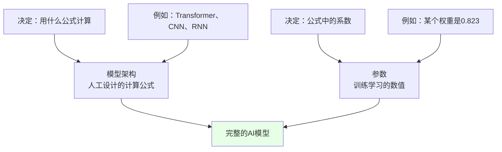
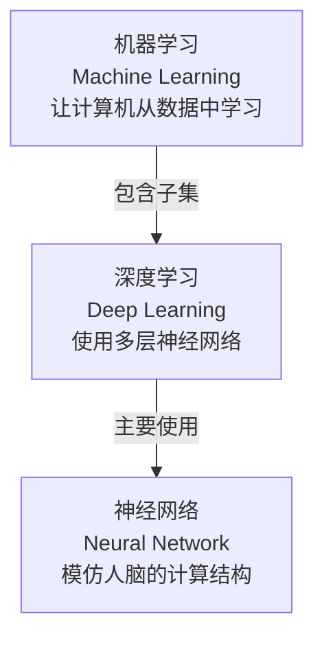
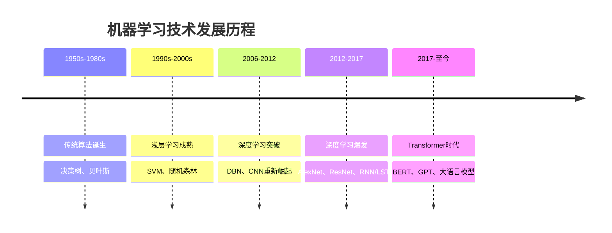
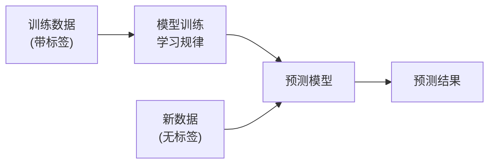
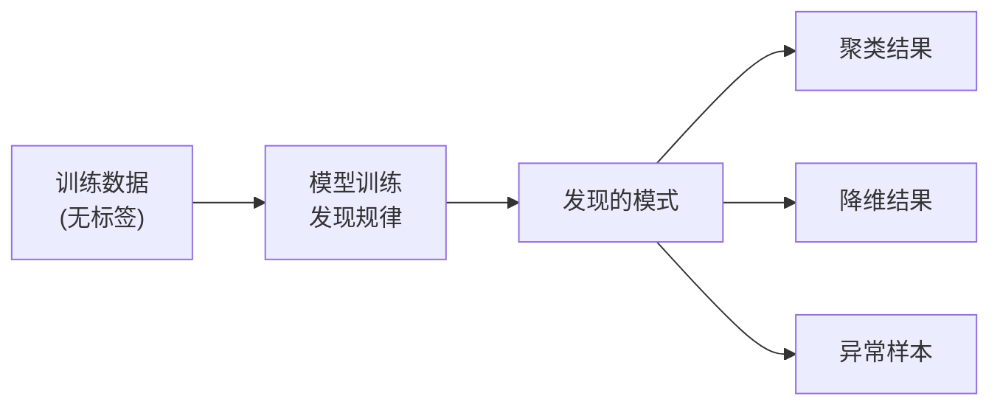
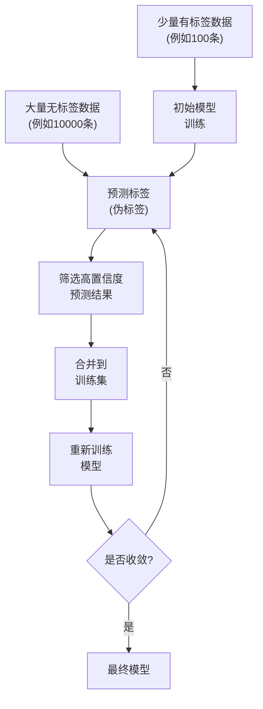
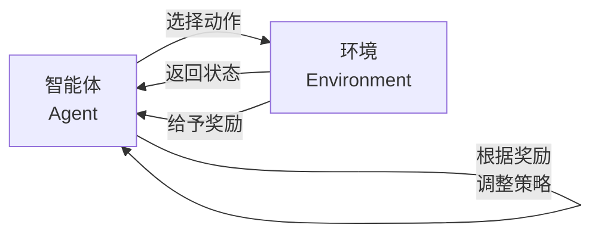

本文将全面介绍机器学习的基础知识体系。我们将从`AI`模型的本质开始，理解模型内部的构成；然后介绍机器学习的基础概念、技术分类和学习方式，帮助你建立完整的知识框架。

## AI模型的本质

在深入学习各种机器学习技术之前，让我们先从最根本的问题开始：当我们说要"训练一个`AI`模型"时，这个"模型"究竟指的是什么？它内部包含什么？为什么需要训练？理解这些基本问题，将帮助你更好地把握后续的各种概念和技术。


### 模型 = 参数的集合

**模型就是一堆数字**：无论是`ChatGPT`还是其他大模型，底层其实就是**一大堆参数**(数字)，这些参数存储在神经网络的连接中。

#### 什么是参数？

在神经网络中，参数主要包括：
- **权重**(`Weight`)：决定输入信息的重要程度
- **偏置**(`Bias`)：调整输出的阈值

**通俗比喻**：就像一个复杂的公式，参数就是公式中的系数。例如：
```text
输出 = w1 × 输入1 + w2 × 输入2 + w3 × 输入3 + b
```
其中`w1、w2、w3`是权重，`b`是偏置，这些都是参数。

一个大模型可能有**数十亿甚至数千亿个这样的参数**！

#### 参数量是什么？

**参数量**指的是模型中所有可训练参数的总数，是衡量模型规模的关键指标。

| 模型 | 参数量 | 大小(存储空间) | 通俗理解 |
|------|--------|----------------|---------|
| **`BERT-Base`** | `110M`(`1.1`亿) | `~440MB` | 小型车 |
| **`GPT-2`** | `1.5B`(`15`亿) | `~6GB` | 中型卡车 |
| **`LLaMA-7B`** | `7B`(`70`亿) | `~14GB` | 大型货车 |
| **`GPT-3`** | `175B`(`1750`亿) | `~350GB` | 巨型货轮 |
| **`GPT-4`** | 约`1.7T`(`1.7`万亿) | `~3.5TB` | 航空母舰 |

**参数量的重要性**：

✅ **更多参数 = 更强能力**(通常情况下)
- 参数越多，模型能记忆和理解的知识越丰富
- 能处理更复杂的任务和关系

❌ **更多参数 = 更高成本**
- 需要更多的训练数据
- 需要更强的计算资源(更多`GPU`、更长时间)
- 需要更大的存储空间
- 推理(使用)时速度更慢、成本更高

**训练的目标**：通过大量数据和反复迭代，让这数十亿个参数调整到"最佳状态"，使得模型的预测结果符合人类的预期。

**举例说明**：
- 训练前：参数都是随机的，模型胡言乱语
- 训练中：通过看大量文本，参数逐渐调整，模型开始能写出通顺的句子
- 训练后：参数达到最佳状态，模型能理解复杂问题并给出合理回答

### 模型架构的作用

看到这里你可能会问：**既然参数要用在公式里，那这些计算公式是从哪来的？不同的模型用的公式一样吗？**

这是个非常关键的问题！答案是：**计算公式由模型架构**(`Model Architecture`)**决定，是人工设计的。**

#### 什么是模型架构？

**模型架构**就是神经网络的"设计图纸"，它定义了：
- 神经网络有多少层
- 每一层如何计算(用什么公式)
- 层与层之间如何连接
- 数据如何在网络中流动

**通俗比喻**：
- **模型架构** = 建筑设计图纸(定义房子的结构、楼层、房间布局)
- **模型参数** = 具体的建筑材料和尺寸(通过训练确定)

#### 训练 vs 设计：两个不同的阶段

| 维度 | 模型架构(公式) | 模型参数(系数) |
|------|--------------|------------|
| **由谁决定** | 人工设计 | 训练学习 |
| **何时确定** | 训练之前 | 训练过程中 |
| **是否可变** | 训练中固定不变 | 不断调整优化 |
| **例子** | `Transformer`有`12`层，每层用自注意力机制 | 第`3`层第`5`个神经元的权重是`0.823` |
| **类比** | 房子的结构设计：`3`层楼，每层`4`个房间 | 每个房间的具体尺寸和材料 |

#### 不同模型有不同的架构

是的！**不同的`AI`大模型使用完全不同的架构，因此计算公式也不同**。

| 模型架构 | 代表模型 | 核心计算方式 | 擅长领域 |
|---------|---------|------------|---------|
| **`Transformer`** | `GPT`、`BERT`、`LLaMA` | 自注意力机制(`Self-Attention`) | 文本生成、理解 |
| **`MoE`(混合专家)** | `Mixtral`、`GPT-4`(据传)、`Switch Transformer` | 稀疏激活的专家网络 | 大规模文本处理 |
| **`Vision Transformer`** | `ViT`、`Swin Transformer` | 图像分块+自注意力 | 图像识别、分类 |
| **多模态模型** | `CLIP`、`GPT-4V`、`Flamingo` | 跨模态对齐+融合 | 图文理解、视觉问答 |
| **状态空间模型(`SSM`)** | `Mamba`、`S4` | 状态空间递归 | 长序列建模 |
| **`CNN`(卷积神经网络)** | `ResNet`、`VGG`、`EfficientNet` | 卷积运算(`Convolution`) | 图像识别 |
| **`RNN`(循环神经网络)** | `LSTM`、`GRU` | 序列递归(`Recurrence`) | 时间序列、语音 |
| **`GAN`(生成对抗网络)** | `StyleGAN`、`CycleGAN` | 生成器-判别器对抗 | 图像生成、风格迁移 |
| **扩散模型** | `Stable Diffusion`、`DALL-E 3` | 逐步去噪(`Denoising`) | 高质量图像生成 |

**举例说明**：

**1. `Transformer`架构**(`GPT`系列)

核心公式是**自注意力机制**：
```text
注意力分数 = softmax((Q × K^T) / √d)
输出 = 注意力分数 × V
```
其中`Q、K、V`都是通过参数矩阵计算出来的。

**2. `MoE`架构**(混合专家模型)

核心思想是**稀疏激活**：
```text
输出 = Σ(路由权重[i] × 专家[i](输入))
```
每次输入只激活少数几个专家，大幅降低计算量的同时保持大参数量。

**3. `Vision Transformer`架构**(视觉Transformer)

将图像切分为小块，然后应用`Transformer`：
```text
图像块 = 切分(图像)
嵌入 = 线性投影(图像块)
输出 = Transformer编码器(嵌入)
```

**4. `CNN`架构**(图像识别)

核心公式是**卷积运算**：
```text
输出[i][j] = Σ(输入[i+m][j+n] × 卷积核[m][n])
```

**5. 状态空间模型(`SSM`)**

使用状态空间表示处理序列：
```text
状态[t] = A × 状态[t-1] + B × 输入[t]
输出[t] = C × 状态[t] + D × 输入[t]
```
相比`Transformer`，在长序列上更高效。

**6. 简单神经网络**

最基础的全连接层公式：
```text
输出 = 激活函数(W × 输入 + b)
```

#### 为什么需要不同的架构？

不同的任务需要不同的"思考方式"：

| 任务特点 | 适合的架构 | 原因 |
|---------|-----------|------|
| **处理文本** | `Transformer` | 能同时关注所有词，理解上下文关系 |
| **大规模文本+效率** | `MoE` | 稀疏激活降低计算，保持强大能力 |
| **识别图像** | `CNN`、`ViT` | `CNN`提取局部特征，`ViT`捕捉全局关系 |
| **图文理解** | 多模态模型 | 统一处理视觉和语言信息 |
| **超长序列** | `SSM`(`Mamba`) | 线性复杂度，处理百万级token |
| **预测股票** | `RNN`/`LSTM` | 能记住历史信息，处理时间序列 |
| **生成图像** | `GAN`/扩散模型 | 专门设计用于创造新内容 |

#### 架构创新推动AI发展

`AI`的重大突破往往来自架构创新：

| 年份 | 架构创新 | 影响 |
|------|---------|------|
| **2012** | `AlexNet`(深度`CNN`) | 图像识别准确率大幅提升 |
| **2017** | `Transformer` | 开启大语言模型时代 |
| **2020** | `GPT-3`(大规模`Transformer`) | 展现惊人的通用能力 |
| **2021** | `ViT`(视觉Transformer) | Transformer在视觉领域取得突破 |
| **2021** | `CLIP`(多模态) | 统一图文理解，零样本学习 |
| **2022** | 扩散模型优化 | `Stable Diffusion`让AI绘画普及 |
| **2023** | `Mixtral`(`MoE`) | 开源高效的混合专家模型 |
| **2023** | `Mamba`(`SSM`) | 线性复杂度挑战Transformer |
| **2024** | `GPT-4V`(多模态) | 强大的视觉理解能力 |

#### 总结：架构 + 参数 = 完整模型



**核心要点**：
- **架构是框架**：定义了"怎么算"，是固定的设计
- **参数是内容**：决定了"算什么值"，是可学习的
- **两者缺一不可**：好的架构 + 好的参数 = 强大的模型
- **训练只调参数**：架构一旦确定，训练过程只优化参数，不改变架构本身


## 机器学习的基础概念

了解了`AI`模型由参数和架构组成后，接下来我们需要理解几个重要的基础概念：机器学习、深度学习和神经网络。这三者构成了现代`AI`技术的核心体系，既有联系又有区别。


### 机器学习 (Machine Learning)

**机器学习**是一种让计算机通过数据和经验自动学习并改进的技术，而不需要人为明确编程每一个规则。

**通俗理解**：就像教小孩认识水果，你不需要告诉他"圆形的、红色的、有果蒂的就是苹果"这样详细的规则，只需要给他看大量的苹果图片，他自己就能总结出"什么样的东西是苹果"。

### 深度学习 (Deep Learning)

**深度学习**是机器学习的一个子集，也是目前`AI`领域主流的学习技术，使用多层神经网络来学习数据的复杂特征。"深度"指的是网络层数很多，可以自动学习从简单到复杂的特征表示。

**通俗理解**：如果把机器学习比作"让计算机学习"，那深度学习就是"让计算机像人脑一样多层次地学习"。例如识别人脸时，第一层识别线条边缘，第二层识别五官，第三层识别整张脸，最后识别是谁。

### 神经网络 (Neural Network)

**神经网络**是深度学习的基础结构，它模仿人脑神经元的工作方式，由大量的人工神经元组成，通过多层结构进行信息处理。

**通俗理解**：就像人脑由数十亿个神经元连接组成，人工神经网络也是由大量的人工神经元(节点)连接而成。每个神经元接收输入，进行计算，然后传递给下一层。

**基本结构**：
- **输入层**：接收原始数据(例如：一张图片的像素值)
- **隐藏层**：进行特征提取和转换(可以有多层，层数越多越"深")
- **输出层**：给出最终结果(例如：这张图片是猫的概率是85%)

**核心概念**：
- **权重**(`Weight`)：连接的强度，决定信息传递的重要性
- **偏置**(`Bias`)：调整输出的阈值
- **激活函数**(`Activation Function`)：增加非线性能力，让网络能学习复杂模式

### 三者关系



**关系总结**：
- **机器学习**是最大的范畴，包含了所有让机器自动学习的方法
- **深度学习**是机器学习的一个分支，专注于使用多层神经网络
- **神经网络**是深度学习的核心工具和实现方式

| 维度 | 机器学习 | 深度学习 | 神经网络 |
|------|---------|---------|---------|
| **范围** | 最广泛 | 机器学习的子集 | 深度学习的核心结构 |
| **特征工程** | 通常需要人工设计特征 | 自动学习特征 | 通过多层结构自动提取特征 |
| **数据需求** | 中等 | 大量数据 | 取决于网络深度 |
| **计算需求** | 中等 | 非常高(通常需要`GPU`) | 高 |
| **可解释性** | 较高 | 较低 | 较低 |
| **典型算法** | 决策树、支持向量机、朴素贝叶斯 | `CNN`、`RNN`、`Transformer` | 前馈网络、卷积网络、循环网络 |


## 机器学习的技术路线

机器学习按照技术发展路线，可以分为**传统浅层机器学习**和**深度学习**两大类。这两类方法代表了不同的技术演进阶段，各有特点和适用场景。

### 传统浅层机器学习

**传统机器学习**指的是使用相对简单的算法和浅层模型进行学习的方法，这些方法在深度学习兴起之前占据主导地位。

#### 核心特点

**通俗理解**：就像用简单的规则和公式来解决问题，比如根据身高体重判断一个人是否超重，用简单的数学公式就能搞定。

**主要特征**：
- **模型结构简单**：通常只有一层或几层结构
- **需要特征工程**：人工设计和提取特征
- **数据需求适中**：不需要海量数据也能工作
- **可解释性强**：能清楚地理解模型的决策过程
- **计算资源少**：普通`CPU`就能运行

#### 常见算法

| 算法名称 | 核心思想 | 通俗理解 | 应用场景 |
|---------|---------|---------|---------|
| **决策树** | 通过一系列问题做决策 | 像玩"二十个问题"游戏猜东西 | 信贷审批、疾病诊断 |
| **随机森林** | 多个决策树投票 | 三个臭皮匠顶个诸葛亮 | 信用评分、推荐系统 |
| **支持向量机(`SVM`)** | 找到最佳分界线 | 用一条线把猫和狗分开 | 图像分类、文本分类 |
| **朴素贝叶斯** | 基于概率统计 | 根据历史经验判断概率 | 垃圾邮件过滤 |
| **逻辑回归** | 计算属于某类的概率 | 算出这封邮件是垃圾邮件的概率 | 广告点击预测 |
| **K近邻(`KNN`)** | 看邻居是什么 | 近朱者赤近墨者黑 | 推荐系统、异常检测 |

#### 优势与局限

**优势**：
- ✅ **训练快速**：几分钟到几小时就能训练完
- ✅ **数据需求少**：几千到几万条数据就够
- ✅ **容易理解**：能解释为什么做出某个决策
- ✅ **资源消耗低**：笔记本电脑就能跑
- ✅ **成熟稳定**：经过几十年验证的算法

**局限**：
- ❌ **需要特征工程**：需要人工设计特征，耗时费力
- ❌ **处理复杂问题能力有限**：难以处理图像、语音等高维数据
- ❌ **特征提取依赖专家经验**：不同领域需要不同的专业知识
- ❌ **性能天花板较低**：在复杂任务上难以达到深度学习的效果

**适用场景**：
- 数据量较小(几千到几万条)
- 特征明确且容易提取
- 需要模型可解释性
- 计算资源有限
- 简单的分类和回归任务

### 深度学习

**深度学习**使用多层神经网络自动学习数据的层次化特征表示，是当前`AI`领域的主流技术。相比传统方法，深度学习能够处理更复杂的数据和任务。

#### 核心特点

**通俗理解**：就像人类大脑一样，通过多层神经元的复杂连接来理解事物。看到一张图片时：
- 第`1`层：识别基本的线条和边缘
- 第`2`层：组合线条形成简单形状(圆形、方形等)
- 第`3`层：识别物体部件(眼睛、鼻子、轮子等)
- 第`4`层：识别完整物体(人脸、汽车等)
- 第`5`层及以上：理解场景和语义(这是什么、在做什么)

这种层次化的学习方式让模型能够自动发现数据中从简单到复杂的特征模式。

**主要特征**：
- **模型结构深**：通常有几十层甚至上百层
- **自动特征学习**：不需要人工设计特征，模型自己学
- **需要大量数据**：通常需要数百万条训练样本
- **计算密集**：需要强大的`GPU`支持
- **端到端学习**：从原始输入直接学到最终输出

**应用场景**：人脸识别、语音助手、自动驾驶、机器翻译、图像生成、`ChatGPT`等。

#### 主要架构类型

| 架构类型 | 代表模型 | 核心机制 | 通俗理解 | 擅长领域 |
|---------|---------|---------|---------|---------|
| **`CNN`卷积神经网络** | `ResNet`、`VGG`、`EfficientNet` | 卷积运算提取局部特征 | 像扫描仪一样，一块一块地看图片 | 图像识别、物体检测 |
| **`RNN`循环神经网络** | `LSTM`、`GRU` | 序列信息记忆 | 像看电影，能记住前面的情节 | 语音识别、时间序列 |
| **`Transformer`** | `GPT`、`BERT`、`LLaMA` | 自注意力机制 | 能同时关注所有信息并找到关联 | 文本生成、翻译 |
| **`GAN`生成对抗网络** | `StyleGAN`、`DCGAN` | 生成器和判别器对抗 | 像画家和鉴定师互相较劲 | 图像生成、风格迁移 |
| **扩散模型** | `Stable Diffusion`、`DALL-E` | 逐步去噪生成 | 像雾散开露出图像 | 高质量图像生成 |

#### 优势与局限

**优势**：
- ✅ **性能强大**：在复杂任务上远超传统方法
- ✅ **自动特征学习**：不需要人工设计特征
- ✅ **泛化能力强**：学到的知识可迁移到相关任务
- ✅ **处理复杂数据**：能处理图像、语音、文本等高维数据
- ✅ **可扩展性好**：模型越大性能越好

**局限**：
- ❌ **数据需求大**：通常需要数百万到数十亿训练样本
- ❌ **计算成本高**：需要强大的`GPU`，训练耗时长
- ❌ **可解释性差**：难以理解模型为什么做出某个决策
- ❌ **容易过拟合**：数据不足时可能死记硬背
- ❌ **训练不稳定**：需要精心调参才能收敛

**适用场景**：
- 数据量大(百万级以上)
- 复杂的模式识别任务
- 图像、语音、文本等非结构化数据
- 有充足的计算资源
- 不太关注可解释性

### 技术路线对比

| 维度 | 传统浅层机器学习 | 深度学习 |
|------|---------------|---------|
| **模型复杂度** | 简单(1-3层) | 复杂(几十到上百层) |
| **特征提取** | 需要人工设计 | 自动学习 |
| **数据需求** | 中等(千-万级) | 大量(百万-亿级) |
| **训练时间** | 分钟-小时 | 小时-月 |
| **计算资源** | `CPU`足够 | 需要`GPU`/`TPU` |
| **可解释性** | 强 | 弱 |
| **性能上限** | 中等 | 很高 |
| **代表算法** | 决策树、`SVM`、随机森林 | `CNN`、`RNN`、`Transformer` |
| **适用任务** | 结构化数据、简单分类 | 图像、语音、文本、复杂任务 |
| **典型应用** | 信贷评分、客户分群 | 人脸识别、语音助手、`ChatGPT` |

### 技术演进趋势



**发展趋势**：
1. **传统机器学习**仍在特定场景(数据少、需要可解释性)有其价值
2. **深度学习**已成为处理复杂任务的主流方法
3. **两者结合**：在实际应用中常常结合使用，取长补短


## 机器学习的学习方式

除了按技术路线分类，机器学习还可以按照学习方式分为**监督学习**、**无监督学习**、**半监督学习**和**强化学习**四大类。

### 监督学习 (Supervised Learning)

**监督学习**是指使用带有标签(答案)的数据进行训练，让模型学习输入和输出之间的映射关系。

#### 核心特点

**通俗理解**：就像老师教学生，每道题都给出标准答案。学生看着题目和答案反复练习，最终学会如何解题。

**关键要素**：
- **训练数据**：每个样本都有输入(`X`)和对应的标签(`Y`)
- **学习目标**：学习从`X`到`Y`的映射函数 `f: X → Y`
- **学习方式**：通过比较预测值和真实标签，不断调整模型

#### 主要任务类型

| 任务类型 | 定义 | 输出类型 | 通俗理解 | 典型应用 |
|---------|-----|---------|---------|---------|
| **分类**(`Classification`) | 预测样本属于哪个类别 | 离散值(类别) | 判断这是猫还是狗 | 垃圾邮件识别、疾病诊断、图像分类 |
| **回归**(`Regression`) | 预测一个连续的数值 | 连续值(数字) | 预测房价是多少钱 | 房价预测、销量预测、气温预测 |

#### 训练过程



**具体步骤**：
1. **准备数据**：收集大量带标签的训练样本，例如：`1000`张猫的图片(标签=猫) + `1000`张狗的图片(标签=狗)
2. **模型训练**：输入图片，比较预测结果和真实标签，不断调整模型
3. **模型评估**：用测试集检验准确率
4. **应用预测**：对新图片进行分类

#### 优势与局限

**优势**：
- ✅ **目标明确**：知道要学什么，学习方向清晰
- ✅ **效果可量化**：可以用准确率等指标衡量
- ✅ **应用广泛**：大多数实际问题都能用监督学习解决
- ✅ **技术成熟**：有丰富的算法和工具

**局限**：
- ❌ **需要大量标注数据**：人工标注成本高、耗时长
- ❌ **标签质量依赖人工**：标注错误会影响模型效果
- ❌ **难以处理新类别**：没见过的类别无法识别
- ❌ **泛化能力受限**：只能处理见过的数据模式

**典型应用案例**：
- **图像分类**：识别图片中是猫、狗还是鸟
- **文本分类**：判断新闻属于体育、娱乐还是科技
- **语音识别**：将语音转换为文字
- **房价预测**：根据面积、地段等特征预测房价
- **医学诊断**：根据医学影像判断是否患病

### 无监督学习 (Unsupervised Learning)

**无监督学习**是指使用没有标签的数据进行训练，让模型自己发现数据中的规律和结构。

#### 核心特点

**通俗理解**：就像让学生自己看书学习，没有老师提供答案。学生需要自己总结归纳，发现知识点之间的关系和规律。

**关键要素**：
- **训练数据**：只有输入(`X`)，没有标签(`Y`)
- **学习目标**：发现数据的内在结构、模式或分布
- **学习方式**：通过数据本身的特征进行学习

#### 主要任务类型

| 任务类型 | 定义 | 通俗理解 | 典型应用 |
|---------|-----|---------|---------|
| **聚类**(`Clustering`) | 将相似的样本分到同一组 | 物以类聚，人以群分 | 客户分群、新闻主题发现 |
| **降维**(`Dimensionality Reduction`) | 减少数据特征数量，保留主要信息 | 把厚书提炼成薄书 | 数据可视化、特征提取 |
| **异常检测**(`Anomaly Detection`) | 发现与众不同的异常样本 | 找出人群中的特例 | 信用卡欺诈检测、设备故障检测 |
| **关联规则**(`Association Rules`) | 发现数据之间的关联关系 | 买啤酒的人常买尿布 | 商品推荐、市场篮子分析 |

#### 常见算法

| 算法名称 | 类型 | 核心思想 | 通俗理解 |
|---------|-----|---------|---------|
| **`K-Means`** | 聚类 | 找K个中心点，样本归属最近的中心 | 选班长，其他人站到最近的班长旁边 |
| **层次聚类** | 聚类 | 自底向上或自顶向下合并/分裂类别 | 家族族谱，从小家庭到大家族 |
| **`PCA`主成分分析** | 降维 | 找到数据变化最大的方向 | 看物体的最佳角度 |
| **`t-SNE`** | 降维 | 保持相似样本的距离关系 | 把地球仪展开成平面地图 |
| **自编码器** | 降维 | 通过神经网络压缩和重建数据 | 压缩文件再解压 |

#### 训练过程



#### 优势与局限

**优势**：
- ✅ **不需要标注数据**：节省大量人工标注成本
- ✅ **发现隐藏模式**：能发现人类未曾注意到的规律
- ✅ **探索性分析**：适合对数据进行初步探索
- ✅ **数据利用率高**：能利用海量无标签数据

**局限**：
- ❌ **目标不明确**：不知道发现的模式是否有用
- ❌ **效果难评估**：没有标准答案，难以量化效果
- ❌ **结果解释性差**：发现的模式可能难以理解
- ❌ **应用场景有限**：不能直接用于需要明确答案的任务

**典型应用案例**：
- **客户分群**：将客户分为高价值、中价值、低价值群体
- **新闻聚类**：自动将新闻分为不同主题
- **推荐系统**：发现相似的商品或用户
- **图像压缩**：降低图像维度同时保持主要信息
- **异常检测**：检测信用卡欺诈、网络入侵

### 半监督学习 (Semi-Supervised Learning)

**半监督学习**结合了少量有标签数据和大量无标签数据进行训练，是监督学习和无监督学习的结合。

#### 核心特点

**通俗理解**：就像老师只讲解了几个例题(有标签数据)，然后让学生自己做大量练习题(无标签数据)。学生通过对照例题，自己琢磨出解题方法。

**关键要素**：
- **训练数据**：少量有标签数据 + 大量无标签数据
- **学习目标**：用少量标签引导，利用大量无标签数据提升性能
- **典型比例**：有标签数据占`1-10%`，无标签数据占`90-99%`

#### 核心思想

**基本假设**：
1. **平滑假设**：相似的样本应该有相同的标签
2. **聚类假设**：同一聚类中的样本应该属于同一类别
3. **流形假设**：高维数据实际分布在低维流形上

**训练策略**：
- **自训练**：用有标签数据训练模型，然后对无标签数据预测，将高置信度的预测作为新标签
- **协同训练**：训练多个模型，互相为对方生成伪标签
- **图方法**：将数据看作图，标签沿着边传播

#### 训练过程



#### 优势与局限

**优势**：
- ✅ **降低标注成本**：只需要标注少量数据
- ✅ **利用无标签数据**：能从海量无标签数据中学习
- ✅ **性能提升明显**：通常比纯监督学习效果更好
- ✅ **适合实际场景**：现实中标注数据往往不足

**局限**：
- ❌ **训练不稳定**：伪标签可能有误，导致错误累积
- ❌ **对初始标签敏感**：有标签数据质量很重要
- ❌ **算法复杂度高**：需要精心设计训练策略
- ❌ **不保证提升**：有时反而可能降低性能

**典型应用案例**：
- **文本分类**：标注少量文档，利用海量未标注文档
- **医学影像**：少量专家标注 + 大量未标注影像
- **语音识别**：少量标注语音 + 大量未标注语音
- **网页分类**：少量标注网页 + 爬取的海量网页

### 强化学习 (Reinforcement Learning)

**强化学习**是指智能体(`Agent`)在环境中通过试错学习，根据奖励和惩罚调整策略，以最大化长期收益。

#### 核心特点

**通俗理解**：就像训练宠物，做对了给奖励(零食)，做错了给惩罚(批评)。宠物通过不断尝试，学会什么行为能获得更多奖励。

**关键要素**：
- **智能体**(`Agent`)：做决策的主体
- **环境**(`Environment`)：智能体所处的世界
- **状态**(`State`)：环境的当前情况
- **动作**(`Action`)：智能体可以执行的操作
- **奖励**(`Reward`)：对动作的即时反馈(正负值)
- **策略**(`Policy`)：从状态到动作的映射规则

#### 学习过程



**训练循环**：
1. 观察当前状态
2. 根据策略选择动作
3. 执行动作，环境改变
4. 获得奖励和新状态
5. 更新策略(学习)
6. 重复以上步骤

#### 与其他学习方式的区别

| 特点 | 监督学习 | 强化学习 |
|------|---------|---------|
| **反馈方式** | 立即给出正确答案 | 只给奖励/惩罚，不告诉正确答案 |
| **反馈时机** | 每个样本都有反馈 | 反馈可能延迟(做了很多步才知道好坏) |
| **数据形式** | 固定的数据集 | 通过与环境交互动态产生数据 |
| **学习目标** | 拟合输入输出关系 | 最大化长期累积奖励 |
| **典型应用** | 分类、回归 | 游戏、机器人控制 |

#### 主要算法

| 算法类别 | 代表算法 | 核心思想 | 通俗理解 |
|---------|---------|---------|---------|
| **基于价值** | `Q-Learning`、`DQN` | 学习每个状态-动作对的价值 | 记住每个情况下每个选择的好坏 |
| **基于策略** | `Policy Gradient`、`PPO` | 直接学习最优策略 | 直接学习在每个情况下该做什么 |
| **演员-评论家** | `A3C`、`SAC` | 同时学习价值和策略 | 一个人做事，一个人评价，互相配合 |

#### 优势与局限

**优势**：
- ✅ **适合连续决策**：能处理需要多步决策的复杂任务
- ✅ **无需标注数据**：通过奖励信号自主学习
- ✅ **能处理延迟奖励**：能学习长期收益最大化
- ✅ **持续学习**：能在环境中不断改进

**局限**：
- ❌ **训练困难**：需要大量试错，训练时间长
- ❌ **奖励设计难**：如何设计合适的奖励函数是个难题
- ❌ **样本效率低**：需要大量交互数据
- ❌ **稳定性差**：训练过程不稳定，容易崩溃

**典型应用案例**：
- **游戏`AI`**：`AlphaGo`下围棋、`Dota 2`游戏、`Atari`游戏
- **机器人控制**：机械臂抓取、四足机器人行走
- **自动驾驶**：路径规划、决策控制
- **推荐系统**：长期用户参与度优化
- **资源调度**：数据中心能耗优化

### 四种学习方式对比

| 维度 | 监督学习 | 无监督学习 | 半监督学习 | 强化学习 |
|------|---------|-----------|-----------|---------|
| **数据要求** | 大量有标签数据 | 无标签数据 | 少量标签+大量无标签 | 环境交互数据 |
| **学习目标** | 学习输入到输出的映射 | 发现数据内在结构 | 结合两者 | 最大化长期奖励 |
| **反馈方式** | 明确的标签(答案) | 无明确反馈 | 部分有标签 | 奖励/惩罚信号 |
| **典型任务** | 分类、回归 | 聚类、降维 | 半监督分类 | 决策、控制 |
| **训练难度** | 中等 | 较高 | 高 | 很高 |
| **应用广度** | 最广 | 较广 | 中等 | 特定领域 |
| **数据标注成本** | 高 | 无 | 低 | 无 |
| **代表应用** | 图像识别 | 客户分群 | 文本分类 | 游戏AI |

### 选择建议

**何时使用监督学习**：
- ✅ 有充足的标注数据
- ✅ 目标明确，需要精确的预测
- ✅ 分类或回归任务

**何时使用无监督学习**：
- ✅ 没有标注数据或标注成本太高
- ✅ 探索性数据分析
- ✅ 数据预处理(降维、特征提取)

**何时使用半监督学习**：
- ✅ 标注数据很少但无标签数据很多
- ✅ 标注成本高的领域(医学、法律)
- ✅ 想提高模型性能但预算有限

**何时使用强化学习**：
- ✅ 连续决策任务
- ✅ 需要与环境交互
- ✅ 目标是长期收益最大化
- ✅ 游戏、机器人控制等场景


