## 基础概念

在开始了解`AI`模型训练和微调之前，我们需要先理解几个基础概念：机器学习、深度学习和神经网络。这三者之间既有联系又有区别。

### 机器学习 (Machine Learning)

**机器学习**是一种让计算机通过数据和经验自动学习并改进的技术，而不需要人为明确编程每一个规则。

**通俗理解**：就像教小孩认识水果，你不需要告诉他"圆形的、红色的、有果蒂的就是苹果"这样详细的规则，只需要给他看大量的苹果图片，他自己就能总结出"什么样的东西是苹果"。

**典型方法**：
- **监督学习**：有标签的数据训练（例如：这张图片是猫，那张图片是狗）
- **无监督学习**：无标签数据，让机器自己发现规律（例如：客户聚类分析）
- **强化学习**：通过奖励和惩罚机制学习（例如：训练游戏`AI`）

**应用场景**：垃圾邮件过滤、推荐系统、信用评分、医学诊断辅助等。

### 深度学习 (Deep Learning)

**深度学习**是机器学习的一个子集，它使用多层神经网络来学习数据的复杂特征。"深度"指的是网络的层数很多。

**通俗理解**：如果把机器学习比作"让计算机学习"，那深度学习就是"让计算机像人脑一样多层次地学习"。比如识别人脸时：
- 第1层：识别边缘和线条
- 第2层：识别眼睛、鼻子等部位
- 第3层：识别整张脸
- 第4层：识别这是谁

**特点**：
- 需要大量数据
- 需要强大的计算能力（通常需要`GPU`）
- 能自动提取特征，不需要人工设计特征
- 在图像、语音、自然语言处理等领域表现突出

**应用场景**：人脸识别、语音助手、自动驾驶、机器翻译、图像生成等。

### 神经网络 (Neural Network)

**神经网络**是深度学习的基础结构，它模仿人脑神经元的工作方式，由大量的人工神经元组成，通过多层结构进行信息处理。

**通俗理解**：就像人脑由数十亿个神经元连接组成，人工神经网络也是由大量的人工神经元（节点）连接而成。每个神经元接收输入，进行计算，然后传递给下一层。

**基本结构**：
- **输入层**：接收原始数据（例如：一张图片的像素值）
- **隐藏层**：进行特征提取和转换（可以有多层，层数越多越"深"）
- **输出层**：给出最终结果（例如：这张图片是猫的概率是85%）

**核心概念**：
- **权重**（`Weight`）：连接的强度，决定信息传递的重要性
- **偏置**（`Bias`）：调整输出的阈值
- **激活函数**（`Activation Function`）：增加非线性能力，让网络能学习复杂模式

### 三者关系

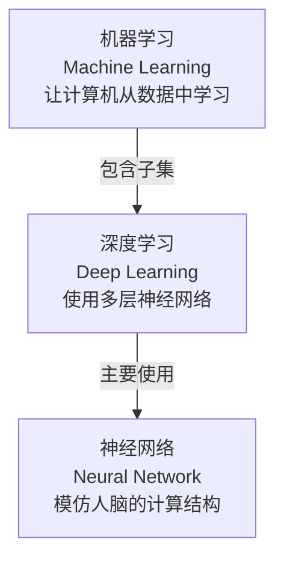

**关系总结**：
- **机器学习**是最大的范畴，包含了所有让机器自动学习的方法
- **深度学习**是机器学习的一个分支，专注于使用多层神经网络
- **神经网络**是深度学习的核心工具和实现方式

| 维度 | 机器学习 | 深度学习 | 神经网络 |
|------|---------|---------|---------|
| **范围** | 最广泛 | 机器学习的子集 | 深度学习的核心结构 |
| **特征工程** | 通常需要人工设计特征 | 自动学习特征 | 通过多层结构自动提取特征 |
| **数据需求** | 中等 | 大量数据 | 取决于网络深度 |
| **计算需求** | 中等 | 非常高（通常需要`GPU`） | 高 |
| **可解释性** | 较高 | 较低 | 较低 |
| **典型算法** | 决策树、支持向量机、朴素贝叶斯 | `CNN`、`RNN`、`Transformer` | 前馈网络、卷积网络、循环网络 |

## AI模型训练的基本概念

理解了机器学习、深度学习和神经网络的基础后，我们来看**AI模型训练**到底是什么。

**AI模型训练**是指通过大量数据和算法，让神经网络学习并优化其内部参数（权重和偏置），使其能够完成特定任务的过程。

### 通俗理解：猜数字游戏

让我们通过一个简单的猜数字游戏来理解训练过程：

**游戏规则**：我心里想一个`1`到`100`之间的数字（假设是`42`），你来猜。每次猜完，我会告诉你"太大了"还是"太小了"。

**第1次**：你随机猜`50`（这就像**模型初始化**，参数是随机的）
- 我说"太大了"（这就是**计算损失**，发现预测错了）
- 你意识到要往小的方向调整（这就是**反向传播**，计算梯度）

**第2次**：你猜`30`（这就是**参数更新**）
- 我说"太小了"
- 你知道答案在`30-50`之间

**第3次**：你猜`40`
- 我说"太小了"
- 范围缩小到`40-50`

**第4-5次**：你继续调整，猜`42`
- 我说"答对了！"（这就是**收敛**，找到了正确答案）

这个过程完美展示了`AI`训练的核心思想：
1. **随机开始**：一开始什么都不知道，随便猜
2. **获得反馈**：根据结果知道自己错在哪里
3. **调整策略**：往正确的方向修正
4. **反复迭代**：多次尝试逐步逼近答案
5. **达到目标**：最终找到正确答案

### AI模型的本质：参数的集合

**模型就是一堆数字**：无论是`ChatGPT`还是其他大模型，底层其实就是**一大堆参数**（数字），这些参数存储在神经网络的连接中。

**什么是参数？**

在神经网络中，参数主要包括：
- **权重（`Weight`）**：决定输入信息的重要程度
- **偏置（`Bias`）**：调整输出的阈值

**通俗比喻**：就像一个复杂的公式，参数就是公式中的系数。例如：
```text
输出 = w1 × 输入1 + w2 × 输入2 + w3 × 输入3 + b
```
其中`w1、w2、w3`是权重，`b`是偏置，这些都是参数。

一个大模型可能有**数十亿甚至数千亿个这样的参数**！

**参数量是什么？**

**参数量**指的是模型中所有可训练参数的总数，是衡量模型规模的关键指标。

| 模型 | 参数量 | 大小（存储空间） | 通俗理解 |
|------|--------|----------------|---------|
| **`BERT-Base`** | `110M`（`1.1`亿） | `~440MB` | 小型车 |
| **`GPT-2`** | `1.5B`（`15`亿） | `~6GB` | 中型卡车 |
| **`LLaMA-7B`** | `7B`（`70`亿） | `~14GB` | 大型货车 |
| **`GPT-3`** | `175B`（`1750`亿） | `~350GB` | 巨型货轮 |
| **`GPT-4`** | 约`1.7T`（`1.7`万亿） | `~3.5TB` | 航空母舰 |

**参数量的重要性**：

✅ **更多参数 = 更强能力**（通常情况下）
- 参数越多，模型能记忆和理解的知识越丰富
- 能处理更复杂的任务和关系

❌ **更多参数 = 更高成本**
- 需要更多的训练数据
- 需要更强的计算资源（更多`GPU`、更长时间）
- 需要更大的存储空间
- 推理（使用）时速度更慢、成本更高

**训练的目标**：通过大量数据和反复迭代，让这数十亿个参数调整到"最佳状态"，使得模型的预测结果符合人类的预期。

**举例说明**：
- 训练前：参数都是随机的，模型胡言乱语
- 训练中：通过看大量文本，参数逐渐调整，模型开始能写出通顺的句子
- 训练后：参数达到最佳状态，模型能理解复杂问题并给出合理回答

### 公式从哪里来？模型架构的作用

看到这里你可能会问：**既然参数要用在公式里，那这些计算公式是从哪来的？不同的模型用的公式一样吗？**

这是个非常关键的问题！答案是：**计算公式由模型架构（`Model Architecture`）决定，是人工设计的。**

#### 什么是模型架构？

**模型架构**就是神经网络的"设计图纸"，它定义了：
- 网络有多少层
- 每一层如何计算（用什么公式）
- 层与层之间如何连接
- 数据如何在网络中流动

**通俗比喻**：
- **模型架构** = 建筑设计图纸（定义房子的结构、楼层、房间布局）
- **参数** = 具体的建筑材料和尺寸（通过训练确定）

#### 训练 vs 设计：两个不同的阶段

| 维度 | 模型架构（公式） | 参数（系数） |
|------|--------------|------------|
| **由谁决定** | 人工设计 | 训练学习 |
| **何时确定** | 训练之前 | 训练过程中 |
| **是否可变** | 训练中固定不变 | 不断调整优化 |
| **例子** | `Transformer`有`12`层，每层用自注意力机制 | 第`3`层第`5`个神经元的权重是`0.823` |
| **类比** | 房子的结构设计：`3`层楼，每层`4`个房间 | 每个房间的具体尺寸和材料 |

#### 不同模型有不同的架构

是的！**不同的`AI`大模型使用完全不同的架构，因此计算公式也不同**。

| 模型架构 | 代表模型 | 核心计算方式 | 擅长领域 |
|---------|---------|------------|---------|
| **`Transformer`** | `GPT`、`BERT`、`LLaMA` | 自注意力机制（`Self-Attention`） | 文本生成、理解 |
| **`CNN`（卷积神经网络）** | `ResNet`、`VGG` | 卷积运算（`Convolution`） | 图像识别 |
| **`RNN`（循环神经网络）** | `LSTM`、`GRU` | 序列递归（`Recurrence`） | 时间序列、语音 |
| **`GAN`（生成对抗网络）** | `StyleGAN` | 生成器-判别器对抗 | 图像生成 |
| **扩散模型** | `Stable Diffusion` | 逐步去噪 | 图像生成 |

**举例说明**：

**1. `Transformer`架构（`GPT`系列）**

核心公式是**自注意力机制**：
```text
注意力分数 = softmax((Q × K^T) / √d)
输出 = 注意力分数 × V
```
其中`Q、K、V`都是通过参数矩阵计算出来的。

**2. `CNN`架构（图像识别）**

核心公式是**卷积运算**：
```text
输出[i][j] = Σ(输入[i+m][j+n] × 卷积核[m][n])
```

**3. 简单神经网络**

最基础的全连接层公式：
```text
输出 = 激活函数(W × 输入 + b)
```

#### 为什么需要不同的架构？

不同的任务需要不同的"思考方式"：

| 任务特点 | 适合的架构 | 原因 |
|---------|-----------|------|
| **处理文本** | `Transformer` | 能同时关注所有词，理解上下文关系 |
| **识别图像** | `CNN` | 能提取局部特征（边缘、形状、纹理） |
| **预测股票** | `RNN`/`LSTM` | 能记住历史信息，处理时间序列 |
| **生成图像** | `GAN`/扩散模型 | 专门设计用于创造新内容 |

#### 架构创新推动AI发展

`AI`的重大突破往往来自架构创新：

| 年份 | 架构创新 | 影响 |
|------|---------|------|
| **2012** | `AlexNet`（深度`CNN`） | 图像识别准确率大幅提升 |
| **2017** | `Transformer` | 开启大语言模型时代 |
| **2020** | `GPT-3`（大规模`Transformer`） | 展现惊人的通用能力 |
| **2022** | 扩散模型优化 | `Stable Diffusion`让AI绘画普及 |

#### 总结：架构 + 参数 = 完整模型

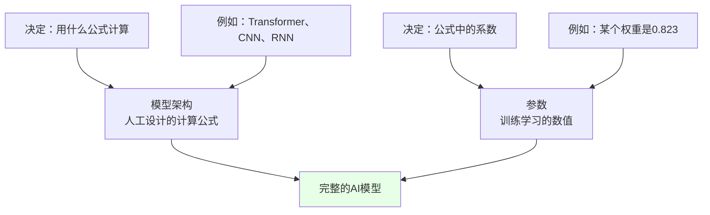

**核心要点**：
- **架构是框架**：定义了"怎么算"，是固定的设计
- **参数是内容**：决定了"算什么值"，是可学习的
- **两者缺一不可**：好的架构 + 好的参数 = 强大的模型
- **训练只调参数**：架构一旦确定，训练过程只优化参数，不改变架构本身

### 训练的核心流程

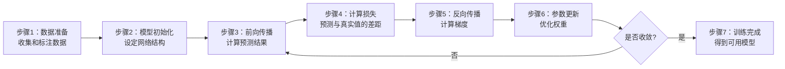

**关键术语**：

| 术语 | 英文 | 定义 | 通俗理解 |
|------|-----|------|---------|
| **训练数据** | `Training Data` | 用于训练模型的数据集，通常包含输入和对应的标签 | 员工培训时用的案例和标准答案 |
| **验证数据** | `Validation Data` | 用于调整模型超参数和监控训练过程的数据集 | 培训期间的小测试，用来检查学习效果 |
| **测试数据** | `Test Data` | 用于最终评估模型性能的数据集，不参与训练 | 正式上岗前的考试，检验真实能力 |
| **损失函数** | `Loss Function` | 衡量模型预测值与真实值之间差距的函数 | 评分标准，告诉你做得有多错 |
| **梯度** | `Gradient` | 损失函数对模型参数的导数，指示参数更新方向 | 告诉你应该往哪个方向改进 |
| **学习率** | `Learning Rate` | 控制参数更新步长的超参数 | 学习的"步子"大小，太大容易跑偏，太小进步慢 |
| **批次** | `Batch` | 一次训练使用的数据样本数量 | 一次学习多少个案例 |
| **轮次** | `Epoch` | 完整遍历一遍训练数据集称为一个轮次 | 把所有教材学习一遍算一轮 |
| **收敛** | `Convergence` | 模型的损失不再显著下降，训练达到稳定状态 | 就像猜数字游戏猜对了，或者已经很接近答案了 |
| **过拟合** | `Overfitting` | 模型在训练数据上表现很好，但在新数据上表现差 | 死记硬背案例，不会举一反三 |
| **欠拟合** | `Underfitting` | 模型连训练数据都没学好 | 学习能力不足，什么都没学会 |
| **参数量** | `Parameters` | 模型中所有可训练参数的总数 | 模型的"脑容量"，参数越多通常能力越强 |

**训练的本质**：

通过不断调整神经网络中数十亿个参数的值，让模型的预测结果越来越接近真实答案，最终让模型学会解决特定问题的能力。就像猜数字游戏一样，通过反复尝试和调整，最终找到那个"正确答案"。


## AI模型训练的常见方法

在实际应用中，`AI`模型训练并不是单一的方式，而是根据不同的场景和需求，衍生出了多种训练策略。我们主要介绍两种核心的训练方法：预训练和增量预训练。

### 预训练 (Pre-Training, PT)

**预训练**是指在海量通用数据上从零开始训练一个大模型的过程，这个模型会学习到广泛的知识和能力，成为后续任务的基础。

#### 核心特点

**通俗理解**：就像培养一个孩子的通识教育阶段，让他从小学到大学学习语文、数学、物理、化学、历史、地理等各种知识，建立广泛的知识体系和思维能力。

**关键要素**：
- **数据量超大**：通常使用整个互联网的文本、图片等数据，规模可达TB甚至PB级
- **训练目标通用**：不针对特定任务，而是学习通用的表示能力
- **资源消耗巨大**：需要数百到数千块`GPU`，训练时间从数周到数月
- **一次性投入**：通常由大公司或研究机构完成，训练完成后可被广泛复用

#### 常见的预训练任务

不同类型的模型有不同的预训练方式：

| 模型类型 | 预训练任务 | 训练目标 | 通俗理解 |
|---------|-----------|---------|---------|
| **语言模型<br/>`GPT`系列** | 下一个词预测<br/>`Next Token Prediction` | 给定前面的文本，预测下一个词 | 给你半句话，让你猜下一个字 |
| **掩码语言模型<br/>`BERT`** | 掩码词预测<br/>`Masked Language Modeling` | 遮盖句子中的部分词，让模型预测 | 完形填空题 |
| **图像模型<br/>`ResNet`、`ViT`** | 图像分类<br/>`Image Classification` | 在大规模图像数据集上学习视觉特征 | 看大量图片学习识别物体 |
| **多模态模型<br/>`CLIP`** | 图文对齐<br/>`Image-Text Matching` | 学习图像和文本的对应关系 | 学习图片和文字描述的匹配 |

#### 预训练的产物：基座模型

预训练完成后得到的模型称为**基座模型**（`Base Model`）或**预训练模型**（`Pre-trained Model`），它具备以下特征：

✅ **通用知识丰富**：学习了大量的语言、常识、推理能力  
✅ **迁移能力强**：可以通过微调适应各种下游任务  
✅ **开箱即用**：即使不微调也能完成一些基础任务  
✅ **社区共享**：通常会开源供大家使用（如`BERT`、`LLaMA`、`GPT-2`等）

#### 著名的预训练模型

| 模型名称 | 发布机构 | 数据规模 | 参数量 | 主要用途 |
|---------|---------|---------|--------|---------|
| **`BERT`** | `Google` | `16GB`文本 | `110M-340M` | 文本理解、分类、问答 |
| **`GPT-3`** | `OpenAI` | `45TB`文本 | `175B` | 文本生成、对话、推理 |
| **`LLaMA`** | `Meta` | `1.4TB`文本 | `7B-65B` | 开源基座模型 |
| **`CLIP`** | `OpenAI` | `4亿`图文对 | `400M` | 图像-文本理解 |
| **`ResNet`** | `Microsoft` | `ImageNet 1.2M`图 | `25M-60M` | 图像识别 |
#### 预训练的流程图

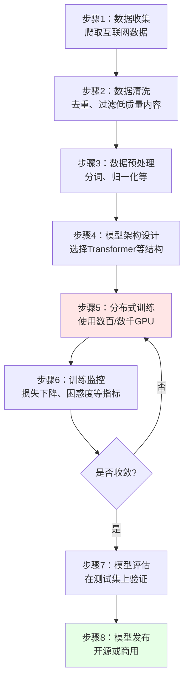

### 增量预训练 (Continual Pre-Training, CPT)

**增量预训练**是指在已有的预训练模型基础上，使用新的数据继续进行预训练，让模型学习新的知识或增强特定领域的能力。

#### 核心特点

**通俗理解**：就像一个大学毕业生已经有了基础知识，现在去读研究生深造，学习更专业、更前沿的知识。

**为什么需要增量预训练？**

| 场景 | 问题 | 增量预训练的作用 |
|------|-----|----------------|
| **知识过时** | 预训练模型的数据可能是几年前的，不了解最新事件 | 用最新数据继续训练，更新知识 |
| **领域专业性不足** | 通用模型在医疗、法律等专业领域表现不佳 | 用领域数据训练，增强专业能力 |
| **语言覆盖不足** | 英文模型不擅长中文 | 用中文数据训练，提升中文能力 |
| **特定能力欠缺** | 需要增强代码理解能力 | 用代码数据训练，提升编程能力 |

#### 增量预训练 vs 从零预训练

| 维度 | 从零预训练 | 增量预训练 |
|------|-----------|-----------|
| **起点** | 随机初始化参数 | 已有预训练模型 |
| **数据量** | 需要海量数据（TB级） | 可以用较少数据（GB-TB级） |
| **训练时间** | 数周到数月 | 数天到数周 |
| **计算成本** | 极高（数百万美元） | 中等（数万到数十万美元） |
| **适用场景** | 构建通用基座模型 | 领域适配、知识更新 |

#### 典型应用场景

**1. 领域适配**

**案例**：基于通用的`LLaMA`模型，使用医学文献进行增量预训练，得到医学领域的`Med-LLaMA`。

**效果**：
- 医学术语理解更准确
- 医学知识问答能力显著提升
- 临床推理能力增强

**2. 多语言适配**

**案例**：基于英文的`GPT`模型，使用中文语料进行增量预训练，得到中文能力更强的`GPT`模型。

**效果**：
- 中文理解和生成能力提升
- 中文文化相关知识增强
- 保留原有的英文能力（不会完全遗忘）

**3. 知识更新**

**案例**：`2023`年发布的模型不知道`2024`年的新闻，使用`2024`年的新闻数据进行增量预训练。

**效果**：
- 了解最新事件和知识
- 时效性信息更准确
- 保持原有的基础能力

**4. 能力增强**

**案例**：在通用语言模型基础上，使用大量代码数据进行增量预训练，得到`Code-LLaMA`这样的代码专用模型。

**效果**：
- 代码理解能力大幅提升
- 代码生成质量更高
- 支持更多编程语言

#### 增量预训练的技术要点

**1. 学习率设置**

增量预训练通常使用**比从零训练更小的学习率**，避免破坏已有知识。

**通俗理解**：就像已经学会的东西，复习时要温和一点，不要用力过猛把以前学的都忘了。

**2. 数据配比**

通常会**混合新数据和原始数据**，而不是只用新数据。

**原因**：防止"灾难性遗忘"（`Catastrophic Forgetting`），即学新知识时把旧知识全忘了。

**配比示例**：
- 新领域数据：`70%`
- 原始通用数据：`30%`

**3. 训练轮次**

增量预训练的轮次通常**比从零训练少得多**。

**原因**：模型已经有了好的初始化，不需要太多轮次就能学会新知识。

#### 增量预训练流程图

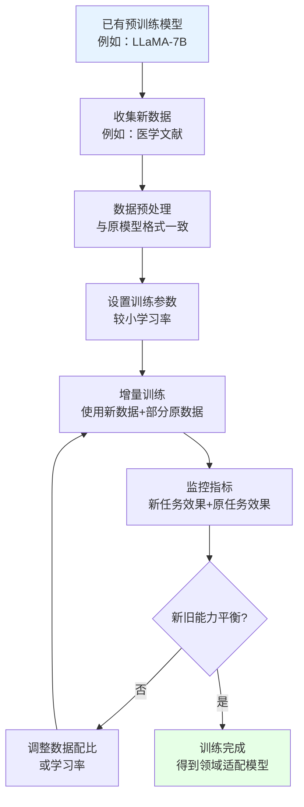

### 预训练与增量预训练的关系

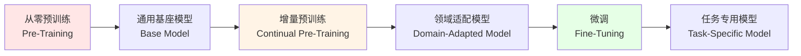

**完整训练流程**：
1. **预训练**：在海量通用数据上训练，得到通用基座模型
2. **增量预训练**（可选）：在特定领域数据上继续训练，得到领域模型
3. **微调**：在具体任务数据上训练，得到任务专用模型

### 预训练的成本与价值

#### 成本分析

| 模型 | 参数量 | 训练硬件 | 训练时间 | 估计成本 |
|------|--------|---------|---------|---------|
| **`BERT-Base`** | 110M | 16块`TPU` | 4天 | ~$7,000 |
| **`GPT-2`** | 1.5B | 32块V100 | 1周 | ~$43,000 |
| **`GPT-3`** | 175B | 10,000块V100 | 数月 | ~$4,600,000 |
| **`LLaMA-65B`** | 65B | 2,048块A100 | 21天 | ~$2,000,000 |

#### 价值体现

尽管预训练成本高昂，但其价值在于：

✅ **一次训练，多次复用**：一个预训练模型可以用于成千上万种任务  
✅ **社区共享**：开源后全世界的开发者都能受益  
✅ **降低门槛**：让小团队也能开发`AI`应用  
✅ **加速创新**：不需要每个人都从零开始

**总结**：预训练和增量预训练构成了现代`AI`模型的基础，前者建立通用能力，后者实现专业适配。理解这两种方法是掌握`AI`模型训练的关键第一步。

## AI模型训练的挑战与微调的引入

### 传统AI模型训练的痛点

虽然深度学习取得了巨大成功，但从零开始训练一个`AI`模型面临着诸多挑战：

#### 1. 数据需求巨大

**问题**：深度学习模型通常需要**数百万到数十亿**的标注数据才能训练出好的效果。

**通俗理解**：就像培养一个世界级的棋手，需要让他下成千上万盘棋才能积累经验。

**实际困难**：
- 获取大量数据成本高昂
- 数据标注耗费大量人力和时间
- 某些领域（如医学）数据稀缺且难以获取

**举例**：
- `GPT-3`训练使用了45TB的文本数据
- `ImageNet`数据集包含1400万张标注图片，耗费数年才完成

#### 2. 计算资源消耗巨大

**问题**：训练大型模型需要强大的计算能力，通常需要**数百到数千块`GPU`**，训练时间从数天到数月不等。

**成本示例**：
- `GPT-3`的训练成本估计超过460万美元
- `BERT-Large`在64块`TPU`上训练需要4天
- 普通企业或个人根本承担不起这样的成本

#### 3. 训练时间漫长

**问题**：即使有充足的计算资源，训练一个大模型仍需要**数周甚至数月**。

**影响**：
- 项目周期长，影响产品迭代速度
- 试错成本高，难以快速调整
- 紧急需求无法及时响应

#### 4. 专业知识门槛高

**问题**：从零训练模型需要深厚的机器学习理论知识、工程经验和调参技巧。

**需要掌握的技能**：
- 网络架构设计
- 损失函数选择
- 优化器配置
- 学习率调度
- 正则化技术
- 分布式训练等

#### 5. 泛化能力不足

**问题**：针对特定任务从零训练的模型，往往只能解决该任务，难以迁移到其他相关任务。

**举例**：训练一个识别猫狗的模型，无法直接用来识别鸟类，需要重新训练。

### 微调技术的诞生

面对上述挑战，研究人员提出了**迁移学习**（Transfer Learning）的思想，而**微调**（Fine-tuning）正是迁移学习的核心实践方式。

**核心思想**：既然从零训练太贵，那我们可以基于已经训练好的大模型（通常称为**预训练模型**或**基座模型**），针对特定任务进行少量调整和训练，让模型适应新任务。

**通俗比喻**：
- **从零训练**：培养一个婴儿成为医生，需要从识字、上学、大学、医学院一路学习20多年
- **微调**：招聘一个已经毕业的医学生，只需要在你的医院进行几个月的专业培训，就能上岗

**微调的优势**：

| 优势 | 说明 | 对比从零训练 |
|------|------|-------------|
| **数据需求少** | 通常只需要几千到几万条数据 | 从零训练需要百万级数据 |
| **训练时间短** | 几小时到几天 | 从零训练需要数周到数月 |
| **计算成本低** | 几块`GPU`即可 | 从零训练需要数百上千块`GPU` |
| **效果更好** | 继承预训练模型的通用知识 | 从零训练可能因数据不足而效果差 |
| **门槛更低** | 不需要深厚的模型设计知识 | 需要专家级的架构设计能力 |

**微调的基本原理**：

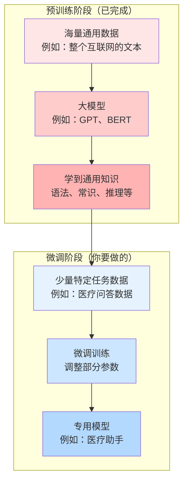

**微调让`AI`技术真正普及**：有了微调技术，不再只有谷歌、Meta这样的巨头能训练`AI`模型，普通企业和开发者也能基于开源的预训练模型，快速打造自己的`AI`应用。


## AI模型微调的常见方法

微调是`AI`模型训练中最常用、最实用的技术。根据微调的方式和目标，衍生出了多种微调方法。我们将介绍四种主要的微调方法：全量微调、有监督微调、强化微调和人类偏好对齐。

### 全量微调 (Fine-Tuning, FT)

**全量微调**是最直接、最传统的微调方式，指的是在特定任务的数据集上，对预训练模型的**所有参数**进行训练和更新。

#### 核心特点

**通俗理解**：就像招了一个大学毕业生，让他在公司里全面学习和适应，从工作流程到专业技能，所有方面都进行培训和调整。

**关键要素**：
- **更新所有参数**：模型的每一层、每一个权重都会被更新
- **需要足够数据**：通常需要几千到几万条标注数据
- **计算成本较高**：需要较多的`GPU`资源和训练时间
- **效果通常最好**：因为模型可以充分适应新任务

#### 适用场景

| 场景 | 说明 | 示例 |
|------|------|------|
| **数据充足** | 有足够的标注数据（通常>10K） | 大公司的客服对话数据 |
| **任务差异大** | 新任务与预训练任务差异较大 | 用语言模型做医疗诊断 |
| **追求最佳效果** | 对模型性能要求极高 | 高精度的金融风控模型 |
| **资源充足** | 有足够的计算资源和时间 | 研究机构、大公司 |

#### 训练流程

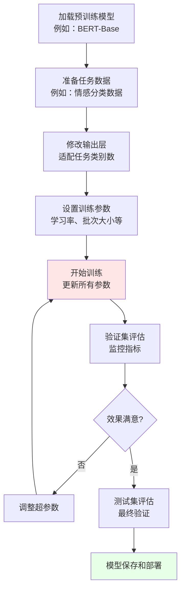

#### 优缺点分析

**优点**：
✅ **效果好**：模型可以充分适应新任务，通常能达到最佳性能  
✅ **灵活性高**：可以处理各种类型的任务  
✅ **实现简单**：技术上最直接，不需要特殊技巧

**缺点**：
❌ **资源消耗大**：需要较多的`GPU`显存和计算时间  
❌ **数据需求多**：需要较大规模的标注数据  
❌ **训练时间长**：特别是对大模型（如`GPT-3`级别）微调可能需要数天  
❌ **容易过拟合**：如果数据量不够，容易在训练集上过拟合

#### 实践建议

**1. 学习率设置**

全量微调的学习率通常需要**比预训练小**，典型值在`1e-5`到`5e-5`之间。

**原因**：预训练模型已经学到了很好的特征，大的学习率可能破坏这些特征。

**2. 渐进式解冻（Gradual Unfreezing）**

一种改进策略是**先冻结大部分层，只训练顶层，然后逐步解冻更多层**。

**流程**：
1. 先只训练最后一层（分类头）
2. 解冻最后几层，继续训练
3. 解冻所有层，进行最终微调

**好处**：防止底层已经学好的通用特征被破坏。

**3. 早停（Early Stopping）**

监控验证集性能，当性能不再提升时提前停止训练，防止过拟合。

### 有监督微调 (Supervised Fine-Tuning, SFT)

**有监督微调**特指在大语言模型（`LLM`）训练中，使用**高质量的指令-回答对**数据进行微调，让模型学会遵循人类指令的过程。

#### 核心特点

**通俗理解**：就像给一个博学的教授（预训练模型）配一个助教培训，教他如何回答学生的各种问题，让他学会"怎么说话"和"说什么内容"。

**与传统全量微调的区别**：
- **传统微调**：通常是针对单一任务（如分类、翻译）
- **有监督微调**：训练模型遵循各种各样的指令，完成多样化任务

**数据格式示例**：

```json
{
  "instruction": "将下面的英文翻译成中文",
  "input": "Machine learning is a subset of artificial intelligence.",
  "output": "机器学习是人工智能的一个子集。"
}

{
  "instruction": "回答以下问题",
  "input": "什么是深度学习？",
  "output": "深度学习是机器学习的一个分支，它使用多层神经网络来学习数据的复杂特征..."
}

{
  "instruction": "写一首关于春天的诗",
  "input": "",
  "output": "春风拂面花争艳，\n绿柳垂丝燕归来..."
}
```

#### 为什么需要SFT？

预训练模型（如`GPT-3`）虽然知识丰富，但存在几个问题：

| 问题 | 表现 | `SFT`的解决方式 |
|------|------|---------------|
| **不会遵循指令** | 你说"翻译这句话"，它可能继续生成文本而不是翻译 | 学习指令-回答模式 |
| **输出格式混乱** | 回答没有结构，夹杂无关内容 | 学习规范的输出格式 |
| **安全性问题** | 可能生成有害、偏见的内容 | 学习安全、友好的回答方式 |
| **多任务能力弱** | 只擅长某些任务 | 在多样化指令上训练 |

#### SFT的训练流程

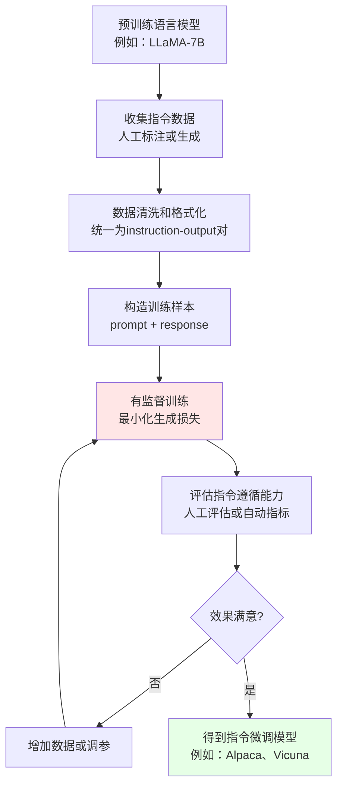

#### 数据来源

高质量的`SFT`数据是关键，主要来源有：

**1. 人工标注**
- 雇佣标注员编写指令和答案
- 成本高但质量最好
- 例如：`InstructGPT`使用了约13,000条人工标注数据

**2. 模型生成**
- 使用强大的模型（如`GPT-4`）生成指令和答案
- 成本低但需要质量筛选
- 例如：`Alpaca`使用`GPT-3.5`生成了52,000条数据

**3. 现有数据改造**
- 将已有的问答、对话数据改造成指令格式
- 数据丰富但可能需要大量处理
- 例如：从Stack Overflow、Reddit等收集数据

**4. 混合来源**
- 结合多种来源，确保数据多样性
- 覆盖不同领域和任务类型

#### 典型的SFT项目

| 模型名称 | 基座模型 | 数据量 | 数据来源 | 特点 |
|---------|---------|-------|---------|------|
| **`InstructGPT`** | `GPT-3` | 13K | 人工标注 | 高质量，官方产品 |
| **`Alpaca`** | `LLaMA-7B` | 52K | `GPT-3.5`生成 | 低成本，开源先驱 |
| **`Vicuna`** | `LLaMA-13B` | 70K | 真实用户对话 | 对话能力强 |
| **`ChatGLM`** | `GLM-130B` | 未公开 | 中文指令数据 | 中文能力强 |

#### 训练技巧

**1. 数据多样性**

确保指令数据覆盖多种任务类型：
- 问答
- 翻译
- 总结
- 写作
- 推理
- 代码生成等

**2. 质量控制**

对生成的数据进行筛选：
- 过滤有害、偏见内容
- 去除格式错误的样本
- 保证答案的准确性

**3. 长度平衡**

指令和回答的长度要合理分布：
- 既有简短的一问一答
- 也有复杂的长篇推理

### 强化微调 (Reinforcement Fine-Tuning, RFT)

**强化微调**是使用强化学习（Reinforcement Learning）的方法对模型进行微调，通过定义奖励函数，让模型学习最大化奖励的行为。

#### 核心特点

**通俗理解**：就像训练一只宠物狗，做对了给零食（正向奖励），做错了不给（负向惩罚），通过反复训练让它学会正确的行为。

**与有监督微调的区别**：

| 维度 | 有监督微调（`SFT`） | 强化微调（`RFT`） |
|------|------------------|-----------------|
| **训练方式** | 直接学习"标准答案" | 通过奖励信号学习"好的行为" |
| **数据需求** | 需要大量标注数据 | 可以用较少数据+奖励函数 |
| **优化目标** | 最小化预测与标签的差异 | 最大化累积奖励 |
| **适用场景** | 有明确标准答案的任务 | 标准答案难以定义的任务 |
| **典型应用** | 文本分类、翻译 | 对话生成、游戏`AI`、机器人控制 |

#### 为什么需要强化微调？

在某些任务中，很难给出"标准答案"，但容易判断"好坏"：

**场景示例**：

| 场景 | 为什么`SFT`不够 | `RFT`的优势 |
|------|---------------|-----------|
| **开放式对话** | 没有唯一正确答案 | 可以定义"有趣、相关"等奖励 |
| **创意写作** | 好作品有多种形式 | 可以奖励"创意、流畅"等特质 |
| **游戏`AI`** | 策略多样，难以穷举 | 直接奖励"获胜"这个结果 |
| **代码优化** | 可以实现但效率不同 | 奖励"运行快、占用少"的代码 |

#### 强化学习基本概念

在理解强化微调前，需要了解几个强化学习的基本概念：

| 概念 | 英文 | 定义 | 在`AI`模型中的对应 |
|------|-----|------|------------------|
| **智能体** | Agent | 执行动作的主体 | `AI`模型本身 |
| **环境** | Environment | 智能体所处的外部世界 | 任务场景（如对话、游戏） |
| **状态** | State | 当前的情况 | 当前的输入文本或上下文 |
| **动作** | Action | 智能体做出的行为 | 模型生成的下一个词或句子 |
| **奖励** | Reward | 对动作的即时反馈 | 评估生成质量的分数 |
| **策略** | Policy | 智能体选择动作的规则 | 模型的生成策略（概率分布） |

#### 强化微调的流程

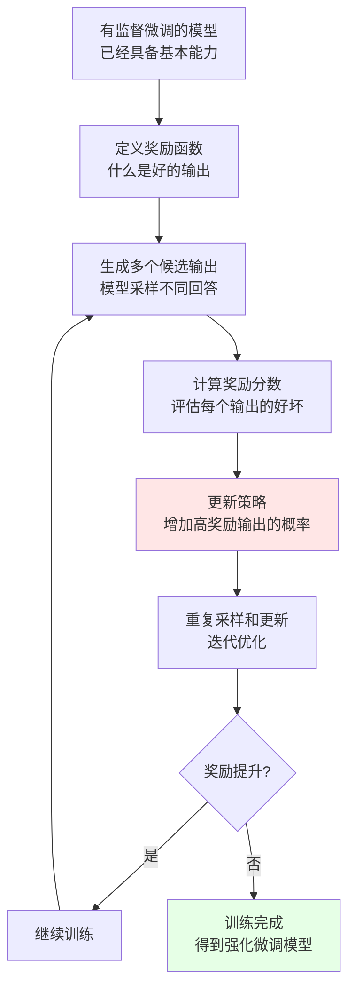

#### 奖励函数设计

奖励函数是强化微调的核心，它定义了"什么是好的输出"。

**常见的奖励设计方式**：

**1. 规则奖励**

基于人工定义的规则：
- 长度奖励：适当长度的回答得分高
- 多样性奖励：避免重复生成
- 格式奖励：符合特定格式（如代码块、列表）

**2. 模型奖励**

训练一个奖励模型来评分：
- 使用人类标注的偏好数据
- 训练一个分类器判断"好"或"坏"
- 用这个模型给生成结果打分

**3. 任务指标奖励**

直接使用任务的评估指标：
- 翻译任务：`BLEU`分数
- 游戏任务：获胜/失败
- 代码生成：能否通过测试用例

**4. 混合奖励**

结合多种奖励：
```
总奖励 = 0.5 × 内容质量 + 0.3 × 相关性 + 0.2 × 安全性
```

#### 常用强化学习算法

| 算法名称 | 简称 | 核心思想 | 在`LLM`中的应用 |
|---------|-----|---------|---------------|
| **策略梯度** | Policy Gradient | 直接优化策略，增加高奖励动作的概率 | 基础的强化微调方法 |
| **近端策略优化** | `PPO` | 限制策略更新幅度，保证训练稳定 | `ChatGPT`使用的算法 |
| **深度Q网络** | `DQN` | 学习动作的价值函数 | 较少用于文本生成 |

#### 实际应用示例

**场景：训练一个能写出高质量代码的模型**

**1. 基础模型**：先用`SFT`训练一个基本能生成代码的模型

**2. 奖励设计**：
```python
def reward_function(generated_code, test_cases):
    score = 0
    
    # 能否编译
    if can_compile(generated_code):
        score += 1
    else:
        return score  # 编译失败直接返回
    
    # 通过测试用例
    passed = run_test_cases(generated_code, test_cases)
    score += passed / len(test_cases) * 5  # 最多5分
    
    # 代码效率
    runtime = measure_runtime(generated_code)
    if runtime < baseline:
        score += 2
    
    # 代码可读性（用启发式规则）
    readability = check_readability(generated_code)
    score += readability
    
    return score
```

**3. 训练过程**：
- 给定编程问题
- 模型生成代码
- 运行测试并计算奖励
- 根据奖励更新模型
- 重复迭代

**4. 效果**：模型逐渐学会生成能通过测试、运行高效、可读性好的代码

#### 挑战与注意事项

**1. 奖励设计困难**

不当的奖励函数可能导致意外行为：
- **奖励黑客**（Reward Hacking）：模型找到"作弊"方式获得高奖励，但不是真正的好输出
- **示例**：如果只奖励长度，模型可能生成冗长但无意义的文本

**2. 训练不稳定**

强化学习训练过程比监督学习更不稳定：
- 奖励信号稀疏或噪声大
- 策略更新可能导致性能崩溃
- 需要精心调整超参数

**3. 计算成本高**

需要大量的采样和评估：
- 每次更新需要生成多个候选输出
- 需要多次迭代才能收敛
- 总体计算量远大于监督学习

### 人类偏好对齐 (Reinforcement Learning from Human Feedback, RLHF)

**人类偏好对齐**是强化微调的一种特殊形式，通过收集人类对模型输出的偏好反馈，训练一个奖励模型，然后用这个奖励模型指导`AI`模型的优化，使其输出更符合人类期望。

#### 核心特点

**通俗理解**：就像选秀节目，让评委（人类）对选手（模型输出）进行打分或投票，然后根据这些评分训练选手，让他们的表演越来越符合评委的喜好。

**`RLHF`的独特之处**：奖励函数不是人工定义的规则，而是**从人类反馈数据中学习**出来的。

#### 为什么需要RLHF？

| 问题 | 传统方法的局限 | `RLHF`的解决 |
|------|-------------|------------|
| **难以定义"好"** | 很难用规则描述什么是好的对话 | 让人类直接打分，学习"好"的标准 |
| **主观偏好** | 创意、风格等很主观 | 学习人类的集体偏好 |
| **安全性** | 很难穷举所有有害内容 | 人类可以识别各种有害输出 |
| **多目标平衡** | 同时优化准确、友好、简洁等多个目标很复杂 | 人类自然地进行综合判断 |

#### RLHF的完整流程

`RLHF`通常分为三个阶段：

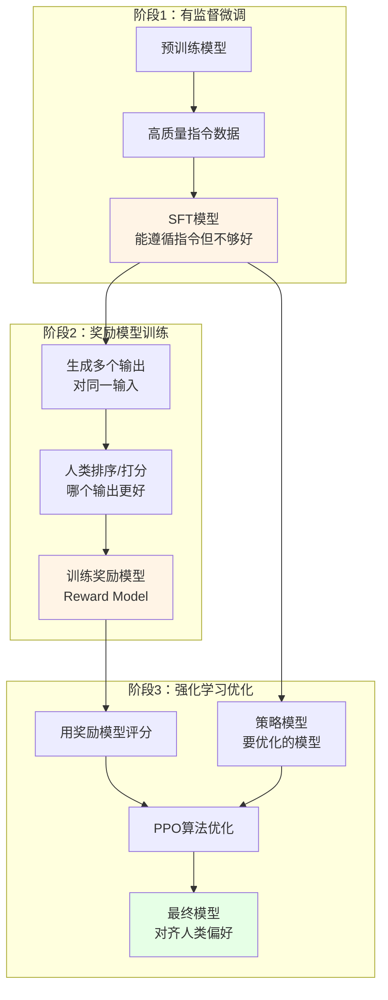

#### 阶段1：有监督微调（SFT）

**目标**：让模型具备基本的指令遵循能力

**方法**：使用高质量的指令-回答对进行监督训练（前面介绍的`SFT`）

**产出**：一个能理解并回答问题的基础模型，但回答质量可能参差不齐

#### 阶段2：奖励模型训练

这是`RLHF`的关键创新步骤。

**2.1 数据收集**

对于同一个输入（prompt），让`SFT`模型生成多个不同的输出（通常4-9个）：

**示例**：
```
输入：如何学习编程？

输出A：学习编程需要先学习一门编程语言，比如Python...
输出B：编程很难，需要大量练习，建议先从简单的开始...
输出C：首先，选择一门适合初学者的语言，如Python。其次...
输出D：你可以通过在线课程、书籍、实践项目等方式学习编程...
```

**2.2 人工标注**

雇佣标注员对这些输出进行**排序或打分**：

**排序方式**：
```
最好：输出C
第二：输出D
第三：输出A
最差：输出B
```

或者直接打分：
```
输出A：7分
输出B：4分
输出C：9分
输出D：8分
```

**2.3 训练奖励模型**

使用这些偏好数据训练一个**奖励模型**（Reward Model, RM）：

**训练目标**：给定输入和输出，预测人类会给这个输出打多少分

**模型架构**：通常基于`SFT`模型，把输出层改为一个标量输出（分数）

**损失函数**：让排名高的输出得分高于排名低的输出

```python
# 伪代码示意
loss = -log(sigmoid(score(输出C) - score(输出B)))
# 让得分满足：score(C) > score(B)
```

#### 阶段3：强化学习优化

**3.1 使用PPO算法**

**近端策略优化**（Proximal Policy Optimization, `PPO`）是`RLHF`最常用的强化学习算法。

**核心思想**：
- 让模型生成的输出获得更高的奖励模型分数
- 但不能偏离`SFT`模型太远（防止模型崩溃）

**目标函数**：
```
总目标 = 奖励模型分数 - β × KL散度(当前模型 || SFT模型)
```

**解释**：
- 第一项：鼓励高奖励输出
- 第二项：惩罚与`SFT`模型差异过大（β是权重系数）

**3.2 迭代优化**

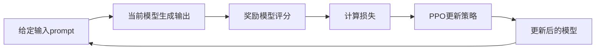

**训练过程**：
1. 给定输入，用当前策略模型生成输出
2. 奖励模型对输出打分
3. 计算`PPO`损失
4. 更新策略模型参数
5. 重复数千次迭代

#### RLHF的实际应用

**最著名的案例：`ChatGPT`**

`OpenAI`使用`RLHF`训练`ChatGPT`的过程：

**1. 预训练**：`GPT-3.5`在海量文本上预训练

**2. `SFT`**：用约13,000条人工编写的高质量对话数据进行监督微调

**3. 奖励模型**：
- 收集约33,000组对比数据（每组包含一个问题和多个回答）
- 人类标注员对回答进行排序
- 训练奖励模型学习人类偏好

**4. `PPO`优化**：
- 用奖励模型指导`PPO`训练
- 迭代优化数周
- 定期人工评估，调整训练参数

**结果**：`ChatGPT`表现出了惊人的对话能力和安全性，成为现象级产品

#### RLHF的优势

| 优势 | 说明 | 示例 |
|------|------|------|
| **符合人类偏好** | 输出更贴近人类期望 | 回答更友好、更有帮助 |
| **主观质量提升** | 对创意、风格等主观维度有效 | 写作更有趣、更自然 |
| **安全性增强** | 减少有害、偏见内容 | 拒绝生成危险信息 |
| **难以规则化** | 可以优化难以定义的目标 | 让对话"更像人" |

#### RLHF的挑战

**1. 人工标注成本高**

- 需要大量标注员进行偏好标注
- 标注质量影响最终效果
- 成本可能达到数十万到数百万美元

**2. 标注者偏差**

- 不同标注员的偏好可能不一致
- 标注员的文化背景影响判断
- 可能引入系统性偏见

**3. 奖励模型的局限**

- 奖励模型本身也可能犯错
- 模型可能学会欺骗奖励模型（Reward Hacking）
- 需要持续更新和改进

**4. 训练复杂度高**

- 需要同时维护策略模型、奖励模型、参考模型
- 训练不稳定，需要精细调参
- 计算资源消耗巨大

#### RLHF的改进方向

**1. 直接偏好优化（Direct Preference Optimization, DPO）**

省略奖励模型训练，直接从偏好数据优化策略：
- 简化流程，降低复杂度
- 训练更稳定
- 是当前的研究热点

**2. 宪法AI（Constitutional AI, CAI）**

用`AI`帮助标注，减少人工成本：
- 定义一套"宪法"原则（如：友好、诚实、安全）
- 让强大的`AI`（如`GPT-4`）按原则评估输出
- 减少对人工标注的依赖

**3. 迭代式RLHF**

不断收集新的人类反馈，持续改进模型：
- 部署模型后收集用户反馈
- 定期更新奖励模型
- 进行新一轮`RLHF`训练

### 微调方法总结对比

| 方法 | 简称 | 核心特点 | 数据需求 | 计算成本 | 适用场景 | 典型应用 |
|------|-----|---------|---------|---------|---------|---------|
| **全量微调** | `FT` | 更新所有参数 | 中等（数千至数万） | 较高 | 任务差异大、追求最佳效果 | 领域特定分类、翻译 |
| **有监督微调** | `SFT` | 学习指令遵循 | 中等（数万） | 中等 | 让模型遵循指令 | `Alpaca`、指令模型 |
| **强化微调** | `RFT` | 通过奖励优化 | 较少（可用奖励函数） | 高 | 难以定义标准答案 | 游戏`AI`、代码优化 |
| **人类偏好对齐** | `RLHF` | 学习人类偏好 | 较多（数万组对比） | 非常高 | 对齐人类价值观 | `ChatGPT`、安全模型 |

### 微调方法的选择建议

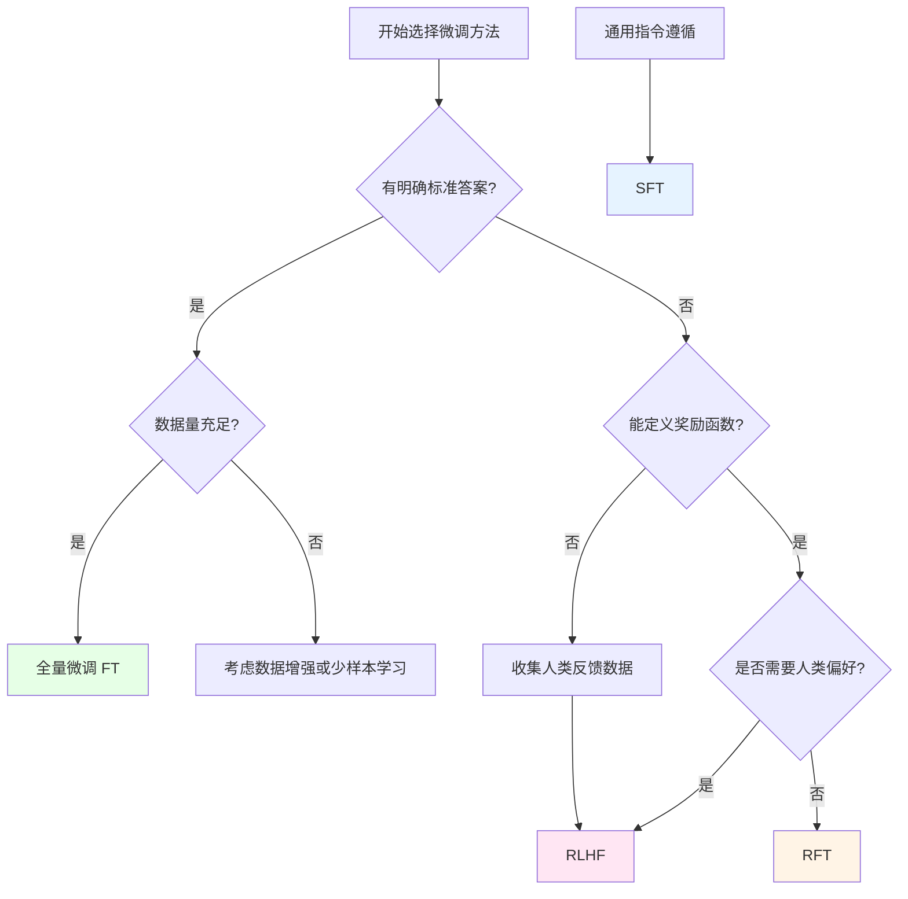

**实践建议**：

1. **优先尝试`SFT`**：如果是让模型学会遵循指令，`SFT`是最直接有效的方法
2. **追求极致效果用`RLHF`**：如果对模型输出质量要求极高，且有资源，使用`RLHF`
3. **特定目标用`RFT`**：如果有明确的优化目标（如游戏获胜、代码效率），使用`RFT`
4. **传统任务用`FT`**：如果是传统的分类、回归等任务，全量微调最简单有效

**总结**：微调方法的选择没有绝对的优劣，关键是根据具体的任务需求、数据情况和资源条件来决定。在实践中，常常会组合使用多种方法，例如先`SFT`再`RLHF`，以达到最佳效果。

## AI模型训练与微调的实践应用

了解了训练和微调的理论知识后，我们来看看在实际业务中如何应用这些技术。

### 常见业务场景

#### 1. 智能客服

**业务需求**：自动回答用户咨询，减少人工客服压力

**技术路径**：
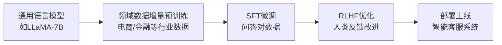

**数据准备**：
- 历史客服对话记录（脱敏处理）
- 常见问题及标准答案（FAQ）
- 产品文档和知识库

**效果指标**：
- 问题解决率：> 80%
- 用户满意度：> 4.0/5.0
- 人工介入率：< 20%

#### 2. 文档智能处理

**业务需求**：自动提取合同、报告中的关键信息

**技术路径**：
- **预训练模型**：使用`BERT`或`RoBERTa`
- **微调任务**：命名实体识别（NER）、关系抽取
- **训练数据**：标注的文档样本（数千份）

**应用场景**：
- 合同条款提取
- 简历信息解析
- 医疗报告分析
- 财务报表解读

#### 3. 代码助手

**业务需求**：帮助开发者编写、优化代码

**技术路径**：
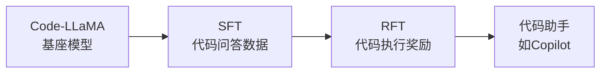

**训练数据**：
- `GitHub`开源代码
- 编程问答（`Stack Overflow`）
- 代码注释对
- 测试用例

**评估方式**：
- 代码能否编译
- 是否通过测试用例
- 代码效率和可读性
- 开发者满意度

#### 4. 内容创作

**业务需求**：自动生成营销文案、新闻摘要、产品描述等

**技术路径**：
- **基座模型**：`GPT`系列或`LLaMA`
- **微调方式**：`SFT` + `RLHF`
- **风格对齐**：学习品牌语调和风格

**应用场景**：
- 电商产品描述生成
- 新闻自动摘要
- 广告文案创作
- 社交媒体内容生成

#### 5. 智能推荐

**业务需求**：个性化推荐商品、内容、服务

**技术路径**：
- **预训练**：在用户行为数据上预训练
- **微调**：针对特定推荐场景微调
- **强化学习**：根据用户反馈优化

**数据特点**：
- 用户画像数据
- 行为序列数据
- 物品特征数据
- 点击/购买反馈

### AI模型训练的基本流程

完整的`AI`模型训练项目通常包含以下步骤：

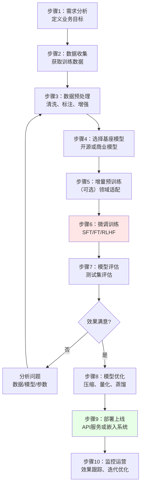

#### 详细步骤说明

**步骤1：需求分析**

明确要解决的业务问题：
- 具体任务是什么？（分类、生成、问答等）
- 输入和输出是什么？
- 性能要求是什么？（准确率、延迟等）
- 可用资源是什么？（数据、算力、预算）

**步骤2：数据收集**

| 数据来源 | 优点 | 缺点 | 适用场景 |
|---------|------|------|---------|
| **企业内部数据** | 领域相关性强 | 可能量不足 | 垂直领域应用 |
| **公开数据集** | 免费、量大 | 可能不匹配任务 | 通用任务、学习 |
| **数据采购** | 质量可控 | 成本高 | 商业项目 |
| **数据标注** | 可定制 | 耗时长 | 监督学习任务 |
| **数据生成** | 成本低、可扩展 | 可能有偏差 | 数据增强 |

**步骤3：数据预处理**

**数据清洗**：
- 去除重复数据
- 过滤低质量或错误数据
- 统一格式和编码

**数据标注**：
- 定义标注规范
- 培训标注员
- 质量抽检和一致性检查

**数据增强**：
- 同义词替换
- 回译（翻译成其他语言再翻译回来）
- 使用模型生成相似样本

**数据划分**：
- 训练集：70-80%
- 验证集：10-15%
- 测试集：10-15%

**步骤4：选择基座模型**

**考虑因素**：

| 因素 | 考虑点 |
|------|--------|
| **任务类型** | 文本、图像、多模态等 |
| **模型规模** | 参数量与算力是否匹配 |
| **语言支持** | 中文、英文或多语言 |
| **开源协议** | 商业使用是否受限 |
| **社区支持** | 文档、工具、案例是否丰富 |

**常用开源模型**：

| 模型系列 | 参数量 | 特点 | 适用场景 |
|---------|-------|------|---------|
| **`LLaMA-2`** | 7B-70B | Meta开源，性能强 | 通用文本任务 |
| **`Qwen`** | 1.8B-72B | 阿里云，中文优秀 | 中文应用 |
| **`ChatGLM`** | 6B-32B | 清华开源，对话好 | 中文对话 |
| **`Mistral`** | 7B | 欧洲团队，高效 | 资源受限场景 |
| **`BERT`** | 110M-340M | 经典文本理解 | 分类、NER等 |

**步骤5：增量预训练（可选）**

**何时需要**：
- 领域数据与通用数据差异大（如医学、法律）
- 需要学习特定领域知识
- 有大量领域无标注数据

**训练要点**：
- 使用较小学习率（如2e-5）
- 混合通用数据和领域数据
- 监控困惑度（Perplexity）下降

**步骤6：微调训练**

**选择微调方法**：
- 任务简单、数据充足：全量微调（`FT`）
- 需要指令遵循：有监督微调（`SFT`）
- 需要优化主观质量：强化学习（`RLHF`）

**训练技巧**：
- 使用梯度累积应对显存不足
- 使用混合精度训练加速
- 定期在验证集上评估
- 使用早停防止过拟合

**步骤7：模型评估**

**自动评估指标**：

| 任务类型 | 常用指标 |
|---------|---------|
| **分类** | 准确率、F1分数、AUC |
| **生成** | BLEU、ROUGE、Perplexity |
| **问答** | EM（精确匹配）、F1 |
| **摘要** | ROUGE、BERTScore |
| **对话** | 困惑度、响应多样性 |

**人工评估**：
- 相关性：回答是否切题
- 流畅性：语言是否自然
- 准确性：信息是否正确
- 安全性：是否包含有害内容

**步骤8：模型优化**

针对部署需求优化模型：

**模型压缩**：
- **量化**：将32位浮点数降为8位或4位整数
- **剪枝**：移除不重要的参数
- **知识蒸馏**：用小模型学习大模型

**效果对比**：
```
原始模型：7B参数，14GB显存，100ms延迟
量化后：7B参数，3.5GB显存，50ms延迟（准确率下降<2%）
蒸馏后：1.5B参数，3GB显存，20ms延迟（准确率下降5%）
```

**步骤9：部署上线**

**部署方式**：

| 方式 | 特点 | 适用场景 |
|------|------|---------|
| **云端API** | 高性能、易扩展、成本按需 | 并发不高的应用 |
| **边缘部署** | 低延迟、数据隐私保护 | 实时性要求高 |
| **本地部署** | 数据安全、无网络依赖 | 企业内网系统 |
| **混合部署** | 平衡性能和成本 | 复杂业务场景 |

**常用部署框架**：
- **`vLLM`**：高性能推理引擎
- **`FastAPI`**：快速构建API服务
- **`TensorRT`**：NVIDIA推理加速
- **`ONNX Runtime`**：跨平台推理

**步骤10：监控运营**

**监控指标**：
- **性能指标**：响应延迟、吞吐量、可用性
- **业务指标**：用户满意度、任务完成率、错误率
- **成本指标**：`GPU`利用率、推理成本

**持续优化**：
- 收集用户反馈和badcase
- 定期评估模型效果
- 积累新数据进行增量训练
- 跟踪新技术和新模型

### AI模型微调的基本流程

微调流程可以看作是训练流程的简化版，重点在于步骤4-8：

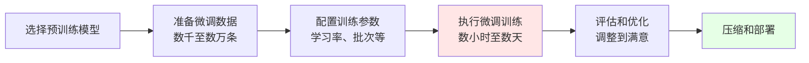

**与从零训练的对比**：

| 维度 | 从零训练 | 微调 |
|------|---------|------|
| **起点** | 随机初始化 | 预训练模型 |
| **数据量** | 百万级以上 | 数千到数万 |
| **训练时间** | 数周到数月 | 数小时到数天 |
| **算力需求** | 数百到数千GPU | 单卡到数卡GPU |
| **成本** | 数十万到数百万美元 | 数百到数千美元 |
| **适用场景** | 构建基座模型 | 特定任务适配 |

### 常用的训练和微调框架

#### 深度学习框架

| 框架 | 开发者 | 特点 | 适用场景 |
|------|-------|------|---------|
| **`PyTorch`** | Meta | 灵活、易用、社区活跃 | 研究和生产都适合 |
| **`TensorFlow`** | Google | 生态完善、部署方便 | 大规模生产环境 |
| **`JAX`** | Google | 高性能、函数式编程 | 高性能计算、研究 |
| **`MindSpore`** | 华为 | 国产、支持昇腾 | 国产芯片适配 |

#### 大模型训练框架

| 框架 | 特点 | 核心功能 |
|------|------|---------|
| **`Transformers`** | `HuggingFace`出品，最流行 | 预训练模型库、训练工具 |
| **`DeepSpeed`** | 微软，高效分布式训练 | `ZeRO`优化、流水线并行 |
| **`Megatron-LM`** | NVIDIA，超大模型训练 | 张量并行、模型并行 |
| **`Accelerate`** | `HuggingFace`，简化分布式 | 统一多卡/多机训练接口 |
| **`LLaMA-Factory`** | 国内开源，微调工具箱 | 一站式微调、支持多种方法 |

#### 微调工具

**1. Transformers Trainer**

`HuggingFace`提供的高级训练接口：

```python
from transformers import Trainer, TrainingArguments

training_args = TrainingArguments(
    output_dir="./results",
    num_train_epochs=3,
    per_device_train_batch_size=4,
    learning_rate=2e-5,
    logging_steps=100,
)

trainer = Trainer(
    model=model,
    args=training_args,
    train_dataset=train_dataset,
    eval_dataset=eval_dataset,
)

trainer.train()
```

**特点**：
- 开箱即用，易上手
- 自动处理数据加载、梯度更新、日志记录
- 支持分布式训练

**2. LLaMA-Factory**

国内流行的微调工具，支持图形界面：

```bash
# 安装
git clone https://github.com/hiyouga/LLaMA-Factory.git
cd LLaMA-Factory
pip install -r requirements.txt

# 启动Web界面
python src/train_web.py
```

**特点**：
- 支持`LoRA`、`QLoRA`等高效微调
- 内置多种预训练模型
- 提供Web界面，无需写代码
- 支持`SFT`、`RLHF`等多种训练方式

**3. Axolotl**

功能强大的微调工具：

```yaml
# 配置文件示例
base_model: meta-llama/Llama-2-7b-hf
model_type: LlamaForCausalLM
tokenizer_type: LlamaTokenizer

datasets:
  - path: tatsu-lab/alpaca
    type: alpaca

lora_r: 8
lora_alpha: 16
lora_dropout: 0.05

num_epochs: 3
learning_rate: 0.0002
```

**特点**：
- 配置文件驱动，灵活性高
- 支持多种数据格式
- 集成各种优化技术

#### RLHF专用框架

| 框架 | 特点 | 使用门槛 |
|------|------|---------|
| **`TRL`** | `HuggingFace`出品，简单易用 | 较低 |
| **`DeepSpeed-Chat`** | 微软，高性能完整流程 | 中等 |
| **`RLHF-Flow`** | OpenAI风格的RLHF实现 | 较高 |

**TRL使用示例**：

```python
from trl import PPOTrainer, PPOConfig
from transformers import AutoModelForCausalLM

# 配置PPO
ppo_config = PPOConfig(
    model_name="gpt2",
    learning_rate=1.41e-5,
    batch_size=128,
)

# 创建训练器
ppo_trainer = PPOTrainer(
    config=ppo_config,
    model=model,
    ref_model=ref_model,
    tokenizer=tokenizer,
)

# 训练循环
for epoch in range(num_epochs):
    for batch in dataloader:
        query_tensors = batch["input_ids"]
        
        # 生成响应
        response_tensors = ppo_trainer.generate(
            query_tensors,
            return_prompt=False,
        )
        
        # 获取奖励
        rewards = reward_model(query_tensors, response_tensors)
        
        # PPO更新
        stats = ppo_trainer.step(query_tensors, response_tensors, rewards)
```

### 训练成本估算

了解训练成本有助于项目规划：

#### 计算公式

**训练成本 = GPU成本 × 训练时间**

```
GPU成本（美元/小时）：
- A100 (40GB)：约 $3/小时
- A100 (80GB)：约 $5/小时
- V100 (32GB)：约 $2/小时
- H100 (80GB)：约 $8/小时

训练时间估算：
训练时间 ≈ (样本数 × 轮次 × 序列长度) / (GPU数 × 单卡吞吐量)
```

#### 成本示例

**场景1：SFT微调LLaMA-7B**

```
数据量：50,000条
轮次：3
GPU：4 × A100 (40GB)
训练时间：约8小时
成本：4 × $3 × 8 = $96
```

**场景2：增量预训练LLaMA-7B**

```
数据量：100GB文本
GPU：32 × A100 (80GB)
训练时间：约3天
成本：32 × $5 × 72 = $11,520
```

**场景3：RLHF优化LLaMA-13B**

```
数据量：30,000组对比数据
GPU：8 × A100 (80GB)
训练时间：约5天（包括RM训练和PPO）
成本：8 × $5 × 120 = $4,800
```

### 实践建议

#### 新手入门建议

1. **从小模型开始**：先用`BERT-Base`（110M）或`LLaMA-7B`练手
2. **使用现成工具**：推荐`LLaMA-Factory`的Web界面，无需写代码
3. **从公开数据集开始**：使用`Alpaca`、`BELLE`等开源数据集
4. **云服务器练习**：租用云`GPU`（如AutoDL、阿里云PAI），成本可控
5. **参考教程和案例**：`HuggingFace`文档、`GitHub`开源项目

#### 工程实践建议

1. **数据质量优先**：宁可少而精，不要多而杂
2. **小步迭代**：先用小数据集快速验证，再扩大规模
3. **版本管理**：记录每次实验的配置、数据、结果
4. **实验追踪**：使用`Weights & Biases`或`TensorBoard`记录训练过程
5. **成本控制**：使用`LoRA`等参数高效微调方法，节省资源
6. **安全合规**：确保数据使用合法，模型输出安全

#### 常见陷阱与避坑指南

| 问题 | 原因 | 解决方案 |
|------|------|---------|
| **训练不收敛** | 学习率过大、数据有问题 | 降低学习率、检查数据 |
| **过拟合严重** | 数据量不足、模型太大 | 增加数据、使用正则化、早停 |
| **显存不足** | 批次大小过大、模型太大 | 减小批次、使用梯度累积、混合精度 |
| **效果不如预期** | 基座模型选择不当、数据质量差 | 尝试其他模型、改进数据 |
| **训练速度慢** | 单卡训练、未优化 | 使用分布式、混合精度、高效框架 |

## 总结

本文系统介绍了`AI`模型训练与微调的核心概念和实践方法：

**基础概念**：
- 机器学习、深度学习、神经网络的关系和区别
- `AI`模型训练的基本原理和流程

**训练方法**：
- **预训练（`PT`）**：在海量数据上构建通用基座模型
- **增量预训练（`CPT`）**：在特定领域数据上继续训练，增强专业能力

**微调方法**：
- **全量微调（`FT`）**：更新所有参数，适合数据充足、追求最佳效果的场景
- **有监督微调（`SFT`）**：学习指令遵循，让模型听懂人类指令
- **强化微调（`RFT`）**：通过奖励优化，适合难以定义标准答案的任务
- **人类偏好对齐（`RLHF`）**：学习人类偏好，让模型输出更符合人类期望

**实践应用**：
- 介绍了智能客服、文档处理、代码助手等典型业务场景
- 详细说明了训练和微调的完整流程
- 推荐了主流的框架和工具
- 提供了成本估算和实践建议

**技术选择建议**：
- 没有绝对最好的方法，关键是匹配任务需求和资源条件
- 实践中常常组合使用多种方法（如预训练→增量预训练→`SFT`→`RLHF`）
- 从小规模开始，快速迭代，逐步优化

希望本文能帮助你建立对`AI`模型训练与微调的全面认识，为实际项目提供指导。随着技术的不断发展，新的训练方法和工具还在持续涌现，保持学习和实践是掌握这门技术的关键。

