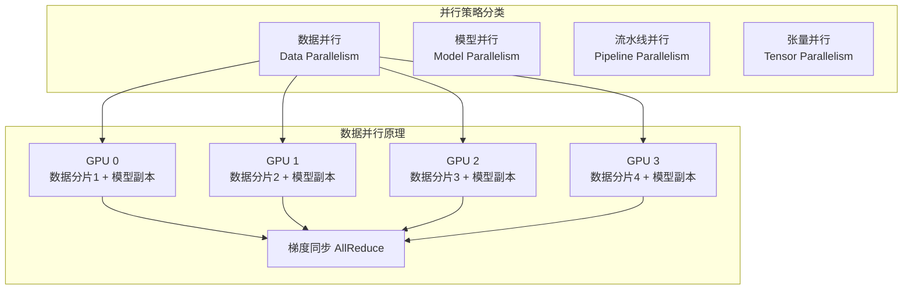

在`AI`大模型训练中，单个`GPU`的计算能力和显存往往无法满足需求，需要使用多个`GPU`协同工作。并行策略就是如何合理地将训练任务分配到多个`GPU`上的方法。

## 并行策略分类对比

| 并行策略 | 核心原理 | 简单理解 | 适用场景 | 
|---------|---------|---------|---------|
| **数据并行** `Data Parallelism (DP)` | 每个`GPU`持有完整模型，处理不同的数据分片 | 就像4个厨师，每人拿着相同的菜谱（模型），同时做不同的菜（数据），最后交流心得（同步梯度） | 模型较小，数据量大 |
| **模型并行** `Model Parallelism (MP)` | 将模型的不同层分配到不同`GPU` | 就像流水线，第1个工人加工零件A（第1层），传给第2个工人加工零件B（第2层） | 模型超大，单`GPU`装不下 |
| **流水线并行** `Pipeline Parallelism (PP)` | 模型并行+微批次流水线优化 | 改进版流水线：第1批数据在第1个工人处理时，第2批数据同时进入第2个工人 | 大模型+想提高效率 |
| **张量并行** `Tensor Parallelism (TP)` | 将单个神经网络层的计算拆分到多个`GPU` | 就像搬一个大箱子，几个人同时抬不同部位 | 单层计算量特别大 |

## 数据并行详解

数据并行是最常用的并行策略，下面通过图示和术语表来深入理解：



### 核心术语

| 术语 | 英文 | 定义 | 通俗理解 | 在数据并行中的作用 |
|------|-----|------|---------|-------------------|
| **数据分片** | `Data Sharding` | 将完整训练数据集切分成多份，每份分配给一个`GPU` | 把一本书的页码平均分给4个人同时阅读 | 图中`GPU 0/1/2/3`各自处理不同"数据分片"，避免重复计算相同数据 |
| **模型副本** | `Model Replica` | 每个`GPU`上存储的完整模型拷贝 | 每个人手里都有一本相同的菜谱（模型） | 确保每个`GPU`都能独立完成前向和反向传播计算 |
| **前向传播** | `Forward Pass` | 数据从输入层经过各层计算到输出层的过程 | 按照菜谱一步步做菜的过程 | 每个`GPU`独立用自己的数据分片计算输出，互不干扰 |
| **反向传播** | `Backward Pass` | 从输出层计算损失，逐层计算梯度传回输入层 | 做完菜后总结每一步的改进空间 | 每个`GPU`独立计算自己数据分片产生的梯度 |
| **梯度** | `Gradient` | 损失函数对模型参数的导数（记为`grad_W`），指示参数更新方向 | 告诉你模型参数应该往哪个方向调整、调多少 | 每个`GPU`计算出"本地梯度"，需要同步后才能更新模型 |
| **梯度同步** | `Gradient Synchronization` | 将所有`GPU`的梯度汇总求平均（或求和），让所有`GPU`得到相同的梯度 | 4个厨师分别做菜后，交流心得并达成一致意见 | **数据并行的关键步骤**：确保所有`GPU`用相同的梯度更新模型，保持模型一致性 |
| **AllReduce** | `AllReduce` | 一种集合通信算法，高效地完成"所有进程的数据求和并广播给所有进程" | 就像开会时统计大家的意见，算出平均值，再告诉每个人 | 实现梯度同步的高效通信方式，比逐个传递快得多 |
| **参数更新** | `Parameter Update` | 使用梯度更新模型参数：`W_new = W_old - 学习率 × grad_W` | 根据改进建议（梯度）修改菜谱（模型） | 同步后所有`GPU`用相同梯度更新参数，确保模型一致 |
| **DistributedSampler** | `Distributed Sampler` | `PyTorch`提供的数据采样器，确保各`GPU`取到不重复的数据分片 | 自动分配工作的调度员，保证4个人不会重复读同一页书 | 训练时必须使用，否则所有`GPU`会处理相同数据导致浪费 |

### 完整训练流程（以4个GPU为例）

1. **初始化阶段**：
   - `4`个`GPU`各自加载相同的模型副本（模型参数完全一致）
   - 准备好完整的训练数据集

2. **数据分片**：
   - 使用`DistributedSampler`将一个批次（例如`256`张图片）均匀分成`4`份
   - `GPU 0`处理图片`1-64`，`GPU 1`处理图片`65-128`，以此类推

3. **前向传播**（各GPU独立计算）：
   - 每个`GPU`用自己的`64`张图片，通过模型计算得到预测结果
   - 这一步**不需要通信**，各`GPU`并行执行

4. **反向传播**（各GPU独立计算梯度）：
   - 每个`GPU`计算损失，并反向传播得到本地梯度
   - `GPU 0`得到梯度`grad_W0`，`GPU 1`得到`grad_W1`，`GPU 2`得到`grad_W2`，`GPU 3`得到`grad_W3`

5. **梯度同步**（关键通信步骤）：
   - 通过`AllReduce`操作，所有`GPU`交换梯度并求平均
   - 最终所有`GPU`得到相同的平均梯度：`grad_W = (grad_W0 + grad_W1 + grad_W2 + grad_W3) / 4`

6. **参数更新**（各GPU独立执行）：
   - 每个`GPU`用相同的平均梯度更新自己的模型参数
   - 由于起点相同（上一步参数一致）、更新量相同（同步后的梯度一致），所以更新后参数仍然一致

7. **重复步骤2-6**，直到训练完成

### 为什么需要梯度同步？

假设没有梯度同步，会发生什么：
- `GPU 0`看到猫的图片，学到"有毛→是猫"
- `GPU 1`看到狗的图片，学到"有毛→是狗"
- 两个`GPU`的模型会朝不同方向更新，导致模型"分裂"

梯度同步让所有`GPU`看到全局信息：
- 同步后梯度 = "有毛→50%是猫 + 50%是狗"
- 所有`GPU`用这个全局视角更新模型，保持一致性

## 其他并行策略

### 模型并行（Model Parallelism）

- **原理**：将模型的不同层分配到不同`GPU`，数据依次流过各层
- **示例**：4层神经网络，第1层在`GPU 0`，第2层在`GPU 1`...
- **适用场景**：模型太大（如`GPT-3`有1750亿参数），单个`GPU`显存装不下
- **优势**：突破单卡显存限制，可以训练超大模型
- **缺点**：同一时刻只有一个`GPU`在工作，其他`GPU`在等待，利用率低

### 流水线并行（Pipeline Parallelism）

- **原理**：模型并行的优化版，将数据切分成多个小批次（微批次），流水线式处理
- **示例**：当微批次1在`GPU 1`处理时，微批次2可以进入`GPU 0`，减少空闲
- **适用场景**：大模型+需要提高`GPU`利用率
- **优势**：减少`GPU`空闲时间，提高资源利用率
- **实现**：如`DeepSpeed`、`Megatron-LM`等框架

**流水线示意**：

```text
时间 t1: [GPU0处理batch1-layer1] [GPU1空闲]         [GPU2空闲]         [GPU3空闲]
时间 t2: [GPU0处理batch2-layer1] [GPU1处理batch1-layer2] [GPU2空闲]         [GPU3空闲]
时间 t3: [GPU0处理batch3-layer1] [GPU1处理batch2-layer2] [GPU2处理batch1-layer3] [GPU3空闲]
时间 t4: [GPU0处理batch4-layer1] [GPU1处理batch3-layer2] [GPU2处理batch2-layer3] [GPU3处理batch1-layer4]
```

### 张量并行（Tensor Parallelism）

- **原理**：将单个网络层的矩阵运算拆分到多个`GPU`并行计算
- **示例**：一个`[1024, 1024]`的矩阵乘法，拆成`4`个`[1024, 256]`的小矩阵在`4`个`GPU`上同时计算
- **适用场景**：超大的`Transformer`模型，单个注意力层计算量巨大
- **优势**：层内并行，减少等待时间
- **实现**：如`Megatron-LM`对`GPT`模型的张量并行实现

**矩阵分割示例**：

```text
原始矩阵乘法: [M × K] × [K × N] = [M × N]

张量并行（按列切分）:
GPU 0: [M × K] × [K × N/4] = [M × N/4]
GPU 1: [M × K] × [K × N/4] = [M × N/4]
GPU 2: [M × K] × [K × N/4] = [M × N/4]
GPU 3: [M × K] × [K × N/4] = [M × N/4]

最后拼接: [M × N/4] + [M × N/4] + [M × N/4] + [M × N/4] = [M × N]
```

## 混合并行策略

在实际的大模型训练中，通常会**组合使用**多种并行策略以获得最佳性能：

### 2维并行：数据并行 + 模型并行

适用于中大型模型训练：
- **场景**：8节点，每节点8卡，共64卡
- **策略**：节点间数据并行（8路），节点内模型并行（8层）
- **优势**：既能利用数据并行的高效性，又能突破单卡显存限制

### 3维并行：数据并行 + 张量并行 + 流水线并行

适用于超大模型训练（如GPT-3）：
- **数据并行**：跨多个节点复制模型
- **流水线并行**：将模型垂直切分为多个stage
- **张量并行**：在每个stage内，将层水平切分

**示例配置（GPT-3训练）**：

- 数据并行度：8
- 流水线并行度：16
- 张量并行度：8
- 总GPU数：8 × 16 × 8 = 1024

## 通信开销对比

| 并行策略 | 通信频率 | 通信数据量 | 带宽需求 | 延迟敏感度 |
|---------|---------|-----------|---------|-----------|
| 数据并行 | 每个`batch` | 梯度大小 ≈ 模型大小 | 高 | 中 |
| 模型并行 | 每层前向/反向 | 激活值大小 | 中 | 高 |
| 流水线并行 | 每个微批次 | 激活值大小 | 低 | 中 |
| 张量并行 | 每层内部 | 中间结果 | 极高 | 极高 |

## 参考资料

- [Megatron-LM: Training Multi-Billion Parameter Language Models](https://arxiv.org/abs/1909.08053)
- [GPipe: Efficient Training of Giant Neural Networks](https://arxiv.org/abs/1811.06965)
- [ZeRO: Memory Optimizations Toward Training Trillion Parameter Models](https://arxiv.org/abs/1910.02054)
- [PyTorch Distributed Overview](https://pytorch.org/tutorials/beginner/dist_overview.html)
- [DeepSpeed Documentation](https://www.deepspeed.ai/)
