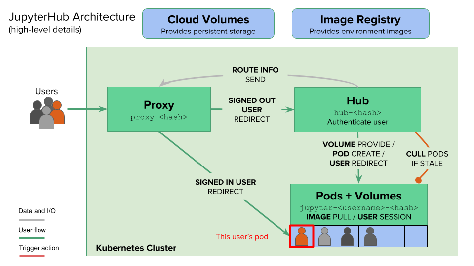

## 什么是JupyterHub

`JupyterHub` 是一个多用户的`Jupyter Notebook`服务器，它允许多个用户通过`Web`浏览器访问和使用独立的`Jupyter`计算环境。`JupyterHub` 为每个用户提供了一个独立的、可定制的`Jupyter Notebook`环境，使得为一个群体（如一个班级的学生、一个研究团队或企业的数据科学团队）提供和标准化计算环境变得简单易行。

简单来说，`JupyterHub` 就是一个"`Jupyter`即服务"的平台，它通过`Web`界面为用户提供访问，让用户无需在本地安装和配置复杂的开发环境。

## JupyterHub解决的问题

### 环境配置和管理问题

**传统痛点**：
- 每个用户需要在自己的机器上安装和配置 `Jupyter`、`Python`、各种库和依赖
- 不同机器上的环境配置往往不一致，导致"在我机器上能运行"的问题
- 环境配置错误会消耗大量的时间和精力

**`JupyterHub` 的解决方案**：
- 提供统一的、预配置的计算环境
- 用户只需要一个浏览器就能访问完整的开发环境
- 管理员可以集中管理和更新所有用户的环境

### 计算资源分配问题

**传统痛点**：
- 个人电脑的计算资源有限，无法处理大规模数据和复杂模型
- 购买和维护高性能计算设备成本高昂
- 资源利用率低，造成浪费

**`JupyterHub` 的解决方案**：
- 可以部署在云端或本地集群上，提供强大的计算能力
- 支持资源的动态分配，根据需求自动扩缩容
- 多个用户共享计算资源，提高利用率
- 可以为不同用户配置不同级别的资源（`CPU`、内存、`GPU`等）

### 多用户协作和管理问题

**传统痛点**：
- 难以为大量用户（如整个班级或团队）快速提供统一的工作环境
- 用户管理、权限控制、资源配额管理复杂
- 缺乏对用户活动的监控和管理能力

**`JupyterHub` 的解决方案**：
- 支持多种身份认证方式（`OAuth`、`LDAP`、本地认证等）
- 提供管理界面，可以查看所有用户和他们的服务器状态
- 支持用户权限管理和资源配额限制
- 可以批量创建和管理用户环境

### 数据持久化和共享问题

**传统痛点**：
- 用户数据分散在各自的机器上，难以备份和共享
- 数据安全和隐私保护难以保障

**`JupyterHub` 的解决方案**：
- 为每个用户提供持久化存储，数据不会因会话结束而丢失
- 支持集中式的数据备份和恢复
- 可以配置共享存储，方便团队协作
- 统一的安全策略和访问控制

## JupyterHub系统架构

`JupyterHub` 采用分层的微服务架构设计，在`Kubernetes`环境中通过多个独立的组件协同工作，实现多用户`Jupyter Notebook`服务。整体架构遵循关注点分离的原则，每个组件负责特定的功能。



### 架构设计特点

1. **分层架构**：清晰的三层结构
   - **接入层**：`Proxy` 和`Autohttps`负责流量接入和路由
   - **控制层**：`Hub` 负责认证、授权和资源编排
   - **服务层**：`Singleuser Server` 提供实际的计算服务

2. **松耦合设计**：组件之间通过标准接口通信
   - `Hub`通过`REST API`与`Proxy`通信
   - `Hub`通过`Kubernetes API`管理用户 `Pod`
   - 各组件可以独立升级和扩展

3. **云原生特性**：充分利用`Kubernetes`能力
   - 容器化部署，易于扩展和维护
   - 声明式配置，使用`Helm Chart`管理
   - 自动故障恢复和健康检查
   - 支持动态扩缩容

### 架构关系图

```text
┌──────────────────────────────────────────────────────────────────────────┐
│                              User Browser                                │
└─────────────────────────────────┬────────────────────────────────────────┘
                                  │ HTTPS/HTTP Request
                                  ↓
                   ┌────────────────────────────────┐
                   │  Autohttps Pod (Optional)      │
                   │  - Traefik Proxy               │
                   │  - Let's Encrypt Cert Manager  │
                   └──────────────┬─────────────────┘
                                  │ HTTPS Termination
                                  ↓
                   ┌────────────────────────────────┐
                   │  Proxy Pod                     │
                   │  - Configurable HTTP Proxy     │
                   │  - Dynamic Routing Table       │
                   │  - Port 8000 (Public)          │
                   │  - Port 8001 (API)             │
                   └────────┬──────────────┬────────┘
                            │              │
                            │              │ REST API (Route Management)
              Route to Hub  │              ↓
              or User Pod   │    ┌─────────────────────────────┐
                            │    │   Hub Pod                   │
                            │    │  ┌───────────────────────┐  │
                            │    │  │ JupyterHub Core       │  │
                            │    │  ├───────────────────────┤  │
                            │    │  │ Authenticator         │  │
                            │    │  ├───────────────────────┤  │
                            │    │  │ KubeSpawner           │  │
                            │    │  ├───────────────────────┤  │
                            │    │  │ Admin Panel           │  │
                            │    │  └───────────────────────┘  │
                            │    └──────────┬──────────────────┘
                            │               │ Kubernetes API
                            │               ↓
                            │    ┌─────────────────────────────┐
                            │    │  Kubernetes API Server       │
                            │    └──────────┬──────────────────┘
                            │               │
                            │               │ Create/Manage Pods
                            │               ↓
                            │    ┌──────────────────────────────────┐
                            │    │  User Scheduler Pod (Optional)   │
                            │    │  - Optimize Pod Scheduling       │
                            │    └──────────────────────────────────┘
                            │               │
                            │               ↓
         ┌──────────────────┴──────────────────────────────────────┐
         │                   User Pod Cluster                      │
         │  ┌─────────────┐  ┌─────────────┐  ┌──────────────┐     │
         │  │jupyter-user1│  │jupyter-user2│  │jupyter-...   │     │
         │  │             │  │             │  │              │     │
         │  │ Jupyter     │  │ Jupyter     │  │ Jupyter      │     │
         │  │ Server      │  │ Server      │  │ Server       │     │
         │  │             │  │             │  │              │     │
         │  │ + PVC       │  │ + PVC       │  │ + PVC        │     │
         │  │ (Storage)   │  │ (Storage)   │  │ (Storage)    │     │
         │  └─────────────┘  └─────────────┘  └──────────────┘     │
         └─────────────────────────────────────────────────────────┘
```

### 数据流说明

**用户登录和环境创建流程**：
1. 用户通过浏览器访问 → `Autohttps`（可选） → `Proxy`
2. `Proxy`发现用户未登录 → 转发到 `Hub`
3. `Hub`的`Authenticator`验证用户身份
4. 认证成功后，`Hub` 通过`KubeSpawner`调用 `Kubernetes API`
5. `Kubernetes`根据`User Scheduler`的策略创建用户 `Pod`
6. 用户`Pod`启动后，`Hub` 通知`Proxy`更新路由表
7. `Proxy`将用户请求转发到对应的用户 `Pod`

**用户再次访问流程**：
1. 用户访问 →`Autohttps`→ `Proxy`
2. `Proxy`通过`Cookie`识别用户，查找路由表
3. 直接将请求转发到用户的 `Pod`（跳过 `Hub`）

## JupyterHub的核心组件

`JupyterHub` 在`Kubernetes`环境中主要由以下核心组件构成：

### Hub（核心控制器）

**作用**：
`Hub` 是`JupyterHub`的大脑和核心控制中心，负责整个系统的协调和管理。它是用户认证、资源分配、路由管理的中枢，所有的控制逻辑都在这里执行。

**核心子组件**：

#### Authenticator（认证器）

负责验证用户身份，支持多种认证方式：

- **`DummyAuthenticator`**：用于测试环境，允许任意用户名密码登录，不建议生产使用
- **`OAuthAuthenticator`**：支持`OAuth 2.0`认证协议
  - `GitHubOAuthenticator`：通过`GitHub`账号登录
  - `GoogleOAuthenticator`：通过`Google`账号登录
  - `GenericOAuthenticator`：支持任意`OAuth`提供商
- **`LDAPAuthenticator`**：企业`LDAP/AD`认证，适合企业内部部署
- **`NativeAuthenticator`**：本地用户数据库认证，支持用户注册和密码管理
- **自定义认证器**：可以继承基类实现自己的认证逻辑

认证器的职责：
- 验证用户凭据（用户名/密码、`Token`等）
- 获取用户信息（用户名、`Email`、权限等）
- 确定用户是否有管理员权限
- 支持用户白名单和黑名单

#### Spawner（环境生成器）

负责为用户创建和管理独立的计算环境，在`Kubernetes`环境中使用 `KubeSpawner`：

**主要职责**：
- **Pod 生命周期管理**：
  - 创建：根据配置创建用户 `Pod`
  - 启动：等待`Pod`启动并就绪
  - 停止：停止不活跃的用户 `Pod`
  - 删除：清理用户`Pod`和相关资源
  
- **资源配置**：
  - `CPU`和内存限制（`requests` 和 `limits`）
  - `GPU`资源分配（如果集群支持）
  - 存储卷配置（`PVC` 持久化存储）
  - 环境变量设置
  
- **镜像管理**：
  - 指定用户`Pod`使用的`Docker`镜像
  - 支持多镜像选择（让用户选择不同的环境）
  - 镜像拉取策略配置
  
- **网络配置**：
  - `Pod`网络策略
  - 服务端口配置
  - `NodePort`或`LoadBalancer`配置

**高级特性**：
- **ProfileList**：为用户提供多个规格配置选择（小型、中型、大型、`GPU`等预置规格）
- **动态配置**：根据用户属性动态调整资源配置
- **Pre-spawn Hook**：在创建`Pod`前执行自定义逻辑
- **Post-stop Hook**：在停止`Pod`后执行清理工作

#### 数据库

`Hub` 使用数据库存储用户信息和服务器状态：

**存储内容**：
- 用户账号信息（用户名、认证信息等）
- 用户服务器状态（运行中、已停止等）
- `OAuth`令牌和会话信息
- `API`令牌
- 服务（`Service`）配置

**支持的数据库**：
- **SQLite**：默认选项，适合小规模部署
  - `sqlite-pvc`：使用持久化卷存储（推荐）
  - `sqlite-memory`：内存数据库（仅测试用）
- **PostgreSQL**：推荐用于生产环境
- **MySQL**：也支持，但`PostgreSQL`更常用

#### 管理界面

提供`Web`管理控制台：

**管理功能**：
- 查看所有用户列表
- 查看每个用户的服务器状态（运行中/已停止）
- 为用户启动/停止服务器
- 访问用户的`Notebook`环境（以管理员身份）
- 添加/删除用户
- 管理用户权限（设置管理员）
- 查看服务器日志

**访问路径**：`<jupyterhub-url>/hub/admin`

**技术实现**：
- 运行在单个`Kubernetes Pod`中
- 包含`JupyterHub`主进程、`KubeSpawner`、`Authenticator` 等组件
- 通过`Kubernetes Service`暴露内部 `API`（端口 `8081`）
- 使用`ConfigMap`存储配置
- 使用`Secret`存储敏感信息（数据库密码、`API Token`等）
- 支持水平扩展（但通常只运行单个实例）

**重要配置项**：
- `hub.config.JupyterHub`：`JupyterHub` 核心配置
- `hub.config.Authenticator`：认证器配置
- `hub.config.KubeSpawner`：`Spawner` 配置
- `hub.db`：数据库配置
- `hub.resources`：`Pod` 资源限制

### Proxy（代理服务器）

**作用**：
`Proxy` 是用户访问的入口点，是整个`JupyterHub`系统对外的门户，负责将用户请求智能路由到正确的目标（`Hub` 或用户 `Pod`）。它基于 `Configurable HTTP Proxy`（`CHP`）实现。

**核心功能**：

#### 流量路由和分发

`Proxy` 接收所有用户的`HTTP/HTTPS`请求，并根据请求路径和用户身份进行智能路由：

**路由规则**：
- `/hub/*`：所有以`/hub/`开头的请求转发到 `Hub Pod`
  - `/hub/login`：登录页面
  - `/hub/admin`：管理界面
  - `/hub/api/*`：`Hub API` 接口
  
- `/user/<username>/*`：转发到对应用户的 `Pod`
  - 如：`/user/alice/lab` →`alice`的 `Notebook Pod`
  - 如：`/user/bob/tree` →`bob`的文件浏览器
  
- `/`：根路径，重定向到`/hub/`或用户的 `Notebook`

**智能判断**：
- 检查用户是否已登录（通过 `Cookie`）
- 检查用户的`Pod`是否存在并运行中
- 未登录用户 → 转发到`Hub`的登录页面
- 已登录但无`Pod`→ 转发到`Hub`启动环境
- 已登录且有`Pod`→ 直接转发到用户 `Pod`

#### 动态路由表管理

`Proxy` 维护一个内存中的路由映射表：

**路由表结构**：
```text
/user/alice → http://jupyter-alice.namespace.svc:8888
/user/bob   → http://jupyter-bob.namespace.svc:8888
/hub        → http://hub.namespace.svc:8081
```

**路由更新机制**：
- `Hub`通过 `REST API`（端口 `8001`）向`Proxy`发送路由更新
- 当用户`Pod`创建完成时，`Hub` 添加路由规则
- 当用户`Pod`停止时，`Hub` 删除路由规则
- 路由表实时更新，无需重启 `Proxy`

#### 会话保持和连接管理

**Cookie 管理**：
- 使用加密的`Cookie`存储用户身份信息
- `Cookie`名称：`jupyterhub-session-id`
- 支持跨域访问（CORS）配置

**WebSocket 支持**：
- `Jupyter Notebook`需要`WebSocket`连接来实现实时交互
- `Proxy`正确处理`WebSocket`升级请求
- 保持长连接，支持`Notebook Kernel`通信

**连接超时**：
- 配置空闲超时时间
- 超时后不会立即断开，而是标记为不活跃
- 配合 `jupyterhub-idle-culler` 清理不活跃的用户 `Pod`

#### 技术实现细节

**基于 Configurable HTTP Proxy（CHP）**：
- `Node.js`实现的高性能`HTTP`代理
- 支持动态配置路由规则
- 提供`REST API`用于路由管理

**容器配置**：
- 运行在独立的`Kubernetes Pod`中
- 通常配置为单副本（状态在内存中）
- 使用`Recreate`部署策略而非 `RollingUpdate`

**网络端口**：
- **公共端口（8000）**：接收用户请求，通过`Service`暴露
- **API 端口（8001）**：接收`Hub`的路由管理命令，仅集群内访问

**Service 配置**：
- `proxy-public Service`：对外暴露，类型可以是 `LoadBalancer`、`NodePort` 或 `ClusterIP`
- `proxy-api Service`：仅集群内部访问，类型为 `ClusterIP`

**安全配置**：
- `API`端口使用认证 `Token`（`proxy.secretToken`）
- 与`Hub`共享相同的 `Token`
- 防止未授权的路由修改

**性能优化**：
- 使用异步 `I/O`，支持大量并发连接
- 内存中维护路由表，查找速度快
- 支持`HTTP/2`和 `Keep-Alive`

### Singleuser Server（用户Notebook服务器）

**作用**：
`Singleuser Server` 为每个用户提供独立的`Jupyter Notebook`运行环境，是用户实际工作的计算空间。每个用户对应一个独立的 `Kubernetes Pod`。

**核心功能**：

#### Jupyter Notebook 服务

**基础服务**：
- 运行`Jupyter Server`或 `JupyterLab`，提供`Web`界面
- 支持多种编程语言（通过 `Kernel`）：
  - `Python（IPython Kernel）`
  - `R（IRkernel）`
  - `Julia`、`Scala`、`JavaScript` 等
- 提供文件管理、终端、文本编辑器等功能

**用户体验**：
- 支持`Jupyter Notebook`经典界面
- 支持`JupyterLab`现代化界面
- 支持`Jupyter Server`扩展和插件
- 支持多种主题和界面定制

#### 计算资源管理

**资源配置**：
- **CPU**：
  - `requests`：保证的最小`CPU`资源
  - `limits`：最大可使用的`CPU`资源
  - 示例：`requests: 0.5`，`limits: 2`
  
- **内存**：
  - `requests`：保证的最小内存
  - `limits`：最大可使用内存，超出会被 `OOM Kill`
  - 示例：`requests: 1Gi`，`limits: 4Gi`
  
- **GPU**（可选）：
  - 使用 `NVIDIA GPU Operator`
  - 配置 `nvidia.com/gpu: 1`
  - 支持`CUDA`和深度学习框架

**资源隔离**：
- 每个用户`Pod`在独立的命名空间或使用 `ResourceQuota`
- 用户之间的计算资源完全隔离
- 不会相互影响性能

#### 数据持久化

**存储卷配置**：
- 使用 `PersistentVolumeClaim`（`PVC`）挂载用户目录
- 默认挂载点：`/home/jovyan`（`jovyan` 是默认用户名）
- 存储类（`StorageClass`）：根据集群配置选择

**持久化内容**：
- `Notebook`文件（`.ipynb`）
- 数据文件和数据集
- 用户安装的`Python`包（`pip install --user`）
- 配置文件（`.jupyter/`、`.bashrc` 等）
- 代码和脚本文件

**共享存储（可选）**：
- 配置只读共享卷，用于团队共享数据
- 配置读写共享卷，用于协作项目
- 使用 `NFS`、`Ceph` 或云存储服务

#### 镜像和环境

**Docker 镜像**：
- 基础镜像：`jupyter/base-notebook`
- 数据科学镜像：`jupyter/scipy-notebook`、`jupyter/datascience-notebook`
- 深度学习镜像：`jupyter/tensorflow-notebook`、`jupyter/pytorch-notebook`
- 自定义镜像：可以构建包含特定库的镜像

**环境定制**：
- 在镜像中预装常用库和工具
- 使用`requirements.txt`或 `conda environment.yml`
- 配置 `JUPYTER_ENABLE_LAB=yes` 启用 `JupyterLab`
- 设置环境变量（`API` 密钥、配置路径等）

#### 网络和安全

**网络配置**：
- 每个`Pod`有独立的`IP`地址
- 通过`Service`暴露端口（默认 `8888`）
- `Proxy`通过`Service`名称访问用户 `Pod`

**安全特性**：
- 运行在非`root`用户下（`jovyan`，`UID 1000`）
- 使用`SecurityContext`限制权限
- 支持`NetworkPolicy`网络隔离
- 禁用特权容器（`privilege escalation`）

**技术实现**：
- 每个用户对应一个独立的 `Kubernetes Pod`
- `Pod`名称格式：`jupyter-<username>`（可自定义）
- 由`Hub`通过`KubeSpawner`动态创建和销毁
- 支持多种镜像选择（`ProfileList`）
- 使用`Init Containers`进行环境初始化
- 支持`Sidecar`容器（如日志收集、监控等）

### User Scheduler（可选，用户调度器）

**作用**：
`User Scheduler`是一个可选的优化组件，提供更智能的`Pod`调度策略，优化用户`Pod`在`Kubernetes`集群中的分布和资源利用。

**核心功能**：

#### 智能调度策略

**均衡分布**：
- 避免所有用户`Pod`集中在少数节点上
- 实现跨节点的负载均衡
- 考虑节点的资源使用情况（`CPU`、`内存`、`GPU`）
- 优先选择资源充足的节点

**亲和性和反亲和性**：
- **Pod 反亲和性**：避免将过多用户`Pod`调度到同一节点
- **节点亲和性**：优先调度到特定标签的节点（如`GPU`节点）
- **拓扑域分散**：跨可用区（`AZ`）分散 `Pod`

#### 资源优化

**集群自动扩缩容支持**：
- 配合`Cluster Autoscaler`工作
- 当集群资源不足时，触发节点扩容
- 当集群资源过剩时，协助节点缩容
- 优化新`Pod`在扩容后节点上的放置

**资源碎片优化**：
- 考虑节点剩余资源，避免资源碎片化
- `Bin Packing`策略：优先填满部分节点
- 或`Spread`策略：均匀分散到所有节点

#### 优先级和抢占

**Pod 优先级**：
- 为用户`Pod`设置优先级
- 高优先级用户可以抢占低优先级用户的资源
- 适合区分不同等级的用户或服务

**公平调度**：
- 确保所有用户有公平的资源获取机会
- 防止某些用户占用过多资源
- 配合资源配额（`ResourceQuota`）使用

**技术实现**：
- 独立的`Kubernetes Scheduler`实现
- 运行在专门的`Pod`中
- 通常配置为多副本（`2-3`个）以保证高可用
- 用户`Pod`通过`schedulerName`字段指定使用此调度器
- 基于 `kube-scheduler` 扩展，添加自定义策略

**配置示例**：
```yaml
scheduling:
  userScheduler:
    enabled: true
    replicas: 2
```

### Autohttps（可选，自动HTTPS）

**作用**：
`Autohttps` 自动管理`HTTPS`证书，为`JupyterHub`提供安全的加密访问通道，基于`Let's Encrypt`实现证书的自动申请和续期。

**核心功能**：

#### 证书管理

**自动申请**：
- 使用`Let's Encrypt`免费`SSL/TLS`证书
- 通过`ACME`协议自动完成域名验证
- 支持 `HTTP-01` 和 `TLS-ALPN-01` 验证方式
- 几分钟内完成证书申请

**自动续期**：
- 证书有效期通常为`90`天
- 在证书过期前`30`天自动续期
- 无需人工干预，完全自动化
- 续期失败会有告警和重试机制

**多域名支持**：
- 支持同时管理多个域名的证书
- 支持通配符证书（需要 `DNS-01` 验证）
- 每个域名独立申请和续期

#### HTTPS 代理

**流量终止**：
- 在`Proxy`前面提供`HTTPS`终止（`TLS Termination`）
- 接收加密的`HTTPS`请求（端口 `443`）
- 解密后转发到后端 `Proxy`（端口 `8000`）
- 后端通信可以是 `HTTP`（简化内部配置）

**安全特性**：
- 强制`HTTPS`访问，自动将`HTTP`重定向到 `HTTPS`
- 支持 `HSTS`（`HTTP Strict Transport Security`）
- 使用现代化的`TLS`协议（`TLS 1.2+`）
- 配置安全的加密套件

**端口配置**：
- **端口 80（HTTP）**：用于`ACME`验证和重定向
- **端口 443（HTTPS）**：接收加密流量
- **端口 8080**：健康检查端口

#### 技术实现

**基于 Traefik**：
- 使用`Traefik`作为反向代理和证书管理器
- `Traefik`是现代化的云原生代理
- 支持自动服务发现和动态配置
- 集成`Let's Encrypt``ACME` 客户端

**ACME 客户端**：
- 内置 `LEGO（Let's Encrypt GO）`客户端
- 支持多种`ACME`验证方式
- 证书存储在`Secret`中

**容器配置**：
- 运行在独立的`Kubernetes Pod`中
- 使用`PVC`持久化证书数据
- 通过`Service`暴露`HTTPS`端口

**配置示例**：
```yaml
proxy:
  https:
    enabled: true
    type: letsencrypt
    letsencrypt:
      contactEmail: admin@example.com
      acmeServer: https://acme-v02.api.letsencrypt.org/directory
    hosts:
      - jupyterhub.example.com
```

**技术实现**：
- 运行在独立的`Kubernetes Pod`中
- 使用`Traefik`作为代理和证书管理器
- 通过`Kubernetes Service`暴露`HTTPS`端口（`443`）
- 证书存储在`PersistentVolume`中，避免重复申请

## 组件之间的协作流程

### 用户首次访问流程

1. **用户访问**：用户通过浏览器访问`JupyterHub`地址（通过`Proxy`的 `Service`）
2. **HTTPS 终止**（可选）：如果启用 `Autohttps`，请求先经过`Traefik`进行`HTTPS`解密
3. **身份验证**：`Proxy` 发现用户未登录，将请求转发到 `Hub`
4. **认证处理**：`Hub` 的`Authenticator`验证用户身份（用户名密码、`OAuth` 等）
5. **创建环境**：认证成功后，`Hub` 通过`KubeSpawner`调用`Kubernetes API`创建用户 `Pod`
6. **调度 Pod**：`Kubernetes` 根据`User Scheduler`的策略将`Pod`调度到合适的节点
7. **等待就绪**：`Hub` 等待用户`Pod`启动并进入`Ready`状态
8. **更新路由**：`Hub` 通知`Proxy`添加路由规则（用户 →`Pod`地址）
9. **重定向**：`Hub` 将用户重定向到 `Proxy`，`Proxy` 根据路由表将请求转发到用户 `Pod`
10. **访问 Notebook**：用户成功访问自己的`Jupyter Notebook`环境

### 用户再次访问流程

1. **用户访问**：用户通过浏览器访问`JupyterHub`地址
2. **识别身份**：`Proxy` 通过`Cookie`识别用户身份
3. **检查 Pod**：`Proxy` 检查该用户的`Pod`是否存在并运行中
4. **直接转发**：如果`Pod`运行中，`Proxy` 直接将请求转发到用户 `Pod`（跳过 `Hub`）
5. **访问 Notebook**：用户直接访问到自己之前的工作环境，所有数据和状态都保持不变

### Pod 停止和清理流程

1. **空闲检测**：`jupyterhub-idle-culler` 检测到用户`Pod`空闲超时
2. **通知 Hub**：`Idle Culler` 通过 API 通知`Hub`停止用户服务器
3. **停止 Pod**：`Hub` 调用`Kubernetes API`删除用户 `Pod`
4. **更新路由**：`Hub` 通知`Proxy`删除对应的路由规则
5. **保留数据**：用户的`PVC`保留，数据不丢失
6. **下次启动**：用户再次访问时，重复首次访问流程，数据会重新挂载

## 简要总结

`JupyterHub` 通过精心设计的架构，将认证、资源管理、代理路由等功能分离到不同的组件中，每个组件专注于自己的职责。以下是各核心组件的职责总结：

| 组件 | 角色定位 | 核心职责 | 关键技术 | 部署方式 |
|------|----------|----------|----------|----------|
| **Hub** | 控制中枢 | • 用户认证和授权<br/>• 用户环境创建和管理<br/>• 路由规则管理<br/>• 管理界面提供 | • `Authenticator`（认证器）<br/>• `KubeSpawner`（环境生成器）<br/>• `SQLite`/`PostgreSQL`（数据库） | 单个 `Pod`<br/>端口`8081`|
| **Proxy** | 流量网关 | • 接收用户请求<br/>• 智能路由分发<br/>• 动态路由表管理<br/>•`WebSocket`支持 | • `Configurable HTTP Proxy (CHP)`<br/>• `REST API`（路由管理）<br/>•`Cookie`会话管理 | 单个 `Pod`<br/>端口 `8000`（公共）<br/>端口 `8001`（API） |
| **Singleuser Server** | 计算工作空间 | • `Jupyter Notebook`服务<br/>• 执行用户代码<br/>• 数据持久化<br/>• 文件管理 | • `Jupyter Server/JupyterLab`<br/>• `IPython Kernel`<br/>•`PVC`持久化存储 | 每用户一个 `Pod`<br/>端口`8888`|
| **User Scheduler** | 调度优化器（可选） | • 智能`Pod`调度<br/>• 负载均衡<br/>• 集群自动扩缩容支持<br/>• 资源碎片优化 | • 自定义 `Kubernetes Scheduler`<br/>• 亲和性和反亲和性策略 | 多副本 `Pod`<br/>（`2-3`个） |
| **Autohttps** | 安全卫士（可选） | •`HTTPS`证书自动管理<br/>•`TLS`终止<br/>• 强制`HTTPS`访问<br/>• 证书自动续期 | •`Traefik`反向代理<br/>• `Let's Encrypt`<br/>•`ACME`协议 | 单个 `Pod`<br/>端口`80/443`|


## 参考资料

- https://z2jh.jupyter.org/en/stable/index.html