:::tip 前置知识
本文重点讲解`PyTorch`框架技术。建议先了解`AI`模型训练的基本概念、神经网络基础知识，请参考 [AI模型训练技术详解](../../2000-AI模型训练技术详解.md)。
:::

## PyTorch是什么

`PyTorch`是由`Facebook AI Research (FAIR)`开发的开源深度学习框架，于`2016`年首次发布。它是目前最流行的深度学习框架之一，与`TensorFlow`并列为业界主流选择。

### 核心定位

`PyTorch`本质上是一个**基于`Python`的科学计算库**，专门针对深度学习和神经网络训练进行了优化。它提供了两个核心功能：

1. **强大的`GPU`加速张量计算**（类似`NumPy`但支持`GPU`）
2. **基于自动微分系统的深度神经网络**（自动计算梯度）

### 通俗理解

如果把深度学习比作烹饪，那么：

- **神经网络**就像菜谱（定义了做菜的步骤）
- **训练数据**就像食材（模型学习的原料）
- **PyTorch**就是厨房里的工具和设备（让你能高效地按照菜谱做菜）

`PyTorch`提供了从切菜板（张量操作）、炉灶（计算设备）到自动计时器（自动求导）的全套工具，让你能够专注于设计菜谱（模型架构）而不用担心底层的实现细节。

## PyTorch解决什么问题

在`PyTorch`出现之前，深度学习开发者面临诸多挑战，`PyTorch`针对性地解决了这些痛点。

### 主要解决的问题

| 问题领域 | 传统困境 | PyTorch的解决方案 | 价值 |
|---------|---------|------------------|------|
| **计算效率** | `NumPy`只能用`CPU`，大规模计算很慢 | 支持`GPU/TPU`加速的张量计算 | 训练速度提升`10-100`倍 |
| **梯度计算** | 手动推导和编写反向传播代码，容易出错 | 自动求导系统`Autograd` | 自动计算梯度，减少`90%+`代码量 |
| **开发体验** | 静态计算图需要先编译，调试困难 | 动态计算图，像写普通`Python`代码 | 开发效率提升`3-5`倍 |
| **分布式训练** | 多机多卡训练配置复杂，代码难写 | 内置分布式训练支持 | 简化大规模训练实现 |
| **模型部署** | 训练和部署用不同框架，转换麻烦 | 支持`TorchScript`导出和优化 | 统一开发和部署流程 |

### 核心特性详解

#### 张量计算（Tensor）

**张量**是`PyTorch`的基础数据结构，类似`NumPy`的数组，但可以在`GPU`上运行。

```python
import torch

# 创建张量
x = torch.tensor([[1, 2], [3, 4]])

# GPU加速计算
if torch.cuda.is_available():
    x = x.cuda()  # 移到GPU
    y = x * 2     # GPU上进行计算
```

**价值**：
- 支持`GPU/TPU`加速，比`NumPy`快`10-100`倍
- 与`NumPy`语法相似，学习成本低
- 无缝切换`CPU`和`GPU`

#### 自动求导（Autograd）

**自动求导**是`PyTorch`的核心特性，能自动计算梯度，无需手动推导反向传播。

```python
# 定义需要梯度的张量
x = torch.tensor(2.0, requires_grad=True)
y = torch.tensor(3.0, requires_grad=True)

# 前向计算
z = x ** 2 + y ** 3

# 自动计算梯度
z.backward()

print(f"dz/dx = {x.grad}")  # 输出: 4.0 (即 2*x)
print(f"dz/dy = {y.grad}")  # 输出: 27.0 (即 3*y^2)
```

**价值**：
- 自动计算任意复杂函数的梯度
- 不需要手动推导数学公式
- 支持高阶导数

#### 动态计算图

`PyTorch`采用**动态计算图**（`Define-by-Run`），每次前向传播都会构建新的计算图。

```python
import torch.nn as nn

# 动态控制流
def forward(x, use_relu=True):
    x = nn.Linear(10, 10)(x)
    if use_relu:  # 运行时决定是否使用ReLU
        x = torch.relu(x)
    return x
```

**对比静态计算图**（如早期的`TensorFlow 1.x`）：

| 特性 | 动态计算图（PyTorch） | 静态计算图（TensorFlow 1.x） |
|------|---------------------|--------------------------|
| **定义方式** | 边运行边构建 | 先定义后运行 |
| **调试** | 可用`Python`调试器 | 需要特殊工具 |
| **灵活性** | 支持任意`Python`控制流 | 受限于框架API |
| **性能优化** | 较难优化 | 可提前优化整个图 |

**价值**：
- 像写普通`Python`代码一样自然
- 调试方便，可使用`print`、断点等
- 支持动态结构（如可变长序列）

### 与其他框架对比

| 框架 | 发布时间 | 特点 | 适用场景 |
|------|---------|------|---------|
| **PyTorch** | `2016` | 动态图、`Python`风格、易用性强 | 研究、快速原型开发 |
| **TensorFlow** | `2015` | 生态完善、部署能力强 | 工业生产、大规模部署 |
| **JAX** | `2018` | 函数式编程、可自动向量化 | 研究、性能极致优化 |
| **MXNet** | `2015` | 多语言支持、云原生 | 云端训练推理 |

## PyTorch核心组件

`PyTorch`采用模块化设计，主要包含以下核心组件：


### 核心模块说明

| 模块 | 功能 | 典型用法 |
|------|------|---------|
| **torch** | 张量操作和数学运算 | `torch.tensor()`, `torch.matmul()` |
| **torch.nn** | 神经网络层和模型 | `nn.Linear()`, `nn.Conv2d()` |
| **torch.optim** | 优化器 | `optim.Adam()`, `optim.SGD()` |
| **torch.autograd** | 自动求导 | `tensor.backward()`, `torch.autograd.grad()` |
| **torch.utils.data** | 数据加载 | `Dataset`, `DataLoader` |
| **torch.distributed** | 分布式训练 | `DistributedDataParallel`, `init_process_group()` |

### 简单训练示例

下面是一个完整的模型训练示例，展示了`PyTorch`的基本使用流程：

```python
import torch
import torch.nn as nn
import torch.optim as optim

# 1. 定义模型
class SimpleModel(nn.Module):
    def __init__(self):
        super().__init__()
        self.fc1 = nn.Linear(10, 5)
        self.fc2 = nn.Linear(5, 1)
    
    def forward(self, x):
        x = torch.relu(self.fc1(x))
        return self.fc2(x)

# 2. 创建模型、损失函数和优化器
model = SimpleModel()
criterion = nn.MSELoss()
optimizer = optim.Adam(model.parameters(), lr=0.001)

# 3. 训练循环
for epoch in range(100):
    # 前向传播
    x = torch.randn(32, 10)  # 批次数据
    y = torch.randn(32, 1)   # 标签
    pred = model(x)
    
    # 计算损失
    loss = criterion(pred, y)
    
    # 反向传播和优化
    optimizer.zero_grad()  # 清零梯度
    loss.backward()        # 计算梯度
    optimizer.step()       # 更新参数
```

这个示例展示了`PyTorch`训练的标准流程：定义模型 → 前向传播 → 计算损失 → 反向传播 → 更新参数。

## PyTorch分布式训练

当模型规模增大或数据量激增时，单机单卡训练变得不现实。`PyTorch`提供了强大的分布式训练能力，支持多机多卡并行训练。

**分布式训练**是指使用多个`GPU`（单机或多机）同时训练一个模型，以加速训练过程或支持更大的模型和批次大小。

**主要优势**：

| 优势 | 说明 | 效果 |
|------|------|------|
| **训练加速** | 多卡并行计算 | 近似线性加速（`8`卡约`6-7`倍） |
| **更大批次** | 聚合多卡的批次 | 提升训练稳定性和收敛速度 |
| **大模型支持** | 模型切分到多卡 | 支持单卡装不下的大模型 |
| **更大数据集** | 数据分布式加载 | 处理`TB`级数据集 |

### 分布式训练架构

`PyTorch`的分布式训练基于进程组（`Process Group`）概念，每个`GPU`对应一个进程。

#### 架构示意图


#### 进程映射关系

| 节点 | Local Rank | Global Rank | GPU编号 | IP地址 |
|------|-----------|-------------|---------|--------|
| 节点1 | `0` | `0` | `GPU 0` | `192.168.1.1` |
| 节点1 | `1` | `1` | `GPU 1` | `192.168.1.1` |
| 节点2 | `0` | `2` | `GPU 0` | `192.168.1.2` |
| 节点2 | `1` | `3` | `GPU 1` | `192.168.1.2` |

**说明**：
- 每个进程独立运行，持有模型副本
- 进程间通过`Process Group`进行通信
- `Rank 0`通常作为主进程，负责日志和检查点保存
- 所有进程通过`all-reduce`操作同步梯度

### 相关核心概念

| 概念 | 说明 | 示例 |
|------|------|------|
| **World Size** | 总进程数（总`GPU`数） | `4`卡训练，`world size = 4` |
| **Rank** | 进程的全局唯一编号 | `0, 1, 2, 3` |
| **Local Rank** | 进程在当前节点的编号 | 每个节点都从`0`开始 |
| **Master** | 主进程，通常是`rank 0` | 负责日志、保存模型等 |
| **Backend** | 通信后端 | `nccl`（`GPU`）、`gloo`（`CPU`） |

### 分布式训练关键环境变量

`PyTorch`分布式训练依赖环境变量来配置进程间通信。理解这些环境变量对于正确配置分布式训练至关重要。

#### 必需环境变量

| 环境变量 | 说明 | 示例值 | 设置方式 |
|---------|------|--------|---------|
| **MASTER_ADDR** | 主节点的`IP`地址或主机名 | `192.168.1.1` | 手动设置 |
| **MASTER_PORT** | 主节点的端口号 | `29500` | 手动设置 |
| **WORLD_SIZE** | 总进程数（所有节点的`GPU`总数） | `8` | 手动设置或启动器自动设置 |
| **RANK** | 当前进程的全局编号 | `0-7` | 启动器（`torchrun`）自动设置 |
| **LOCAL_RANK** | 当前进程在本节点的编号 | `0-3` | 启动器（`torchrun`）自动设置 |

#### 可选环境变量

| 环境变量 | 说明 | 默认值 | 使用场景 |
|---------|------|--------|---------|
| **NCCL_DEBUG** | `NCCL`日志级别 | `WARN` | 调试通信问题，可设为`INFO`或`TRACE` |
| **NCCL_SOCKET_IFNAME** | 网络接口名称 | 自动检测 | 多网卡环境指定网卡，如`eth0` |
| **NCCL_IB_DISABLE** | 禁用`InfiniBand` | `0` | 设为`1`可禁用`IB`，使用`Ethernet` |
| **NCCL_P2P_DISABLE** | 禁用`GPU`点对点通信 | `0` | 某些硬件不支持`P2P`时设为`1` |
| **NCCL_TIMEOUT** | 通信超时时间（秒） | `1800` | 大模型训练可能需要增加 |
| **GLOO_SOCKET_IFNAME** | `Gloo`后端网络接口 | 自动检测 | 使用`Gloo`后端时指定网卡 |
| **OMP_NUM_THREADS** | `OpenMP`线程数 | 系统默认 | 控制`CPU`并行度，避免过度订阅 |
| **CUDA_VISIBLE_DEVICES** | 可见的`GPU`设备 | 全部 | 限制使用特定`GPU`，如`0,1,2` |

#### 环境变量使用示例

**场景1：单机多卡训练（4卡）**

```bash
# 使用torchrun启动（推荐）
torchrun \
    --nproc_per_node=4 \
    --master_addr=localhost \
    --master_port=29500 \
    train.py

# torchrun会自动设置：
# RANK=0,1,2,3
# LOCAL_RANK=0,1,2,3
# WORLD_SIZE=4
```

**场景2：多机多卡训练（2机，每机4卡）**

```bash
# 节点0 (192.168.1.1)
torchrun \
    --nproc_per_node=4 \
    --nnodes=2 \
    --node_rank=0 \
    --master_addr=192.168.1.1 \
    --master_port=29500 \
    train.py

# 节点1 (192.168.1.2)
torchrun \
    --nproc_per_node=4 \
    --nnodes=2 \
    --node_rank=1 \
    --master_addr=192.168.1.1 \
    --master_port=29500 \
    train.py

# torchrun会自动设置：
# 节点0: RANK=0,1,2,3, LOCAL_RANK=0,1,2,3
# 节点1: RANK=4,5,6,7, LOCAL_RANK=0,1,2,3
# WORLD_SIZE=8
```

**场景3：手动设置环境变量**

```bash
# 当不使用torchrun时，需手动设置
export MASTER_ADDR=192.168.1.1
export MASTER_PORT=29500
export WORLD_SIZE=8
export RANK=0  # 每个进程不同
export LOCAL_RANK=0  # 每个进程不同

python train.py
```


### 分布式训练代码示例

```python
import torch
import torch.nn as nn
import torch.distributed as dist
from torch.nn.parallel import DistributedDataParallel as DDP

def setup():
    """初始化分布式环境"""
    dist.init_process_group(backend='nccl')
    torch.cuda.set_device(int(os.environ['LOCAL_RANK']))

def cleanup():
    """清理分布式环境"""
    dist.destroy_process_group()

def train():
    setup()
    
    # 创建模型并移到GPU
    local_rank = int(os.environ['LOCAL_RANK'])
    model = SimpleModel().cuda(local_rank)
    
    # 包装为DDP模型
    model = DDP(model, device_ids=[local_rank])
    
    # 训练循环（省略数据加载部分）
    for epoch in range(100):
        # 前向、反向、优化
        # DDP会自动同步梯度
        pass
    
    cleanup()

if __name__ == '__main__':
    train()
```

### 常见问题排查

| 问题 | 可能原因 | 解决方案 |
|------|---------|---------|
| **进程卡住不动** | 网络配置错误 | 检查`MASTER_ADDR`和端口连通性 |
| **NCCL初始化失败** | 网卡选择错误 | 设置`NCCL_SOCKET_IFNAME` |
| **通信超时** | 模型太大或网络慢 | 增加`NCCL_TIMEOUT` |
| **显存不足** | 批次太大 | 减小`batch_size`或使用梯度累积 |
| **速度没提升** | `CPU`瓶颈 | 调整`OMP_NUM_THREADS`和数据加载 |

## PyTorch并行计算策略

`PyTorch`支持多种并行计算策略，每种策略适用于不同的场景和模型规模。理解这些策略对于高效训练大模型至关重要。

### 并行策略概览


### 并行策略对比

| 策略 | 原理 | 适用场景 | 优势 | 劣势 |
|------|------|---------|------|------|
| **数据并行** | 每个`GPU`复制完整模型，处理不同数据 | 小到中型模型 | 简单易用、通信少 | 单卡需装下整个模型 |
| **模型并行** | 模型切分到多个`GPU` | 超大模型 | 支持任意大模型 | 通信开销大、实现复杂 |
| **流水线并行** | 模型按层切分，流水线执行 | 大模型、深层网络 | 平衡计算和通信 | 存在气泡时间 |
| **混合并行** | 组合多种策略 | 超大规模训练 | 最优性能 | 配置复杂 |

### 数据并行（Data Parallelism）

#### 原理

数据并行是最常用的并行策略，每个`GPU`持有完整模型的副本，处理不同的数据批次。


#### 实现方式

**1. DataParallel (DP) - 单机多卡**

```python
model = nn.DataParallel(model, device_ids=[0, 1, 2, 3])
model = model.cuda()

# 自动分发数据到多卡
output = model(input)  # input会自动切分
```

**特点**：
- ✅ 使用简单，一行代码即可
- ❌ 只支持单机
- ❌ `GPU 0`负载不均衡（汇聚梯度）
- ❌ 性能较差（推荐使用`DDP`）

**2. DistributedDataParallel (DDP) - 多机多卡**

```python
# 初始化进程组
dist.init_process_group(backend='nccl')
local_rank = int(os.environ['LOCAL_RANK'])

# 创建DDP模型
model = model.cuda(local_rank)
model = DDP(model, device_ids=[local_rank])

# 使用分布式采样器
sampler = torch.utils.data.DistributedSampler(dataset)
dataloader = DataLoader(dataset, sampler=sampler)

# 训练
for data, target in dataloader:
    output = model(data)
    loss = criterion(output, target)
    loss.backward()
    optimizer.step()
```

**特点**：
- ✅ 支持多机多卡
- ✅ 性能优异，负载均衡
- ✅ 梯度同步高效（`all-reduce`）
- ⚠️ 需要配置分布式环境

#### 适用场景

- 模型能完整放入单个`GPU`
- 希望通过增加批次大小加速训练
- 最常用的并行策略（`90%`的场景）

### 模型并行（Model Parallelism）

#### 原理

模型并行将模型的不同部分放在不同的`GPU`上，适用于单卡装不下的超大模型。

#### 张量并行（Tensor Parallelism）

将单个层的参数切分到多个`GPU`，常用于`Transformer`的注意力层和前馈层。


**代码示例**：

```python
# 手动实现张量并行
class TensorParallelLinear(nn.Module):
    def __init__(self, in_features, out_features, world_size):
        super().__init__()
        # 每个GPU只持有部分权重
        self.out_features_per_gpu = out_features // world_size
        self.linear = nn.Linear(in_features, self.out_features_per_gpu)
    
    def forward(self, x):
        # 本地计算
        output = self.linear(x)
        # 收集所有GPU的输出
        output = torch.cat(dist.all_gather(output), dim=-1)
        return output
```

**特点**：
- ✅ 支持超大层（如`GPT`的`Linear`层）
- ❌ 通信频繁，需要高速互联
- ⚠️ 实现复杂，通常使用专门库如`Megatron-LM`

#### 层间并行（Layer-wise Parallelism）

将模型的不同层放在不同`GPU`上，串行执行。

```python
class ModelParallel(nn.Module):
    def __init__(self):
        super().__init__()
        self.layer1 = nn.Linear(1000, 1000).cuda(0)  # GPU 0
        self.layer2 = nn.Linear(1000, 1000).cuda(1)  # GPU 1
        self.layer3 = nn.Linear(1000, 10).cuda(2)    # GPU 2
    
    def forward(self, x):
        x = self.layer1(x.cuda(0))
        x = self.layer2(x.cuda(1))
        x = self.layer3(x.cuda(2))
        return x
```

**特点**：
- ✅ 实现简单
- ❌ `GPU`利用率低（串行执行）
- ❌ 存在大量`GPU`间数据传输

#### 适用场景

- 模型太大，单卡装不下
- 有高速`GPU`互联（`NVLink`、`InfiniBand`）
- 超大`Transformer`模型（如`GPT-3`、`LLaMA-70B`）

### 流水线并行（Pipeline Parallelism）

#### 原理

流水线并行将模型按层分组成多个阶段（`stage`），每个阶段放在一个`GPU`上，通过流水线方式执行多个微批次（`micro-batch`）。


#### 关键概念

| 概念 | 说明 | 示例 |
|------|------|------|
| **Stage** | 模型的一部分，包含若干层 | 将`48`层模型分为`4`个`stage`，每个`12`层 |
| **Micro-batch** | 原始批次的切分 | 批次`128`切分为`4`个微批次，每个`32` |
| **Bubble Time** | `GPU`空闲等待时间 | 流水线启动和结束时的空闲期 |

#### 代码示例（使用PyTorch PipelineParallel）

```python
from torch.distributed.pipeline.sync import Pipe

# 定义模型阶段
model = nn.Sequential(
    nn.Linear(1000, 1000),  # Stage 0 - GPU 0
    nn.ReLU(),
    nn.Linear(1000, 1000),  # Stage 1 - GPU 1
    nn.ReLU(),
    nn.Linear(1000, 10)     # Stage 2 - GPU 2
)

# 包装为Pipeline
model = Pipe(model, chunks=8)  # 切分为8个micro-batch

# 训练
for data, target in dataloader:
    output = model(data)
    loss = criterion(output, target)
    loss.backward()
```

#### 优化技术

**1. GPipe** - `Google`提出的流水线方案
- 同步梯度更新
- 使用重计算节省显存

**2. PipeDream** - 微软提出的异步流水线
- 异步梯度更新
- 减少气泡时间

#### 适用场景

- 模型层数多但每层不大
- 希望平衡模型并行和数据并行
- 中到大型模型（`10B-100B`参数）

### 混合并行（Hybrid Parallelism）

#### 原理

混合并行组合多种并行策略，通常是**数据并行 + 模型并行 + 流水线并行**的组合，用于训练超大规模模型。

```mermaid
graph TB
    subgraph "Hybrid Parallelism - GPT-3"
        subgraph "Data Parallel Dimension"
            DP1["DP Group 1"]
            DP2["DP Group 2"]
        end
        
        subgraph "DP Group 1"
            subgraph "Pipeline Parallel"
                P1["Stage 1<br/>Layers 1-12"]
                P2["Stage 2<br/>Layers 13-24"]
                P3["Stage 3<br/>Layers 25-36"]
            end
        end
        
        subgraph "Each Stage - Tensor Parallel"
            TP1["GPU 0"]
            TP2["GPU 1"]
            TP3["GPU 2"]
            TP4["GPU 3"]
        end
        
        P1 --> TP1
        P1 --> TP2
    end
    
    style DP1 fill:#e6f3ff
    style P1 fill:#ffe6e6
    style TP1 fill:#e6ffe6
```



#### 典型配置

**训练`GPT-3 175B`的混合并行策略**：

| 并行维度 | 配置 | 说明 |
|---------|------|------|
| **数据并行** | `DP=64` | `64`个数据并行组 |
| **流水线并行** | `PP=8` | 模型分`8`个`stage` |
| **张量并行** | `TP=8` | 每个`stage`使用`8`卡张量并行 |
| **总GPU数** | `64×8=512` | 需要`512`块`GPU` |

#### 代码示例（使用Megatron-LM）

```bash
# Megatron-LM启动命令
torchrun \
    --nproc_per_node=8 \
    --nnodes=64 \
    --tensor-model-parallel-size 8 \
    --pipeline-model-parallel-size 8 \
    --num-layers 96 \
    --hidden-size 12288 \
    --num-attention-heads 96 \
    --seq-length 2048 \
    --max-position-embeddings 2048 \
    --micro-batch-size 1 \
    --global-batch-size 512 \
    pretrain_gpt.py 
```

#### 并行策略选择指南

| 模型规模 | 推荐策略 | `GPU`数量 | 典型应用 |
|---------|---------|---------|---------|
| **< 1B** | 数据并行（`DDP`） | `1-8` | 小型模型 |
| **1B-10B** | `DP + PP` | `8-64` | 中型模型 |
| **10B-100B** | `DP + TP + PP` | `64-512` | 大型模型 |
| **> 100B** | `DP + TP + PP + ZeRO` | `512+` | 超大模型 |

#### 适用场景

- 超大规模模型训练（`100B+`参数）
- 有大规模`GPU`集群
- 需要极致性能优化
- 工业级大模型训练（如`GPT`、`LLaMA`）

### 并行策略性能对比

| 指标 | 数据并行 | 模型并行 | 流水线并行 | 混合并行 |
|------|---------|---------|-----------|---------|
| **实现难度** | ⭐ | ⭐⭐⭐⭐ | ⭐⭐⭐ | ⭐⭐⭐⭐⭐ |
| **通信开销** | 低 | 高 | 中 | 中-高 |
| **显存效率** | 低（模型重复） | 高 | 高 | 最高 |
| **计算效率** | 高（并行度高） | 低（串行部分多） | 中（有气泡） | 高 |
| **扩展性** | 线性扩展 | 受限 | 受限 | 最好 |

## 参考资料

- https://docs.pytorch.org/docs/stable/index.html
- https://docs.pytorch.org/docs/stable/distributed.html
