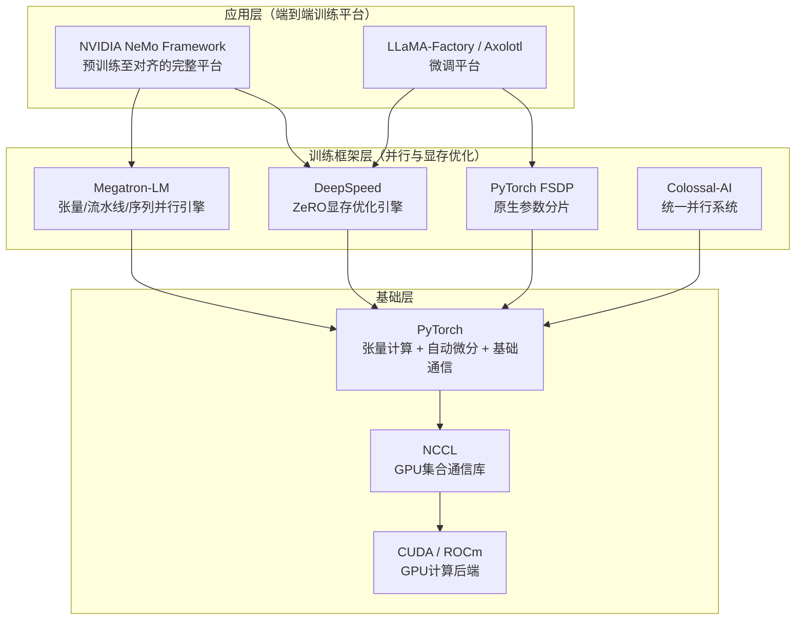
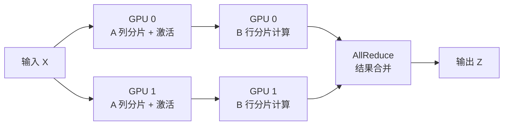
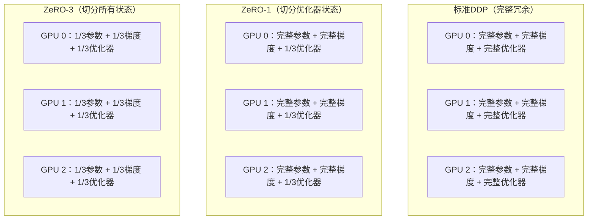
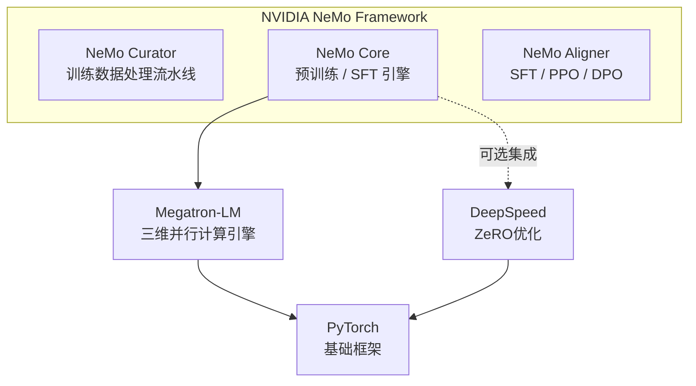
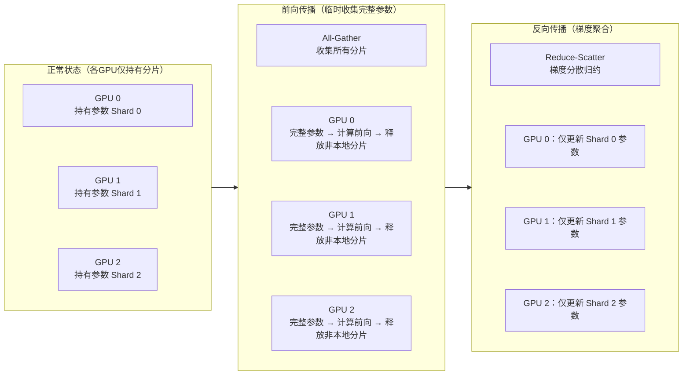
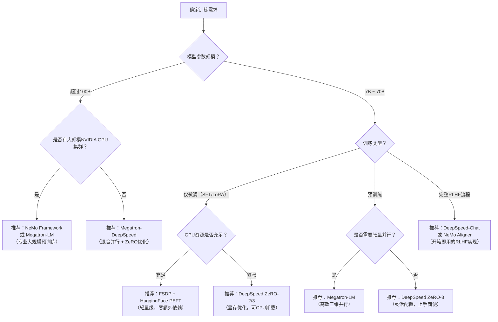

:::tip 前置知识
本文重点讲解大模型专用训练框架的原理与选型。建议先了解`AI`模型训练的基本概念、分布式并行策略等，请参考 [AI模型训练并行策略介绍](../4000-AI模型训练并行策略介绍.md) 和 [PyTorch框架介绍](./100-Pytorch/1000-Pytorch框架介绍.md)。
:::

在单张`GPU`显存已无法容纳数十亿乃至数千亿参数的模型时，工程师需要一套专门的工具来协调数百乃至数千张`GPU`高效协作。这正是大模型专用训练框架存在的核心价值。

## 大模型训练面临的核心挑战

训练一个参数规模在`70B`以上的大语言模型（`LLM`），与训练普通的深度学习模型有本质区别，主要挑战体现在以下几个维度：

| 挑战维度 | 具体表现 | 说明 |
|:---------:|---------|------|
| **显存瓶颈** | 模型参数本身超出单卡显存上限 | `70B`参数模型仅`BF16`（Brain Float 16，脑浮点16位格式）参数就需约`140GB`，单张`H100`（`80GB`）无法容纳 |
| **计算规模** | 需要数百至数千张`GPU`协同运作 | 大规模预训练通常需要数千张`GPU`持续运行数周甚至数月 |
| **通信瓶颈** | 梯度同步和激活值传递产生巨大跨节点通信量 | 节点内`NVLink`带宽远超节点间网络带宽，通信成为瓶颈 |
| <span style={{whiteSpace: 'nowrap'}}><strong>数值稳定性</strong></span> | 混合精度训练中的梯度溢出、损失尖峰等 | 需要专门的动态损失缩放（`Loss Scaling`）策略 |
| **容错恢复** | 长达数周的训练作业中硬件故障不可避免 | 需要高效的检查点机制和快速的故障恢复能力 |
| **效率优化** | 单纯叠加`GPU`无法线性提升性能 | 需要精心设计并行策略以最大化算力利用率（`MFU`，Model FLOPs Utilization，模型算力利用率） |

`PyTorch`原生的`DistributedDataParallel`（`DDP`）虽然支持多卡训练，但面对上述挑战时力不从心——它要求每张`GPU`保有完整的模型副本，当模型本身就超过单卡显存时即束手无策。这就催生了一批专用的大模型训练框架。

## 训练框架与PyTorch的关系

这些专用训练框架并非`PyTorch`的替代品，而是构建在`PyTorch`之上的**上层加速与优化系统**。简而言之：**`PyTorch`是地基，专用训练框架是建在地基上的脚手架。**



各层的职责分工如下：

- **`PyTorch`基础层**：张量操作、自动微分（`Autograd`）、基础分布式通信原语（`dist.all_reduce`等）
- **训练框架层**：高效的模型分片与并行计算算子、显存压缩优化、跨节点通信调度优化
- **应用层**：端到端的训练流程封装、数据处理流水线、实验追踪、评测和部署

## 主流训练框架概览

| 框架 | 维护方 | 首次发布 | 核心定位 | 主要解决的问题 |
|------|------|---------|---------|-------------|
| `Megatron-LM` | `NVIDIA Research` | `2019`年 | 高效并行计算引擎 | 超大模型的张量/流水线并行计算效率 |
| `DeepSpeed` | `Microsoft` | `2020`年 | 显存优化与训练加速 | 有限`GPU`资源下训练更大规模模型 |
| <span style={{whiteSpace: 'nowrap'}}>`NeMo Framework`</span> | `NVIDIA` | `2019`年 | 端到端`LLM`开发平台 | 完整的预训练至对齐训练全流程 |
| `PyTorch FSDP` | `Meta/PyTorch` | `2022`年 | 原生参数分片 | 零额外依赖的参数分片训练 |
| `Colossal-AI` | `HPC-AI Tech` | `2022`年 | 统一并行训练系统 | 以统一接口支持多种并行策略 |

## Megatron-LM

### 框架介绍

`Megatron-LM`是由`NVIDIA Research`于`2019`年开源的大规模语言模型训练框架（[GitHub](https://github.com/NVIDIA/Megatron-LM)）。其奠基性论文"[Megatron-LM: Training Multi-Billion Parameter Language Models Using Model Parallelism](https://arxiv.org/abs/1909.08053)"（2019）提出了**张量模型并行**（`Tensor Model Parallelism`）技术，使单机多卡环境下能够高效训练当时无法在单卡上运行的大规模`Transformer`模型。

`2021`年的后续论文"`Efficient Large-Scale Language Model Training on GPU Clusters Using Megatron-LM`"进一步引入了**流水线并行**（`Pipeline Parallelism`），形成了支持数据并行、张量并行和流水线并行的**三维并行**框架。`Megatron-LM`至今仍是业界大规模预训练的核心计算引擎，`BLOOM(176B)`、`Megatron-Turing NLG(530B)`等多个里程碑模型均基于此构建。

### 张量并行

**张量并行**是`Megatron-LM`最核心的创新，其思想是：将`Transformer`中的矩阵乘法操作**按维度切分**到多张`GPU`上并行执行。

以`Transformer`的`MLP`（`Multi-Layer Perceptron`，多层感知机）层为例，标准结构包含两个线性变换 `Y = GeLU(XA)` 和 `Z = YB`。`Megatron-LM`将其拆分如下：

- **列并行**：矩阵`A`按列切分，每张`GPU`持有`A`的一部分列，独立计算各自的`Y`分片
- **行并行**：矩阵`B`按行切分，每张`GPU`用本地`Y`分片与`B`的对应行部分相乘，最后通过`AllReduce`合并



这种设计的关键优势在于：对于整个`MLP`块，前向+反向传播总共只需要 **2次`AllReduce`** 通信，而无需传输中间激活值，显著降低了通信量。`Transformer`的`Self-Attention`层同样可以按`Head`维度进行类似拆分。

### 流水线并行

`Megatron-LM`的流水线并行将模型的**不同`Transformer`层**分配到不同的`GPU`组（流水线阶段），各阶段之间通过`P2P`通信（`Send/Recv`）传递激活值。

朴素的流水线并行存在大量计算空闲（称为"气泡"），其气泡率约为 `(p-1)/p`（`p`为流水线阶段数）。`Megatron-LM`引入了**交错调度**（`Interleaved Schedule`），让每个设备负责多个不连续的模型层，将气泡率降低至 `(p-1)/(mp)`（`m`为微批次数量），显著提升了硬件利用率。

### 序列并行

`2022`年的研究"`Reducing Activation Recomputation in Large Transformer Models`"进一步引入了**序列并行**（`Sequence Parallelism`）：在张量并行区域之外（如`LayerNorm`、`Dropout`），将计算按**序列长度维度**切分到各`GPU`，与张量并行无缝衔接，进一步压缩激活值的显存占用。

### 框架优缺点

| 维度 | 详情 |
|------|------|
| **核心优势** | 计算效率极高，是大规模预训练的行业标杆；三维并行支持完备；与`NVIDIA`硬件深度协同优化 |
| **主要局限** | 对代码侵入性强，需按其`API`规范重写模型；使用门槛较高；主要支持`Transformer`类架构 |
| **适用场景** | `100B+`参数`Transformer`模型的大规模预训练；拥有大量`NVIDIA GPU`资源的研究与工程团队 |

## DeepSpeed

### 框架介绍

`DeepSpeed`是`Microsoft`于`2020`年开源的深度学习训练与推理优化框架（[GitHub](https://github.com/microsoft/DeepSpeed)）。其核心技术`ZeRO`（`Zero Redundancy Optimizer`，零冗余优化器）通过消除分布式训练中的**冗余参数、梯度和优化器状态**，使有限`GPU`资源下训练远超单卡显存上限的模型成为可能。`DeepSpeed`与`Hugging Face`生态深度集成，是目前工业界微调场景中应用最广泛的训练框架之一。

### ZeRO优化原理

在标准数据并行（`DDP`）训练中，每张`GPU`完整保存一份模型参数、梯度和优化器状态，造成大量冗余。以使用`Adam`优化器的混合精度训练为例，每个参数占用的显存为：

| 状态类型 | 精度 | 每参数显存 |
|---------|------|---------|
| 模型参数（工作副本） | `FP16` | `2 bytes` |
| 梯度 | `FP16` | `2 bytes` |
| 主参数（`Adam`用） | `FP32` | `4 bytes` |
| 一阶动量（`m`） | `FP32` | `4 bytes` |
| 二阶动量（`v`） | `FP32` | `4 bytes` |
| **合计** | | **`16 bytes`/参数** |

对于一个`7B`参数的模型，仅这部分状态就需要约`112GB`显存。`ZeRO`的核心思想是：既然数据并行的`Nd`张`GPU`维护了完全相同的这些状态，就没有必要每张卡都保存一份——**将这些状态均匀切分到所有`GPU`上**，按需通过集合通信获取所需部分即可。

### ZeRO各阶段详解



| 阶段 | 切分内容 | 理论显存节省（`Nd`个`GPU`） | 通信开销 |
|------|---------|--------------------------|---------|
| **`ZeRO-1`** | 优化器状态 | 约`4x`（优化器部分降低`Nd`倍） | 与`DDP`相同 |
| **`ZeRO-2`** | 优化器状态 + 梯度 | 约`8x` | 与`DDP`相同 |
| **`ZeRO-3`** | 优化器状态 + 梯度 + 参数 | 理论线性扩展（约`Nd`倍） | 前向/反向各增加`All-Gather` |
| **`ZeRO-Offload`** | 将优化器状态与梯度卸载至`CPU`内存 | 单卡可训练`10B+`模型 | 增加`PCIe`传输延迟 |
| **`ZeRO-Infinity`** | 进一步卸载至`NVMe SSD` | 理论上无上限 | 受`NVMe`带宽限制 |

### 其他核心组件

`DeepSpeed`除`ZeRO`外还提供了多个重要功能：

- **动态损失缩放**：自动处理`FP16`训练中的梯度溢出，保证数值稳定性
- **激活检查点**（Activation Checkpointing）：以重计算换显存，大幅降低激活值显存占用
- **梯度累积**：在有限显存下模拟大批次（`Large Batch`）训练效果
- **`DeepSpeed-MoE`**：混合专家模型（Mixture of Experts）的高效训练支持
- **`DeepSpeed-Chat`**：提供从`SFT`（Supervised Fine-Tuning，监督微调）到奖励模型再到`PPO`（Proximal Policy Optimization，近端策略优化）的完整`RLHF`（Reinforcement Learning from Human Feedback，基于人类反馈的强化学习）训练流水线

### 典型配置示例

`DeepSpeed`通过`JSON`配置文件驱动，以下是一个`ZeRO-3` + `CPU Offload`的典型配置：

```json
{
  "zero_optimization": {
    "stage": 3,
    "offload_optimizer": { "device": "cpu" },
    "offload_param": { "device": "cpu" },
    "overlap_comm": true,
    "contiguous_gradients": true
  },
  "bf16": { "enabled": true },
  "train_micro_batch_size_per_gpu": 2,
  "gradient_accumulation_steps": 8
}
```

### 框架优缺点

| 维度 | 详情 |
|------|------|
| <span style={{whiteSpace: 'nowrap'}}><strong>核心优势</strong></span> | 显存优化能力极强，适合资源受限场景；与`Hugging Face Transformers`高度集成；`CPU/NVMe`卸载支持完善 |
| **主要局限** | `ZeRO-3`的`All-Gather`通信开销在极大规模集群中性能略逊于纯`Megatron-LM`方案；参数分片有时与自定义模型结构存在兼容性问题 |
| **适用场景** | 单机多卡或中小规模集群上的预训练与微调；`GPU`显存紧张的场景；需要`CPU/NVMe`卸载的消费级硬件场景 |

## NVIDIA NeMo Framework

### 框架介绍

`NVIDIA NeMo`（`Neural Modules`）是`NVIDIA`推出的**端到端大语言模型开发平台**（[GitHub](https://github.com/NVIDIA/NeMo)）。`NeMo`不仅是一个训练框架，而是覆盖数据处理、预训练、对齐微调和评估的完整`LLM`研发平台，其分布式训练能力建立在`Megatron-LM`之上。

:::caution Nemotron与NeMo Framework的区别
**`Nemotron`是`NVIDIA`发布的一系列大语言模型的名称**，例如`Nemotron-4 340B`（`2024`年）、`Llama-3.1-Nemotron-70B-Instruct`等，而非训练框架本身。训练这些模型所使用的框架正是`NVIDIA NeMo Framework`。两者是不同的概念：`NeMo Framework`是工具，`Nemotron`是用该工具生产出的产品。
:::

### NeMo架构与核心组件



| 组件 | 功能 | 备注 |
|------|------|------|
| **`NeMo Core`** | 预训练与微调核心引擎 | 底层使用`Megatron-LM`实现三维并行 |
| **`NeMo Curator`** | 训练数据处理流水线 | 数据清洗、去重、质量过滤、多语言处理 |
| **`NeMo Aligner`** | 对齐训练工具集 | 支持`SFT`、`RLHF`（`PPO`）、`DPO`（`Direct Preference Optimization`）等 |
| **`NeMo Guardrails`** | 模型安全护栏 | 独立子项目，用于推理阶段的安全控制 |

### 支持的训练类型

| 训练阶段 | 方法 | 技术要点 |
|---------|------|---------|
| **基础预训练** | 从随机初始化训练基座模型 | 底层使用`Megatron-LM`三维并行，支持`BF16`混合精度 |
| **持续预训练** | 在已有基座上继续预训练 | 支持领域自适应，可加载已有检查点继续训练 |
| **监督微调（`SFT`）** | 基于指令跟随数据微调 | 支持全参数微调与`LoRA`（Low-Rank Adaptation，低秩适配）参数高效微调 |
| **奖励模型训练** | 训练人类偏好评分模型 | `RLHF`流程的必要组成部分 |
| **`PPO`强化学习** | 完整的`RLHF`对齐训练 | 需要同时运行`Actor`、`Critic`、`Reward`模型 |
| **`DPO`训练** | 直接偏好优化 | 无需奖励模型的轻量级对齐方法 |

### Nemotron模型系列

`NVIDIA`使用`NeMo Framework`训练和发布了`Nemotron`系列模型：

| 模型 | 参数规模 | 发布时间 | 特点 |
|------|---------|---------|------|
| `Nemotron-4 15B` | `15B` | `2024`年 | 基础预训练基座模型 |
| `Nemotron-4 340B` | `340B` | `2024`年 | 大规模基座，公开了技术报告 |
| `Llama-3.1-Nemotron-70B-Instruct` | `70B` | `2024`年 | 基于`Meta Llama-3.1`的指令微调版本 |
| `Minitron-4B/8B` | `4B/8B` | `2024`年 | 通过结构剪枝和知识蒸馏从大模型压缩而来 |

### 框架优缺点

| 维度 | 详情 |
|------|------|
| **核心优势** | 完整的端到端开发体验，覆盖数据到部署；与`NVIDIA`硬件深度优化；有`NVIDIA`官方支持和详细文档 |
| **主要局限** | 与`NVIDIA`硬件强绑定，难以迁移到其他硬件；平台较重，上手成本较高；底层`Megatron-LM`对模型结构有一定约束 |
| **适用场景** | 需要完整预训练至对齐全流程的企业级团队；依托`NVIDIA GPU`基础设施的大模型研发机构 |

## PyTorch FSDP

### 框架介绍

`PyTorch FSDP`（`Fully Sharded Data Parallel`，全分片数据并行）是`PyTorch`自`1.11`版本（2022年3月）起内置的参数分片训练方案，由`Meta`基于`FairScale`库的思想开发并贡献至`PyTorch`官方库。由于它是`PyTorch`的原生功能，无需安装任何额外依赖，是侵入性最低的大模型参数分片训练方案。`PyTorch 2.x`引入的`FSDP2`进一步改善了内存效率和`API`设计。

### 工作原理

`FSDP`的核心思想与`DeepSpeed ZeRO-3`类似：将模型参数、梯度和优化器状态 **均匀切分（Shard）** 到所有数据并行的`GPU`上，前向和反向传播时按需通过`All-Gather`临时收集完整参数，使用后立即丢弃非本地的分片，仅保留本地负责更新的分片。



### 基本使用示例

`FSDP`对现有代码改动很小，只需用`FSDP`包裹模型即可：

```python
from torch.distributed.fsdp import FullyShardedDataParallel as FSDP
from torch.distributed.fsdp import MixedPrecision
import torch

# 使用BF16混合精度
mp_policy = MixedPrecision(
    param_dtype=torch.bfloat16,
    reduce_dtype=torch.bfloat16,
    buffer_dtype=torch.bfloat16,
)

# 仅需包裹模型，其余训练代码无需改动
model = FSDP(model, mixed_precision=mp_policy)
```

### FSDP与DeepSpeed ZeRO-3对比

| 对比维度 | `PyTorch FSDP` | `DeepSpeed ZeRO-3` |
|---------|----------------|-------------------|
| **集成方式** | `PyTorch`原生内置，零依赖 | 独立库，需单独安装 |
| **代码侵入性** | 极低，仅需`FSDP(model)`包装 | 需用`deepspeed.initialize()`包装 |
| **CPU卸载** | 有限支持（`CPUOffload`） | 完整支持（`ZeRO-Offload`） |
| **NVMe卸载** | 不支持 | 支持（`ZeRO-Infinity`） |
| **通信效率** | 两者基本相当 | 支持通信与计算`overlap`，略优 |
| **调试体验** | 与`PyTorch`调试工具直接兼容 | 需了解额外的`DeepSpeed`概念 |
| **HuggingFace集成** | 通过`Accelerate`支持 | 深度原生集成 |

### 框架优缺点

| 维度 | 详情 |
|------|------|
| <span style={{whiteSpace: 'nowrap'}}><strong>核心优势</strong></span> | `PyTorch`原生，零额外依赖，维护成本低；与`PyTorch`生态工具无缝兼容；`API`相对简洁；`FSDP2`内存效率进一步改善 |
| **主要局限** | 不支持张量并行等高级并行策略；显存卸载能力弱于`ZeRO-Offload/Infinity`；缺少端到端的训练平台封装 |
| **适用场景** | 中等规模（`7B~70B`）模型的全参数微调；希望减少外部依赖的`PyTorch`用户；通过`Hugging Face Accelerate`使用的场景 |

## Colossal-AI

### 框架介绍

`Colossal-AI`是由`HPC-AI Tech`于`2022`年开源的分布式训练系统（[GitHub](https://github.com/hpcaitech/ColossalAI)），其论文"`Colossal-AI: A Unified Deep Learning System For Large-Scale Parallel Training`"于`2022`年发表。该框架的设计目标是以**统一接口**支持多种并行策略，并通过`GeminiPlugin`实现高效的`GPU-CPU`异构显存管理。

### 核心特性

| 特性 | 说明 |
|------|------|
| **统一并行接口** | 通过插件机制（`Plugin`）统一封装数据并行、张量并行、流水线并行等多种策略 |
| **`GeminiPlugin`** | 动态调度`GPU`显存与`CPU`内存，在需要时自动将张量卸载至`CPU`，减少显存峰值 |
| **`LazyTensor`** | 延迟初始化技术，解决超大模型在初始化阶段就超出显存的问题 |
| **`ShardFormer`** | 自动将`Hugging Face`标准模型转换为并行计算版本，降低使用门槛 |
| **`PEFT`（`Parameter-Efficient Fine-Tuning`，参数高效微调）支持** | 内置`LoRA`、`QLoRA`（Quantized LoRA，量化低秩适配）等参数高效微调方法 |

### 框架优缺点

| 维度 | 详情 |
|------|------|
| <span style={{whiteSpace: 'nowrap'}}><strong>核心优势</strong></span> | 统一的并行策略接口，学习曲线相对友好；`GeminiPlugin`的异构内存管理具有独特优势；与`Hugging Face`模型兼容性较好 |
| **主要局限** | 工业级生产案例少于`DeepSpeed`或`Megatron-LM`；部分高级功能的稳定性和性能不及成熟度更高的框架；社区维护活跃度有所下降 |
| **适用场景** | 科研实验场景；需要灵活切换和对比多种并行策略的探索性工作；资源有限的小团队 |

## 框架综合对比与选型

### 核心能力矩阵

| 特性 | `Megatron-LM` | `DeepSpeed` | `NeMo Framework` | `PyTorch FSDP` | `Colossal-AI` |
|------|:---:|:---:|:---:|:---:|:---:|
| **张量并行** | ✅ | ❌ | ✅（基于`Megatron`） | ❌ | ✅ |
| **流水线并行** | ✅ | ❌ | ✅（基于`Megatron`） | ❌ | ✅ |
| **参数分片** | 有限（`DDP`） | ✅（`ZeRO-3`） | ✅ | ✅（`FSDP`） | ✅ |
| **CPU显存卸载** | ❌ | ✅（`ZeRO-Offload`） | ❌ | 有限 | ✅（`Gemini`） |
| **NVMe卸载** | ❌ | ✅（`ZeRO-Infinity`） | ❌ | ❌ | ❌ |
| **完整RLHF流程** | ❌ | ✅（`DS-Chat`） | ✅（`NeMo Aligner`） | ❌ | ❌ |
| **LoRA/PEFT** | ❌ | ✅ | ✅ | ✅（通过`PEFT`库） | ✅ |
| **HuggingFace兼容** | ❌（需重写模型） | ✅ | 有限 | ✅ | ✅ |
| **零额外依赖** | ❌ | ❌ | ❌ | ✅ | ❌ |

### 选型决策流程



### 按场景的选型建议

| 典型场景 | 推荐方案 | 核心理由 |
|---------|---------|---------|
| 万亿参数级预训练 | `Megatron-LM`（或`Megatron-DeepSpeed`组合） | 最高计算效率，三维并行支持完备 |
| `100B`级企业预训练 | `NeMo Framework` | 端到端平台支持，NVIDIA硬件最优化 |
| `7B~70B`全参数微调 | `DeepSpeed ZeRO-2/3`或`FSDP` | 显存利用率高，上手成本低 |
| `7B~70B` LoRA微调 | `FSDP` + `Hugging Face PEFT` | 最低复杂度，原生`PyTorch`支持 |
| 资源极度受限场景 | `DeepSpeed ZeRO-Offload` | `CPU`内存卸载，消费级`GPU`可训练大模型 |
| 完整`RLHF`对齐训练 | `DeepSpeed-Chat`或`NeMo Aligner` | 开箱即用的完整`RLHF`流水线实现 |
| 科研并行策略探索 | `Colossal-AI` | 统一接口，方便对比不同并行策略 |

