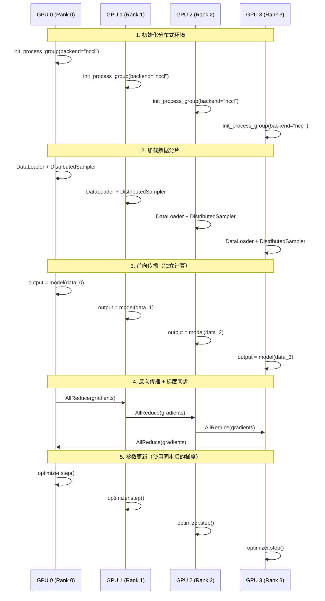
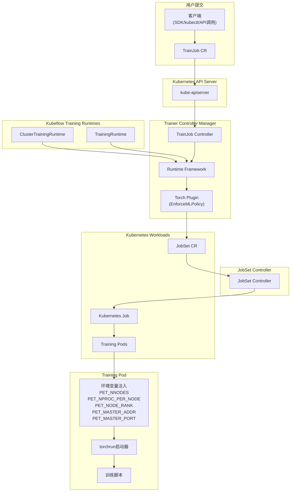
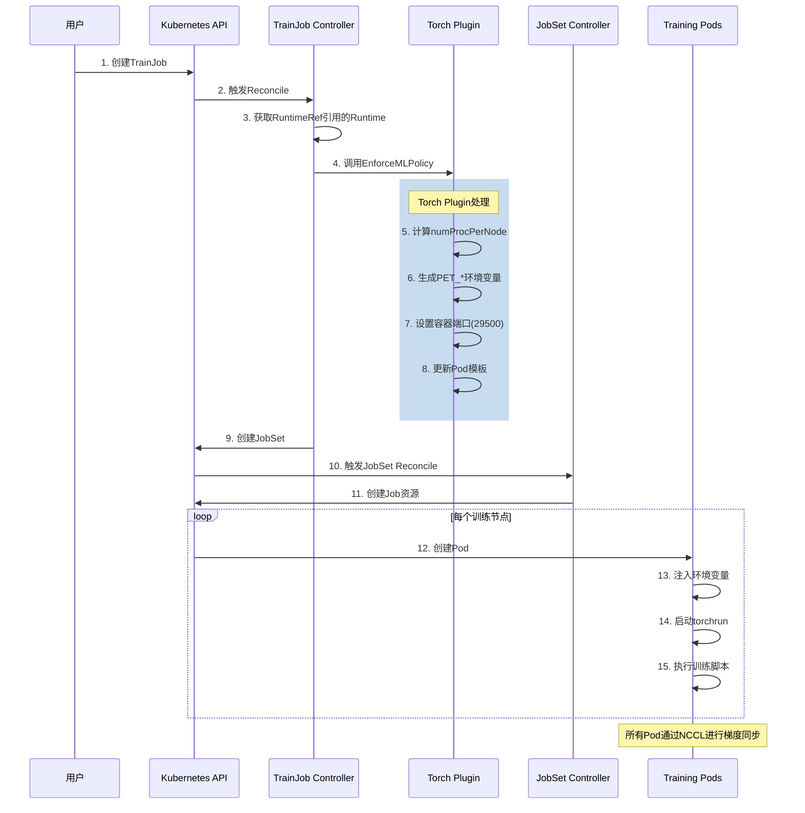

## HPC并行计算基础特性

### 什么是HPC并行计算

`HPC`（`High Performance Computing`，高性能计算）是指利用多个计算资源（如`CPU`、`GPU`）协同工作，以解决复杂计算问题的技术。在`AI`模型训练场景中，`HPC`并行计算是实现大规模模型训练的核心技术基础。

### 并行计算的核心特性

| 特性 | 描述 | 在AI训练中的应用 |
|------|------|------------------|
| **任务分解** | 将大任务拆分为多个可并行执行的子任务 | 将训练数据分片到多个`GPU` |
| **并行执行** | 多个计算单元同时处理不同子任务 | 多`GPU`同时计算梯度 |
| **通信同步** | 计算单元间交换数据和同步状态 | 梯度聚合、参数同步 |
| **结果合并** | 将各计算单元的结果汇总 | 模型参数更新 |

### AI训练中的并行策略

在`AI`大模型训练中，单个`GPU`的计算能力和显存往往无法满足需求，需要使用多个`GPU`协同工作。主要的并行策略包括：

| 并行策略 | 英文名称 | 核心原理 |
|---------|----------|---------|
| **数据并行** | `Data Parallelism (DP)` | 每个`GPU`持有完整模型，处理不同的数据分片，通过梯度同步保持模型一致 |
| **模型并行** | `Model Parallelism (MP)` | 将模型的不同层分配到不同`GPU`，突破单卡显存限制 |
| **流水线并行** | `Pipeline Parallelism (PP)` | 模型并行的优化版，通过微批次流水线提高`GPU`利用率 |
| **张量并行** | `Tensor Parallelism (TP)` | 将单个网络层的计算拆分到多个`GPU`并行执行 |

:::info 详细说明
关于各种并行策略的详细原理、术语解释、适用场景和实现方式，请参考：[AI训练并行策略详解](/ai/training-parallel-strategies)
:::


### 分布式通信后端

| 后端 | 适用场景 | 支持操作 | 性能特点 |
|------|----------|----------|----------|
| **NCCL** | `GPU`集群 | 全部集合通信 | 最优`GPU`通信性能 |
| **Gloo** | `CPU`/`GPU` | 全部集合通信 | 跨平台兼容 |
| **MPI** | `HPC`集群 | 点对点+集合通信 | 传统`HPC`标准 |

## PyTorch分布式训练原理

### torch.distributed核心概念

`PyTorch`通过`torch.distributed`包提供分布式训练能力，核心概念包括：

| 概念 | 说明 | 示例 |
|------|------|------|
| **World Size** | 参与训练的总进程数 | `4节点×8GPU = 32` |
| **Rank** | 当前进程的全局唯一标识 | `0, 1, 2, ..., 31` |
| **Local Rank** | 当前进程在本节点的标识 | `0, 1, ..., 7` |
| **Process Group** | 进程组，用于集合通信 | 默认组包含所有进程 |
| **Backend** | 通信后端 | `nccl, gloo, mpi` |
| **AllReduce** | 集合通信算子：对所有进程的张量做规约（`sum/avg`）并广播回所有进程 |  |

### 分布式数据并行（DDP）

`DistributedDataParallel`（`DDP`）是`PyTorch`推荐的数据并行方案：



**DDP训练流程说明**：

1. **前向传播阶段**：各`GPU`独立执行，互不通信。每个进程用自己的数据分片（如`data_0`、`data_1`等）通过模型得到输出。
2. **反向传播阶段**：在计算梯度时，`DDP`会自动将梯度按`bucket`分组进行`AllReduce`同步，确保所有进程得到相同的梯度。这个过程与梯度计算重叠执行，减少等待时间。
3. **参数更新阶段**：因为所有进程的梯度已同步，各进程独立执行`optimizer.step()`后，模型参数仍保持一致。

**DDP核心优势**：
- 梯度同步与反向传播重叠，减少通信开销
- 每个进程独立运行，无`GIL`限制
- 支持多机多卡扩展

### 全分片数据并行（FSDP）

`FullyShardedDataParallel`（`FSDP`）是`PyTorch`针对大模型的优化方案：

| 特性 | DDP | FSDP |
|------|-----|------|
| 模型存储 | 每个`GPU`存储完整模型 | 模型参数分片存储 |
| 显存占用 | 高（`N`份完整模型） | 低（`1/N`模型参数） |
| 通信模式 | `AllReduce`梯度 | `AllGather`参数 + `ReduceScatter`梯度 |
| 适用场景 | 中小模型 | 大模型（`>10B`参数） |

### torchrun启动器

`torchrun`是`PyTorch`官方推荐的分布式训练启动工具，它会自动设置以下环境变量：

| 环境变量 | 说明 | 来源 |
|----------|------|------|
| `WORLD_SIZE` | 总进程数 | `--nnodes × --nproc-per-node` |
| `RANK` | 全局进程编号 | 自动计算 |
| `LOCAL_RANK` | 本地进程编号 | 自动计算 |
| `MASTER_ADDR` | 主节点地址 | `--master-addr` |
| `MASTER_PORT` | 主节点端口 | `--master-port` |

**torchrun命令示例**：

```bash
# 单机4卡
torchrun --nproc-per-node=4 train.py

# 多机多卡（4节点，每节点8卡）
torchrun \
    --nnodes=4 \
    --nproc-per-node=8 \
    --node-rank=0 \
    --master-addr=192.168.1.1 \
    --master-port=29500 \
    train.py
```

## Kubeflow Trainer PyTorch并行计算支持

### 整体架构



### 核心CRD设计

#### TrainJob

`TrainJob`是面向数据科学家的简化`API`，用于提交训练任务：

```yaml
apiVersion: trainer.kubeflow.org/v1alpha1
kind: TrainJob
metadata:
  name: pytorch-ddp-training
  namespace: ml-team
spec:
  # 引用预定义的训练运行时
  runtimeRef:
    apiGroup: trainer.kubeflow.org
    kind: ClusterTrainingRuntime
    name: torch-distributed
  
  # 训练器配置（可覆盖Runtime默认值）
  trainer:
    image: my-registry/pytorch-training:v1.0
    command:
      - torchrun
      - train.py
    args:
      - --epochs=100
      - --batch-size=64
    numNodes: 4                    # 训练节点数
    numProcPerNode: 8              # 每节点进程数（通常等于GPU数）
    resourcesPerNode:
      requests:
        nvidia.com/gpu: 8
        memory: "64Gi"
        cpu: "16"
    env:
      - name: NCCL_DEBUG
        value: "INFO"
```

#### ClusterTrainingRuntime

`ClusterTrainingRuntime`是平台工程师预定义的训练任务模板：

```yaml
apiVersion: trainer.kubeflow.org/v1alpha1
kind: ClusterTrainingRuntime
metadata:
  name: torch-distributed
  labels:
    trainer.kubeflow.org/framework: torch
spec:
  # ML策略配置
  mlPolicy:
    numNodes: 1                    # 默认节点数
    torch:
      numProcPerNode: auto         # auto/cpu/gpu/具体数值
      # 弹性训练配置（可选）
      # elasticPolicy:
      #   minNodes: 2
      #   maxNodes: 8
      #   maxRestarts: 3
  
  # Gang调度策略（可选）
  podGroupPolicy:
    volcano: {}                    # 使用Volcano调度器
  
  # JobSet模板
  template:
    spec:
      replicatedJobs:
        - name: node
          template:
            metadata:
              labels:
                trainer.kubeflow.org/trainjob-ancestor-step: trainer
            spec:
              template:
                spec:
                  containers:
                    - name: node
                      image: pytorch/pytorch:2.7.1-cuda12.8-cudnn9-runtime
                      ports:
                        - containerPort: 29500  # 分布式通信端口
```

### Torch Plugin实现原理

`Kubeflow Trainer`通过`Torch Plugin`实现对`PyTorch`分布式训练的支持。该插件的核心功能是自动注入分布式环境变量。

#### 环境变量注入

`Torch Plugin`会自动为每个训练`Pod`注入以下环境变量：

| 环境变量 | 说明 | 计算方式 |
|----------|------|----------|
| `PET_NNODES` | 训练节点总数 | `spec.trainer.numNodes` |
| `PET_NPROC_PER_NODE` | 每节点进程数 | `spec.mlPolicy.torch.numProcPerNode` |
| `PET_NODE_RANK` | 当前节点编号 | 从`Job Completion Index`获取 |
| `PET_MASTER_ADDR` | 主节点地址 | `{trainjob-name}-node-0-0.{trainjob-name}` |
| `PET_MASTER_PORT` | 主节点端口 | 默认`29500` |

**注意**：这些环境变量使用`PET_`前缀（`PyTorch Elastic Training`），是`Kubeflow Trainer`特有的命名规范，避免与用户自定义变量冲突。

#### numProcPerNode计算逻辑

`numProcPerNode`支持多种配置方式：

| 配置值 | 行为 |
|--------|------|
| `auto` | 如果配置了`GPU`资源，使用`GPU`数量；否则使用`CPU`数量 |
| `cpu` | 使用`CPU`核心数 |
| `gpu` | 使用`GPU`数量 |
| 整数值 | 使用指定的数值 |

```go
// 源码逻辑简化
if numProcPerNode == "auto" {
    if gpuCount > 0 {
        numProcPerNode = gpuCount
    } else {
        numProcPerNode = cpuCount
    }
}
```

### 执行流程详解



### Headless Service与节点发现

`Kubeflow Trainer`会自动创建`Headless Service`用于节点间通信：

```yaml
apiVersion: v1
kind: Service
metadata:
  name: pytorch-ddp-training  # 与TrainJob同名
spec:
  clusterIP: None             # Headless Service
  selector:
    trainer.kubeflow.org/trainjob-name: pytorch-ddp-training
  ports:
    - port: 29500
      targetPort: 29500
```

**节点DNS解析**：
- 主节点：`pytorch-ddp-training-node-0-0.pytorch-ddp-training`
- 工作节点1：`pytorch-ddp-training-node-0-1.pytorch-ddp-training`
- 工作节点2：`pytorch-ddp-training-node-0-2.pytorch-ddp-training`

## 算法工程师使用指南

### 是否需要感知底层架构？

**简短回答**：**不需要**。`Kubeflow Trainer`的设计目标之一就是对算法工程师屏蔽`Kubernetes`和分布式训练的复杂性。

| 关注点 | 算法工程师需要关心 | Kubeflow Trainer自动处理 |
|--------|-------------------|-------------------------|
| 分布式环境初始化 | ❌ | ✅ 自动注入环境变量 |
| 节点发现与通信 | ❌ | ✅ 自动创建`Headless Service` |
| `torchrun`参数配置 | ❌ | ✅ 自动计算`nnodes`、`nproc`等 |
| `GPU`资源分配 | ❌ | ✅ 通过`Runtime`配置 |
| `Pod`调度与编排 | ❌ | ✅ 通过`JobSet`管理 |
| 训练代码编写 | ✅ | - |
| 模型架构设计 | ✅ | - |
| 超参数调优 | ✅ | - |

### 训练代码编写规范

算法工程师只需按照标准的`PyTorch`分布式训练方式编写代码：

```python
def train():
    import os
    import torch
    import torch.distributed as dist
    from torch.nn.parallel import DistributedDataParallel as DDP
    from torch.utils.data import DataLoader, DistributedSampler
    
    # [1] 初始化分布式环境
    # Kubeflow Trainer已自动设置所有必要的环境变量
    device = "cuda" if torch.cuda.is_available() else "cpu"
    backend = "nccl" if device == "cuda" else "gloo"
    dist.init_process_group(backend=backend)
    
    # [2] 获取分布式信息（可选，用于日志或调试）
    world_size = dist.get_world_size()
    rank = dist.get_rank()
    local_rank = int(os.environ.get("LOCAL_RANK", 0))
    
    print(f"Initialized: World Size={world_size}, Rank={rank}, Local Rank={local_rank}")
    
    # [3] 设置当前进程使用的GPU
    if device == "cuda":
        torch.cuda.set_device(local_rank)
        device = torch.device(f"cuda:{local_rank}")
    
    # [4] 创建模型并包装为DDP
    model = MyModel().to(device)
    model = DDP(model, device_ids=[local_rank] if device.type == "cuda" else None)
    
    # [5] 创建数据加载器（使用DistributedSampler）
    dataset = MyDataset()
    sampler = DistributedSampler(dataset, num_replicas=world_size, rank=rank)
    dataloader = DataLoader(dataset, batch_size=64, sampler=sampler)
    
    # [6] 训练循环
    optimizer = torch.optim.Adam(model.parameters(), lr=0.001)
    for epoch in range(100):
        sampler.set_epoch(epoch)  # 重要：确保每个epoch数据打乱方式不同
        for batch in dataloader:
            inputs, labels = batch
            inputs, labels = inputs.to(device), labels.to(device)
            
            optimizer.zero_grad()
            outputs = model(inputs)
            loss = criterion(outputs, labels)
            loss.backward()
            optimizer.step()
        
        # 只在主节点保存模型
        if rank == 0:
            torch.save(model.module.state_dict(), f"model_epoch_{epoch}.pt")
    
    # [7] 清理
    dist.destroy_process_group()

if __name__ == "__main__":
    train()
```

### 使用Kubeflow Python SDK提交任务

算法工程师可以使用`Kubeflow Python SDK`直接从`Python`代码提交训练任务：

```python
from kubeflow.trainer import TrainerClient, CustomTrainer

# 定义训练函数
def train_pytorch():
    import torch
    import torch.distributed as dist
    from torch.nn.parallel import DistributedDataParallel as DDP
    
    # 初始化分布式环境（Kubeflow Trainer自动配置）
    device, backend = ("cuda", "nccl") if torch.cuda.is_available() else ("cpu", "gloo")
    dist.init_process_group(backend=backend)
    
    local_rank = int(os.environ.get("LOCAL_RANK", 0))
    
    # 创建模型
    model = torch.nn.Linear(10, 10).to(device)
    model = DDP(model)
    
    # 训练逻辑...
    print(f"Training on rank {dist.get_rank()}/{dist.get_world_size()}")
    
    dist.destroy_process_group()

# 创建训练任务
client = TrainerClient()

job_id = client.train(
    trainer=CustomTrainer(
        func=train_pytorch,
        num_nodes=4,                    # 4个训练节点
        resources_per_node={
            "cpu": 8,
            "memory": "32Gi",
            "gpu": 2,                   # 每节点2个GPU
        },
        packages_to_install=["transformers>=4.53.0"],  # 额外依赖
    )
)

# 等待任务完成
client.wait_for_job_status(job_id)

# 查看日志
for log in client.get_job_logs(job_id, follow=True):
    print(log)
```

### 关键注意事项

#### 数据加载

```python
# ✅ 正确：使用DistributedSampler
sampler = DistributedSampler(dataset)
dataloader = DataLoader(dataset, sampler=sampler)

# ❌ 错误：不使用Sampler会导致所有节点处理相同数据
dataloader = DataLoader(dataset, shuffle=True)
```

#### 模型保存

```python
# ✅ 正确：只在主节点保存
if dist.get_rank() == 0:
    torch.save(model.module.state_dict(), "model.pt")

# ❌ 错误：所有节点都保存会造成冲突
torch.save(model.state_dict(), "model.pt")
```

#### 日志输出

```python
# ✅ 推荐：只在主节点输出详细日志
if dist.get_rank() == 0:
    print(f"Epoch {epoch}, Loss: {loss.item()}")

# 或使用条件日志
def log(msg):
    if dist.get_rank() == 0:
        print(msg)
```

#### 随机种子

```python
# ✅ 正确：设置确定性种子，但每个节点使用不同的数据增强
torch.manual_seed(42 + dist.get_rank())
```

### FSDP使用示例

对于大模型训练，可以使用`FSDP`：

```python
from torch.distributed.fsdp import FullyShardedDataParallel as FSDP
from torch.distributed.fsdp.wrap import transformer_auto_wrap_policy

def train_large_model():
    import torch
    import torch.distributed as dist
    from transformers import AutoModelForCausalLM
    
    dist.init_process_group(backend="nccl")
    local_rank = int(os.environ["LOCAL_RANK"])
    torch.cuda.set_device(local_rank)
    
    # 加载大模型
    model = AutoModelForCausalLM.from_pretrained("meta-llama/Llama-2-7b")
    
    # 使用FSDP包装
    model = FSDP(
        model,
        auto_wrap_policy=transformer_auto_wrap_policy,
        device_id=local_rank,
    )
    
    # 训练逻辑...
    
    dist.destroy_process_group()
```

## 完整示例

### TrainingRuntime配置

```yaml
apiVersion: trainer.kubeflow.org/v1alpha1
kind: ClusterTrainingRuntime
metadata:
  name: pytorch-ddp-gpu
spec:
  mlPolicy:
    numNodes: 2
    torch:
      numProcPerNode: auto
  podGroupPolicy:
    volcano: {}
  template:
    spec:
      replicatedJobs:
        - name: node
          template:
            metadata:
              labels:
                trainer.kubeflow.org/trainjob-ancestor-step: trainer
            spec:
              template:
                spec:
                  schedulerName: volcano
                  containers:
                    - name: node
                      image: pytorch/pytorch:2.7.1-cuda12.8-cudnn9-runtime
                      resources:
                        limits:
                          nvidia.com/gpu: 4
                          memory: "64Gi"
                          cpu: "16"
                      env:
                        - name: NCCL_DEBUG
                          value: "INFO"
```

### TrainJob提交

```yaml
apiVersion: trainer.kubeflow.org/v1alpha1
kind: TrainJob
metadata:
  name: mnist-ddp-training
  namespace: ml-team
spec:
  runtimeRef:
    name: pytorch-ddp-gpu
  trainer:
    image: my-registry/mnist-training:v1.0
    command:
      - torchrun
      - train.py
    args:
      - --epochs=50
      - --batch-size=128
    numNodes: 4
    resourcesPerNode:
      requests:
        nvidia.com/gpu: 8
```

### 训练脚本

```python
#!/usr/bin/env python3
"""
MNIST分布式训练示例
此脚本可直接在Kubeflow Trainer中运行，无需修改
"""

import os
import argparse
import torch
import torch.nn as nn
import torch.nn.functional as F
import torch.distributed as dist
from torch.nn.parallel import DistributedDataParallel as DDP
from torch.utils.data import DataLoader
from torch.utils.data.distributed import DistributedSampler
from torchvision import datasets, transforms


class MNISTNet(nn.Module):
    def __init__(self):
        super().__init__()
        self.conv1 = nn.Conv2d(1, 32, 3, 1)
        self.conv2 = nn.Conv2d(32, 64, 3, 1)
        self.fc1 = nn.Linear(9216, 128)
        self.fc2 = nn.Linear(128, 10)

    def forward(self, x):
        x = F.relu(self.conv1(x))
        x = F.relu(self.conv2(x))
        x = F.max_pool2d(x, 2)
        x = torch.flatten(x, 1)
        x = F.relu(self.fc1(x))
        x = self.fc2(x)
        return F.log_softmax(x, dim=1)


def train(args):
    # 初始化分布式环境
    device = "cuda" if torch.cuda.is_available() else "cpu"
    backend = "nccl" if device == "cuda" else "gloo"
    dist.init_process_group(backend=backend)
    
    rank = dist.get_rank()
    world_size = dist.get_world_size()
    local_rank = int(os.environ.get("LOCAL_RANK", 0))
    
    if device == "cuda":
        torch.cuda.set_device(local_rank)
        device = torch.device(f"cuda:{local_rank}")
    
    if rank == 0:
        print(f"Starting distributed training with {world_size} processes")
    
    # 准备数据
    transform = transforms.Compose([
        transforms.ToTensor(),
        transforms.Normalize((0.1307,), (0.3081,))
    ])
    
    # 只在rank 0下载数据
    if rank == 0:
        datasets.MNIST('./data', train=True, download=True)
    dist.barrier()
    
    dataset = datasets.MNIST('./data', train=True, transform=transform)
    sampler = DistributedSampler(dataset, num_replicas=world_size, rank=rank)
    dataloader = DataLoader(dataset, batch_size=args.batch_size, sampler=sampler)
    
    # 创建模型
    model = MNISTNet().to(device)
    model = DDP(model, device_ids=[local_rank] if device.type == "cuda" else None)
    
    optimizer = torch.optim.Adam(model.parameters(), lr=0.001)
    
    # 训练循环
    for epoch in range(args.epochs):
        sampler.set_epoch(epoch)
        model.train()
        
        for batch_idx, (data, target) in enumerate(dataloader):
            data, target = data.to(device), target.to(device)
            
            optimizer.zero_grad()
            output = model(data)
            loss = F.nll_loss(output, target)
            loss.backward()
            optimizer.step()
            
            if batch_idx % 100 == 0 and rank == 0:
                print(f"Epoch {epoch} [{batch_idx * len(data)}/{len(dataset)}] Loss: {loss.item():.6f}")
        
        # 保存检查点
        if rank == 0:
            torch.save({
                'epoch': epoch,
                'model_state_dict': model.module.state_dict(),
                'optimizer_state_dict': optimizer.state_dict(),
            }, f'checkpoint_epoch_{epoch}.pt')
    
    if rank == 0:
        print("Training completed!")
    
    dist.destroy_process_group()


if __name__ == "__main__":
    parser = argparse.ArgumentParser()
    parser.add_argument("--epochs", type=int, default=10)
    parser.add_argument("--batch-size", type=int, default=64)
    args = parser.parse_args()
    
    train(args)
```

## 参考资料

- [Kubeflow Trainer官方文档](https://www.kubeflow.org/docs/components/trainer/)
- [PyTorch Distributed Overview](https://pytorch.org/tutorials/beginner/dist_overview.html)
- [PyTorch DDP Tutorial](https://pytorch.org/tutorials/intermediate/ddp_tutorial.html)
- [PyTorch FSDP Tutorial](https://pytorch.org/tutorials/intermediate/FSDP_tutorial.html)
- [torchrun Documentation](https://pytorch.org/docs/stable/elastic/run.html)
- [Kubeflow Trainer GitHub](https://github.com/kubeflow/trainer)
- [PyTorch on Kubernetes Blog](https://pytorch.org/blog/pytorch-on-kubernetes-kubeflow-trainer-joins-the-pytorch-ecosystem/)
