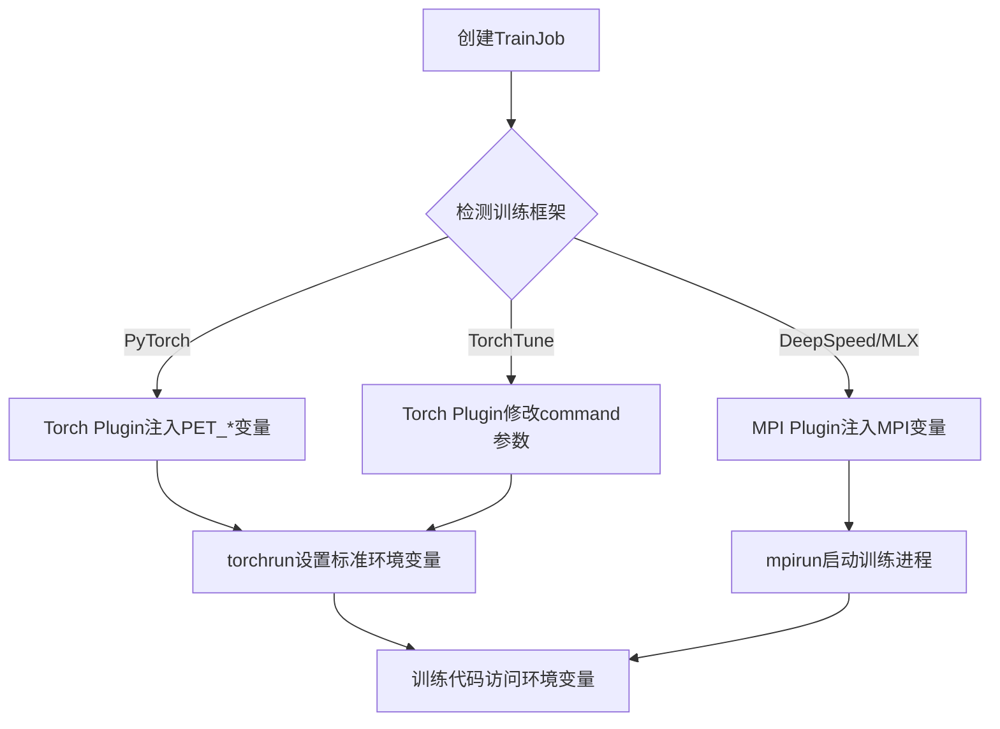

`Kubeflow Trainer`会根据使用的训练框架，为训练容器自动注入相应的环境变量。不同框架使用的环境变量不同，本文详细介绍各个框架的环境变量配置和使用方法。

## 环境变量注入流程

`Kubeflow Trainer`的环境变量注入流程如下：



## PyTorch框架环境变量

`PyTorch`是`Meta`（`Facebook`）开源的深度学习框架，提供灵活的动态计算图和丰富的分布式训练能力。`Kubeflow Trainer`使用`PyTorch`的`torchrun`工具启动分布式训练，支持数据并行（`DDP`）、全分片数据并行（`FSDP`）等多种并行策略。

使用`PyTorch`（通过`torchrun`启动）时，`Torch Plugin`会自动注入以下环境变量：

### PET_*系列环境变量

这些是`Kubeflow Trainer`为`PyTorch`分布式训练定义的环境变量，在`TrainingRuntime`的`command`和`args`中使用：

| 环境变量 | 说明 | 示例值 | 注入来源 |
|----------|------|--------|----------|
| `PET_NNODES` | 训练节点总数 | `2` | `spec.trainer.numNodes` |
| `PET_NPROC_PER_NODE` | 每节点进程数 | `4` | `spec.mlPolicy.torch.numProcPerNode` |
| `PET_NODE_RANK` | 当前节点编号 | `0-1` | `JOB_COMPLETION_INDEX` |
| `PET_MASTER_ADDR` | 主节点地址 | `myjob-node-0-0.myjob` | `{trainjob-name}-node-0-0.{trainjob-name}` |
| `PET_MASTER_PORT` | 主节点端口 | `29400` | 固定值 |

**说明**：
- `PET`代表`PyTorch Elastic Training`，是`Kubeflow Trainer`为`PyTorch`分布式训练定义的环境变量前缀
- 这些变量在`TrainingRuntime`的`command`中使用，如：`torchrun --nproc_per_node=$(PET_NPROC_PER_NODE) ...`
- `PET_NODE_RANK`通过`Kubernetes`的`fieldRef`机制自动从`JOB_COMPLETION_INDEX`获取
- 这些环境变量由`Kubeflow Trainer`的`Torch Plugin`自动注入到容器环境中

### 标准分布式训练环境变量

`torchrun`会根据`PET_*`变量，为每个进程设置以下标准环境变量（具体请参考[PyTorch官方文档](https://docs.pytorch.org/docs/stable/distributed.html#environment-variable-initialization)）：

| 环境变量 | 说明 | 计算方式 | 示例值 |
|----------|------|----------|--------|
| `WORLD_SIZE` | 总进程数 | `PET_NNODES × PET_NPROC_PER_NODE` | `8` |
| `RANK` | 全局进程编号 | 自动计算 | `0-7` |
| `LOCAL_RANK` | 本地进程编号 | 节点内进程索引 | `0-3` |
| `MASTER_ADDR` | 主节点地址 | 继承`PET_MASTER_ADDR` | `myjob-node-0-0.myjob` |
| `MASTER_PORT` | 主节点端口 | 继承`PET_MASTER_PORT` | `29400` |

**说明**：
- 这些变量由`torchrun`自动设置，无需在`TrainingRuntime`中配置
- 训练代码中可直接使用`torch.distributed.get_rank()`等`API`，或通过`os.environ`访问
- 这些是`PyTorch`分布式训练的标准环境变量，所有使用`torchrun`的训练框架都会设置

### PyTorch训练脚本示例

```python
import os
import torch.distributed as dist

# 初始化分布式进程组（torchrun会自动设置所需环境变量）
dist.init_process_group(backend="nccl")

# 获取分布式信息
rank = dist.get_rank()           # 等价于 int(os.environ['RANK'])
world_size = dist.get_world_size()  # 等价于 int(os.environ['WORLD_SIZE'])
local_rank = int(os.environ['LOCAL_RANK'])
node_rank = int(os.environ.get('JOB_COMPLETION_INDEX', 0))

print(f"Node Rank: {node_rank}")
print(f"Global Rank: {rank}, World Size: {world_size}")
print(f"Local Rank: {local_rank}")

# 设置当前进程使用的GPU
torch.cuda.set_device(local_rank)
```

### Runtime Command配置示例

```yaml
command:
  - torchrun
args:
  - --nproc_per_node=$(PET_NPROC_PER_NODE) 
  - --nnodes=$(PET_NNODES)
  - --node_rank=$(PET_NODE_RANK)
  - --master_addr=$(PET_MASTER_ADDR)
  - --master_port=$(PET_MASTER_PORT)
  - --rdzv_backend=c10d
  - --rdzv_endpoint=$(PET_MASTER_ADDR):$(PET_MASTER_PORT)
  - /workspace/train.py
```

## DeepSpeed框架环境变量
`DeepSpeed`是`Microsoft`开发的深度学习优化库，专注于大规模模型训练，提供了`ZeRO`优化器（零冗余优化器）、混合精度训练、梯度累积等功能。`DeepSpeed`可以显著降低显存占用，支持训练超大规模模型（如千亿参数的`LLM`）。在`Kubeflow Trainer`中，`DeepSpeed`通过`MPI`运行时使用`mpirun`启动。
`DeepSpeed`使用`MPI`运行时通过`mpirun`启动，会自动注入`MPI`相关环境变量，同时`DeepSpeed`会设置自己的分布式环境变量。

### MPI环境变量（OpenMPI实现）

| 环境变量 | 说明 | 示例值 |
|----------|------|--------|
| `OMPI_MCA_orte_default_hostfile` | 主机列表文件路径 | `/etc/mpi/hostfile` |
| `OMPI_MCA_plm_rsh_args` | `SSH`远程启动参数 | `-o ConnectionAttempts=10` |
| `OMPI_MCA_orte_keep_fqdn_hostnames` | 保持完整主机名 | `true` |
| `OMPI_MCA_orte_set_default_slots` | 默认`slot`数量 | `4` |

### DeepSpeed分布式环境变量

`DeepSpeed`通过调用`deepspeed.init_distributed()`初始化分布式环境后，可使用以下变量（由`PyTorch`底层设置）：

| 环境变量 | 说明 | 获取方式 | 示例值 |
|----------|------|----------|--------|
| `WORLD_SIZE` | 总进程数 | `dist.get_world_size()` | `8` |
| `RANK` | 全局进程编号 | `dist.get_rank()` | `0-7` |
| `LOCAL_RANK` | 本地进程编号 | `os.environ['LOCAL_RANK']` | `0-3` |

**说明**：
- `DeepSpeed`使用`MPI`运行时，`Kubeflow Trainer`会自动创建`OpenMPI hostfile`
- `Kubeflow Trainer`会自动启动`OpenSSH`服务器用于节点间通信
- 训练代码中使用`deepspeed.init_distributed()`初始化后，可以访问上述分布式环境变量
- 具体可参考[DeepSpeed官方文档](https://www.deepspeed.ai/getting-started/#mpi-and-azureml-compatibility)

### DeepSpeed训练脚本示例

```python
import os
import torch.distributed as dist
import deepspeed

# 初始化DeepSpeed分布式环境
deepspeed.init_distributed(dist_backend="nccl")

# 获取分布式信息
world_size = dist.get_world_size()
rank = dist.get_rank()
local_rank = int(os.environ['LOCAL_RANK'])

print(f"DeepSpeed Distributed Environment")
print(f"WORLD_SIZE: {world_size}")
print(f"RANK: {rank}")
print(f"LOCAL_RANK: {local_rank}")

# 在rank 0节点上下载数据集
if rank == 0:
    print("Downloading dataset on master node...")
    # 下载数据集的代码

# 在local_rank 0节点上进行本地操作
if local_rank == 0:
    print("Performing local operations on this node...")
    # 本地操作的代码
```

### Runtime Command配置示例

```yaml
# Launcher容器使用mpirun启动
command:
  - mpirun
args:
  - --hostfile
  - /etc/mpi/hostfile
  - --allow-run-as-root
  - --tag-output
  - --mca
  - btl_tcp_if_include
  - eth0
  - deepspeed
  - /workspace/train.py
  - --deepspeed_config=/workspace/ds_config.json
```

## MLX框架环境变量

`MLX`是`Apple`专为`Apple Silicon`（`M`系列芯片）优化的机器学习框架，设计类似`NumPy`，但充分利用了`Apple`统一内存架构和`GPU`加速能力。`MLX`特别适合在`Mac`设备上进行模型训练和推理，支持分布式训练。在`Kubeflow Trainer`中，`MLX`通过`MPI`运行时实现多节点分布式训练。

`MLX`框架使用`MPI`运行时进行分布式训练，会注入`MPI`相关环境变量。

### MPI环境变量（OpenMPI实现）

| 环境变量 | 说明 | 示例值 |
|----------|------|--------|
| `OMPI_MCA_orte_default_hostfile` | 主机列表文件路径 | `/etc/mpi/hostfile` |
| `OMPI_MCA_plm_rsh_args` | `SSH`远程启动参数 | `-o ConnectionAttempts=10` |
| `OMPI_MCA_orte_keep_fqdn_hostnames` | 保持完整主机名 | `true` |
| `OMPI_MCA_orte_set_default_slots` | 默认`slot`数量 | `4` |

### MLX分布式环境变量

`MLX`分布式训练使用`MPI`通信，可通过以下方式获取分布式信息：

| 获取方式 | 说明 | 示例 |
|----------|------|------|
| `mx.distributed.init()` | 初始化分布式环境 | `mx.distributed.init()` |
| `mx.distributed.world_size()` | 获取总进程数 | `world_size = mx.distributed.world_size()` |
| `mx.distributed.rank()` | 获取当前进程编号 | `rank = mx.distributed.rank()` |

**说明**：
- `MLX`专为`Apple Silicon`优化，支持`GPU`加速
- 使用`MPI`运行时时，`Kubeflow Trainer`自动配置`MPI`环境
- 训练代码需要显式调用`mx.distributed.init()`初始化分布式环境
- 具体可参考[MLX官方文档](https://ml-explore.github.io/mlx/build/html/usage/distributed.html)

### MLX训练脚本示例

```python
import mlx.core as mx
import mlx.nn as nn
import mlx.distributed as dist

# 初始化MLX分布式环境
dist.init()

# 获取分布式信息
world_size = dist.world_size()
rank = dist.rank()

print(f"MLX Distributed Environment")
print(f"World Size: {world_size}")
print(f"Rank: {rank}")

# 在rank 0节点上进行全局操作
if rank == 0:
    print("Performing global operations on master node...")
    # 全局操作的代码
```

### Runtime Command配置示例

```yaml
# Launcher容器使用mpirun启动
command:
  - mpirun
args:
  - --hostfile
  - /etc/mpi/hostfile
  - --allow-run-as-root
  - --mca
  - btl_tcp_if_include
  - eth0
  - python
  - /workspace/train.py
```

## TorchTune框架环境变量

`TorchTune`是`PyTorch`官方提供的`LLM`（大语言模型）微调库，专门用于微调预训练的大模型（如`Llama`、`Mistral`等）。`TorchTune`提供了开箱即用的微调配方（`recipes`）、内存优化技术（如`LoRA`、`QLoRA`）和分布式训练支持。在`Kubeflow Trainer`中，`TorchTune`使用`torchrun`启动，但采用命令行参数而非环境变量来配置分布式参数。

`TorchTune`是`PyTorch`官方的`LLM`微调框架，使用`torchrun`启动，但环境变量注入方式与标准`PyTorch`略有不同。

### TorchTune特殊处理

`TorchTune`使用命令行参数而非环境变量来配置分布式训练，`Kubeflow Trainer`会自动将分布式参数注入到`command`和`args`中：

| 命令行参数 | 说明 | 注入来源 | 示例值 |
|-----------|------|----------|--------|
| `--nnodes` | 训练节点总数 | `spec.trainer.numNodes` | `--nnodes=2` |
| `--nproc_per_node` | 每节点进程数 | `spec.mlPolicy.torch.numProcPerNode` | `--nproc_per_node=auto` |
| `--node_rank` | 当前节点编号 | `JOB_COMPLETION_INDEX` | `--node_rank=0` |
| `--rdzv_endpoint` | 主节点端点 | 自动生成 | `--rdzv_endpoint=myjob-node-0-0.myjob:29400` |

### 标准分布式训练环境变量

`torchrun`启动后，`TorchTune`训练脚本同样可以访问以下环境变量：

| 环境变量 | 说明 | 示例值 |
|----------|------|--------|
| `WORLD_SIZE` | 总进程数 | `8` |
| `RANK` | 全局进程编号 | `0-7` |
| `LOCAL_RANK` | 本地进程编号 | `0-3` |
| `MASTER_ADDR` | 主节点地址 | `myjob-node-0-0.myjob` |
| `MASTER_PORT` | 主节点端口 | `29400` |

**说明**：
- `TorchTune`与标准`PyTorch`共享相同的`ML Policy`配置
- `Kubeflow Trainer`会自动检测`TorchTune`训练任务（通过`command`判断）
- 对于`TorchTune`，分布式参数通过命令行参数注入，而非`PET_*`环境变量
- 训练代码可以使用标准的`torch.distributed` API获取分布式信息

## MPI框架环境变量

`MPI`（`Message Passing Interface`）是高性能计算（`HPC`）领域的标准通信协议，广泛用于并行计算和分布式训练。`MPI`提供了进程间通信的底层接口，支持点对点通信、集合通信等操作。`Kubeflow Trainer`支持`OpenMPI`、`Intel MPI`和`MPICH`三种实现，自动处理节点间的`SSH`通信和`hostfile`配置。

`MPI`（`Message Passing Interface`）框架支持多种实现，`Kubeflow Trainer`目前支持`OpenMPI`、`Intel MPI`和`MPICH`。

### OpenMPI环境变量

| 环境变量 | 说明 | 示例值 |
|----------|------|--------|
| `OMPI_MCA_orte_default_hostfile` | 主机列表文件路径 | `/etc/mpi/hostfile` |
| `OMPI_MCA_plm_rsh_args` | `SSH`远程启动参数 | `-o ConnectionAttempts=10` |
| `OMPI_MCA_orte_keep_fqdn_hostnames` | 保持完整主机名 | `true` |
| `OMPI_MCA_orte_set_default_slots` | 默认`slot`数量 | `4` |

### MPI通用配置

`Kubeflow Trainer`会自动生成`MPI hostfile`，内容格式如下：

```text
trainjob-node-0-0.trainjob slots=4
trainjob-node-0-1.trainjob slots=4
```

其中`slots`数量等于`spec.mlPolicy.mpi.numProcPerNode`的值。

**说明**：
- `Kubeflow Trainer`自动生成`SSH`密钥用于节点间安全通信
- `hostfile`自动创建并挂载到`/etc/mpi/hostfile`路径
- `numProcPerNode`对应`MPI hostfile`中的`slots`数量
- 支持三种`MPI`实现：`OpenMPI`（默认）、`Intel MPI`、`MPICH`

## 通用环境变量

所有框架都可以使用以下`Kubernetes`原生环境变量：

| 环境变量 | 说明 | 示例值 |
|----------|------|--------|
| `JOB_COMPLETION_INDEX` | 节点索引（`0`开始） | `0-1` |

**说明**：
- 此变量来自`Kubernetes Job`的索引机制，表示当前`Pod`在`Job`中的序号
- 可用于获取节点编号或配置节点特定行为
- 通常用于确定当前节点的角色（如主节点、工作节点）


## 参考资料

- [PyTorch Distributed 环境变量文档](https://docs.pytorch.org/docs/stable/distributed.html#environment-variable-initialization)
- [DeepSpeed MPI启动文档](https://www.deepspeed.ai/getting-started/#mpi-and-azureml-compatibility)
- [MLX 分布式训练文档](https://ml-explore.github.io/mlx/build/html/usage/distributed.html)
- [Kubeflow Trainer GitHub 仓库](https://github.com/kubeflow/trainer)
- [OpenMPI 环境变量文档](https://www.open-mpi.org/doc/v4.1/)
