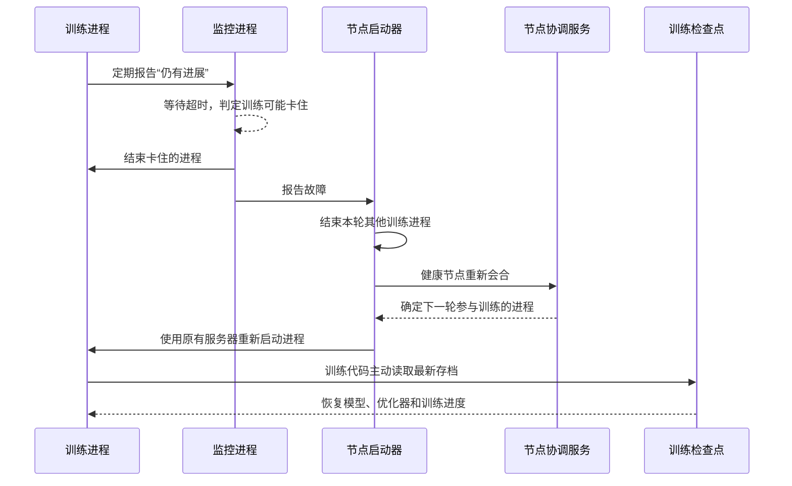

## 项目介绍

### 基本介绍

`NVIDIA Resiliency Extension`简称`NVRx`（ https://github.com/NVIDIA/nvidia-resiliency-ext ），是`NVIDIA`面向大规模`PyTorch`分布式工作负载开发的一组训练韧性组件。它关注的不是让单个训练步骤计算得更快，而是通过更早发现故障、更快恢复训练、更频繁地保存状态以及定位慢`rank`，提高集群真正产出有效训练进度的比例，也就是训练`goodput`。

`NVRx`不是训练框架、作业调度器或检查点存储系统。它不会替代`PyTorch DDP`、`Megatron-LM`、`NeMo`、`SLURM`、`Kubernetes`或共享存储，而是以`Launcher`、`Python API`、函数包装器和可选回调等形式嵌入这些系统之间。其主要价值可以概括为：

- 在既有资源分配内检测`rank`失联或卡死，并重新拉起训练进程；
- 在条件允许时直接在同一操作系统进程中重进训练函数，进一步减少初始化开销；
- 将耗时的检查点写入移到后台进程，并支持节点本地介质与副本；
- 对训练代码段和`CUDA Kernel`计时，识别拖慢同步训练的`rank`；
- 在恢复边界执行`GPU`、`NVLink`、`NIC`和存储健康检查，汇集日志及`PyTorch Flight Recorder`信息，辅助故障归因。

| 项目属性 | 当前信息 |
|------|------|
| 源码仓库 | `NVIDIA/nvidia-resiliency-ext` |
| 主要实现 | `Python`，慢`rank`分析包含`C++/CUPTI`扩展 |
| 开源协议 | `Apache License 2.0` |
| 官方支持的`GPU`平台 | 当前仅面向`NVIDIA GPU`，官方环境要求包含`CUDA`、`NVML`和`NCCL`，未声明支持`AMD/ROCm`等其他加速平台 |
| 稳定性定位 | 项目`README`标注为实验项目并处于活跃开发期 |


### 它解决了哪些训练痛点

大模型同步训练的故障成本会被集群规模放大：一个`rank`卡死会让其他`rank`阻塞在集合通信上，一次检查点写盘会让大量`GPU`一起等待，一块降频或异常的`GPU`则可能持续拖慢整个数据并行组。`NVRx`将这些问题拆成检测、恢复、状态保存和诊断四类能力。


| 现实痛点 | `NVRx`如何解决 |
|------|------|
| **训练任务`hang`死或局部节点故障时，整个作业直接崩溃，需要从头重新调度；这既可能损失数小时训练算力，重新申请大批节点也往往耗时很久** | `In-job Restart`保留已经分配的可用资源，例如`SLURM`节点或`Kubernetes`训练`Pod`，在其中重新拉起训练进程；`In-process Restart`还能在健康`rank`的原进程中重新执行训练函数，进一步减少新建`Python`进程、加载依赖和重建`CUDA`上下文的开销。资源本身已经丢失时，仍需调度系统或任务控制器配合恢复 |
| **传统同步`Checkpoint`在保存断点时，会让全部训练进程停下来等待写盘；大模型检查点体积巨大，一次写盘可能耗时数分钟，期间大量`GPU`算力空转** | 异步`Checkpoint`将实际持久化交给`torch.multiprocessing`后台进程，训练循环完成必要的快照准备后即可继续执行；本地分层`Checkpoint`把高频断点写入节点`SSD`或`RAM Disk`，并可配置副本，从而减少共享存储`I/O`压力和前台等待时间 |
| **集群中个别`GPU`或节点性能变差，形成慢节点`Straggler`，会拖累整个同步训练集群的吞吐，但很难发现究竟是哪台机器在拖后腿** | `Straggler Detection`自动采集各`rank`的代码段耗时和可选`CUDA Kernel`耗时，计算相对性能与个体历史性能分数，识别并报告慢`rank`，帮助运维人员定位可疑机器 |
| **大规模训练崩溃后，很难区分故障来源：究竟是`GPU`硬件、`NVLink`、网卡`NIC`、集合通信，还是训练软件本身的问题** | 健康检查通过`NVML`、`NVLink`状态和错误计数、`InfiniBand NIC`链路计数等信号检查硬件；分布式日志和`PyTorch Flight Recorder`分析收集跨`rank`故障上下文，实验性的故障归因模块进一步给出证据与重启或停止建议，辅助而不是替代最终根因判断 |
| **`PyTorch`原生分布式容错能力较弱，用户需要自行实现`hang`检测、快速重启、高效断点和故障诊断逻辑，开发与验证工作量很大** | 项目提供完整的`Python API`、`ft_launcher`、`inprocess.Wrapper`、检查点管理器和慢`rank`检测组件，可以模块化接入现有`PyTorch DDP`训练代码；项目也包含`PTL`回调，但该集成在当前主分支已经废弃，不应作为新项目的长期接口 |

## 总体架构

理解`NVRx`之前，可以先把分布式训练想象成一个多人协作的流水线：同一份训练任务被拆给许多进程，每个进程通常使用一块`GPU`。大家必须频繁交换计算结果，因此只要其中一个进程卡住，其他进程往往也只能等待。

后文会反复使用几个分布式训练中的常见概念：

| 概念 | 通俗解释 |
|------|------|
| 节点（`node`） | 一台服务器。一台服务器上通常装有多块`GPU`，所以会运行多个训练进程 |
| 训练进程（`worker`） | 真正执行模型训练的操作系统进程，通常一个进程使用一块`GPU` |
| `rank` | 训练进程的编号，例如`rank 0`、`rank 1`。它不是一种特殊组件，可以把它理解为进程的工号 |
| `WORLD_SIZE` | 本轮参与训练的进程总数。例如`WORLD_SIZE=8`表示共有8个训练进程 |
| 集合通信（`collective`） | 多个训练进程共同参与的数据交换，例如汇总所有`GPU`算出的梯度。少一个参与者，其他参与者就可能一直等待 |
| 检查点（`checkpoint`） | 训练过程的存档，通常包含模型参数、优化器状态和当前训练进度。发生故障后可以读档继续训练 |

在这个流水线外，`NVRx`增加了三类辅助能力：

1. **监控与重启**：观察每个训练进程是否还在工作，发现异常后重新启动；
2. **训练存档**：更快、更频繁地保存检查点，尽量减少故障造成的进度损失；
3. **观察与诊断**：寻找速度异常的进程，收集硬件状态和日志，帮助判断故障原因。


最外层的集群调度系统负责分配服务器和`GPU`。拿到资源以后，每台服务器运行一个`NVRx`节点启动器，源码中的名称是`ft_launcher`。它负责启动本机的训练进程，并为每个训练进程配一个独立的监控进程`Rank Monitor`。监控进程不参与模型计算，只观察对应训练进程有没有定期报告进度。

不同服务器上的启动器还需要通过一个协调服务交换信息。源码把这个会合过程称为`rendezvous`，意思是让仍然可用的节点确认“哪些成员参加下一轮训练”。其底层保存协调信息的服务常用`TCPStore`。初次阅读时不必深究这两个名称，只需知道它们共同解决“多台服务器如何就新一轮训练达成一致”即可。

发生故障时有两种恢复力度：

- **作业内重启（In-job Restart）**：保留调度系统已经分配的服务器和`GPU`，只重新启动训练进程；
- **进程内重启（In-process Restart）**：连操作系统进程也尽量保留，只退出并再次执行其中的训练函数。

第二种方式速度可能更快，但对训练代码的要求也更严格，因此是可选能力。

这里最容易产生的误解是“进程重新启动后，训练就会自动接着跑”。实际上，**重启和读档是两件事**：`NVRx`的启动器只负责让训练代码重新运行；训练代码仍要在启动时主动查找并加载最新检查点，恢复模型、优化器和数据读取位置。没有正确的检查点加载逻辑，进程虽然重启了，训练却可能从头开始。

**这些能力可以分别使用**。例如，只想发现训练卡死，可以仅接入启动器和监控客户端；只想排查哪块`GPU`拖慢训练，也可以只接入慢进程检测。

## 功能特性

### 两级重启机制


**后续以官方文档中的`SLURM`集群为例进行介绍"两级重启机制"，但这两种重启方式都不要求使用`SLURM`，也可以接入`Kubernetes`**。 它们关心的是“程序失败后保留到哪一层”，而不是“由哪一种调度器分配服务器”。这里的“两级”表示两种恢复力度，并不意味着项目已经提供稳定的“先尝试进程内恢复，失败后自动切换作业内重启”的组合方案。


在`SLURM`中，作业内重启通常保留已经分配的服务器；在`Kubernetes`中，通常保留已经分配了`GPU`的训练`Pod`。`Pod`可以简单理解为`Kubernetes`中运行容器的单元：只要它和里面的启动器还活着，`NVRx`就可以在里面重新启动训练程序，不必重新创建`Pod`或再次申请`GPU`。


#### 作业内重启：保留服务器，只重启训练进程

**作业内重启**（`In-job Restart`）适合解决这样的情况：调度系统分配的服务器大多仍然可用，但某个训练进程已经崩溃或卡住。如果直接结束整个作业，不仅会丢失尚未保存的训练进度，还要重新排队申请服务器。`NVRx`因此选择保留现有资源，仅结束本轮训练进程，然后在这些资源上启动新一轮训练进程。

执行这项工作的程序叫`ft_launcher`，它是在`PyTorch`标准启动工具`torchrun`的基础上扩展而来的。每台服务器运行一个启动器，每个训练进程都有一个`Rank Monitor`监控进程。两者通过本机进程间通信（`IPC`）交换状态；不同服务器的启动器则通过前文介绍的协调服务达成一致。监控进程彼此不直接通信。

在`Kubernetes`中，可以把这个启动器放进每个训练`Pod`，让它管理同一容器里的训练子进程。**作业内重启不是重启容器或重新调度`Pod`，而是在原来的运行环境里重新启动训练进程**。 如果容器、`Pod`或宿主机整体失效，`ft_launcher`也无法继续工作，就需要外部任务控制器重建运行环境，或者由仍然存活的启动器使用预先分配的备用资源。

训练进程可以用两种方式证明自己还在正常工作：

| 检测方式 | 工作方式 | 取舍 |
|------|------|------|
| 心跳（`Heartbeats API`） | 训练循环定期发送“我还在工作”的信号 | 接入简单，但超时时间必须大于一次正常的数据加载、评估或检查点保存时间，否则容易误报 |
| 代码段计时（`Sections API`） | 分别记录“开始执行前向计算”“前向计算结束”等事件 | 需要改动更多训练代码，但能针对不同阶段设置不同的超时时间，更快定位卡在哪一步 |

一次典型恢复可以概括为：监控进程发现某个训练进程长时间没有进展，启动器结束本轮所有训练进程，各节点重新确认参与者，然后启动下一轮训练。新进程最后从检查点恢复状态。



当前版本采用“一个失败，全部重启”的规则。这是因为集合通信要求所有参与者处于一致的训练轮次，只替换其中一个进程很容易造成状态不一致。参数`--max-restarts`用于限制启动器在本次运行中最多可以重启多少次，避免无法修复的故障导致无限循环。外部控制器重新启动整个作业后，还要另行管理整个作业的重试次数。

主分支还提供热备服务器、按照`NVLink`连接范围重新分配进程编号、检测反复无进展等高级能力。这些功能变化较快，生产使用时应以固定版本的文档为准。已经废弃的`--ft-restart-policy`参数也不应再用于新配置。

再次强调，`ft_launcher`只负责重新启动进程。模型参数、优化器状态、学习率调度器、随机数状态和数据读取位置，仍需训练程序从检查点正确恢复。

#### 进程内重启：保留进程，重新执行训练函数

**进程内重启**（`In-process Restart`）比作业内重启更进一步。它尽量不结束`Python`进程，而是从当前训练函数中退出，清理已经失效的分布式通信环境，再调用一次训练函数。这样可以尽量省去新建`Python`进程、重新加载依赖和重建`CUDA`上下文等开销。作业内重启本来就不要求重建容器，因此这一级额外节省的主要是训练进程自身的重建成本。

项目通过`inprocess.Wrapper`包装需要重复执行的训练函数。发生未处理异常或长时间没有进展后，它会在仍然健康的进程中协调完成以下步骤：

1. 终止旧的分布式通信组，并退出本轮训练函数；
2. 执行用户配置的清理逻辑（源码称为`Finalize`），同时检查本机硬件是否健康；
3. 排除已经终止、失联或不健康的进程，为剩余进程重新编号，并更新参与训练的进程总数；
4. 执行初始化逻辑（源码称为`Initialize`），再次调用训练函数。

最简单的接入方式是包装整个`main()`函数；更细致的方式是只包装依赖分布式通信的训练循环。后者可以保留与通信无关、能够安全复用的对象，但也更考验开发者对对象生命周期的理解。

**这项能力的限制比普通进程重启更多**：

- 被包装的函数必须允许重复调用，第二次执行不能依赖第一次遗留的临时状态；
- 保留下来的对象不能继续引用已经失效的分布式通信组；
- 与分布式通信有关的模型和优化器状态，恢复时最好从检查点重新加载；
- 训练函数不能捕获并忽略包装器用于退出当前训练的`BaseException`；
- 调度系统、任务控制器和进程启动工具，不能因为一个`rank`退出就立即结束所有其他进程，否则仍然健康的进程没有机会完成恢复；
- 监控守护进程需要完成故障上报和收尾后再退出。容器入口程序不能在训练进程退出后立刻结束容器，应等待相关监控进程完成收尾；
- `PyTorch`自带的`NCCL`超时监控不能抢先结束进程，其超时时间应大于包装器的强制终止超时时间；
- 如果某个底层操作长时间独占`Python GIL`，负责恢复的线程无法运行，`NVRx`最终只能强制结束整个进程。

例如，在`SLURM`中，官方要求配置`srun --kill-on-bad-exit=0`，并在训练程序结束后用`wait_daemon`等待监控进程退出。在`Kubernetes`中，需要通过所选任务控制器和容器入口程序实现同样的效果。单独设置`Pod`的`restartPolicy`，只决定容器退出后是否重启，不能保证健康训练进程和监控进程会被保留下来。普通启动工具也可能在一个子进程失败后结束其余子进程，需要一并检查。

默认情况下，编号为`0`的进程对应的监控进程还承载内部协调服务`TCPStore`。如果它所在的服务器或`Pod`彻底失联，整个作业仍会结束。高级用户可以通过`store_factory`配置其他协调存储实现，但这需要额外开发和验证，项目不会自动完成协调服务的故障切换。

:::warning 注意
官方文档明确说明，作业内重启与进程内重启如何组合仍在重新评估。源码中虽然已有两级恢复相关实现，但新系统不能因此假设它已经是稳定接口；正式采用前需要模拟进程崩溃、通信卡死和节点失联等故障进行验证。
:::

#### 在Kubernetes中如何使用

可以把两者的分工理解为：**`Kubernetes`负责把容器放到有资源的服务器上，任务控制器负责重建失败的`Pod`，`NVRx`负责尽量在已有容器里修复训练程序**。任务控制器就是持续观察任务状态、按需要创建或重建`Pod`的管理程序，而不是模型训练代码。

| 发生了什么 | 由谁处理 | 恢复时保留什么 |
|------|------|------|
| 训练函数异常，但进程仍能响应恢复操作 | 已接入的`inprocess.Wrapper`可以尝试恢复 | 原进程、容器和`Pod` |
| 训练子进程崩溃或卡死，但`ft_launcher`仍存活 | `ft_launcher`结束本轮训练进程，再启动新一轮 | 原容器、`Pod`及已经分配的`GPU` |
| 容器整体退出、`Pod`被驱逐或宿主机失联 | `Kubernetes`任务控制器配合调度器重建运行环境；有预先分配的备用资源时，存活的`NVRx`启动器也可以使用它们 | 不能保证保留原`Pod`或原`GPU` |

对于新接入的系统，建议先实现作业内重启，再单独评估进程内重启。一个常见的接入过程如下：

1. **给每个训练Pod配一个启动器**。使用`PyTorchJob`、`JobSet`或自定义任务控制器管理训练`Pod`，并检查它的失败处理规则。这些是可以选择的外部管理工具，不是`NVRx`已经内置的适配器。对于整机多`GPU`训练，可以让同一作业的每个训练`Pod`运行在不同服务器上，由一个`ft_launcher`管理本`Pod`的多个训练进程。每个`Pod`申请的`GPU`数量应与启动的训练进程数量一致。
2. **让各Pod能够找到同一个协调服务**。给承担协调服务的`Pod`配置稳定的网络名称，并保证各训练`Pod`之间的网络可达，包括`NCCL`通信。协调地址应固定指向同一个服务实例，不能在多个训练`Pod`之间随机分发连接。必要时，用`--local-addr`告诉启动器本`Pod`可被其他`Pod`访问的地址。

例如，两个训练`Pod`各申请8块`GPU`，可以在两个`Pod`中使用相同的启动命令：

```bash
ft_launcher \
  --nnodes=2 --nproc-per-node=8 \
  --rdzv-backend=c10d \
  --rdzv-endpoint=train-worker-0.train:29500 \
  --rdzv-id=train-job-123 \
  --max-restarts=3 \
  --ft-cfg-path=/etc/nvrx/ft.yaml \
  /workspace/train.py
```

这里，`--nnodes=2`表示两个启动器参与训练，`--nproc-per-node=8`表示每个启动器运行8个训练进程，总计使用16块`GPU`。`train-worker-0.train:29500`是示意地址，必须替换为实际配置的协调地址；同一任务的启动器使用相同的`--rdzv-id`，不同任务应使用不同编号。`ft.yaml`提供监控配置，`train.py`还需要主动发送心跳或报告代码段开始与结束，不能只更换启动命令就认为已经完成卡死检测。

当前源码只允许`c10d`协调后端，不能直接照搬其他`torchrun`后端配置。**上述命令只是接入示意，不是经过完整验证的`Kubernetes`部署清单**，还需要准备训练镜像、`GPU`资源、网络、配置文件和存储。

3. **给两层恢复各自留出时间**。训练子进程失败时，先让`ft_launcher`在原`Pod`中处理；启动器整体退出后，再让任务控制器按策略重建`Pod`或重启整个分布式任务。不要让过于激进的存活探针因为训练暂时没有进展就提前杀掉容器，终止宽限时间也应足够完成清理。内部重启次数和外部任务重试次数需要分别设限，避免两层一起反复重试。
4. **把长期检查点放到新Pod也能访问的位置**。可以使用共享持久卷，或者已经接入的对象存储。训练代码每次启动时都要主动读取最新完整检查点；`Pod`本地临时目录可能随`Pod`删除而丢失，不能作为跨`Pod`恢复的唯一存档。

还有一个容易忽略的区别：默认退出码`93`表示`NVRx`已经决定“不要自动重试”，例如检测到反复重启却没有训练进展，或执行了故障归因给出的停止建议；耗尽`--max-restarts`则返回普通失败码`1`。`Kubernetes`不会自动理解`93`的含义，需要所选任务控制器或`Job`失败策略显式处理，否则外部控制器仍可能不断重建任务。

如果还要接入进程内重启，需要额外保证：一个进程失败不会触发其他健康进程立即退出，容器入口会等待监控进程收尾，训练代码能够适应重新分配的进程编号和可能变化的进程总数。也不能假设后来新建的`Pod`会自动加入正在运行的进程内恢复组；这项能力主要利用仍然存活的进程或预先初始化的备用进程。

:::info 协调服务也需要考虑故障
给协调服务保留固定域名，并不等于保留了它的内存状态。如果承载`TCPStore`的`Pod`丢失，仅重建同名`Pod`不能保证其他训练进程继续使用原来的协调状态。

当前主分支提供独立的`nvrx-control`进程，可以把作业内重启所需的长期协调职责从训练`Pod`中分离出来。但它本身不是高可用系统，也不会自动接管`inprocess.Wrapper`的内部协调存储。采用这种高级部署方式时，仍需验证控制进程失效后的处理流程。
:::

### 检查点体系

#### 异步检查点

检查点类似于训练过程中的游戏存档。传统的同步保存方式会暂停训练，依次整理模型状态、把数据从`GPU`复制到主机内存、转换成可保存的格式，最后写入磁盘。分布式训练还要等待所有进程都保存完成。在这个过程中，昂贵的`GPU`可能一直空闲。

异步检查点的思路是缩短这段暂停时间：训练进程只准备一份状态快照，然后把耗时的复制、转换和写盘工作交给后台进程，自己尽快继续下一步训练。后台保存和前台训练可以在一段时间内并行进行。


在源码中，一次待执行的后台保存任务叫`AsyncRequest`，多个任务由`AsyncCallsQueue`排队管理。默认实现`PersistentAsyncCaller`会创建一个长期运行的后台进程，不必每次保存都重新创建进程。它可以通过进程间共享机制访问`GPU`张量，先把数据复制到主机内存，再完成实际写盘。

项目提供两种常用入口：

- `TorchAsyncCheckpoint`：在后台执行普通的`torch.save`保存；
- `save_state_dict_async_plan`与`FileSystemWriterAsync`：在后台保存分布式检查点，并缓存重复使用的保存计划，减少后续保存前的协调工作。

训练过程中可以调用`maybe_finalize_async_calls(blocking=False)`查看后台任务是否完成，但不停止训练；训练结束前则用`blocking=True`等待所有保存任务真正完成。最后还要调用`close()`关闭后台进程，否则可能遗留子进程或未提交的任务。

:::info 提示
异步保存并不是“免费”的。生成一致的快照、把张量复制到主机内存，以及必要的`GPU`同步，仍会让前台短暂停顿；后台进程也会占用`CPU`、内存和存储带宽。它只是让写盘与后续训练尽量重叠，并没有消除写盘成本。尤其要关注主机内存容量，避免大检查点与训练进程争抢内存。
:::

#### 本地检查点与副本

大型分布式检查点通常会被拆成多个分片，每个训练进程保存其中一片。把所有分片频繁写入共享存储，容易产生网络和存储压力；写到当前服务器的`SSD`或内存盘则通常更快。`LocalCheckpointManager`负责管理这种本地检查点，包括保存分片、寻找最新的完整版本和加载分片。

但本地保存有一个明显风险：服务器发生故障时，它磁盘上的检查点分片也可能无法访问。为降低风险，`NVRx`可以把一个进程的分片再复制给其他进程。恢复时，如果本机分片丢失，就从仍保有副本的进程取回。


源码中，`BasicTensorAwareStateDict`把普通的训练状态整理成便于复制张量的结构；`CliqueReplicationStrategy`负责安排副本放在哪里。`replication_factor`表示每个分片一共保留多少份，值越大越可靠，但占用的内存、网络和存储也越多。`replication_jump`用于控制副本进程编号之间的间隔，通常要结合服务器与`GPU`的分布来配置。

本地检查点有明确边界：

- 它适合在同一次作业的短暂故障后快速恢复，不能替代共享存储或对象存储中的长期检查点。整批服务器或本地磁盘同时丢失时，本地副本也会丢失。
- 所有训练进程必须一起调用`save()`、`load()`和`find_latest()`。如果只有部分进程进入这些操作，其他进程可能一直等待，甚至因张量分配不一致而耗尽显存。
- 使用`BasicTensorAwareStateDict`时，状态字典中的张量应位于`CUDA`设备，并且只能嵌套在字典或列表中。更复杂的数据结构需要用户实现`TensorAwareStateDict`接口。
- 异步保存本地检查点时，当前版本必须使用`AsyncCallsQueue(persistent=False)`，即每次保存使用临时后台进程。这是因为部分本地保存函数不能发送给长期后台进程。
- 如果保存时创建了副本，恢复时应使用相同的训练进程总数、副本数量和副本间隔，否则系统可能无法重新拼出完整检查点。

因此，更实用的方案通常是两层存档：频繁写入速度快的本地存储，同时隔一段较长时间再写一份共享存储或对象存储。少量进程或服务器故障时优先从本地恢复；整个作业失效或重新申请资源后，再从长期存档恢复。

:::info 提示
`NVRx`不会自动决定该读取哪一层，选择逻辑需要由训练框架或用户代码实现。源码中曾用于自动选择的`HierarchicalCheckpointIO`属于已废弃的`ptl_resiliency`接口，不适合作为新项目的长期依赖。
:::

### 慢训练进程检测

在同步分布式训练中，各进程需要在关键步骤交换结果。例如有八个训练进程，即使七个进程已经完成，只要第八个还没完成，前七个也只能等待。因此，一块降频的`GPU`、一台负载过高的服务器或一个异常缓慢的数据读取进程，都可能降低整个集群的速度。项目把这种明显落后的进程称为`Straggler`，也就是“掉队者”。


#### 耗时采集：分别观察CPU和GPU

**慢进程检测**（`Straggler Detection`）允许用户标记需要测量的代码，例如数据加载、模型前向计算或反向传播。它可以收集两类时间：

- `CPU`时间：从代码段开始到结束，现实世界实际过去了多久，其中也包含等待时间；
- `GPU`时间：可选地统计这段代码中各个`CUDA Kernel`在`GPU`上执行的时间。`CUDA Kernel`可以简单理解为提交给`GPU`执行的一小段计算程序。

#### 性能评分：与同伴和自身历史比较

组件会为每个训练进程计算`0.0`到`1.0`之间的性能分数，越接近`1.0`表示表现越接近参考水平：

| 分数 | 参考基线 | 含义示例 |
|------|------|------|
| **相对性能分数** | 当前作业中最快的训练进程 | `0.5`表示该进程的速度大约只有本轮最快进程的一半 |
| **个体性能分数** | 该进程自己过去的最佳表现 | `0.5`表示该进程当前速度大约只有自身最佳速度的一半 |

当分数低于用户设置的阈值时，可以通过`Report.identify_stragglers()`列出可疑进程。相对分数适合发现“某台机器比同伴慢”；个体分数适合发现“这台机器比自己以前慢”，也能辅助判断整个集群是否同时退化。

#### 使用限制与监测开销

需要注意，这项功能只能说明“谁比较慢”，不能直接解释“为什么慢”。例如，编号为`0`的进程如果本来就额外负责保存日志，它自然可能比其他进程慢，并不一定代表硬件故障。

计算相对分数和汇总结果本身也需要进程间通信，因此不宜每一步都生成报告，通常应设置为分钟级。官方文档称`GPU`计算分析一般预期增加不到`1%`的单步耗时，但实际开销与模型和采样频率有关，仍需在真实训练任务中测量。

### 健康检查、日志与故障归因

:::info GPU厂商支持范围
当前官方支持范围是`NVIDIA GPU`环境。下文的`GPU`与`NVLink`健康检查依赖`NVML`，`GPU`性能计时依赖`CUDA/CUPTI`（`NVIDIA GPU`的计算与性能分析接口），通信轨迹归因也主要分析`NCCL`事件；心跳、日志整理和基于日志的重启建议虽然没有全部直接依赖`GPU`，但项目并未承诺支持`AMD/ROCm`等非`NVIDIA`平台。
:::


#### 硬件与存储健康检查

训练进程失败不一定是代码错误，也可能是`GPU`、服务器内部连接、网卡或共享存储出了问题。`NVRx`会读取系统已经提供的状态和错误计数，帮助判断一台服务器是否还适合参加下一轮训练。

先了解这里涉及的硬件名称：

- `NVML`是`NVIDIA`提供的`GPU`管理接口，程序可以通过它读取`GPU`状态和错误信息；
- `NVLink`是`GPU`之间的高速连接，用于快速交换数据；
- `NIC`就是网卡，文中的`InfiniBand NIC`是训练集群常用的高速网络设备；
- `Lustre`是一种多台服务器共同访问的分布式文件系统，常用于存放大模型检查点。

当前版本提供以下检查：

| 检查对象 | 读取的信息 | 能发现什么 |
|------|------|------|
| `GPU`（`GPUHealthCheck`） | 驱动通过`NVML`给出的恢复建议 | 是否需要重置`GPU`、重启服务器，或者先停止`GPU`间通信再处理 |
| `GPU`间连接（`NVLHealthCheck`） | 各条`NVLink`是否启用 | 是否存在已经被禁用的连接；单条连接无法读取时只记录警告，继续检查其他连接 |
| `GPU`间连接的近期错误（`NVLinkWindowHealthCheck`） | 一段时间内新增的恢复、重放、重试和接收错误 | 连接是否持续产生异常，而不只是过去偶然出现过一次错误 |
| 高速网卡（`NicHealthCheck`） | 操作系统记录的`InfiniBand`链路掉线次数 | 靠近本机`GPU`的高速网卡最近是否发生新的掉线 |
| 共享存储 | `Lustre`状态、挂载是否存在、指定路径能否读取 | 训练所需的共享存储或检查点目录是否基本可访问 |

读取`GPU`恢复建议的接口要求`r570`或更高版本的驱动，旧驱动会禁用这项检查。某些信号无法获得时，`NVRx`采用“记录警告但暂时放行”的做法。例如，可选的服务器健康服务不存在或返回内容无法解析时，启动器不会仅凭这一点将服务器判为故障。

因此，这些检查适合在重启前快速筛除明显异常的设备，不能替代数据中心监控、驱动日志和硬件管理系统，也不能保证通过检查的服务器一定没有问题。

#### 分布式日志

分布式训练可能同时产生几百甚至几千份日志。只看某一个进程的输出，很难还原故障前后的完整过程。`NVRx Logger`会在每条日志中补充服务器、训练进程编号和源码位置，便于把不同进程在同一时间发生的事件对应起来。

设置`NVRX_NODE_LOCAL_TMPDIR`后，每个训练进程先把日志写到本机临时文件，再由本机编号为`0`的进程合并成一份服务器日志。这样可以避免所有进程频繁争用网络文件系统。

默认的“分布式日志”只负责单台服务器内的合并，并不等同于集中式日志平台。启动器还提供一种可选方式：各服务器通过`gRPC`网络通信把日志流发送到承担协调服务的主机，再由一个写入者保存到共享存储。日志会按每次重启分别保存，方便比较故障前后的多次尝试。

官方文档把这种集中方式定义为“尽力而为”（`best-effort`）：进程突然崩溃时，最后几条日志和崩溃调用栈仍可能来不及发送。因此，排查严重故障时还应保留监控进程日志，以及操作系统在程序崩溃时生成的内存现场文件（`Core Dump`）。

#### 故障归因

健康检查和日志收集解决了“获得证据”的问题，故障归因则尝试根据这些证据回答“可能是谁出了问题”。当前有两个主要方向：

- **分析进程间通信轨迹**：`PyTorch Flight Recorder`类似一个记录集合通信事件的“黑匣子”。分析器比较各训练进程已经开始和已经完成的通信操作，找出哪个进程没有进入某次通信，或者进入后一直没有完成。它只提供线索，不直接决定重启还是停止。
- **综合日志给出恢复建议**：实验性的`Restart Agent`读取按时间交错排列的全局训练日志，也可以参考此前几次重启记录。它先提取能够由规则确认的证据，再可选调用模型生成结构化解释，最后结合重试规则和剩余重启次数，给出“停止”（`STOP`）或“重启”（`RESTART`）建议。

在启用故障归因后，为了避免分析过程延长停机时间，启动器不会等待归因结果：它提交本轮日志后立即开始下一轮训练，后台再获取分析结论。即使分析结果建议`STOP`，参数`--ft-attribution-stop-action`的默认值`log`也只会记录建议，不会真正结束作业。只有把它显式设置为`no-restart`，停止建议才会真正生效：结论返回时会终止当前整个作业，即使训练已经重启并运行了一轮甚至多轮，也不是只阻止下一次重启。

因此，`NVRx`不能保证自动、准确地区分`GPU`、`NVLink`、网卡和训练代码故障。更准确地说，它负责把硬件状态、各训练进程的事件、日志和通信轨迹整理成较完整的故障现场，并提供仍处于实验阶段的分析与恢复建议。最终根因仍需要结合集群监控、驱动和操作系统日志，以及训练程序自身日志来确认。


## 参考资料

- [NVIDIA Resiliency Extension项目](https://github.com/NVIDIA/nvidia-resiliency-ext)
- [NVRx官方文档首页](https://nvidia.github.io/nvidia-resiliency-ext/)
- [Fault Tolerance Usage Guide源码快照](https://github.com/NVIDIA/nvidia-resiliency-ext/blob/d23f0a11310ab7fd2e73a578511cdf7ccfd60fc7/docs/source/fault_tolerance/usage_guide.rst)
- [In-process Restart Usage Guide源码快照](https://github.com/NVIDIA/nvidia-resiliency-ext/blob/d23f0a11310ab7fd2e73a578511cdf7ccfd60fc7/docs/source/inprocess/usage_guide.rst)
- [两种重启机制组合的官方说明](https://github.com/NVIDIA/nvidia-resiliency-ext/blob/d23f0a11310ab7fd2e73a578511cdf7ccfd60fc7/docs/source/fault_tolerance/integration/inprocess.rst)
- [SLURM分段健康检查的支持范围](https://github.com/NVIDIA/nvidia-resiliency-ext/blob/d23f0a11310ab7fd2e73a578511cdf7ccfd60fc7/docs/source/fault_tolerance/integration/segment_health_check.rst)
- [独立协调进程nvrx-control实现](https://github.com/NVIDIA/nvidia-resiliency-ext/blob/d23f0a11310ab7fd2e73a578511cdf7ccfd60fc7/src/nvidia_resiliency_ext/fault_tolerance/control_plane.py)
- [故障归因服务的Kubernetes部署示例](https://github.com/NVIDIA/nvidia-resiliency-ext/blob/d23f0a11310ab7fd2e73a578511cdf7ccfd60fc7/services/attrsvc/deploy/kubernetes.yaml)
- [Async Checkpointing Usage Guide源码快照](https://github.com/NVIDIA/nvidia-resiliency-ext/blob/d23f0a11310ab7fd2e73a578511cdf7ccfd60fc7/docs/source/checkpointing/async/usage_guide.rst)
- [Local Checkpointing Usage Guide源码快照](https://github.com/NVIDIA/nvidia-resiliency-ext/blob/d23f0a11310ab7fd2e73a578511cdf7ccfd60fc7/docs/source/checkpointing/local/usage_guide.rst)
- [Straggler Detection Usage Guide源码快照](https://github.com/NVIDIA/nvidia-resiliency-ext/blob/d23f0a11310ab7fd2e73a578511cdf7ccfd60fc7/docs/source/straggler_det/usage_guide.rst)
- [Failure Attribution文档源码快照](https://github.com/NVIDIA/nvidia-resiliency-ext/blob/d23f0a11310ab7fd2e73a578511cdf7ccfd60fc7/docs/source/attribution/index.rst)
- [Shared Utilities文档源码快照](https://github.com/NVIDIA/nvidia-resiliency-ext/blob/d23f0a11310ab7fd2e73a578511cdf7ccfd60fc7/docs/source/shared_utils/index.rst)
- [硬件健康检查实现](https://github.com/NVIDIA/nvidia-resiliency-ext/blob/d23f0a11310ab7fd2e73a578511cdf7ccfd60fc7/src/nvidia_resiliency_ext/shared_utils/health_check.py)
- [项目依赖与打包配置](https://github.com/NVIDIA/nvidia-resiliency-ext/blob/d23f0a11310ab7fd2e73a578511cdf7ccfd60fc7/pyproject.toml)
- [NVRx Release Notes](https://github.com/NVIDIA/nvidia-resiliency-ext/blob/d23f0a11310ab7fd2e73a578511cdf7ccfd60fc7/docs/source/release-notes.md)
- [PyTorch Lightning集成废弃声明](https://github.com/NVIDIA/nvidia-resiliency-ext/blob/d23f0a11310ab7fd2e73a578511cdf7ccfd60fc7/src/nvidia_resiliency_ext/ptl_resiliency/__init__.py)
