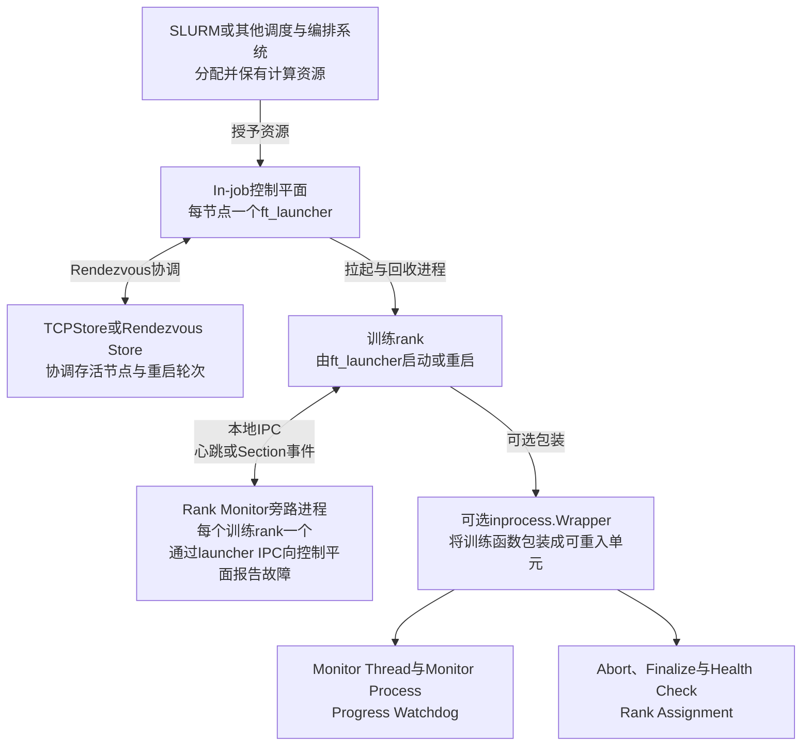
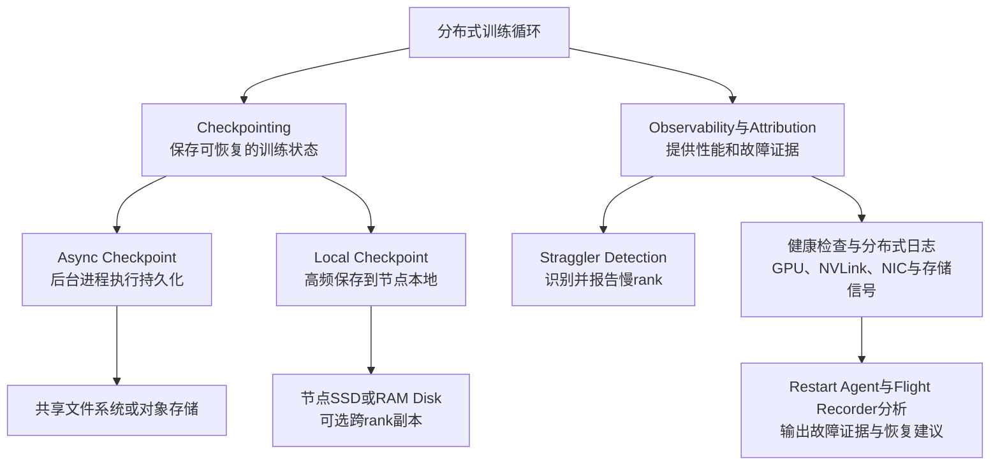
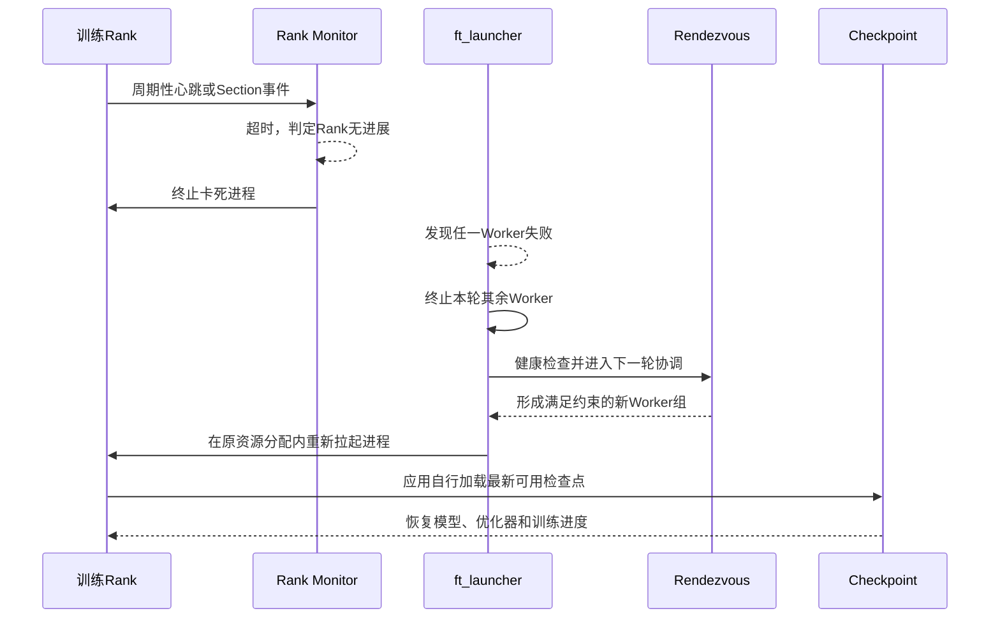

## 基本介绍

`NVIDIA Resiliency Extension`简称`NVRx`（ https://github.com/NVIDIA/nvidia-resiliency-ext ），是`NVIDIA`面向大规模`PyTorch`分布式工作负载开发的一组训练韧性组件。它关注的不是让单个训练步骤计算得更快，而是通过更早发现故障、更快恢复训练、更频繁地保存状态以及定位慢`rank`，提高集群真正产出有效训练进度的比例，也就是训练`goodput`。

`NVRx`不是训练框架、作业调度器或检查点存储系统。它不会替代`PyTorch DDP`、`Megatron-LM`、`NeMo`、`SLURM`或共享存储，而是以`Launcher`、`Python API`、函数包装器和可选回调等形式嵌入这些系统之间。其主要价值可以概括为：

- 在既有资源分配内检测`rank`失联或卡死，并重新拉起训练进程；
- 在条件允许时直接在同一操作系统进程中重进训练函数，进一步减少初始化开销；
- 将耗时的检查点写入移到后台进程，并支持节点本地介质与副本；
- 对训练代码段和`CUDA Kernel`计时，识别拖慢同步训练的`rank`；
- 在恢复边界执行`GPU`、`NVLink`、`NIC`和存储健康检查，汇集日志及`PyTorch Flight Recorder`信息，辅助故障归因。

| 项目属性 | 当前信息 |
|------|------|
| 源码仓库 | `NVIDIA/nvidia-resiliency-ext` |
| 主要实现 | `Python`，慢`rank`分析包含`C++/CUPTI`扩展 |
| 开源协议 | `Apache License 2.0` |
| 稳定性定位 | 项目`README`标注为实验项目并处于活跃开发期 |

::::warning 实验项目提示

项目`README`明确标注：`NVRx`仍属于实验项目并处于活跃开发期，代码、功能和文档都在快速演进，可能频繁更新并产生破坏性变更。本文基于`2026-09-11`检出的主分支提交`d23f0a11310ab7fd2e73a578511cdf7ccfd60fc7`，其`git describe`结果为`v0.7.0-main-125-gd23f0a1`。生产环境应固定经过验证的版本、容器镜像和配置，不能直接把本文参数视为所有版本都稳定支持的契约。

::::

:::info 关于相对对SLURM集群的支持
该项目上有提到对`SLURM`集群的支持，那么该项目是否只能运行在`SLURM`集群？

不是。`NVRx`整体上不绑定`SLURM`，它的异步检查点、本地检查点、慢`rank`检测和`inprocess.Wrapper`等核心组件主要依赖`PyTorch`分布式运行环境，可以独立接入其他集群。`ft_launcher`也基于`torchrun`实现，并支持大部分`torchrun`命令行参数。
:::

## 它解决了哪些训练痛点

大模型同步训练的故障成本会被集群规模放大：一个`rank`卡死会让其他`rank`阻塞在集合通信上，一次检查点写盘会让大量`GPU`一起等待，一块降频或异常的`GPU`则可能持续拖慢整个数据并行组。`NVRx`将这些问题拆成检测、恢复、状态保存和诊断四类能力。

| 现实痛点 | `NVRx`如何解决 |
|------|------|
| **训练任务`hang`死或局部节点故障时，整个作业直接崩溃，需要从头重新调度；这既可能损失数小时训练算力，重新申请大批节点也往往耗时很久** | `In-job Restart`不销毁已有的`SLURM`资源分配，直接在现有节点上重新拉起训练进程并恢复；`In-process Restart`还能在健康`rank`的同一操作系统进程内重进训练函数，进一步省去容器、`Python`进程、依赖和`CUDA Context`等重建开销，缩短故障恢复时间 |
| **传统同步`Checkpoint`在保存断点时，会让全部训练进程停下来等待写盘；大模型检查点体积巨大，一次写盘可能耗时数分钟，期间大量`GPU`算力空转** | 异步`Checkpoint`将实际持久化交给`torch.multiprocessing`后台进程，训练循环完成必要的快照准备后即可继续执行；本地分层`Checkpoint`把高频断点写入节点`SSD`或`RAM Disk`，并可配置副本，从而减少共享存储`I/O`压力和前台等待时间 |
| **集群中个别`GPU`或节点性能变差，形成慢节点`Straggler`，会拖累整个同步训练集群的吞吐，但很难发现究竟是哪台机器在拖后腿** | `Straggler Detection`自动采集各`rank`的代码段耗时和可选`CUDA Kernel`耗时，计算相对性能与个体历史性能分数，识别并报告慢`rank`，帮助运维人员定位可疑机器 |
| **大规模训练崩溃后，很难区分故障来源：究竟是`GPU`硬件、`NVLink`、网卡`NIC`、集合通信，还是训练软件本身的问题** | 健康检查通过`NVML`、`NVLink`状态和错误计数、`InfiniBand NIC`链路计数等信号检查硬件；分布式日志和`PyTorch Flight Recorder`分析收集跨`rank`故障上下文，实验性的故障归因模块进一步给出证据与重启或停止建议，辅助而不是替代最终根因判断 |
| **`PyTorch`原生分布式容错能力较弱，用户需要自行实现`hang`检测、快速重启、高效断点和故障诊断逻辑，开发与验证工作量很大** | 项目提供完整的`Python API`、`ft_launcher`、`inprocess.Wrapper`、检查点管理器和慢`rank`检测组件，可以模块化接入现有`PyTorch DDP`训练代码；项目也包含`PTL`回调，但该集成在当前主分支已经废弃，不应作为新项目的长期接口 |

## 总体架构

`NVRx`采用模块化设计。

**核心运行与重启视图：**

`In-job Restart`保留外部调度器已授予的资源，由`ft_launcher`重新拉起训练进程；可选的`inprocess.Wrapper`则在存活`rank`的同一操作系统进程内重新进入训练函数。图中仅绘制一个训练`rank`单元，实际环境会按`WORLD_SIZE`复制，且每个训练`rank`都有对应的`Rank Monitor`旁路进程。

**状态保存与观测诊断视图：**

检查点路径与重启路径是松耦合的：`ft_launcher`和`inprocess.Wrapper`负责让训练代码再次运行，训练程序则必须在入口处显式加载最新可用检查点。`NVRx`不会因为重启了进程就自动还原模型、优化器和数据迭代位置等训练语义。

上述两张图是对当前实现的逻辑归纳，不表示所有组件都必须同时部署。比如只需要卡死检测时，可以仅使用`ft_launcher`与`RankMonitorClient`；只需要分析慢`rank`时，也可以单独引入`Straggler Detection`。

**核心组件**：

| 组件 | 主要职责 | 关键接口 |
|------|------|------|
| `fault_tolerance` | 检测心跳或代码段超时、发现进程退出、协调`in-job`重启 | `ft_launcher`、`RankMonitorServer`、`RankMonitorClient` |
| `inprocess` | 在同一操作系统进程中重新执行训练函数，清理旧进程组并重新分配`rank` | `Wrapper`、`CallWrapper`、`Compose` |
| `checkpointing.async_ckpt` | 调度后台检查点请求，异步执行`torch.save`或`torch.distributed.checkpoint`写入 | `AsyncCallsQueue`、`AsyncRequest`、`TorchAsyncCheckpoint` |
| `checkpointing.local` | 将分片检查点写入节点本地介质，发现最新完整版本并按需取回副本 | `LocalCheckpointManager`、`BasicTensorAwareStateDict`、`CliqueReplicationStrategy` |
| `attribution.straggler` | 对代码段及其中的`CUDA Kernel`计时，生成性能分数和慢`rank`报告 | `Detector`、`Report`、`identify_stragglers` |
| `shared_utils` | 提供健康检查、`rank`感知日志、节点本地日志汇集及通用工具 | `GPUHealthCheck`、`NVLHealthCheck`、`NicHealthCheck`、`setup_logger` |
| `attribution` | 分析日志和集合通信转储，输出故障证据及重启或停止建议 | `RestartAgent`、`RestartAgentRuntime`、`trace_analyzer`、`attrsvc` |
| `ptl_resiliency` | 为`PyTorch Lightning`提供故障容忍、慢`rank`与本地检查点回调 | `FaultToleranceCallback`、`StragglerDetectionCallback`等 |

`ptl_resiliency`虽然仍存在于源码中，但当前模块文档和源码均已标记为废弃，并说明将在后续版本移除。新项目不应再把这些回调当作长期稳定接口；已有`Lightning`或`NeMo`项目需要结合其所固定的`NVRx`版本评估迁移路径。

## 两级重启机制

### In-job Restart

`fault_tolerance`包提供基于`torchrun`改造的`ft_launcher`。每个节点运行一个`ft_launcher`，每个训练`rank`对应一个独立的`Rank Monitor`旁路进程，二者通过本地`IPC`交换状态；不同节点的`ft_launcher`通过`rendezvous`协调。`Rank Monitor`之间不直接通信。

训练代码有两种互相独立、也可同时使用的卡死检测方式：

| 检测方式 | 工作方式 | 取舍 |
|------|------|------|
| `Heartbeats API` | 训练循环定期调用`send_heartbeat()`；首个心跳和后续心跳分别受超时控制 | 接入简单，但超时必须覆盖数据加载、评估和检查点等最长合法间隔 |
| `Sections API` | 以具名`section`包围前向、反向或数据加载等代码段，监控代码段是否打开过久 | 改动更多，但可为不同阶段设置更精细的超时，通常能更早发现卡死 |

一次典型恢复流程如下：

当前`--ft-restart-policy`参数已废弃，只支持与`torchrun`一致的`any-failed`行为：任一`worker`失败就重启全部`worker`。`--max-restarts`限制本次资源分配中的重启预算。当前主分支还包含热备节点、基于`NVLink Domain`的分段`rank`分配、无进展循环检测和退出码约定等能力，但这些接口演进较快，采用前必须以固定版本文档为准。

`ft_launcher`负责重新启动进程，不负责自动还原训练语义。模型参数、优化器状态、学习率调度器、随机数状态、数据采样位置等，仍需训练程序从检查点正确恢复。没有检查点时，进程虽然能被拉起，训练仍可能从头开始。

### In-process Restart

`inprocess.Wrapper`将一个实现分布式训练的`Python`函数包装成可重入单元。任一`rank`出现未处理异常或无进展超时后，包装器在各健康`rank`中协调执行以下步骤：

1. 异步中止旧的`torch.distributed`进程组，并将控制流从被包装函数中退出；
2. 执行用户可扩展的`Finalize`和本地健康检查；
3. 剔除终止、失联或不健康的`rank`，重新计算连续的`RANK`与`WORLD_SIZE`；
4. 重新运行`Initialize`和被包装函数，直到成功完成或满足终止条件。

与重启整个训练进程相比，它可保留进程组无关的对象，例如预先构造且能跨恢复边界安全复用的模型或优化器，从而避免重复启动容器、创建解释器、加载依赖和创建`CUDA Context`。最简单的接入方式是包装整个`main()`；更深度的接入则只包装依赖分布式进程组的训练循环。

这项能力约束较强：被包装函数必须可重复调用，不能吞掉包装器注入的`BaseException`；跨恢复边界的对象不能保留失效的进程组引用；恢复时强烈建议重新加载受集合通信影响的状态。若阻塞操作一直占有`GIL`，优雅恢复线程无法运行，最终只能由硬超时发送信号终止该进程。此外，默认`rank 0`承载内部`TCPStore`，其节点丢失会终止整个作业，除非用户提供其他`StoreMixin`实现。

当前官方文档还明确说明，`ft_launcher`与`inprocess`的组合模型正在重新评估。虽然源码包含分层重启相关实现，但新系统不应在没有故障注入测试的情况下假设两级恢复组合已形成稳定契约。

## 检查点体系

### 异步检查点

传统同步保存通常包含状态整理、设备到主机的数据搬运、序列化、文件写入和多`rank`协调。若这些步骤全部位于训练主流程，所有`GPU`都可能在保存期间空转。

`NVRx`的异步框架把一次保存表示为`AsyncRequest`，再交给`AsyncCallsQueue`调度。默认`PersistentAsyncCaller`通过`spawn`创建持久后台进程；它接收`GPU Tensor`的`IPC Handle`，可先将张量预取到主机内存，再执行实际写入。项目提供两条常用封装：

- `TorchAsyncCheckpoint`：异步执行`torch.save`；
- `save_state_dict_async_plan`配合`FileSystemWriterAsync`：异步执行分布式状态字典保存，并通过元数据缓存减少后续检查点的规划与通信开销。

主训练进程可以用`maybe_finalize_async_calls(blocking=False)`非阻塞轮询，训练结束或需要严格提交检查点时再使用`blocking=True`等待。多`rank`最终确认可通过一次整数集合通信完成，用户还必须显式调用`close()`清理后台进程。

异步并不等于零成本。创建一致快照、将`GPU Tensor`预加载到主机以及必要的`torch.cuda.synchronize()`仍会短暂占用前台时间和主机内存；后台写入也会消耗`CPU`、内存带宽和存储带宽。它优化的是训练与持久化的重叠，而不是消除`I/O`。

### 本地检查点与副本

`LocalCheckpointManager`把每个`rank`的检查点分片保存到用户配置的节点本地目录，可以使用本地`SSD`或`RAM Disk`。与把每一份检查点都写到共享存储相比，本地介质通常能提供更低延迟和更高写入带宽。

`BasicTensorAwareStateDict`负责将普通状态字典包装成便于张量搬运和副本交换的结构。可选的`CliqueReplicationStrategy`把若干`rank`组成副本组，`replication_factor`指定每份分片存放的副本数量，`replication_jump`控制组成副本组的`rank`间隔。加载时，如果本地缺少某个分片，管理器可以从仍持有副本的`rank`取回。

本地检查点有明确边界：

- 它是临时恢复层，不能替代共享存储或对象存储中的长期、跨作业检查点；整批节点或本地盘同时丢失时，本地副本也会丢失。
- 所有训练`rank`必须同时调用`save()`、`load()`和`find_latest()`，否则可能出现集合通信卡死或张量分配`OOM`。
- 使用`BasicTensorAwareStateDict`时，状态字典中的张量应位于`CUDA`设备，并且只嵌套在字典或列表中；更复杂状态需要自定义`TensorAwareStateDict`。
- 异步本地检查点当前必须使用`AsyncCallsQueue(persistent=False)`，因为部分本地保存例程不可序列化。
- 如果保存时启用了副本，恢复时应保持`world_size`、`replication_jump`和`replication_factor`一致，否则可能无法利用副本恢复完整检查点。

因此，合理的分层策略通常是“高频本地检查点＋低频全局持久检查点”：短暂的进程或少量节点故障优先从本地层恢复，资源分配整体失效后再从全局层恢复。具体路由逻辑需要由训练框架或用户代码实现；源码中曾用于该模式的`HierarchicalCheckpointIO`属于已废弃的`ptl_resiliency`接口。

## 慢Rank检测

同步训练每一步都存在隐式或显式屏障，最快的`rank`也必须等待最慢的`rank`。`Straggler Detection`允许用户把数据加载、前向或其他代码块标记为检测区间，收集两类指标：

- `CPU`性能：检测区间消耗的墙钟时间；
- `GPU`性能：可选地汇总所有检测区间内捕获的`CUDA Kernel`时间。

组件为每个`rank`计算`0.0`到`1.0`之间的分数：

| 分数 | 参考基线 | 含义示例 |
|------|------|------|
| 相对性能分数 | 当前作业中表现最好的`rank` | `0.5`表示该`rank`约为本轮最快`rank`的二分之一速度 |
| 个体性能分数 | 该`rank`自身历史最佳表现 | `0.5`表示当前速度约为自身历史最佳的一半 |

当分数低于配置阈值时，`Report.identify_stragglers()`可报告慢`rank`。相对分数适合发现某台机器与同伴不一致，个体分数适合发现整个集群同时变慢或某个`rank`相对自身退化。

这仍然是症状检测，不是根因诊断。若`rank 0`本来就承担额外工作，却与其他`rank`使用相同检测区间，它也可能被合理地测为更慢。生成相对分数或把结果汇总到`rank 0`还会引入跨`rank`同步，应把报告周期设置为分钟级而不是每步执行。官方文档称`CUDA Kernel`分析通常预期低于`1%`步骤开销，但实际值依赖模型和采样频率，应在目标负载上实测。

## 健康检查、日志与故障归因

### 硬件与存储健康检查

当前健康检查覆盖的信号如下：

| 检查 | 依据 | 可确认的事实 |
|------|------|------|
| `GPUHealthCheck` | `NVML GPU Recovery Action` | 驱动是否建议`GPU Reset`、节点重启、排空`P2P`流量或排空后重置 |
| `NVLHealthCheck` | `NVML`报告的`NVLink`链路状态 | 指定`GPU`是否存在处于禁用状态的`NVLink`；不可访问的单条链路只记录告警并继续检查 |
| `NVLinkWindowHealthCheck` | `NVLink`恢复、重放、重试和接收错误计数的滑动窗口 | 链路是否持续产生异常事件，而不是只看单次状态 |
| `NicHealthCheck` | `/sys/class/infiniband/.../link_downed`计数 | 与本地`GPU`拓扑接近的`IB NIC`是否新增链路掉线事件 |
| 存储健康检查 | `Lustre`健康文件、挂载可达性和指定路径读访问 | 训练依赖的分布式存储或检查点路径是否基本可访问 |

`GPU Recovery Action`接口要求`r570`或更高版本驱动；低版本驱动会禁用该项检查。健康检查也存在“信号不可用时放行”的场景，例如可选节点健康服务缺失或返回不可解析内容时，`ft_launcher`记录日志但不会据此判定节点故障。因此，健康检查结果不能替代数据中心级监控和带外硬件诊断。

### 分布式日志

`shared_utils`中的`NVRx Logger`会为日志补充节点、工作负载`rank`、基础设施`rank`以及源码位置。设置`NVRX_NODE_LOCAL_TMPDIR`后，每个`rank`先写节点本地临时文件，再由本地`rank 0`聚合成每节点日志，从而避免所有`rank`直接高频写网络文件系统。

这里的“分布式日志”默认是节点内聚合，不是把整个集群的日志发送到中心平台。`ft_launcher`另有按恢复轮次生成应用日志和可选`gRPC`汇聚的路径，可让节点把日志流汇到`rendezvous`主机后由单写者落到共享存储。官方文档明确把该路径定义为`best-effort`：故障边界附近的日志或崩溃堆栈可能缺失，关键崩溃分析仍应保留`Rank Monitor`日志和操作系统`Core Dump`。

### 故障归因

归因模块当前包含两个值得关注的方向：

- `Flight Recorder`分析读取`PyTorch`在超时或异常时导出的集合通信轨迹，比较不同`rank`已入队和已完成的`collective`序列，识别缺失或卡住的`rank`。该分析本身属于监控证据，不直接决定是否停止或重启。
- 实验性的`Restart Agent`读取一份交错的分布式训练日志和可选的历史尝试记录，先生成确定性证据，再可选调用模型完成结构化解释，最终根据重试规则和预算给出`STOP`或`RESTART`建议。

在`ft_launcher`集成中，归因默认不阻塞下一轮恢复：启动器提交本轮日志后立即重启，由后台轮询器获取归因结果。`--ft-attribution-stop-action`默认值为`log`，也就是只记录`STOP`建议而不终止作业；只有显式设置为`no-restart`才会执行停止决定。这个默认值体现了项目对误判的谨慎态度。

因此，不能把`NVRx`表述为一定能自动、准确地区分“`GPU`硬件、`NVLink`、`NIC`或软件缺陷”。更准确的说法是：它把硬件健康信号、`rank`事件、训练日志和集合通信轨迹组织成更完整的故障上下文，并提供仍属实验性的归因与重启决策能力，最终结论仍需结合基础设施遥测和应用日志验证。

## 参考资料

- [NVIDIA Resiliency Extension项目](https://github.com/NVIDIA/nvidia-resiliency-ext)
- [NVRx官方文档首页](https://nvidia.github.io/nvidia-resiliency-ext/)
- [Fault Tolerance Usage Guide源码快照](https://github.com/NVIDIA/nvidia-resiliency-ext/blob/d23f0a11310ab7fd2e73a578511cdf7ccfd60fc7/docs/source/fault_tolerance/usage_guide.rst)
- [In-process Restart Usage Guide源码快照](https://github.com/NVIDIA/nvidia-resiliency-ext/blob/d23f0a11310ab7fd2e73a578511cdf7ccfd60fc7/docs/source/inprocess/usage_guide.rst)
- [Async Checkpointing Usage Guide源码快照](https://github.com/NVIDIA/nvidia-resiliency-ext/blob/d23f0a11310ab7fd2e73a578511cdf7ccfd60fc7/docs/source/checkpointing/async/usage_guide.rst)
- [Local Checkpointing Usage Guide源码快照](https://github.com/NVIDIA/nvidia-resiliency-ext/blob/d23f0a11310ab7fd2e73a578511cdf7ccfd60fc7/docs/source/checkpointing/local/usage_guide.rst)
- [Straggler Detection Usage Guide源码快照](https://github.com/NVIDIA/nvidia-resiliency-ext/blob/d23f0a11310ab7fd2e73a578511cdf7ccfd60fc7/docs/source/straggler_det/usage_guide.rst)
- [Failure Attribution文档源码快照](https://github.com/NVIDIA/nvidia-resiliency-ext/blob/d23f0a11310ab7fd2e73a578511cdf7ccfd60fc7/docs/source/attribution/index.rst)
- [Shared Utilities文档源码快照](https://github.com/NVIDIA/nvidia-resiliency-ext/blob/d23f0a11310ab7fd2e73a578511cdf7ccfd60fc7/docs/source/shared_utils/index.rst)
- [硬件健康检查实现](https://github.com/NVIDIA/nvidia-resiliency-ext/blob/d23f0a11310ab7fd2e73a578511cdf7ccfd60fc7/src/nvidia_resiliency_ext/shared_utils/health_check.py)
- [项目依赖与打包配置](https://github.com/NVIDIA/nvidia-resiliency-ext/blob/d23f0a11310ab7fd2e73a578511cdf7ccfd60fc7/pyproject.toml)
- [NVRx Release Notes](https://github.com/NVIDIA/nvidia-resiliency-ext/blob/d23f0a11310ab7fd2e73a578511cdf7ccfd60fc7/docs/source/release-notes.md)
- [PyTorch Lightning集成废弃声明](https://github.com/NVIDIA/nvidia-resiliency-ext/blob/d23f0a11310ab7fd2e73a578511cdf7ccfd60fc7/src/nvidia_resiliency_ext/ptl_resiliency/__init__.py)
