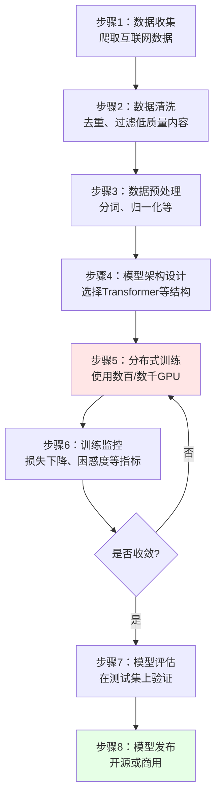
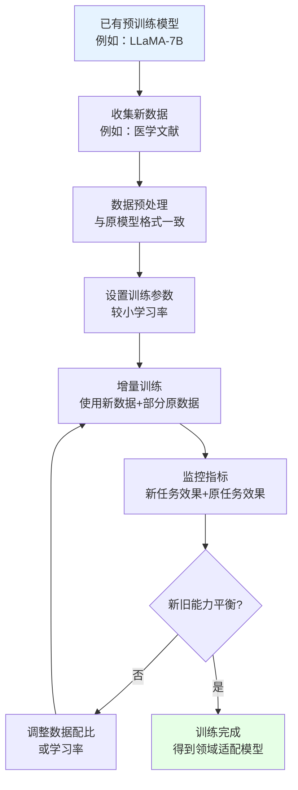
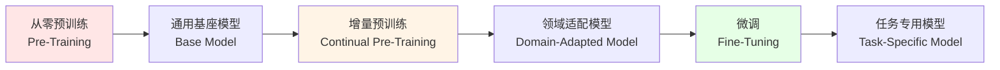
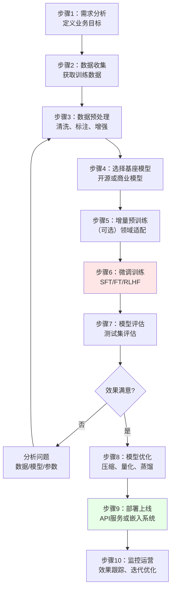

本文将深入介绍`AI`模型训练的核心技术和方法，帮助你理解从零开始训练模型和增量预训练的完整过程。

:::tip 前置知识
本文重点讲解`AI`模型训练技术。建议先提前了解`AI`模型的本质(参数、架构等)以及机器学习基础概念(如机器学习、深度学习、神经网络等)，请参考 [AI模型与机器学习](./1000-AI模型与机器学习.md)。
:::


## AI模型训练的基本概念

**训练**就是通过大量数据和反复调整，让神经网络学习并优化其内部参数(权重和偏置)，让模型从"随机猜测"进化到"精准预测"，使其能够完成特定任务的过程。

在了解具体的训练方法之前，让我们通过一个简单的猜数字游戏来理解训练过程：

**游戏规则**：我心里想一个`1`到`100`之间的数字（假设是`42`），你来猜。每次猜完，我会告诉你"太大了"还是"太小了"。

**第1次**：你随机猜`50`（这就像**模型初始化**，参数是随机的）
- 我说"太大了"（这就是**计算损失**，发现预测错了）
- 你意识到要往小的方向调整（这就是**反向传播**，计算梯度）

**第2次**：你猜`30`（这就是**参数更新**）
- 我说"太小了"
- 你知道答案在`30-50`之间

**第3次**：你猜`40`
- 我说"太小了"
- 范围缩小到`40-50`

**第4-5次**：你继续调整，猜`42`
- 我说"答对了！"（这就是**收敛**，找到了正确答案）

这个过程完美展示了`AI`训练的核心思想：
1. **随机开始**：一开始什么都不知道，随便猜
2. **获得反馈**：根据结果知道自己错在哪里
3. **调整策略**：往正确的方向修正
4. **反复迭代**：多次尝试逐步逼近答案
5. **达到目标**：最终找到正确答案

**训练的本质**：

通过不断调整神经网络中数十亿个参数的值，让模型的预测结果越来越接近真实答案，最终让模型学会解决特定问题的能力。就像猜数字游戏一样，通过反复尝试和调整，最终找到那个"正确答案"。


## AI模型训练的常见方法

理解了训练的基本原理后，你可能会想：现实中是不是每次都要从零开始训练一个模型？答案是否定的。就像盖房子，我们可以从地基开始盖（从零预训练），也可以在已有建筑基础上扩建（增量预训练）。不同的训练策略适用于不同的场景，成本和效果也大相径庭。让我们看看业界主要采用哪些训练方法。

### 预训练 (Pre-Training, PT)

**预训练**是指在海量通用数据上从零开始训练一个大模型的过程，这个模型会学习到广泛的知识和能力，成为后续任务的基础。

#### 核心特点

**通俗理解**：就像培养一个孩子的通识教育阶段，让他从小学到大学学习语文、数学、物理、化学、历史、地理等各种知识，建立广泛的知识体系和思维能力。

**关键要素**：
- **数据量超大**：通常使用整个互联网的文本、图片等数据，规模可达`TB`甚至`PB`级
- **训练目标通用**：不针对特定任务，而是学习通用的表示能力
- **资源消耗巨大**：需要数百到数千块`GPU`，训练时间从数周到数月
- **一次性投入**：通常由大公司或研究机构完成，训练完成后可被广泛复用

#### 常见的预训练任务

不同类型的模型有不同的预训练方式：

| 模型类型 | 预训练任务 | 训练目标 | 通俗理解 |
|---------|-----------|---------|---------|
| **语言模型<br/>`GPT`系列** | 下一个词预测<br/>`Next Token Prediction` | 给定前面的文本，预测下一个词 | 给你半句话，让你猜下一个字 |
| **掩码语言模型<br/>`BERT`** | 掩码词预测<br/>`Masked Language Modeling` | 遮盖句子中的部分词，让模型预测 | 完形填空题 |
| **图像模型<br/>`ResNet`、`ViT`** | 图像分类<br/>`Image Classification` | 在大规模图像数据集上学习视觉特征 | 看大量图片学习识别物体 |
| **多模态模型<br/>`CLIP`** | 图文对齐<br/>`Image-Text Matching` | 学习图像和文本的对应关系 | 学习图片和文字描述的匹配 |

#### 预训练的产物：基座模型

预训练完成后得到的模型称为**基座模型**（`Base Model`）或**预训练模型**（`Pre-trained Model`），它具备以下特征：

✅ **通用知识丰富**：学习了大量的语言、常识、推理能力  
✅ **迁移能力强**：可以通过微调适应各种下游任务  
✅ **开箱即用**：即使不微调也能完成一些基础任务  
✅ **社区共享**：通常会开源供大家使用（如`BERT`、`LLaMA`、`GPT-2`等）

#### 著名的预训练模型

**国际模型**：

| 模型名称 | 发布机构 | 数据规模 | 参数量 | 主要用途 |
|---------|---------|---------|--------|---------|
| **`BERT`** | `Google` | `16GB`文本 | `110M-340M` | 文本理解、分类、问答 |
| **`GPT-3`** | `OpenAI` | `45TB`文本 | `175B` | 文本生成、对话、推理 |
| **`LLaMA`** | `Meta` | `1.4TB`文本 | `7B-65B` | 开源基座模型 |
| **`CLIP`** | `OpenAI` | `4亿`图文对 | `400M` | 图像-文本理解 |
| **`ResNet`** | `Microsoft` | `ImageNet 1.2M`图 | `25M-60M` | 图像识别 |

**国内模型**：

| 模型名称 | 发布机构 | 数据规模 | 参数量 | 主要用途 |
|---------|---------|---------|--------|---------|
| **`Qwen`（通义千问）** | 阿里云 | `3TB+`中英文文本 | `1.8B-72B` | 中文理解生成、多语言、编程 |
| **`ChatGLM`** | 清华/智谱`AI` | 未公开 | `6B-130B` | 中文对话、文本生成 |
| **`Baichuan`** | 百川智能 | `1.4TB`多语言 | `7B-13B` | 开源中文基座模型 |
| **`ERNIE`（文心）** | 百度 | 海量中文数据 | `10B-260B` | 中文理解、知识增强 |

#### 预训练的流程图



### 增量预训练 (Continual Pre-Training, CPT)

**增量预训练**是指在已有的预训练模型基础上，使用新的数据继续进行预训练，让模型学习新的知识或增强特定领域的能力。

#### 核心特点

**通俗理解**：就像一个大学毕业生已经有了基础知识，现在去读研究生深造，学习更专业、更前沿的知识。

**为什么需要增量预训练？**

| 场景 | 问题 | 增量预训练的作用 |
|------|-----|----------------|
| **知识过时** | 预训练模型的数据可能是几年前的，不了解最新事件 | 用最新数据继续训练，更新知识 |
| **领域专业性不足** | 通用模型在医疗、法律等专业领域表现不佳 | 用领域数据训练，增强专业能力 |
| **语言覆盖不足** | 英文模型不擅长中文 | 用中文数据训练，提升中文能力 |
| **特定能力欠缺** | 需要增强代码理解能力 | 用代码数据训练，提升编程能力 |

#### 增量预训练 vs 从零预训练

| 维度 | 从零预训练 | 增量预训练 |
|------|-----------|-----------|
| **起点** | 随机初始化参数 | 已有预训练模型 |
| **数据量** | 需要海量数据（`TB`级） | 可以用较少数据（`GB-TB`级） |
| **训练时间** | 数周到数月 | 数天到数周 |
| **计算成本** | 极高（数百万美元） | 中等（数万到数十万美元） |
| **适用场景** | 构建通用基座模型 | 领域适配、知识更新 |

#### 典型应用场景

**1. 领域适配**

**案例**：基于通用的`LLaMA`模型，使用医学文献进行增量预训练，得到医学领域的`Med-LLaMA`。

**效果**：
- 医学术语理解更准确
- 医学知识问答能力显著提升
- 临床推理能力增强

**2. 多语言适配**

**案例**：基于英文的`GPT`模型，使用中文语料进行增量预训练，得到中文能力更强的`GPT`模型。

**效果**：
- 中文理解和生成能力提升
- 中文文化相关知识增强
- 保留原有的英文能力（不会完全遗忘）

**3. 知识更新**

**案例**：`2025`年发布的模型不知道`2026`年的新闻，使用`2026`年的新闻数据进行增量预训练。

**效果**：
- 了解最新事件和知识
- 时效性信息更准确
- 保持原有的基础能力

**4. 能力增强**

**案例**：在通用语言模型基础上，使用大量代码数据进行增量预训练，得到`Code-LLaMA`这样的代码专用模型。

**效果**：
- 代码理解能力大幅提升
- 代码生成质量更高
- 支持更多编程语言

#### 增量预训练的技术要点

**1. 学习率设置**

增量预训练通常使用**比从零训练更小的学习率（参数更新步长的超参数）**，避免破坏已有知识。

**通俗理解**：就像已经学会的东西，复习时要温和一点，不要用力过猛把以前学的都忘了。

**2. 数据配比**

通常会**混合新数据和原始数据**，而不是只用新数据。

**原因**：防止"灾难性遗忘"（`Catastrophic Forgetting`），即学新知识时把旧知识全忘了。

**配比示例**：
- 新领域数据：`70%`
- 原始通用数据：`30%`

**3. 训练轮次**

增量预训练的轮次通常**比从零训练少得多**。

**原因**：模型已经有了好的初始化，不需要太多轮次就能学会新知识。

#### 增量预训练流程图



### 预训练与增量预训练的关系



**完整训练流程**：
1. **预训练**：在海量通用数据上训练，得到通用基座模型
2. **增量预训练**（可选）：在特定领域数据上继续训练，得到领域模型
3. **微调**：在具体任务数据上训练，得到任务专用模型

### 预训练的成本与价值

#### 成本分析

| 模型 | 参数量 | 训练硬件 | 训练时间 | 估计成本 |
|------|--------|---------|---------|---------|
| **`BERT-Base`** | `110M` | `16`块`TPU` | `4`天 | `~$7,000` |
| **`GPT-2`** | `1.5B` | `32`块`V100` | `1`周 | `~$43,000` |
| **`GPT-3`** | `175B` | `10,000`块`V100` | `数月` | `~$4,600,000` |
| **`LLaMA-65B`** | `65B` | `2,048`块`A100` | `21`天 | `~$2,000,000` |

#### 价值体现

尽管预训练成本高昂，但其价值在于：

✅ **一次训练，多次复用**：一个预训练模型可以用于成千上万种任务  
✅ **社区共享**：开源后全世界的开发者都能受益  
✅ **降低门槛**：让小团队也能开发`AI`应用  
✅ **加速创新**：不需要每个人都从零开始

### 增量预训练的成本与价值

相比完整的从零预训练，增量预训练的成本要低得多，但仍需要可观的投入。

#### 成本分析

| 场景 | 基座模型 | 数据规模 | 训练硬件 | 训练时间 | 估计成本 |
|------|---------|---------|---------|---------|---------|
| **中文适配** | `LLaMA-7B` | `100GB`中文文本 | `64`块`A100` | `5-7`天 | `~$50,000` |
| **医学领域** | `LLaMA-13B` | `50GB`医学文献 | `32`块`A100` | `3-5`天 | `~$30,000` |
| **代码能力** | `GPT-3` | `200GB`代码数据 | `128`块`A100` | `7-10`天 | `~$100,000` |
| **金融领域** | `BERT-Base` | `20GB`金融文档 | `8`块`V100` | `2-3`天 | `~$5,000` |

#### 与从零预训练的成本对比

让我们看一个具体例子：**打造一个7B参数的中文大模型**

| 维度 | 从零预训练 | 增量预训练 | 节省比例 |
|------|-----------|-----------|---------|
| **数据需求** | `1-2TB`多语言数据 | `100GB`中文数据 | 节省`90%+` |
| **训练硬件** | `256`块`A100` | `64`块`A100` | 节省`75%` |
| **训练时间** | `30-40`天 | `5-7`天 | 节省`80%+` |
| **总成本** | `$400,000-$600,000` | `$50,000-$80,000` | 节省`85%+` |
| **风险** | 高（可能失败） | 低（基于成熟模型） | - |

**关键优势**：

✅ **成本降低**：通常只需要从零训练成本的`10-20%`
✅ **时间缩短**：训练时间减少`70-85%`  
✅ **数据需求少**：只需要领域数据，不需要海量通用数据  
✅ **风险更低**：基于已验证的模型，成功率更高  
✅ **效果有保证**：继承基座模型的通用能力，只需增强特定领域

#### 价值体现

增量预训练的价值在于**平衡了成本和专业性**：

| 价值点 | 说明 | 示例 |
|-------|------|------|
| **领域专业化** | 在特定领域达到专家水平 | 医学模型理解专业术语准确率提升`40%` |
| **语言本地化** | 显著提升特定语言能力 | 中文模型在中文任务上超越原版`30%` |
| **知识更新** | 学习最新知识和趋势 | `2024`年数据让模型了解最新事件 |
| **企业可负担** | 中型企业也能承受的成本 | `5-10`万美元的预算即可实现 |
| **快速迭代** | 几天就能看到效果 | 一周内完成模型升级 |

#### 实际案例对比

**案例：打造医学AI助手**

| 方案 | 从零训练医学模型 | 基于`LLaMA`增量预训练 |
|------|----------------|---------------------|
| **需要数据** | 需要`TB`级通用数据+医学数据 | 只需`50-100GB`医学数据 |
| **训练成本** | `$500,000+` | `$30,000-$50,000` |
| **训练时间** | `2-3`个月 | `5-7`天 |
| **团队规模** | `10+`人的大团队 | `2-3`人的小团队 |
| **成功率** | `60-70%`（可能失败） | `90%+`（基于成熟模型） |
| **最终效果** | 通用能力弱，医学能力强 | 通用能力强，医学能力也强 |

#### 何时选择增量预训练？

**适合增量预训练的场景**：

✅ 已有开源基座模型可用（如`LLaMA`、`Qwen`）  
✅ 需要增强特定领域或语言的能力  
✅ 预算在`5-20`万美元范围  
✅ 时间紧迫，需要快速上线  
✅ 团队规模有限（`2-5`人）

**必须从零训练的场景**：

❌ 需要完全不同的架构创新  
❌ 现有模型都不满足基本要求  
❌ 有充足的预算（百万美元级）和时间（数月）  
❌ 需要完全掌控模型的所有细节  
❌ 商业许可限制（某些模型不允许商用）


### 预训练方法总结

| 维度 | 从零预训练 | 增量预训练 | 
|------|-----------|-----------|
| **起点** | 随机初始化 | 已有预训练模型 | 
| **数据规模** | `TB`级 | `GB-TB`级 | 
| **训练目标** | 学习通用知识 | 增强特定领域 |
| **成本** | `$100万-$500万` | `$5万-$20万` |
| **时间** | `1-3`个月 | `5-15`天 |
| **适用场景** | 构建基座模型 | 领域适配、语言适配 |
| **主要玩家** | 大公司、研究机构 | 中型企业、创业公司 |

预训练和增量预训练构成了现代`AI`模型的基础，前者建立通用能力，后者实现专业适配。理解这两种方法的成本和价值，是掌握`AI`模型训练的关键第一步。


## AI模型训练的完整流程




### 步骤1：需求分析

明确要解决的业务问题：
- 具体任务是什么？（分类、生成、问答等）
- 输入和输出是什么？
- 性能要求是什么？（准确率、延迟等）
- 可用资源是什么？（数据、算力、预算）

### 步骤2：数据收集

| 数据来源 | 优点 | 缺点 | 适用场景 |
|---------|------|------|---------|
| **企业内部数据** | 领域相关性强 | 可能量不足 | 垂直领域应用 |
| **公开数据集** | 免费、量大 | 可能不匹配任务 | 通用任务、学习 |
| **数据采购** | 质量可控 | 成本高 | 商业项目 |
| **数据标注** | 可定制 | 耗时长 | 监督学习任务 |
| **数据生成** | 成本低、可扩展 | 可能有偏差 | 数据增强 |

### 步骤3：数据预处理

**数据清洗**：
- 去除重复数据
- 过滤低质量或错误数据
- 统一格式和编码

**数据标注**：
- 定义标注规范
- 培训标注员
- 质量抽检和一致性检查

**数据增强**：
- 同义词替换
- 回译（翻译成其他语言再翻译回来）
- 使用模型生成相似样本

**数据划分**：
- 训练集：70-80%
- 验证集：10-15%
- 测试集：10-15%

### 步骤4：选择基座模型

**考虑因素**：

| 因素 | 考虑点 |
|------|--------|
| **任务类型** | 文本、图像、多模态等 |
| **模型规模** | 参数量与算力是否匹配 |
| **语言支持** | 中文、英文或多语言 |
| **开源协议** | 商业使用是否受限 |
| **社区支持** | 文档、工具、案例是否丰富 |

**常用开源模型**：

| 模型系列 | 参数量 | 特点 | 适用场景 |
|---------|-------|------|---------|
| **`LLaMA-2`** | `7B-70B` | `Meta`开源，性能强 | 通用文本任务 |
| **`Qwen`** | `1.8B-72B` | 阿里云，中文优秀 | 中文应用 |
| **`ChatGLM`** | `6B-32B` | 清华开源，对话好 | 中文对话 |
| **`Mistral`** | `7B` | 欧洲团队，高效 | 资源受限场景 |
| **`BERT`** | `110M-340M` | 经典文本理解 | 分类、`NER`等 |

### 步骤5：增量预训练（可选）

**何时需要**：
- 领域数据与通用数据差异大（如医学、法律）
- 需要学习特定领域知识
- 有大量领域无标注数据

**训练要点**：
- 使用较小学习率（如`2e-5`）
- 混合通用数据和领域数据
- 监控困惑度（`Perplexity`）下降

### 步骤6：微调训练

**选择微调方法**：
- 任务简单、数据充足：全量微调（`FT`）
- 需要指令遵循：有监督微调（`SFT`）
- 需要优化主观质量：强化学习（`RLHF`）

**训练技巧**：
- 使用梯度累积应对显存不足
- 使用混合精度训练加速
- 定期在验证集上评估
- 使用早停防止过拟合

### 步骤7：模型评估

**自动评估指标**：

| 任务类型 | 常用指标 |
|---------|---------|
| **分类** | 准确率、`F1`分数、`AUC` |
| **生成** | `BLEU`、`ROUGE`、`Perplexity` |
| **问答** | `EM`（精确匹配）、`F1` |
| **摘要** | `ROUGE`、`BERTScore` |
| **对话** | 困惑度、响应多样性 |

**人工评估**：
- 相关性：回答是否切题
- 流畅性：语言是否自然
- 准确性：信息是否正确
- 安全性：是否包含有害内容

### 步骤8：模型优化

针对部署需求优化模型：

**模型压缩**：
- **量化**：将`32`位浮点数降为`8`位或`4`位整数
- **剪枝**：移除不重要的参数
- **知识蒸馏**：用小模型学习大模型

**效果对比**：
```text
原始模型：7B 参数，14GB 显存，100ms 延迟，准确率 92%
量化后（INT4）：7B 参数，3.5GB 显存，110ms 延迟，准确率 90.5%（下降 1.5% < 2%）
蒸馏后（学生模型）：1.5B 参数，3GB 显存，20ms 延迟，准确率 87%（下降 5%）
```

### 步骤9：部署上线

**部署方式**：

| 方式 | 特点 | 适用场景 |
|------|------|---------|
| **云端API** | 高性能、易扩展、成本按需 | 并发不高的应用 |
| **边缘部署** | 低延迟、数据隐私保护 | 实时性要求高 |
| **本地部署** | 数据安全、无网络依赖 | 企业内网系统 |
| **混合部署** | 平衡性能和成本 | 复杂业务场景 |

**常用部署框架**：
- **`vLLM`**：高性能推理引擎
- **`FastAPI`**：快速构建`API`服务
- **`TensorRT`**：`NVIDIA`推理加速
- **`ONNX Runtime`**：跨平台推理

### 步骤10：监控运营

**监控指标**：
- **性能指标**：响应延迟、吞吐量、可用性
- **业务指标**：用户满意度、任务完成率、错误率
- **成本指标**：`GPU`利用率、推理成本

**持续优化**：
- 收集用户反馈和`badcase`
- 定期评估模型效果
- 积累新数据进行增量训练
- 跟踪新技术和新模型
