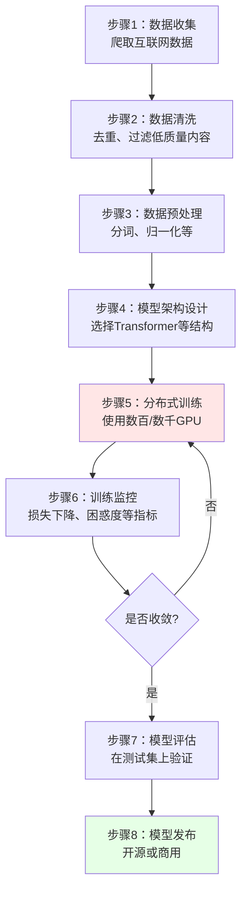
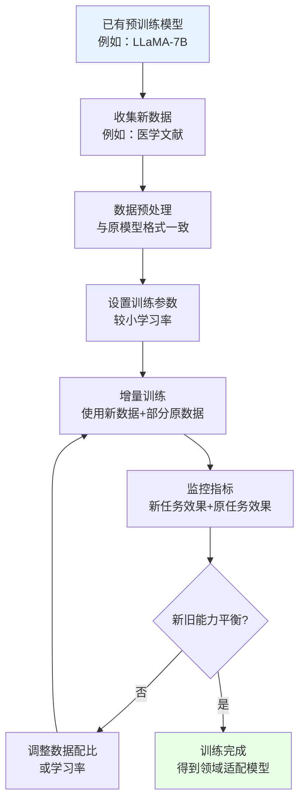
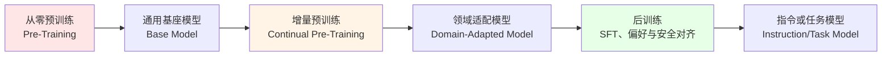
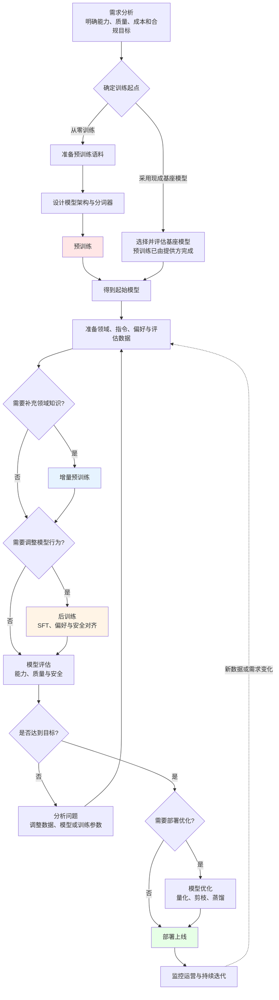

本文将深入介绍`AI`模型训练的核心技术和方法，帮助你理解从零预训练、增量预训练、后训练，以及基于现成基座模型进行训练的完整过程。

:::tip 前置知识
本文重点讲解`AI`模型训练技术。建议先提前了解`AI`模型的本质(参数、架构等)以及机器学习基础概念(如机器学习、深度学习、神经网络等)，请参考 [AI模型与机器学习](./1000-AI模型与机器学习.md)。
:::


## AI模型训练的基本概念

**训练**就是通过大量数据和反复调整，让神经网络学习并优化其内部参数(权重和偏置)，让模型从"随机猜测"进化到"精准预测"，使其能够完成特定任务的过程。

在了解具体的训练方法之前，让我们通过一个简单的猜数字游戏来理解训练过程：

**游戏规则**：我心里想一个`1`到`100`之间的数字（假设是`42`），你来猜。每次猜完，我会告诉你"太大了"还是"太小了"。

**第1次**：你随机猜`50`（这就像**模型初始化**，参数是随机的）
- 我说"太大了"（这就是**计算损失**，发现预测错了）
- 你意识到要往小的方向调整（这就是**反向传播**，计算梯度）

**第2次**：你猜`30`（这就是**参数更新**）
- 我说"太小了"
- 你知道答案在`30-50`之间

**第3次**：你猜`40`
- 我说"太小了"
- 范围缩小到`40-50`

**第4-5次**：你继续调整，猜`42`
- 我说"答对了！"（这就是**收敛**，找到了正确答案）

这个过程完美展示了`AI`训练的核心思想：
1. **随机开始**：一开始什么都不知道，随便猜
2. **获得反馈**：根据结果知道自己错在哪里
3. **调整策略**：往正确的方向修正
4. **反复迭代**：多次尝试逐步逼近答案
5. **达到目标**：最终找到正确答案

**训练的本质**：

通过不断调整神经网络中数十亿个参数的值，让模型的预测结果越来越接近真实答案，最终让模型学会解决特定问题的能力。就像猜数字游戏一样，通过反复尝试和调整，最终找到那个"正确答案"。


## AI模型训练的常见方法

理解了训练的基本原理后，你可能会想：现实中是不是每次都要从零开始训练一个模型？答案是否定的。就像盖房子，我们可以从地基开始盖（从零预训练），也可以在已有建筑基础上扩建（增量预训练）。不同的训练策略适用于不同的场景，成本和效果也大相径庭。让我们看看业界主要采用哪些训练方法。

### 预训练 (Pre-Training, PT)

**预训练**是指在海量通用数据上从零开始训练一个大模型的过程，这个模型会学习到广泛的知识和能力，成为后续任务的基础。

#### 核心特点

**通俗理解**：就像培养一个孩子的通识教育阶段，让他从小学到大学学习语文、数学、物理、化学、历史、地理等各种知识，建立广泛的知识体系和思维能力。

**关键要素**：
- **数据量超大**：通常使用整个互联网的文本、图片等数据，规模可达`TB`甚至`PB`级
- **训练目标通用**：不针对特定任务，而是学习通用的表示能力
- **资源消耗巨大**：需要数百到数千块`GPU`，训练时间从数周到数月
- **一次性投入**：通常由大公司或研究机构完成，训练完成后可被广泛复用

#### 常见的预训练任务

不同类型的模型有不同的预训练方式：

| 模型类型 | 预训练任务 | 训练目标 | 通俗理解 |
|---------|-----------|---------|---------|
| **语言模型<br/>`GPT`系列** | 下一个词预测<br/>`Next Token Prediction` | 给定前面的文本，预测下一个词 | 给你半句话，让你猜下一个字 |
| **掩码语言模型<br/>`BERT`** | 掩码词预测<br/>`Masked Language Modeling` | 遮盖句子中的部分词，让模型预测 | 完形填空题 |
| **图像模型<br/>`ResNet`、`ViT`** | 图像分类<br/>`Image Classification` | 在大规模图像数据集上学习视觉特征 | 看大量图片学习识别物体 |
| **多模态模型<br/>`CLIP`** | 图文对齐<br/>`Image-Text Matching` | 学习图像和文本的对应关系 | 学习图片和文字描述的匹配 |

#### 预训练的产物：基座模型

预训练完成后得到的模型称为**基座模型**（`Base Model`）或**预训练模型**（`Pre-trained Model`），它具备以下特征：

✅ **通用知识丰富**：学习了大量的语言、常识、推理能力  
✅ **迁移能力强**：可以通过微调适应各种下游任务  
✅ **开箱即用**：即使不微调也能完成一些基础任务  
✅ **社区共享**：通常会开源供大家使用（如`BERT`、`LLaMA`、`GPT-2`等）

#### 著名的预训练模型

**国际模型**：

| 模型名称 | 发布机构 | 数据规模 | 参数量 | 主要用途 |
|---------|---------|---------|--------|---------|
| **`BERT`** | `Google` | `16GB`文本 | `110M-340M` | 文本理解、分类、问答 |
| **`GPT-3`** | `OpenAI` | `45TB`文本 | `175B` | 文本生成、对话、推理 |
| **`LLaMA`** | `Meta` | `1.4TB`文本 | `7B-65B` | 开源基座模型 |
| **`CLIP`** | `OpenAI` | `4亿`图文对 | `400M` | 图像-文本理解 |
| **`ResNet`** | `Microsoft` | `ImageNet 1.2M`图 | `25M-60M` | 图像识别 |

**国内模型**：

| 模型名称 | 发布机构 | 数据规模 | 参数量 | 主要用途 |
|---------|---------|---------|--------|---------|
| **`Qwen`（通义千问）** | 阿里云 | `3TB+`中英文文本 | `1.8B-72B` | 中文理解生成、多语言、编程 |
| **`ChatGLM`** | 清华/智谱`AI` | 未公开 | `6B-130B` | 中文对话、文本生成 |
| **`Baichuan`** | 百川智能 | `1.4TB`多语言 | `7B-13B` | 开源中文基座模型 |
| **`ERNIE`（文心）** | 百度 | 海量中文数据 | `10B-260B` | 中文理解、知识增强 |

#### 预训练的流程图


```mermaid
graph TB
    A["步骤1：数据收集<br/>爬取互联网数据"] --> B["步骤2：数据清洗<br/>去重、过滤低质量内容"]
    B --> C["步骤3：数据预处理<br/>分词、归一化等"]
    C --> D["步骤4：模型架构设计<br/>选择Transformer等结构"]
    D --> E["步骤5：分布式训练<br/>使用数百/数千GPU"]
    E --> F["步骤6：训练监控<br/>损失下降、困惑度等指标"]
    F --> G{是否收敛?}
    G -->|否| E
    G -->|是| H["步骤7：模型评估<br/>在测试集上验证"]
    H --> I["步骤8：模型发布<br/>开源或商用"]
    
    style E fill:#ffe6e6
    style I fill:#e6ffe6
```

### 增量预训练 (Continual Pre-Training, CPT)

**增量预训练**是指在已有的预训练模型基础上，使用新的数据继续进行预训练，让模型学习新的知识或增强特定领域的能力。

#### 核心特点

**通俗理解**：就像一个大学毕业生已经有了基础知识，现在去读研究生深造，学习更专业、更前沿的知识。

**为什么需要增量预训练？**

| 场景 | 问题 | 增量预训练的作用 |
|------|-----|----------------|
| **知识过时** | 预训练模型的数据可能是几年前的，不了解最新事件 | 用最新数据继续训练，更新知识 |
| **领域专业性不足** | 通用模型在医疗、法律等专业领域表现不佳 | 用领域数据训练，增强专业能力 |
| **语言覆盖不足** | 英文模型不擅长中文 | 用中文数据训练，提升中文能力 |
| **特定能力欠缺** | 需要增强代码理解能力 | 用代码数据训练，提升编程能力 |

#### 增量预训练 vs 从零预训练

| 维度 | 从零预训练 | 增量预训练 |
|------|-----------|-----------|
| **起点** | 随机初始化参数 | 已有预训练模型 |
| **数据量** | 需要海量数据（`TB`级） | 可以用较少数据（`GB-TB`级） |
| **训练时间** | 数周到数月 | 数天到数周 |
| **计算成本** | 极高（数百万美元） | 中等（数万到数十万美元） |
| **适用场景** | 构建通用基座模型 | 领域适配、知识更新 |

#### 典型应用场景

**1. 领域适配**

**案例**：基于通用的`LLaMA`模型，使用医学文献进行增量预训练，得到医学领域的`Med-LLaMA`。

**效果**：
- 医学术语理解更准确
- 医学知识问答能力显著提升
- 临床推理能力增强

**2. 多语言适配**

**案例**：基于英文的`GPT`模型，使用中文语料进行增量预训练，得到中文能力更强的`GPT`模型。

**效果**：
- 中文理解和生成能力提升
- 中文文化相关知识增强
- 保留原有的英文能力（不会完全遗忘）

**3. 知识更新**

**案例**：`2025`年发布的模型不知道`2026`年的新闻，使用`2026`年的新闻数据进行增量预训练。

**效果**：
- 了解最新事件和知识
- 时效性信息更准确
- 保持原有的基础能力

**4. 能力增强**

**案例**：在通用语言模型基础上，使用大量代码数据进行增量预训练，得到`Code-LLaMA`这样的代码专用模型。

**效果**：
- 代码理解能力大幅提升
- 代码生成质量更高
- 支持更多编程语言

#### 增量预训练的技术要点

**1. 学习率设置**

增量预训练通常使用**比从零训练更小的学习率（参数更新步长的超参数）**，避免破坏已有知识。

**通俗理解**：就像已经学会的东西，复习时要温和一点，不要用力过猛把以前学的都忘了。

**2. 数据配比**

通常会**混合新数据和原始数据**，而不是只用新数据。

**原因**：防止"灾难性遗忘"（`Catastrophic Forgetting`），即学新知识时把旧知识全忘了。

**配比示例**：
- 新领域数据：`70%`
- 原始通用数据：`30%`

**3. 训练轮次**

增量预训练的轮次通常**比从零训练少得多**。

**原因**：模型已经有了好的初始化，不需要太多轮次就能学会新知识。

#### 增量预训练流程图


```mermaid
graph TB
    A["已有预训练模型<br/>例如：LLaMA-7B"] --> B["收集新数据<br/>例如：医学文献"]
    B --> C["数据预处理<br/>与原模型格式一致"]
    C --> D["设置训练参数<br/>较小学习率"]
    D --> E["增量训练<br/>使用新数据+部分原数据"]
    E --> F["监控指标<br/>新任务效果+原任务效果"]
    F --> G{新旧能力平衡?}
    G -->|否| H["调整数据配比<br/>或学习率"]
    H --> E
    G -->|是| I["训练完成<br/>得到领域适配模型"]
    
    style A fill:#e6f3ff
    style I fill:#e6ffe6
```

### 预训练与增量预训练的关系


```mermaid
graph LR
    A["从零预训练<br/>Pre-Training"] --> B["通用基座模型<br/>Base Model"]
    B --> C["增量预训练<br/>Continual Pre-Training"]
    C --> D["领域适配模型<br/>Domain-Adapted Model"]
    D --> E["后训练<br/>SFT、偏好与安全对齐"]
    E --> F["指令或任务模型<br/>Instruction/Task Model"]
    
    style A fill:#ffe6e6
    style C fill:#fff4e6
    style E fill:#e6ffe6
```

**完整训练流程**：
1. **预训练**：在海量通用数据上训练，得到通用基座模型
2. **增量预训练**（可选）：在特定领域数据上继续训练，得到领域模型
3. **后训练**：通过有监督微调（`SFT`）、偏好对齐和安全对齐等方法，让模型能够遵循指令并满足应用目标

:::note 微调与后训练的关系
微调是后训练的重要组成部分，但后训练不等于微调。例如，`SFT`属于微调；完整的`RLHF`还包含偏好数据收集、奖励模型训练和强化学习优化，因此更适合归入后训练这个上位概念。
:::

### 预训练的成本与价值

#### 成本分析

| 模型 | 参数量 | 训练硬件 | 训练时间 | 估计成本 |
|------|--------|---------|---------|---------|
| **`BERT-Base`** | `110M` | `16`块`TPU` | `4`天 | `~$7,000` |
| **`GPT-2`** | `1.5B` | `32`块`V100` | `1`周 | `~$43,000` |
| **`GPT-3`** | `175B` | `10,000`块`V100` | `数月` | `~$4,600,000` |
| **`LLaMA-65B`** | `65B` | `2,048`块`A100` | `21`天 | `~$2,000,000` |

#### 价值体现

尽管预训练成本高昂，但其价值在于：

✅ **一次训练，多次复用**：一个预训练模型可以用于成千上万种任务  
✅ **社区共享**：开源后全世界的开发者都能受益  
✅ **降低门槛**：让小团队也能开发`AI`应用  
✅ **加速创新**：不需要每个人都从零开始

### 增量预训练的成本与价值

相比完整的从零预训练，增量预训练的成本要低得多，但仍需要可观的投入。

#### 成本分析

| 场景 | 基座模型 | 数据规模 | 训练硬件 | 训练时间 | 估计成本 |
|------|---------|---------|---------|---------|---------|
| **中文适配** | `LLaMA-7B` | `100GB`中文文本 | `64`块`A100` | `5-7`天 | `~$50,000` |
| **医学领域** | `LLaMA-13B` | `50GB`医学文献 | `32`块`A100` | `3-5`天 | `~$30,000` |
| **代码能力** | `GPT-3` | `200GB`代码数据 | `128`块`A100` | `7-10`天 | `~$100,000` |
| **金融领域** | `BERT-Base` | `20GB`金融文档 | `8`块`V100` | `2-3`天 | `~$5,000` |

#### 与从零预训练的成本对比

让我们看一个具体例子：**打造一个7B参数的中文大模型**

| 维度 | 从零预训练 | 增量预训练 | 节省比例 |
|------|-----------|-----------|---------|
| **数据需求** | `1-2TB`多语言数据 | `100GB`中文数据 | 节省`90%+` |
| **训练硬件** | `256`块`A100` | `64`块`A100` | 节省`75%` |
| **训练时间** | `30-40`天 | `5-7`天 | 节省`80%+` |
| **总成本** | `$400,000-$600,000` | `$50,000-$80,000` | 节省`85%+` |
| **风险** | 高（可能失败） | 低（基于成熟模型） | - |

**关键优势**：

✅ **成本降低**：通常只需要从零训练成本的`10-20%`
✅ **时间缩短**：训练时间减少`70-85%`  
✅ **数据需求少**：只需要领域数据，不需要海量通用数据  
✅ **风险更低**：基于已验证的模型，成功率更高  
✅ **效果有保证**：继承基座模型的通用能力，只需增强特定领域

#### 价值体现

增量预训练的价值在于**平衡了成本和专业性**：

| 价值点 | 说明 | 示例 |
|-------|------|------|
| **领域专业化** | 在特定领域达到专家水平 | 医学模型理解专业术语准确率提升`40%` |
| **语言本地化** | 显著提升特定语言能力 | 中文模型在中文任务上超越原版`30%` |
| **知识更新** | 学习最新知识和趋势 | `2024`年数据让模型了解最新事件 |
| **企业可负担** | 中型企业也能承受的成本 | `5-10`万美元的预算即可实现 |
| **快速迭代** | 几天就能看到效果 | 一周内完成模型升级 |

#### 实际案例对比

**案例：打造医学AI助手**

| 方案 | 从零训练医学模型 | 基于`LLaMA`增量预训练 |
|------|----------------|---------------------|
| **需要数据** | 需要`TB`级通用数据+医学数据 | 只需`50-100GB`医学数据 |
| **训练成本** | `$500,000+` | `$30,000-$50,000` |
| **训练时间** | `2-3`个月 | `5-7`天 |
| **团队规模** | `10+`人的大团队 | `2-3`人的小团队 |
| **成功率** | `60-70%`（可能失败） | `90%+`（基于成熟模型） |
| **最终效果** | 通用能力弱，医学能力强 | 通用能力强，医学能力也强 |

#### 何时选择增量预训练？

**适合增量预训练的场景**：

✅ 已有开源基座模型可用（如`LLaMA`、`Qwen`）  
✅ 需要增强特定领域或语言的能力  
✅ 预算在`5-20`万美元范围  
✅ 时间紧迫，需要快速上线  
✅ 团队规模有限（`2-5`人）

**必须从零训练的场景**：

❌ 需要完全不同的架构创新  
❌ 现有模型都不满足基本要求  
❌ 有充足的预算（百万美元级）和时间（数月）  
❌ 需要完全掌控模型的所有细节  
❌ 商业许可限制（某些模型不允许商用）


### 预训练方法总结

| 维度 | 从零预训练 | 增量预训练 | 
|------|-----------|-----------|
| **起点** | 随机初始化 | 已有预训练模型 | 
| **数据规模** | `TB`级 | `GB-TB`级 | 
| **训练目标** | 学习通用知识 | 增强特定领域 |
| **成本** | `$100万-$500万` | `$5万-$20万` |
| **时间** | `1-3`个月 | `5-15`天 |
| **适用场景** | 构建基座模型 | 领域适配、语言适配 |
| **主要玩家** | 大公司、研究机构 | 中型企业、创业公司 |

预训练和增量预训练构成了现代`AI`模型的基础，前者建立通用能力，后者实现专业适配。理解这两种方法的成本和价值，是掌握`AI`模型训练的关键第一步。


## AI模型训练的完整流程

模型训练有两个常见起点：一种是从随机参数开始训练自己的基座模型；另一种是采用已经完成预训练的基座模型，在此基础上继续训练。两条路线的前半段不同，但都会进入领域适配、后训练、评估、优化和部署阶段。



```mermaid
flowchart TB
    A["需求分析<br/>明确能力、质量、成本和合规目标"] --> B{"确定训练起点"}

    B -->|从零训练| C["准备预训练语料"]
    C --> D["设计模型架构与分词器"]
    D --> E["预训练"]
    E --> F["得到起始模型"]

    B -->|采用现成基座模型| G["选择并评估基座模型<br/>预训练已由提供方完成"]
    G --> F

    F --> H["准备领域、指令、偏好与评估数据"]
    H --> I{"需要补充领域知识?"}
    I -->|是| J["增量预训练"]
    I -->|否| K{"需要调整模型行为?"}
    J --> K
    K -->|是| L["后训练<br/>SFT、偏好与安全对齐"]
    K -->|否| M["模型评估<br/>能力、质量与安全"]
    L --> M
    M --> N{是否达到目标?}
    N -->|否| O["分析问题<br/>调整数据、模型或训练参数"]
    O --> H
    N -->|是| P{"需要部署优化?"}
    P -->|是| Q["模型优化<br/>量化、剪枝、蒸馏"]
    P -->|否| R["部署上线"]
    Q --> R
    R --> S["监控运营与持续迭代"]
    S -.->|新数据或需求变化| H

    style E fill:#ffe6e6
    style J fill:#e6f3ff
    style L fill:#fff4e6
    style R fill:#e6ffe6
```


其中，“后训练”是一个阶段性概念，包含有监督微调（`SFT`）、偏好对齐、安全对齐等方法。微调属于后训练，但不能覆盖后训练的全部内容。如果选用的已经是经过指令微调和安全对齐的`Chat`或`Instruct`模型，并且评估结果满足需求，可以跳过增量预训练和后训练。

### 步骤1：需求分析

先明确要解决的业务问题和最终交付物：

- 具体任务是什么？例如分类、生成、问答、推理或工具调用
- 最终需要基座模型、领域模型，还是可直接对话的指令模型？
- 输入和输出是什么？需要支持哪些语言和模态？
- 对准确率、安全性、延迟和吞吐量有什么要求？
- 可用的数据、算力、时间和预算是多少？
- 是否有隐私、版权、开源协议或行业合规限制？

需求决定后续是否需要预训练、增量预训练和后训练，不能先选训练方法再寻找使用场景。

### 步骤2：确定训练起点与模型方案

首先判断是从零训练，还是采用现成基座模型：

| 判断因素 | 从零训练 | 采用现成基座模型 |
|---------|---------|-----------------|
| **模型需求** | 需要新架构、特殊模态或完全自主可控 | 现有模型已具备大部分基础能力 |
| **数据规模** | 拥有`TB-PB`级高质量通用数据 | 拥有领域或任务数据即可 |
| **算力与预算** | 能承担大规模分布式训练 | 希望控制成本和交付周期 |
| **研发周期** | 通常以月为单位 | 通常以天或周为单位 |
| **主要风险** | 训练不稳定、数据和算力成本高 | 许可证、能力上限和基座模型偏差 |

采用现成基座模型时，需要重点评估：

| 因素 | 考虑点 |
|------|--------|
| **任务和模态** | 文本、图像、语音或多模态是否匹配 |
| **基础能力** | 语言、领域知识、推理和工具调用能力是否满足要求 |
| **模型规模** | 参数量、上下文长度与现有算力是否匹配 |
| **模型类型** | `Base`模型还是已经对齐的`Chat/Instruct`模型 |
| **开源协议** | 是否允许商用、微调和再分发 |
| **工程生态** | 训练、推理框架和社区工具是否成熟 |

### 步骤3：数据准备

不同训练阶段需要的数据并不相同，不能把所有数据都简单归为“训练集”：

| 训练阶段 | 主要数据 | 典型形式 |
|---------|---------|---------|
| **预训练** | 大规模通用无标注数据 | 网页、书籍、代码、图像或多模态数据 |
| **增量预训练** | 领域或新增无标注数据 | 医学文献、法律文件、企业知识、目标语言语料 |
| **有监督微调** | 高质量指令数据 | 指令与回答、任务输入与标准输出 |
| **偏好对齐** | 偏好或反馈数据 | 同一问题的优劣回答对、评分、规则反馈 |
| **模型评估** | 独立且未参与训练的数据 | 能力测试集、安全集、真实业务样本 |

常见数据来源包括：

| 数据来源 | 优点 | 风险或限制 | 适用场景 |
|---------|------|-----------|---------|
| **企业内部数据** | 领域相关性强 | 可能数量不足，需处理隐私和权限 | 垂直领域适配 |
| **公开数据集** | 获取方便、覆盖广 | 质量和许可证需要审查 | 通用能力和公开基准 |
| **数据采购** | 质量和范围相对可控 | 成本较高 | 商业训练项目 |
| **人工标注** | 可按目标定制 | 周期长，需要一致性管理 | `SFT`、偏好和安全数据 |
| **合成数据** | 成本低、易扩展 | 可能放大生成模型的偏差 | 数据增强和稀缺任务 |

数据处理通常包括去重、质量过滤、隐私与版权检查、格式统一、分词或特征处理、数据标注和污染检测。监督任务还需要把数据划分为训练集、验证集和测试集；评估集必须与训练数据隔离。

### 步骤4：架构与分词器设计

**从零训练时必选，采用现成基座模型时通常跳过。**

从零训练需要确定模型结构、参数规模、上下文长度、注意力机制、分词器和训练目标。这些选择会共同决定模型能力、训练成本和部署成本，而且在预训练开始后很难低成本修改。

基于现成模型时通常保持原有架构和分词器，只选择上下文长度、精度、并行策略及微调方式。只有目标语言或特殊符号覆盖严重不足时才考虑扩充词表；修改词表后还需要训练新增的嵌入参数并重新评估。

### 步骤5：预训练

**从零训练时必选；基于现成基座模型时跳过。**

预训练从随机初始化参数开始，通过下一个词预测、掩码预测、图文对齐等通用目标学习知识和表示能力，产物是基座模型。这个阶段通常消耗最多的数据和算力，需要重点关注：

- 训练损失、困惑度和验证集指标是否正常下降
- 数据吞吐、`GPU`利用率和分布式训练稳定性
- 学习率、批次大小、数值精度和梯度是否稳定
- 检查点保存、故障恢复和训练数据版本是否可追溯
- 基础能力、安全风险和数据污染情况

选择现成基座模型意味着复用模型提供方的预训练结果，并不意味着完整生命周期中不存在预训练。

### 步骤6：增量预训练（可选）

增量预训练继续使用预训练目标，让模型补充领域知识、目标语言或较新的信息。它适合以下情况：

- 领域数据与原预训练数据差异很大，例如医学、法律和金融
- 模型缺少大量专业知识，而不只是不会遵循回答格式
- 有较多领域无标注数据，但高质量指令数据较少
- 需要增强特定语言、代码或其他数据类型的基础能力

训练时通常使用比从零预训练更小的学习率，并混合一定比例的通用数据以降低灾难性遗忘风险。除了观察领域数据上的困惑度，还要回归测试原有通用能力。

如果问题只是回答格式、任务行为或人类偏好不符合要求，应优先考虑后训练，而不是增量预训练。

### 步骤7：后训练

后训练的目标是把“能够续写内容的基座模型”转变为“能够遵循指令并满足应用要求的模型”。可根据目标组合使用以下方法：

| 后训练环节 | 主要目标 | 常见方法或数据 |
|-----------|---------|---------------|
| **有监督微调** | 学习指令格式、任务行为和示例答案 | `SFT`、指令与回答数据 |
| **偏好对齐** | 让输出更符合人类或业务偏好 | `DPO`、奖励模型、`RLHF`、`RLAIF` |
| **安全对齐** | 减少有害、越权或不合规输出 | 安全数据、拒答样本、红队反馈 |
| **能力强化** | 增强推理、工具调用或特定任务表现 | 可验证奖励、强化学习、专项任务数据 |

:::tip 不要混淆训练目标和参数更新范围
`SFT`、`DPO`和`RLHF`描述训练目标或训练流程；全量微调、`LoRA`和`QLoRA`描述更新多少参数及如何更新参数。这是两个不同的分类维度。例如，`SFT`既可以全量微调，也可以使用`LoRA`完成。
:::

后训练阶段需要定期在验证集上评估，使用早停防止过拟合，并回归检查基础能力和安全性。显存受限时可以使用梯度累积、混合精度和参数高效微调。

### 步骤8：模型评估

模型评估不是只在训练结束后执行一次，而应作为每个训练阶段的质量门禁：

| 评估对象 | 重点指标 |
|---------|---------|
| **预训练或增量预训练模型** | 损失、困惑度、通用与领域基准、知识覆盖 |
| **后训练模型** | 指令遵循、任务正确率、偏好胜率、安全性 |
| **部署候选模型** | 延迟、吞吐量、显存、稳定性和推理成本 |

不同任务常用的自动评估指标包括：

| 任务类型 | 常用指标 |
|---------|---------|
| **分类** | 准确率、`F1`分数、`AUC` |
| **生成** | `BLEU`、`ROUGE`、`BERTScore`或模型裁判评分 |
| **问答** | `EM`（精确匹配）、`F1`、事实正确率 |
| **推理** | 最终答案正确率、步骤验证通过率 |
| **对话** | 指令遵循、偏好胜率、安全违规率 |

自动指标之外，还要通过人工评估检查回答的相关性、准确性、完整性、自然度和安全性。评估不通过时，应先判断问题来自知识缺失、行为偏差、数据质量还是推理性能，再回到对应阶段迭代。

### 步骤9：模型优化（可选）

达到能力和安全目标后，可以根据部署约束进一步优化模型：

- **量化**：将`32`位或`16`位参数转换为`8`位或`4`位，降低显存和计算开销
- **剪枝**：移除影响较小的权重、通道或结构
- **知识蒸馏**：让较小的学生模型学习较大教师模型的能力
- **推理优化**：使用算子融合、缓存、批处理和并行策略提高吞吐量

每次优化后都要重新评估能力、安全性和性能，确认性能收益没有造成不可接受的质量下降。

```text
原始模型：7B 参数，14GB 显存，100ms 延迟，准确率 92%
量化后（INT4）：7B 参数，3.5GB 显存，110ms 延迟，准确率 90.5%
蒸馏后（学生模型）：1.5B 参数，3GB 显存，20ms 延迟，准确率 87%
```

### 步骤10：部署上线

常见部署方式包括：

| 方式 | 特点 | 适用场景 |
|------|------|---------|
| **云端API** | 易扩展、按需使用 | 快速接入或并发波动较大的应用 |
| **边缘部署** | 低延迟、数据就地处理 | 实时性和隐私要求较高的设备 |
| **本地部署** | 数据可控、无公网依赖 | 企业内网和敏感数据场景 |
| **混合部署** | 平衡效果、成本和隐私 | 具有多级模型路由的复杂业务 |

常用部署工具包括用于大模型推理的`vLLM`、用于构建服务接口的`FastAPI`、用于`NVIDIA`硬件加速的`TensorRT`，以及用于跨平台推理的`ONNX Runtime`。

上线前还需要完成容量评估、灰度发布、回滚方案、权限控制、内容安全和可观测性建设。

### 步骤11：监控与持续迭代

上线后需要持续监控：

- **模型质量**：任务成功率、事实错误、安全违规、用户反馈和`badcase`
- **服务性能**：响应延迟、吞吐量、可用性和超时率
- **资源成本**：`GPU`利用率、单次请求成本和缓存命中率
- **数据变化**：领域知识更新、输入分布漂移和新型安全风险

不同问题应回到不同训练阶段处理：知识缺失或领域变化通常回到增量预训练，指令和偏好问题回到后训练，延迟和成本问题回到模型优化或部署配置。这样才能形成从监控、数据积累、再训练、评估到重新发布的闭环。
