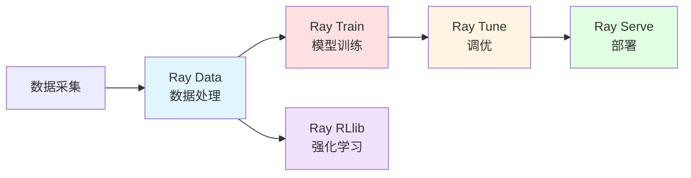

## Ray是什么

`Ray`是一个开源的分布式计算框架，由`UC Berkeley RISELab`开发，专为简化`Python`应用程序的分布式执行而设计。它提供了简单易用的`API`，让开发者能够轻松地将单机`Python`代码扩展到集群环境中运行。

**核心特点**：

- **简单易用**：通过`@ray.remote`装饰器即可将普通`Python`函数和类转换为分布式任务
- **通用性强**：不仅支持机器学习，还可用于数据处理、科学计算等多种场景
- **性能优越**：基于共享内存和零拷贝技术，实现高效的数据传输
- **生态丰富**：提供`Ray Train`（训练）、`Ray Data`（数据处理）、`Ray Serve`（模型服务）等完整的生态库

**通俗理解**：

`Ray`就像一个"任务分发器"。想象你有一家餐厅，原本只有一个厨师做菜，效率很低。使用`Ray`后，你可以轻松雇佣多个厨师，每个厨师负责不同的菜品，大家并行工作，效率成倍提升。而且，你不需要关心厨师之间如何协调，`Ray`会自动帮你管理。


## Ray解决什么问题

在`AI`模型训练和大规模数据处理场景中，开发者经常面临以下挑战：

### 单机资源瓶颈

当模型规模增大或数据量增加时，单台机器的`CPU`、`GPU`、内存等资源会成为瓶颈，导致训练时间过长甚至无法完成。

**传统方案的问题**：
- 手动编写分布式代码复杂度高，需要处理进程通信、数据同步等底层细节
- 不同框架的分布式实现方式各异，学习成本高
- 调试和监控困难，出问题难以定位

**Ray的解决方案**：
- 提供统一的分布式抽象，开发者只需添加几行代码即可实现分布式执行
- 自动处理任务调度、负载均衡和容错
- 内置监控面板，实时查看集群状态和任务执行情况

### 资源利用率低

在多`GPU`训练场景中，如果代码没有正确并行化，可能导致部分`GPU`空闲，资源浪费严重。

**Ray的解决方案**：
- 智能任务调度，根据资源可用性自动分配任务
- 支持细粒度的资源配置，可以指定每个任务需要的`CPU`、`GPU`、内存等
- 动态资源扩缩容，根据工作负载自动调整集群规模

### 代码维护困难

传统分布式代码往往需要大量样板代码，难以维护和迁移。

**Ray的解决方案**：
- 代码侵入性小，原有单机代码只需少量修改即可分布式运行
- 提供统一的编程接口，在本地和集群上运行体验一致
- 支持增量迁移，可以逐步将单机代码改造为分布式

## Ray的核心组件

`Ray`提供了从底层分布式计算到高层应用的完整技术栈，包括`Ray Core`作为基础层，以及构建在其上的各种高级库，形成了丰富的生态体系。

`Ray`各组件的定位和关系如下：

| 组件 | 层次 | 主要功能 | 适用人群 |
|------|------|---------|---------|
| **Ray Core** | 基础层 | 分布式计算原语（`Tasks`、`Actors`、`Objects`） | 需要自定义分布式应用的开发者 |
| **Ray Data** | 应用层 | 分布式数据处理和`ETL` | 数据工程师、`ML`工程师 |
| **Ray Train** | 应用层 | 分布式模型训练 | 机器学习工程师、研究员 |
| **Ray Tune** | 应用层 | 超参数调优和实验管理 | 机器学习工程师、研究员 |
| **Ray Serve** | 应用层 | 模型服务部署 | `ML`工程师、后端工程师 |
| **Ray RLlib** | 应用层 | 强化学习算法库 | 强化学习研究员、游戏`AI`开发者 |

这些组件可以独立使用，也可以组合使用，形成端到端的机器学习工作流：



### Ray Core - 分布式计算基础层

`Ray Core`是`Ray`的基础层，提供以下核心能力：

- **任务调度**：智能的分布式任务调度器
- **资源管理**：细粒度的`CPU`、`GPU`、内存资源分配
- **对象存储**：高效的分布式共享内存系统
- **容错机制**：自动故障检测和任务重试

**任务调度特性**：

| 特性 | 说明 | 优势 |
|------|------|------|
| **负载均衡** | 将任务均匀分配到各个节点 | 避免某些节点过载，提高资源利用率 |
| **数据本地性** | 优先将任务调度到数据所在节点 | 减少网络传输，提升性能 |
| **资源感知** | 根据任务的资源需求选择合适节点 | 确保任务有足够资源运行 |
| **容错处理** | 自动重试失败的任务 | 保证计算的可靠性 |

它通过三个核心原语（`Primitives`）构建了完整的分布式计算能力。

#### Tasks（任务）

**定义**：`Tasks`是`Ray`中最基本的并行执行单元，代表一个无状态的远程函数调用。

**特点**：
- 无状态：每次调用都是独立的，不保存任何状态
- 异步执行：调用后立即返回，不阻塞主程序
- 自动调度：`Ray`会自动选择空闲的节点执行

**代码示例**：

```python
import ray

# 初始化Ray
ray.init()

# 定义一个普通函数
@ray.remote
def square(x):
    return x * x

# 并行执行4个任务
futures = [square.remote(i) for i in range(4)]

# 获取结果
results = ray.get(futures)
print(results)  # [0, 1, 4, 9]
```

#### Actors（参与者）

**定义**：`Actors`是`Ray`中的有状态计算单元，它将`Python`类转换为分布式的长期运行进程。

**特点**：
- 有状态：可以在多次方法调用之间保持内部状态
- 独占进程：每个`Actor`实例运行在专属的工作进程中
- 串行执行：同一个`Actor`的方法调用按顺序执行，保证状态一致性

**代码示例**：

```python
import ray

@ray.remote
class Counter:
    def __init__(self):
        self.count = 0
    
    def increment(self, value):
        self.count += value
    
    def get_count(self):
        return self.count

# 创建Actor实例
counter = Counter.remote()

# 多次调用Actor方法
for _ in range(10):
    counter.increment.remote(1)

# 获取最终状态
result = ray.get(counter.get_count.remote())
print(result)  # 10
```

#### Objects（对象）

**定义**：`Objects`是`Ray`的分布式对象存储，用于在任务和`Actor`之间高效传递数据。

**特点**：
- 零拷贝：使用共享内存技术，避免数据序列化和拷贝的开销
- 自动管理：`Ray`自动处理对象的生命周期和垃圾回收
- 透明传递：对象引用可以在任务之间传递，数据在需要时才传输

**代码示例**：

```python
import ray
import numpy as np

@ray.remote
def process_matrix(matrix_ref):
    # 自动获取对象数据
    matrix = ray.get(matrix_ref)
    return np.sum(matrix)

# 将大对象存入对象存储
large_matrix = np.ones((1000, 1000))
matrix_ref = ray.put(large_matrix)

# 传递对象引用而非对象本身
result = ray.get(process_matrix.remote(matrix_ref))
print(result)  # 1000000.0
```

#### Ray集群（Ray Cluster）

`Ray`集群是`Ray`分布式计算的基础运行环境，由多个节点组成的分布式系统。

**集群架构**：

一个`Ray`集群由一个`Head`节点和任意数量的`Worker`节点组成：


**Head节点（主节点）**：

`Head`节点是集群的控制中心，它**具备`Worker`节点的所有职责**，并且**额外运行集群管理进程**。

| 职责类型 | 具体功能 | 说明 |
|---------|---------|------|
| **基础执行能力**<br/>（与`Worker`相同） | 运行`Raylet`进程 | 执行任务调度和分布式调度 |
| | 运行`Object Store` | 存储和分发`Ray`对象 |
| | 执行任务和`Actor` | 与`Worker`一样可以执行用户代码 |
| **管控能力**<br/>（`Head`特有） | `GCS`全局控制存储 | 管理集群元数据和状态信息 |
| | 自动伸缩器 | 根据资源需求动态增减`Worker`节点 |
| | `Dashboard` | 提供`Web`界面监控集群状态 |
| | `Driver`进程 | 运行`Ray Job`的主程序 |

**Worker节点（工作节点）**：

`Worker`节点专注于执行计算任务，**不运行任何集群管理进程**。

| 职责 | 功能描述 |
|------|----------|
| **任务执行** | 运行`Ray`任务和`Actor`中的用户代码 |
| **分布式调度** | 参与任务分配和负载均衡|
| **对象存储** | 存储和分发`Ray`对象到集群内存 |
| **资源共享** | 与其他节点协同完成分布式计算 |

**重要说明**：

:::tip Head节点与Worker节点的关系
- `Head`节点 = `Worker`节点的所有能力 + 集群管控能力
- `Ray`可以在`Head`节点上调度任务和`Actor`，就像在普通`Worker`节点上一样
- 在大型集群中，建议配置`Head`节点专注于管理，不执行计算密集型任务
:::


### Ray Data - 分布式数据处理

`Ray Data`是`Ray`生态中的数据处理库，提供了类似`Apache Spark`的分布式数据处理能力，但更适合机器学习工作负载。

**核心特性**：

- **流式处理**：支持大规模数据集的流式读取和处理
- **多格式支持**：支持`CSV`、`Parquet`、`JSON`、图片、视频等多种格式
- **与训练集成**：无缝对接`Ray Train`，实现数据预处理和训练的一体化
- **高性能**：针对`ML`工作负载优化，比传统数据处理框架更快

**代码示例**：

```python
import ray

# 创建分布式数据集
ds = ray.data.read_csv("s3://bucket/data.csv")

# 并行数据转换
ds = ds.map(lambda row: {"value": row["value"] * 2})

# 批量处理
ds = ds.map_batches(lambda batch: preprocess(batch))

# 写入结果
ds.write_parquet("s3://bucket/output")
```

### Ray Train - 分布式训练

`Ray Train`是`Ray`生态中的分布式训练库，简化了多框架的分布式训练实现。

**支持的框架**：

| 框架类别 | 支持的框架 |
|---------|-----------|
| **深度学习** | `PyTorch`、`TensorFlow`、`Keras` |
| **深度学习工具** | `PyTorch Lightning`、`Hugging Face Transformers`、`DeepSpeed`、`Horovod` |
| **传统机器学习** | `XGBoost`、`LightGBM` |

**核心优势**：

- **统一接口**：所有框架使用相同的`API`风格，降低学习成本
- **弹性训练**：支持容错和动态扩缩容
- **检查点管理**：自动保存和恢复训练状态
- **实验追踪**：内置指标记录和可视化

**代码示例**：

```python
from ray.train.torch import TorchTrainer
from ray.train import ScalingConfig

def train_func():
    # 训练代码
    pass

# 配置分布式训练
scaling_config = ScalingConfig(num_workers=4, use_gpu=True)
trainer = TorchTrainer(train_func, scaling_config=scaling_config)
result = trainer.fit()
```

### Ray Tune - 超参数调优

`Ray Tune`是业界领先的超参数调优库，支持多种搜索算法和早停策略，可以高效地找到最优的模型配置。

**支持的搜索算法**：

| 算法类型 | 具体算法 | 特点 |
|---------|---------|------|
| **基础搜索** | 网格搜索、随机搜索 | 简单易用，适合小规模搜索 |
| **贝叶斯优化** | `Optuna`、`HyperOpt` | 智能采样，适合昂贵的评估 |
| **进化算法** | `PBT(Population Based Training)` | 动态调整，适合长时间训练 |
| **早停策略** | `ASHA`、`Median Stopping` | 提前终止表现差的试验 |

**核心特性**：

- **并行搜索**：同时运行多个试验，充分利用集群资源
- **智能调度**：根据中间结果动态分配资源
- **实验管理**：自动记录所有试验的配置和结果
- **可视化**：通过`TensorBoard`等工具可视化搜索过程

**代码示例**：

```python
from ray import tune
from ray.tune.schedulers import ASHAScheduler

def train_model(config):
    # 使用config中的超参数训练模型
    for epoch in range(10):
        accuracy = train_epoch(config["lr"], config["batch_size"])
        tune.report(accuracy=accuracy)

# 配置搜索空间和调度器
tuner = tune.Tuner(
    train_model,
    tune_config=tune.TuneConfig(
        num_samples=100,
        scheduler=ASHAScheduler(metric="accuracy", mode="max")
    ),
    param_space={
        "lr": tune.loguniform(1e-4, 1e-1),
        "batch_size": tune.choice([32, 64, 128])
    }
)

results = tuner.fit()
print(f"Best config: {results.get_best_result().config}")
```


### Ray Serve - 模型服务部署

`Ray Serve`是`Ray`生态中的模型服务框架，用于将训练好的模型部署为高性能、可扩展的在线服务。

**核心特性**：

- **多模型部署**：在同一集群中部署多个不同的模型
- **动态扩缩容**：根据请求负载自动调整服务副本数
- **模型组合**：支持模型链式调用和复杂的推理流水线
- **框架无关**：支持任何`Python`模型（`PyTorch`、`TensorFlow`、`Scikit-learn`等）

**代码示例**：

```python
from ray import serve
import torch

@serve.deployment(num_replicas=2)
class TextClassifier:
    def __init__(self):
        self.model = torch.load("model.pt")
    
    async def __call__(self, request):
        text = await request.json()
        prediction = self.model(text["input"])
        return {"result": prediction.tolist()}

# 部署服务
serve.run(TextClassifier.bind(), route_prefix="/classify")
```

**高级特性**：

```python
# 模型组合和流水线
@serve.deployment
class Preprocessor:
    def process(self, text):
        return tokenize(text)

@serve.deployment
class Model:
    def __init__(self, preprocessor):
        self.preprocessor = preprocessor
        self.model = load_model()
    
    async def __call__(self, request):
        text = await request.json()
        tokens = self.preprocessor.process.remote(text)
        prediction = self.model(await tokens)
        return {"prediction": prediction}

# 部署带依赖的服务
preprocessor = Preprocessor.bind()
model = Model.bind(preprocessor)
serve.run(model)
```

### Ray RLlib - 强化学习

`Ray RLlib`是`Ray`生态中的强化学习库，提供了工业级的强化学习算法实现和训练框架。

**支持的算法**：

| 算法类别 | 具体算法 |
|---------|---------|
| **策略梯度** | `PPO`、`A3C`、`A2C`、`IMPALA` |
| **Q学习** | `DQN`、`Rainbow`、`APEX-DQN` |
| **Actor-Critic** | `SAC`、`TD3`、`DDPG` |
| **模型based** | `Dreamer`、`MBMPO` |
| **多智能体** | `QMIX`、`MADDPG` |

**核心特性**：

- **分布式训练**：支持大规模并行采样和训练
- **环境支持**：兼容`Gym`、`Unity ML-Agents`等主流环境
- **算法库丰富**：内置数十种经典和前沿算法
- **可定制性强**：支持自定义环境、模型、策略

**代码示例**：

```python
from ray.rllib.algorithms.ppo import PPOConfig

# 配置PPO算法
config = (
    PPOConfig()
    .environment("CartPole-v1")
    .framework("torch")
    .training(
        lr=0.0001,
        num_sgd_iter=10,
        train_batch_size=4000
    )
    .resources(num_gpus=1)
    .rollouts(num_rollout_workers=4)
)

# 创建并训练算法
algo = config.build()

for i in range(10):
    result = algo.train()
    print(f"Iteration {i}: reward={result['episode_reward_mean']}")

# 保存模型
algo.save("checkpoint")
```

## Ray与PyTorch的区别

很多人会混淆`Ray`和`PyTorch`，认为它们是竞争关系。实际上，它们是**互补关系**，各自解决不同层次的问题。

### 本质区别

| 维度 | PyTorch | Ray |
|------|---------|-----|
| **定位** | 深度学习框架 | 分布式计算框架 |
| **核心功能** | 构建和训练神经网络 | 分布式任务调度和资源管理 |
| **抽象层次** | 张量计算、自动求导 | 任务并行、数据共享、集群管理 |
| **应用范围** | 主要用于深度学习 | 通用分布式计算（包括深度学习） |
| **使用方式** | 定义模型、前向传播、反向传播 | 定义分布式任务和参与者 |

**通俗类比**：
- **PyTorch**：就像一个"厨师"，专门负责做菜（训练模型）
- **Ray**：就像一个"餐厅管理系统"，负责调度多个厨师、分配任务、管理资源

### 协作关系

`Ray`和`PyTorch`通常一起使用，形成完整的分布式训练解决方案：

```python
import torch
import ray
from ray.train.torch import TorchTrainer

# PyTorch负责定义模型和训练逻辑
def train_func():
    model = torch.nn.Linear(10, 1)
    optimizer = torch.optim.SGD(model.parameters(), lr=0.01)
    
    # 使用Ray的API进行分布式训练
    model = ray.train.torch.prepare_model(model)
    
    for epoch in range(10):
        # PyTorch的训练逻辑
        loss = train_one_epoch(model, optimizer)
        # Ray负责收集和同步结果
        ray.train.report({"loss": loss})

# Ray负责分布式调度
scaling_config = ray.train.ScalingConfig(num_workers=4, use_gpu=True)
trainer = TorchTrainer(train_func, scaling_config=scaling_config)
result = trainer.fit()
```

### 如何选择

何时使用`PyTorch`分布式，何时使用`Ray`？

- 团队已熟悉`PyTorch`的分布式`API`
- 主要在同构集群上运行（所有节点配置相同）

**使用Ray + PyTorch的场景**：
- 需要同时进行训练、推理、数据处理等多种任务
- 需要动态调整集群规模（自动扩缩容）
- 需要在异构集群上运行（不同节点有不同的硬件配置）
- 需要与其他`Python`库（如`Pandas`、`NumPy`）深度集成
- 需要统一的分布式抽象，便于代码维护

## Ray在AI模型训练场景中的应用

`Ray Train`是`Ray`生态中专门为机器学习训练设计的库，它简化了分布式训练的实现，让开发者可以专注于模型本身，而不用担心分布式的复杂性。

### 分布式数据并行训练

**应用场景**：当单个`GPU`无法容纳足够大的`batch size`，或者希望加速训练时，可以使用多个`GPU`并行训练。

**工作原理**：
1. 每个`worker`持有完整的模型副本
2. 数据集被自动分片，每个`worker`处理不同的数据子集
3. 各`worker`独立计算梯度
4. 通过`All-Reduce`算法同步梯度
5. 所有`worker`使用相同的梯度更新模型参数

**代码示例**：

```python
import torch
from torch import nn
from ray.train.torch import TorchTrainer
from ray.train import ScalingConfig
import ray.train.torch

def train_func():
    # 定义模型
    model = nn.Linear(128, 10)
    # Ray自动处理设备放置和DDP包装
    model = ray.train.torch.prepare_model(model)
    
    optimizer = torch.optim.Adam(model.parameters())
    loss_fn = nn.CrossEntropyLoss()
    
    # 准备数据加载器
    train_loader = torch.utils.data.DataLoader(...)
    train_loader = ray.train.torch.prepare_data_loader(train_loader)
    
    # 训练循环
    for epoch in range(10):
        for batch in train_loader:
            loss = train_one_batch(model, batch, loss_fn, optimizer)
        
        # 报告指标
        ray.train.report({"loss": loss.item(), "epoch": epoch})

# 配置4个GPU worker
scaling_config = ScalingConfig(num_workers=4, use_gpu=True)
trainer = TorchTrainer(train_func, scaling_config=scaling_config)
result = trainer.fit()
```

**优势**：
- 代码改动最小，只需添加几行`Ray API`调用
- 自动处理进程组初始化和设备管理
- 内置容错机制，训练失败时自动重试

### 大模型训练

**应用场景**：当模型参数量超过单个`GPU`显存容量时（如`GPT`、`LLaMA`等大语言模型），需要将模型切分到多个`GPU`上。

**支持的策略**：

| 并行策略 | 说明 | 适用场景 |
|---------|------|---------|
| **Pipeline Parallelism**<br/>流水线并行 | 将模型按层切分到不同`GPU` | 模型层数多，单层显存占用不大 |
| **Tensor Parallelism**<br/>张量并行 | 将模型的每一层切分到不同`GPU` | 单层参数量大，需要细粒度切分 |
| **Fully Sharded Data Parallel (FSDP)** | 将模型参数、梯度、优化器状态切分到不同`GPU` | 超大模型训练，需要最大化显存利用 |

**与DeepSpeed和Megatron集成**：

```python
from ray.train.torch import TorchTrainer
from ray.train import ScalingConfig, RunConfig

def train_func():
    import deepspeed
    
    model = ...  # 大模型定义
    
    # 使用DeepSpeed进行模型并行
    model_engine, optimizer, _, _ = deepspeed.initialize(
        model=model,
        config={
            "train_batch_size": 64,
            "fp16": {"enabled": True},
            "zero_optimization": {"stage": 3}
        }
    )
    
    # 训练循环
    for batch in train_loader:
        loss = model_engine(batch)
        model_engine.backward(loss)
        model_engine.step()
        
        ray.train.report({"loss": loss.item()})

# 配置多节点训练
scaling_config = ScalingConfig(
    num_workers=16,  # 跨4个节点，每节点4个GPU
    use_gpu=True,
    resources_per_worker={"GPU": 1, "CPU": 8}
)

trainer = TorchTrainer(
    train_func,
    scaling_config=scaling_config,
    run_config=RunConfig(storage_path="s3://bucket/checkpoints")
)
result = trainer.fit()
```

**优势**：
- 无缝集成`DeepSpeed`、`Megatron-LM`等主流大模型训练框架
- 统一的分布式抽象，简化多节点训练配置
- 自动管理检查点存储和恢复

### 超参数调优

**应用场景**：需要测试多组超参数，找到最优配置。

**代码示例**：

```python
from ray import tune
from ray.train.torch import TorchTrainer
from ray.train import ScalingConfig

def train_func(config):
    model = build_model(config["hidden_size"], config["num_layers"])
    optimizer = torch.optim.Adam(model.parameters(), lr=config["lr"])
    
    for epoch in range(10):
        loss = train_epoch(model, optimizer)
        ray.train.report({"loss": loss})

# 定义搜索空间
param_space = {
    "train_loop_config": {
        "lr": tune.loguniform(1e-5, 1e-2),
        "hidden_size": tune.choice([256, 512, 1024]),
        "num_layers": tune.choice([4, 8, 12])
    }
}

# 并行搜索
tuner = tune.Tuner(
    TorchTrainer(
        train_func,
        scaling_config=ScalingConfig(num_workers=2, use_gpu=True)
    ),
    param_space=param_space,
    tune_config=tune.TuneConfig(num_samples=20)
)

results = tuner.fit()
best_result = results.get_best_result(metric="loss", mode="min")
print(f"Best config: {best_result.config}")
```

### 分布式批量推理

**应用场景**：对大量样本进行模型推理，充分利用多`GPU`资源。

**代码示例**：

```python
import ray
import numpy as np

# 创建数据集
ds = ray.data.from_numpy(np.array(["text1", "text2", ...]))

# 定义推理类
class ModelPredictor:
    def __init__(self):
        self.model = load_model()  # 加载模型
    
    def __call__(self, batch):
        predictions = self.model(batch["data"])
        batch["output"] = predictions
        return batch

# 并行推理，使用2个GPU
predictions = ds.map_batches(
    ModelPredictor,
    compute=ray.data.ActorPoolStrategy(size=2),
    num_gpus=1
)

# 获取结果
predictions.show(limit=10)
```

## 参考资料

- https://github.com/ray-project/ray
- https://docs.ray.io/en/latest/index.html
- https://docs.rayai.org.cn/en/latest/index.html