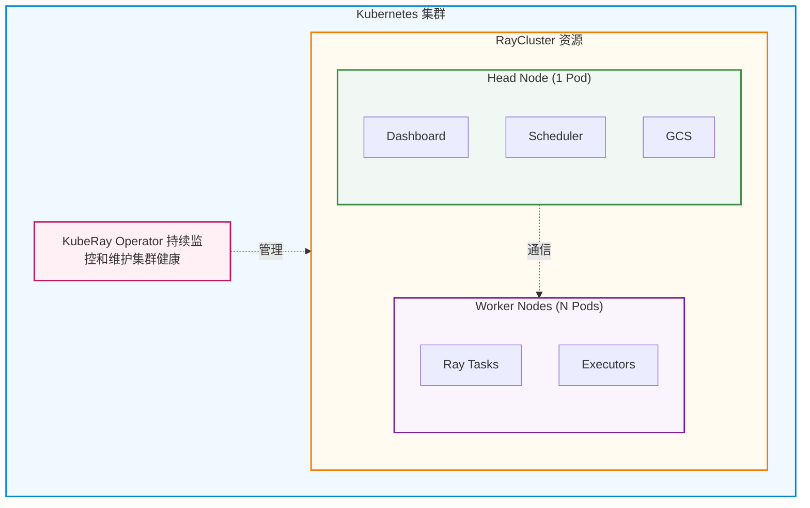
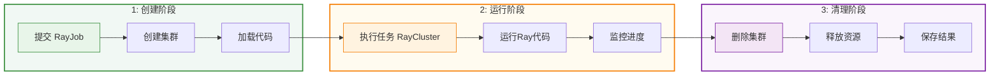
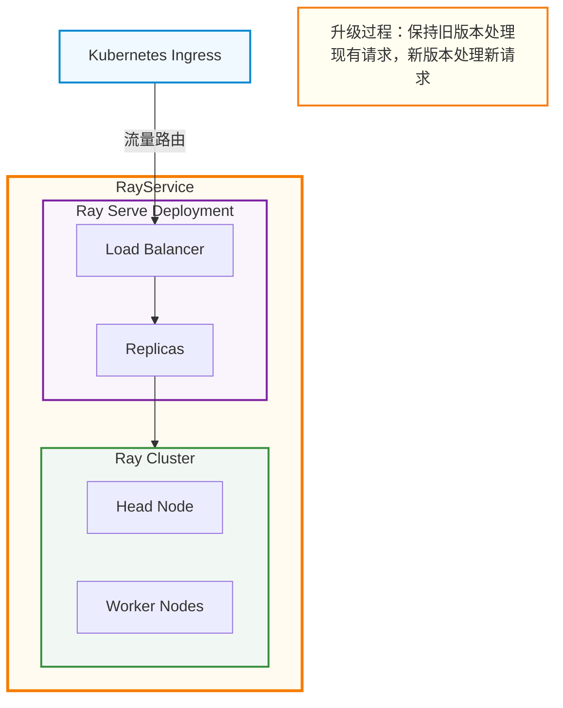

## KubeRay基本介绍

### 什么是KubeRay

`KubeRay`是一个强大的开源`Kubernetes Operator`，用于简化`Ray`应用在`Kubernetes`上的部署和管理。`Ray`是一个用于构建和运行分布式应用程序的统一框架，特别适合机器学习工作负载，而`KubeRay`则将`Ray`的强大能力与`Kubernetes`的云原生特性完美结合。

**通俗理解**：如果把`Ray`比作一个强大的分布式计算引擎，那么`KubeRay`就是让这个引擎能够在`Kubernetes`这个云原生平台上平稳运行的"管家"。它负责自动创建、管理和维护`Ray`集群，让开发者可以专注于编写分布式应用代码，而无需担心底层的集群管理问题。

### KubeRay解决的核心问题

在`Kubernetes`上运行`Ray`应用面临诸多挑战，`KubeRay`主要解决以下问题：

| 问题领域 | 具体挑战 | KubeRay解决方案 |
|---------|---------|----------------|
| **集群生命周期管理** | 手动创建和维护`Ray`集群复杂且易出错 | 自动化集群创建、删除和更新流程 |
| **资源调度** | `Ray`节点与`Kubernetes Pod`的资源协调困难 | 无缝集成`Kubernetes`资源调度系统 |
| **弹性伸缩** | 根据工作负载动态调整集群规模困难 | 内置自动伸缩功能，支持节点动态增减 |
| **容错能力** | 节点故障时手动恢复集群耗时费力 | 自动故障检测和恢复机制 |
| **任务管理** | 提交和监控`Ray`任务需要额外工具 | 提供声明式`API`简化任务提交和管理 |
| **服务部署** | 部署和维护`Ray Serve`服务复杂 | 支持零停机升级和高可用服务部署 |

### KubeRay核心组件

`KubeRay`提供了三个核心自定义资源定义（`CRD`），每个都针对不同的使用场景：

#### RayCluster

**用途**：管理长期运行的`Ray`集群。

**核心特性**：
- **完整的生命周期管理**：自动处理集群的创建、删除和更新
- **自动伸缩**：根据工作负载自动增加或减少工作节点
- **容错保障**：自动检测和恢复故障节点，确保集群稳定运行
- **资源隔离**：支持多租户场景，不同用户可以拥有独立的`Ray`集群

**核心节点**：

一个`RayCluster`由两类节点组成，它们各司其职、协同工作：

| 节点类型 | 数量 | 核心职责 | 主要功能 |
|---------|------|---------|---------|
| **Head Node** | 固定`1`个 | 集群控制中心 | - 运行`GCS`（全局控制存储）管理集群元数据<br/> - 提供`Dashboard`监控界面<br/> - 执行任务调度和资源分配<br/>- 作为集群入口接收任务提交 |
| **Worker Nodes** | 可伸缩（`N`个） | 任务执行节点 | - 执行具体的计算任务<br/> - 存储任务数据和中间结果<br/>- 响应`Head`节点的调度指令<br/>- 支持动态扩缩容 |

- `Head Node`是集群的单点，但`KubeRay`会自动监控并在故障时重启
- `Worker Nodes`可以根据工作负载自动扩缩容，提高资源利用率
- 所有节点之间通过高效的通信协议保持数据同步

**适用场景**：
- 需要长期运行的交互式开发环境
- 多个用户共享的`Ray`集群
- 需要频繁提交不同任务的场景

**工作原理**：



#### RayJob

**用途**：自动创建`Ray`集群并提交一次性批处理任务。

**核心特性**：
- **自动化工作流**：创建集群、提交任务、清理资源一气呵成
- **任务隔离**：每个任务可以拥有独立的集群配置
- **资源优化**：任务完成后可自动删除集群，节省资源
- **状态跟踪**：实时监控任务执行状态和结果

**适用场景**：
- 一次性的批处理任务（如数据处理、模型训练）
- `CI/CD`流程中的自动化测试
- 定期执行的批量推理任务

**工作原理**：



#### RayService

**用途**：部署和管理生产级的`Ray Serve`应用。

**核心特性**：
- **零停机升级**：更新服务时不中断现有请求
- **高可用性**：支持多副本部署和自动故障转移
- **流量管理**：智能路由和负载均衡
- **版本控制**：支持蓝绿部署和金丝雀发布

**适用场景**：
- 在线推理服务（如模型`API`）
- 实时数据处理服务
- 需要高可用性的生产环境

**工作原理**：



### KubeRay核心功能

除了三大核心组件，`KubeRay`还提供以下重要功能：

#### 自动伸缩

`KubeRay`支持基于资源利用率和任务需求的自动伸缩：

| 伸缩类型 | 触发条件 | 行为描述 |
|---------|---------|---------|
| **扩容** | 任务队列积压或资源不足 | 自动创建新的工作节点`Pod` |
| **缩容** | 节点空闲超过阈值时间 | 优雅关闭空闲节点，释放资源 |
| **手动伸缩** | 用户更新`replicas`配置 | 根据配置增加或减少节点数量 |

#### 容错与高可用

`KubeRay`内置多层容错机制：

- **节点级容错**：自动检测和重启失败的`Pod`
- **集群级容错**：`Head`节点故障时自动恢复集群状态
- **任务级容错**：支持任务重试和断点续传
- **数据持久化**：可选的状态持久化到外部存储

#### 与Kubernetes生态集成

`KubeRay`深度集成`Kubernetes`生态系统：

- **监控**：兼容`Prometheus`和`Grafana`
- **日志**：集成标准`Kubernetes`日志系统
- **调度**：支持`Volcano`、`YuniKorn`、`Kueue`等调度器
- **网络**：兼容各类`Ingress Controller`
- **存储**：支持`PersistentVolume`持久化存储

## KubeRay安装与配置

### 前置要求

在安装`KubeRay`之前，请确保满足以下条件：

| 组件 | 最低版本要求 | 说明 |
|------|-------------|------|
| **Kubernetes** | `v1.23.0+` | 需要支持`CRD`和`Operator`特性 |
| **kubectl** | `v1.23.0+` | 用于操作`Kubernetes`集群 |
| **Helm** | `v3.0+` | 用于安装`KubeRay Operator` |
| **容器运行时** | `Docker 19.03+` 或 `containerd` | 用于运行容器 |

**资源建议**：
- 开发环境：至少`2`核`CPU`，`4GB`内存
- 生产环境：根据工作负载规模调整，建议预留充足资源

### 通过Helm安装KubeRay Operator

`Helm`是安装`KubeRay`的推荐方式，步骤如下：

#### 安装稳定版本

```bash
# 添加 KubeRay Helm 仓库
helm repo add kuberay https://ray-project.github.io/kuberay-helm/

# 更新仓库信息
helm repo update

# 安装 KubeRay Operator（包含 CRD 和 Operator）
helm install kuberay-operator kuberay/kuberay-operator --version 1.1.0

# 验证安装，检查 Operator Pod 状态
kubectl get pods
# 期望输出类似：
# NAME                                READY   STATUS    RESTARTS   AGE
# kuberay-operator-6fcbb94f64-mbfnr   1/1     Running   0          30s
```

#### 安装最新开发版本

如果需要体验最新特性，可以从源码安装：

```bash
# 克隆 KubeRay 仓库
git clone https://github.com/ray-project/kuberay.git
cd kuberay

# 从本地 Helm Chart 安装
helm install kuberay-operator ./helm-chart/kuberay-operator
```

#### 自定义安装选项

`KubeRay Operator`支持多种自定义配置：

```bash
# 安装到指定命名空间
helm install kuberay-operator kuberay/kuberay-operator \
  --namespace kuberay-system \
  --create-namespace

# 自定义 Operator 资源配置
helm install kuberay-operator kuberay/kuberay-operator \
  --set operatorResources.limits.cpu=500m \
  --set operatorResources.limits.memory=512Mi

# 启用 Webhook（用于资源验证）
helm install kuberay-operator kuberay/kuberay-operator \
  --set webhooks.enabled=true
```


### 验证安装

安装完成后，验证`KubeRay`是否正常工作：

```bash
# 检查 Operator Pod 状态
kubectl get pods -n default
# 应该看到 kuberay-operator Pod 处于 Running 状态

# 检查 CRD 是否已安装
kubectl get crd | grep ray
# 期望输出：
# rayclusters.ray.io
# rayjobs.ray.io
# rayservices.ray.io

# 查看 Operator 日志
kubectl logs -l app.kubernetes.io/name=kuberay-operator
# 应该看到类似 "Starting controller" 的日志
```

### 卸载KubeRay

如需卸载`KubeRay`：

```bash
# 卸载 Operator
helm uninstall kuberay-operator

# 删除 CRD（注意：这会删除所有相关资源）
kubectl delete crd rayclusters.ray.io
kubectl delete crd rayjobs.ray.io
kubectl delete crd rayservices.ray.io

# 或者使用 kustomize 删除
kubectl delete -k "github.com/ray-project/kuberay/ray-operator/config/crd?ref=v1.1.0"
```

:::warning 注意
删除`CRD`会同时删除所有基于该`CRD`创建的资源实例（如`RayCluster`、`RayJob`等），请谨慎操作。
:::

## KubeRay快速上手示例

本节通过一个完整的示例，演示如何使用`KubeRay`创建集群并运行一个简单的`Ray`任务。

### 创建RayCluster并交互式使用

这个示例展示如何创建一个基本的`RayCluster`，然后连接到集群执行简单的分布式计算。

#### 创建RayCluster

首先创建一个`RayCluster`资源定义文件：

```yaml title="ray-cluster-simple.yaml"
apiVersion: ray.io/v1
kind: RayCluster
metadata:
  name: ray-cluster-simple
spec:
  # Ray 版本
  rayVersion: '2.52.0'
  
  # Head 节点配置
  headGroupSpec:
    # Ray 启动参数
    rayStartParams:
      dashboard-host: '0.0.0.0'
    # Pod 模板
    template:
      spec:
        containers:
        - name: ray-head
          image: rayproject/ray:2.52.0
          ports:
          - containerPort: 6379
            name: gcs
          - containerPort: 8265
            name: dashboard
          - containerPort: 10001
            name: client
          resources:
            limits:
              cpu: "1"
              memory: "2Gi"
            requests:
              cpu: "500m"
              memory: "1Gi"
  
  # Worker 节点配置
  workerGroupSpecs:
  - replicas: 2
    minReplicas: 1
    maxReplicas: 5
    groupName: small-group
    rayStartParams: {}
    template:
      spec:
        containers:
        - name: ray-worker
          image: rayproject/ray:2.52.0
          resources:
            limits:
              cpu: "1"
              memory: "1Gi"
            requests:
              cpu: "500m"
              memory: "512Mi"
```

应用这个配置文件：

```bash
# 创建 RayCluster
kubectl apply -f ray-cluster-simple.yaml

# 查看集群状态
kubectl get raycluster
# 期望输出：
# NAME                 DESIRED WORKERS   AVAILABLE WORKERS   STATUS   AGE
# ray-cluster-simple   2                 2                   ready    1m

# 查看所有 Ray Pods
kubectl get pods -l ray.io/cluster=ray-cluster-simple
# 期望输出：
# NAME                                          READY   STATUS    RESTARTS   AGE
# ray-cluster-simple-head-xxxxx                 1/1     Running   0          1m
# ray-cluster-simple-worker-small-group-xxxxx   1/1     Running   0          1m
# ray-cluster-simple-worker-small-group-yyyyy   1/1     Running   0          1m
```

#### 连接并使用集群

连接到`Ray`集群执行分布式任务：

```bash
# 方法1：直接在 Head Pod 中执行
kubectl exec -it $(kubectl get pod -l ray.io/node-type=head,ray.io/cluster=ray-cluster-simple -o jsonpath='{.items[0].metadata.name}') -- python3 -c "
import ray
ray.init()

# 定义一个简单的远程函数
@ray.remote
def hello_world(name):
    return f'Hello {name} from Ray!'

# 并行执行
futures = [hello_world.remote(f'Worker-{i}') for i in range(10)]
results = ray.get(futures)
print(results)

# 查看集群信息
print(f'Available resources: {ray.available_resources()}')
"
```

#### 访问Ray Dashboard

`Ray Dashboard`提供了集群监控和任务管理界面：

```bash
# 端口转发到本地
kubectl port-forward service/ray-cluster-simple-head-svc 8265:8265

# 在浏览器中打开
# http://localhost:8265
```

在`Dashboard`中可以查看：
- 集群资源使用情况
- 运行中的任务
- 日志和性能指标

### 使用RayJob运行批处理任务

这个示例展示如何使用`RayJob`自动创建集群、执行任务并清理资源。

#### 准备Python代码

首先创建一个`ConfigMap`来存储要执行的`Python`代码：

```yaml title="ray-job-code.yaml"
apiVersion: v1
kind: ConfigMap
metadata:
  name: ray-job-code-sample
data:
  sample_code.py: |
    import ray
    import time
    
    # 初始化 Ray
    ray.init()
    
    # 定义计算密集型任务
    @ray.remote
    def compute_pi(num_samples):
        import random
        count = 0
        for _ in range(num_samples):
            x, y = random.random(), random.random()
            if x*x + y*y <= 1:
                count += 1
        return count
    
    # 分布式计算 π 值
    print("Starting distributed computation of Pi...")
    num_tasks = 100
    num_samples_per_task = 1_000_000
    
    start_time = time.time()
    futures = [compute_pi.remote(num_samples_per_task) for _ in range(num_tasks)]
    results = ray.get(futures)
    
    total_count = sum(results)
    total_samples = num_tasks * num_samples_per_task
    pi_estimate = 4 * total_count / total_samples
    
    elapsed_time = time.time() - start_time
    
    print(f"Estimated Pi: {pi_estimate}")
    print(f"Computation time: {elapsed_time:.2f} seconds")
    print(f"Tasks completed: {num_tasks}")
    print("Job completed successfully!")
```

应用这个配置：

```bash
kubectl apply -f ray-job-code.yaml
```

#### 创建RayJob

创建`RayJob`资源定义：

```yaml title="ray-job-sample.yaml"
apiVersion: ray.io/v1
kind: RayJob
metadata:
  name: rayjob-sample
spec:
  # 指定要执行的 Python 脚本
  entrypoint: python /home/ray/samples/sample_code.py
  
  # 任务完成后自动删除集群
  shutdownAfterJobFinishes: true
  
  # 任务完成后等待10秒再删除集群（便于查看日志）
  ttlSecondsAfterFinished: 10
  
  # 运行时环境配置
  runtimeEnvYAML: |
    pip:
      - requests==2.26.0
    env_vars:
      LOG_LEVEL: "INFO"
  
  # RayCluster 配置
  rayClusterSpec:
    rayVersion: '2.52.0'
    
    # Head 节点配置
    headGroupSpec:
      rayStartParams: {}
      template:
        spec:
          containers:
          - name: ray-head
            image: rayproject/ray:2.52.0
            ports:
            - containerPort: 6379
              name: gcs-server
            - containerPort: 8265
              name: dashboard
            - containerPort: 10001
              name: client
            resources:
              limits:
                cpu: "1"
                memory: "2Gi"
              requests:
                cpu: "500m"
                memory: "1Gi"
            # 挂载代码
            volumeMounts:
            - mountPath: /home/ray/samples
              name: code-sample
          volumes:
          - name: code-sample
            configMap:
              name: ray-job-code-sample
              items:
              - key: sample_code.py
                path: sample_code.py
    
    # Worker 节点配置
    workerGroupSpecs:
    - replicas: 2
      minReplicas: 1
      maxReplicas: 5
      groupName: worker-group
      rayStartParams: {}
      template:
        spec:
          containers:
          - name: ray-worker
            image: rayproject/ray:2.52.0
            resources:
              limits:
                cpu: "1"
                memory: "1Gi"
              requests:
                cpu: "500m"
                memory: "512Mi"
```

提交并监控任务：

```bash
# 提交 RayJob
kubectl apply -f ray-job-sample.yaml

# 查看 RayJob 状态
kubectl get rayjob rayjob-sample
# 期望输出：
# NAME            JOB STATUS   DEPLOYMENT STATUS   START TIME   END TIME   AGE
# rayjob-sample   RUNNING      Running             1m                      1m

# 查看任务日志
kubectl logs -l ray.io/cluster=rayjob-sample-raycluster -c ray-head

# 监控任务进度（持续查看）
kubectl get rayjob rayjob-sample -w

# 任务完成后查看最终状态
kubectl get rayjob rayjob-sample
# 期望输出：
# NAME            JOB STATUS   DEPLOYMENT STATUS   START TIME   END TIME   AGE
# rayjob-sample   SUCCEEDED    Complete            5m           4m         5m
```

#### 查看任务结果

```bash
# 查看任务执行日志
kubectl logs -l ray.io/cluster=rayjob-sample-raycluster -c ray-head --tail=50

# 期望看到类似输出：
# Starting distributed computation of Pi...
# Estimated Pi: 3.14159...
# Computation time: 12.34 seconds
# Tasks completed: 100
# Job completed successfully!
```

### 部署RayService在线推理服务

这个示例展示如何使用`RayService`部署一个简单的模型推理服务。

创建一个提供简单文本处理的`RayService`：

```yaml title="ray-service-sample.yaml"
apiVersion: ray.io/v1
kind: RayService
metadata:
  name: rayservice-sample
spec:
  # Service 配置
  serviceUnhealthySecondThreshold: 300
  deploymentUnhealthySecondThreshold: 300
  
  # Serve 应用配置
  serveConfigV2: |
    applications:
    - name: text_processor
      import_path: text_app:deployment
      runtime_env:
        working_dir: "https://github.com/ray-project/test_deploy_group/archive/refs/heads/serve_config_deployment_test.zip"
  
  # RayCluster 配置
  rayClusterSpec:
    rayVersion: '2.52.0'
    
    # Head 节点
    headGroupSpec:
      rayStartParams:
        dashboard-host: '0.0.0.0'
        num-cpus: '0'
      template:
        spec:
          containers:
          - name: ray-head
            image: rayproject/ray:2.52.0
            ports:
            - containerPort: 6379
              name: gcs
            - containerPort: 8265
              name: dashboard
            - containerPort: 10001
              name: client
            - containerPort: 8000
              name: serve
            resources:
              limits:
                cpu: "2"
                memory: "4Gi"
              requests:
                cpu: "1"
                memory: "2Gi"
    
    # Worker 节点
    workerGroupSpecs:
    - replicas: 1
      minReplicas: 1
      maxReplicas: 5
      groupName: serve-group
      rayStartParams: {}
      template:
        spec:
          containers:
          - name: ray-worker
            image: rayproject/ray:2.52.0
            resources:
              limits:
                cpu: "2"
                memory: "2Gi"
              requests:
                cpu: "1"
                memory: "1Gi"
```

部署和测试服务：

```bash
# 部署 RayService
kubectl apply -f ray-service-sample.yaml

# 查看服务状态
kubectl get rayservice rayservice-sample
# 期望输出：
# NAME                SERVICE STATUS   NUM SERVE ENDPOINTS
# rayservice-sample   Running          1

# 端口转发到本地
kubectl port-forward service/rayservice-sample-serve-svc 8000:8000

# 测试服务（在另一个终端）
curl -X POST http://localhost:8000/ -H "Content-Type: application/json" -d '{"text": "Hello Ray"}'
```

### 清理资源

完成实验后，清理创建的资源：

```bash
# 删除 RayCluster
kubectl delete raycluster ray-cluster-simple

# RayJob 通常会自动清理，但如果需要手动删除：
kubectl delete rayjob rayjob-sample

# 删除 RayService
kubectl delete rayservice rayservice-sample

# 删除 ConfigMap
kubectl delete configmap ray-job-code-sample
```


## 参考资料

- [KubeRay GitHub 仓库](https://github.com/ray-project/kuberay)
- [KubeRay 官方文档](https://docs.ray.io/en/latest/cluster/kubernetes/index.html)
- [Ray 官方文档](https://docs.ray.io/)
- [Kubernetes 官方文档](https://kubernetes.io/docs/)
