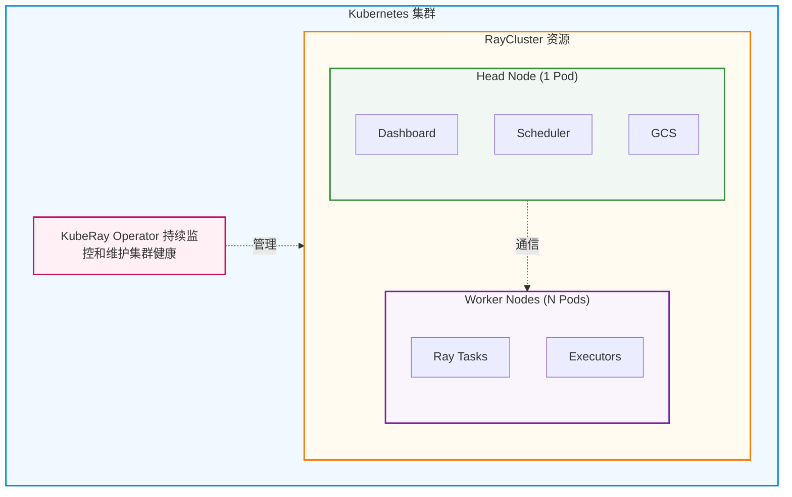
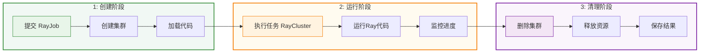
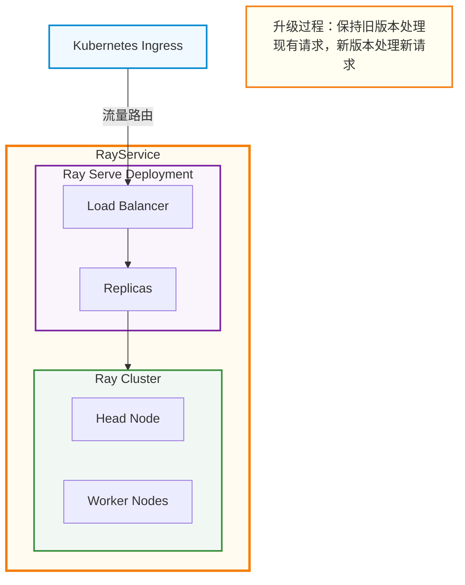

## KubeRay基本介绍

### 什么是KubeRay

`KubeRay`是一个强大的开源`Kubernetes Operator`，用于简化`Ray`应用在`Kubernetes`上的部署和管理。`Ray`是一个用于构建和运行分布式应用程序的统一框架，特别适合机器学习工作负载，而`KubeRay`则将`Ray`的强大能力与`Kubernetes`的云原生特性完美结合。

**通俗理解**：如果把`Ray`比作一个强大的分布式计算引擎，那么`KubeRay`就是让这个引擎能够在`Kubernetes`这个云原生平台上平稳运行的"管家"。它负责自动创建、管理和维护`Ray`集群，让开发者可以专注于编写分布式应用代码，而无需担心底层的集群管理问题。

### KubeRay解决的核心问题

在`Kubernetes`上运行`Ray`应用面临诸多挑战，`KubeRay`主要解决以下问题：

| 问题领域 | 具体挑战 | KubeRay解决方案 |
|---------|---------|----------------|
| **集群生命周期管理** | 手动创建和维护`Ray`集群复杂且易出错 | 自动化集群创建、删除和更新流程 |
| **资源调度** | `Ray`节点与`Kubernetes Pod`的资源协调困难 | 无缝集成`Kubernetes`资源调度系统 |
| **弹性伸缩** | 根据工作负载动态调整集群规模困难 | 内置自动伸缩功能，支持节点动态增减 |
| **容错能力** | 节点故障时手动恢复集群耗时费力 | 自动故障检测和恢复机制 |
| **任务管理** | 提交和监控`Ray`任务需要额外工具 | 提供声明式`API`简化任务提交和管理 |
| **服务部署** | 部署和维护`Ray Serve`服务复杂 | 支持零停机升级和高可用服务部署 |

### KubeRay核心组件

`KubeRay`提供了三个核心自定义资源定义（`CRD`），每个都针对不同的使用场景：

#### RayCluster

**用途**：管理长期运行的`Ray`集群。

**核心特性**：
- **完整的生命周期管理**：自动处理集群的创建、删除和更新
- **自动伸缩**：根据工作负载自动增加或减少工作节点
- **容错保障**：自动检测和恢复故障节点，确保集群稳定运行
- **资源隔离**：支持多租户场景，不同用户可以拥有独立的`Ray`集群

:::tip Ray集群架构
关于`Ray`集群中`Head Node`和`Worker Node`的详细职责和架构说明，请参考：[Ray分布式计算引擎介绍 - Ray集群](./1000-Ray分布式计算引擎介绍.md#ray集群ray-cluster)
:::

**适用场景**：
- 需要长期运行的交互式开发环境
- 多个用户共享的`Ray`集群
- 需要频繁提交不同任务的场景

**工作原理**：



#### RayJob

**用途**：自动创建`Ray`集群并提交一次性批处理任务。

**核心特性**：
- **自动化工作流**：创建集群、提交任务、清理资源一气呵成
- **任务隔离**：每个任务可以拥有独立的集群配置
- **资源优化**：任务完成后可自动删除集群，节省资源
- **状态跟踪**：实时监控任务执行状态和结果

**适用场景**：
- 一次性的批处理任务（如数据处理、模型训练）
- `CI/CD`流程中的自动化测试
- 定期执行的批量推理任务

**工作原理**：



#### RayService

**用途**：部署和管理生产级的`Ray Serve`应用。

**核心特性**：
- **零停机升级**：更新服务时不中断现有请求
- **高可用性**：支持多副本部署和自动故障转移
- **流量管理**：智能路由和负载均衡
- **版本控制**：支持蓝绿部署和金丝雀发布

**适用场景**：
- 在线推理服务（如模型`API`）
- 实时数据处理服务
- 需要高可用性的生产环境

**工作原理**：



### KubeRay核心功能

除了三大核心组件，`KubeRay`还提供以下重要功能：

#### 自动伸缩

`KubeRay`支持基于资源利用率和任务需求的自动伸缩：

| 伸缩类型 | 触发条件 | 行为描述 |
|---------|---------|---------|
| **扩容** | 任务队列积压或资源不足 | 自动创建新的工作节点`Pod` |
| **缩容** | 节点空闲超过阈值时间 | 优雅关闭空闲节点，释放资源 |
| **手动伸缩** | 用户更新`replicas`配置 | 根据配置增加或减少节点数量 |

#### 容错与高可用

`KubeRay`内置多层容错机制：

- **节点级容错**：自动检测和重启失败的`Pod`
- **集群级容错**：`Head`节点故障时自动恢复集群状态
- **任务级容错**：支持任务重试和断点续传
- **数据持久化**：可选的状态持久化到外部存储

#### 与Kubernetes生态集成

`KubeRay`深度集成`Kubernetes`生态系统：

- **监控**：兼容`Prometheus`和`Grafana`
- **日志**：集成标准`Kubernetes`日志系统
- **调度**：支持`Volcano`、`YuniKorn`、`Kueue`等调度器
- **网络**：兼容各类`Ingress Controller`
- **存储**：支持`PersistentVolume`持久化存储

## KubeRay安装与配置

### 前置要求

在安装`KubeRay`之前，请确保满足以下条件：

| 组件 | 最低版本要求 | 说明 |
|------|-------------|------|
| **Kubernetes** | `v1.23.0+` | 需要支持`CRD`和`Operator`特性 |
| **kubectl** | `v1.23.0+` | 用于操作`Kubernetes`集群 |
| **Helm** | `v3.0+` | 用于安装`KubeRay Operator` |
| **容器运行时** | `Docker 19.03+` 或 `containerd` | 用于运行容器 |

**资源建议**：
- 开发环境：至少`2`核`CPU`，`4GB`内存
- 生产环境：根据工作负载规模调整，建议预留充足资源

### 通过Helm安装KubeRay Operator

`Helm`是安装`KubeRay`的推荐方式，步骤如下：

```bash
# 添加 KubeRay Helm 仓库
helm repo add kuberay https://ray-project.github.io/kuberay-helm/

# 更新仓库信息
helm repo update

# 安装 KubeRay Operator（包含 CRD 和 Operator）
helm install kuberay-operator kuberay/kuberay-operator \
  -n kuberay-operator \
  --create-namespace \
  --version 1.5.1

# 验证安装，检查 Operator Pod 状态
kubectl get pods -n kuberay-operator
# 期望输出类似：
# NAME                                READY   STATUS    RESTARTS   AGE
# kuberay-operator-6fcbb94f64-mbfnr   1/1     Running   0          30s
```


### 验证安装

安装完成后，验证`KubeRay`是否正常工作：

```bash
# 检查 Operator Pod 状态
kubectl get pods -n kuberay-operator
# 应该看到 kuberay-operator Pod 处于 Running 状态

# 检查 CRD 是否已安装
kubectl get crd | grep ray
# 期望输出：
# rayclusters.ray.io
# rayjobs.ray.io
# rayservices.ray.io

# 查看 Operator 日志
kubectl logs -n kuberay-operator -l app.kubernetes.io/name=kuberay-operator
# 应该看到类似 "Starting controller" 的日志
```

### 卸载KubeRay

如需卸载`KubeRay`：

```bash
# 卸载 Operator
helm uninstall kuberay-operator -n kuberay-operator

# 卸载Helm安装包默认不会删除CRD，需要手动删除CRD（注意：这会删除所有相关资源）
kubectl delete crd rayclusters.ray.io
kubectl delete crd rayjobs.ray.io
kubectl delete crd rayservices.ray.io
```

:::warning 注意
删除`CRD`会同时删除所有基于该`CRD`创建的资源实例（如`RayCluster`、`RayJob`等），请谨慎操作。
:::

## KubeRay使用示例

> `Ray`的官方镜像仓库为：https://hub.docker.com/r/rayproject/ray ，为简化示例，这里使用精简版的`rayproject/ray:latest-py311-cpu`镜像。作者本机是`arm64`系统，请读者根据实际环境选择合适的镜像。

这个示例展示如何使用`RayJob`自动创建集群、执行任务并清理资源。

> 本示例来源于官网：https://docs.ray.io/en/latest/cluster/kubernetes/getting-started/rayjob-quick-start.html

### 准备Python代码

首先创建一个`ConfigMap`来存储要执行的`Python`代码：

> 来源官网示例：https://raw.githubusercontent.com/ray-project/kuberay/v1.5.1/ray-operator/config/samples/ray-job.sample.yaml

```yaml title="ray-job-code-sample.yaml"
######################Ray code sample#################################
# this sample is from https://docs.ray.io/en/latest/cluster/job-submission.html#quick-start-example
# it is mounted into the container and executed to show the Ray job at work
apiVersion: v1
kind: ConfigMap
metadata:
  name: ray-job-code-sample
data:
  sample_code.py: |
    import ray
    import os
    import requests

    ray.init()

    @ray.remote
    class Counter:
        def __init__(self):
            # Used to verify runtimeEnv
            self.name = os.getenv("counter_name")
            assert self.name == "test_counter"
            self.counter = 0

        def inc(self):
            self.counter += 1

        def get_counter(self):
            return "{} got {}".format(self.name, self.counter)

    counter = Counter.remote()

    for _ in range(5):
        ray.get(counter.inc.remote())
        print(ray.get(counter.get_counter.remote()))

    # Verify that the correct runtime env was used for the job.
    assert requests.__version__ == "2.26.0"
```

应用这个配置：

```bash
kubectl apply -f ray-job-code-sample.yaml
```

### 创建RayJob

创建`RayJob`资源定义：

> 来源官网示例：https://raw.githubusercontent.com/ray-project/kuberay/v1.5.1/ray-operator/config/samples/ray-job.sample.yaml

```yaml title="ray-job-sample.yaml"
apiVersion: ray.io/v1
kind: RayJob
metadata:
  name: rayjob-sample
spec:
  # submissionMode specifies how RayJob submits the Ray job to the RayCluster.
  # The default value is "K8sJobMode", meaning RayJob will submit the Ray job via a submitter Kubernetes Job.
  # The alternative value is "HTTPMode", indicating that KubeRay will submit the Ray job by sending an HTTP request to the RayCluster.
  # submissionMode: "K8sJobMode"
  entrypoint: python /home/ray/samples/sample_code.py
  # shutdownAfterJobFinishes specifies whether the RayCluster should be deleted after the RayJob finishes. Default is false.
  # shutdownAfterJobFinishes: false

  # ttlSecondsAfterFinished specifies the number of seconds after which the RayCluster will be deleted after the RayJob finishes.
  # ttlSecondsAfterFinished: 10

  # activeDeadlineSeconds is the duration in seconds that the RayJob may be active before
  # KubeRay actively tries to terminate the RayJob; value must be positive integer.
  # activeDeadlineSeconds: 120

  # RuntimeEnvYAML represents the runtime environment configuration provided as a multi-line YAML string.
  # See https://docs.ray.io/en/latest/ray-core/handling-dependencies.html for details.
  # (New in KubeRay version 1.0.)
  runtimeEnvYAML: |
    pip:
      - requests==2.26.0
      - pendulum==2.1.2
    env_vars:
      counter_name: "test_counter"

  # Suspend specifies whether the RayJob controller should create a RayCluster instance.
  # If a job is applied with the suspend field set to true, the RayCluster will not be created and we will wait for the transition to false.
  # If the RayCluster is already created, it will be deleted. In the case of transition to false, a new RayCluster will be created.
  # suspend: false

  # rayClusterSpec specifies the RayCluster instance to be created by the RayJob controller.
  rayClusterSpec:
    rayVersion: '2.46.0' # should match the Ray version in the image of the containers
    # Ray head pod template
    headGroupSpec:
      # The `rayStartParams` are used to configure the `ray start` command.
      # See https://github.com/ray-project/kuberay/blob/master/docs/guidance/rayStartParams.md for the default settings of `rayStartParams` in KubeRay.
      # See https://docs.ray.io/en/latest/cluster/cli.html#ray-start for all available options in `rayStartParams`.
      rayStartParams: {}
      #pod template
      template:
        spec:
          containers:
          - name: ray-head
            image: rayproject/ray:latest-py311-cpu
            ports:
            - containerPort: 6379
              name: gcs-server
            - containerPort: 8265 # Ray dashboard
              name: dashboard
            - containerPort: 10001
              name: client
            resources:
              limits:
                cpu: "1"
              requests:
                cpu: "200m"
            volumeMounts:
            - mountPath: /home/ray/samples
              name: code-sample
          volumes:
          # You set volumes at the Pod level, then mount them into containers inside that Pod
          - name: code-sample
            configMap:
              # Provide the name of the ConfigMap you want to mount.
              name: ray-job-code-sample
              # An array of keys from the ConfigMap to create as files
              items:
              - key: sample_code.py
                path: sample_code.py
    workerGroupSpecs:
    # the pod replicas in this group typed worker
    - replicas: 1
      minReplicas: 1
      maxReplicas: 5
      # logical group name, for this called small-group, also can be functional
      groupName: small-group
      # The `rayStartParams` are used to configure the `ray start` command.
      # See https://github.com/ray-project/kuberay/blob/master/docs/guidance/rayStartParams.md for the default settings of `rayStartParams` in KubeRay.
      # See https://docs.ray.io/en/latest/cluster/cli.html#ray-start for all available options in `rayStartParams`.
      rayStartParams: {}
      #pod template
      template:
        spec:
          containers:
          - name: ray-worker # must consist of lower case alphanumeric characters or '-', and must start and end with an alphanumeric character (e.g. 'my-name',  or '123-abc'
            image: rayproject/ray:latest-py311-cpu
            resources:
              limits:
                cpu: "1"
              requests:
                cpu: "200m"

  # SubmitterPodTemplate is the template for the pod that will run the `ray job submit` command against the RayCluster.
  # If SubmitterPodTemplate is specified, the first container is assumed to be the submitter container.
  # submitterPodTemplate:
  #   spec:
  #     restartPolicy: Never
  #     containers:
  #     - name: my-custom-rayjob-submitter-pod
  #       image: rayproject/ray:latest-py311-cpu
  #       # If Command is not specified, the correct command will be supplied at runtime using the RayJob spec `entrypoint` field.
  #       # Specifying Command is not recommended.
  #       # command: ["sh", "-c", "ray job submit --address=http://$RAY_DASHBOARD_ADDRESS --submission-id=$RAY_JOB_SUBMISSION_ID -- echo hello world"]
```

提交并监控任务：

```bash
# 提交 RayJob
kubectl apply -f ray-job-sample.yaml

# 查看 RayJob 状态
kubectl get rayjob rayjob-sample
# 期望输出：
# NAME            JOB STATUS   DEPLOYMENT STATUS   START TIME   END TIME   AGE
# rayjob-sample   RUNNING      Running             1m                      1m

# 查看任务日志
kubectl logs -l=job-name=rayjob-sample

# 任务完成后查看最终状态
kubectl get rayjob rayjob-sample
# 期望输出：
# NAME            JOB STATUS   DEPLOYMENT STATUS   START TIME   END TIME   AGE
# rayjob-sample   SUCCEEDED    Complete            5m           4m         5m
```

### 执行过程

在提交`RayJob`后，`KubeRay`会自动执行以下步骤：
1. **创建RayCluster**：根据`rayClusterSpec`定义，自动创建一个临时的`RayCluster`，包括`Head Node`和指定数量的`Worker Nodes`。
2. **加载代码**：将`ConfigMap`中的`Python`代码挂载到`Head Node`的指定路径。
3. **执行任务**：在`Head Node`上运行指定的`Python`代码，利用`Ray`的分布式计算能力执行任务。
4. **监控状态**：实时跟踪任务的执行状态，并输出日志。
5. **清理资源**：任务完成后，根据配置自动删除临时的`RayCluster`，释放资源。

完整的`Pod`状态变化日志如下：
```text
rayjob-sample-b5rs7-head-b6mxp                 0/1     Pending             0          0s
rayjob-sample-b5rs7-small-group-worker-lhsmj   0/1     Pending             0          0s
rayjob-sample-b5rs7-head-b6mxp                 0/1     ContainerCreating   0          0s
rayjob-sample-b5rs7-small-group-worker-lhsmj   0/1     Init:0/1            0          0s
rayjob-sample-b5rs7-head-b6mxp                 0/1     Running             0          1s
rayjob-sample-b5rs7-small-group-worker-lhsmj   0/1     Init:0/1            0          1s
rayjob-sample-b5rs7-small-group-worker-lhsmj   0/1     PodInitializing     0          8s
rayjob-sample-b5rs7-small-group-worker-lhsmj   0/1     Running             0          9s
rayjob-sample-c9flz                            0/1     Pending             0          0s
rayjob-sample-c9flz                            0/1     ContainerCreating   0          0s
rayjob-sample-c9flz                            1/1     Running             0          1s
rayjob-sample-c9flz                            0/1     Completed           0          21s
rayjob-sample-8j6rw-head-wjkhr                 0/1     Terminating         0          6m11s
rayjob-sample-8j6rw-small-group-worker-wwwdg   0/1     Terminating         0          7m51s
rayjob-sample-ls588-head-48xsc                 0/1     Terminating         0          7m16s
rayjob-sample-ls588-small-group-worker-nqz9b   0/1     Terminating         0          12m
```

### 清理资源

完成实验后，有一部分资源需要手动清理：

```bash
# RayJob 通常会自动清理，但如果需要手动删除：
kubectl delete rayjob rayjob-sample

# 删除 ConfigMap
kubectl delete configmap ray-job-code-sample
```


## 参考资料

- [KubeRay GitHub 仓库](https://github.com/ray-project/kuberay)
- [KubeRay 官方文档](https://docs.ray.io/en/latest/cluster/kubernetes/index.html)
- [Ray 官方文档](https://docs.ray.io/)
- [Kubernetes 官方文档](https://kubernetes.io/docs/)
