本文将深入介绍`AI`模型微调的核心技术，包括全量微调、有监督微调、强化微调和人类偏好对齐等方法，以及它们在实际业务中的应用。

## 微调技术概述

在了解具体的微调方法之前，让我们先理解为什么需要微调技术，以及微调相比从零训练有哪些优势。

### 模型训练的痛点

虽然深度学习取得了巨大成功，但从零开始训练一个`AI`模型面临着诸多挑战：

#### 1. 数据需求巨大

**问题**：深度学习模型通常需要**数百万到数十亿**的标注数据才能训练出好的效果。

**通俗理解**：就像培养一个世界级的棋手，需要让他下成千上万盘棋才能积累经验。

**实际困难**：
- 获取大量数据成本高昂
- 数据标注耗费大量人力和时间
- 某些领域（如医学）数据稀缺且难以获取

**举例**：
- `GPT-3`训练使用了`45TB`的文本数据
- `ImageNet`数据集包含`1400万张`标注图片，耗费数年才完成

#### 2. 计算资源消耗巨大

**问题**：训练大型模型需要强大的计算能力，通常需要**数百到数千块`GPU`**，训练时间从数天到数月不等。

**成本示例**：
- `GPT-3`的训练成本估计超过`460万美元`
- `BERT-Large`在`64`块`TPU`上训练需要`4`天
- 普通企业或个人根本承担不起这样的成本

#### 3. 训练时间漫长

**问题**：即使有充足的计算资源，训练一个大模型仍需要**数周甚至数月**。

**影响**：
- 项目周期长，影响产品迭代速度
- 试错成本高，难以快速调整
- 紧急需求无法及时响应

#### 4. 专业知识门槛高

**问题**：从零训练模型需要深厚的机器学习理论知识、工程经验和调参技巧。

**需要掌握的技能**：
- 网络架构设计
- 损失函数选择
- 优化器配置
- 学习率调度
- 正则化技术
- 分布式训练等

#### 5. 泛化能力不足

**问题**：针对特定任务从零训练的模型，往往只能解决该任务，难以迁移到其他相关任务。

**举例**：训练一个识别猫狗的模型，无法直接用来识别鸟类，需要重新训练。

### 微调技术的诞生

面对上述挑战，研究人员提出了**迁移学习**（`Transfer Learning`）的思想，而**微调**（`Fine-tuning`）正是迁移学习的核心实践方式。

**核心思想**：既然从零训练太贵，那我们可以基于已经训练好的大模型（通常称为**预训练模型**或**基座模型**），针对特定任务进行少量调整和训练，让模型适应新任务。

**通俗比喻**：
- **从零训练**：培养一个婴儿成为医生，需要从识字、上学、大学、医学院一路学习`20`多年
- **模型微调**：招聘一个已经毕业的医学生，只需要在你的医院进行几个月的专业培训，就能上岗

**微调的优势**：

| 优势 | 说明 | 对比从零训练 |
|------|------|-------------|
| **数据需求少** | 通常只需要几千到几万条数据 | 从零训练需要百万级数据 |
| **训练时间短** | 几小时到几天 | 从零训练需要数周到数月 |
| **计算成本低** | 几块`GPU`即可 | 从零训练需要数百上千块`GPU` |
| **效果更好** | 继承预训练模型的通用知识 | 从零训练可能因数据不足而效果差 |
| **门槛更低** | 不需要深厚的模型设计知识 | 需要专家级的架构设计能力 |

**微调的基本原理**：

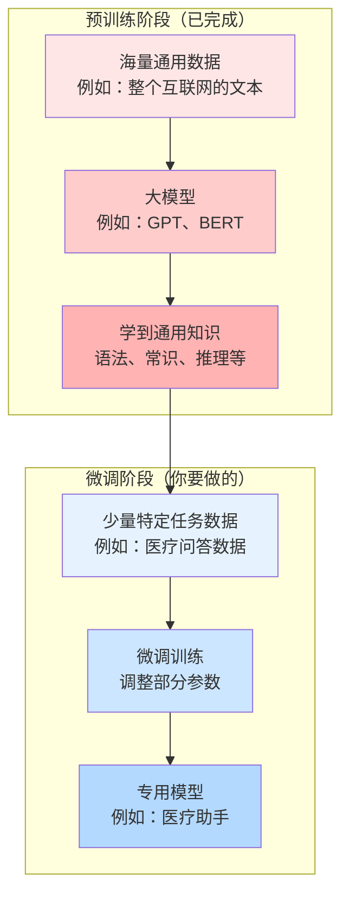

**微调让`AI`技术真正普及**：有了微调技术，不再只有谷歌、`Meta`这样的巨头能训练`AI`模型，普通企业和开发者也能基于开源的预训练模型，快速打造自己的`AI`应用。


## AI模型微调的常见方法

通过预训练和增量预训练，我们得到了一个具备通用或领域知识的基座模型。但这还不够——这个模型就像一个博学的学者，虽然知识渊博，但不一定知道如何完成你的具体任务。比如你需要它做客服，它可能会像写论文一样回答；你需要它分析财报，它可能给你讲故事。这时候就需要**微调（`Fine-tuning`）**——教会模型如何把知识用在刀刃上。

微调是`AI`模型训练中最常用、最实用的技术。根据微调的方式和目标，衍生出了多种微调方法。我们将介绍四种主要的微调方法：**全量微调**、**有监督微调**、**强化微调**和**人类偏好对齐**。

### 全量微调 (Fine-Tuning, FT)

**全量微调**是最直接、最传统的微调方式，指的是在特定任务的数据集上，对预训练模型的**所有参数**进行训练和更新。

#### 核心特点

**通俗理解**：就像招了一个大学毕业生，让他在公司里全面学习和适应，从工作流程到专业技能，所有方面都进行培训和调整。

**关键要素**：
- **更新所有参数**：模型的每一层、每一个权重都会被更新
- **需要足够数据**：通常需要几千到几万条标注数据
- **计算成本较高**：需要较多的`GPU`资源和训练时间
- **效果通常最好**：因为模型可以充分适应新任务

#### 适用场景

| 场景 | 说明 | 示例 |
|------|------|------|
| **数据充足** | 有足够的标注数据（通常>10K） | 大公司的客服对话数据 |
| **任务差异大** | 新任务与预训练任务差异较大 | 用语言模型做医疗诊断 |
| **追求最佳效果** | 对模型性能要求极高 | 高精度的金融风控模型 |
| **资源充足** | 有足够的计算资源和时间 | 研究机构、大公司 |

#### 训练流程

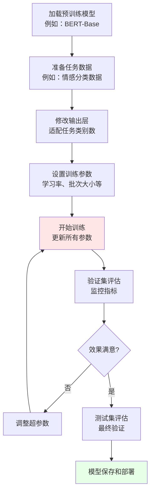

#### 优缺点分析

**优点**：
- ✅ **效果好**：模型可以充分适应新任务，通常能达到最佳性能  
- ✅ **灵活性高**：可以处理各种类型的任务  
- ✅ **实现简单**：技术上最直接，不需要特殊技巧

**缺点**：
- ❌ **资源消耗大**：需要较多的`GPU`显存和计算时间  
- ❌ **数据需求多**：需要较大规模的标注数据  
- ❌ **训练时间长**：特别是对大模型（如`GPT-3`级别）微调可能需要数天  
- ❌ **容易过拟合**：如果数据量不够，容易在训练集上过拟合
- ❌ **灾难性遗忘**：可能忘记预训练学到的通用知识，特别是任务数据与预训练数据差异大时

#### 全量微调 vs 增量预训练

很多初学者容易混淆**全量微调**和**增量预训练**这两个概念，这里做一个详细对比：

**核心区别总结**：

| 维度 | 增量预训练（CPT） | 全量微调（FT） |
|------|-----------------|--------------|
| **训练阶段** | 预训练阶段的延续 | 微调阶段 |
| **训练目标** | 学习领域通用知识 | 优化特定任务性能 |
| **数据类型** | 无标注的领域文本 | 有标注的任务数据 |
| **训练任务** | 自监督（如下一词预测） | 监督学习（有明确标签） |
| **学习内容** | 领域词汇、概念、知识 | 任务格式、输入输出映射 |
| **保持能力** | 保持通用能力+增强领域能力 | 可能牺牲通用能力换取任务性能 |
| **灾难性遗忘** | 风险较低（混合数据训练） | 风险较高（需特别防范） |
| **数据规模** | 较大（GB-TB级） | 较小（数千到数万条） |
| **训练时间** | 数天到数周 | 数小时到数天 |
| **成本** | $5万-$20万 | $数百-$数千 |

**直观理解**：

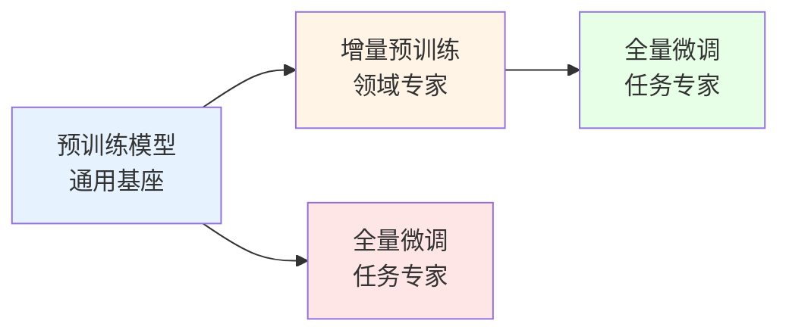

- 路径1：先领域适配，再任务优化，效果更好，成本更高
- 路径2：直接任务优化，快速简单，可能效果稍差

**具体例子对比**：

假设要打造一个医疗问答AI：

**增量预训练的做法**：
```
输入数据：大量医学文献（无标注）
训练任务：预测下一个词
学习内容：
  - 医学术语："心肌梗死"、"冠状动脉"
  - 医学概念：疾病的病因、症状、治疗
  - 医学表达：专业文献的写作风格
  
结果：模型变成"懂医学的通用模型"
```

**全量微调的做法**：
```
输入数据：医疗问答对（有标注）
训练任务：给定问题，生成答案
学习内容：
  - 如何理解患者的提问方式
  - 如何组织医学知识回答问题
  - 输出什么样的回答格式
  
结果：模型变成"会回答医疗问题的专家"
```

**最佳实践**：

实际项目中，通常**组合使用**这两种方法：

```text
预训练模型 → 增量预训练（领域适配） → 全量微调（任务优化）
    ↓              ↓                    ↓
 通用知识    通用知识 + 领域知识    领域知识 + 任务能力
```

**何时跳过增量预训练？**

✅ 直接微调即可的场景：
- 任务与预训练数据分布接近（如通用对话）
- 预算和时间有限
- 数据量较小，不足以支撑增量预训练

❌ 建议增量预训练的场景：
- 领域专业性强（医疗、法律、金融）
- 有大量领域无标注数据
- 对领域知识准确性要求高
- 预算充足，追求最佳效果


#### 实践建议

**1. 学习率设置**

全量微调的学习率通常需要**比预训练小**，典型值在`1e-5`到`5e-5`之间。

**原因**：预训练模型已经学到了很好的特征，大的学习率可能破坏这些特征。

**2. 渐进式解冻（Gradual Unfreezing）**

一种改进策略是**先冻结大部分层，只训练顶层，然后逐步解冻更多层**。

**流程**：
1. 先只训练最后一层（分类头）
2. 解冻最后几层，继续训练
3. 解冻所有层，进行最终微调

**好处**：防止底层已经学好的通用特征被破坏。

**3. 早停（Early Stopping）**

监控验证集性能，当性能不再提升时提前停止训练，防止过拟合。


### 有监督微调 (Supervised Fine-Tuning, SFT)

**有监督微调**特指在大语言模型（`LLM`）训练中，使用**高质量的指令-回答对**数据进行微调，让模型学会遵循人类指令的过程。

#### 核心特点

**通俗理解**：就像给一个博学的教授（预训练模型）配一个助教培训，教他如何回答学生的各种问题，让他学会"怎么说话"和"说什么内容"。

**与传统全量微调的区别**：
- **传统微调**：通常是针对单一任务（如分类、翻译）
- **有监督微调**：训练模型遵循各种各样的指令，完成多样化任务

**数据格式示例**：

```json
{
  "instruction": "将下面的英文翻译成中文",
  "input": "Machine learning is a subset of artificial intelligence.",
  "output": "机器学习是人工智能的一个子集。"
}

{
  "instruction": "回答以下问题",
  "input": "什么是深度学习？",
  "output": "深度学习是机器学习的一个分支，它使用多层神经网络来学习数据的复杂特征..."
}

{
  "instruction": "写一首关于春天的诗",
  "input": "",
  "output": "春风拂面花争艳，\n绿柳垂丝燕归来..."
}
```

#### 为什么需要SFT？

预训练模型（如`GPT-3`）虽然知识丰富，但存在几个问题：

| 问题 | 表现 | `SFT`的解决方式 |
|------|------|---------------|
| **不会遵循指令** | 你说"翻译这句话"，它可能继续生成文本而不是翻译 | 学习指令-回答模式 |
| **输出格式混乱** | 回答没有结构，夹杂无关内容 | 学习规范的输出格式 |
| **安全性问题** | 可能生成有害、偏见的内容 | 学习安全、友好的回答方式 |
| **多任务能力弱** | 只擅长某些任务 | 在多样化指令上训练 |

#### SFT的训练流程

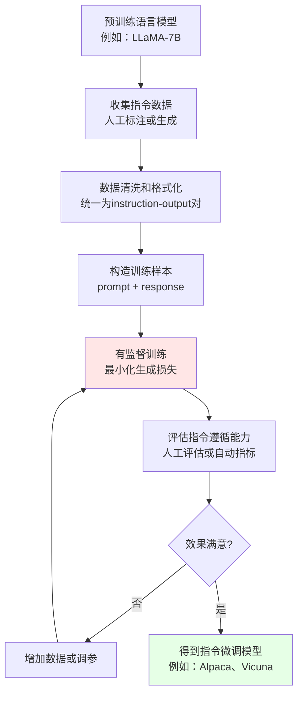

#### 数据来源

高质量的`SFT`数据是关键，主要来源有：

**1. 人工标注**
- 雇佣标注员编写指令和答案
- 成本高但质量最好
- 例如：`InstructGPT`使用了约`13,000`条人工标注数据

**2. 模型生成**
- 使用强大的模型（如`GPT-4`）生成指令和答案
- 成本低但需要质量筛选
- 例如：`Alpaca`使用`GPT-3.5`生成了`52,000`条数据

**3. 现有数据改造**
- 将已有的问答、对话数据改造成指令格式
- 数据丰富但可能需要大量处理
- 例如：从`Stack Overflow`、`Reddit`等收集数据

**4. 混合来源**
- 结合多种来源，确保数据多样性
- 覆盖不同领域和任务类型

#### 典型的SFT项目

| 模型名称 | 基座模型 | 数据量 | 数据来源 | 特点 |
|---------|---------|-------|---------|------|
| **`InstructGPT`** | `GPT-3` | `13K` | 人工标注 | 高质量，官方产品 |
| **`Alpaca`** | `LLaMA-7B` | `52K` | `GPT-3.5`生成 | 低成本，开源先驱 |
| **`Vicuna`** | `LLaMA-13B` | `70K` | 真实用户对话 | 对话能力强 |
| **`ChatGLM`** | `GLM-130B` | 未公开 | 中文指令数据 | 中文能力强 |

#### 训练技巧

**1. 数据多样性**

确保指令数据覆盖多种任务类型：
- 问答
- 翻译
- 总结
- 写作
- 推理
- 代码生成等

**2. 质量控制**

对生成的数据进行筛选：
- 过滤有害、偏见内容
- 去除格式错误的样本
- 保证答案的准确性

**3. 长度平衡**

指令和回答的长度要合理分布：
- 既有简短的一问一答
- 也有复杂的长篇推理

### 强化微调 (Reinforcement Fine-Tuning, RFT)

**强化微调**是使用强化学习（`Reinforcement Learning`）的方法对模型进行微调，通过定义奖励函数，让模型学习最大化奖励的行为。

#### 核心特点

**通俗理解**：就像训练一只宠物狗，做对了给零食（正向奖励），做错了不给（负向惩罚），通过反复训练让它学会正确的行为。

**与有监督微调的区别**：

| 维度 | 有监督微调（`SFT`） | 强化微调（`RFT`） |
|------|------------------|-----------------|
| **训练方式** | 直接学习"标准答案" | 通过奖励信号学习"好的行为" |
| **数据需求** | 需要大量标注数据 | 可以用较少数据+奖励函数 |
| **优化目标** | 最小化预测与标签的差异 | 最大化累积奖励 |
| **适用场景** | 有明确标准答案的任务 | 标准答案难以定义的任务 |
| **典型应用** | 文本分类、翻译 | 对话生成、游戏`AI`、机器人控制 |

#### 为什么需要强化微调？

在某些任务中，很难给出"标准答案"，但容易判断"好坏"：

**场景示例**：

| 场景 | 为什么`SFT`不够 | `RFT`的优势 |
|------|---------------|-----------|
| **开放式对话** | 没有唯一正确答案 | 可以定义"有趣、相关"等奖励 |
| **创意写作** | 好作品有多种形式 | 可以奖励"创意、流畅"等特质 |
| **游戏`AI`** | 策略多样，难以穷举 | 直接奖励"获胜"这个结果 |
| **代码优化** | 可以实现但效率不同 | 奖励"运行快、占用少"的代码 |

#### 强化微调的流程

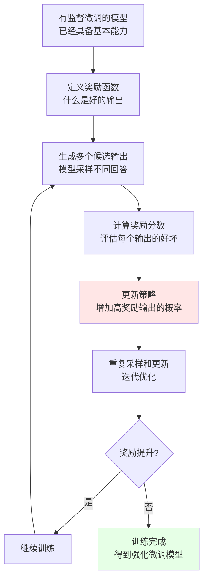

#### 奖励函数设计

奖励函数是强化微调的核心，它定义了"什么是好的输出"。

**常见的奖励设计方式**：

**1. 规则奖励**

基于人工定义的规则：
- 长度奖励：适当长度的回答得分高
- 多样性奖励：避免重复生成
- 格式奖励：符合特定格式（如代码块、列表）

**2. 模型奖励**

训练一个奖励模型来评分：
- 使用人类标注的偏好数据
- 训练一个分类器判断"好"或"坏"
- 用这个模型给生成结果打分

**3. 任务指标奖励**

直接使用任务的评估指标：
- 翻译任务：`BLEU`分数
- 游戏任务：获胜/失败
- 代码生成：能否通过测试用例

**4. 混合奖励**

结合多种奖励：
```text
总奖励 = 0.5 × 内容质量 + 0.3 × 相关性 + 0.2 × 安全性
```

#### 常用强化学习算法

| 算法名称 | 简称 | 核心思想 | 在`LLM`中的应用 |
|---------|-----|---------|---------------|
| **策略梯度** | `Policy Gradient` | 直接优化策略，增加高奖励动作的概率 | 基础的强化微调方法 |
| **近端策略优化** | `PPO` | 限制策略更新幅度，保证训练稳定 | `ChatGPT`使用的算法 |
| **深度Q网络** | `DQN` | 学习动作的价值函数 | 较少用于文本生成 |

#### 实际应用示例

**场景：训练一个能写出高质量代码的模型**

**1. 基础模型**：先用`SFT`训练一个基本能生成代码的模型

**2. 奖励设计**：
```python
def reward_function(generated_code, test_cases):
    score = 0
    
    # 能否编译
    if can_compile(generated_code):
        score += 1
    else:
        return score  # 编译失败直接返回
    
    # 通过测试用例
    passed = run_test_cases(generated_code, test_cases)
    score += passed / len(test_cases) * 5  # 最多5分
    
    # 代码效率
    runtime = measure_runtime(generated_code)
    if runtime < baseline:
        score += 2
    
    # 代码可读性（用启发式规则）
    readability = check_readability(generated_code)
    score += readability
    
    return score
```

**3. 训练过程**：
- 给定编程问题
- 模型生成代码
- 运行测试并计算奖励
- 根据奖励更新模型
- 重复迭代

**4. 效果**：模型逐渐学会生成能通过测试、运行高效、可读性好的代码

#### 挑战与注意事项

**1. 奖励设计困难**

不当的奖励函数可能导致意外行为：
- **奖励黑客**（`Reward Hacking`）：模型找到"作弊"方式获得高奖励，但不是真正的好输出
- **示例**：如果只奖励长度，模型可能生成冗长但无意义的文本

**2. 训练不稳定**

强化学习训练过程比监督学习更不稳定：
- 奖励信号稀疏或噪声大
- 策略更新可能导致性能崩溃
- 需要精心调整超参数

**3. 计算成本高**

需要大量的采样和评估：
- 每次更新需要生成多个候选输出
- 需要多次迭代才能收敛
- 总体计算量远大于监督学习

### 人类偏好对齐 (Reinforcement Learning from Human Feedback, RLHF)

**人类偏好对齐**是强化微调的一种特殊形式，通过收集人类对模型输出的偏好反馈，训练一个奖励模型，然后用这个奖励模型指导`AI`模型的优化，使其输出更符合人类期望。

#### 核心特点

**通俗理解**：就像选秀节目，让评委（人类）对选手（模型输出）进行打分或投票，然后根据这些评分训练选手，让他们的表演越来越符合评委的喜好。

**`RLHF`的独特之处**：奖励函数不是人工定义的规则，而是**从人类反馈数据中学习**出来的。

#### 为什么需要RLHF？

| 问题 | 传统方法的局限 | `RLHF`的解决 |
|------|-------------|------------|
| **难以定义"好"** | 很难用规则描述什么是好的对话 | 让人类直接打分，学习"好"的标准 |
| **主观偏好** | 创意、风格等很主观 | 学习人类的集体偏好 |
| **安全性** | 很难穷举所有有害内容 | 人类可以识别各种有害输出 |
| **多目标平衡** | 同时优化准确、友好、简洁等多个目标很复杂 | 人类自然地进行综合判断 |

#### RLHF的完整流程

`RLHF`通常分为三个阶段：

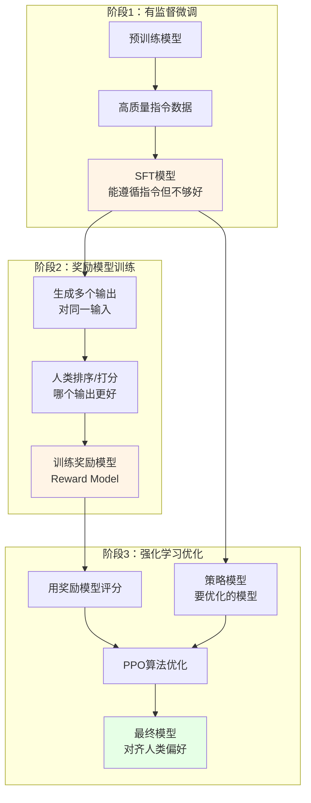

#### 阶段1：有监督微调（SFT）

**目标**：让模型具备基本的指令遵循能力

**方法**：使用高质量的指令-回答对进行监督训练（前面介绍的`SFT`）

**产出**：一个能理解并回答问题的基础模型，但回答质量可能参差不齐

#### 阶段2：奖励模型训练

这是`RLHF`的关键创新步骤。

**2.1 数据收集**

对于同一个输入（`prompt`），让`SFT`模型生成多个不同的输出（通常`4-9`个）：

**示例**：
```
输入：如何学习编程？

输出A：学习编程需要先学习一门编程语言，比如Python...
输出B：编程很难，需要大量练习，建议先从简单的开始...
输出C：首先，选择一门适合初学者的语言，如Python。其次...
输出D：你可以通过在线课程、书籍、实践项目等方式学习编程...
```

**2.2 人工标注**

雇佣标注员对这些输出进行**排序或打分**：

**排序方式**：
```
最好：输出C
第二：输出D
第三：输出A
最差：输出B
```

或者直接打分：
```
输出A：7分
输出B：4分
输出C：9分
输出D：8分
```

**2.3 训练奖励模型**

使用这些偏好数据训练一个**奖励模型**（`Reward Model, RM`）：

**训练目标**：给定输入和输出，预测人类会给这个输出打多少分

**模型架构**：通常基于`SFT`模型，把输出层改为一个标量输出（分数）

**损失函数**：让排名高的输出得分高于排名低的输出

```python
# 伪代码示意
loss = -log(sigmoid(score(输出C) - score(输出B)))
# 让得分满足：score(C) > score(B)
```

#### 阶段3：强化学习优化

**3.1 使用PPO算法**

**近端策略优化**（`Proximal Policy Optimization, PPO`）是`RLHF`最常用的强化学习算法。

**核心思想**：
- 让模型生成的输出获得更高的奖励模型分数
- 但不能偏离`SFT`模型太远（防止模型崩溃）

**目标函数**：
```
总目标 = 奖励模型分数 - β × KL散度(当前模型 || SFT模型)
```

**解释**：
- 第一项：鼓励高奖励输出
- 第二项：惩罚与`SFT`模型差异过大（β是权重系数）

**3.2 迭代优化**

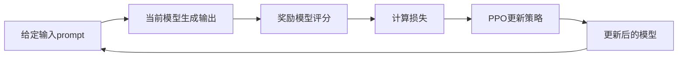

**训练过程**：
1. 给定输入，用当前策略模型生成输出
2. 奖励模型对输出打分
3. 计算`PPO`损失
4. 更新策略模型参数
5. 重复数千次迭代

#### RLHF的实际应用

**最著名的案例：`ChatGPT`**

`OpenAI`使用`RLHF`训练`ChatGPT`的过程：

**1. 预训练**：`GPT-3.5`在海量文本上预训练

**2. `SFT`**：用约`13,000`条人工编写的高质量对话数据进行监督微调

**3. 奖励模型**：
- 收集约`33,000`组对比数据（每组包含一个问题和多个回答）
- 人类标注员对回答进行排序
- 训练奖励模型学习人类偏好

**4. `PPO`优化**：
- 用奖励模型指导`PPO`训练
- 迭代优化数周
- 定期人工评估，调整训练参数

**结果**：`ChatGPT`表现出了惊人的对话能力和安全性，成为现象级产品

#### RLHF的优势

| 优势 | 说明 | 示例 |
|------|------|------|
| **符合人类偏好** | 输出更贴近人类期望 | 回答更友好、更有帮助 |
| **主观质量提升** | 对创意、风格等主观维度有效 | 写作更有趣、更自然 |
| **安全性增强** | 减少有害、偏见内容 | 拒绝生成危险信息 |
| **难以规则化** | 可以优化难以定义的目标 | 让对话"更像人" |

#### RLHF的挑战

**1. 人工标注成本高**

- 需要大量标注员进行偏好标注
- 标注质量影响最终效果
- 成本可能达到数十万到数百万美元

**2. 标注者偏差**

- 不同标注员的偏好可能不一致
- 标注员的文化背景影响判断
- 可能引入系统性偏见

**3. 奖励模型的局限**

- 奖励模型本身也可能犯错
- 模型可能学会欺骗奖励模型（Reward Hacking）
- 需要持续更新和改进

**4. 训练复杂度高**

- 需要同时维护策略模型、奖励模型、参考模型
- 训练不稳定，需要精细调参
- 计算资源消耗巨大

#### RLHF的改进方向

**1. 直接偏好优化（Direct Preference Optimization, DPO）**

省略奖励模型训练，直接从偏好数据优化策略：
- 简化流程，降低复杂度
- 训练更稳定
- 是当前的研究热点

**2. 宪法AI（Constitutional AI, CAI）**

用`AI`帮助标注，减少人工成本：
- 定义一套"宪法"原则（如：友好、诚实、安全）
- 让强大的`AI`（如`GPT-4`）按原则评估输出
- 减少对人工标注的依赖

**3. 迭代式RLHF**

不断收集新的人类反馈，持续改进模型：
- 部署模型后收集用户反馈
- 定期更新奖励模型
- 进行新一轮`RLHF`训练

### 微调方法总结对比

| 方法 | 简称 | 核心特点 | 数据需求 | 计算成本 | 适用场景 | 典型应用 |
|------|-----|---------|---------|---------|---------|---------|
| **全量微调** | `FT` | 更新所有参数 | 中等（数千至数万） | 较高 | 任务差异大、追求最佳效果 | 领域特定分类、翻译 |
| **有监督微调** | `SFT` | 学习指令遵循 | 中等（数万） | 中等 | 让模型遵循指令 | `Alpaca`、指令模型 |
| **强化微调** | `RFT` | 通过奖励优化 | 较少（可用奖励函数） | 高 | 难以定义标准答案 | 游戏`AI`、代码优化 |
| **人类偏好对齐** | `RLHF` | 学习人类偏好 | 较多（数万组对比） | 非常高 | 对齐人类价值观 | `ChatGPT`、安全模型 |

### 微调方法的选择建议

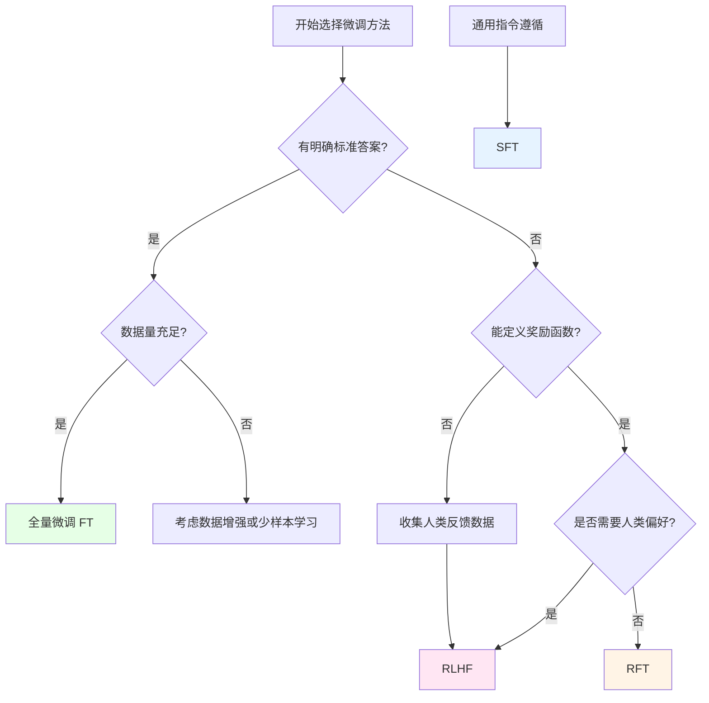

**实践建议**：

1. **优先尝试`SFT`**：如果是让模型学会遵循指令，`SFT`是最直接有效的方法
2. **追求极致效果用`RLHF`**：如果对模型输出质量要求极高，且有资源，使用`RLHF`
3. **特定目标用`RFT`**：如果有明确的优化目标（如游戏获胜、代码效率），使用`RFT`
4. **传统任务用`FT`**：如果是传统的分类、回归等任务，全量微调最简单有效

**总结**：微调方法的选择没有绝对的优劣，关键是根据具体的任务需求、数据情况和资源条件来决定。在实践中，常常会组合使用多种方法，例如先`SFT`再`RLHF`，以达到最佳效果。


## AI模型微调的基本流程

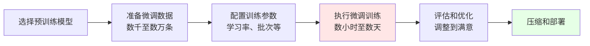

**与从零训练的对比**：

| 维度 | 从零训练 | 微调 |
|------|---------|------|
| **起点** | 随机初始化 | 预训练模型 |
| **数据量** | 百万级以上 | 数千到数万 |
| **训练时间** | 数周到数月 | 数小时到数天 |
| **算力需求** | 数百到数千`GPU` | 单卡到数卡`GPU` |
| **成本** | 数十万到数百万美元 | 数百到数千美元 |
| **适用场景** | 构建基座模型 | 特定任务适配 |


## AI模型微调的常见场景

### 智能客服

**业务需求**：自动回答用户咨询，减少人工客服压力

**技术路径**：
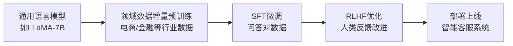

**数据准备**：
- 历史客服对话记录（脱敏处理）
- 常见问题及标准答案（`FAQ`）
- 产品文档和知识库

**效果指标**：
- 问题解决率：`> 80%`
- 用户满意度：`> 4.0/5.0`
- 人工介入率：`< 20%`

### 文档智能处理

**业务需求**：自动提取合同、报告中的关键信息

**技术路径**：
- **预训练模型**：使用`BERT`或`RoBERTa`
- **微调任务**：命名实体识别（`NER`）、关系抽取
- **训练数据**：标注的文档样本（数千份）

**应用场景**：
- 合同条款提取
- 简历信息解析
- 医疗报告分析
- 财务报表解读

### 代码助手

**业务需求**：帮助开发者编写、优化代码

**技术路径**：
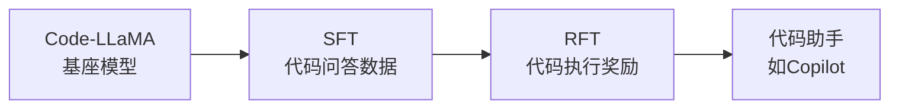

**训练数据**：
- `GitHub`开源代码
- 编程问答（`Stack Overflow`）
- 代码注释对
- 测试用例

**评估方式**：
- 代码能否编译
- 是否通过测试用例
- 代码效率和可读性
- 开发者满意度

### 内容创作

**业务需求**：自动生成营销文案、新闻摘要、产品描述等

**技术路径**：
- **基座模型**：`GPT`系列或`LLaMA`
- **微调方式**：`SFT` + `RLHF`
- **风格对齐**：学习品牌语调和风格

**应用场景**：
- 电商产品描述生成
- 新闻自动摘要
- 广告文案创作
- 社交媒体内容生成

### 智能推荐

**业务需求**：个性化推荐商品、内容、服务

**技术路径**：
- **预训练**：在用户行为数据上预训练
- **微调**：针对特定推荐场景微调
- **强化学习**：根据用户反馈优化

**数据特点**：
- 用户画像数据
- 行为序列数据
- 物品特征数据
- 点击/购买反馈


