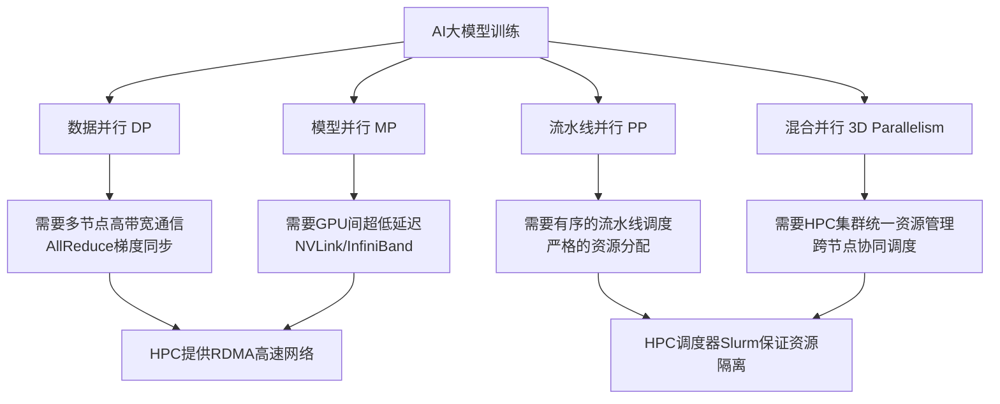
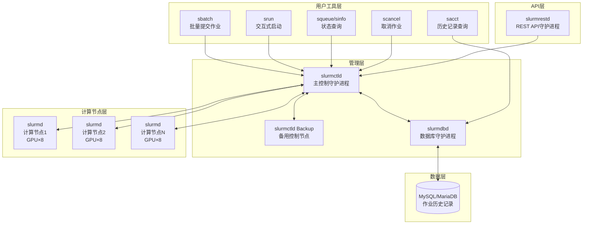

大规模`AI`大模型的训练和微调已成为当今人工智能领域的核心工程挑战。训练一个百亿参数的模型往往需要数百乃至数千块`GPU`协同运行数天。在这一背景下，如何高效地管理`GPU`集群、调度训练作业、最大化算力利用率，成为`AI`基础设施团队必须面对的关键问题。

本文将系统介绍高性能计算（`HPC`）的基本概念与技术体系，并重点深入讲解`Slurm`工作负载管理器在`AI`大模型训练和微调场景中的架构、使用方法与实践经验。

## 什么是高性能计算

高性能计算（`High-Performance Computing`，简称`HPC`）是指利用大量互联的计算节点并行处理极其复杂的计算任务，以达到单台普通计算机无法实现的计算性能。其核心目标是在可接受的时间内完成需要巨大计算量的科学、工程或数据分析任务。

### HPC解决的核心问题

| 问题类型 | 典型场景 | 痛点描述 |
|----------|----------|----------|
| 算力瓶颈 | 大模型预训练 | 单节点显存和算力不足以容纳千亿参数模型 |
| 时间约束 | 科学计算、气象模拟 | 单机完成需数年，并行后缩短至数小时 |
| 数据规模 | 基因测序、天文数据分析 | 数据量超过单节点处理能力 |
| 资源利用 | 多团队共享集群 | 缺乏统一调度导致资源闲置或冲突 |

### 常见的HPC技术方案

**并行计算模型**

- **共享内存并行（`SMP`）**：多核`CPU`共享内存，通过`OpenMP`等实现线程级并行，适合单节点内部并行
- **分布式内存并行（`MPI`）**：多节点各自拥有独立内存，通过`MPI`库在节点间传递消息，是集群计算的主流方案
- **`GPU`加速计算（`GPGPU`）**：利用`NVIDIA CUDA`或`AMD ROCm`将大量计算密集型任务卸载到`GPU`，尤其适合矩阵运算
- **混合并行**：结合`MPI` + `OpenMP` + `GPU`，实现多级并行，最大化硬件利用率

**高速互联网络**

`HPC`集群的性能瓶颈之一在于节点间通信。常用的高速互联技术包括：

| 技术 | 带宽 | 延迟 | 特点 |
|------|------|------|------|
| `InfiniBand` | `200Gb/s+` | `< 1μs` | 超低延迟，专为HPC设计 |
| `RoCE` | `100Gb/s+` | `1-5μs` | 基于以太网的RDMA，成本较低 |
| `NVLink` | `600GB/s+` | 极低 | NVIDIA GPU间直连，单机内部 |
| `GPUDirect RDMA` | `100Gb/s+` | `< 2μs` | GPU直接与网卡通信，绕过CPU |

**资源管理与作业调度**

在多用户、多任务的集群环境中，需要一套资源管理系统来统一调度和管理计算资源。主流的`HPC`资源管理系统包括：

| 系统 | 开发方 | 特点 |
|------|--------|------|
| `Slurm` | `SchedMD` | 开源，主流HPC集群首选，支持GPU调度 |
| `PBS/Torque` | `Altair` | 商业版PBS Pro，历史悠久 |
| `LSF` | `IBM` | 商业系统，功能完善，企业级支持 |
| `SGE/UGE` | `Oracle/Altair` | 网格引擎，多适用于生物信息学 |
| `Kubernetes` | `CNCF` | 云原生容器编排，AI推理场景强 |

## HPC在AI大模型训练与微调中的应用

### 为什么AI大模型训练必须依赖HPC

现代`AI`大模型的规模已远超单节点算力边界：

- **`GPT-3`（175B参数）**：需要数百块`A100 GPU`运行数周才能完成训练
- **`LLaMA-3`（70B参数）**：微调一次完整模型需要至少8块`80GB A100`
- **`Mixtral-8x7B`**：混合专家模型需要跨节点的精细资源调度

这些规模决定了`AI`训练必须在多节点`GPU`集群上运行，也就是必须依赖`HPC`基础设施。

### AI训练中的并行策略与HPC的对应关系



### HPC在AI微调场景中的价值

| 应用场景 | HPC必要性 | 核心需求 |
|----------|-----------|----------|
| 全参数微调（`Full Fine-tuning`） | 高，模型需完整加载 | 多卡显存聚合、梯度同步 |
| `LoRA/QLoRA`微调 | 中，显存需求降低 | 快速任务调度、队列管理 |
| 持续预训练 | 高，时间长、规模大 | 作业检查点、故障恢复 |
| 强化学习微调（`RLHF`） | 高，需要多组件协同 | `Actor/Critic`分离部署 |
| 批量评估推理 | 中，并发任务多 | 多任务队列、资源公平分配 |

## 什么是Slurm

`Slurm`（`Simple Linux Utility for Resource Management`）是一个开源的、容错性强、高度可扩展的集群管理和作业调度系统，广泛应用于全球顶级超算中心和大型`GPU`训练集群。它由`SchedMD`公司主导开发和维护，遵循`Apache 2.0`开源协议。

`Slurm`承担三个核心职责：

1. **资源分配**：将计算节点（含`CPU`、内存、`GPU`等）独占或非独占地分配给用户指定时长
2. **作业管理**：在分配的节点上启动、执行和监控并行作业
3. **队列仲裁**：管理待执行作业的队列，按优先级和策略调度

### Slurm的显著优点

| 优点 | 说明 |
|------|------|
| 开源免费 | 无商业授权费用，社区活跃，持续迭代 |
| 原生GPU支持 | 通过GRES机制精细管理GPU资源，支持MIG、MPS |
| 高可用 | 支持备用控制节点，单点故障自动切换 |
| 丰富的调度策略 | 多因子优先级、公平调度、抢占调度、回填调度 |
| 计量记账 | 完整的作业历史记录和资源使用统计 |
| 可扩展插件 | 覆盖认证、调度、记账、MPI等各类插件接口 |
| 广泛的生态支持 | 与PyTorch、DeepSpeed、MPI等深度集成 |
| 大规模验证 | 全球Top500超算榜单中绝大多数使用Slurm |

### Slurm与Kubernetes的对比

在`AI`训练场景下，`Slurm`和`Kubernetes`各有侧重：

| 维度 | Slurm | Kubernetes |
|------|-------|-----------|
| 设计定位 | HPC作业批量调度 | 容器化服务编排 |
| GPU调度 | 原生支持，精细到设备级 | 需要Device Plugin，粒度较粗 |
| 训练适合性 | 非常适合批处理训练任务 | 适合推理服务，训练需额外框架 |
| 启动速度 | 秒级（无容器开销） | 分钟级（镜像拉取、容器启动） |
| 故障恢复 | 节点级，作业重排队 | Pod重启，需配合Checkpoint |
| 多租户隔离 | 账号/分区体系成熟 | Namespace隔离，RBAC |
| 学习曲线 | 对HPC工程师友好 | 对云原生工程师友好 |
| 在线推理 | 不适合 | 非常适合 |

在实践中，许多大型`AI`团队采用混合架构：`Slurm`负责训练，`Kubernetes`负责推理服务，二者各司其职。

## Slurm的架构设计

### 整体架构



### 核心组件详解

#### slurmctld — 主控制守护进程

`slurmctld`是`Slurm`的"大脑"，运行在管理节点（`headnode`）上，负责：

- 监控所有计算节点的状态（在线、下线、故障等）
- 接收用户提交的作业请求
- 根据调度策略决定作业在哪些节点上运行
- 向`slurmd`下发作业执行指令

为保证高可用，`slurmctld`支持配置备用节点，主节点故障时备用节点自动接管。

#### slurmd — 计算节点守护进程

`slurmd`运行在每一个计算节点上，是"工人"角色，负责：

- 向`slurmctld`上报本节点的资源信息（`CPU`数量、内存大小、`GPU`数量等）
- 接收`slurmctld`下发的作业步骤（`job step`）
- 启动、监控和清理作业进程
- 收集作业资源使用数据

#### slurmdbd — 数据库守护进程

`slurmdbd`是可选组件，负责将作业的历史记录、用户账号、资源使用统计等数据持久化到`MySQL/MariaDB`数据库中，支持：

- 跨集群的统一记账
- 作业历史查询（`sacct`命令）
- 基于账号的资源限额管理（`QOS`、`limits`）

#### slurmrestd — REST API守护进程

`slurmrestd`是可选的`REST API`服务，允许外部系统（如`AI`平台、工作流引擎）通过标准`HTTP API`提交作业、查询状态，而无需安装`Slurm`客户端工具。这在与`Kubernetes`、`Airflow`等系统集成时非常有用。

### Slurm的核心概念

| 概念 | 说明 |
|------|------|
| `Node`（节点） | 集群中的单台计算服务器，可包含多个CPU核和GPU |
| `Partition`（分区） | 节点的逻辑分组，类似于作业队列，可设置不同的策略 |
| `Job`（作业） | 用户提交的计算任务，包含资源需求和执行脚本 |
| `Job Step`（作业步骤） | 作业内部的并行子任务，通过`srun`启动 |
| `GRES`（通用资源） | GPU等特殊资源的抽象，支持精细的资源调度 |
| `QOS`（服务质量） | 作业优先级和资源限额的策略集合 |
| `Account`（账号） | 用户组织单元，用于记账和资源配额管理 |

## Slurm的使用与配置

### 安装与基础配置

`Slurm`的核心配置文件为`/etc/slurm/slurm.conf`。以下是一个适合`GPU`训练集群的配置示例：

```ini
# /etc/slurm/slurm.conf 基础配置示例

# ==================== 全局配置 ====================
ClusterName=ai-gpu-cluster
SlurmctldHost=headnode01          # 主控节点
SlurmctldHost=headnode02          # 备用控制节点（可选）

# 认证
AuthType=auth/munge

# 调度器设置
SchedulerType=sched/backfill      # 开启回填调度，提升利用率
SelectType=select/cons_tres       # 消耗型资源分配（GPU调度必须）
SelectTypeParameters=CR_Core_Memory

# ==================== 资源类型配置 ====================
# 注册GPU为可调度资源
GresTypes=gpu

# ==================== 记账配置（需slurmdbd）====================
AccountingStorageType=accounting_storage/slurmdbd
AccountingStorageHost=headnode01
AccountingStorageTRES=gres/gpu    # 统计GPU使用量

# ==================== 节点配置 ====================
# GPU训练节点：每节点8块A100 80GB
NodeName=gpu-node[01-16] \
    CPUs=128 \
    RealMemory=1048576 \
    Gres=gpu:a100:8 \
    State=UNKNOWN

# ==================== 分区配置 ====================
# 普通训练分区
PartitionName=train \
    Nodes=gpu-node[01-08] \
    Default=YES \
    MaxTime=72:00:00 \
    State=UP

# 高优先级分区（长时间训练）
PartitionName=train-priority \
    Nodes=gpu-node[09-16] \
    MaxTime=7-00:00:00 \
    AllowGroups=ml-team \
    State=UP
```

### GPU资源配置（gres.conf）

`gres.conf`描述每个计算节点上的`GPU`详细信息：

```ini
# /etc/slurm/gres.conf
# 自动检测NVIDIA GPU（推荐）
AutoDetect=nvml

# 若需手动指定，示例如下（8卡A100节点）：
# Name=gpu Type=a100 File=/dev/nvidia[0-7]
```

### 常用命令速查

| 命令 | 用途 | 常用示例 |
|------|------|----------|
| `sbatch` | 提交批量作业 | `sbatch train.sh` |
| `srun` | 交互式运行或启动作业步骤 | `srun --gres=gpu:4 python train.py` |
| `squeue` | 查看作业队列 | `squeue -u $USER` |
| `sinfo` | 查看节点和分区状态 | `sinfo -o "%N %G %T"` |
| `sacct` | 查询作业历史记录 | `sacct -j 12345 --format=JobID,State,Elapsed` |
| `scancel` | 取消作业 | `scancel 12345` |
| `scontrol` | 查看或修改作业/节点状态 | `scontrol show job 12345` |
| `sacctmgr` | 管理用户、账号、QOS | `sacctmgr show user` |

### 使用示例一：提交单节点GPU训练作业

以下是一个完整的`PyTorch`单节点多卡训练作业脚本：

```bash
#!/bin/bash
#SBATCH --job-name=llm-finetune          # 作业名称
#SBATCH --partition=train                # 目标分区
#SBATCH --nodes=1                        # 节点数量
#SBATCH --ntasks-per-node=1             # 每节点任务数
#SBATCH --gres=gpu:a100:8               # 请求8块A100 GPU
#SBATCH --cpus-per-task=32              # 每任务CPU数
#SBATCH --mem=256G                       # 内存需求
#SBATCH --time=24:00:00                 # 最长运行时间
#SBATCH --output=logs/finetune_%j.out   # 标准输出
#SBATCH --error=logs/finetune_%j.err    # 错误输出

# 加载环境
module load cuda/12.2 python/3.10

# 激活虚拟环境
source /path/to/venv/bin/activate

# 设置分布式训练环境变量
export MASTER_ADDR=$(hostname)
export MASTER_PORT=29500

# 使用torchrun启动8卡分布式训练
torchrun \
    --nproc_per_node=8 \
    --master_addr=$MASTER_ADDR \
    --master_port=$MASTER_PORT \
    finetune_llm.py \
    --model_name meta-llama/Llama-3-70b \
    --data_path /data/training_data \
    --output_dir /output/checkpoints \
    --epochs 3 \
    --batch_size 4 \
    --lr 2e-4
```

提交作业：

```bash
sbatch train_job.sh
```

### 使用示例二：多节点分布式训练（多机多卡）

大模型全参数预训练通常需要多个节点。以下示例展示4节点×8卡（共32块`A100`）的`DeepSpeed`训练配置：

```bash
#!/bin/bash
#SBATCH --job-name=llm-pretrain
#SBATCH --partition=train
#SBATCH --nodes=4                        # 4个计算节点
#SBATCH --ntasks-per-node=8             # 每节点8个进程（对应8块GPU）
#SBATCH --gres=gpu:a100:8
#SBATCH --cpus-per-task=8
#SBATCH --mem=512G
#SBATCH --time=7-00:00:00               # 7天
#SBATCH --output=logs/pretrain_%j.out
#SBATCH --error=logs/pretrain_%j.err

# Slurm自动提供节点列表
MASTER_NODE=$(scontrol show hostnames "$SLURM_JOB_NODELIST" | head -n 1)
MASTER_PORT=29500

echo "Master node: $MASTER_NODE"
echo "All nodes: $SLURM_JOB_NODELIST"
echo "Total GPUs: $((SLURM_NNODES * 8))"

# 使用srun在所有分配节点上启动训练进程
srun \
    --nodes=$SLURM_NNODES \
    --ntasks=$SLURM_NTASKS \
    python -m deepspeed.launcher.launch \
    --node_rank=$SLURM_NODEID \
    --master_addr=$MASTER_NODE \
    --master_port=$MASTER_PORT \
    pretrain_gpt.py \
    --deepspeed ds_config_zero3.json \
    --model_config configs/7b_model.json \
    --data_path /data/pile_dataset \
    --save_dir /checkpoints/gpt-7b
```

### 使用示例三：数组作业（批量超参数搜索）

超参数搜索时，可使用`Slurm`作业数组同时提交多个作业：

```bash
#!/bin/bash
#SBATCH --job-name=hparam-search
#SBATCH --partition=train
#SBATCH --array=0-15                    # 提交16个作业，ID为0-15
#SBATCH --nodes=1
#SBATCH --gres=gpu:a100:2              # 每个作业使用2块GPU
#SBATCH --mem=64G
#SBATCH --time=8:00:00
#SBATCH --output=logs/hparam_%A_%a.out

# 定义超参数组合
LEARNING_RATES=(1e-5 2e-5 5e-5 1e-4)
BATCH_SIZES=(8 16 32 64)

LR_IDX=$((SLURM_ARRAY_TASK_ID / 4))
BS_IDX=$((SLURM_ARRAY_TASK_ID % 4))

LR=${LEARNING_RATES[$LR_IDX]}
BS=${BATCH_SIZES[$BS_IDX]}

echo "Task $SLURM_ARRAY_TASK_ID: lr=$LR, batch_size=$BS"

torchrun \
    --nproc_per_node=2 \
    finetune.py \
    --learning_rate $LR \
    --batch_size $BS \
    --output_dir /output/hparam_lr${LR}_bs${BS}
```

### 使用示例四：查询和监控作业状态

```bash
# 查看自己的所有作业
squeue -u $USER --format="%.18i %.9P %.30j %.8u %.8T %.10M %.9l %.6D %R"

# 查看GPU节点状态
sinfo -N -p train --format="%.10N %.4c %.8m %.20G %.8t"

# 查看已完成作业的GPU使用情况
sacct -j 12345 --format=JobID,State,Elapsed,AllocTRES%50,MaxRSS

# 实时查看作业输出
tail -f logs/pretrain_12345.out

# 取消特定作业
scancel 12345

# 取消自己所有待运行的作业
scancel --state=PENDING --user=$USER

# 查看集群整体GPU使用情况
sinfo -O NodeList:20,Gres:30,GresUsed:30,State:10
```

### 高级配置：服务质量（QOS）管理

在多团队共享`GPU`集群时，`QOS`可以实现优先级控制和资源限额：

```bash
# 创建普通训练QOS
sacctmgr add qos normal-train \
    Priority=10 \
    MaxTRESPerUser=gres/gpu=32 \
    MaxJobsPerUser=10

# 创建高优先级QOS（用于紧急训练任务）
sacctmgr add qos priority-train \
    Priority=100 \
    MaxTRESPerUser=gres/gpu=64 \
    MaxWallDurationPerJob=7-00:00:00

# 为用户分配QOS
sacctmgr modify user alice set qos=normal-train,priority-train

# 提交作业时指定QOS
sbatch --qos=priority-train train_urgent.sh
```

### 与深度学习框架的集成

**集成`PyTorch`分布式训练**

`Slurm`通过环境变量与`PyTorch`的分布式训练无缝集成：

```python
import os
import torch
import torch.distributed as dist

def init_distributed():
    """从Slurm环境变量初始化分布式训练"""
    # Slurm设置的环境变量
    rank = int(os.environ.get("SLURM_PROCID", 0))
    world_size = int(os.environ.get("SLURM_NTASKS", 1))
    local_rank = int(os.environ.get("SLURM_LOCALID", 0))
    
    master_addr = os.environ.get("MASTER_ADDR", "localhost")
    master_port = os.environ.get("MASTER_PORT", "29500")
    
    dist.init_process_group(
        backend="nccl",
        init_method=f"tcp://{master_addr}:{master_port}",
        world_size=world_size,
        rank=rank
    )
    
    torch.cuda.set_device(local_rank)
    return rank, world_size, local_rank
```

**集成`DeepSpeed`**

`DeepSpeed`提供了对`Slurm`的原生支持，使用`deepspeed`命令时传入`--hostfile`参数可自动读取`Slurm`分配的节点：

```bash
# 生成DeepSpeed使用的hostfile
scontrol show hostnames $SLURM_JOB_NODELIST | \
    awk '{print $1" slots=8"}' > /tmp/hostfile_$SLURM_JOB_ID

# 启动DeepSpeed训练
deepspeed \
    --hostfile /tmp/hostfile_$SLURM_JOB_ID \
    --master_addr $MASTER_ADDR \
    --master_port $MASTER_PORT \
    train_gpt.py \
    --deepspeed_config ds_config.json
```

## Slurm在AI大模型训练中的核心价值

### 作业检查点与断点续训

长时间训练任务（数天甚至数周）不可避免地面临硬件故障风险。`Slurm`提供了完善的检查点机制：

```bash
#!/bin/bash
#SBATCH --job-name=long-pretrain
#SBATCH --time=7-00:00:00
#SBATCH --signal=SIGUSR1@90            # 作业超时前90秒发送信号

# 在Python代码中捕获信号实现优雅退出和检查点保存
python train.py --resume_from_checkpoint /checkpoints/latest
```

同时，训练代码中可以捕获`SIGUSR1`信号，在收到信号时保存检查点，作业结束后再提交续训作业。

### 资源调度可视化监控

可通过`sinfo`和`sacct`结合自定义脚本实现集群状态监控：

```bash
# 查看所有GPU节点的实时使用情况
watch -n 5 'sinfo -N -p train -o "%12N %10G %10T %8C %8m" | grep -v drain'

# 统计过去24小时GPU使用率
sacct \
    --starttime=$(date -d '24 hours ago' +%Y-%m-%dT%H:%M:%S) \
    --format=User,JobID,AllocTRES%50,Elapsed \
    --state=COMPLETED
```

### 公平调度与多团队协作

在多`AI`团队共享`GPU`集群的场景中，`Slurm`的公平树（`Fair Tree`）调度算法能够保证：

- 长期低使用率的用户获得更高调度优先级
- 短期突发使用不影响其他团队的长期公平份额
- 管理员可为不同团队设置`GPU`配额

这是`Kubernetes`原生调度器目前较难实现的功能。

## 参考资料

- [Slurm官方文档](https://slurm.schedmd.com/documentation.html)
- [Slurm GPU调度配置（GRES）](https://slurm.schedmd.com/gres.html)
- [Slurm快速入门指南](https://slurm.schedmd.com/quickstart.html)
- [Slurm GitHub仓库](https://github.com/SchedMD/slurm)
- [PyTorch分布式训练与Slurm集成](https://pytorch.org/docs/stable/distributed.html)
- [DeepSpeed + Slurm实战指南](https://www.deepspeed.ai/getting-started/)
