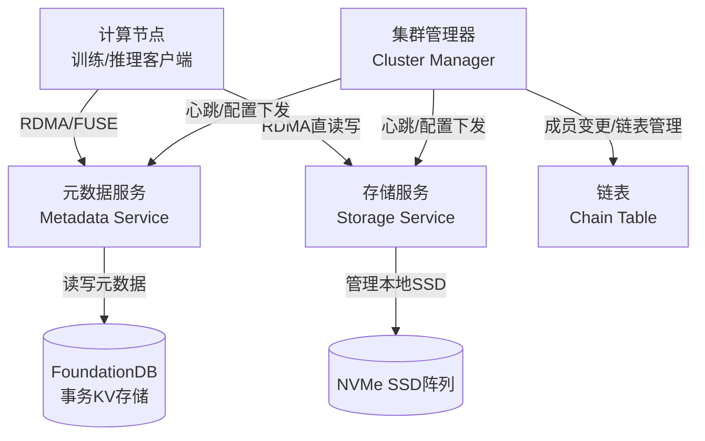
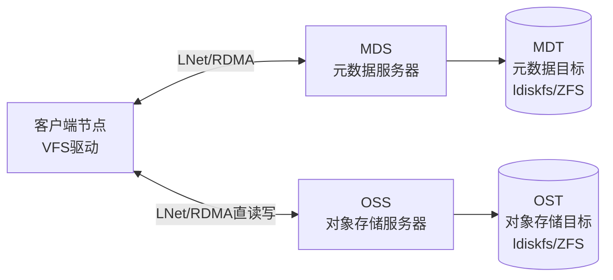
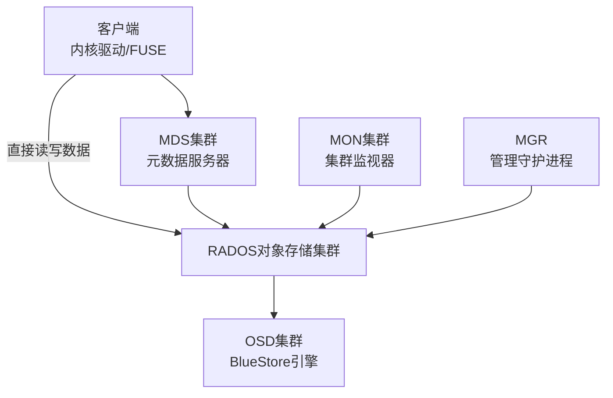
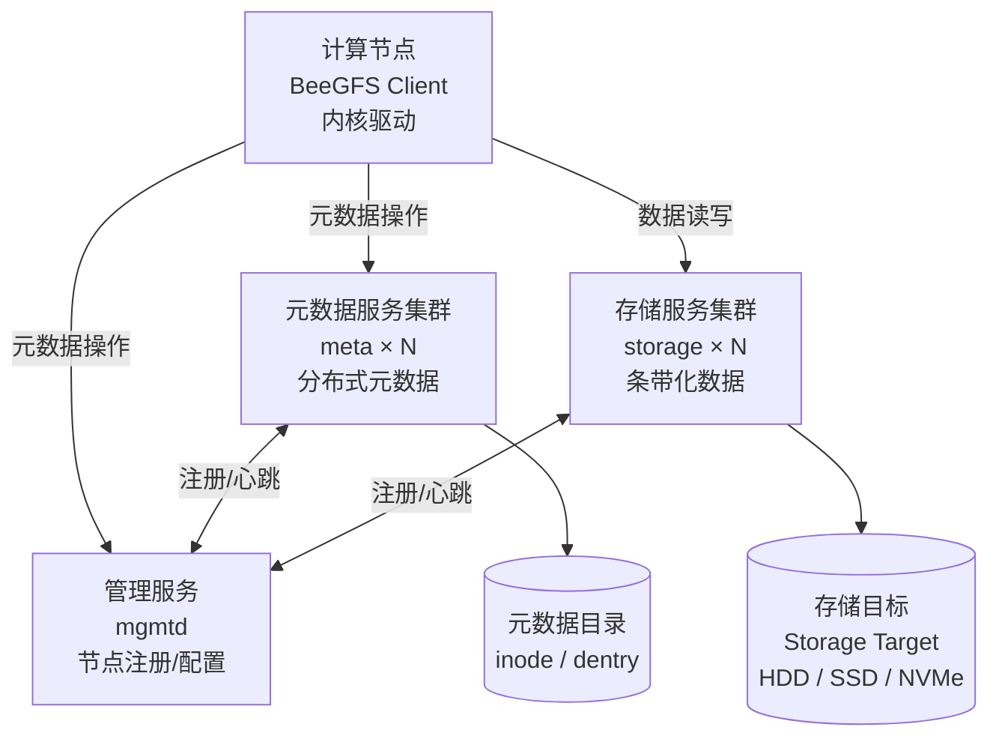
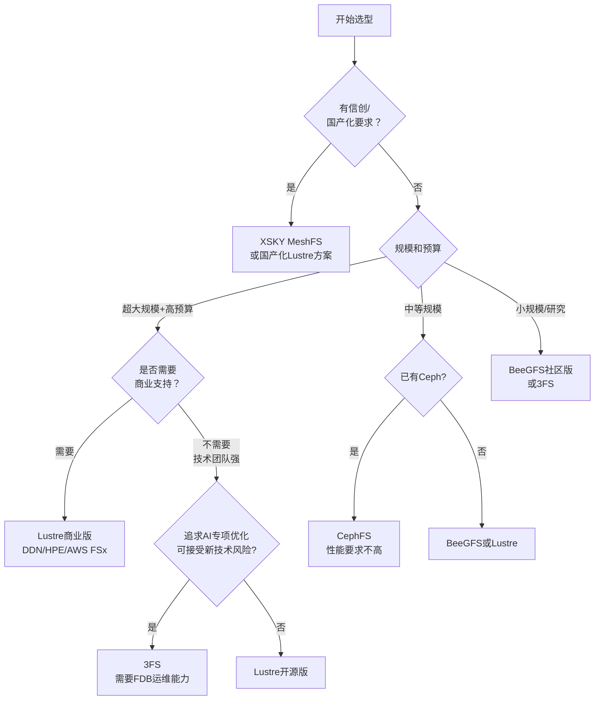

在大规模`AI`大模型训练场景中，存储系统往往是制约训练效率的关键瓶颈之一。数千块`GPU`并发读取训练数据集、高频写入检查点（`Checkpoint`）、以及推理阶段的`KVCache`管理，对底层存储的吞吐带宽、随机`I/O`性能和并发访问能力提出了极高要求。并行文件系统（`Parallel File System`，`PFS`）正是为此而生——它通过将数据条带化分布在多个存储节点和磁盘上，让所有计算节点能够以接近本地磁盘的速度并行访问共享存储。

本文将系统调研`AI`训练场景中主要的并行文件系统方案，包括`3FS`、`Lustre`、`IBM Spectrum Scale`（`GPFS`）、`CephFS`、`BeeGFS`和`XSKY MeshFS`，从架构原理、性能表现、适用场景和运维复杂度等角度展开分析，为构建`AI`训练基础设施的技术团队提供选型参考。

## AI训练的核心存储挑战

在深入各方案之前，先明确`AI`大模型训练对存储系统的具体要求，理解这些需求是做出合理选型的前提。

### 主要存储访问模式

| 场景 | 典型行为 | 性能要求 |
|------|----------|----------|
| 数据加载（`Dataloader`） | 随机读取训练样本，每次几`KB`到几`MB` | 高并发随机读`IOPS`，低延迟 |
| 检查点保存（`Checkpoint`） | 周期性并发写入全量模型参数，通常几十到几百`GB` | 高并发写吞吐，需快速完成 |
| 检查点恢复 | 训练中断后读取最新检查点恢复训练 | 高顺序读吞吐 |
| 数据预处理 | 大规模批量读写中间数据 | 高吞吐，大文件顺序`I/O` |
| `KVCache`（推理） | 频繁读写`Attention`层的`Key/Value`缓存 | 极高并发随机读写，低延迟 |

### 核心性能指标

- **聚合带宽**：所有计算节点并发读写时的总吞吐量，直接决定数据加载速度
- **随机`IOPS`**：处理大量小文件（如训练样本）时的关键指标
- **元数据性能**：`open/stat/mkdir`等文件系统操作的速度，影响训练任务初始化效率
- **扩展性**：存储容量和带宽能否随节点增加线性扩展
- **故障容错**：在节点故障时能否继续提供服务，不中断正在运行的训练任务

## 方案总览

下表对本文涉及的六种并行文件系统进行概括比较：

| 方案 | 开发者 | 开源情况 | 主要应用场景 | `RDMA`支持 | 元数据架构 |
|------|--------|---------|------------|-----------|-----------|
| `3FS` | `DeepSeek`（幻方科技） | `MIT`开源 | `AI`训练、推理`KVCache`、数据分析 | 原生支持 | 无状态`+FoundationDB` |
| `Lustre` | `OpenSFS/DDN` | `GPL v2`开源 | `HPC`超算、`AI`训练 | 支持（`IB/RoCE`） | `MDS/MDT`分布式 |
| `IBM Spectrum Scale` | `IBM` | 商业软件 | 企业级`HPC`、金融、`AI` | 支持 | 分布式元数据 |
| `CephFS` | `Ceph`社区/`Red Hat` | `LGPL`开源 | 通用云存储、企业存储 | 有限支持 | `MDS`集群 |
| `BeeGFS` | `ThinkParQ/Fraunhofer` | 社区版免费 | `HPC`数据密集计算 | 支持 | 分布式元数据 |
| `XSKY MeshFS` | `XSKY`（北京星辰天合） | 商业软件 | `AI`训练推理、智算中心 | 原生支持 | 分布式 |

## 3FS（Fire-Flyer File System）

`3FS`是由`DeepSeek`（幻方科技）研发并于2025年初开源的高性能分布式文件系统，专为解决`AI`训练和推理工作负载的存储挑战而设计。其名称`3FS`即`Fire-Flyer File System`的缩写。

### 架构设计

`3FS`采用存算分离的解耦架构，由四个核心组件构成：

**集群管理器（Cluster Manager）**：负责成员变更检测、集群配置下发和链表（`Chain Table`）维护。多个管理器通过选主保证高可用，配置持久化在`FoundationDB`或`etcd`中。

**元数据服务（Metadata Service）**：完全无状态，所有文件系统元数据（`inode`、目录项）均存储在`FoundationDB`分布式事务键值存储中，支持序列化快照隔离（`SSI`）事务语义。无状态设计允许元数据服务在不停机情况下滚动升级。

**存储服务（Storage Service）**：每个存储节点管理若干本地`NVMe SSD`，提供`chunk store`接口。使用`CRAQ`（`Chain Replication with Apportioned Queries`，链式复制+按比例查询）协议实现强一致性——写请求沿链条头部到尾部传播，读请求可分发到链条中任意节点，充分利用所有副本的读带宽。

**客户端**：提供`FUSE`客户端（通用性强，多数应用直接可用）和原生客户端（`Native Client`）两种接入方式。原生客户端提供基于`io_uring`设计理念的异步零拷贝`API`，通过`RDMA`直接将数据读入用户进程内存，绕过内核，显著降低延迟和`CPU`开销。

### 关键技术特性

**强一致性**：基于`CRAQ`协议实现强一致，应用无需处理读到过期数据的问题，简化了分布式训练代码的复杂性。

**无状态元数据**：`FoundationDB`作为元数据后端提供事务保证，元数据服务可随时扩缩容或故障恢复，不存在元数据服务的单点瓶颈。

**故障均衡恢复**：在存储节点故障时，通过整数规划求解平衡不完全区组设计（`BIBD`），将故障节点的读流量均匀分散到集群中所有其他节点，避免某几个节点成为热点。

**POSIX文件接口**：支持原子目录重命名、软硬链接等完整文件语义，无需应用改造。

### 性能数据

根据`DeepSeek`官方公开的基准测试数据（来源：[GitHub - deepseek-ai/3FS](https://github.com/deepseek-ai/3FS)）：

| 测试场景 | 集群规模 | 性能结果 |
|---------|---------|---------|
| 读压力测试（峰值吞吐） | `180`个存储节点（每节点`2×200Gbps IB + 16×14TiB NVMe`），`500+`客户端节点 | 聚合读吞吐约`6.6 TiB/s` |
| `GraySort`数据排序 | `25`个存储节点（每节点`2×400Gbps NIC`），`50`个计算节点 | 排序`110.5 TiB`数据耗时`30分14秒`，平均吞吐`3.66 TiB/min` |
| `KVCache`推理读取 | 客户端每节点`1×400Gbps NIC` | 峰值读吞吐达`40 GiB/s` |

### 适用场景

- `AI`大模型预训练和微调中的检查点存储与数据加载
- `LLM`推理场景的分布式`KVCache`持久化存储
- 大规模数据处理流水线的中间结果存储
- 需要强一致性保证的分布式训练任务

### 局限性

- 依赖`FoundationDB`，增加了运维复杂度（`FoundationDB`本身需要独立维护）
- `FUSE`接口在小随机读场景存在性能瓶颈（内核自旋锁限制约`400K` `4KiB`随机读/秒），需要性能敏感场景使用原生客户端
- 作为`2025`年初才开源的新项目，生产落地案例相对有限，社区成熟度低于`Lustre`等传统方案

### 参考资料

- GitHub仓库：[https://github.com/deepseek-ai/3FS](https://github.com/deepseek-ai/3FS)
- 设计文档：[https://github.com/deepseek-ai/3FS/blob/main/docs/design_notes.md](https://github.com/deepseek-ai/3FS/blob/main/docs/design_notes.md)

## Lustre

`Lustre`是目前`HPC`（高性能计算）领域部署最广泛的并行文件系统，自`2003`年首次在劳伦斯利弗莫尔国家实验室投产以来，始终占据`TOP500`超算榜单`60%`以上席位，包括当前最快超算`Frontier`（`700PB`存储、`13 TB/s`带宽）。近年来`NVIDIA`的`DGX SuperPOD`等`AI`训练集群也大量采用`Lustre`作为共享存储层。

### 架构设计

`Lustre`采用经典的三层架构：

**`MDS`（元数据服务器）**：管理文件系统命名空间（文件名、目录、权限等），`inode`指向一个或多个`OST`对象而非数据块。`Lustre 2.4`起支持分布式命名空间（`DNE`），可将子目录树分布到多个`MDT`上实现元数据的水平扩展。

**`OSS/OST`（对象存储服务器/目标）**：存储实际文件数据。文件数据以条带化（`striping`）方式分布在多个`OST`对象上，类似`RAID 0`。每个`OST`是一个独立的本地文件系统（`ldiskfs`或`ZFS`），存储聚合容量随`OST`数量线性增长。

**客户端**：通过`Linux`内核`VFS`驱动挂载`Lustre`文件系统，以`POSIX`语义访问。`Lustre 2.15`起支持`NVIDIA GPUDirect Storage`，允许`RDMA`直接在存储服务器和`GPU`显存之间传输数据，消除`CPU`内存的中转拷贝。

**`LNet`网络层**：支持`InfiniBand`（`OFED Verbs`）、`RoCE`、`OmniPath`、`iWARP`、以太网`TCP`等多种高速网络，在支持`RDMA`的网络上自动利用零拷贝传输。`Lustre 2.10`起支持多网卡聚合（`Multi-Rail`），进一步提升带宽。

### 关键技术特性

**文件条带化**：每个文件可独立配置条带数量（`stripe count`，最多可跨`2000`个`OST`）和条带大小，并发读写单个大文件的带宽随条带数量线性增长。

**渐进式文件布局（`PFL`）**：`Lustre 2.10`引入，允许同一文件在不同偏移范围使用不同的条带策略，例如小文件起始段用单条带减少开销，大文件后续段用多条带最大化带宽。

**文件级冗余（`FLR`）**：`Lustre 2.11`引入，支持类似`RAID 1`的文件镜像布局，同时提升读性能和数据可用性。

**持久化客户端缓存（`PCC`）**：`Lustre 2.13`引入，允许客户端直接使用本地`NVMe/NVRAM`缓存热数据，同时保持文件在全局命名空间中可见，显著提升热点文件的访问延迟。

**`GPUDirect Storage`**：`Lustre 2.15`起支持，可显著降低`GPU`训练任务的数据加载延迟。

**`HSM`（层次化存储管理）**：支持将冷数据自动迁移到磁带等低成本介质，保留访问存根，实现热冷数据分层管理。

### 性能数据

- **Frontier超算**（`ORNL`）：使用`Orion` Lustre文件系统，存储容量`700 PB`，聚合带宽`13 TB/s`（来源：[Oak Ridge National Laboratory](https://www.ornl.gov/news/frontier-supercomputer-debuts-worlds-fastest-breaking-exascale-barrier)）
- **单客户端带宽**：`100 GbE`接口可达`>11 GB/s`，`InfiniBand EDR`接口可达`>11 GB/s`（来源：[ORNL Lustre Networking Technologies](https://lustre.ornl.gov/ecosystem-2016/documents/topics/Caldwell-ORNL-EthernetVsInfiniband.pdf)）
- **NVIDIA Selene DGX A100 SuperPOD**：使用`Lustre`作为训练存储，支撑大规模`AI`训练（来源：[OpenSFS LUG2021](https://www.opensfs.org/wp-content/uploads/Accelerating-AI-at-Scale_Julie_Prethvi_updated051421.pdf)）

### 适用场景

- 超大规模`AI`训练集群（数百到数千节点），需要高聚合带宽
- 需要与`Slurm`等`HPC`作业调度系统深度集成的场景
- 现有`HPC`基础设施向`AI`训练转型
- 有商业支持需求（`DDN ExaScaler`、`HPE ClusterStor`、`AWS FSx for Lustre`、`Azure Managed Lustre`等）

### 局限性

- 元数据操作（尤其是小文件密集型工作负载）存在瓶颈，尽管`DNE`已有改善
- 部署和运维复杂度较高，需要专业`HPC`存储工程师
- 内核模块形式的客户端在内核升级时存在兼容性问题（主线内核不包含`Lustre`客户端）
- 商业支持版本（如`DDN`）费用较高

### 参考资料

- 官方网站：[https://www.lustre.org/](https://www.lustre.org/)
- Wikipedia：[https://en.wikipedia.org/wiki/Lustre_(file_system)](https://en.wikipedia.org/wiki/Lustre_(file_system))
- Lustre Wiki：[http://wiki.lustre.org/](http://wiki.lustre.org/)

## IBM Spectrum Scale（GPFS）

`GPFS`（`General Parallel File System`）是`IBM`自`1998`年起商业化的企业级并行文件系统，现品牌名为`IBM Storage Scale`（曾用名`IBM Spectrum Scale`）。它被全球最大规模的商业公司和部分`TOP500`超算广泛采用，包括排名第一的`Summit`超算（`2019`年`TOP500`第一，配置`200 Petaflops`、`9000+`颗`POWER9`处理器和`27000`块`NVIDIA Volta GPU`，存储系统称为`Alpine`）。

### 架构设计

`GPFS`是一个共享磁盘（`Shared-Disk`）或共享无共享（`Shared-Nothing`）分布式并行文件系统，支持两种模式混合部署。

核心架构特点：

- **分布式元数据**：目录树和其他元数据分散在整个文件系统中，没有单一"索引服务器"，避免元数据瓶颈
- **分布式锁管理**：实现完整`POSIX`语义（含独占文件访问锁），支持`AIX`、`Linux`、`Windows`异构混合集群
- **内置`RAID`层**：虚拟化底层块存储，提供冗余和并行访问
- **分区感知（`Partition Aware`）**：通过心跳协议检测网络分区，在最大分区中保持文件系统可用，实现优雅降级
- **在线维护**：添加磁盘、数据再均衡等操作无需停机

### 关键技术特性

**多平台支持**：支持`AIX`、`Linux`（`x86/Power/IBM Z`）和`Windows Server`，是覆盖平台最广的并行文件系统之一。

**信息生命周期管理（`ILM`）**：通过`Storage Pool`和`Fileset`机制实现分层存储策略，可基于访问时间、文件大小等属性自动将数据在高性能（`FC`）和低成本（`SATA`）存储池间迁移。

**`DMAPI`和`HSM`支持**：内置数据管理接口，支持与外部归档系统集成。

**`HDFS`兼容层**：通过`HDFS`兼容接口支持`Hadoop`应用，同时保留`POSIX`语义。

**`AFM`（主动文件管理）**：支持多站点数据复制和灾难恢复。

### 性能数据

`Summit`超算的`Alpine`存储系统基于`GPFS`，在`200 Petaflops`规模的`AI`和科学计算工作负载下稳定运行（来源：[ORNL Summit FAQ](https://www.olcf.ornl.gov/olcf-resources/compute-systems/summit/summit-faqs/)）。`GPFS`理论最大文件系统容量为`8 YB`（`Yottabytes`），最大单文件`8 EB`。

### 适用场景

- 需要同时支持`AIX`、`Linux`、`Windows`混合环境的企业级集群
- 对`SLA`和商业支持有严格要求的金融、政府、医疗等行业
- 已有大规模`IBM`基础设施的企业进行`AI`转型
- 需要多站点复制和精细化数据生命周期管理的场景

### 局限性

- 商业软件，授权费用高昂，`TCO`较高
- 与`IBM`生态绑定较深，迁移成本高
- 开放性不如`Lustre`、`Ceph`等开源方案
- 在纯`AI`训练优化方面，不如`3FS`等专为`AI`设计的系统

### 参考资料

- Wikipedia：[https://en.wikipedia.org/wiki/GPFS](https://en.wikipedia.org/wiki/GPFS)
- IBM产品页面：[https://www.ibm.com/storage/spectrum-scale](https://www.ibm.com/storage/spectrum-scale)

## CephFS

`CephFS`是`Ceph`开源分布式存储平台提供的`POSIX`兼容文件系统接口，建立在`Ceph`的核心可靠自主分布式对象存储（`RADOS`）之上。`Ceph`平台还提供对象存储（`RGW`，兼容`S3/Swift`）和块存储（`RBD`）接口，三种接口共享同一个底层存储集群。

### 架构设计

**`MDS`（元数据服务器）**：维护文件系统的目录树和文件属性，支持动态元数据负载均衡——随着负载增加，可自动将热点目录迁移到其他`MDS`节点。客户端获取元数据授权后，可直接与`OSD`通信读写文件数据，不经过`MDS`转发。

**`RADOS`对象存储层**：文件数据条带化为固定大小的对象（默认`4MB`），通过`CRUSH`算法确定每个对象在`OSD`集群中的位置，无需中心化元数据索引即可定位数据。

**`BlueStore`后端**：自`Ceph 12 Luminous`版本起成为默认存储后端，直接管理裸块设备，绕过传统文件系统层，提供更低延迟和更好的可配置性。

**`Crimson`项目**：正在开发中的下一代`OSD`实现，目标是降低`NVMe`时代的`CPU`开销和延迟，以适应现代高速存储介质。

### 关键技术特性

**统一存储平台**：对象、块、文件三种接口共享同一集群，降低运维复杂度和硬件成本，特别适合需要多协议访问的场景。

**弹性扩展**：通过增加`OSD`节点线性扩容，支持从几`TB`到`EB`级别的规模，`CRUSH`算法自动平衡数据分布。

**多副本与纠删码**：支持2/3副本复制和纠删码（`EC`），可在容量利用率和数据可靠性之间灵活权衡。

**快照和克隆**：支持高效的文件系统快照和克隆操作。

**与容器生态集成**：`Rook`项目使得在`Kubernetes`中部署和管理`Ceph`集群变得简单，是云原生环境中的主流存储方案。

### 适用场景

- 需要对象、块、文件多协议统一存储的通用场景
- `OpenStack`、`Kubernetes`等云计算平台的基础存储
- 中等规模`AI`训练集群（对存储性能要求适中）
- 已有`Ceph`基础设施、需要为`AI`工作负载提供文件系统接口

### 局限性

`CephFS`在纯高性能`AI`训练场景中相比`Lustre`、`3FS`等专用并行文件系统存在明显性能差距，具体表现在：

- **元数据性能较弱**：在大量小文件场景下，`MDS`容易成为瓶颈
- **未针对`RDMA`优化**：网络层未像`Lustre`、`3FS`那样深度集成`InfiniBand`/`RDMA`，无法充分利用`IB`带宽
- **`GPU`训练优化不足**：缺乏类似`Lustre GPUDirect Storage`的特性
- **`FUSE`性能限制**：生产环境推荐使用内核客户端，但内核客户端在某些发行版上的稳定性不如`Lustre`成熟

`CephFS`更适合作为通用企业存储，而非`AI`训练的高性能存储选项。

### 参考资料

- 官方文档：[https://docs.ceph.com/en/latest/cephfs/](https://docs.ceph.com/en/latest/cephfs/)
- Wikipedia：[https://en.wikipedia.org/wiki/Ceph_(software)](https://en.wikipedia.org/wiki/Ceph_(software))
- Ceph GitHub：[https://github.com/ceph/ceph](https://github.com/ceph/ceph)

## BeeGFS

`BeeGFS`（原名`FhGFS`，`Fraunhofer HPC File System`）是由德国弗劳恩霍夫应用研究促进协会（`Fraunhofer ITWM`）从`2005`年起开发的并行文件系统，`2014`年由其衍生公司`ThinkParQ`接管并正式更名。`BeeGFS`专注于数据吞吐量，在`HPC`数据密集计算场景中有一定部署。

### 架构设计

`BeeGFS`采用分布式元数据架构，由四类服务组成：

| 服务类型 | 职责 |
|---------|------|
| 管理服务（`mgmtd`） | 节点注册、集群配置管理 |
| 元数据服务（`meta`） | 分布式元数据存储，支持横向扩展 |
| 存储服务（`storage`） | 文件数据存储，支持`RAID`和条带化 |
| 客户端（`client`） | 内核驱动，挂载`BeeGFS`文件系统 |

`BeeGFS`将元数据分散到多个元数据服务器，避免单点元数据瓶颈。存储服务器管理存储目标（`Storage Target`），文件数据可条带化分布在多个目标上。

### 关键技术特性

**专注吞吐量**：架构设计的核心目标是最大化数据吞吐量，适合大文件顺序读写的`HPC`数据密集场景。

**简单部署**：相较于`Lustre`，`BeeGFS`的安装配置更简单，降低了运维门槛。

**存储池（`Storage Pool`）**：支持将不同性能特征的存储节点划分为不同的存储池，实现分层存储策略。

**容器支持**：提供开源的`Kubernetes CSI`驱动，支持容器化`AI`训练环境。

**`NUMA`感知**：对`NUMA`架构有优化，减少远端内存访问开销。

### 性能数据

根据弗劳恩霍夫`Seislab`测试集群（`25`节点：`20`计算节点`+5`存储节点，三层存储：`1 TB RAM + 20 TB SSD + 120 TB HDD`）测试结果（来源：[Fraunhofer BeeGFS Benchmark](https://www.itwm.fraunhofer.de/content/dam/itwm/de/documents/HPC_Infomaterial/GreenbyIT/hpc_Praesentation_BeeGFS_EN.pdf)）：单节点本地文件系统读写约`1.3 GB/s`；`BeeGFS`集群读写性能随节点数线性增长。

`BeeGFS`已在多个`TOP500`超算中部署，包括歌德大学法兰克福`Loewe-CSC`集群（安装时排名第22）、维也纳科学集群（第56）等。

### 授权模式

`BeeGFS`社区版可免费下载使用，服务端采用专有许可，客户端为`GPL v2`开源。企业版需要通过`ThinkParQ`购买商业支持合同。

### 适用场景

- 数据密集型`HPC`计算（`CFD`仿真、基因测序、地震数据处理）
- 中小规模`AI`训练集群，性能要求适中
- 希望快速部署、降低运维复杂度的`HPC`团队
- `Kubernetes`容器化`AI`训练环境

### 局限性

- 对`RDMA`/`InfiniBand`的支持不如`Lustre`和`3FS`成熟
- 缺乏类似`Lustre GPUDirect Storage`等深度`GPU`优化特性
- 服务端代码不开源，存在供应商锁定风险
- 与`Lustre`相比，在超大规模（千节点以上）集群中的生产验证案例相对较少

### 参考资料

- 官方网站：[https://www.beegfs.io/](https://www.beegfs.io/)
- Wikipedia：[https://en.wikipedia.org/wiki/BeeGFS](https://en.wikipedia.org/wiki/BeeGFS)
- GitHub：[https://github.com/ThinkParQ/beegfs](https://github.com/ThinkParQ/beegfs)

## XSKY MeshFS（星辰天合）

`XSKY`（北京星辰天合科技股份有限公司）是中国领先的软件定义存储厂商，据`IDC 2025 Q4`数据，其在中国对象存储软件市场排名第一，整体软件定义存储市场`TOP5`。针对`AI`训练场景，`XSKY`推出了`MeshFS`星飞并行文件系统，定位于专为`AI`定义的高性能全闪存文件系统。

### 产品定位

`XSKY MeshFS`是`XSKY AIMesh`统一`AI`数据平台的存储核心组件，面向`AI`训练、推理和数据处理的全流程存储需求。其配套生态还包括：

| 产品 | 定位 |
|------|------|
| `MeshFS` 星飞并行文件存储 | 高性能全闪存并行文件系统，专为`AI`训练 |
| `MeshFusion` 星飞推理存储 | 面向长上下文`AI`推理的持久化内存级存储 |
| `XEOS`对象存储 | `AI`数据湖底座，支持多模态数据，`EB`级扩展 |
| `MeshSpace`星飞数据湖 | 面向`AI`时代的`EB`级全局统一数据湖 |
| `EasyData`智能调度平台 | `AI`数据智能调度，打通存储与计算链路 |

### 核心技术特性

**`XSEA`星海架构（`Shared-Everything`）**：采用`Shared-Everything`架构，将数据与元数据集中在高性能存储池统一管理，通过端到端`RDMA`数据通道实现训练和推理节点对数据的零拷贝访问。

**全闪存优化**：基于`NVMe SSD`全闪存部署，充分发挥现代高速存储介质的性能优势，面向`AI`训练的随机小`I/O`和大吞吐场景深度优化。

**多协议统一命名空间**：支持多种文件和对象访问协议，使数据采集、清洗、训练、推理、归档等不同阶段可访问同一份数据集，避免数据格式割裂和重复搬运。

**信创生态支持**：兼容`x86`和`ARM/国产芯片`平台，满足国产化（信创）要求，适合有国产化要求的政府、金融机构和科研院所。

### 公开案例数据

根据`XSKY`官方公开案例（来源：[xsky.com](https://www.xsky.com/)）：

- **某国内头部`AGI`厂商**：基于`XEOS`全闪数据湖，单一集群支撑近`2 Tbps`周期性写入、超`5 Tbps`突发读取，极限压力下读取延迟`≤8ms`
- **某大型智算中心**：`4`个月内数据增长超`20PB`，读取峰值`149.34 GB/s`、写峰值`61.67 GB/s`，较原开源方案训练效率提升`300%`，大幅释放`GPU`算力

### 适用场景

- 国产化（信创）环境下的`AI`训练基础设施建设
- 对技术支持和本地化服务有较高要求的中国企业
- 需要从数据采集到训练推理全链路存储方案的智算中心建设
- 对`AI`训练存储有专项优化需求、但又不想承担开源方案运维复杂度的用户

### 局限性

- 商业软件，需要付费采购，`TCO`取决于谈判结果
- 作为商业产品，技术细节和性能数据的独立验证信息有限
- 主要面向中国市场，国际化程度较低
- 依赖厂商持续投入维护

### 参考资料

- 官方网站：[https://www.xsky.com/](https://www.xsky.com/)
- `MeshFS`产品页：[https://www.xsky.com/products/mesh-fs](https://www.xsky.com/products/mesh-fs)

## 方案对比与选型建议

### 综合特性对比

| 维度 | `3FS` | `Lustre` | `IBM Spectrum Scale` | `CephFS` | `BeeGFS` | `XSKY MeshFS` |
|------|-------|----------|---------------------|---------|---------|--------------|
| 许可协议 | `MIT`开源 | `GPL v2`开源 | 商业 | `LGPL`开源 | 社区免费+商业 | 商业 |
| 成熟度 | 新兴（`2025`开源） | 非常成熟 | 非常成熟 | 成熟 | 较成熟 | 成熟（中国市场） |
| `RDMA`支持 | 原生深度集成 | 成熟（`IB/RoCE`） | 支持 | 有限 | 支持 | 原生支持 |
| `GPU`训练优化 | 零拷贝原生`API` | `GPUDirect Storage` | 有限 | 无 | 有限 | 有 |
| 元数据扩展性 | 无状态`+FoundationDB` | `DNE`多`MDT` | 分布式 | `MDS`集群 | 分布式`meta` | 分布式 |
| 部署复杂度 | 高（依赖`FDB`） | 高 | 高 | 中 | 低 | 低（商业支持） |
| 运维复杂度 | 较高 | 较高 | 高 | 中 | 低 | 低 |
| 超大规模验证 | `180`节点`6.6 TiB/s` | `700PB/13 TB/s`（`Frontier`） | `Summit`超算 | `CERN`等 | 多`TOP500`集群 | 智算中心 |

### 场景选型建议

**超大规模AI训练集群（千节点以上，追求极致性能）**

首选`Lustre`（尤其是商业发行版如`DDN ExaScaler`或`AWS FSx for Lustre`/`Azure Managed Lustre`），凭借其在超算领域超过`20`年的生产验证、成熟的`GPUDirect Storage`支持和完善的`HPC`生态。如果愿意承担一定技术风险，`3FS`提供了一个专为`AI`设计、架构更现代的选择。

**中国AI训练集群，有信创要求或本地化支持需求**

`XSKY MeshFS`是强有力的选择，提供专项`AI`优化、本地化技术支持和信创合规能力。也可考虑基于`Lustre`的国产化方案。

**预算有限，中等规模训练集群**

`BeeGFS`社区版提供了良好的性价比，部署简单，数据吞吐性能不错，适合中小规模`AI`研究团队。如果已有`Ceph`基础设施，在性能要求不极端的情况下可以考虑`CephFS`。

**自建开源方案，技术团队能力强**

`3FS`提供了最贴近`AI`工作负载设计的架构（强一致性、无状态元数据、异步零拷贝`API`），但需要具备`FoundationDB`运维能力。`Lustre`则更为成熟，社区资源更丰富。

**企业级，需要全平台兼容和多站点灾备**

`IBM Spectrum Scale`提供了最完整的企业特性集，包括`AIX/Linux/Windows`混合支持、`AFM`多站点复制、精细化`ILM`策略等，代价是较高的许可成本。

**多模态数据湖场景（对象+文件统一访问）**

对于需要同时提供`S3`对象接口和文件系统接口的场景，`CephFS`+`Ceph RGW`的统一平台方案是合理选择，或者参考`XSKY`的`XEOS`+`MeshFS`组合方案。

### 决策流程

## 总结

并行文件系统的选型没有放之四海而皆准的答案，需要结合团队规模、技术能力、预算约束、合规要求和性能目标综合权衡。

`Lustre`凭借超过`20`年的生产验证，仍是超大规模`HPC/AI`集群的首选，丰富的商业支持生态（`DDN`、云厂商托管服务）降低了自建运维负担；`3FS`作为`DeepSeek`开源的`AI`原生存储，在架构设计上充分汲取了现代`AI`工作负载特征，是值得关注的新兴选择；`BeeGFS`以简单易用和良好的吞吐性能，在中等规模`HPC`团队中有广泛应用；`CephFS`适合以通用存储为主、兼顾文件访问的场景；`IBM Spectrum Scale`适合有企业级商业支持诉求的大型机构；`XSKY MeshFS`则是面向中国智算中心建设的本土化`AI`专用存储方案。

随着`AI`模型规模和训练集群规模持续扩大，并行文件系统的地位将愈加重要，各方案也在持续演进——`Lustre`在`GPUDirect Storage`和多轨网络方向深入优化，`3FS`在`KVCache`等推理存储方向积极探索，商业方案持续结合`NVMe All-Flash`和`RDMA`技术提升性能。建议在做出最终选型前，针对自身工作负载进行实际性能测试验证（`POC`），参考数据永远比厂商宣传更可信。
