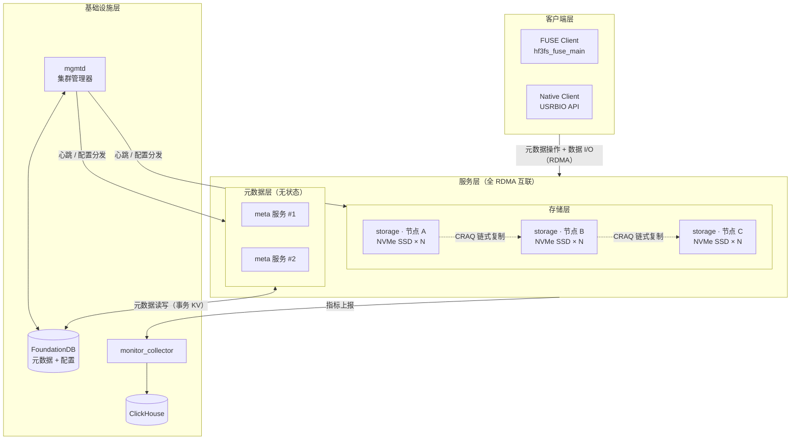
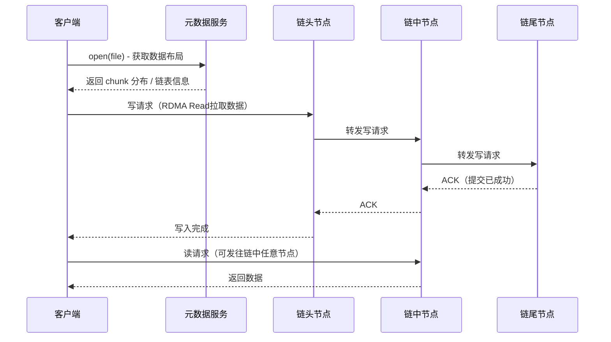

在大规模`AI`模型训练场景中，存储系统往往是制约训练效率的关键瓶颈。数千块`GPU`并发读取训练数据集、高频写入检查点（`Checkpoint`）以及推理阶段的`KVCache`管理，对底层存储的吞吐带宽、随机`I/O`性能和并发访问能力提出了极高要求。`2025`年初，`DeepSeek`正式开源了内部使用的高性能并行文件系统`3FS`（`Fire-Flyer File System`），凭借其在`180`个存储节点上实现`6.6 TiB/s`聚合读吞吐的优异表现，迅速引发了业界广泛关注。

本文将全面深入地介绍`3FS`的技术方案、架构设计、组件功能、安装配置与运维实践，为在`AI`训练基础设施中考虑引入`3FS`的技术团队提供系统性参考。

## 3FS概述

### 什么是3FS

`3FS`（`Fire-Flyer File System`）是`DeepSeek`研发并开源的一套高性能分布式文件系统，专为`AI`训练和推理工作负载设计。它充分利用现代`NVMe SSD`的高吞吐特性与`RDMA`网络（`InfiniBand`或`RoCE`）的低延迟、高带宽优势，为计算节点提供一个统一的共享存储层，使分布式应用能够以接近本地磁盘的速度访问存储资源。

`3FS`于`2025`年`2`月以`MIT`许可证开源，代码托管在 [github.com/deepseek-ai/3FS](https://github.com/deepseek-ai/3FS)，目前已累计获得`10k+`星标。

### 核心特性

| 特性分类 | 特性名称 | 说明 |
|----------|----------|------|
| **性能与易用性** | 存算分离架构 | 将数千块`SSD`的吞吐与数百个存储节点的网络带宽聚合，客户端以无感知方式访问 |
| **性能与易用性** | 强一致性保障 | 基于`CRAQ`协议实现写全读任意，充分释放`SSD`和`RDMA`带宽，保证强一致性 |
| **性能与易用性** | 标准文件接口 | 元数据服务基于事务型`KV`存储（`FoundationDB`），提供标准`POSIX`文件接口 |
| **多样化工作负载** | 数据准备 | 将数据分析流水线的输出组织为层级目录结构，高效管理海量中间文件 |
| **多样化工作负载** | 数据加载 | 支持跨计算节点随机访问训练样本，无需预取或数据集shuffle |
| **多样化工作负载** | 检查点保存 | 支持大规模训练任务的高吞吐并行`Checkpoint`写入 |
| **多样化工作负载** | `KVCache`推理 | 提供比`DRAM`更大容量、极具成本竞争力的`KVCache`存储方案 |

### 性能基准

以下数据均来自`DeepSeek`官方`README`中的公开实测数据：

**峰值读吞吐测试**：在`180`个存储节点（每节点配备`2×200Gbps InfiniBand NIC`和`16`块`14TiB NVMe SSD`）组成的集群上，使用`500+`个客户端节点（每客户端`1×200Gbps InfiniBand NIC`）进行压力读测试，在训练任务背景流量下最终聚合读吞吐约达`6.6 TiB/s`。

**GraySort基准**：在`25`个存储节点（每节点`2×400Gbps NIC`）和`50`个计算节点上，对`110.5 TiB`的数据跨`8192`个分区完成排序，总耗时`30`分钟`14`秒，平均吞吐`3.66 TiB/min`（`smallpond`项目验证）。

**KVCache推理**：在`1×400Gbps NIC`的节点上，`KVCache`客户端峰值读吞吐最高可达`40 GiB/s`。

## 架构设计

### 整体架构

`3FS`采用存算分离的分布式架构，系统由四个核心组件构成：**集群管理器**（`mgmtd`）、**元数据服务**（`meta`）、**存储服务**（`storage`）和**客户端**（`client`）。所有组件通过`RDMA`网络（`InfiniBand`或`RoCE`）互联。



### 数据读写路径

客户端`open`文件时从元数据服务获取`chunk`分布信息，此后数据`I/O`直接与存储节点通信，无需再经过元数据服务。写请求发至链头并沿链传播，由链尾提交后反向回传`ACK`；读请求可发至链中任意节点，实现读负载均衡。



## 核心组件详解

### 集群管理器（mgmtd）

`mgmtd`（`Management Daemon`）是集群的控制中枢，通过心跳机制检测节点故障（租约模型：服务无法联系`mgmtd`超过阈值时主动退出以防脑裂）、维护和广播链表（`Chain Table`）变更、统一管理所有服务的配置文件，并通过选举支持高可用部署。

存储目标的公开状态如下，`mgmtd`据此驱动链状态转换：

| 公开状态 | 可读 | 可写 | 说明 |
|----------|------|------|------|
| `serving` | 是 | 是 | 正常服务 |
| `syncing` | 否 | 是 | 数据恢复中 |
| `waiting` | 否 | 否 | 等待恢复启动 |
| `lastsrv` | 否 | 否 | 已下线，曾是链中最后一个正常节点 |
| `offline` | 否 | 否 | 已下线或介质故障 |

### 元数据服务（meta）

元数据服务负责实现文件系统语义，处理所有文件元数据操作，如`open`、`create`、`mkdir`、`rename`、`unlink`、`stat`等。

**无状态设计**：元数据服务本身是**无状态**的，所有文件元数据持久化存储在`FoundationDB`中。这一设计带来了极高的可维护性——管理员可以在不中断服务的情况下滚动升级或重启元数据节点；客户端请求失败时可以自动故障转移到其他元数据节点。多实例部署时，请求被均匀分发到所有元数据服务实例。

**元数据存储模型**：

文件系统元数据通过两类核心数据结构存储在`FoundationDB`中：

| 结构类型 | 键（Key）格式 | 值（Value）内容 |
|----------|---------------|-----------------|
| `Inode`（文件节点） | `"INOD"` + `inode_id`（小端序） | 权限、时间戳；文件额外存：长度、`chunk`大小、链表范围、随机种子；目录额外存：父目录`inode_id`、默认布局配置 |
| `Directory Entry`（目录项） | `"DENT"` + `父inode_id` + `文件名` | 目标`inode_id` + `inode`类型 |

同一目录下的所有目录项在`FoundationDB`中构成连续的键范围，支持高效的范围查询（`listdir`）。元数据操作通过`FoundationDB`的`SSI`（`Serializable Snapshot Isolation`）事务保证一致性，并发冲突由`FoundationDB`自动检测，冲突时元数据服务自动重试事务。

**文件数据布局**：新建文件时，元数据服务从指定链表（`Chain Table`）中按轮询策略选取连续的复制链，并生成随机种子对链顺序进行`shuffle`，以确保数据均匀分布。客户端`open`文件后，可在本地独立计算出每个`chunk`所在的链和`chunk ID`，元数据服务无需参与数据`I/O`关键路径。

**文件长度最终一致性**：对于正在写入的文件，`inode`中记录的文件长度可能略落后于实际写入位置；客户端每隔`5`秒向元数据服务上报最大写入位置；`close`/`fsync`时，元数据服务通过查询存储服务获取最精确的文件长度。

### 存储服务（storage）

存储服务管理本地`NVMe SSD`，以`chunk`为粒度存储数据，是集群吞吐的直接来源。

**数据组织**：每块`SSD`上创建若干存储目标（`Target`），目标按顺序构成复制链（`Chain`），若干链聚合为链表（`Chain Table`）供元数据服务分配。不同工作负载可使用不同链表实现存储隔离。`3FS`通过数学优化（不完全均衡区组设计，`Balanced Incomplete Block Design`）构造链表，使节点故障时的读流量均匀分散，避免热点。

**CRAQ复制**：`3FS`实现带分配查询的链式复制（`CRAQ`）保证强一致性。写请求发至链头，链头通过`RDMA Read`拉取数据后沿链传播，由链尾提交并反向回传`ACK`，同一`chunk`的并发写在链头串行化；读请求可发至链中任意节点（写全读任意），充分利用所有副本带宽。存储目标同时持有已提交版本（`v`）和待提交版本（`v+1`），读到待提交版本时客户端可重试或发起宽松读。

**Chunk引擎与数据恢复**：每块`SSD`由数据文件（物理块`64KiB`~`64MiB`，按`2`的幂次分`11`种规格）和`RocksDB`（存储`chunk`元数据）构成。写操作采用写时复制（`CoW`）语义，追加写支持原地扩展，物理块以位图管理并优先复用。节点故障恢复时，前驱节点对比元数据差异后通过`full-chunk-replace`增量同步，恢复与正常服务并行进行。

### 客户端

**FUSE客户端**（`hf3fs_fuse_main`）将`3FS`挂载为本地文件系统，无需修改应用代码，适合大多数数据分析类工作负载。性能限制：内核态/用户态数据拷贝增加延迟；共享队列自旋锁在高并发下竞争严重（实测上限约`400K IOPS`，`4KiB`随机读）；`Linux 5.x`不支持对同一文件并发写入。

**原生客户端**（`USRBIO`，`User-space Ring Buffer I/O`）在`FUSE`守护进程内实现异步零拷贝`I/O`，设计借鉴`Linux io_uring`：`Iov`为用户进程与客户端共享的大块内存（零拷贝传输区域），`Ior`为共享环形缓冲区（请求入队/出队）。应用通过标准`open()`获取`fd`并注册到原生`API`，即可绕过`FUSE`内核路径发起高性能异步`I/O`，文件元数据操作仍走`POSIX`接口保持兼容。

## 典型使用场景

### AI模型训练数据加载

在大规模分布式训练中，数千个`GPU`并发访问共享数据集，对存储系统的随机读`IOPS`要求极高。

**传统方案的痛点**：对象存储（如`S3`）虽有高可扩展性，但不支持原子性目录操作（如`rename`、递归删除）；传统`NFS`存在单点瓶颈；而`3FS`提供了真正的并行文件接口——所有计算节点共享同一命名空间，可随机访问任意训练样本，无需预先`shuffle`或预取，极大简化了数据加载器（`DataLoader`）的实现。

使用场景典型配置建议：

- 文件数据组织建议使用层级目录结构，避免单目录文件数量过大
- 对于随机小文件读，推荐使用`USRBIO`原生`API`以规避`FUSE`的锁竞争瓶颈
- 可利用符号链接和硬链接为动态更新的数据集创建轻量快照

### Checkpoint并行保存与恢复

模型训练中`Checkpoint`的写入是一个对存储带宽要求极高的并行写场景：数百个训练节点同时写入数十到数百`GB`的模型参数。

`3FS`的优势：
- 多存储节点的`SSD`带宽聚合，`Checkpoint`写入速度随存储节点数量线性扩展
- `CRAQ`的写全策略确保`Checkpoint`数据的强一致性，避免训练恢复时读到部分写入的脏数据
- 文件系统接口与`PyTorch`等框架的`Checkpoint`保存逻辑天然兼容

### KVCache推理加速

`KVCache`是`LLM`推理中用于缓存`Decoder`层`Key`/`Value`向量的技术，传统上依赖`DRAM`实现，容量受限且成本高昂。将`KVCache`卸载到`3FS`后：

- `3FS`提供比`DRAM`更大的存储容量（`NVMe SSD`的`TB`级容量对比`DRAM`的`GB`级容量）
- 通过`RDMA`直接访问，读延迟远低于传统网络存储
- 实测单节点读吞吐可达`40 GiB/s`（`1×400Gbps NIC`）

### 数据分析与数据准备

`3FS`为数据分析流水线（如数据清洗、格式转换、特征工程）提供高性能的中间结果存储：

- 支持原子性`rename`：数据处理完成后将临时目录原子地移动到最终路径，避免下游任务读到部分完成的中间结果
- 高效的递归删除：无需逐文件删除，元数据服务直接在事务中批量处理目录删除
- `smallpond`项目（`DeepSeek`开源的分布式数据处理框架）已原生集成`3FS`作为存储后端

## 环境要求与依赖

### 硬件要求

| 组件 | 推荐配置 |
|------|----------|
| 存储节点`SSD` | `NVMe SSD`，推荐`14TiB+`，每节点`8~16`块 |
| 网络 | `RDMA`网络：`InfiniBand`（推荐`HDR/HDR100`）或`RoCE`（`100Gbps+`） |
| 存储节点内存 | `512GB+`（需要缓冲大量`chunk`元数据） |
| 元数据节点内存 | `128GB+` |
| 操作系统 | `Ubuntu 20.04`/`22.04`、`openEuler 2403sp1`、`OpenCloudOS 9`、`TencentOS 4` |

**RDMA网络配置**：
1. 为`RDMA NIC`分配`IP`地址（每个节点支持多块`InfiniBand`或`RoCE NIC`）
2. 使用`ib_write_bw`工具验证节点间的`RDMA`连通性

### 第三方依赖

| 依赖 | 版本要求 | 用途 |
|------|----------|------|
| `FoundationDB` | `7.1+` | 文件系统元数据存储 |
| `ClickHouse` | 最新稳定版 | 监控指标存储 |
| `libfuse` | `3.16.1+` | `FUSE`客户端内核接口 |
| `Rust`工具链 | `1.75.0+`（推荐`1.85.0+`） | 部分`Rust`绑定代码编译 |

> **FoundationDB注意事项**：`FoundationDB`客户端版本必须与服务端版本一致，或手动将对应版本的`libfdb_c.so`复制到目标节点。集群文件`fdb.cluster`通常位于`/etc/foundationdb/fdb.cluster`。

### 系统依赖安装

**Ubuntu 20.04**：

```bash
apt install cmake libuv1-dev liblz4-dev liblzma-dev libdouble-conversion-dev \
  libdwarf-dev libunwind-dev libaio-dev libgflags-dev libgoogle-glog-dev \
  libgtest-dev libgmock-dev clang-format-14 clang-14 clang-tidy-14 lld-14 \
  libgoogle-perftools-dev google-perftools libssl-dev libclang-rt-14-dev \
  gcc-10 g++-10 libboost1.71-all-dev build-essential
```

**Ubuntu 22.04**：

```bash
apt install cmake libuv1-dev liblz4-dev liblzma-dev libdouble-conversion-dev \
  libdwarf-dev libunwind-dev libaio-dev libgflags-dev libgoogle-glog-dev \
  libgtest-dev libgmock-dev clang-format-14 clang-14 clang-tidy-14 lld-14 \
  libgoogle-perftools-dev google-perftools libssl-dev gcc-12 g++-12 \
  libboost-all-dev build-essential
```

**openEuler 2403sp1**：

```bash
yum install cmake libuv-devel lz4-devel xz-devel double-conversion-devel \
    libdwarf-devel libunwind-devel libaio-devel gflags-devel glog-devel \
    gtest-devel gmock-devel clang-tools-extra clang lld \
    gperftools-devel gperftools openssl-devel gcc gcc-c++ boost-devel
```

## 安装与部署

本节以官方`Setup Guide`中的六节点集群（`1`个元数据节点 + `5`个存储节点）为示例，集群`ID`为`stage`。

### 节点规划示例

| 节点角色 | 操作系统 | 示例`IP` | 内存 | 存储 | 网络 |
|----------|----------|----------|------|------|------|
| `meta`（元数据/管理节点） | `Ubuntu 22.04` | `192.168.1.1` | `128GB` | - | `RoCE` |
| `storage1` | `Ubuntu 22.04` | `192.168.1.2` | `512GB` | `14TB×16` | `RoCE` |
| `storage2` | `Ubuntu 22.04` | `192.168.1.3` | `512GB` | `14TB×16` | `RoCE` |
| `storage3` | `Ubuntu 22.04` | `192.168.1.4` | `512GB` | `14TB×16` | `RoCE` |
| `storage4` | `Ubuntu 22.04` | `192.168.1.5` | `512GB` | `14TB×16` | `RoCE` |
| `storage5` | `Ubuntu 22.04` | `192.168.1.6` | `512GB` | `14TB×16` | `RoCE` |

### 步骤一：获取源码并编译

```bash
# 克隆仓库并初始化子模块
git clone https://github.com/deepseek-ai/3fs
cd 3fs
git submodule update --init --recursive
./patches/apply.sh

# 编译（以 Ubuntu 22.04 + clang-14 为例）
# <method> 根据实际情况选择 'g++10' 或 'g++11'（需全集群统一）
cmake -S . -B build \
      -DCMAKE_CXX_COMPILER=clang++-14 -DCMAKE_C_COMPILER=clang-14 \
      -DCMAKE_BUILD_TYPE=RelWithDebInfo \
      -DCMAKE_EXPORT_COMPILE_COMMANDS=ON \
      -DSHUFFLE_METHOD=<method>
cmake --build build -j 32
```

> **重要**：`-DSHUFFLE_METHOD`参数必须在整个集群范围内保持一致，且一旦集群投入使用后不可更改，否则会因`std::shuffle`算法差异导致数据无法正确定位。新集群可任选`g++10`或`g++11`；存量集群沿用原编译版本对应的`method`。

也可使用官方提供的`Docker`构建镜像（适合`TencentOS 4`和`OpenCloudOS 9`）：

```bash
# TencentOS 4
docker pull docker.io/tencentos/tencentos4-deepseek3fs-build:latest

# OpenCloudOS 9
docker pull docker.io/opencloudos/opencloudos9-deepseek3fs-build:latest
```

### 步骤二：初始化监控服务

在`meta`节点上初始化`ClickHouse`表并启动监控收集器服务：

```bash
# 创建 ClickHouse 监控表
clickhouse-client -n < ~/3fs/deploy/sql/3fs-monitor.sql

# 安装监控服务
mkdir -p /opt/3fs/{bin,etc} /var/log/3fs
cp ~/3fs/build/bin/monitor_collector_main /opt/3fs/bin
cp ~/3fs/configs/monitor_collector_main.toml /opt/3fs/etc
```

编辑`/opt/3fs/etc/monitor_collector_main.toml`，配置`ClickHouse`连接：

```toml
[server.monitor_collector.reporter]
type = 'clickhouse'

[server.monitor_collector.reporter.clickhouse]
db = '3fs'
host = '<CH_HOST>'
passwd = '<CH_PASSWD>'
port = '<CH_PORT>'
user = '<CH_USER>'
```

启动监控服务：

```bash
cp ~/3fs/deploy/systemd/monitor_collector_main.service /usr/lib/systemd/system
systemctl start monitor_collector_main
```

### 步骤三：部署管理工具（admin_cli）

在所有节点上安装`admin_cli`：

```bash
mkdir -p /opt/3fs/{bin,etc}
rsync -avz meta:~/3fs/build/bin/admin_cli /opt/3fs/bin
rsync -avz meta:~/3fs/configs/admin_cli.toml /opt/3fs/etc
rsync -avz meta:/etc/foundationdb/fdb.cluster /opt/3fs/etc
```

编辑`/opt/3fs/etc/admin_cli.toml`：

```toml
cluster_id = "stage"

[fdb]
clusterFile = '/opt/3fs/etc/fdb.cluster'
```

查看`admin_cli`完整帮助文档：

```bash
/opt/3fs/bin/admin_cli -cfg /opt/3fs/etc/admin_cli.toml help
```

### 步骤四：部署集群管理服务（mgmtd）

在`meta`节点上安装`mgmtd`：

```bash
cp ~/3fs/build/bin/mgmtd_main /opt/3fs/bin
cp ~/3fs/configs/{mgmtd_main.toml,mgmtd_main_launcher.toml,mgmtd_main_app.toml} /opt/3fs/etc
```

配置`mgmtd_main_app.toml`（设置节点`ID`）：

```toml
node_id = 1
```

配置`mgmtd_main_launcher.toml`（设置集群`ID`和`FoundationDB`集群文件）：

```toml
cluster_id = "stage"

[fdb]
clusterFile = '/opt/3fs/etc/fdb.cluster'
```

配置`mgmtd_main.toml`（设置监控服务地址）：

```toml
[common.monitor.reporters.monitor_collector]
remote_ip = "192.168.1.1:10000"
```

初始化集群并启动`mgmtd`：

```bash
# 初始化集群（链表ID=1，chunk大小=1MB，条带大小=16）
/opt/3fs/bin/admin_cli -cfg /opt/3fs/etc/admin_cli.toml \
    "init-cluster --mgmtd /opt/3fs/etc/mgmtd_main.toml 1 1048576 16"

# 启动 mgmtd 服务
cp ~/3fs/deploy/systemd/mgmtd_main.service /usr/lib/systemd/system
systemctl start mgmtd_main

# 验证集群初始化
/opt/3fs/bin/admin_cli -cfg /opt/3fs/etc/admin_cli.toml \
    --config.mgmtd_client.mgmtd_server_addresses '["RDMA://192.168.1.1:8000"]' \
    "list-nodes"
```

> `init-cluster`参数说明：第一个数字为链表`ID`，第二个为`chunk`大小（字节），第三个为文件条带大小（即一个文件在链表中使用的连续链数量）。可运行`help init-cluster`查看完整参数文档。

### 步骤五：部署元数据服务（meta）

在`meta`节点上安装元数据服务：

```bash
cp ~/3fs/build/bin/meta_main /opt/3fs/bin
cp ~/3fs/configs/{meta_main_launcher.toml,meta_main.toml,meta_main_app.toml} /opt/3fs/etc
```

配置`meta_main_app.toml`：

```toml
node_id = 100
```

配置`meta_main_launcher.toml`：

```toml
cluster_id = "stage"

[mgmtd_client]
mgmtd_server_addresses = ["RDMA://192.168.1.1:8000"]
```

配置`meta_main.toml`：

```toml
[server.mgmtd_client]
mgmtd_server_addresses = ["RDMA://192.168.1.1:8000"]

[common.monitor.reporters.monitor_collector]
remote_ip = "192.168.1.1:10000"

[server.fdb]
clusterFile = '/opt/3fs/etc/fdb.cluster'
```

上传配置到`mgmtd`并启动元数据服务：

```bash
# 上传元数据服务配置到 mgmtd
/opt/3fs/bin/admin_cli -cfg /opt/3fs/etc/admin_cli.toml \
    --config.mgmtd_client.mgmtd_server_addresses '["RDMA://192.168.1.1:8000"]' \
    "set-config --type META --file /opt/3fs/etc/meta_main.toml"

# 启动元数据服务
cp ~/3fs/deploy/systemd/meta_main.service /usr/lib/systemd/system
systemctl start meta_main

# 验证元数据服务已加入集群
/opt/3fs/bin/admin_cli -cfg /opt/3fs/etc/admin_cli.toml \
    --config.mgmtd_client.mgmtd_server_addresses '["RDMA://192.168.1.1:8000"]' \
    "list-nodes"
```

### 步骤六：部署存储服务（storage）

在每个存储节点上执行以下操作（以`storage1`节点为例）：

```bash
# 格式化 NVMe SSD 为 XFS 并挂载
mkdir -p /storage/data{1..16}
mkdir -p /var/log/3fs
for i in {1..16}; do
    mkfs.xfs -L data${i} -s size=4096 /dev/nvme${i}n1
    mount -o noatime,nodiratime -L data${i} /storage/data${i}
done
mkdir -p /storage/data{1..16}/3fs

# 增大异步 aio 请求上限
sysctl -w fs.aio-max-nr=67108864
```

从`meta`节点同步二进制文件和配置：

```bash
rsync -avz meta:~/3fs/build/bin/storage_main /opt/3fs/bin
rsync -avz meta:~/3fs/configs/{storage_main_launcher.toml,storage_main.toml,storage_main_app.toml} /opt/3fs/etc
```

配置`storage_main_app.toml`（每个存储节点使用不同的`node_id`，范围`10001~10005`）：

```toml
node_id = 10001
```

配置`storage_main_launcher.toml`：

```toml
cluster_id = "stage"

[mgmtd_client]
mgmtd_server_addresses = ["RDMA://192.168.1.1:8000"]
```

配置`storage_main.toml`（添加所有`SSD`数据目录）：

```toml
[server.mgmtd]
mgmtd_server_addresses = ["RDMA://192.168.1.1:8000"]

[common.monitor.reporters.monitor_collector]
remote_ip = "192.168.1.1:10000"

[server.targets]
target_paths = [
    "/storage/data1/3fs",  "/storage/data2/3fs",  "/storage/data3/3fs",
    "/storage/data4/3fs",  "/storage/data5/3fs",  "/storage/data6/3fs",
    "/storage/data7/3fs",  "/storage/data8/3fs",  "/storage/data9/3fs",
    "/storage/data10/3fs", "/storage/data11/3fs", "/storage/data12/3fs",
    "/storage/data13/3fs", "/storage/data14/3fs", "/storage/data15/3fs",
    "/storage/data16/3fs",
]
```

上传配置并启动存储服务：

```bash
# 上传存储服务配置到 mgmtd
/opt/3fs/bin/admin_cli -cfg /opt/3fs/etc/admin_cli.toml \
    --config.mgmtd_client.mgmtd_server_addresses '["RDMA://192.168.1.1:8000"]' \
    "set-config --type STORAGE --file /opt/3fs/etc/storage_main.toml"

# 启动存储服务
rsync -avz meta:~/3fs/deploy/systemd/storage_main.service /usr/lib/systemd/system
systemctl start storage_main

# 验证存储节点已加入集群
/opt/3fs/bin/admin_cli -cfg /opt/3fs/etc/admin_cli.toml \
    --config.mgmtd_client.mgmtd_server_addresses '["RDMA://192.168.1.1:8000"]' \
    "list-nodes"
```

### 步骤七：创建用户、存储目标与链表

```bash
# 创建管理员用户（token 会打印到控制台，需保存）
/opt/3fs/bin/admin_cli -cfg /opt/3fs/etc/admin_cli.toml \
    --config.mgmtd_client.mgmtd_server_addresses '["RDMA://192.168.1.1:8000"]' \
    "user-add --root --admin 0 root"
# 将 token 保存到文件
echo "<PRINTED_TOKEN>" > /opt/3fs/etc/token.txt

# 使用数据放置优化脚本生成链表配置
pip install -r ~/3fs/deploy/data_placement/requirements.txt

# 求解最优数据放置方案（5节点、3副本、每块SSD至少6个存储目标）
python ~/3fs/deploy/data_placement/src/model/data_placement.py \
    -ql -relax -type CR \
    --num_nodes 5 --replication_factor 3 --min_targets_per_disk 6

# 生成链表和存储目标配置命令
python ~/3fs/deploy/data_placement/src/setup/gen_chain_table.py \
    --chain_table_type CR --node_id_begin 10001 --node_id_end 10005 \
    --num_disks_per_node 16 --num_targets_per_disk 6 \
    --target_id_prefix 1 --chain_id_prefix 9 \
    --incidence_matrix_path \
    output/DataPlacementModel-v_5-b_10-r_6-k_3-λ_2-lb_1-ub_1/incidence_matrix.pickle

# 创建存储目标
/opt/3fs/bin/admin_cli --cfg /opt/3fs/etc/admin_cli.toml \
    --config.mgmtd_client.mgmtd_server_addresses '["RDMA://192.168.1.1:8000"]' \
    --config.user_info.token $(<"/opt/3fs/etc/token.txt") \
    < output/create_target_cmd.txt

# 上传链配置
/opt/3fs/bin/admin_cli --cfg /opt/3fs/etc/admin_cli.toml \
    --config.mgmtd_client.mgmtd_server_addresses '["RDMA://192.168.1.1:8000"]' \
    --config.user_info.token $(<"/opt/3fs/etc/token.txt") \
    "upload-chains output/generated_chains.csv"

# 上传链表配置
/opt/3fs/bin/admin_cli --cfg /opt/3fs/etc/admin_cli.toml \
    --config.mgmtd_client.mgmtd_server_addresses '["RDMA://192.168.1.1:8000"]' \
    --config.user_info.token $(<"/opt/3fs/etc/token.txt") \
    "upload-chain-table --desc stage 1 output/generated_chain_table.csv"

# 验证链和链表
/opt/3fs/bin/admin_cli -cfg /opt/3fs/etc/admin_cli.toml \
    --config.mgmtd_client.mgmtd_server_addresses '["RDMA://192.168.1.1:8000"]' \
    "list-chains"
/opt/3fs/bin/admin_cli -cfg /opt/3fs/etc/admin_cli.toml \
    --config.mgmtd_client.mgmtd_server_addresses '["RDMA://192.168.1.1:8000"]' \
    "list-chain-tables"
```

### 步骤八：挂载FUSE客户端

```bash
# 安装 FUSE 客户端
cp ~/3fs/build/bin/hf3fs_fuse_main /opt/3fs/bin
cp ~/3fs/configs/{hf3fs_fuse_main_launcher.toml,hf3fs_fuse_main.toml,hf3fs_fuse_main_app.toml} \
    /opt/3fs/etc

# 创建挂载点
mkdir -p /3fs/stage

# 配置 hf3fs_fuse_main_launcher.toml
```

编辑`/opt/3fs/etc/hf3fs_fuse_main_launcher.toml`：

```toml
cluster_id = "stage"
mountpoint = '/3fs/stage'
token_file = '/opt/3fs/etc/token.txt'

[mgmtd_client]
mgmtd_server_addresses = ["RDMA://192.168.1.1:8000"]
```

上传配置并启动`FUSE`客户端：

```bash
# 上传 FUSE 客户端配置到 mgmtd
/opt/3fs/bin/admin_cli -cfg /opt/3fs/etc/admin_cli.toml \
    --config.mgmtd_client.mgmtd_server_addresses '["RDMA://192.168.1.1:8000"]' \
    "set-config --type FUSE --file /opt/3fs/etc/hf3fs_fuse_main.toml"

# 启动 FUSE 客户端
cp ~/3fs/deploy/systemd/hf3fs_fuse_main.service /usr/lib/systemd/system
systemctl start hf3fs_fuse_main

# 验证挂载
mount | grep '/3fs/stage'
```

挂载成功后，即可像使用本地文件系统一样访问`3FS`：

```bash
ls /3fs/stage
df -h /3fs/stage
```

## 常用命令参考

### 集群状态查询

```bash
ADMIN_CLI="/opt/3fs/bin/admin_cli -cfg /opt/3fs/etc/admin_cli.toml"
MGMTD='--config.mgmtd_client.mgmtd_server_addresses ["RDMA://192.168.1.1:8000"]'

# 查看所有节点状态
$ADMIN_CLI $MGMTD "list-nodes"

# 查看所有复制链
$ADMIN_CLI $MGMTD "list-chains"

# 查看所有链表
$ADMIN_CLI $MGMTD "list-chain-tables"

# 查看帮助文档
$ADMIN_CLI $MGMTD "help"
$ADMIN_CLI $MGMTD "help <command>"
```

### 配置管理

```bash
# 查看当前集群配置
$ADMIN_CLI $MGMTD "get-config --type META"
$ADMIN_CLI $MGMTD "get-config --type STORAGE"
$ADMIN_CLI $MGMTD "get-config --type FUSE"

# 更新配置（修改 *_main.toml 后必须重新上传）
$ADMIN_CLI $MGMTD "set-config --type META --file /opt/3fs/etc/meta_main.toml"
$ADMIN_CLI $MGMTD "set-config --type STORAGE --file /opt/3fs/etc/storage_main.toml"
$ADMIN_CLI $MGMTD "set-config --type FUSE --file /opt/3fs/etc/hf3fs_fuse_main.toml"
```

### 用户管理

```bash
# 创建普通用户
$ADMIN_CLI $MGMTD \
    --config.user_info.token $(<"/opt/3fs/etc/token.txt") \
    "user-add 1001 username"

# 创建管理员用户
$ADMIN_CLI $MGMTD \
    --config.user_info.token $(<"/opt/3fs/etc/token.txt") \
    "user-add --admin 1002 adminuser"
```

### 存储目标与链管理

```bash
# 查看存储目标详情
$ADMIN_CLI $MGMTD \
    --config.user_info.token $(<"/opt/3fs/etc/token.txt") \
    "list-targets"

# 上传链配置（用于扩容或替换故障节点后重建链）
$ADMIN_CLI $MGMTD \
    --config.user_info.token $(<"/opt/3fs/etc/token.txt") \
    "upload-chains new_chains.csv"
```

### 服务日志查询

```bash
# 查看 mgmtd 服务日志
journalctl -u mgmtd_main -f

# 查看 meta 服务日志
journalctl -u meta_main -f

# 查看 storage 服务日志
journalctl -u storage_main -f

# 查看 FUSE 客户端日志
journalctl -u hf3fs_fuse_main -f

# 查看各服务的文件日志
ls /var/log/3fs/
```

### 性能基准测试

`3FS`提供了基于`USRBIO`接口的`fio`引擎用于性能测试：

```bash
# 使用 fio USRBIO 引擎进行读测试（需安装并配置 fio 的 3FS 插件）
# 详见 benchmarks/fio_usrbio/README.md
fio --ioengine=usrbio \
    --filename=/3fs/stage/test_file \
    --rw=randread \
    --bs=1m \
    --iodepth=32 \
    --numjobs=8 \
    --runtime=60 \
    --time_based \
    --name=3fs_read_test
```

## 优缺点分析

### 优势

| 优势 | 说明 |
|------|------|
| **超高聚合吞吐** | 带宽随存储节点数量线性扩展，实测`180`节点达`6.6 TiB/s`读吞吐 |
| **强一致性** | `CRAQ`协议保证写全读任意，无需应用层处理脏读或版本冲突 |
| **零拷贝I/O** | `USRBIO`原生`API`通过共享内存和`RDMA`实现真正零拷贝，适合性能敏感工作负载 |
| **无状态元数据服务** | 元数据服务可滚动升级、横向扩展，无单点瓶颈 |
| **标准文件接口** | `POSIX`兼容，无需改造现有训练框架和数据处理代码 |
| **故障容忍** | 链式复制支持多副本容错，故障转移自动完成；链表设计优化了故障时的流量均衡 |
| **开源免费** | `MIT`许可证，完整开放源码，社区活跃 |

### 劣势与局限

| 局限 | 说明 |
|------|------|
| **基础设施要求高** | 依赖`RDMA`网络（`InfiniBand`或`RoCE`）和高质量`NVMe SSD`，硬件投入较大 |
| **部署运维复杂** | 需要独立部署`FoundationDB`、`ClickHouse`等第三方组件，部署链路较长 |
| **仅支持Linux** | 目前仅支持`Linux`平台，且测试覆盖的发行版有限 |
| **FUSE性能上限** | 对于小随机读场景，`FUSE`接口存在性能瓶颈；使用`USRBIO`原生`API`需修改应用代码 |
| **生产运维经验积累中** | 项目`2025`年初开源，社区生产部署案例相对`Lustre`等成熟系统仍较少 |
| **单集群规模限制** | 元数据存储依赖`FoundationDB`的规模上限，超大规模集群（数千节点以上）的元数据性能需进一步验证 |

## 常见问题与解决方案

### admin_cli init-cluster报错

**现象**：运行`init-cluster`命令后，`mgmtd`服务启动失败或命令返回错误。

**原因**：最常见的原因是`mgmtd_main.toml`配置文件存在错误（如`FoundationDB`集群文件路径错误、监控服务地址格式错误等）。

**解决方案**：
1. 检查`mgmtd_main.toml`中的所有配置项，尤其是`FoundationDB`连接配置
2. 如果已经执行过`init-cluster`并产生了错误的集群配置，需要清除`FoundationDB`中的`3FS`数据后重新初始化：

```bash
# 使用 fdbcli 清除 3FS 在 FoundationDB 中的数据（谨慎操作）
fdbcli --exec "clearrange \x00 \xFF"
# 重新初始化集群
/opt/3fs/bin/admin_cli -cfg /opt/3fs/etc/admin_cli.toml \
    "init-cluster --mgmtd /opt/3fs/etc/mgmtd_main.toml 1 1048576 16"
```

### 如何构建单节点测试集群

**说明**：`3FS`要求至少两个存储服务实例才能构建副本链（`gen_chain_table.py`使用`--num-nodes=1`时会失败）。

**解决方案**：在单机测试环境中，可在同一台机器上启动多个`storage_main`进程（分配不同的`node_id`和不同的`SSD`数据目录），模拟多节点部署。这仅适用于功能测试，不代表生产性能。

### 配置文件更新后不生效

**现象**：修改了`*_main.toml`配置文件，但服务行为未变化。

**原因**：`3FS`所有服务的配置文件由`mgmtd`统一管理，本地文件修改后需要通过`admin_cli set-config`命令重新上传到`mgmtd`，服务在下次重启或热重载时才会使用新配置。

**解决方案**：

```bash
# 上传更新后的配置
/opt/3fs/bin/admin_cli -cfg /opt/3fs/etc/admin_cli.toml \
    --config.mgmtd_client.mgmtd_server_addresses '["RDMA://192.168.1.1:8000"]' \
    "set-config --type <SERVICE_TYPE> --file /opt/3fs/etc/<config_file>.toml"

# 重启对应服务使新配置生效
systemctl restart <service_name>
```

### 部署问题通用排查方法

当部署过程中遇到任何错误时，按以下步骤逐步排查：

1. **查看`systemd`日志**：

```bash
journalctl -u <service_name> -n 100 --no-pager
```

2. **查看服务文件日志**（启动服务前务必确认`/var/log/3fs/`目录已存在）：

```bash
ls -la /var/log/3fs/
tail -f /var/log/3fs/*.log
```

3. **验证`RDMA`连通性**：

```bash
# 在两个节点间测试 RDMA 带宽
ib_write_bw -d <rdma_device> <peer_ip>
```

4. **验证`FoundationDB`连通性**：

```bash
fdbcli --cluster-file /opt/3fs/etc/fdb.cluster --exec "status"
```

5. **检查`admin_cli list-nodes`输出**，确认各节点状态是否符合预期

### 存储节点故障后集群吞吐下降

**现象**：某个存储节点故障后，集群整体读吞吐显著下降。

**原因**：链中某个节点下线后，原本发往该节点的读请求被重定向到链中其他节点，若链表设计不佳（一个节点只与少数其他节点共享链），可能导致少数节点成为热点。

**解决方案**：

1. 使用`3FS`提供的`data_placement.py`数学优化脚本生成链表，该脚本基于不完全均衡区组设计，确保故障节点的读流量均匀分散到最多的其他节点
2. 故障存储节点修复后（替换`SSD`或重启服务），数据恢复过程自动进行，恢复完成后节点状态重回`serving`，集群吞吐自动恢复

### FUSE客户端小文件随机读性能不足

**现象**：数据加载场景下，大量小文件（几`KB`~几十`KB`）的随机读`IOPS`无法满足训练要求。

**根因**：`Linux FUSE`的多线程共享队列在高并发下存在严重锁竞争，实测上限约`400K IOPS`（`4KiB`），无法充分利用`RDMA`和`NVMe SSD`的能力。

**解决方案**：

1. 对于性能敏感的数据加载工作负载，迁移到`USRBIO`原生`API`，绕过`FUSE`内核路径实现真正的异步零拷贝`I/O`
2. 如果无法修改应用代码，可以在应用层对训练样本进行预打包（如将多个小文件合并为较大的`chunk`文件），减少随机小`I/O`次数
3. 参考`benchmarks/fio_usrbio/README.md`中的`fio USRBIO`引擎使用说明进行性能测试与对比验证

## 参考资料

- `3FS`官方`GitHub`仓库：[github.com/deepseek-ai/3FS](https://github.com/deepseek-ai/3FS)
- `3FS`设计文档（`Design Notes`）：[docs/design_notes.md](https://github.com/deepseek-ai/3FS/blob/main/docs/design_notes.md)
- `3FS`部署指南（`Setup Guide`）：[deploy/README.md](https://github.com/deepseek-ai/3FS/blob/main/deploy/README.md)
- `USRBIO API`参考：[src/lib/api/UsrbIo.md](https://github.com/deepseek-ai/3FS/blob/main/src/lib/api/UsrbIo.md)
- `CRAQ`原始论文：`Chain Replication with Apportioned Queries`（van Renesse, Schneider, 2004）
- `FoundationDB`文档：[apple.github.io/foundationdb](https://apple.github.io/foundationdb/getting-started-linux.html)
- `smallpond`分布式数据处理框架：[github.com/deepseek-ai/smallpond](https://github.com/deepseek-ai/smallpond)
