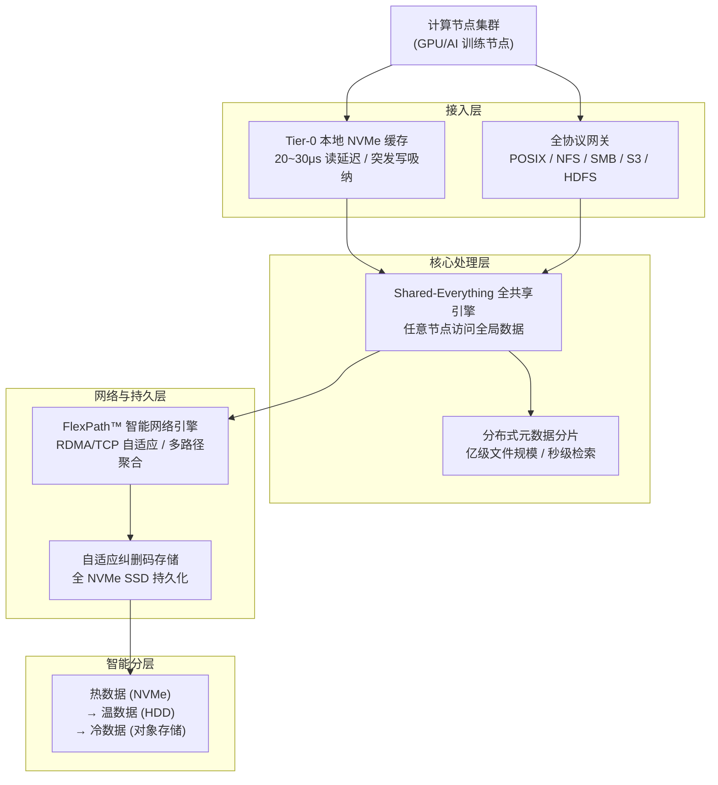
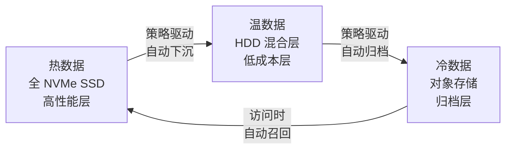
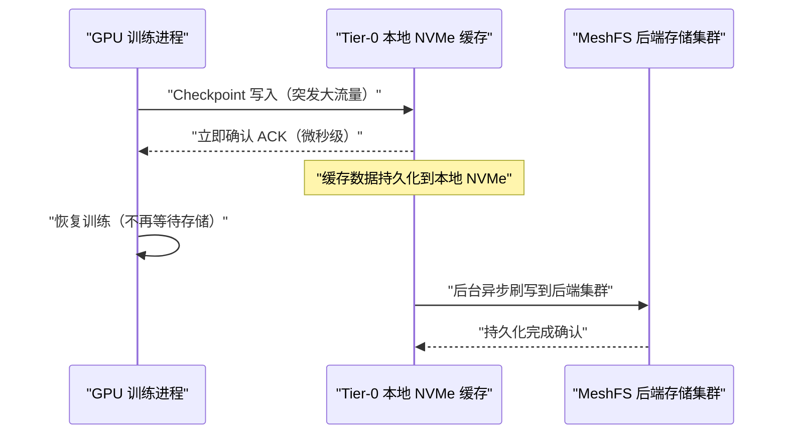

在大规模`AI`大模型训练场景中，存储系统的`I/O`性能往往是制约`GPU`利用率的核心瓶颈。随着`H100`、`H200`、`B200`等高端`GPU`算力的快速提升，传统存储架构的读写带宽已无法"喂饱"`GPU`，导致训练任务存在大量的"等数据"空窗期，造成算力的严重浪费。

`XSKY`（北京星辰天合科技股份有限公司）是中国领先的软件定义存储厂商，在`IDC`中国软件定义存储市场中位列`TOP 5`，在中国对象存储软件市场中排名第一（数据来源：`IDC China Software-defined Storage Market Overview 2025 Q4`）。基于十年分布式存储技术积累，`XSKY`推出了专为`AI`定义的高性能全闪存并行文件系统`MeshFS`（星飞并行文件存储），旨在打破存储`I/O`墙，以`TB/s`级聚合带宽与微秒级延迟为`GPU`算力集群构建极速数据通道。

本文将系统介绍`MeshFS`的技术方案、架构设计、核心组件、典型使用场景及优缺点，为在`AI`训练基础设施中评估`MeshFS`的技术团队提供参考。

## MeshFS概述

### 什么是MeshFS

`MeshFS`（星飞并行文件存储）是`XSKY`研发的商业高性能全闪存并行文件系统，全称为`Mesh File System`，定位为专为`AI`大模型训练、推理加速及大规模数据预处理而设计的高性能存储产品。

`MeshFS`基于`XSKY`自研的`XSEA`（`eXtreme Shared-Everything Architecture`，极速全共享架构）构建，充分利用`NVMe SSD`的高吞吐特性和`RDMA`网络（`InfiniBand`或`RoCE`）的低延迟、高带宽优势，提供微秒级`I/O`延迟和`TB/s`级聚合带宽，支持`POSIX`、`NFS`、`SMB`、`S3`及`HDFS`等多种存储协议，可无缝对接主流`AI`框架（`PyTorch`、`TensorFlow`）和云原生平台（`Kubernetes CSI`）。

### 核心性能指标

| 性能指标 | 规格 | 说明 |
|----------|------|------|
| 读延迟 | `20~30μs` | 使用`Tier-0`本地`NVMe`缓存时的极致读延迟 |
| `Checkpoint`写入 | 缩短`90%`时间 | 相较传统`NAS/SAN`存储的`Checkpoint`写入耗时 |
| 聚合带宽 | `TB/s`级 | 多节点并发访问时的总吞吐量 |
| 故障切换时间 | `100ms`内 | 基于`XSEA`的快速故障切换能力 |
| 协议支持 | `100% POSIX/S3/HDFS` | 全协议融合，零代码修改接入 |

### 产品定位与背景

`MeshFS`是`XSKY`"`星飞`"（`XINFINI`）系列产品家族中的核心成员，该家族还包括：

| 产品名称 | 定位 |
|----------|------|
| `MeshFS`（星飞并行文件存储） | 高性能全闪存训练文件系统 |
| `MeshFusion`（星飞推理存储系统） | 面向长上下文`AI`的"`持久化内存`" |
| `MeshSpace`（星飞数据湖） | `EB`级全局统一数据湖 |
| `AIMesh`（统一数据平台） | `AI`全流程数据协同平台 |

`MeshFS`专注于解决`AI`训练阶段的高性能存储瓶颈，与数据湖层（`MeshSpace`/`XEOS`）配合，构成从数据准备→训练→推理的完整存储链路。

## 架构设计

`MeshFS`采用三层分层架构设计，从上到下分别是接入层、核心处理层和网络与持久层，并在层间提供智能分层数据生命周期管理能力。

### 接入层：全协议融合与Tier-0缓存

接入层是计算节点与存储集群之间的第一道桥梁，承担两项核心职责：

**Tier-0近算缓存**

`MeshFS`在接入层引入了`Tier-0`近算缓存机制。具体实现方式是：利用训练计算节点本地安装的`NVMe SSD`构建一层持久化缓存，将数据访问延迟从网络传输的毫秒级压缩至`20~30μs`的本地`NVMe`访问级别。

`Tier-0`缓存在`Checkpoint`写入场景中具有尤为显著的价值。大规模`LLM`训练任务在保存模型检查点时，会产生短时间内数十至数百`GB`的突发写入流量。传统存储的写入带宽往往不足以及时吸纳此类峰值，导致`GPU`长时间等待写入完成（可达数分钟）。`Tier-0`缓存层可以在毫秒级内吸收这批突发数据，由后台进程异步将数据刷写到后端存储节点的持久层，从而将`GPU`的`Checkpoint`等待时间从分钟级压缩至秒级，据`XSKY`官方介绍，`Checkpoint`写入时间可缩短约`90%`。

**全协议互通**

接入层同时提供完整的多协议支持：

| 协议 | 适用场景 |
|------|----------|
| `POSIX` | 原生文件系统接口，适用于训练框架直接读写文件 |
| `NFS` | 跨平台网络文件共享 |
| `SMB` | `Windows`环境兼容 |
| `S3` | 数据湖数据接入，适用于数据清洗阶段 |
| `HDFS` | 大数据生态兼容 |

多协议互通的核心价值在于：同一份数据可以在数据清洗（`S3`接口）、模型训练（`POSIX`接口）、数据归档（对象存储接口）的全流程中零拷贝流动，彻底消除传统方案中因协议不兼容而导致的数据搬迁问题。

### 核心处理层：分布式元数据与全共享架构

核心处理层是`MeshFS`性能与扩展能力的关键所在，包含两项核心技术设计：`Shared-Everything`全共享架构和分布式元数据分片引擎。

**Shared-Everything全共享架构**

传统分布式并行文件系统通常采用`Shared-Nothing`架构，即每个存储节点独立管理一部分数据，节点之间在数据面不直接通信。这种设计在节点数量增多时，扩容收益会受到限制，且难以实现全局资源的均衡调度。

`XSKY`参考高端企业存储的`Shared-Everything`设计理念，结合其自身在分布式存储领域的实践经验，研发了`XSEA`（`eXtreme Shared-Everything Architecture`，极速全共享架构）。在`XSEA`架构下，集群中的每个存储节点均可直接访问池化的全局`SSD`资源，数据面完全共享，不存在数据分区的概念。

以下对比展示了两种架构的核心差异：

| 对比维度 | `Shared-Nothing` | `Shared-Everything`（XSEA） |
|----------|-----------------|------------------------------|
| 性能扩展 | 随节点增多，单节点瓶颈影响扩容收益 | 每个节点独立处理请求，性能随节点数线性扩展 |
| 资源分配 | 各节点容量与性能资源相互隔离，难以灵活调配 | 存储容量与性能资源与`CPU`、内存解耦，按需分配 |
| 调度视角 | 局部视角，各节点独立决策，全局调度能力弱 | 全局流控，具备集群级别的`I/O`负载均衡能力 |
| 故障切换 | 慢盘或节点故障时切换时间通常需要`5~10s` | 慢盘或节点故障时可在`100ms`内完成切换 |
| 资源利用率 | 初期规划需预留大量资源，存在浪费 | 全局统一利用，空间利用效率高 |

**分布式元数据分片**

`AI`训练场景中常见的元数据瓶颈主要体现在计算机视觉（`CV`）领域的海量小文件（如图片、视频帧）和`NLP`领域的大规模样本库上。传统并行文件系统的元数据服务通常是集中式或有限扩展的，在亿级文件规模下`open/stat/mkdir`等元数据操作的性能会显著下降。

`MeshFS`核心处理层采用分布式元数据分片设计，将元数据均匀分散存储在多个元数据节点上，支持亿级文件规模下的秒级检索。这对于`CV`领域单一数据集包含数十亿张图片的场景至关重要。

### 网络与持久层：FlexPath™智能网络与自适应EC

**FlexPath™智能网络引擎**

`FlexPath™`是`XSKY`专为`AI`大规模组网设计的智能网络引擎，具备以下核心能力：

| 能力 | 说明 |
|------|------|
| 多路径聚合 | 支持多块网卡、多条链路的带宽聚合，充分利用组网带宽 |
| `RDMA/TCP`自适应切换 | 根据网络环境自动选择`RDMA`（`InfiniBand`或`RoCE`）或`TCP`传输协议 |
| 毫秒级故障恢复 | 链路故障时可在毫秒级内完成路径切换，不中断正在进行的`I/O` |
| 一跳直读（`Direct Read`） | 客户端直接从存储节点读取数据，绕过中间转发节点 |

其中，"一跳直读"（`Direct Read`）是`FlexPath™`的关键设计。在传统并行文件系统中，客户端读取数据通常需要先请求元数据服务确认数据位置，再向存储节点发起读请求，中间可能还经过代理或转发节点。`MeshFS`的`Direct Read`机制允许客户端在掌握数据位置信息后，直接与对应存储节点建立`RDMA`连接进行数据传输，相比传统并行文件系统可减少`50%`以上的读写开销。

**自适应纠删码（EC）**

持久层采用全`NVMe SSD`介质，通过自适应纠删码（`Erasure Coding`，`EC`）技术实现数据冗余保护。相较于传统的三副本方案，`EC`在保证可靠性的前提下显著提升了存储空间利用率。

`XSKY`在`XSEA`架构设计目标中明确提出三项"100"指标：

- `100ms`故障切换时间（基于`Shared-Everything`全共享数据存储）
- `100%`得盘率（基于单层`TLC NVMe SSD`闪存介质管理）
- `100μs`超低延迟（基于端到端`NVMe`路径最大化硬件卸载）

### 智能分层：热温冷数据全生命周期管理

`MeshFS`提供基于策略的自动数据分层（`Tiering`）能力，支持在以下层级间自动流转数据：

当数据被访问时，系统自动将其从低速层召回至高速层，整个过程对上层应用透明，保留完整的目录结构和文件语义。这一设计实现了"全闪存性能 + 对象存储成本"的最优组合，通过仅将热数据（约`20%`的容量）保留在`NVMe`层，即可享受近乎`100%`全闪存的性能体验。

## 核心组件详解

### 接入层客户端

`MeshFS`客户端部署在计算节点上，提供以下访问路径：

**POSIX客户端**：通过内核文件系统挂载或`FUSE`用户态文件系统挂载，向`AI`训练框架（`PyTorch DataLoader`等）提供标准文件接口。现有代码无需修改即可接入。

**S3网关**：`MeshFS`内嵌`S3`网关组件，允许数据预处理阶段以`S3`接口将数据写入，训练阶段再以`POSIX`接口读取，消除数据在对象存储与文件系统之间的搬迁。

**CSI驱动**：为`Kubernetes`提供标准的`CSI`（`Container Storage Interface`）接口，支持训练`Pod`以`PersistentVolumeClaim`方式动态申请`MeshFS`存储卷，与云原生`AI`训练调度平台（如`Kubeflow`、`Ray`等）无缝集成。

### 元数据服务

元数据服务负责管理文件系统的命名空间，包括目录树结构、文件`inode`、权限信息及数据块位置索引。

`MeshFS`采用分布式元数据分片设计，元数据按照目录或文件`inode`哈希规则分散至多个元数据节点，具备以下特性：

- **水平扩展**：元数据节点可随业务增长独立扩容，元数据吞吐随节点数线性增长，无单节点瓶颈
- **亿级文件支持**：专为`CV`图片库等海量小文件场景优化，在亿级文件规模下`open/stat/readdir`等操作保持稳定性能
- **目录分片感知**：对于单个超大目录（如包含数十亿个文件的训练集根目录），支持跨多元数据节点分片，避免单目录热点

### 存储服务节点

每个存储节点管理本地`NVMe SSD`阵列，通过`RDMA`网络向客户端提供数据读写服务。在`XSEA`的`Shared-Everything`架构下，所有存储节点共同构成一个统一的存储池，客户端通过`FlexPath™`引擎的直读机制（`Direct Read`）可以访问集群中任意存储节点上的数据。

存储节点的主要职责包括：

| 职责 | 说明 |
|------|------|
| 数据持久化 | 管理本地`NVMe SSD`，负责数据的写入、读取和校验 |
| 纠删码计算 | 在写入路径上执行`EC`编码，在故障场景下执行数据重建 |
| `RDMA`数据传输 | 通过`RDMA`与客户端建立零拷贝数据通道 |
| 故障自愈 | 检测慢盘/故障盘，触发数据重建和负载迁移 |

### FlexPath™智能网络引擎

`FlexPath™`是`MeshFS`的核心网络传输组件，以独立模块形式存在，解耦了存储逻辑与网络传输逻辑。

`FlexPath™`的关键设计如下：

**自适应协议栈**：支持`RDMA over InfiniBand`和`RDMA over Converged Ethernet`（`RoCE`）两种`RDMA`协议，以及`TCP`协议回退。在有`RDMA`网络的环境中自动启用`RDMA`模式，在普通以太网环境中回退至`TCP`模式，同一套客户端代码无需修改即可适配不同网络基础设施。

**多路径负载均衡**：在客户端配备多块网卡或存储节点有多条上行链路时，`FlexPath™`可以将`I/O`流量均匀分配到多条物理路径上，充分利用可用带宽。

**毫秒级故障探测与恢复**：`FlexPath™`持续探测网络路径的健康状态，在检测到链路故障或性能劣化时，可以在毫秒级内将流量切换到备用路径，`I/O`请求透明重试，对上层应用不可见。

### Tier-0缓存子系统

`Tier-0`缓存是`MeshFS`的近算加速层，部署在计算节点本地。与传统的内存缓存不同，`Tier-0`缓存基于本地`NVMe SSD`构建，因此具备持久化特性——即便节点意外重启，缓存中的数据不会丢失，这对于`Checkpoint`写入场景尤为重要（缓存的模型权重数据在节点恢复后仍可继续刷写到后端存储）。

`Tier-0`缓存的工作机制如下：

读取路径同样经过`Tier-0`缓存：训练任务加载训练数据时，首次读取从后端存储拉取并缓存到本地`NVMe`；后续迭代（同一训练样本在多个`epoch`中被重复访问）直接命中本地缓存，延迟从网络级降至`20~30μs`。

### 智能分层管理服务

智能分层管理服务是运行在存储集群后台的数据流动引擎，负责根据配置策略（如访问频率、数据年龄、容量水位）识别热/温/冷数据，并驱动数据在`NVMe`层、`HDD`层和对象存储层之间自动迁移。

分层操作保留完整的目录结构和文件语义，对上层训练框架完全透明。当冷数据被访问时，系统自动触发召回操作，将数据从低速层加载回`NVMe`层，整个过程无需人工干预。

## 典型使用场景

### LLM大模型训练：Checkpoint加速

**问题描述**：大规模`LLM`训练任务（如千亿参数模型）在每个`Checkpoint`保存时，需要将全量模型参数同步写入存储，数据量通常为数十`GB`至数`TB`，且所有`GPU`节点并发写入，形成极高的瞬时写入峰值。传统存储方案的带宽不足以吸纳这一峰值，导致训练任务暂停数分钟等待写入完成。

**MeshFS解决方案**：接入层的`Tier-0`缓存可以在毫秒级内吸收全部`Checkpoint`突发流量，立即向训练框架返回写入成功的确认，`GPU`集群随即恢复训练；后台异步线程将缓存数据通过`FlexPath™ RDMA`通道刷写到后端`NVMe`存储集群。官方介绍`Checkpoint`写入时间可缩短约`90%`。

### 自动驾驶：海量小文件处理

**问题描述**：自动驾驶训练数据集通常包含每天数百`TB`的雷达点云、视觉传感器图像和视频帧，文件数量达到数十亿级别，单个文件大小从几`KB`到几`MB`不等。数据需要经历采集→清洗→标注→训练的完整处理链路，各阶段使用的存储接口不同（`S3`用于数据湖，`POSIX`用于训练）。

**MeshFS解决方案**：通过全协议融合接入层，`S3`接口接收传感器原始数据写入存储集群，`POSIX`接口供训练框架直接读取，全流程数据无需复制搬迁。分布式元数据分片引擎保证在亿级文件规模下元数据操作的高吞吐，消除文件目录遍历瓶颈。

### 生命科学与基因测序

**问题描述**：基因组数据分析场景中存在大文件（测序仪输出的`FASTQ`文件，单文件可达数十`GB`）与小文件（基因特征图谱）并存的混合负载，既需要高吞吐顺序写（采集阶段），又需要高`IOPS`随机读（分析阶段）。

**MeshFS解决方案**：`XSKY`介绍，其自适应条带化技术可同时优化大文件顺序`I/O`和小文件随机`I/O`性能，使同一套存储集群能够满足测序仪写入与下游分析计算的读取需求，无需为不同业务单独采购存储。

## 与其他方案的定位对比

| 对比维度 | `MeshFS` | `Lustre` | `3FS`（`DeepSeek`） | `BeeGFS` |
|:----------:|---------|---------|---------------------|---------|
| **开源情况** | 商业软件 | `GPL v2`开源 | `MIT`开源 | 社区版免费 |
| **主要用户** | 智算中心、国内`AI`厂商 | `HPC`超算中心 | `DeepSeek`内部及开源用户 | 科研`HPC` |
| **`RDMA`支持** | 原生支持（`FlexPath™`） | 支持（`IB/RoCE`） | 原生支持 | 支持 |
| **元数据架构** | 分布式分片 | `MDS/MDT`集群 | 无状态`+FoundationDB` | 分布式 |
| **故障切换时间** | `100ms`级（`XSEA`） | 秒级 | 秒级 | 秒级 |
| **协议兼容性** | `POSIX/NFS/SMB/S3/HDFS` | `POSIX` | `POSIX` | `POSIX` |
| **适配信创环境** | 支持国产`CPU`/`OS` | 一般 | 无专项适配 | 一般 |
| **运维复杂度** | 商业支持，配有管理界面 | 较高 | 较高 | 中等 |

## 优缺点分析

### 优点

- **全协议融合，消除数据孤岛**：原生支持`POSIX`、`S3`、`HDFS`等多种协议，同一份数据可在数据清洗、训练、归档全流程中流动，无需跨系统搬迁，这是`MeshFS`相比`Lustre`、`BeeGFS`等传统并行文件系统最显著的差异化能力之一。

- **Tier-0缓存大幅提升Checkpoint效率**：持久化近算缓存解决了大规模训练任务`Checkpoint`的峰值带宽问题，使`GPU`集群能快速从`Checkpoint`中断中恢复训练，对大规模`LLM`训练场景价值突出。

- **XSEA架构实现快速故障切换**：`100ms`级故障切换时间（相较`Shared-Nothing`架构的`5~10s`）对于长时间运行的`AI`训练任务具有重要意义，能有效降低存储异常对训练稳定性的影响。

- **多协议接入与Kubernetes集成**：提供`CSI`驱动，支持云原生训练平台开箱即用，与`Kubeflow`、`Ray`等主流`AI`训练调度框架原生兼容，降低云原生场景的集成成本。

- **国产信创适配**：完全自主研发，支持海光、鲲鹏等国产`CPU`及国产操作系统，满足有信创合规要求的智算中心建设需求。这是国际开源方案（`3FS`、`Lustre`）通常不具备的差异化能力。

- **智能分层降低TCO**：通过热温冷数据自动分层，可以用`20%`的`NVMe`全闪容量成本覆盖`80%`的热数据访问需求，其余`80%`数据存储在成本更低的介质上，整体降低存储`TCO`。

### 局限与注意事项

- **商业软件，闭源**：`MeshFS`为商业产品，不开源。与`3FS`（`MIT`开源）、`Lustre`（`GPL`开源）等方案相比，用户无法自行审查源码、参与社区开发或进行深度定制，存在一定的供应商依赖风险。

- **实测性能数据公开有限**：目前`XSKY`官方公布的性能数据主要来自营销材料（如"缩短`90%` Checkpoint写入时间"），独立第三方的系统性基准测试数据尚不丰富，建议在实际采购前进行`POC`（概念验证）测试以评估真实性能。

- **需要全`NVMe`硬件支撑**：`MeshFS`的高性能表现依赖全`NVMe SSD`存储节点和`RDMA`网络基础设施，硬件初始投入较高。对于预算有限或已有大量`HDD`存储资产的用户，需要评估硬件改造成本。

- **运维体系依赖商业支持**：`MeshFS`提供统一的管理界面和商业技术支持，但深度运维能力高度依赖厂商。与成熟的开源社区方案相比，运维人才培养和问题排查在一定程度上受限于厂商的支持响应。

## 参考资料
- `XSKY`官网产品页面：[https://www.xsky.com/products/mesh-fs](https://www.xsky.com/products/mesh-fs)
- `XSEA`星海架构介绍：[https://www.xsky.com/products/xsea](https://www.xsky.com/products/xsea)
- `XScale`元数据引擎：[https://www.xsky.com/products/x-scale](https://www.xsky.com/products/x-scale)
- `XSKY`文档中心：[https://docs.xsky.com/](https://docs.xsky.com/)
