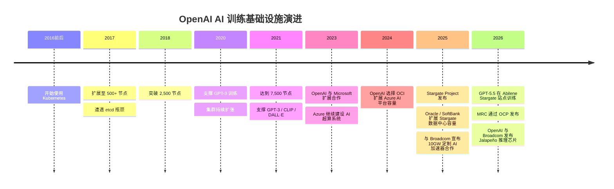
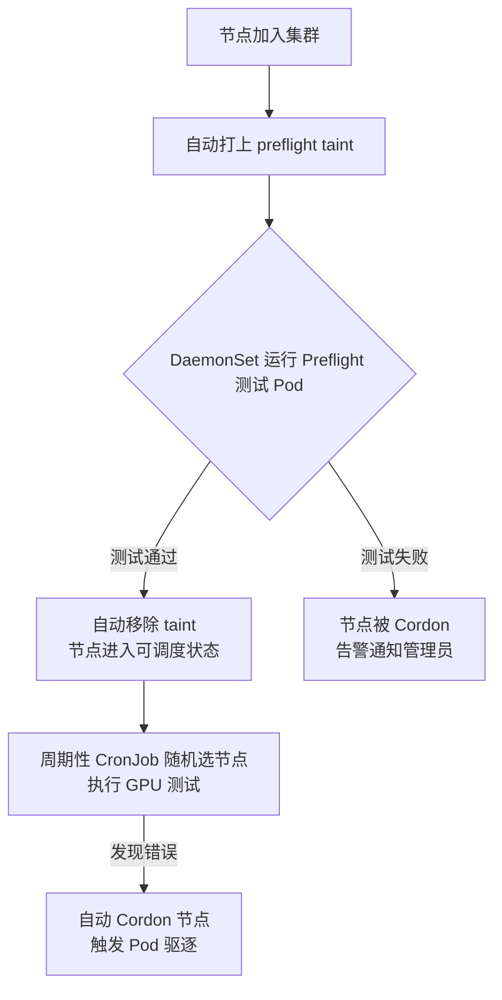
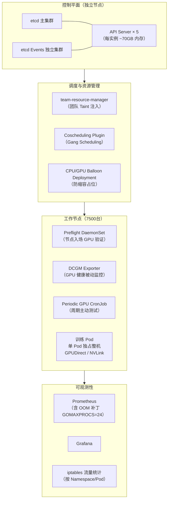

自`2016`年前后起，`OpenAI`便开始基于`Kubernetes`（`K8S`）构建其`AI`研究基础设施，并将集群规模逐步从数百节点扩展至`7500`个节点，先后支撑了`GPT-3`、`CLIP`、`DALL·E`等大规模模型的训练。`2021`年之后，`OpenAI`公开资料的重点逐渐从`Kubernetes`控制平面扩展转向更大规模的算力供给、超算网络可靠性和推理效率：包括`Azure`与`OCI`容量扩展、`Stargate`基础设施项目、与多家硬件和云厂商合作开发的`MRC`（`Multipath Reliable Connection`）网络协议，以及与`Broadcom`合作的`Jalapeño`推理芯片。

大多数团队在建设`AI`训练集群时，不可能像`OpenAI`一样一步到位地投入超算级资源，而是从小规模`Kubernetes`集群起步，随着业务增长逐步扩容。`OpenAI`走过的弯路——`etcd`打满、`API Server`内存爆炸、网络性能折损、`GPU`悄无声息地坏掉——恰恰是每个处于扩容阶段的团队都会面临的真实问题。本文基于`OpenAI`历年官方博客和公开技术文章，系统梳理其选择`Kubernetes`的决策逻辑、规模扩张中的技术挑战与工程解法，为有意构建或扩展`AI`训练集群的团队提供有据可查的实践参考。

## 为什么选择Kubernetes而非Slurm

在`AI`训练领域，`Slurm`是高性能计算（`HPC`）社区最广泛使用的作业调度框架，拥有几十年的成熟积累。相较于传统`HPC`作业调度体系，`OpenAI`官方文章强调`Kubernetes`更适合其研究实验的快速迭代和工程扩展需求，其核心原因如下。

### 研究迭代速度优先

`OpenAI`的主要工作性质是**基础研究**，工作负载持续变化。研究人员每天都在尝试新的模型结构、训练方案和并行策略，对基础设施的要求不是极致的调度效率，而是**快速迭代、低操作摩擦、灵活适应**。`Kubernetes`在这些方面提供了显著优势：

- **容器化统一了依赖管理**：每个实验的运行时依赖（`Python`版本、`CUDA`版本、依赖库）均封装在镜像中，研究员无需与集群管理员协商软件环境。
- **声明式`API`降低了接入门槛**：研究人员通过`YAML`描述计算需求，无需学习`Slurm`复杂的`sbatch`脚本和分区策略。
- **生态丰富**：监控（`Prometheus`/`Grafana`）、日志（`Fluentd`）、存储（`PersistentVolume`）等云原生生态可直接复用。

官方博客原文表述如下：

> Kubernetes provides a fast iteration cycle, reasonable scalability, and a lack of boilerplate which makes it ideal for most of our experiments.

### 云原生与多租户支撑

`OpenAI`公开文章中的最大`Kubernetes`集群运行在`Azure`云上，同时也提到团队运行过其他云上和物理硬件集群。后续网络实践中，`OpenAI`使用`Azure VMSS`（虚拟机扩缩容组）的原生`Pod`网络能力和对应`CNI`插件；在资源隔离上，则通过`Namespace`和`Taint/Toleration`等机制支撑多团队使用。

### 工作负载特征适配

`OpenAI`的工作负载有几个区别于典型企业`Kubernetes`使用场景的特点，这些特点恰好规避了`Kubernetes`在通用场景下的弱点：

| 特征 | 说明 |
|------|------|
| **单`Pod`独占整机** | 大型训练任务每个`Pod`占满一整台节点，避免了`NUMA`/`CPU`争用和碎片化 |
| **全平分带宽网络** | 集群拥有全`bisection bandwidth`，无需拓扑感知调度 |
| **少量超大型任务** | 调度压力呈脉冲式，并发任务数相对有限 |
| **`Blob`存储为主** | 数据集和`Checkpoint`直接读写对象存储，减少了对分布式文件系统的依赖 |

这些特征让`Kubernetes`调度器的压力远低于通常预期，使得`K8S`在该场景下运行得相当稳定。

### OpenAI AI 训练基础设施演进

`OpenAI`公开披露的`AI`训练基础设施经历了以下主要阶段：



## 遭遇的挑战与解决方案

### etcd扩展性问题

**问题描述：** 集群超过`500`个节点后，研究人员开始频繁遇到`kubectl`命令超时。增加`kube-apiserver`副本数只能暂时缓解，并非治本之策。

**根因排查：** 通过`Prometheus`监控和`audit-log`发现，`etcd`的写入延迟飙升至数百毫秒。虽然节点使用了`P30 SSD`（理论`5000 IOPS`），但`etcd`是顺序`I/O`模式，受写入延迟限制，实际只使用了约`10%`的可用`IOPS`。

**解决方案：**

| 阶段 | 问题 | 解决方案 |
|:------:|------|----------|
| <span style={{whiteSpace: 'nowrap'}}> `500`节点</span> | 网络`SSD`延迟`2ms` | 将`etcd`目录迁移至本机`SSD`（`200µs`延迟） |
| <span style={{whiteSpace: 'nowrap'}}> `1000`节点</span> | `kube-apiserver`读取`etcd`超`500MB/s` | 降低`Fluentd`/`Datadog`对`apiserver`的轮询频率 |
| <span style={{whiteSpace: 'nowrap'}}> `1000`节点</span> | `Kubernetes Events`写入高峰冲击主`etcd` | 将`Events`独立存放到单独的`etcd`集群 |
| <span style={{whiteSpace: 'nowrap'}}> `1000`节点</span> | `etcd`触达`2GB`硬存储上限导致级联故障 | 通过`--quota-backend-bytes`扩大存储限制；自动扩缩容器增加安全检查 |

将`Events`拆分到独立`etcd`集群的配置方式如下：

```bash
--etcd-servers-overrides=/events#https://etcd0.example.com:2381;https://etcd1.example.com:2381;https://etcd2.example.com:2381
```

### API Server内存压力

**问题描述：** 在`7500`节点规模下，每个`API Server`进程堆内存使用量高达`70GB`。

**根因分析：** `API Server`内存消耗与集群节点数线性增长。同时，对`kubelet`、`node-exporter`等覆盖所有节点的`Service`的`Endpoints` `WATCH`操作会在节点增删时触发 `$O(N^2)` 级别的通知风暴，在高峰期带宽超过`1GB/s`。

**解决方案：** 升级至`Kubernetes 1.17`后启用`EndpointSlices`，将`WATCH`带宽压力降低了 **`1000`倍** 。同时，`OpenAI`对所有`DaemonSet`避免直接交互`API Server`，对确实需要节点级`WATCH`的场景引入中间缓存层（如`Datadog Cluster Agent`模式）。

### 网络性能瓶颈

**2500节点阶段 —— Flannel性能不足：**

直接机器间带宽为`10-15Gbit/s`，但`Flannel`封装后`Pod`间带宽只有约`2Gbit/s`。短期解决方案是为通信密集型`Pod`设置`hostNetwork: true`和`dnsPolicy: ClusterFirstWithHostNet`，绕过`Flannel`。

**7500节点阶段 —— 改用原生网络：**

随着集群规模扩大（约`200,000`个`IP`地址），`Flannel`路由方案面临路由数量限制。`OpenAI`切换至`Azure VMSS`原生`Pod`网络和对应的`CNI`插件，实现了`Pod`与宿主机网络同等的吞吐量。避免封装带来的额外好处包括：

- 无`MTU`碎片化问题
- 网络策略和流量监控更直观
- 支持灵活叠加`VPN`/隧道

同时，`OpenAI`使用`iptables mangle`规则对流量打标，结合开源`iptables-exporter`接入`Prometheus`，实现按`Namespace`和`Pod`级别的网络用量可视化。

### 镜像拉取问题

`Dota`项目的容器镜像约`17GB`。在没有镜像缓存的新节点上，`OpenAI`观察到该镜像经常需要约`30`分钟才能完成拉取和解压，导致`Pod`长时间停留在`Pending`状态；更麻烦的是，`kubelet`默认串行拉取镜像，使这个大镜像会阻塞同节点上的其他镜像拉取。`OpenAI`通过以下方式系统性解决了镜像拉取问题：

| 措施 | 效果 |
|------|------|
| `--serialize-image-pulls=false` + 切换`overlay2` | 多镜像并发拉取，不再互相阻塞 |
| 将`Docker root`移至本机`SSD` | 拉取和解压速度大幅提升 |
| `--image-pull-progress-deadline=30m` | 避免大镜像拉取、解压或排队时间过长时被误判为无进度失败 |
| `max-concurrent-downloads=10` | 提高并行拉取队列吞吐量 |
| 基础设施镜像预加载进`VM`镜像 | 消除`gcr.io`配额限制和冷启动延迟 |

### ARP缓存溢出

**问题描述：** `Pod`数量增多后，`DNS`解析间歇性失败，`dmesg`日志出现`neighbor table overflow!`。

**根因分析：** `Kubernetes`中每个`Pod`都有独立`IP`，大集群中`ARP`缓存条目数量远超内核默认限制。

**解决方案：** 将节点`sysctl`阈值从`Linux`常见默认值（`gc_thresh1=128`、`gc_thresh2=512`、`gc_thresh3=1024`）大幅调高：

```bash
# 邻居表条目数低于该值时，内核通常不会主动触发垃圾回收。
net.ipv4.neigh.default.gc_thresh1 = 80000

# 邻居表条目数超过该值后，内核会更积极地回收旧条目。
net.ipv4.neigh.default.gc_thresh2 = 90000

# 邻居表硬上限；超过该值后，新邻居条目可能无法创建，并出现 neighbor table overflow!。
net.ipv4.neigh.default.gc_thresh3 = 100000
```

这些参数控制的是`Linux IPv4 neighbor table`，不只包括传统`ARP`条目，也包括`Kubernetes`节点上`Pod`与节点通信过程中产生的邻居表项。这也是`HPC`集群中的常见调优项，在`Pod`数量多的`Kubernetes`场景下同样适用。

需要注意的是，不同发行版或云厂商镜像可能会调整默认值，生产环境应以节点上实际`sysctl net.ipv4.neigh.default.gc_thresh*`输出为准。

### 监控系统Prometheus扩展问题

**问题描述：** 集群规模增大后，`Prometheus`内存持续增长直至`OOM`崩溃；崩溃后重放`WAL`（Write-Ahead-Log）需要数小时才能恢复服务。

**根因与解决方案：**

| 问题 | 根因 | 解决方案 |
|:------:|------|----------|
| <span style={{whiteSpace: 'nowrap'}}> `OOM`崩溃 </span> | `Grafana`调用`/api/v1/series?{le!=""}`导致`Prometheus`无限消耗内存 | `OpenAI`向`Prometheus`提交补丁，为该`API`强制加上`Context`超时 |
| <span style={{whiteSpace: 'nowrap'}}> `WAL`重放慢 </span> | `Prometheus`并发重放时过度使用所有`CPU`核心，在高核数服务器上因锁争用性能崩溃 | 设置`GOMAXPROCS=24`限制并发度，重放速度显著提升 |
| <span style={{whiteSpace: 'nowrap'}}> 指标数据过多 </span> | `kube-prometheus`默认采集了大量不实际使用的细粒度指标 | 通过`Prometheus relabel_config`规则丢弃不需要的指标 |

## 创新工程实践

除了解决上述问题，`OpenAI`还构建了多项具有行业参考价值的创新机制。

### GPU健康检测：Preflight系统

**问题背景：** `GPU`故障不总是以`DCGM`可以捕捉的错误码形式出现，部分`GPU`问题需要独占运行测试程序才能发现。

**架构设计：**



**被动健康检测（Passive Healthcheck）：** 持续运行的后台检测，包含：
- 基础系统资源（网络可达性、磁盘健康）
- `GPU XID`错误（通过`DCGM`导出`DCGM_FI_DEV_XID_ERRORS`指标进入`Prometheus`）
- 云厂商维护事件（`VM`即将重启或迁移的预警）

检测到异常时自动`Cordon`节点，严重故障则触发`Pod`驱逐。超过`7`天`SLA`后强制销毁虚拟机。

**主动`GPU`测试（Active GPU Test）：** 节点首次启动时运行完整`GPU`验证套件（`Preflight`），确保硬件和驱动行为符合预期。此后通过`CronJob`周期性对随机节点进行抽样测试，覆盖`DCGM`无法捕捉的潜在问题。

### 团队资源管理：Team Taint机制

**问题背景：** `Kubernetes`原生没有类似`Slurm`的公平调度队列机制，研究团队难以公平获取所分配的算力配额。

**解决方案：** 开发`team-resource-manager`服务，基于`ConfigMap`中声明的`(节点选择器, 团队标签, 配额数量)`三元组，动态为节点打上`openai.com/team=<teamname>:NoSchedule`的`Taint`。结合`Admission Webhook`，在作业提交时自动按提交者的团队成员身份注入对应的`Toleration`，实现了轻量级的多团队隔离。

低优先级的跨团队借用容量也得以支持：低优先级`Pod`携带`any`容忍度，可以调度到任意团队的节点上，但正式作业可随时抢占。

### 气球部署：防止空闲节点被缩容

**问题背景：** `OpenAI`使用`cluster-autoscaler`动态扩缩容，但空闲节点会被自动缩容，而`VM`重新启动需要较长时间（冷启动延迟），影响作业快速调度。

**解决方案：** 为`CPU`和`GPU`主机各创建一个"`Balloon Deployment`"，副本数等于集群最大容量，每个副本是一个低优先级、占位`Pod`，确保自动扩缩容器认为所有节点均处于使用状态而不触发缩容。当真实作业到来时，调度器直接抢占并驱逐这些低优先级气球`Pod`。

**关键细节：** 使用`Deployment`而非`DaemonSet`（避免被计为节点活跃负载），并配置`Pod anti-affinity`确保气球`Pod`均匀分布到所有节点上。

### 协同调度：解决Gang Scheduling死锁

**问题背景：** `MPI`训练任务要求`StatefulSet`中所有成员`Pod`同时运行才能开始工作。若两个作业各自申请`100%`集群容量，`Kubernetes`默认调度器可能各调度一半，导致双方都无法运行，陷入死锁。

**解决方案：** 采用`Kubernetes 1.18`引入的调度器插件架构，集成[Coscheduling Plugin](https://github.com/kubernetes/enhancements/pull/1463)，实现`Gang Scheduling`语义：只有当一个作业的所有`Pod`都能被调度时，才实际调度该作业，否则等待。这避免了资源被部分占用导致的全局死锁。

## 架构全景回顾

下图展示了`OpenAI`在`7500`节点规模下`Kubernetes`集群的核心架构与创新组件分布：



## 关键经验总结

`OpenAI`的`Kubernetes`大规模实践为业界提供了以下值得借鉴的经验：

| 领域 | 核心经验 |
|:------:|----------|
| **存储** | `etcd`必须使用本机`SSD`，`Events`应独立集群，及时扩大存储配额 |
| **`API Server`** | `EndpointSlices`是大集群必备，避免`DaemonSet`直接监听`API Server` |
| **网络** | 在大规模场景下原生`Pod`网络优于`Overlay`，调整`ARP`缓存阈值 |
| **监控** | `Prometheus`需限制`/api/v1/series`资源消耗，控制`GOMAXPROCS` |
| **`GPU`管理** | 结合被动（`DCGM`）和主动（`Preflight`/`CronJob`）检测，节点入场验证不可省略 |
| **资源隔离** | `Team Taint`比`ResourceQuota`更灵活，适合研究型多团队场景 |
| **调度稳定性** | `Gang Scheduling`是多`Pod`协作训练任务的刚需，避免资源死锁 |
| **弹性扩缩容** | 气球部署可有效防止自动缩容引入的`VM`冷启动延迟 |


## 参考资料

- [OpenAI - Scaling Kubernetes to 2,500 nodes（2018）](https://openai.com/index/scaling-kubernetes-to-2500-nodes/)
- [OpenAI - Scaling Kubernetes to 7,500 nodes（2021）](https://openai.com/index/scaling-kubernetes-to-7500-nodes/)
- [OpenAI - OpenAI and Microsoft extend partnership（2023）](https://openai.com/index/openai-and-microsoft-extend-partnership/)
- [Oracle - OpenAI Selects Oracle Cloud Infrastructure to Extend Microsoft Azure AI Platform（2024）](https://www.oracle.com/news/announcement/openai-selects-oracle-cloud-infrastructure-to-extend-microsoft-azure-ai-platform-2024-06-11/)
- [OpenAI - Announcing the Stargate Project（2025）](https://openai.com/index/announcing-the-stargate-project/)
- [OpenAI - Stargate advances with 4.5 GW partnership with Oracle（2025）](https://openai.com/index/stargate-advances-with-partnership-with-oracle/)
- [OpenAI - OpenAI, Oracle, and SoftBank expand Stargate with five new AI data center sites（2025）](https://openai.com/index/five-new-stargate-sites/)
- [OpenAI - OpenAI and Broadcom announce strategic collaboration（2025）](https://openai.com/index/openai-and-broadcom-announce-strategic-collaboration/)
- [OpenAI - Building the compute infrastructure for the Intelligence Age（2026）](https://openai.com/index/building-the-compute-infrastructure-for-the-intelligence-age/)
- [OpenAI - Introducing GPT-5.5（2026）](https://openai.com/index/introducing-gpt-5-5/)
- [OpenAI - Supercomputer networking to accelerate large scale AI training: MRC（2026）](https://openai.com/index/mrc-supercomputer-networking/)
- [OpenAI - MRC技术论文: Resilient AI Supercomputer Networking using MRC and SRv6](https://cdn.openai.com/pdf/resilient-ai-supercomputer-networking-using-mrc-and-srv6.pdf)
- [OpenAI - OpenAI and Broadcom Jalapeño inference chip（2026）](https://openai.com/index/openai-broadcom-jalapeno-inference-chip/)
- [Kubernetes EndpointSlices](https://kubernetes.io/docs/concepts/services-networking/endpoint-slices/)
- [NVIDIA DCGM Exporter](https://github.com/NVIDIA/gpu-monitoring-tools#dcgm-exporter)
- [Kubernetes Coscheduling Plugin](https://github.com/kubernetes/enhancements/pull/1463)
- [iptables-exporter](https://github.com/madron/iptables-exporter/)
