如果你用过`ChatGPT`、`Claude`、`Qwen`，或任何一个现代大语言模型，你已经在用`Transformer`。它是这些模型的共同骨架。弄清每个部件在算什么、为什么要这样算，再去读论文和模型卡会容易很多。

本文从循环神经网络的限制讲起，拆开`Transformer`的整体结构、自注意力公式的几何含义、训练和推理的差别，以及后来的大模型改了哪些部件。

:::tip 前置知识
本文讲解`Transformer`架构。建议先了解神经网络、参数、权重和偏置，可以先看 [AI模型与机器学习](./1000-AI模型与机器学习.md)。
:::


## 为什么需要`Transformer`

`Transformer`出现之前，处理词序列最常用的神经网络是**循环神经网络**（`RNN`，`Recurrent Neural Network`），以及它的改进型**长短期记忆网络**（`LSTM`）。

### 什么是`RNN`：串行接力跑

`RNN`的设计非常符合人类从左到右阅读文本的直觉：它拥有一个内部「记忆」（称为隐状态`Hidden State`）。每处理一个词，它都会把当前词的信息与上一步沉淀下来的「记忆」混合，产生新的记忆传递给下一步，形成一条不断流转的记忆链条。

可以把它想成接力跑：第一个人读到「我」，把重点写在一张便签上交给第二个人；第二个人读到「爱」，在便签上补充内容，再交给第三个人。每个人都只能接到上一棒的便签，不能直接翻看整句话。

神经机器翻译早期常用 **`Seq2Seq`（编码器-解码器）**：编码器读完整句，解码器再逐词写出译文。

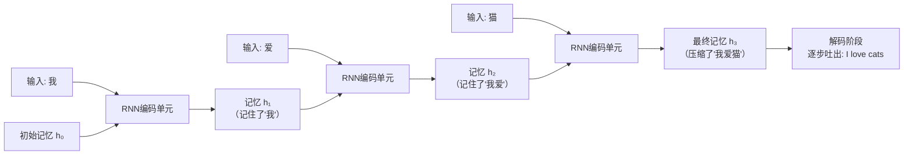

以翻译「我爱猫」为例：
- **第1步**：读入「我」，结合初始状态生成`h₁`（记住了「我」）；
- **第2步**：读入「爱」，结合`h₁`生成`h₂`（记住了「我爱」）；
- **第3步**：读入「猫」，结合`h₂`生成`h₃`（将整句信息强行压缩进一个固定长度的向量`h₃`中）；
- **解码阶段**：解码器仅凭借这一团被高度压缩的`h₃`，逐步推导生成「I」「love」「cats」。

短句上这样还能译。句子变长以后，有两件事会卡住。

### `RNN`的两个瓶颈


1. **时间维必须串行**。第`t`步要等第`t-1`步的隐状态算完，序列这一维展不开。一个时间步内部的矩阵乘法，以及一个`batch`里的许多句话，`GPU`仍然可以并行。句子越长，要依次等待的步数就越多，训练也就越慢。
2. **信息要沿时间一步步传**。朴素`RNN`里，早先的信息会在连乘中很快变淡，有点像传话游戏。`LSTM`用细胞状态把这条路留得更久，遗忘没那么快，但路径长度仍然随距离增长。另一件事出在早期`Seq2Seq`：无论句子多长，编码器最后只交出一个固定长度的向量，解码器只能靠它来生成。例如「我昨天在巴黎的旧书摊上挑了一本关于古希腊历史的书」，「挑」和「书」之间大约隔了六七个词，信息要走过这么多步才对得上。

这两个瓶颈可以用“只有一条传送带的仓库”来理解：货物必须按顺序经过每个工位，最后还要把整批货压进一个箱子。箱子太小，细节会丢；工位太多，等待时间也会变长。

### 《`Attention Is All You Need`》

`2014` 年的[Bahdanau 注意力论文](https://arxiv.org/abs/1409.0473)已经让解码器在生成每个词时回看编码器各步的隐状态，固定向量这个瓶颈因此松动了。编码器和解码器内部仍是`RNN`，时间维还是串行的，注意力套在`RNN`外面。

`2017` 年，`Google`的团队发表了《[Attention Is All You Need](https://arxiv.org/abs/1706.03762)》。模型去掉循环和卷积，用自注意力、前馈网络、残差和层归一化来处理序列。

既然逐步传递这么慢，为什么不让序列里的所有词**在同一次计算里互相看一看**？这就是 **自注意力机制（`Self-Attention`）**。

| 核心特性 |`RNN`/`LSTM`|`Transformer`|
| :--- | :--- | :--- |
| **计算方式** | 时间维上逐步计算。步内的矩阵运算，以及`batch`里的多条样本，仍然可以并行 | **训练时整段序列一次算完**。编码器里每个词都能看见左右两侧；解码器用因果掩码，一次前向得到每个位置的损失<br/>**生成时逐词自回归**，用`KV Cache`避免重算历史 |
| <span style={{whiteSpace: 'nowrap'}}><strong>长距离依赖</strong></span> | 信息沿时间传递，路径长度随距离增加。`LSTM`减轻遗忘，路径仍是逐步的 | 同一层自注意力里，任意两个词的路径长度是 1 |
| **硬件利用** | 序列越长，时间维上的等待越多 | 主体是矩阵乘法，容易喂满`GPU`的张量核心 |
| **规模** | 深层循环网络更难优化，实际参数规模长期较小 | 并行和残差让网络可以堆深，后来的模型扩到了百亿以至万亿参数 |


## `Transformer`整体架构总览

原始`Transformer`专为机器翻译（`Seq2Seq`）设计，由 **编码器（`Encoder`）** 和 **解码器（`Decoder`）** 两大模块构成，每个模块由多个结构完全相同的层（`Layer`）堆叠而成（原论文各默认 6 层）。

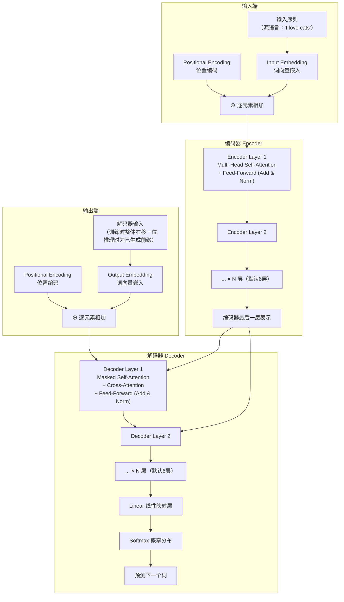

用一句话总结两者的分工：
- **编码器（`Encoder`）**：通读源文，输出带上下文的表示；
- **解码器（`Decoder`）**：根据已经写出的译文，对照编码器的表示，预测下一个词。

把机器翻译想成两个人合作：**编码器**是先通读原文、做满笔记的阅读员；**解码器**是拿着笔记写译文的写作者。写作者每落下一词，就可以回看自己的已写内容，也可以回到阅读员的笔记里查原文。只有编码器的模型更像“阅读理解员”，只有解码器的模型则像“接着上文续写的人”。

图中从编码器指向解码器的，是编码器**最后一层的表示**。解码器每一层再用自己的`W^K`、`W^V`，把这份表示投影成交叉注意力的 K 和 V。


## 从词到向量：输入预处理

文字在送入网络内部进行矩阵计算前，必须经历两个关键预处理步骤：**词向量嵌入**与**位置编码**。

### 词向量嵌入（`Embedding`）

计算机只认数字，不识汉字或英文单词。第一步是通过查找表（`Embedding`矩阵），将每个词（`Token`）映射为一个稠密的连续**高维向量**。这里的“词”只是便于说明，实际分词器可能把一个词拆成多个子词，甚至把一个汉字单独作为一个`Token`。

可以把`Embedding`想成词典里的“坐标卡片”：卡片上的每个数字不是人手写的定义，而是训练过程中逐渐调整出来的坐标。意思相近的词，通常会在这个空间里靠得更近；但它不是一个固定的人工词典，换一个模型，坐标也会换一套。

假设模型嵌入维度`d_model = 512`（为便于理解，此处用 4 维示意）：

```text
"猫"   → [ 0.12, -0.45,  0.87,  0.23]
"狗"   → [ 0.15, -0.41,  0.80,  0.19]
"飞机" → [-0.72,  0.33, -0.12,  0.95]
```

在语义空间里，「猫」和「狗」的余弦相似度更高、夹角更小，「猫」和「飞机」则差得更远。

> 这里的**余弦相似度**可以先理解成“比较两支箭头指向是否相近”：方向越接近，数值越大，通常表示语义越相似；方向差得越远，数值就越小。这些数是跟着训练学出来的，不用手写规则。

### 位置编码（`Positional Encoding`）

没有位置编码时，自注意力是**置换等变**的：词的顺序打乱，输出会按同样的方式打乱；两个词的匹配分数只看它们的内容，不看下标。语言却离不开顺序。「猫吃鱼」和「鱼吃猫」用词相同，意思相反。所以要给每个词加上位置信息。

更直观地说，词向量只回答“这是谁”，位置编码再回答“它坐在哪个座位”。同样是“今天 下雨”，把两个`Token`交换成“下雨 今天”，如果没有座位号，模型看到的只是同一组卡片。

#### 为什么不直接用绝对数字1、2、3……？
- 如果简单赋予绝对数字`1, 2, 3...`，长文本的位置值会迅速膨胀到成百上千，打乱原本词向量的数值分布，导致模型训练极不稳定；
- 如果将位置归一化为`[0, 1]`（例如除以序列长度），短句子相邻词相差`0.1`，万字长文相邻词相差`0.0001`，相同物理间距的语义尺度完全失真。

#### 正余弦函数设计：精密的多指针钟表

原论文采用了不同波长频率的正弦和余弦交织函数：

```text
PE(pos, 2i)   = sin( pos / 10000^(2i / d_model) )
PE(pos, 2i+1) = cos( pos / 10000^(2i / d_model) )
```

- `pos`：词在整句话中的绝对位置索引（0、1、2……）；
- `i`：向量内部的维度索引（`0 <= i < d_model/2`）；
- `d_model`：模型的总嵌入维度（如 512）。

**生活中的直观比喻：多齿轮精密里程表 / 钟表指针**
- **低维度分量（`i`较小，波长极短）**：就像钟表的**秒针**，指针转动飞快，能精细地区分位置相邻的两个词（如第 1 词与第 2 词）；
- **高维度分量（`i`较大，波长极长）**：就像钟表的**时针**乃至**年份齿轮**，转动极慢，用于宏观标定相隔几十甚至上百个词的大跨度长程区间；
- 每个词的位置编码，就是那一瞬间所有指针指向的角度组合。在模型实际使用的长度范围内，不同位置会得到容易区分的编码状态。

按和差公式，`sin(pos+k)`和`cos(pos+k)`都能写成`sin(pos)`、`cos(pos)`与一组只依赖`k`的系数相乘。正弦、余弦配成相邻的一对之后，`PE(pos+k)`就等于给`PE(pos)`乘上一个只与`k`有关的线性变换。原论文因此猜想：模型会比较容易学到相对位置。这个线性关系是公式里就有的；模型是否靠它来学距离，论文里写的是猜想。

#### 为什么是相加而不是拼接？会把语义混淆吗？

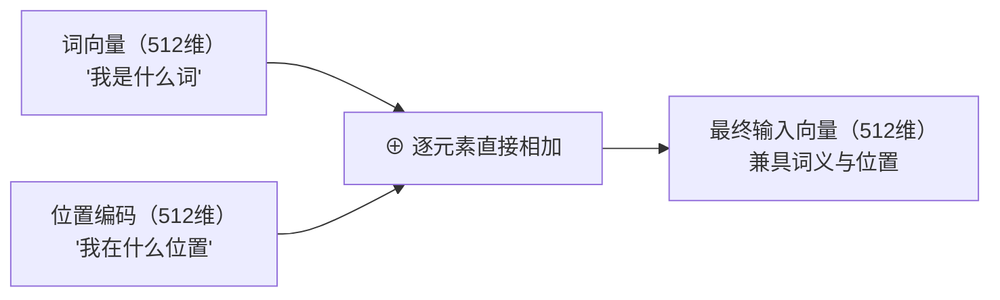

一个常见的疑问是：位置数直接加到词向量上，原来的语义会不会混在一起？

相加之后维度仍然是 `512`，后面的矩阵不用变宽。原论文还有一个配套做法：词嵌入和输出层`softmax`共用同一套权重，加位置编码之前先把词嵌入乘上`√d_model`。位置编码的每个分量落在 `-1` 到 `1` 之间，乘完之后的词嵌入尺度更大，相加时词义仍占主要成分。后面的层会从这组数里同时读出「是哪个词」和「在第几位」。

如果改成拼接，`512` 维词向量加上 `512` 维位置编码，宽度变成 `1024`。注意力里随序列长度增长的那部分计算大约翻倍，随宽度平方增长的投影大约变成四倍。

可以把“相加”理解成在同一张卡片上同时写下“身份”和“座位号”，而“拼接”则是把两张卡片并排装订。拼接当然也能表达两种信息，但卡片变宽后，后面的每一道矩阵运算都要处理更多数字。

:::note 后来常见的做法：[`RoPE`](https://arxiv.org/abs/2104.09864)（旋转位置编码）
[`LLaMA`](https://arxiv.org/abs/2302.13971)、[`Qwen`](https://arxiv.org/abs/2309.16609)、[`DeepSeek-V2`](https://arxiv.org/abs/2405.04434)、[`Mistral 7B`](https://arxiv.org/abs/2310.06825)这些模型大多不再把正弦位置编码加到词向量上，而改用 **[`RoPE`](https://arxiv.org/abs/2104.09864)**（`Rotary Position Embedding`，旋转位置编码）。算注意力时，它按位置把`Query`和`Key`的每个二维子空间旋转一个角度。角度与位置成正比，不同子空间转速不同，注意力分数因此会跟着两个词的相对距离变化。

在训练长度以内，这样编码很稳。直接拿没训练过的更长位置去套原始`RoPE`，效果通常会下降。上下文要扩到 `128K` 这一量级时，还要加大`RoPE`的基数，或使用`YaRN`、`NTK`这类缩放。
:::


## 核心：自注意力机制（`Self-Attention`）

自注意力是`Transformer`的核心。弄清它之后，多头、掩码和交叉注意力都是在同一套计算上改用法。

### 一个经典的指代消歧例子

来看这句话：
> **"The animal didn't cross the street because it was too tired."**
> （那只动物没有穿过马路，因为**它**太累了。）

句中的「it」到底指代谁？是「animal」（动物）还是「street」（马路）？
人类根据常识立刻知道，只有动物会感到「累（tired）」，马路不会累。

自注意力让句子里的**每个词都和其他词算一个相关程度**，模型才有机会把「it」主要对齐到「animal」，而不是「street」。

### Q、K、V：注意力的三大核心角色

自注意力的一切计算围绕三个向量展开：**`Query`（查询）**、**`Key`（键）**、**`Value`（值）**。

这是直接借鉴自搜索引擎和图书馆系统的设计：

| 向量角色 | 图书馆/搜索比喻 | 在模型中的本质意义 |
| :--- | :--- | :--- |
| **`Query`（`Q`）** | 你在搜索框里输入的**搜索关键词** | 「我是当前词，**我想寻找什么样的上下文信息**？」 |
| **`Key`（`K`）** | 数据库中每篇文章的**标题/分类标签** | 「我是候选词，**我能提供什么样的特征供人匹配**？」 |
| **`Value`（`V`）** | 每篇文章的**正文详细内容** | 「我是候选词，**一旦被选中，我将输出的真实信息内容**」 |

对于输入的每个词向量`X`（经过嵌入与位置叠加后），分别乘以三个**可训练的权重矩阵**`W^Q, W^K, W^V`，映射生成各自的`Q, K, V`：

这里的“查询、键、值”不是三份原始词典，而是同一个词向量经过三次不同的投影。就像图书馆给同一本书准备三张卡：一张写“我想找什么”，一张写“我属于哪一类”，一张保留“真正要读的内容”。这些卡片如何填写，由训练自动学出来。

```text
Q = X · W^Q,    K = X · W^K,    V = X · W^V
```

### 注意力分数的计算四部曲

以翻译"我 爱 猫"三字为例，分步拆解注意力运算流程：

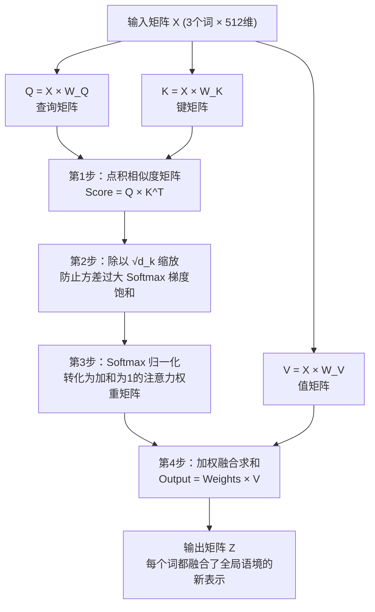

#### 第一步：`Q × K^T`向量点积（雷达相似度扫描）
在几何数学中，两个向量的 **点积（内积）** 反映了两者的夹角余弦与投影长度。
- 两个向量方向越一致，点积得分越高，说明两词关系越密切；
- 两个向量互相垂直，点积为 0，两个方向没有重叠；
- 两个向量方向相反，点积为负。

用当前词的`Q`与句子中所有词的`K`逐一做点积，就得到了一张衡量彼此语义相关度的匹配分数表。

#### 第二步：除以`√d_k`（为什么要缩放）

为什么一定要除以键向量维度的平方根`√d_k`？

假设`Q`和`K`的各维度是独立随机变量，均值为 0，方差为 1。当维度`d_k`很大时（例如 64），两个向量点积的方差会变成 64，标准差是 8。原始分数会散得很开，差距可以到几十。

如果把差距很大的分数直接送进`Softmax`：
- 最大的那个数会被指数放大，概率接近`1.0`，其余接近`0`；
- `Softmax`在这种饱和区的梯度接近 0；
- 反向传播几乎传不回有用的更新。

除以`√d_k`把点积的方差拉回 1 附近，分数落在`Softmax`梯度还比较大的区间。

#### 第三步：`Softmax`归一化（转换为注意力权重比例）
对每一行的分数施加`Softmax`函数，将分散的分数压缩映射到`[0, 1]`区间，且所有项之和恰好等于 1。这便是每个词分给句子中其他词的"精力分配比重"。

例如原始分数是`[2, 1, 0]`，`Softmax`会把它变成大约`[0.67, 0.24, 0.09]`。分数最高的候选得到最多“注意力预算”，但其他候选通常仍会保留一点权重；如果掩码把某个位置设成`-∞`，它才会得到严格的 0。

#### 第四步：加权求和（抽取`Value`融合成新特征）
用上一步的权重去乘各个词的`V`，再加总。输出就是这些`V`的加权和：权重大的词贡献更多，权重接近 0 的词几乎不进入结果。

这一步得到的是新的表示。原来的`x`要原样加回来，靠的是后面的残差连接。

#### 用一个小数字例子把“加权”具象化

假设“吃”这个位置经过`Softmax`后，对三个词的注意力权重是`[0.2, 0.6, 0.2]`，对应“猫、吃、鱼”。如果三个`Value`在某个简化维度上的数值分别是`[1, 4, 2]`，那么这一维的新结果就是：`0.2 × 1 + 0.6 × 4 + 0.2 × 2 = 3.0`。也就是说，“吃”这个位置主要参考自己，同时吸收一部分“猫”和“鱼”的信息。真实模型会在几百或几千个维度上同时做这件事，这里的数字只是帮助理解流程。

注意力权重也不是“模型已经理解了完整句意”的证明，它只是当前层、当前头在当前表示空间里学到的一种信息路由方式。

#### 经典总公式速记

```text
Attention(Q, K, V) = Softmax( (Q · K^T) / √d_k ) · V
```


## 多头注意力（`Multi-Head Attention`）

如果只有一套`Q, K, V`，同一次计算只有一种匹配方式。一句话里却常常同时有好几类关系：谁是主语、代词指的是谁、形容词修饰哪个名词。多头注意力（`Multi-Head Attention`）让模型可以同时学几套匹配。

### 几个视角同时看

多头可以想成几个视角在看同一段文本。训练之后，有的头会更常对齐动词和宾语，有的更常对齐代词和它所指的名词，有的更常对齐形容词和被修饰的名词。哪个头形成哪种偏好，要等训练结束才看得到。后来也有[研究](https://arxiv.org/abs/1905.10650)把很大一部分头剪掉，模型仍然能完成任务。

像几位一起审稿的同事：一位圈主谓关系，一位找代词指代，一位关注时间和地点。每个人看的都是同一篇文章，但使用的标注规则不同；最后把所有人的笔记拼在一起，再交给一个总编辑合并。

下面仍以原论文的 `8` 个头、每个头 `64` 维来画。每个头在自己的子空间里单独打分。

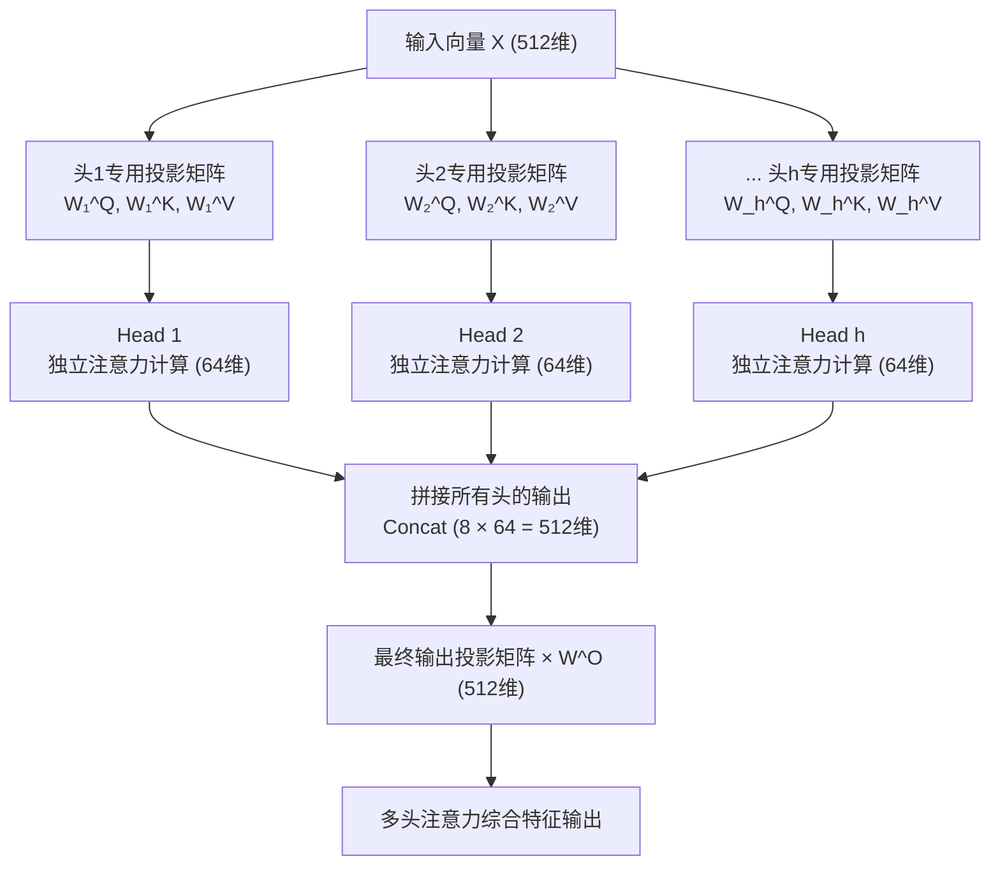

### 多头的数学实现与计算效率

原论文中设定头数`h = 8`，每个头的内部维度为`d_k = d_v = d_model / h = 512 / 8 = 64`。

`8` 个头各自用自己的投影，把 `512` 维映射到 `64` 维，在这个子空间里做注意力。算完再拼回`8 × 64 = 512`维，乘上输出矩阵`W^O`。

因此，多头注意力的参数量和矩阵乘法量，与一个 `d_model` 维的单头注意力基本相同。差别是这套计算被拆进 `8` 个 `64` 维的子空间，模型可以同时学几套匹配方式。


## 残差连接与层归一化（`Add`与`Norm`）

网络一深，就容易出现**梯度消失**或**训练不稳**。`Transformer`在每个子层（注意力、前馈网络）外面都加了两样东西：**残差连接（`Add`）**和**层归一化（`Norm`）**。

### 残差连接（Residual Connection）

残差做的事很直接：**把子层的输入加到子层的输出上**。

```text
Output = x + Sublayer(x)
```

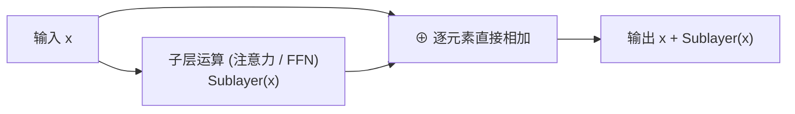

可以把它想成子层旁边的一条直通路。某一层要是还没学出有用的变化，原来的表示也能加到下一层；反传时，梯度也有一条不经过子层连乘的路。原论文还要在相加之后做层归一化，这条路是否「干净」，取决于`Norm`放在前面还是后面，下一小节分开写。

生活里的类比是“在原稿上增量批注”：编辑可以只补充一个新观点，不必每次都重写整页。即使这一轮批注写得不理想，原稿仍然保留着，后面的层还有机会继续修正。

### 层归一化（[Layer Normalization](https://arxiv.org/abs/1607.06450)）

层归一化作用在**一个词向量内部**：减去这个向量自己的均值，再除以标准差，使均值变成 0、方差变成 1，然后乘可学习的`γ`、加上可学习的`β`。这只是把数值拉到统一的尺度，并没有规定它们服从哪一种分布。`Norm`可以放在残差相加之后，也可以放在子层之前。

可以把它看成给每个位置做“音量校准”：不同层输出的数值大小可能差很多，归一化先把音量调到相近范围，再允许模型用`γ`和`β`重新调节。它改变的是数值尺度，不是把一个词替换成另一个词。

#### 为什么文本模型用`LayerNorm`，而不是`BatchNorm`？
- `BatchNorm`（批归一化）：在**不同样本之间**、对同一通道统计均值和方差。图像上很常用。文本句子长短不一，还有大量`[PAD]`，批次大小也经常变。跨样本的统计很容易被这些因素带偏；
- `LayerNorm`（层归一化）：在**一个词向量自己的各个维度之间**做统计。它不依赖批次大小，也不依赖句子长度，所以用在长短不一的文本上比较稳。

### `Post-LN`、`Pre-LN`与`RMSNorm`

原论文和后来的大模型，差别就在`Norm`放在相加的哪一边：

```text
原始 Transformer (Post-LN) : x = LayerNorm(x + Sublayer(x))
后来常见的写法 (Pre-LN)    : x = x + Sublayer(LayerNorm(x))
```

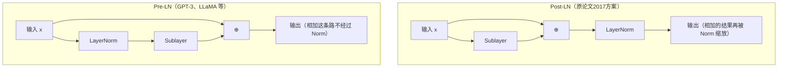

1. **`Post-LN`（原论文）**：`LayerNorm`放在残差相加之后，主干每次都会被重新缩放。层数变深时，初始化阶段靠近输出的层梯度偏大，学习率一大，训练就容易不稳。原论文的学习率在前 4000 步线性升高（`warmup`），再按步数的平方根倒数下降；`base`模型一共训练约 10 万步。
2. **`Pre-LN`**：把`LayerNorm`挪到每个子层之前。相加的那一条路是`x`本身：`x_{l+1} = x_l + Sublayer(LayerNorm(x_l))`。梯度可以沿这条路回到浅层。`GPT-3`、`LLaMA`以及后来的多数大语言模型使用`Pre-LN`。
3. **[`RMSNorm`](https://arxiv.org/abs/1910.07467)**：`LLaMA`、`DeepSeek`、`Qwen`等进一步改用`RMSNorm`（均方根归一化）。它不做减均值，只按均方根缩放，通常保留一个可学习的缩放系数，不再单独加平移`β`。计算更少，训练效果和`LayerNorm`接近。


## 前馈神经网络（`Feed-Forward Network`，`FFN`）

在注意力层汇聚完上下文信息之后，每一层都会紧接着跟上一个**位置逐项前馈网络（`Position-wise FFN`）**。

### 结构：原论文是两层`MLP`

```text
FFN(x) = Activation(x · W_1 + b_1) · W_2 + b_2
```

- **维度先扩后缩**：输入是 512 维，先放大到`d_ff = 2048`（4 倍），经过激活函数，再压回 512 维；
- **各位置共用权重**：每个位置单独计算，用的是同一套参数；
- **激活函数**：原论文用`ReLU`。

[`BERT`](https://arxiv.org/abs/1810.04805)和[`GPT-2`](https://cdn.openai.com/better-language-models/language_models_are_unsupervised_multitask_learners.pdf)把`ReLU`换成了`GELU`，整体仍是上面这个两层结构。`LLaMA`这一代改用[`SwiGLU`](https://arxiv.org/abs/2002.05202)，矩阵变成三个：

```text
SwiGLU(x) = (Swish(x · W) ⊙ (x · V)) · W₂
```

`Swish(t) = t · sigmoid(t)`，`⊙`表示逐元素相乘。为了让参数量仍接近原来的两层前馈，中间维度常常取大约`8/3 × d_model`，不再是 4 倍。

### 作用：联系上下文，以及逐位置的变换

注意力层在整个序列里建立词和词的联系。前馈层则对每个位置单独做一次非线性变换。

如果说注意力像“开会并决定该听谁的发言”，前馈网络就像每个人回到自己的工位查资料、做判断。它不会直接把不同位置混在一起，但会把当前位置刚刚收集到的上下文加工得更丰富；下一层注意力再把这些加工后的结果互相传递。

[`Geva 等人`](https://arxiv.org/abs/2012.14913)把前馈层看成键值记忆：第一层像一组键，对应训练里见过的文本模式；第二层像一组值，把概率推向经常跟在这种模式后面的词。后来的[定位研究](https://arxiv.org/abs/2202.05262)也发现，不少事实关联集中在中间若干层的前馈权重里，例如「法国的首都是巴黎」。注意力负责决定什么时候把这些记忆读出来，再和其他层的残差混在一起，得到最终预测。


## 编码器（`Encoder`）与解码器（`Decoder`）详解

### 编码器：通读源文

编码器由`N`个结构相同的层垂直堆叠而成（默认 6 层）。

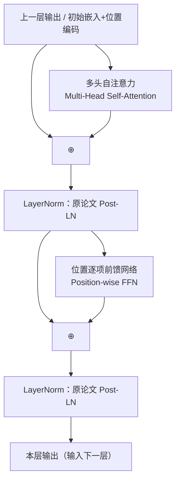

上图按 2017 年原论文的`Post-LN`来画：先做子层，再相加，最后做`LayerNorm`。现在的大模型多把`Norm`放到子层之前，见上文的`Pre-LN`。

在编码器中，自注意力是**双向可见**的。看一个词的时候，左边和右边的词都在视野里。经过`N`层之后，最后一层的每个位置都带上了整句的上下文。

例如读到“银行”时，编码器可以同时看见前面的“河边”和后面的“办理贷款”，于是能把同一个词放进不同语境里。这里的“双向”指可以利用整句输入，并不表示模型已经完成了某种人工语义标注。

### 解码器：掩码，以及对照源文

解码器同样由`N`层堆叠而成。它比编码器多一个**交叉注意力层（`Cross-Attention`）**，自注意力上还加了**因果掩码**。下图和编码器一样，按原论文的`Post-LN`来画。

解码器像一位不能偷看答案的写作者：它可以回看已经写过的字，也可以查阅编码器整理好的原文，但不能提前看到自己还没写出的词。因果掩码就是这条“不能偷看”的规定。

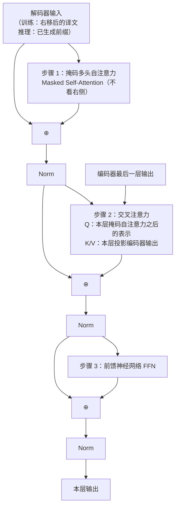

#### 掩码自注意力：训练时一次算完每个位置

推理时词是一个一个生成的，看起来没有未来的词需要遮住。掩码主要用在训练。

这里容易混淆：推理时右侧确实还没有词，但模型仍按同一套因果规则运行。这样训练和推理使用的是同一种“只根据过去预测现在”的任务；实现上，推理通常只把最新位置送进去，并配合`KV Cache`复用历史计算。

训练时，整句译文是已知的。如果仍然逐词循环，序列这一维就并行不起来，训练会慢到接近`RNN`。实际做法是把目标句子一次送进解码器，再用因果掩码保证每个位置看不到它右边的词。

输入和要预测的词错开一位。这里用「我爱猫」把四个位置写全；下一节的完整例子会把句号也当作一个`token`，错位方式相同。

```text
解码器输入：   <BOS>    我     爱     猫
这一位要预测：  我      爱     猫    <EOS>
```

掩码加在缩放之后、`Softmax`之前的分数上。能看的位置加 0，要遮住的位置加`-∞`：

```text
<BOS> 这一行（预测「我」） : [  0, -∞, -∞, -∞ ]  只看 <BOS>
「我」这一行（预测「爱」） : [  0,  0, -∞, -∞ ]  看 <BOS> 和「我」
「爱」这一行（预测「猫」） : [  0,  0,  0, -∞ ]  看前三个输入
「猫」这一行（预测 <EOS>） : [  0,  0,  0,  0 ]  四个输入都能看
```

对角线右上方是`-∞`，经过`Softmax`之后权重变成 0。一次前向就能同时算出这四个位置的损失。这是训练阶段比`RNN`快的一个主要原因。推理时没有整句正确答案，只能从已经生成的前缀继续往后算；掩码仍然挡着右边，只是那些词当时还不存在。

把它想成练习填空：老师把整段标准答案发给训练程序，但在批改第 3 个空时，会用挡板盖住第 4 个及之后的答案。这样所有空可以同时批改，又不会让模型提前抄到后面的内容。

#### 交叉注意力：生成时对照原文

交叉注意力接在掩码自注意力后面，用来查看源文。

- **`Q`**来自当前层里、掩码自注意力子层加上残差之后的表示，再乘这一层自己的`W^Q`。含义是：译文写到这里，下一步要到原文的什么地方找信息。
- **`K`和`V`**用这一层自己的`W^K`、`W^V`，去投影编码器最后一层的输出。编码器交出来的是整句源文的表示。各层解码器一般都用这同一份最后一层表示，每层再用自己的矩阵做投影。

可以想成译员手里已经有半句译文，每写下一个词，都回到原文里相关的那一段对一下。


## 端到端的翻译过程

下面是**推理**时的逐步生成，把 “I love cats.” 译成 “我爱猫。”。句号也是预测出来的一个`token`。训练时不走这个循环，而是按上一节的方式，把整句错开一位、一次送进解码器。

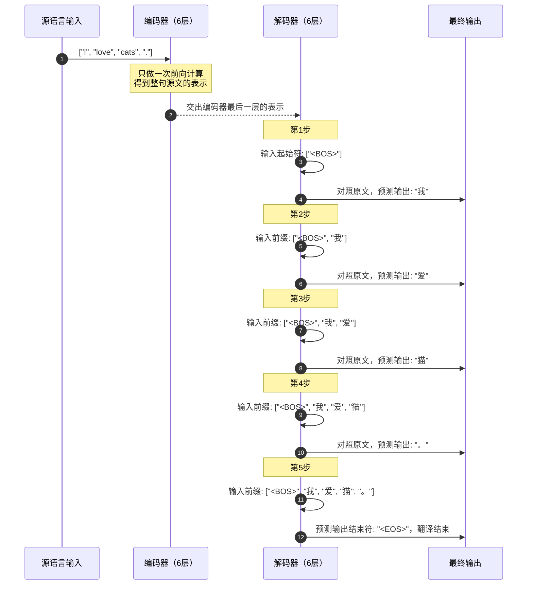

:::tip 推理时的[`KV Cache`](https://huggingface.co/docs/transformers/en/cache_explanation)
上面每多生成一个词，如果把整个前缀重算一遍，历史越长越慢。

因果掩码下，已经生成的`token`在各层算出的`K`和`V`不会因为后面又接了一个新词而改变，所以可以留在显存里。每生成一个新词，要为这个词计算`Q`、`K`、`V`，把新的`K`、`V`追加进缓存，再用这个`Q`和缓存中的全部`K`、`V`（包括它自己）做注意力。

这就像写长篇文章时保留一份“人物和事件索引”：写到新段落时，只需为新段落做索引，再查已有索引，不必把前面的章节重新通读一遍。缓存省掉的是重复计算，不是让新词完全不用参考历史；新词仍要和缓存中的所有历史`K`、`V`比较。

在这套翻译模型里，编码器只算一次；需要随着生成追加缓存的，是解码器的自注意力。后来的`Decoder-only`大模型没有单独的编码器，整段提示词和已生成的回复都走这套缓存。每步因此不必重算历史位置。上下文变长之后，每步仍要看完整个缓存，计算量还是会随长度上升。
:::


## 从经典`Transformer`到现代大模型（`LLM`）的三大派系与演进

`2017` 年之后，不同任务开始只用其中一块：有的只留编码器，有的只留解码器，也有的两块都留。

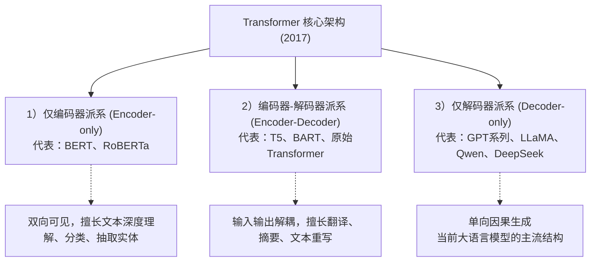

### 为什么今天的大语言模型大多是`Decoder-only`？
1. **任务都写成预测下一个词**。翻译、写代码、推理和对话，都可以收成：给定已经看见的上文，预测下一个`token`。[`T5`](https://arxiv.org/abs/1910.10683)这种编码器–解码器也会把任务统一成文本进、文本出；`Decoder-only`是把输入和输出放进同一条自回归序列。
2. **上下文学习在这种模型上被清楚观察到**。参数和数据变大之后，不更新权重，只在提示里放几个例子，模型就能做没专门训练过的任务。[`GPT-3`](https://arxiv.org/abs/2005.14165)把这件事展示得很清楚。能做到什么程度，同时取决于参数规模、数据量和自回归训练目标。
3. **缓存按一条前缀来复用**。整段上下文都是同一条因果序列，`KV Cache`直接沿着前缀追加。带有单独编码器和交叉注意力的模型也要缓存，但多一套表示、多一次跨序列的注意力，批处理更绕。

### 2017 原版和后来的大模型

右边一列把这一代里分别出现过的改法放在一起，同一格里的几项可以来自不同模型。

这些改动大多是在“效果、速度、显存”之间重新取平衡。比如上下文越长，缓存的索引越大；模型会用更少的`K/V`副本、压缩缓存，或分块计算来减轻这笔开销。

| 模块 | 原始`Transformer`（2017） | 后来的大模型里常见的改法 | 差别 |
| :--- | :--- | :--- | :--- |
| **整体架构** |`Encoder-Decoder`| 大语言模型主流是 **`Decoder-only`** 。翻译、摘要里仍能看到`T5`、`BART` | 输入和输出放进同一条自回归序列 |
| **层归一化** | 相加之后做`LayerNorm`（`Post-LN`） | 子层之前做归一化（`Pre-LN`）。`LLaMA`、`Qwen`、`DeepSeek`用 **`RMSNorm`** | 相加那条路不再经过`Norm`，深层更好训练；`RMSNorm`少一次减均值 |
| **位置编码** | 正弦绝对位置编码，加在词嵌入上 | **`RoPE`** 。远长于训练长度时，还要加大`RoPE`基数，或用`YaRN`、`NTK`缩放 | 注意力分数依赖相对距离 |
| **前馈网络** |`ReLU`，两层线性，中间维`4 × d_model`|`BERT`、`GPT-2`用`GELU`，仍是两层。`LLaMA`等用 **`SwiGLU`**（三矩阵门控），中间维常约为`8/3 × d_model`| 相近参数量下，门控前馈通常更有效 |
| **KV 怎么存** | 每个头一套`K`、`V` | **[`GQA`](https://arxiv.org/abs/2305.13245)**：多组`Query`共用较少的`K`、`V`（`LLaMA 2` 70B、`LLaMA 3`、`Qwen2`）。**`MLA`**：把`K`、`V`压进更低维的向量（[`DeepSeek-V2`](https://arxiv.org/abs/2405.04434)、[`DeepSeek-V3`](https://arxiv.org/abs/2412.19437)） | 减小`KV Cache` |
| <span style={{whiteSpace: 'nowrap'}}><strong>分数矩阵怎么算</strong></span> | 一次写出整张`n×n`的注意力分数 | **[`FlashAttention`](https://arxiv.org/abs/2205.14135)** 等分块计算，数学结果与普通注意力相同 | 少把完整分数矩阵写入显存，这一步更快 |

可以用办公室里的资料柜来理解这些优化：

- **`GQA`**：很多提问员（`Query`头）共用少数几套资料标签和资料内容（`Key/Value`），避免每个人都复制一整柜资料；
- **`MLA`**：把资料柜里的内容先压成更短的索引卡，生成时保存索引卡即可，需要时再恢复所需信息；
- **`FlashAttention`**：不把整张“谁和谁相关”的大表一次铺满桌面，而是分小块计算、边算边合并。最终数学结果相同，少的是显存读写和中间表占用。


## 核心超参数速查

读模型卡时，常见的几个宽度和深度是：

| 超参数 | 符号 | `2017` 原论文`base` |`GPT-3 175B`（2020）| 可以怎么理解 |
| :--- | :--- | :--- | :--- | :--- |
| **模型隐层维度** |`d_model`| `512` | `12,288` | 每个`token`的向量有多宽 |
| **网络堆叠层数** |`N`| `6` | `96` | 堆多少层。层越多，表示可以多变换几次 |
| **注意力头数** |`h`| `8` | `96` | 注意力头的个数 |
| **每个头的维度** |`d_k = d_v`|`d_model / h = 64`|`12,288 / 96 = 128`| 每个头内部的向量宽度 |
| <span style={{whiteSpace: 'nowrap'}}><strong>前馈网络隐层</strong></span> |`d_ff`| `2,048`（4 倍`d_model`） | `49,152`（4 倍`d_model`） | 前馈网络中间层的宽度 |

表里的`GPT-3 175B`用来对照宽度和深度。它沿用`GPT-2`的`Pre-LN`、`GELU`和学习得到的绝对位置编码，并在一部分层使用稀疏注意力。位置编码、激活函数和`KV`的存法写在上一张表里。表中`d_ff`的 4 倍适用于原论文和`GPT-3`；`SwiGLU`模型的中间维常常约为`8/3 × d_model`。

读这张表时，可以把模型想成一栋办公楼：`d_model`是每位员工的工位宽度，`N`是楼层数，`h`是每层同时工作的讨论小组数，`d_ff`是员工进入“资料室”时临时展开的工作台大小。宽度和层数变大通常意味着更强的表达能力，也会带来更多计算和显存开销；它们不是越大越好，还要和训练数据、硬件及目标任务匹配。


## 总结

`Transformer`能成为后来大模型的共同骨架，靠的是几件可以分开理解的设计：

1. **自注意力**：同一层里任意两个词可以直接算匹配分数，不必沿时间把信息一步步传过去。
2. **多头注意力**：把向量分到几个较窄的子空间里各自做注意力，总计算量和一个全维单头基本相同。头和句法、指代的对应关系是训练中形成的。
3. **位置编码**：自注意力本身不看顺序。正弦编码或`RoPE`把位置补回去。
4. **残差与归一化**：残差让表示和梯度有一条不经过子层连乘的路。`Pre-LN`和`RMSNorm`让很深的网络更好训练。
5. **因果掩码**：训练时一次前向算出每个位置的损失；生成时每个位置看不到右边的词。把千亿参数摊到很多`GPU`上，还要靠数据并行、张量并行和流水线并行。

把整篇文章压缩成一句话：模型先把文字变成带座位号的数字卡片，再用注意力决定“该参考谁”，用前馈网络逐位置加工；经过多层重复后，输出“下一个`Token`最像谁”的概率。训练是同时批改整张练习卷，生成是每次补一个空，并用缓存保留已经查过的资料。

`2017` 年这篇为机器翻译写的论文，后来成了`GPT`、`Claude`、`Qwen`、`DeepSeek`这些模型的共同结构。

## 参考论文与资料

- [Bahdanau et al., Neural Machine Translation by Jointly Learning to Align and Translate](https://arxiv.org/abs/1409.0473)
- [Vaswani et al., Attention Is All You Need](https://arxiv.org/abs/1706.03762)
- [Ba et al., Layer Normalization](https://arxiv.org/abs/1607.06450)
- [Su et al., RoFormer: Enhanced Transformer with Rotary Position Embedding](https://arxiv.org/abs/2104.09864)
- [Peng et al., YaRN: Efficient Context Window Extension of Large Language Models](https://arxiv.org/abs/2309.00071)
- [Zhang and Sennrich, Root Mean Square Layer Normalization](https://arxiv.org/abs/1910.07467)
- [Shazeer, GLU Variants Improve Transformer](https://arxiv.org/abs/2002.05202)
- [Geva et al., Transformer Feed-Forward Layers Are Key-Value Memories](https://arxiv.org/abs/2012.14913)
- [Michel et al., Are Sixteen Heads Really Better than One?](https://arxiv.org/abs/1905.10650)
- [Meng et al., Locating and Editing Factual Associations in GPT](https://arxiv.org/abs/2202.05262)
- [Devlin et al., BERT: Pre-training of Deep Bidirectional Transformers for Language Understanding](https://arxiv.org/abs/1810.04805)
- [OpenAI, Language Models are Unsupervised Multitask Learners（GPT-2）](https://cdn.openai.com/better-language-models/language_models_are_unsupervised_multitask_learners.pdf)
- [Brown et al., Language Models are Few-Shot Learners（GPT-3）](https://arxiv.org/abs/2005.14165)
- [Raffel et al., Exploring the Limits of Transfer Learning with a Unified Text-to-Text Transformer（T5）](https://arxiv.org/abs/1910.10683)
- [Lewis et al., BART: Denoising Sequence-to-Sequence Pre-training for Natural Language Generation, Translation, and Comprehension](https://arxiv.org/abs/1910.13461)
- [Liu et al., RoBERTa: A Robustly Optimized BERT Pretraining Approach](https://arxiv.org/abs/1907.11692)
- [Touvron et al., LLaMA: Open and Efficient Foundation Language Models](https://arxiv.org/abs/2302.13971)
- [Touvron et al., Llama 2: Open Foundation and Fine-Tuned Chat Models](https://arxiv.org/abs/2307.09288)
- [Jiang et al., Mistral 7B](https://arxiv.org/abs/2310.06825)
- [Qwen Technical Report](https://arxiv.org/abs/2309.16609)
- [Yang et al., Qwen2 Technical Report](https://arxiv.org/abs/2407.10671)
- [Ainslie et al., GQA: Training Generalized Multi-Query Transformer Models from Multi-Head Checkpoints](https://arxiv.org/abs/2305.13245)
- [DeepSeek-AI, DeepSeek-V2: A Strong Mixture-of-Experts Language Model](https://arxiv.org/abs/2405.04434)
- [DeepSeek-AI, DeepSeek-V3 Technical Report](https://arxiv.org/abs/2412.19437)
- [Dao et al., FlashAttention: Fast and Memory-Efficient Exact Attention with IO-Awareness](https://arxiv.org/abs/2205.14135)
- [Hugging Face Transformers, Cache explanation](https://huggingface.co/docs/transformers/en/cache_explanation)
