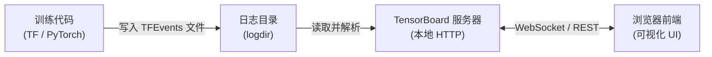
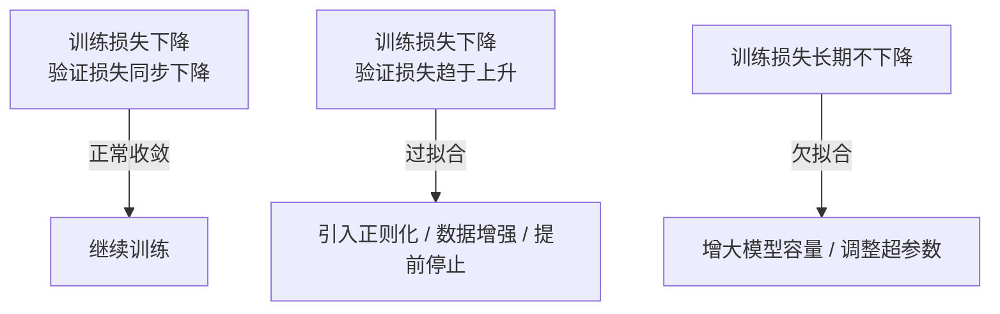

## 基本简介

`TensorBoard`是由`Google`开发并随`TensorFlow`项目一同开源的机器学习实验可视化工具。它通过在训练过程中将结构化数据写入`TFEvents`格式的日志文件，再以交互式`Web`界面的形式进行呈现，帮助研究人员和工程师直观地观察、分析和调试机器学习模型的训练过程。

`TensorBoard`以独立包形式发布（`pip install tensorboard`），也随`TensorFlow`捆绑分发。除原生支持`TensorFlow`生态外，`PyTorch`自`1.1`版本起在官方库`torch.utils.tensorboard`中内置了对`TFEvents`日志格式的写入支持，使其成为跨框架通用的实验可视化平台。

## 与训练代码的关系

使用`TensorBoard`时，训练代码不一定需要直接对接复杂的`TensorBoard SDK`，但必须有某种方式向日志目录写入`TensorBoard`能够识别的`TFEvents`文件。`TensorBoard`服务本身不会直接参与模型训练，也不会自动从普通终端输出、`CSV`或`JSON`日志中推断训练指标；它只负责扫描`logdir`目录，读取其中的`events.out.tfevents.*`文件并展示可视化结果。

不同训练框架的接入方式有所差异：

| 框架 / 场景 | 接入方式 | 是否自动记录 |
|---|---|---|
| `TensorFlow / Keras` | 使用`tf.keras.callbacks.TensorBoard`回调或`tf.summary`接口 | `Keras`回调可自动记录`loss`、`accuracy`等内置指标 |
| `PyTorch`原生训练循环 | 使用`torch.utils.tensorboard.SummaryWriter`显式写入标量、图像、直方图等数据 | 不会自动记录，需要在训练循环中调用`add_scalar`等方法 |
| 高级训练框架 | 使用框架内置的`TensorBoard Logger`或配置开关 | 取决于框架实现，通常会自动记录常见训练指标 |

因此，在`PyTorch`项目中可以认为官方库已经内置了`TensorBoard`日志写入接口，但这并不等同于训练过程会被自动采集。开发者仍需在训练循环中创建`SummaryWriter`，并在合适的训练步或`epoch`调用`writer.add_scalar()`、`writer.add_histogram()`等方法写入日志。启动`tensorboard --logdir runs`只是读取和展示这些日志；如果代码没有生成`TFEvents`文件，界面中就不会出现对应的指标曲线。

## 解决的核心问题

机器学习训练过程长期面临以下挑战：

- **训练过程不透明**：模型训练本质上是一个迭代优化过程，在没有可视化工具的情况下，从业者只能依赖终端打印的数字日志来判断训练健康度，难以及时发现梯度消失、过拟合等隐性问题。
- **实验结果难以对比**：在探索不同超参数组合和网络结构时，多次实验结果通常散落在多个日志文件中，缺乏系统化的比较手段。
- **模型结构难以验证**：复杂的计算图在代码层面难以审查，容易出现层未正确连接、张量形状不匹配等结构错误，视觉化呈现可以快速定位此类问题。
- **高维数据难以理解**：词嵌入、特征表示等高维向量天然难以解读，需要降维投影才能获得直觉性的理解。

`TensorBoard`通过结构化日志采集与交互式可视化这套完整方案，将上述黑盒过程系统性地透明化。

## 主要优点

- **实时监控**：训练进行中`TensorBoard`会定期自动刷新，无需等待训练结束即可观察指标趋势。
- **多实验对比**：可在同一视图中叠加来自不同训练运行（`Run`）的曲线，直观对比不同配置下的效果差异。
- **多维度数据支持**：统一界面支持标量、直方图、图像、音频、文本、嵌入向量等多种数据类型的可视化。
- **框架中立性**：通过`TFEvents`标准日志格式，`TensorFlow`、`PyTorch`等主流框架均可写入并使用`TensorBoard`进行分析。
- **超参数系统化调优**：内置`HParams`插件提供结构化的超参数实验管理，支持表格视图、平行坐标图、散点矩阵图等多种分析视角。
- **性能剖析**：内置`Profiler`插件可分析`GPU`/`CPU`上的算子执行时间，辅助定位训练性能瓶颈。
- **免费开源**：完全开源（`Apache 2.0`许可），无使用成本，可本地部署。

## 基本架构

`TensorBoard`的整体数据流如下：



`TensorBoard`服务器本质上是一个`Python`进程，它持续监听指定的日志目录，解析`TFEvents`文件并通过`HTTP API`将数据提供给前端页面。前端为基于`Angular`构建的单页应用，各功能通过插件体系独立组织。

## 实验管理指标

`TensorBoard`的功能通过插件体系组织，每类数据对应一个独立的面板（`Dashboard`）。以下介绍各核心面板、对应指标的含义及记录方式。

### Scalars（标量）

#### 含义

`Scalars`面板（在新版`TensorBoard`中位于`Time Series`面板下）用于记录和展示随训练步数变化的单个数值，是最常用的实验管理手段。典型的标量指标如下：

| 指标名称 | 含义 |
|---|---|
| `loss` | 训练损失，反映模型在训练集上的拟合程度，应随训练逐步下降 |
| `val_loss` | 验证集损失，反映模型的泛化能力，用于检测过拟合现象 |
| `accuracy` | 分类任务的准确率（训练集） |
| `val_accuracy` | 分类任务的准确率（验证集） |
| `learning_rate` | 当前学习率，对于动态学习率调度（如`LRScheduler`）的可视化尤为重要 |
| 自定义指标 | 任何用户自定义的标量，如`AUC`、`F1`、`BLEU`、`ROUGE`等 |

通过对比`loss`与`val_loss`的走势，可识别以下三类训练状态：



#### 使用方式（TensorFlow / Keras）

```python
import tensorflow as tf
import datetime

# 使用带时间戳的子目录区分不同训练运行
log_dir = "logs/fit/" + datetime.datetime.now().strftime("%Y%m%d-%H%M%S")

# Keras 回调自动记录 loss、accuracy 等内置指标
tensorboard_callback = tf.keras.callbacks.TensorBoard(
    log_dir=log_dir,
    histogram_freq=1,   # 每 epoch 记录一次直方图
)

model.fit(
    x_train, y_train,
    epochs=10,
    validation_data=(x_val, y_val),
    callbacks=[tensorboard_callback],
)
```

使用`tf.summary.scalar`记录自定义标量：

```python
writer = tf.summary.create_file_writer("logs/custom")

with writer.as_default():
    for step in range(100):
        tf.summary.scalar("custom/my_metric", value=some_value, step=step)
```

#### 使用方式（PyTorch）

`PyTorch`提供的是官方日志写入接口，而不是自动实验采集器。以下代码需要放入训练循环中，明确告诉`TensorBoard`要记录哪些指标：

```python
from torch.utils.tensorboard import SummaryWriter

writer = SummaryWriter("runs/experiment_1")

for epoch in range(num_epochs):
    # ... 训练循环 ...
    writer.add_scalar("Loss/train", train_loss, epoch)
    writer.add_scalar("Loss/val", val_loss, epoch)
    writer.add_scalar("Accuracy/train", train_acc, epoch)
    writer.add_scalar("Accuracy/val", val_acc, epoch)

writer.close()
```

### Graphs（计算图）

#### 含义

`Graphs`面板展示模型的计算图，帮助开发者验证模型结构是否符合预期，识别错误的层连接关系，并理解数据在模型中的流向。`TensorBoard`支持两类图的展示：

- **Op-level 图**：`TensorFlow`底层算子级别的计算图
- **Conceptual 图**：`Keras`模型的高层结构图（层级视图），通常更易于阅读

#### 使用方式（TensorFlow）

`Keras`的`TensorBoard`回调在设置`write_graph=True`时会自动记录模型计算图。对于`tf.function`修饰的自定义函数，可通过`trace`机制记录：

```python
# 开启图追踪
tf.summary.trace_on(graph=True)

with writer.as_default():
    # 触发一次前向传播以捕获计算图
    output = my_tf_function(sample_input)
    tf.summary.trace_export(name="my_function", step=0)
```

#### 使用方式（PyTorch）

```python
# 传入模型和一个示例输入，TensorBoard 将推断并记录计算图
writer.add_graph(model, input_to_model=torch.zeros(1, 3, 224, 224))
```

### Histograms（直方图）

#### 含义

`Histograms`面板将张量的数值分布以直方图的形式随时间维度堆叠呈现，用于观察模型参数在训练过程中的动态变化。常见应用场景如下：

| 应用场景 | 说明 |
|---|---|
| 权重分布变化 | 观察各层权重是否正常更新，分布是否向合理区间收敛 |
| 梯度分布 | 诊断梯度消失（分布向零收缩）或梯度爆炸（分布急剧扩散）等问题 |
| 偏置项分布 | 检查偏置是否出现严重偏移或饱和 |
| 激活值分布 | 观察激活层输出是否合理，如`ReLU`是否存在大量零输出（神经元死亡现象） |

#### 使用方式（TensorFlow / Keras）

在`Keras`回调中启用直方图记录（默认关闭，开启后会增加一定计算开销）：

```python
tensorboard_callback = tf.keras.callbacks.TensorBoard(
    log_dir=log_dir,
    histogram_freq=1,  # 每隔 1 个 epoch 记录一次直方图，0 表示不记录
)
```

使用`tf.summary.histogram`自定义记录：

```python
with writer.as_default():
    tf.summary.histogram("layer1/kernel", model.layers[1].kernel, step=epoch)
    tf.summary.histogram("layer1/bias", model.layers[1].bias, step=epoch)
```

#### 使用方式（PyTorch）

```python
for name, param in model.named_parameters():
    writer.add_histogram(f"params/{name}", param, global_step)
    if param.grad is not None:
        writer.add_histogram(f"grads/{name}", param.grad, global_step)
```

### Distributions（分布）

#### 含义

`Distributions`面板是`Histograms`数据的另一种呈现形式。它将同一张量在不同训练步数下的分布叠加为带状区域图，展示`5%`、`25%`、`50%`（中位数）、`75%`、`95%`等百分位数随训练步数的变化趋势。

相比`Histograms`面板，`Distributions`更适合观察：
- 分布的中心趋势（中位数）是否随训练朝预期方向变化
- 分布宽度（四分位距）是否随训练收缩或扩张
- 是否出现双峰等异常分布形态

`Distributions`面板中的数据来源与`Histograms`完全相同，无需额外记录，只需在`TensorBoard`界面中切换面板即可查看。

### Images（图像）

#### 含义

`Images`面板用于展示训练过程中的图像数据，常见应用场景包括：

- 可视化数据增强效果（验证预处理管道的正确性）
- 展示生成式模型（`GAN`、`VAE`等）的输出结果随训练的演化过程
- 记录语义分割、目标检测等任务的可视化推理结果
- 展示注意力图（`Attention Map`）等中间特征的可视化

#### 使用方式（TensorFlow）

```python
# 输入张量形状须为 [batch, height, width, channels]，像素值范围 [0, 1] 或 [0, 255]
with writer.as_default():
    tf.summary.image(
        "training_samples",
        images_tensor,
        step=epoch,
        max_outputs=4,  # 最多展示 4 张图
    )
```

#### 使用方式（PyTorch）

```python
# 单张图像：形状 [C, H, W]，像素值范围 [0, 1]
writer.add_image("sample/input", img_tensor, global_step)

# 批量图像（以网格形式展示）
from torchvision.utils import make_grid
grid = make_grid(images_batch, nrow=8, normalize=True)
writer.add_image("sample/batch_grid", grid, global_step)
```

### Audio（音频）

#### 含义

`Audio`面板支持记录和回放音频波形数据，适用于语音识别、文本转语音（`TTS`）、音频生成等场景，典型用途包括：

- 验证音频预处理输出是否正确（如采样率转换、静音截断等）
- 对比模型输出的合成语音与目标音频之间的质量差异
- 监听语音合成模型在不同训练阶段的音质演化

#### 使用方式（TensorFlow）

```python
# audio_tensor 形状为 [1, num_frames, channels]，sample_rate 单位为 Hz
with writer.as_default():
    tf.summary.audio(
        "synthesized_speech",
        audio_tensor,
        sample_rate=22050,
        step=epoch,
        max_outputs=2,
    )
```

#### 使用方式（PyTorch）

```python
# audio_tensor 形状为 [1, num_frames] 或 [num_frames]
writer.add_audio("output/speech", audio_tensor, global_step, sample_rate=22050)
```

### Text（文本）

#### 含义

`Text`面板用于记录任意字符串数据，支持基本`Markdown`渲染，常见用途包括：

- 记录当前实验的超参数配置摘要，便于事后回溯
- 展示文本生成任务（翻译、摘要、对话等）在不同训练步数下的样本输出，直观评估生成质量
- 记录数据集版本、实验说明等元数据信息

#### 使用方式（TensorFlow）

```python
with writer.as_default():
    tf.summary.text(
        "experiment/config",
        "lr=0.001 | batch_size=64 | optimizer=Adam | dropout=0.3",
        step=0,
    )
```

#### 使用方式（PyTorch）

```python
writer.add_text(
    "config/hyperparams",
    "lr: 0.001  |  batch: 64  |  optimizer: Adam",
    global_step=0,
)
```

### Embeddings（嵌入向量投影）

#### 含义

`Embeddings`面板（又称`Projector`插件）将高维嵌入向量投影到`2D`或`3D`空间进行可视化，支持`PCA`和`t-SNE`两种降维算法，帮助分析：

- 词嵌入（`Word Embedding`）的语义聚类结构是否符合预期
- 图像特征嵌入的类别边界是否清晰
- 推荐系统中用户嵌入与物品嵌入之间的空间关系

可为每个向量附加文字标签（`metadata`）或对应的缩略图（`sprite image`），使投影点具备清晰的语义标注。

#### 使用方式（TensorFlow）

```python
import os
import tensorflow as tf
from tensorboard.plugins import projector

log_dir = "logs/embeddings"

# 将嵌入矩阵保存为 TensorFlow Checkpoint
embedding_var = tf.Variable(embedding_matrix, name="word_embeddings")
checkpoint = tf.train.Checkpoint(embedding=embedding_var)
checkpoint.save(os.path.join(log_dir, "embedding.ckpt"))

# 配置 Projector 插件
config = projector.ProjectorConfig()
emb_cfg = config.embeddings.add()
emb_cfg.tensor_name = "embedding/.ATTRIBUTES/VARIABLE_VALUE"
emb_cfg.metadata_path = "metadata.tsv"  # 每行一个标签的文本文件
projector.visualize_embeddings(log_dir, config)
```

#### 使用方式（PyTorch）

```python
writer.add_embedding(
    mat=embedding_matrix,      # 形状 [n, dim] 的张量
    metadata=word_list,        # 长度为 n 的标签列表
    label_img=sprite_tensor,   # 可选，形状 [n, C, H, W]，每行对应的缩略图
    global_step=0,
    tag="word_embeddings",
)
```

### HParams（超参数调优）

#### 含义

`HParams`（`Hyperparameters`）面板是`TensorBoard`中专用于系统化管理超参数实验的插件。当需要探索多组超参数组合时（如学习率、批次大小、网络层数等），`HParams`将每次实验的超参数配置与最终指标统一汇总，提供以下三种分析视角：

| 视图类型 | 说明 |
|---|---|
| 表格视图（Table View） | 以行为单位列出所有实验运行，展示各超参数值及对应指标，支持多列排序和条件筛选 |
| 平行坐标图（Parallel Coordinates View） | 每条实验对应一条折线，穿越所有超参数和指标轴；拖选某轴上的区间，可快速过滤出表现最优的参数组合 |
| 散点矩阵图（Scatter Plot View） | 展示每对超参数与指标之间的二维相关关系，帮助识别对目标指标影响最大的关键超参数 |

#### 使用方式（TensorFlow）

```python
import tensorflow as tf
from tensorboard.plugins.hparams import api as hp

# 1. 定义超参数搜索空间
HP_UNITS = hp.HParam("num_units", hp.Discrete([64, 128, 256]))
HP_DROPOUT = hp.HParam("dropout_rate", hp.RealInterval(0.1, 0.5))
HP_LR = hp.HParam("learning_rate", hp.Discrete([1e-3, 1e-4]))

METRIC_VAL_ACC = "val_accuracy"

# 2. 声明实验配置（可选，但有助于 UI 中的过滤与展示）
with tf.summary.create_file_writer("logs/hparam_tuning").as_default():
    hp.hparams_config(
        hparams=[HP_UNITS, HP_DROPOUT, HP_LR],
        metrics=[hp.Metric(METRIC_VAL_ACC, display_name="Validation Accuracy")],
    )

# 3. 每次实验中记录超参数与指标
def run_experiment(run_dir, hparams):
    with tf.summary.create_file_writer(run_dir).as_default():
        hp.hparams(hparams)
        val_acc = train_and_evaluate(hparams)
        tf.summary.scalar(METRIC_VAL_ACC, val_acc, step=1)

# 4. 遍历参数组合（网格搜索）
session_num = 0
for num_units in HP_UNITS.domain.values:
    for lr in HP_LR.domain.values:
        for dropout_rate in [HP_DROPOUT.domain.min_value, HP_DROPOUT.domain.max_value]:
            hparams = {HP_UNITS: num_units, HP_DROPOUT: dropout_rate, HP_LR: lr}
            run_experiment(f"logs/hparam_tuning/run-{session_num:02d}", hparams)
            session_num += 1
```

#### 使用方式（PyTorch）

```python
# add_hparams 在一次 writer.close() 前调用，记录超参数与对应指标
writer.add_hparams(
    hparam_dict={"lr": 0.001, "batch_size": 64, "dropout": 0.3},
    metric_dict={"hparam/accuracy": val_accuracy, "hparam/loss": val_loss},
)
```

### Profiler（性能分析）

#### 含义

`Profiler`插件用于分析`TensorFlow`程序的运算性能。它能精确记录各算子（`Op`）在`CPU`/`GPU`上的执行时间、内存占用和设备利用率，帮助定位训练性能瓶颈。各分析视图的说明如下：

| 分析视图 | 说明 |
|---|---|
| 概览（Overview） | 展示训练步骤的时间分解，包含输入管道耗时、设备计算耗时等总体分布 |
| 输入流水线分析（Input Pipeline Analyzer） | 专门分析`tf.data`数据输入管道是否成为瓶颈，并给出优化建议 |
| TensorFlow Stats | 按算子（Op）统计执行时间及调用次数，快速定位耗时最高的操作 |
| Trace Viewer | 以时间轴形式展示所有`CPU`/`GPU`核心上的算子执行序列（兼容`Perfetto`格式） |
| Memory Profile | 展示设备内存使用随时间的变化曲线，辅助诊断显存溢出（`OOM`）问题 |

> **注意**：`Profiler`插件目前主要针对`TensorFlow`程序。`PyTorch`官方提供独立的`torch.profiler`模块，其输出可以导出为`Chrome Trace`格式，通过`TensorBoard`的`Trace Viewer`视图进行查看，但`TensorBoard`的`Profiler`面板本身不原生支持`PyTorch`。

#### 使用方式（TensorFlow）

```python
# 在 Keras 回调中开启 Profiling，指定对哪些 batch 进行剖析
tensorboard_callback = tf.keras.callbacks.TensorBoard(
    log_dir=log_dir,
    profile_batch=(10, 20),  # 对第 10 到第 20 个 batch 进行性能剖析
)
```

#### PyTorch 的 torch.profiler 集成

```python
import torch
from torch.profiler import profile, ProfilerActivity, tensorboard_trace_handler

with profile(
    activities=[ProfilerActivity.CPU, ProfilerActivity.CUDA],
    on_trace_ready=tensorboard_trace_handler("runs/profiler"),
    record_shapes=True,
    with_stack=True,
) as prof:
    for step, (inputs, labels) in enumerate(train_loader):
        outputs = model(inputs)
        loss = criterion(outputs, labels)
        loss.backward()
        optimizer.step()
        optimizer.zero_grad()
        prof.step()
```

## 安装与配置

### 安装

| 安装场景 | 命令 |
|---|---|
| 独立安装（适用于非`TensorFlow`项目） | `pip install tensorboard` |
| 随`TensorFlow`一同安装 | `pip install tensorflow` |
| 在`Conda`环境中安装 | `conda install -c conda-forge tensorboard` |

`TensorBoard`要求`Python 3.9+`（具体版本随当前发布版本变化，以[官方发布说明](https://github.com/tensorflow/tensorboard/releases)为准）。独立安装的`tensorboard`包不依赖完整的`TensorFlow`，体积更小，适合在仅使用`PyTorch`的环境中集成。

### 启动 TensorBoard

安装完成后，通过命令行启动`TensorBoard`服务器：

```bash
# 基本启动，--logdir 指定日志目录
tensorboard --logdir ./logs

# 指定端口（默认端口为 6006）
tensorboard --logdir ./logs --port 8080

# 同时监听多个日志目录（用于多实验对比）
tensorboard --logdir_spec run_a:./logs/run_a,run_b:./logs/run_b

# 允许外部访问（如部署在远程服务器上时）
tensorboard --logdir ./logs --host 0.0.0.0 --port 6006
```

启动后在浏览器中访问`http://localhost:6006`即可打开可视化界面。

### 在 Jupyter Notebook 中使用

```python
# 加载 TensorBoard Notebook 扩展
%load_ext tensorboard

# 启动 TensorBoard，直接嵌入在 Notebook 输出单元中显示
%tensorboard --logdir logs/
```

### 日志目录结构

`TensorBoard`通过递归扫描指定日志目录下的`TFEvents`文件进行数据读取。推荐使用带时间戳的子目录来区分不同训练运行：

```
logs/
├── fit/
│   ├── 20240101-120000/         # 实验运行 1
│   │   ├── train/
│   │   │   └── events.out.tfevents.xxxxxxxx
│   │   └── validation/
│   │       └── events.out.tfevents.xxxxxxxx
│   └── 20240102-090000/         # 实验运行 2
│       ├── train/
│       └── validation/
└── hparam_tuning/
    ├── run-00/
    ├── run-01/
    └── ...
```

## 使用示例

### 示例一：Keras 模型训练监控

展示如何在`Keras`训练流程中集成`TensorBoard`，自动记录损失、准确率及权重直方图：

```python
import tensorflow as tf
import datetime

# 数据集准备
(x_train, y_train), (x_test, y_test) = tf.keras.datasets.mnist.load_data()
x_train, x_test = x_train / 255.0, x_test / 255.0

# 模型定义
model = tf.keras.models.Sequential([
    tf.keras.layers.Flatten(input_shape=(28, 28)),
    tf.keras.layers.Dense(128, activation="relu"),
    tf.keras.layers.Dropout(0.2),
    tf.keras.layers.Dense(10, activation="softmax"),
])
model.compile(
    optimizer="adam",
    loss="sparse_categorical_crossentropy",
    metrics=["accuracy"],
)

# 配置 TensorBoard 回调
log_dir = "logs/fit/" + datetime.datetime.now().strftime("%Y%m%d-%H%M%S")
tensorboard_callback = tf.keras.callbacks.TensorBoard(
    log_dir=log_dir,
    histogram_freq=1,   # 每 epoch 记录权重直方图
    write_graph=True,   # 记录计算图
)

# 训练并自动记录日志
model.fit(
    x_train, y_train,
    epochs=10,
    validation_data=(x_test, y_test),
    callbacks=[tensorboard_callback],
)
```

```bash
tensorboard --logdir logs/fit
```

### 示例二：PyTorch 自定义指标记录

展示如何在`PyTorch`训练循环中手动记录标量指标和权重直方图：

```python
import torch
import torch.nn as nn
from torch.utils.tensorboard import SummaryWriter

writer = SummaryWriter("runs/pytorch_experiment")

model = MyModel()
optimizer = torch.optim.Adam(model.parameters(), lr=1e-3)
criterion = nn.CrossEntropyLoss()

for epoch in range(20):
    model.train()
    running_loss = 0.0
    for data, target in train_loader:
        optimizer.zero_grad()
        output = model(data)
        loss = criterion(output, target)
        loss.backward()
        optimizer.step()
        running_loss += loss.item()

    avg_loss = running_loss / len(train_loader)
    val_acc = evaluate(model, val_loader)

    # 记录标量指标
    writer.add_scalar("Loss/train", avg_loss, epoch)
    writer.add_scalar("Accuracy/val", val_acc, epoch)

    # 记录权重直方图
    for name, param in model.named_parameters():
        writer.add_histogram(f"weights/{name}", param, epoch)

writer.close()
```

```bash
tensorboard --logdir runs/pytorch_experiment
```

### 示例三：超参数搜索（HParams）

展示如何使用`HParams`插件对多组超参数组合进行系统化实验并在`TensorBoard`中对比结果：

```python
import tensorflow as tf
from tensorboard.plugins.hparams import api as hp

# 加载数据
(x_train, y_train), (x_test, y_test) = tf.keras.datasets.mnist.load_data()
x_train, x_test = x_train / 255.0, x_test / 255.0

# 定义超参数空间
HP_LR = hp.HParam("learning_rate", hp.Discrete([1e-2, 1e-3, 1e-4]))
HP_UNITS = hp.HParam("dense_units", hp.Discrete([64, 128]))
METRIC_VAL_ACC = "val_accuracy"

def train_model(hparams):
    model = tf.keras.Sequential([
        tf.keras.layers.Flatten(input_shape=(28, 28)),
        tf.keras.layers.Dense(hparams[HP_UNITS], activation="relu"),
        tf.keras.layers.Dense(10, activation="softmax"),
    ])
    model.compile(
        optimizer=tf.keras.optimizers.Adam(learning_rate=hparams[HP_LR]),
        loss="sparse_categorical_crossentropy",
        metrics=["accuracy"],
    )
    history = model.fit(
        x_train, y_train,
        epochs=5,
        validation_data=(x_test, y_test),
        verbose=0,
    )
    return history.history["val_accuracy"][-1]

# 遍历所有参数组合并记录
for run_idx, (lr, units) in enumerate(
    [(lr, u) for lr in HP_LR.domain.values for u in HP_UNITS.domain.values]
):
    hparams = {HP_LR: lr, HP_UNITS: units}
    run_dir = f"logs/hparams/run-{run_idx:02d}"
    with tf.summary.create_file_writer(run_dir).as_default():
        hp.hparams(hparams)
        val_acc = train_model(hparams)
        tf.summary.scalar(METRIC_VAL_ACC, val_acc, step=1)
```

```bash
tensorboard --logdir logs/hparams
```

启动后打开`HParams`面板，切换至平行坐标图视图，拖选`val_accuracy`轴的高值区间，即可直观筛选出最优的超参数组合。

## 参考资料

- [TensorBoard 官方文档](https://www.tensorflow.org/tensorboard)
- [TensorBoard GitHub 仓库](https://github.com/tensorflow/tensorboard)
- [PyTorch TensorBoard 集成文档](https://pytorch.org/docs/stable/tensorboard.html)
- [HParams 插件使用指南](https://www.tensorflow.org/tensorboard/hyperparameter_tuning_with_hparams)
- [TensorBoard Profiler 使用指南](https://www.tensorflow.org/tensorboard/tensorboard_profiling_keras)
