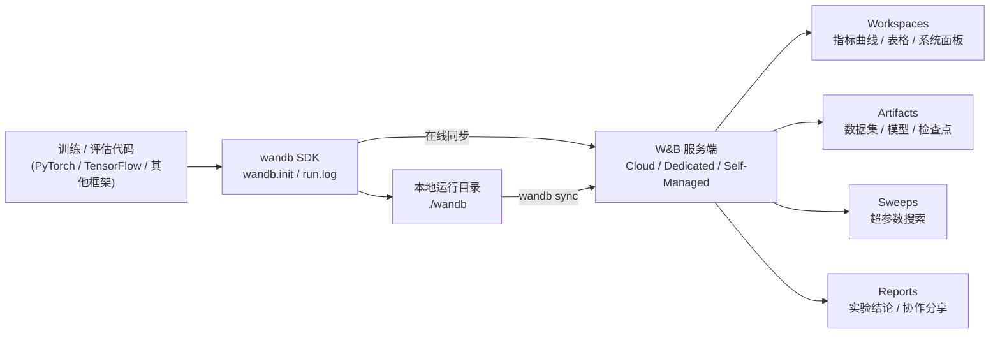
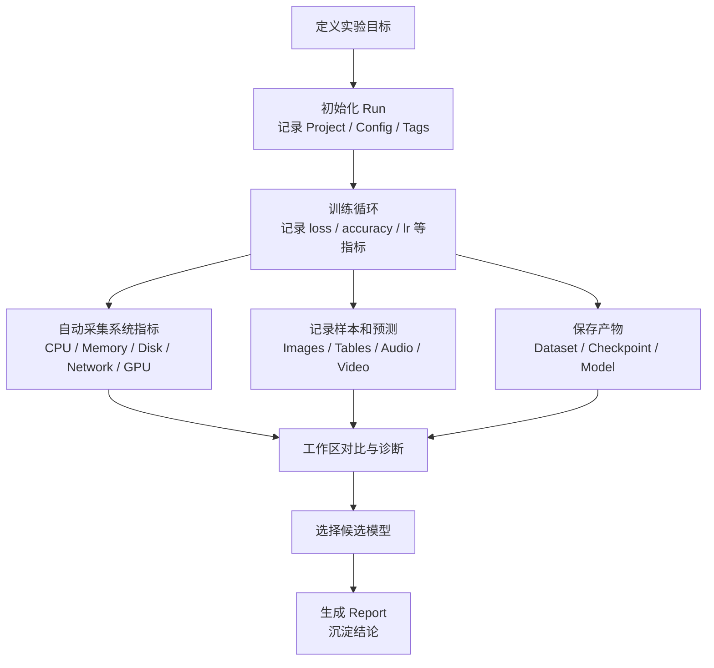
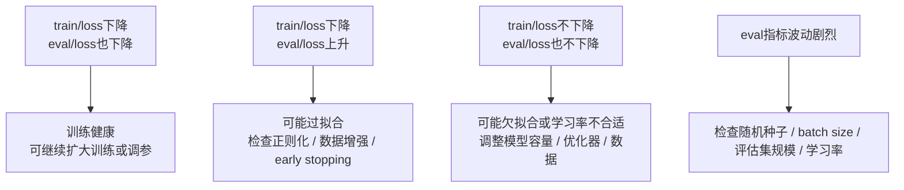

## 基本简介

`W&B`是`Weights & Biases`的简称，常见的`Python`包名和命令行工具名是`wandb`。`W&B`不是单纯的曲线绘图工具，而是围绕实验生命周期建立的一套**实验跟踪与协作平台**。在机器学习工程中，`W&B`主要用于记录、可视化、比较和复现实验。它把一次训练、评估、数据处理或推理任务抽象为一个`Run`，在`Run`中记录超参数、训练指标、系统资源、日志、模型文件、数据集版本、预测样本和最终结果摘要，再通过`Web`工作区进行统一管理。

此外，需要明确一个容易误解的点：`W&B`并不预置一组固定的“模型效果指标”。`loss`、`accuracy`、`F1`、`AUC`、`BLEU`、`ROUGE`等任务指标由训练代码通过`run.log()`主动写入；`W&B`负责把这些用户定义指标和自动采集的系统指标、配置、产物、表格、媒体、报告等数据关联到同一个`Run`中，并提供过滤、排序、对比、可视化和版本追踪能力。

## 解决的核心问题

机器学习训练往往会反复试验数据版本、模型结构、优化器、学习率、批次大小、随机种子、训练步数和评估策略。如果缺少系统化的实验管理，常见问题包括：

- **实验记录分散**：关键指标散落在终端输出、日志文件、手工表格和模型目录中，实验结束后难以判断某个模型文件对应哪组参数。
- **实验不可复现**：只保存最终模型而没有保存超参数、代码版本、数据集版本、运行命令、随机种子和依赖环境时，很难复现同等结果。
- **对比效率低**：当一次调参产生几十到几千个`Run`时，仅靠本地文件名和手工表格无法高效筛选最优实验。
- **训练异常难定位**：模型指标下降可能来自数据问题、学习率问题、显存不足、`GPU`利用率低、输入流水线阻塞或网络存储抖动，需要把任务指标和系统指标放在同一时间轴下分析。
- **协作成本高**：团队成员需要共享实验结果、图表、结论和模型版本，如果只依赖截图或临时文档，容易造成信息丢失和版本混乱。
- **模型产物难治理**：数据集、预处理结果、检查点、最终模型和评估表格之间缺少可追踪关系时，后续上线、回滚和审计会变得困难。

`W&B`通过`Run`、`Project`、`Config`、`History`、`Summary`、`Artifacts`、`Tables`、`Sweeps`和`Reports`等对象，把训练过程中的“输入、过程、输出、结论”串成一条可查询、可比较、可复现的链路。

## 主要优点

- **接入成本低**：典型训练脚本只需要`wandb.init()`和`run.log()`即可记录实验，`PyTorch`、`TensorFlow`、`Keras`、`Hugging Face Transformers`等生态都有集成方式。
- **指标与配置强关联**：`Config`保存学习率、批次大小、模型结构、数据集名称等独立变量，`History`保存训练过程指标，`Summary`保存最终或聚合结果，便于按超参数过滤、分组和排序。
- **自动记录系统指标**：`wandb`会自动采集`CPU`、内存、磁盘、网络和多类加速器指标。官方系统指标参考说明，默认每`15`秒自动记录一次系统指标。
- **适合多实验对比**：工作区可以把多个`Run`放在同一视图中，按照指标曲线、配置列、标签、分组和状态筛选实验。
- **支持富媒体和结构化结果**：除标量曲线外，还可以记录图像、视频、音频、直方图、`Table`、`Plotly`图表、`HTML`、`3D`对象和分子结构，适合计算机视觉、语音、生成式模型、推荐系统和科学计算任务。
- **支持产物版本与血缘关系**：`Artifacts`可以版本化数据集、模型、检查点和评估结果，记录一个`Run`使用了哪些输入产物，又生成了哪些输出产物。
- **内置超参数搜索**：`Sweeps`支持网格搜索、随机搜索和贝叶斯搜索，并可以在一台或多台机器上并行运行`agent`。
- **支持报告和协作**：`Reports`可以组织`Run`、嵌入图表、写下结论并分享给团队成员，适合实验复盘和评审。
- **支持在线、离线和私有部署**：默认可以同步到`wandb.ai`，也可以通过`WANDB_MODE=offline`离线记录后再同步；企业场景可选择`Multi-tenant Cloud`、`Dedicated Cloud`或`Self-Managed`等部署方式。

## 基本架构

`W&B`的实验跟踪数据流可以概括为以下结构：



一次典型的训练流程如下：



在这个架构中，`wandb SDK`会在训练进程旁边启动后台同步逻辑。官方`wandb.init()`参考说明，默认会把数据同步到`wandb.ai`并实时更新可视化；当网络不可用或显式设置离线模式时，数据会先保存到本地`wandb`目录，再通过`wandb sync`上传。

## 实验管理对象

理解`W&B`需要先理解它的对象模型。下面这些对象不是模型评估指标本身，但它们决定了实验如何被组织、查询和复现。

| 对象 | 含义 | 实验管理用途 |
|---|---|---|
| `Entity` | 用户名、团队名或组织范围 | 决定`Run`归属和权限边界 |
| `Project` | 一组相关实验的集合 | 通常对应一个模型任务、一个数据集或一个研发项目 |
| `Run` | 一次计算过程 | 表示一次训练、评估、推理、数据处理或调参试验 |
| `Config` | 输入配置和超参数 | 保存学习率、模型结构、数据集、随机种子等独立变量 |
| `History` | 随时间写入的指标序列 | 保存每个`step`的`loss`、`accuracy`、学习率等曲线 |
| `Summary` | 实验最终摘要 | 保存最终值、最小值、最大值、均值等便于排序的结果 |

| 对象 | 含义 | 实验管理用途 |
|---|---|---|
| `Artifact` | 可版本化的输入或输出产物 | 追踪数据集、模型、检查点、评估文件和血缘关系 |
| `Table` | 二维结构化数据 | 分析预测样本、错误样本、评估明细和混合媒体结果 |
| `Sweep` | 超参数搜索任务 | 统一调度多组配置并根据目标指标优化 |
| `Report` | 可分享的实验文档 | 固化图表、结论和实验复盘过程 |
| `Workspace` | 交互式工作区 | 查看、过滤、分组、对比和保存实验视图 |
| `Registry` | 模型或产物集合 | 管理候选模型、版本别名和跨项目复用 |

官方`Run`参考文档把`Run`定义为一个被`W&B`记录的计算单元，通常就是一个机器学习实验。`wandb.init()`创建`Run`，`run.log()`把指标、图像、视频、表格等数据写入该`Run`。

## 实验管理指标

### 指标体系说明

`W&B`的指标体系可以分为三类：

- **用户定义的任务指标**：由训练代码主动调用`run.log()`写入，例如`train/loss`、`eval/accuracy`、`eval/f1`、`learning_rate`。这类指标决定模型效果和训练状态。
- **自动采集的系统指标**：由`wandb SDK`自动记录，例如`CPU`、内存、磁盘、网络、`GPU`利用率、显存、温度、功耗等。官方文档说明，这些指标默认每`15`秒采集一次。
- **实验管理元数据和产物指标**：包括`Config`、`Summary`、`Artifact`版本、`Run`状态、标签、分组、日志、文件、表格和媒体。这些数据不一定是数值曲线，但对实验对比、复现和协作同样关键。

### 任务效果指标

任务效果指标由使用者根据业务和模型任务定义。`W&B`不会判断某个指标是否适合任务，但会提供时间序列、聚合摘要、图表、过滤、排序和对比能力。

| 指标 | 含义 | 如何用于实验管理 |
|---|---|---|
| `train/loss` | 训练集上的目标函数值 | 判断优化是否收敛，和`eval/loss`一起判断过拟合 |
| `eval/loss` | 验证或测试集损失 | 判断泛化能力，常作为提前停止和模型选择依据 |
| `train/accuracy` | 训练集准确率 | 观察模型对训练数据的拟合程度 |
| `eval/accuracy` | 验证或测试集准确率 | 分类任务常用主指标，可作为`Sweep`优化目标 |
| `eval/precision` | 预测为正的样本中有多少是真的正样本 | 类别不均衡或误报成本高时重点关注 |
| `eval/recall` | 真实正样本中有多少被召回 | 漏报成本高的任务中重点关注 |

| 指标 | 含义 | 如何用于实验管理 |
|---|---|---|
| `eval/f1` | `precision`和`recall`的调和平均 | 在误报和漏报都重要时作为综合指标 |
| `eval/auc` | 分类阈值变化下的排序能力 | 二分类和风险评分任务中用于跨阈值比较 |
| `eval/map` | 检索或检测任务的平均精度均值 | 目标检测、信息检索等任务常用 |
| `eval/bleu` | 机器翻译等生成任务的`n-gram`匹配指标 | 用于比较文本生成结果与参考答案的重合程度 |
| `eval/rouge` | 摘要等任务中基于召回的文本重合指标 | 用于长文本摘要和生成式评估 |
| `eval/perplexity` | 语言模型对序列的不确定性度量 | 语言建模和微调任务中常见，越低通常越好 |

这些指标的典型使用方式是把训练指标和验证指标放在同一工作区中对比：



### 训练过程指标

训练过程指标用于解释任务效果指标为什么变化。它们通常不是最终业务指标，但对定位训练问题非常关键。

| 指标 | 含义 | 管理方法 |
|---|---|---|
| `epoch` | 当前训练轮次 | 作为横轴或过滤条件，便于按完整数据遍历次数比较 |
| `global_step` | 全局训练步数 | 多数曲线的默认横轴，跨不同`epoch`长度时更稳定 |
| `learning_rate` | 当前学习率 | 结合`loss`观察学习率调度是否合理 |
| `grad_norm` | 梯度范数 | 识别梯度爆炸、梯度消失或裁剪是否生效 |
| `weight_norm` | 参数范数 | 观察权重是否异常增大或趋近零 |
| `train/tokens_per_second` | 每秒处理的`token`数 | 大模型训练中衡量吞吐效率 |

| 指标 | 含义 | 管理方法 |
|---|---|---|
| `train/samples_per_second` | 每秒处理的样本数 | 比较不同批次大小、数据加载策略和硬件配置 |
| `train/step_time` | 单步训练耗时 | 结合`GPU`利用率定位性能瓶颈 |
| `data/load_time` | 数据加载耗时 | 判断输入流水线是否拖慢训练 |
| `optimizer/lr` | 优化器实际使用学习率 | 多参数组优化器中比单个`learning_rate`更精确 |
| `loss_scale` | 混合精度训练中的缩放因子 | 诊断`FP16`训练下的数值稳定性 |
| `train/clip_fraction` | 被梯度裁剪的比例 | 判断梯度裁剪是否过于频繁 |

推荐把训练过程指标和模型效果指标使用统一命名空间，例如`train/loss`、`eval/loss`、`optimizer/lr`、`system/gpu_util`。`W&B`工作区默认会根据指标名前缀组织面板，这种命名方式有利于自动分区和筛选。

### 配置指标

`Config`保存的是实验输入变量。官方配置文档强调，`Config`适合保存超参数、输入设置和其他独立变量；而`loss`、`accuracy`等输出指标应使用`run.log()`记录。

| 配置项 | 含义 | 如何使用 |
|---|---|---|
| `model` | 模型名称或结构 | 按模型结构分组对比不同实验 |
| `dataset` | 数据集名称或版本 | 确认结果是否来自同一数据版本 |
| `learning_rate` | 初始学习率 | 分析学习率对收敛速度和最终效果的影响 |
| `batch_size` | 批次大小 | 比较吞吐、显存占用和泛化效果 |
| `optimizer` | 优化器类型 | 对比`AdamW`、`SGD`等优化策略 |
| `scheduler` | 学习率调度器 | 解释曲线变化和训练后期效果 |

| 配置项 | 含义 | 如何使用 |
|---|---|---|
| `seed` | 随机种子 | 区分随机波动和真实改进 |
| `precision` | 数值精度 | 对比`FP32`、`FP16`、`BF16`下的性能和稳定性 |
| `max_steps` | 最大训练步数 | 防止把训练预算不同的实验直接比较 |
| `data_revision` | 数据版本或`Artifact`别名 | 将指标和数据版本绑定，支持结果追溯 |
| `code_version` | 代码提交或镜像版本 | 帮助复现实验环境 |
| `hardware` | 硬件类型 | 对比吞吐和资源利用率时作为过滤条件 |

在工作区中，`Config`通常用于：

- 按`learning_rate`、`batch_size`、`model`等列排序和筛选。
- 把相同配置的多个随机种子`Run`分组，观察均值和方差。
- 在`Sweep`中定义搜索空间，并把目标指标与配置值关联起来。
- 在实验报告中解释“哪个配置导致了指标提升”。

### 摘要指标

`Summary`是每个`Run`最终用于排序、筛选和快速比较的摘要结果。`run.log()`写入的指标会进入历史记录，并更新对应指标的摘要值。通过`run.define_metric()`可以为指标指定摘要聚合方式，例如`min`、`max`、`mean`、`last`和`first`。

| 摘要类型 | 含义 | 适用指标 |
|---|---|---|
| `last` | 最后一次记录的值 | `accuracy`、`loss`、`learning_rate`等常规曲线 |
| `min` | 历史最小值 | `eval/loss`、`train/loss`、延迟、错误率 |
| `max` | 历史最大值 | `eval/accuracy`、`eval/f1`、`throughput` |
| `mean` | 历史均值 | 多次评估结果、资源利用率均值 |
| `first` | 首次记录值 | 初始学习率、初始损失等 |

摘要指标适合放在项目`Runs`表格中作为列展示。例如，可以按`eval/accuracy.max`降序排列，快速找到验证准确率最高的实验；也可以按`eval/loss.min`升序排列，选择泛化损失最低的候选模型。

### 自动系统指标

`W&B`自动系统指标用于回答“模型为什么慢、为什么不稳定、为什么资源浪费”。官方系统指标参考列出了`CPU`、磁盘、内存、网络、`NVIDIA GPU`、`AMD GPU`、`Apple ARM Mac GPU`、`Graphcore IPU`、`Google Cloud TPU`、`AWS Trainium`和`OpenMetrics`等类别。

| 类别 | 代表指标 | 含义与用途 |
|---|---|---|
| `CPU` | `cpu`、`proc.cpu.threads` | 观察训练进程`CPU`占用和线程数，定位数据加载或预处理瓶颈 |
| 内存 | `proc.memory.rssMB`、`proc.memory.percent`、`memory_percent` | 判断进程内存和系统内存是否接近上限 |
| 磁盘 | `disk.in`、`disk.out`、`disk.{path}.usageGB` | 分析读取数据、写检查点和日志产生的磁盘压力 |
| 网络 | `network.sent`、`network.recv` | 分布式训练、远程存储或数据下载时定位网络瓶颈 |
| `OpenMetrics` | 外部`Prometheus`兼容指标 | 接入`DCGM Exporter`等集群监控指标进行统一分析 |

### 加速器系统指标

加速器指标通常是训练性能诊断中最有价值的系统指标。`W&B`会根据硬件和运行环境采集可用数据。

| 加速器 | 代表指标 | 含义与用途 |
|---|---|---|
| `NVIDIA GPU` | `gpu.{gpu_index}.gpu` | `GPU`计算利用率，低利用率常见于数据加载、通信或批次太小 |
| `NVIDIA GPU` | `gpu.{gpu_index}.memory`、`gpu.{gpu_index}.memoryAllocatedBytes` | 显存利用率和已分配显存，帮助判断是否接近`OOM` |
| `NVIDIA GPU` | `gpu.{gpu_index}.temp`、`gpu.{gpu_index}.powerWatts` | 温度和功耗，辅助定位降频、供电或散热问题 |
| `AMD GPU` | `gpu.{gpu_index}.gpu`、`gpu.{gpu_index}.memoryAllocated` | 来自`rocm-smi`的利用率和显存数据 |
| `Apple ARM Mac GPU` | `gpu.0.gpu`、`gpu.0.memoryAllocated` | 本地`Mac`训练或调试时的`GPU`利用情况 |

| 加速器 | 代表指标 | 含义与用途 |
|---|---|---|
| `Graphcore IPU` | `ipu.{device_id}.{metric_key}` | 记录`IPU`温度、功耗、利用率和链路速率等设备统计 |
| `Google Cloud TPU` | `tpu.{tpu_index}.tensorcoreUtilization`、`tpu.{tpu_index}.hbmCapacityUsage` | 观察`TensorCore`利用率和`HBM`占用 |
| `Google Cloud TPU` | `tpu.collectiveE2ELatency.{label}.{stat}Us` | 多切片或分布式通信场景下定位集合通信延迟 |
| `AWS Trainium` | `trn.{core_index}.neuroncore_utilization` | 观察`NeuronCore`利用率 |
| `AWS Trainium` | `trn.host_total_memory_usage`、`trn.neuron_device_total_memory_usage` | 观察主机内存和`Neuron`设备内存 |

在实验管理中，系统指标常用于以下判断：

- `GPU`利用率低但`CPU`高：可能是数据预处理或数据加载阻塞。
- `GPU`利用率低且网络吞吐高：可能是远程数据读取、分布式通信或对象存储访问导致等待。
- 显存长期接近上限：需要减小`batch_size`、启用梯度检查点或调整序列长度。
- `disk.in`高且训练步耗时高：需要检查数据集格式、缓存策略和本地盘性能。
- 同一配置下吞吐下降：对比系统指标可确认是否由硬件、集群负载或存储抖动造成。

### 媒体和结构化指标

`W&B`的数据类型用于把非标量结果纳入实验管理。官方数据类型文档说明，这些类型会封装媒体和结构化数据，并在`W&B UI`中提供可视化、序列化、存储和读取能力。

| 类型 | 含义 | 典型用途 |
|---|---|---|
| `wandb.Image` | 图像，可包含掩码、边界框、分割结果 | 视觉模型、生成模型、数据增强检查 |
| `wandb.Video` | 视频样本 | 强化学习、视频生成、动作识别 |
| `wandb.Audio` | 音频样本 | 语音识别、语音合成、音频生成 |
| `wandb.Table` | 可包含文本、数值和媒体的二维表格 | 预测样本、错误分析、评估明细 |
| `wandb.Histogram` | 数值分布 | 权重、梯度、激活值分布诊断 |
| `wandb.Plotly` | 自定义交互式图表 | 混淆矩阵、聚类图、自定义可视化 |

| 类型 | 含义 | 典型用途 |
|---|---|---|
| `wandb.Html` | 自定义`HTML`内容 | 可视化报告片段或复杂结果展示 |
| `wandb.Object3D` | `3D`点云或网格 | 自动驾驶、机器人、三维重建 |
| `wandb.Molecule` | 分子结构 | 计算化学、药物发现 |
| `Artifact`中的文件 | 任意文件或目录 | 模型权重、数据快照、日志、配置文件 |
| 控制台日志 | 标准输出和错误输出 | 复盘异常、定位报错和保留训练上下文 |

这些指标适合回答标量曲线无法回答的问题。例如两个模型`eval/accuracy`都达到`90%`，但通过`Table`查看错误样本可能发现一个模型主要错在长尾类别，另一个模型主要错在噪声数据；通过`Image`或`Video`可以直观看到生成结果是否存在伪影；通过`Histogram`可以发现某层权重或梯度分布异常。

### 产物指标

`Artifacts`用于跟踪和版本化`Run`的输入与输出。官方文档给出的典型例子是：训练`Run`使用数据集作为输入，产生训练好的模型作为输出。与普通文件上传相比，`Artifacts`的核心价值在于版本、别名和血缘关系。

| 产物类型 | 含义 | 如何管理 |
|---|---|---|
| `dataset` | 训练、验证或测试数据 | 记录数据版本，避免不同数据混入同一结果 |
| `preprocessed-dataset` | 预处理后的数据 | 追踪预处理配置和结果版本 |
| `model` | 最终模型或候选模型 | 使用`latest`、`best`、`production`等别名管理生命周期 |
| `checkpoint` | 中间检查点 | 支持恢复训练和回溯某一阶段模型 |
| `eval-result` | 评估输出文件或表格 | 固化评估明细，支持后续审计和复查 |
| `dependency` | 外部依赖、词表或特征文件 | 保证训练输入完整可追溯 |

在实验管理中，建议把关键输入和输出都作为`Artifact`记录：

- 训练前使用`run.use_artifact()`声明数据集版本。
- 训练后使用`run.log_artifact()`保存模型、检查点和评估结果。
- 对候选模型使用别名，例如`best`、`candidate`、`production`。
- 在报告中引用`Artifact`版本，避免“这个图对应哪个模型文件”的歧义。

### 运行状态和组织指标

实验管理不只关注模型分数，还要关注`Run`是否正常完成、属于哪组实验、由谁触发、用于训练还是评估。

| 字段 | 含义 | 管理用途 |
|---|---|---|
| `Run.state` | 运行状态，例如`running`、`finished`、`failed`、`crashed`、`killed` | 区分有效实验和异常实验 |
| `name` | 人类可读的`Run`名称 | 用于图例和表格快速识别 |
| `id` | `Run`唯一标识 | 恢复训练、同步离线运行和引用结果 |
| `group` | 分组名称 | 把交叉验证、分布式训练或同一批实验聚合展示 |
| `job_type` | 作业类型 | 区分`train`、`eval`、`inference`、`preprocess` |
| `tags` | 标签 | 标注`baseline`、`debug`、`production-candidate`等语义 |

`group`和`job_type`在复杂流水线中非常重要。例如一个完整实验可能包含`preprocess`、`train`、`eval`三个`Run`，它们共享同一个`group`，但通过不同`job_type`区分阶段。这样既能看到整体流程，也能单独筛选训练或评估结果。


## 安装与配置

### 基本安装

`W&B`的核心安装方式是安装`wandb`包：

```bash
pip install wandb
```

如果需要在`Notebook`中使用，也可以在单元格中安装并登录：

```python
!pip install wandb

import wandb
wandb.login()
```

### 登录和认证

`W&B`使用`API Key`认证。官方快速开始文档说明，可以通过环境变量或交互式登录完成认证：

```bash
export WANDB_API_KEY="<your_api_key>"
wandb login
```

在自动化训练平台、`Kubernetes Job`、`Slurm`作业和`CI`环境中，建议使用环境变量注入`WANDB_API_KEY`，避免把密钥写入代码或配置仓库。

### 常用初始化参数

`wandb.init()`用于创建`Run`。常用参数如下：

| 参数 | 含义 | 示例 |
|---|---|---|
| `project` | 项目名 | `project="llm-finetune"` |
| `entity` | 用户或团队 | `entity="ml-team"` |
| `name` | 本次`Run`显示名 | `name="baseline-lr1e-4"` |
| `config` | 超参数和输入配置 | `config={"lr": 1e-4}` |
| `tags` | 标签 | `tags=["baseline", "bf16"]` |
| `group` | 分组 | `group="ablation-dropout"` |
| `job_type` | 作业类型 | `job_type="train"` |
| `mode` | 运行模式 | `mode="online"`、`mode="offline"`、`mode="disabled"` |

`mode`的含义需要特别注意：

| 模式 | 含义 | 适用场景 |
|---|---|---|
| `online` | 默认模式，联网时实时同步到`W&B`服务端 | 日常研发和团队协作 |
| `offline` | 本地保存数据，不同步服务端 | 无外网集群、涉密环境或网络不稳定环境 |
| `disabled` | 关闭`W&B`功能，相关方法基本不产生效果 | 单元测试或临时禁用实验记录 |
| `shared` | 多进程共享同一个`Run`的实验性能力 | 分布式训练中特定场景，需按官方限制使用 |

### 常用环境变量

官方环境变量文档列出了大量可配置项，下面是实验管理中最常用的一组：

| 环境变量 | 用途 |
|---|---|
| `WANDB_API_KEY` | 设置认证密钥，适合远程机器和自动化任务 |
| `WANDB_PROJECT` | 设置默认项目名 |
| `WANDB_ENTITY` | 设置默认用户或团队 |
| `WANDB_NAME` | 设置`Run`名称 |
| `WANDB_NOTES` | 设置`Run`说明，支持后续在界面查看 |
| `WANDB_TAGS` | 设置逗号分隔的标签 |

| 环境变量 | 用途 |
|---|---|
| `WANDB_MODE` | 设置`online`、`offline`或`disabled`等模式 |
| `WANDB_DIR` | 设置本地运行元数据目录，默认相对训练脚本的`wandb`目录 |
| `WANDB_ARTIFACT_DIR` | 设置下载的`Artifact`保存目录 |
| `WANDB_CACHE_DIR` | 设置缓存目录 |
| `WANDB_BASE_URL` | 使用私有部署或本地服务时设置服务端地址 |
| `WANDB_RESUME` | 控制失败任务恢复策略 |
| `WANDB_RUN_ID` | 指定唯一`Run ID`，用于恢复或同步 |
| `WANDB_DISABLE_GIT` | 禁止探测`Git`仓库和提交信息 |
| `WANDB_DISABLE_CODE` | 禁止保存代码或`Git diff`等代码信息 |

### 离线模式与同步

无外网训练环境中，可以使用离线模式：

```bash
export WANDB_MODE=offline
python train.py
```

训练结束后，把本地`wandb`目录保留下来，在可访问`W&B`服务端的环境中同步：

```bash
wandb sync --sync-all
```

如果只同步某个`Run`，可以指定本地运行目录：

```bash
wandb sync ./wandb/run-YYYYMMDD_HHMMSS-RUN_ID
```

官方`wandb sync`文档还说明，指定路径同步时会默认包含`TensorBoard`事件文件；使用`--sync-all`时默认不启用`TensorBoard`同步，需要显式加上`--sync-tensorboard`。

### 私有部署

`W&B`支持多种部署形态：

| 部署方式 | 含义 | 适用场景 |
|---|---|---|
| `Multi-tenant Cloud` | 由`W&B`管理的多租户云服务 | 快速试用、普通团队协作 |
| `Dedicated Cloud` | 由`W&B`管理的单租户隔离云环境 | 对隔离、合规和数据驻留有要求的组织 |
| `Self-Managed` | 部署到自有云或本地基础设施 | 强监管、内网、需要自主管理基础设施的组织 |

官方部署文档说明，`Self-Managed`需要组织自行负责部署、基础设施安全、合规、升级和补丁，并依赖`Kubernetes`、`MySQL`、对象存储和`Redis`等基础组件。是否选择私有部署，应结合数据敏感性、合规要求、运维能力和成本评估。

## 使用示例

### 基础实验记录

下面示例展示如何记录配置、训练指标和最终摘要：

```python
import random
import wandb

config = {
    "model": "mlp",
    "dataset": "demo",
    "learning_rate": 0.01,
    "epochs": 10,
}

with wandb.init(project="wandb-demo", name="basic-run", config=config) as run:
    run.define_metric("train/loss", summary="min")
    run.define_metric("eval/accuracy", summary="max")

    for epoch in range(config["epochs"]):
        train_loss = 1.0 / (epoch + 1) + random.random() * 0.05
        eval_accuracy = 0.65 + epoch * 0.03 + random.random() * 0.01

        run.log(
            {
                "epoch": epoch,
                "train/loss": train_loss,
                "eval/accuracy": eval_accuracy,
            }
        )

    run.summary["best_epoch"] = config["epochs"] - 1
```

运行后可以在`W&B`项目页面看到`train/loss`和`eval/accuracy`曲线，并在`Runs`表格中按摘要值排序。

### PyTorch训练循环

下面示例展示`PyTorch`训练中常见的接入方式。`run.watch()`可以记录模型参数和梯度，`run.log()`记录训练指标。

```python
import torch
import torch.nn as nn
import wandb

def train(model, train_loader, val_loader):
    config = {
        "epochs": 5,
        "learning_rate": 1e-3,
        "batch_size": 128,
        "optimizer": "AdamW",
    }

    with wandb.init(project="pytorch-demo", config=config, job_type="train") as run:
        device = torch.device("cuda" if torch.cuda.is_available() else "cpu")
        model = model.to(device)
        optimizer = torch.optim.AdamW(model.parameters(), lr=run.config["learning_rate"])
        criterion = nn.CrossEntropyLoss()

        run.watch(model, log="gradients", log_freq=100)

        global_step = 0
        for epoch in range(run.config["epochs"]):
            model.train()
            for images, labels in train_loader:
                images = images.to(device)
                labels = labels.to(device)

                optimizer.zero_grad()
                logits = model(images)
                loss = criterion(logits, labels)
                loss.backward()
                optimizer.step()

                run.log(
                    {
                        "epoch": epoch,
                        "train/loss": loss.item(),
                        "optimizer/lr": optimizer.param_groups[0]["lr"],
                    },
                    step=global_step,
                )
                global_step += 1

            val_accuracy = evaluate_accuracy(model, val_loader, device)
            run.log({"eval/accuracy": val_accuracy}, step=global_step)
```

这个示例中，项目表格可以按`config.learning_rate`、`config.batch_size`和`eval/accuracy`对比不同实验；系统面板可以同时查看`GPU`利用率和显存变化。

### 记录图像和预测表格

下面示例适用于图像分类、目标检测或生成式视觉任务的结果审查：

```python
import wandb

with wandb.init(project="prediction-analysis") as run:
    table = wandb.Table(
        columns=["image", "label", "prediction", "confidence", "is_correct"]
    )

    for image, label, prediction, confidence in prediction_samples:
        table.add_data(
            wandb.Image(image),
            label,
            prediction,
            confidence,
            label == prediction,
        )

    run.log({"eval/predictions": table})
```

在`W&B Tables`中可以筛选`is_correct=false`的样本，或者按照`confidence`倒序找出高置信错误样本。

### 记录模型Artifact

下面示例展示如何把数据集声明为输入产物，并把训练后的模型作为输出产物保存：

```python
import wandb

with wandb.init(project="artifact-demo", job_type="train") as run:
    dataset = run.use_artifact("mnist-preprocessed:latest")
    dataset_dir = dataset.download()

    model_path = train_model(dataset_dir)

    model_artifact = wandb.Artifact(
        name="mnist-classifier",
        type="model",
        metadata={
            "framework": "pytorch",
            "metric": "eval/accuracy",
        },
    )
    model_artifact.add_file(model_path)
    run.log_artifact(model_artifact, aliases=["latest", "candidate"])
```

这样可以在`W&B`中看到该模型由哪个数据集版本训练得到，并为后续评估、注册和部署建立追踪关系。

### 超参数搜索

`W&B Sweeps`用于自动运行多组超参数配置，并根据指定目标指标搜索更优组合。官方文档说明，`Sweeps`支持贝叶斯搜索、网格搜索和随机搜索，并可以在一台或多台机器上并行扩展。

```yaml
method: bayes
metric:
  name: eval/accuracy
  goal: maximize
parameters:
  learning_rate:
    values: [0.001, 0.0003, 0.0001]
  batch_size:
    values: [64, 128, 256]
  dropout:
    min: 0.1
    max: 0.5
```

启动方式如下：

```bash
wandb sweep --project image-classification sweep.yaml
wandb agent <sweep-id>
```

在训练代码中，从`run.config`读取当前`Sweep`分配的配置即可：

```python
import wandb

def train():
    with wandb.init() as run:
        lr = run.config["learning_rate"]
        batch_size = run.config["batch_size"]
        dropout = run.config["dropout"]

        result = train_and_evaluate(lr=lr, batch_size=batch_size, dropout=dropout)
        run.log({"eval/accuracy": result["accuracy"], "eval/loss": result["loss"]})

wandb.agent("<sweep-id>", function=train)
```

### 同步TensorBoard日志

如果现有项目已经使用`TensorBoard`，可以不立即重写日志逻辑，而是让`W&B`同步`TensorBoard`事件文件。官方`TensorBoard`集成文档说明，可以通过`sync_tensorboard=True`上传`TensorBoard`日志，并在`W&B`中和系统指标、`Git`状态、终端命令等信息一起查看。

```python
import wandb

with wandb.init(project="tb-sync-demo", sync_tensorboard=True) as run:
    train_with_tensorboard_logging()
```

也可以同步历史`TensorBoard`日志目录：

```bash
wandb sync ./logs
```

这种方式适合从`TensorBoard`迁移到`W&B`，或者在保留本地`TensorBoard`工作流的同时引入集中式实验管理。

## 与TensorBoard对比

`TensorBoard`是`Google`在`TensorFlow`生态中推出的机器学习可视化工具。官方文档说明，它可以跟踪`loss`、`accuracy`等实验指标，展示模型图，将嵌入投影到低维空间，并提供更多可视化能力。`PyTorch`也通过`torch.utils.tensorboard`支持写入`TensorBoard`事件文件。

`W&B`和`TensorBoard`并不是完全互斥的工具。`TensorBoard`更像本地优先的训练可视化工具；`W&B`更像实验管理和协作平台。前者擅长快速查看日志曲线和`TensorFlow`生态内的可视化；后者在跨项目对比、元数据管理、系统指标、产物版本、报告协作和超参数搜索上更完整。

| 维度 | `W&B` | `TensorBoard` |
|---|---|---|
| 核心定位 | 实验跟踪、协作、产物版本和`MLOps`管理 | 训练日志可视化和模型调试 |
| 数据组织 | `Entity`、`Project`、`Run`、`Config`、`Artifact`、`Report` | 主要基于`logdir`和`TFEvents`文件 |
| 指标记录 | `run.log()`记录标量、媒体、表格、对象和自定义图表 | `tf.summary`或`SummaryWriter`记录事件 |
| 自动系统指标 | 自动采集`CPU`、内存、磁盘、网络和加速器指标 | 核心能力不以通用系统指标管理为主 |
| 超参数管理 | `Config`和`Sweeps`结合，支持搜索和可视化 | `HParams`插件支持超参数对比 |
| 产物版本 | `Artifacts`支持数据集、模型和文件版本 | 通常需要外部工具或自定义目录规范 |
| 协作报告 | `Reports`和保存视图适合团队共享结论 | 更偏本地查看和临时分享 |
| 部署形态 | 云服务、专有云、自托管、离线同步 | 本地服务为主，开源免费 |
| 迁移集成 | 可同步`TensorBoard`事件文件 | 不依赖`W&B` |

### W&B的优势

- **更完整的实验上下文**：同一个`Run`中可以同时保存超参数、代码版本、终端日志、系统指标、模型文件、数据版本和预测样本。
- **更适合团队协作**：工作区、保存视图和报告可以沉淀实验结论，避免只靠截图和聊天记录传递结果。
- **更适合大规模调参**：`Runs`表格、分组、标签、摘要指标和`Sweeps`能更高效地管理大量实验。
- **更强的产物治理能力**：`Artifacts`把数据集、模型、检查点和评估结果纳入版本化管理，支持血缘追踪。
- **跨框架体验一致**：无论是`PyTorch`、`TensorFlow`、`Keras`还是其他训练框架，都可以围绕同一套`Run`模型组织实验。

### W&B的不足

- **引入外部平台依赖**：默认同步到`W&B`云服务，组织需要评估账号、网络、数据安全和合规要求。
- **商业和部署成本需要评估**：团队规模、私有部署、合规功能和存储成本可能带来额外投入。
- **运维复杂度高于本地工具**：选择`Self-Managed`时，需要维护`Kubernetes`、数据库、对象存储、缓存、升级和备份。
- **不适合所有临时实验**：非常短小、完全本地、无需协作的调试任务，使用`TensorBoard`或简单日志可能更轻量。
- **需要规范化使用**：如果指标命名、`Config`管理和`Artifact`版本不规范，平台能力会被削弱。

### TensorBoard的优势

- **开源、轻量、本地优先**：安装和启动简单，不要求账号或云服务，适合个人开发和内网调试。
- **`TensorFlow`生态集成深**：`Keras`回调、`tf.summary`、图结构、直方图、嵌入投影和`Profiler`等功能与`TensorFlow`训练流程贴合。
- **日志文件可直接归档**：`TFEvents`文件可以随训练目录保存，便于简单的本地复查。
- **学习成本低**：如果只需要查看`loss`、`accuracy`、直方图或图像，`TensorBoard`的概念模型较简单。
- **适合单机和小团队快速调试**：不依赖中心化服务，启动`tensorboard --logdir logs`即可查看。

### TensorBoard的不足

- **实验元数据管理较弱**：可以记录超参数，但对代码版本、运行命令、产物版本、数据血缘和团队报告的整体管理不如`W&B`完整。
- **多实验治理依赖目录规范**：大量实验容易变成复杂的`logdir`层级，筛选、分组、排序和复盘需要额外约定。
- **协作能力有限**：更适合本地查看，团队级共享、权限、评论、报告和保存视图需要额外平台支撑。
- **产物版本不是核心能力**：模型文件、检查点和数据版本通常要结合`Git LFS`、对象存储、`MLflow`或自研规范管理。
- **跨框架体验不完全一致**：虽然`PyTorch`支持写入`TensorBoard`日志，但一些高级功能仍与`TensorFlow`生态关联更紧密。


## 常见问题

### W&B是否必须联网

**不必须**。`W&B`默认在线同步，但可以通过`WANDB_MODE=offline`或`mode="offline"`把数据保存到本地，之后用`wandb sync`上传。需要注意的是，离线模式下无法实时在云端查看曲线，也要妥善保存本地`wandb`运行目录。

### W&B是否会自动记录所有模型指标

**不会**。`W&B`会自动记录系统指标，但模型任务指标需要训练代码显式调用`run.log()`，或者通过框架集成间接记录。应在项目中明确哪些指标是主指标、辅助指标和诊断指标。

### W&B和TensorBoard能否同时使用

**可以**。`W&B`支持同步`TensorBoard`事件文件，可以通过`wandb.init(sync_tensorboard=True)`把已有`TensorBoard`日志上传到`W&B`中集中分析。

### 是否应该把敏感数据样本写入W&B

**需要谨慎**。图像、文本、音频、表格和`Artifact`都可能包含敏感信息。企业使用前应评估数据分类、脱敏策略、访问权限、存储位置、保留周期和部署方式。对严格合规场景，应考虑`Dedicated Cloud`、`Self-Managed`或完全本地方案。

## 参考资料

- [W&B Experiments overview](https://docs.wandb.ai/models/track)
- [W&B Quickstart](https://docs.wandb.ai/models/quickstart)
- [W&B Run API Reference](https://docs.wandb.ai/models/ref/python/experiments/run)
- [W&B init API Reference](https://docs.wandb.ai/models/ref/python/functions/init)
- [W&B Configure experiments](https://docs.wandb.ai/models/track/config)
- [W&B System Metrics Reference](https://docs.wandb.ai/models/ref/python/experiments/system-metrics)
- [W&B Data Types overview](https://docs.wandb.ai/models/ref/python/data-types)
- [W&B Tables overview](https://docs.wandb.ai/models/tables)
- [W&B Artifacts overview](https://docs.wandb.ai/models/artifacts)
- [W&B Sweeps overview](https://docs.wandb.ai/models/sweeps)
- [W&B Reports overview](https://docs.wandb.ai/models/reports)
- [W&B Environment variables](https://docs.wandb.ai/models/track/environment-variables)
- [W&B TensorBoard integration](https://docs.wandb.ai/models/integrations/tensorboard)
- [W&B Deployment options overview](https://docs.wandb.ai/platform/hosting)
- [TensorBoard Get started](https://www.tensorflow.org/tensorboard/get_started)
- [PyTorch TensorBoard documentation](https://pytorch.org/docs/stable/tensorboard.html)
