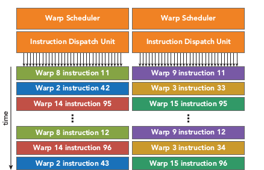

## 为什么AI更需要GPU而不是CPU？

AI模型的训练和推理，本质上是**大规模的矩阵运算**。以一个简单的神经网络为例，前向传播和反向传播过程中充斥着矩阵乘法、卷积等运算，这些运算具有以下特点：

### 计算密集型且高度并行

神经网络的每一层通常包含数百万到数十亿个参数，训练时需要对海量数据进行重复计算。这些计算任务：
- **高度重复**：相同的运算指令应用于不同的数据
- **天然并行**：矩阵中每个元素的计算相互独立，可以同时进行
- **运算简单**：主要是浮点数的加法和乘法，逻辑控制少

例如，一个`1024×1024`的矩阵乘法需要约**10亿次**浮点运算，但每次运算都是简单的乘加操作，且互不依赖。

### GPU的天然优势

`GPU`拥有**数千个轻量级计算核心**（如`NVIDIA A100`有`6912`个`CUDA`核心），专为这种"简单指令、海量数据"的场景设计：
- **大规模并行**：成千上万个核心同时工作，将矩阵运算分配给不同核心并行执行
- **高吞吐量**：每秒可完成数万亿次浮点运算（`TFLOPS`级别）
- **内存带宽高**：HBM高带宽内存可快速传输海量数据

相比之下，`CPU`通常只有**几十个核心**（如`Intel Xeon`最多几十核），更擅长处理复杂的串行逻辑，面对AI训练这种大规模并行任务时效率远低于`GPU`。

### 实际性能对比

以训练一个`ResNet-50`模型（计算机视觉领域基准模型）为例：
- **CPU（Intel Xeon）**：数小时到数天
- **单块GPU（NVIDIA A100）**：几分钟到几小时
- **多GPU集群**：进一步缩短至分钟级

`GPU`相比`CPU`在AI训练上可实现 **`10-100`倍** 的加速，这就是为什么现代AI基础设施几乎全部依赖`GPU`的根本原因。

## CPU与GPU的架构设计差异

`CPU`和`GPU`虽然都是处理器，但它们的设计理念截然不同，分别针对不同类型的计算任务优化。

- `CPU`：通用计算核心，擅长执行复杂、多样化的任务，尤其是需要精确逻辑和分支判断的计算。
- `GPU`：计算的加速引擎，专为大规模数据并行处理而设计，能够并行处理多个相似的计算任务。
- `GPU`相比于`CPU`拥有更多算术逻辑单元（`ALU`），`CPU`则拥有更多控制单元（复杂指令解码、分支预测、乱序执行、投机执行等），因此`CPU`擅长处理逻辑复杂、分支多变的任务，`GPU`更擅长并行计算。

### 缓存结构

#### CPU：大容量多级缓存
- **设计目标**：减少内存访问延迟
- **特点**：包含`L1`、`L2`、`L3`多级高速缓存（几`MB`到几十`MB`）
- **策略**：将经常访问的数据放在低级缓存，不经常访问的放在高级缓存
- **原因**：`CPU`处理的指令流复杂多变，需要频繁访问不同内存地址，大缓存可显著降低平均访问时间

#### GPU：少量缓存
- **设计目标**：减少缓存占用，腾出空间给更多计算核心
- **特点**：缓存容量相对较小
- **策略**：依靠高带宽显存（`HBM`）和大量线程隐藏内存延迟
- **原因**：`GPU`处理的数据访问模式规整、可预测，且通过大量线程并发执行来掩盖访存延迟，不需要依赖大缓存

### 控制单元

#### CPU：复杂控制逻辑
- **分支预测**：预测程序执行路径，提前加载指令，减少分支跳转损失
- **乱序执行**：动态调整指令执行顺序，充分利用执行单元
- **数据转发（前递）**：指令间数据依赖时快速转发数据，避免等待
- **目标**：降低单条指令延迟，适应复杂的程序逻辑

#### GPU：简化控制逻辑
- **无分支预测**：控制单元极简，不进行复杂的分支预测
- **SIMD/SIMT模式**：同一指令作用于多个数据（`Single Instruction`, `Multiple Threads`）
- **一个控制器管理多个核心**：一行运算单元共享一个控制器，所有核心执行相同指令
- **目标**：提高吞吐量，适应数据并行的整齐划一运算

### 运算核心

#### CPU：少而强的核心
- **核心数**：通常几十个（如`Intel Xeon Platinum`最多几十核）
- **单核性能**：每个核心功能强大，支持复杂的整型、浮点型、向量运算
- **频率**：主频高（`3-4GHz`甚至更高）
- **适合**：串行任务、复杂逻辑、低延迟场景

#### GPU：多而简的核心
- **核心数**：数千到上万个（如`NVIDIA A100`有`6912`个`CUDA`核心）
- **单核性能**：每个核心功能简单，主要执行浮点运算
- **频率**：主频较低（`1-2GHz`）
- **长延时流水线**：采用深度流水线，通过高吞吐量补偿单指令延迟
- **适合**：大规模并行任务、数据密集型计算

### 并行计算模型

**单指令多数据（`Single Instruction, Multiple Data, SIMD`）**：一条指令同时在多个数据元素上执行。一次执行一条指令，同时对多个数据元素进行相同操作。数据被组织成向量或者批次，由同一个指令控制单元下发到多个执行单元，同时进行处理。如`CPU`中的向量化指令集（`SSE`、`AVX`）。

**单指令多线程（`Single Instruction, Multiple Thread, SIMT`）**：一次发出一条指令，但由多个独立线程执行，每个线程拥有自己的寄存器和程序计数器。每个线程可以操作不同的数据，线程间可以有分支，但是同一个`warp`分支不一致时会发生分支发散，影响程序性能。

`SIMD`是硬件级别的向量化模型，强调“指令+数据通道同步”，缺点是编程不够灵活；`SIMT`是`GPU`提供的编程抽象，是多线程编程模型。
例子：`SIMD`好比是一个工人，把8块砖放到一个箱子里，然后一次把箱子搬到指定位置；`SIMT`则是被镣铐锁住的`8`个囚犯，每人搬一块，指挥一次，也能把8块砖搬到指定位置。

### 计算架构

**流式处理器（`Stream Processor`）**：最基本的处理单元，也称为`CUDA core`。最后具体的指令和任务都是在`SP`上处理的。`GPU`进行并行计算，也就是很多个`SP`同时做处理。

**流式多处理器（`Stream MultiProcessor`）**：`SM`由多个流式处理器（`Stream Processor`）、线程、一定数量的寄存器、线程束（`thread warp`）调度器、缓存组成。每个流式多处理器可以视为具有较小结构的`CPU`，支持指令并行。流式多处理器是线程块的运行载体，但不支持乱序执行。采用SIMT单指令多线程执行，一个指令由同一个`warp`中的`32`个线程执行。

`Warp`：`warp`是调度和运行的基本单元，`warp`中所有`threads`并行的执行相同的指令。`warp`由`SM`的硬件`warp scheduler`负责调度，一个`SM`同一个时刻可以执行多个`warp`。

**编程模型**：
- `Grid`：由一个单独的`kernel`启动的所有线程组成一个`grid`，`grid`中所有线程共享`global memory`。`Grid`由很多`Block`组成，可以是一维二维或三维。
- `Block`：一个`grid`由许多`block`组成，`block`由许多线程组成，同样可以有一维、二维或者三维。`block`内部的多个线程可以同步（`synchronize`），可访问共享内存（`share memory`）。
- `Thread`：最小编程模型，具体执行计算。

### 存储架构

**全局内存（`Global Memory`）**：即显存（`HBM`），全局存储器，通过动态随机访问存储器实现。延迟高（几百个时钟周期），吞吐量大，配有`L2 Cache`。访问全局内存需要进行合并访问（`coalesce access`），即一个`warp`的线程尽量访问连续地址。

**共享内存（`Shared Memory`）**：共享存储器，也是片上存储器；把共享存储器分配给线程块，同一个块（`Block`）中的所有线程都可以访问共享存储器中的变量，共享存储器是一种用于线程协作的高效方式；延迟显著低于全局内存（十几个时钟周期），可将需要频繁访问的数据加载到共享内存中进行优化，但需要避免出现`bank conflict`，即多个地址请求落在同一个`bank`中。

**本地内存（`Local Memory`）**：本地存储器，存储位置在显存上，也就是全局存储器，只是在逻辑上属于某个线程，当线程使用的寄存器都占满时，数据将被存储在全局存储器，因为不是片上的寄存器或者缓存，访问速度很慢。

**寄存器（`Register`）**：是`GPU`片上（`on-chip`）高速缓存，执行单元可以以极低的延迟访问寄存器（单周期访问）；寄存器变量是每个线程私有的，一旦`thread`执行结束，寄存器变量就会失效。把寄存器分配给每个线程，而每个线程也只能访问分配给自己的寄存器。

### 设计理念总结

| 维度 | CPU | GPU |
|------|-----|-----|
| **设计导向** | 减少指令延迟 | 增加计算吞吐量 |
| **核心数量** | 少而强（几十个核心） | 多而简（数千到上万个核心） |
| **主频** | 高频（`3-4GHz`或更高） | 低频（`1-2GHz`） |
| **缓存结构** | 大容量多级缓存（`L1/L2/L3`，几MB到几十MB） | 小缓存，依靠高带宽显存（`HBM`） |
| **控制逻辑** | 复杂（分支预测、乱序执行、数据转发） | 简化（无分支预测，`SIMT`单指令多线程） |
| **并行模型** | `SIMD`（向量化指令集，如`SSE`、`AVX`） | `SIMT`（单指令多线程，`Warp`调度） |
| **内存带宽** | 较低（`DDR`） | 极高（`HBM`高带宽内存） |
| **优势场景** | 复杂逻辑、频繁分支、低延迟、串行任务 | 简单重复、高度并行、高吞吐、数据密集 |
| **典型应用** | 操作系统、数据库、`Web`服务、通用计算 | `AI`训练推理、科学计算、图形渲染、矩阵运算 |
| **类比** | 精密机床，适合加工复杂零件 | 大规模流水线，适合批量生产 |

## 异构计算：CPU与GPU的协同

在现代AI计算系统中，单靠`GPU`无法完成全部任务，必须借助`CPU`协同工作，这就是**异构计算**模式。

### 分工模式

- **CPU负责**：
  - 程序流程控制（调度、分支决策）
  - 数据预处理和后处理
  - 与系统交互（I/O、网络通信）
  - 启动`GPU`任务、管理显存

- **GPU负责**：
  - 大规模并行计算（矩阵运算、卷积等）
  - 模型前向和反向传播
  - 梯度计算和参数更新

### 典型工作流程

1. **CPU准备数据**：从硬盘/内存读取训练数据，进行必要的预处理
2. **CPU→GPU传输**：将数据从主机内存拷贝到`GPU`显存
3. **GPU执行计算**：数千个核心并行执行训练任务
4. **GPU→CPU传输**：将计算结果（如损失值、梯度）拷贝回`CPU`
5. **CPU分析决策**：根据结果决定是否继续训练、调整超参数等
6. **循环往复**：重复上述过程直到训练完成

### 为什么需要这种模式？

- **发挥各自优势**：`CPU`擅长控制流，`GPU`擅长计算密集任务
- **系统兼容性**：操作系统、文件系统等基础设施运行在`CPU`上
- **成本效益**：通过合理分工，达到性能和成本的最优平衡

## 总结

`CPU`和`GPU`的架构差异源于它们服务的不同计算场景：

- **CPU**是计算机的"大脑"，擅长处理复杂逻辑和串行任务，通过大缓存、分支预测等技术追求**低延迟**
- **GPU**是计算机的"肌肉"，擅长大规模重复计算和并行任务，通过海量核心和简化控制追求**高吞吐量**

AI模型训练恰好属于后者——大规模的矩阵运算，天然适合`GPU`的并行架构。这就是为什么现代AI基础设施几乎全部依赖`GPU`，并采用`CPU`-`GPU`异构计算模式来发挥各自优势。

理解这些底层架构差异，对于优化AI训练流程、选择合适的硬件配置、提升资源利用率都至关重要。