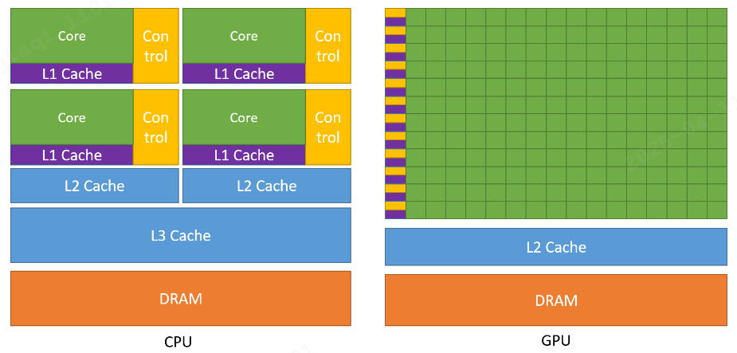

## 为什么AI更需要GPU而不是CPU？

AI模型的训练和推理，本质上是**大规模的矩阵运算**。以一个简单的神经网络为例，前向传播和反向传播过程中充斥着矩阵乘法、卷积等运算，这些运算具有以下特点：

### 计算密集型且高度并行

神经网络的每一层通常包含数百万到数十亿个参数，训练时需要对海量数据进行重复计算。这些计算任务：
- **高度重复**：相同的运算指令应用于不同的数据
- **天然并行**：矩阵中每个元素的计算相互独立，可以同时进行
- **运算简单**：主要是浮点数的加法和乘法，逻辑控制少

例如，一个`1024×1024`的矩阵乘法需要约**10亿次**浮点运算，但每次运算都是简单的乘加操作，且互不依赖。

### GPU的天然优势

`GPU`拥有**数千个轻量级计算核心**（如`NVIDIA A100`有`6912`个`CUDA`核心），专为这种"简单指令、海量数据"的场景设计：
- **大规模并行**：成千上万个核心同时工作，将矩阵运算分配给不同核心并行执行
- **高吞吐量**：每秒可完成数万亿次浮点运算（`TFLOPS`级别）
- **内存带宽高**：HBM高带宽内存可快速传输海量数据

相比之下，`CPU`通常只有**几十个核心**（如`Intel Xeon`最多几十核），更擅长处理复杂的串行逻辑，面对AI训练这种大规模并行任务时效率远低于`GPU`。

### 实际性能对比

以训练一个`ResNet-50`模型（计算机视觉领域基准模型）为例：
- **CPU（Intel Xeon）**：数小时到数天
- **单块GPU（NVIDIA A100）**：几分钟到几小时
- **多GPU集群**：进一步缩短至分钟级

`GPU`相比`CPU`在AI训练上可实现 **`10-100`倍** 的加速，这就是为什么现代AI基础设施几乎全部依赖`GPU`的根本原因。

## CPU与GPU的架构设计差异

`CPU`和`GPU`虽然都是处理器，但它们的设计理念截然不同，分别针对不同类型的计算任务优化。

### 缓存结构

#### CPU：大容量多级缓存
- **设计目标**：减少内存访问延迟
- **特点**：包含`L1`、`L2`、`L3`多级高速缓存（几`MB`到几十`MB`）
- **策略**：将经常访问的数据放在低级缓存，不经常访问的放在高级缓存
- **原因**：`CPU`处理的指令流复杂多变，需要频繁访问不同内存地址，大缓存可显著降低平均访问时间

#### GPU：少量缓存
- **设计目标**：减少缓存占用，腾出空间给更多计算核心
- **特点**：缓存容量相对较小
- **策略**：依靠高带宽显存（`HBM`）和大量线程隐藏内存延迟
- **原因**：`GPU`处理的数据访问模式规整、可预测，且通过大量线程并发执行来掩盖访存延迟，不需要依赖大缓存

### 控制单元

#### CPU：复杂控制逻辑
- **分支预测**：预测程序执行路径，提前加载指令，减少分支跳转损失
- **乱序执行**：动态调整指令执行顺序，充分利用执行单元
- **数据转发（前递）**：指令间数据依赖时快速转发数据，避免等待
- **目标**：降低单条指令延迟，适应复杂的程序逻辑

#### GPU：简化控制逻辑
- **无分支预测**：控制单元极简，不进行复杂的分支预测
- **SIMD/SIMT模式**：同一指令作用于多个数据（`Single Instruction`, `Multiple Threads`）
- **一个控制器管理多个核心**：一行运算单元共享一个控制器，所有核心执行相同指令
- **目标**：提高吞吐量，适应数据并行的整齐划一运算

### 运算核心

#### CPU：少而强的核心
- **核心数**：通常几十个（如`Intel Xeon Platinum`最多几十核）
- **单核性能**：每个核心功能强大，支持复杂的整型、浮点型、向量运算
- **频率**：主频高（`3-4GHz`甚至更高）
- **适合**：串行任务、复杂逻辑、低延迟场景

#### GPU：多而简的核心
- **核心数**：数千到上万个（如`NVIDIA A100`有`6912`个`CUDA`核心）
- **单核性能**：每个核心功能简单，主要执行浮点运算
- **频率**：主频较低（`1-2GHz`）
- **长延时流水线**：采用深度流水线，通过高吞吐量补偿单指令延迟
- **适合**：大规模并行任务、数据密集型计算

### 设计理念总结

| 维度 | CPU | GPU |
|------|-----|-----|
| **设计导向** | 减少指令延迟 | 增加计算吞吐量 |
| **优势场景** | 复杂逻辑、频繁分支、低延迟 | 简单重复、高度并行、高吞吐 |
| **核心特点** | 少核心、强单核、大缓存、复杂控制 | 多核心、简单核、小缓存、简化控制 |
| **类比** | 精密机床，适合加工复杂零件 | 大规模流水线，适合批量生产 |

## 异构计算：CPU与GPU的协同

在现代AI计算系统中，单靠`GPU`无法完成全部任务，必须借助`CPU`协同工作，这就是**异构计算**模式。

### 分工模式

- **CPU负责**：
  - 程序流程控制（调度、分支决策）
  - 数据预处理和后处理
  - 与系统交互（I/O、网络通信）
  - 启动`GPU`任务、管理显存

- **GPU负责**：
  - 大规模并行计算（矩阵运算、卷积等）
  - 模型前向和反向传播
  - 梯度计算和参数更新

### 典型工作流程

1. **CPU准备数据**：从硬盘/内存读取训练数据，进行必要的预处理
2. **CPU→GPU传输**：将数据从主机内存拷贝到`GPU`显存
3. **GPU执行计算**：数千个核心并行执行训练任务
4. **GPU→CPU传输**：将计算结果（如损失值、梯度）拷贝回`CPU`
5. **CPU分析决策**：根据结果决定是否继续训练、调整超参数等
6. **循环往复**：重复上述过程直到训练完成

### 为什么需要这种模式？

- **发挥各自优势**：`CPU`擅长控制流，`GPU`擅长计算密集任务
- **系统兼容性**：操作系统、文件系统等基础设施运行在`CPU`上
- **成本效益**：通过合理分工，达到性能和成本的最优平衡

## 总结

`CPU`和`GPU`的架构差异源于它们服务的不同计算场景：

- **CPU**是计算机的"大脑"，擅长处理复杂逻辑和串行任务，通过大缓存、分支预测等技术追求**低延迟**
- **GPU**是计算机的"肌肉"，擅长大规模重复计算和并行任务，通过海量核心和简化控制追求**高吞吐量**

AI模型训练恰好属于后者——大规模的矩阵运算，天然适合`GPU`的并行架构。这就是为什么现代AI基础设施几乎全部依赖`GPU`，并采用`CPU`-`GPU`异构计算模式来发挥各自优势。

理解这些底层架构差异，对于优化AI训练流程、选择合适的硬件配置、提升资源利用率都至关重要。