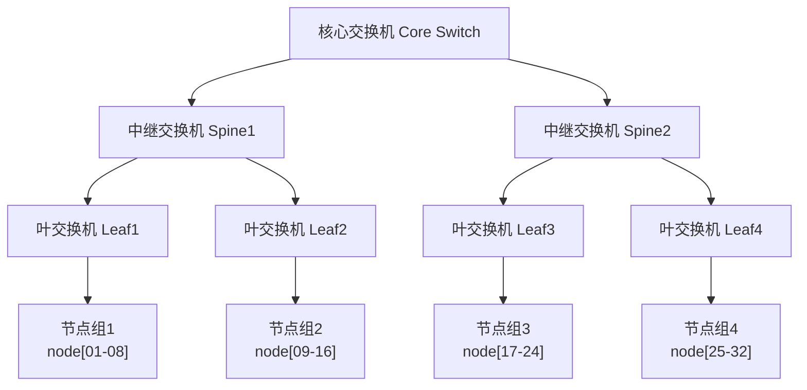
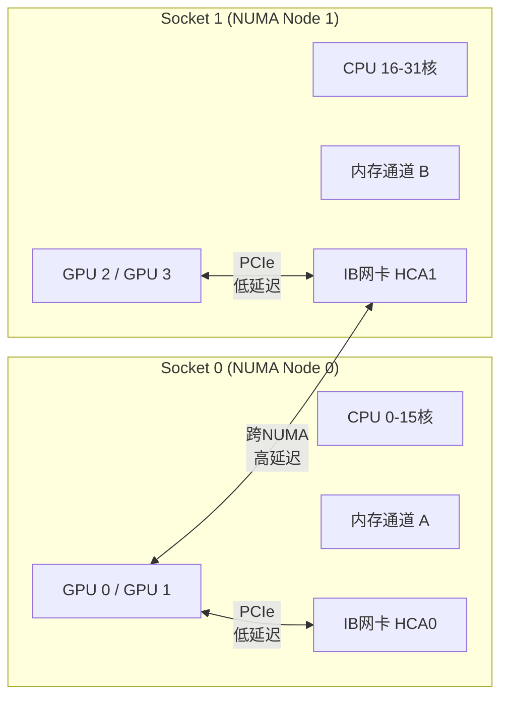
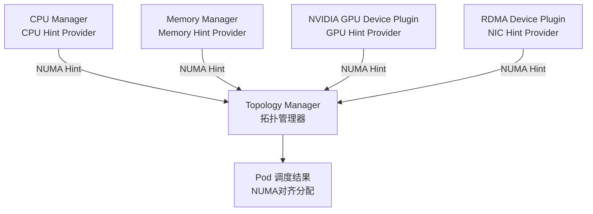
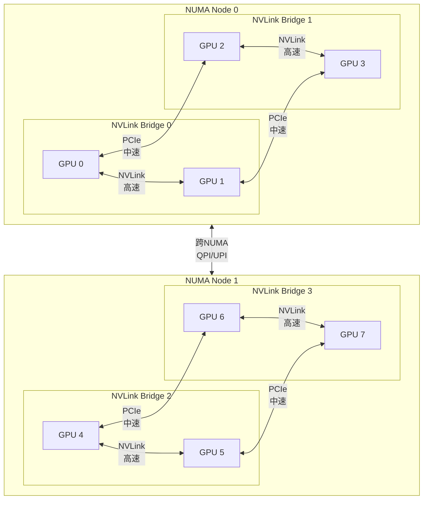

随着大模型训练规模的持续扩大，算力集群的网络通信能力已成为影响训练效率的核心变量。在千卡级别的分布式训练中，`GPU`算力往往并非瓶颈，跨节点的集合通信（`AllReduce`、`AllGather`等）延迟与带宽才是决定训练吞吐量的关键因素。高性能网络（高网）环境下的拓扑感知调度，即如何将训练任务尽可能调度到通信代价最低的节点组合上，是`HPC`调度系统必须解决的核心问题。

`Slurm`作为`HPC`领域的主流作业调度器，在高网支持方面积累了深厚的工程经验；而`Kubernetes`（`K8S`）作为云原生领域的容器编排标准，凭借其生态丰富性与运维便利性，在`AI`训练场景中的应用也日益普遍。本文将系统对比两者在高网调度场景下的能力与差异。

## 两种调度系统的定位与应用场景

### Slurm的定位与优势

`Slurm`（`Simple Linux Utility for Resource Management`）是专为`HPC`集群设计的开源工作负载管理器，由`SchedMD`主导开发。其核心设计目标是在高密度计算节点上高效调度批量作业，并最大化资源利用率。

`Slurm`在`AI`训练场景中的主要优势：

| 维度 | 说明 |
|------|------|
| **高网原生支持** | 原生支持`InfiniBand`网络拓扑感知调度，可通过`topology.conf`精确描述交换机层级 |
| **`GPU`拓扑感知** | 通过`GRES`（Generic RESource）机制感知`GPU`间`NVLink`连接状态，支持拓扑优先调度 |
| **`NUMA`亲和性** | 支持将`GPU`与对应`Socket`的`CPU`核心绑定，配置粒度细 |
| **裸金属性能** | 常以裸金属或轻量容器方式运行，不必经过通用`CNI`网络路径，延迟更可预期 |
| **成熟稳定** | 经过数十年`HPC`生产验证，大规模多机多卡作业调度稳定性高 |
| **作业队列管理** | 原生支持优先级队列、抢占、配额等高级调度策略 |

> 关于`Slurm`的详细介绍请参考章节：[Slurm：AI大模型训练的高性能计算调度框架](../../600-训练微调/50-高性能计算/1000-Slurm：AI大模型训练的高性能计算调度框架.md)

### K8S的定位与优势

`Kubernetes`是云原生容器编排平台，其调度模型源于通用云计算场景，具备强大的生态系统与声明式资源管理能力。

`K8S`在`AI`训练场景中的主要优势：

| 维度 | 说明 |
|------|------|
| **生态丰富** | 与`Kubeflow`、`Volcano`、`Ray`等`AI`训练框架深度集成 |
| **容器化隔离** | 训练环境标准化，依赖管理、版本隔离能力强 |
| **弹性调度** | 支持动态扩缩容、故障自愈、弹性资源池 |
| **多租户管理** | `Namespace`隔离、`RBAC`权限控制体系成熟 |
| **声明式管理** | 通过`CRD`扩展资源类型，支持自定义调度策略 |
| **混合负载** | 可同时管理训练任务与推理服务，统一算力平台 |

## 场景一：多机多卡网络拓扑调度

在多台服务器组成的`GPU`集群中，节点通常通过分层`InfiniBand`（`IB`）交换机互联。同一叶交换机（`Leaf Switch`）下的节点间通信路径更短、延迟更低；跨叶交换机通信需要经过上层交换机，虽然在非阻塞胖树中理论峰值带宽可能相同，但更容易受到上行链路和共享核心层的拥塞影响。在调度大规模分布式训练任务时，优先将训练作业聚合在通信代价更低的拓扑域内，通常可以降低集合通信延迟、提高训练吞吐。

### 网络拓扑层级模型



### Slurm的实现方式

`Slurm`通过`topology.conf`配置文件精确描述集群的`IB`网络拓扑层级，调度器在分配节点时会尽量将作业节点聚合在同一交换机域内，以最小化跨交换机通信。

**配置机制**：`Slurm`支持多种拓扑插件，主要包括：

- `topology/tree`：树形拓扑，适用于`InfiniBand`胖树网络，是多机多卡训练最常用的配置
- `topology/block`：块拓扑，适用于需要严格控制跨块碎片化的场景
- `topology/torus3d`：三维环形拓扑，适用于3D Torus网络；`Dragonfly`网络通常通过`topology/tree`配合`TopologyParam=dragonfly`表达

**`topology.conf`配置示例（树形拓扑）**：

```ini
# 叶交换机与节点的映射
SwitchName=leaf1 Nodes=node[01-08]
SwitchName=leaf2 Nodes=node[09-16]
SwitchName=leaf3 Nodes=node[17-24]
SwitchName=leaf4 Nodes=node[25-32]

# 中继交换机与叶交换机的映射
SwitchName=spine1 Switches=leaf[1-2]
SwitchName=spine2 Switches=leaf[3-4]

# 核心交换机
SwitchName=core Switches=spine[1-2]
```

**关键调度行为**：配置`TopologyPlugin=topology/tree`后，`Slurm`的调度逻辑会：

1. 优先从同一叶交换机下选择节点，满足需求则不跨叶
2. 若同一叶交换机节点不足，则尝试同一中继交换机下的多个叶交换机
3. 最后才考虑跨中继交换机的节点

用户还可以在作业提交时通过`--switches`参数限制最大跨交换机数量：

```bash
# 要求所有节点在最多2个叶交换机内，最长等待30分钟
sbatch --nodes=16 --switches=2@30:00 train.sh
```

**自动拓扑生成工具**：对于大规模`InfiniBand`集群，官方文档推荐可使用独立维护的`slurmibtopology`工具扫描`IB`网络并生成`topology.conf`，但它不是`Slurm`内置功能，仍需要纳入集群配置变更流程。

**成熟度评估**：`topology/tree`插件已在生产`HPC`环境中稳定运行多年，是目前`Slurm`最成熟、使用最广泛的拓扑调度功能，可靠性极高。

### K8S的实现方式

`Kubernetes`原生调度器并不感知节点间的网络拓扑关系，调度决策基于节点的资源标签（`labels`）、`taints`/`tolerations`等机制，缺乏内置的`IB`网络拓扑感知能力。

**现有扩展方案**：

1. **节点标签方案**：运维人员手动为节点打上交换机归属标签（如`topology.kubernetes.io/rack=leaf1`），结合`nodeAffinity`、`podAffinity`或`topologySpreadConstraints`引导调度，但只能实现粗粒度控制，无法自动计算最优拓扑

2. **`Kueue Topology Aware Scheduling`（`TAS`）**：`Kueue`提供面向批任务/训练任务的拓扑感知调度能力，通过节点标签表达`block/rack/host`等层级，并在`JobSet`、`Kubeflow Trainer`等工作负载进入集群前做准入与放置决策。它适合云原生批调度场景，但拓扑信息仍主要依赖管理员或云厂商标签维护，不等价于自动读取`IB` Fabric拓扑

3. **`Network Topology`插件（`scheduler-plugins`）**：`Kubernetes`社区的`scheduler-plugins`仓库中提供了`NetworkOverhead`插件，可通过自定义的`NetworkTopology` CRD描述节点间网络代价，在调度打分阶段倾向于选择网络代价更低的节点组合。该插件主要面向通用微服务延迟感知场景，并非专为`IB`高网训练设计

4. **`Volcano`调度器**：`Volcano`是专为`AI`/`HPC`工作负载设计的批调度系统，除`Gang Scheduling`外，近期版本提供了基于`HyperNode` CRD的`network-topology-aware`插件，可通过手工建模或对接`UFM`、节点标签等发现源维护层级网络拓扑（官方文档中也提到`RoCE`发现源，但标注为暂不支持）。该方向已经比单纯标签亲和更接近`Slurm topology/tree`，但仍依赖额外组件、版本较新，生产成熟度和标准化程度需要结合具体版本验证

5. **云厂商与商业方案**：`AWS`、`Google Cloud`、`Azure`、`NVIDIA Run:ai`等产品会提供各自的拓扑感知调度能力，但通常与平台网络模型、节点标签或专有调度器绑定，跨环境可移植性有限

**自动拓扑生成能力**：目前`K8S`原生生态中没有类似`Slurm slurmibtopology`那样通用、事实标准的“扫描`IB Fabric`并生成调度器拓扑配置”的工具。`Kueue TAS`、`scheduler-plugins`、`Volcano HyperNode`等方案都可以消费或表达网络拓扑，但拓扑数据通常需要通过节点标签、`CRD`、云厂商元数据或外部拓扑发现系统提供。其中`Volcano HyperNode Auto-Discovery`最接近`slurmibtopology`的思路，但它属于`Volcano`调度器体系内的能力，并不是`Kubernetes`原生调度器的通用能力。

**成熟度评估**：`K8S`原生调度器在多机`IB`网络拓扑感知方面仍不成熟；生态方案（`Kueue TAS`、`Volcano HyperNode`、商业调度器）正在补齐能力，但普遍需要额外`CRD`、标签或外部拓扑发现系统。与`Slurm topology/tree`相比，差距主要不在“能否表达拓扑”，而在拓扑数据的标准化、自动发现、调度闭环和长期生产验证。

### 对比总结

| 对比维度 | Slurm | K8S |
|:---------:|-------|-----|
| <span style={{whiteSpace: 'nowrap'}}><strong> `IB`拓扑描述 </strong></span> | `topology.conf`精确描述交换机层级 | 原生缺失；生态方案通过标签、`NetworkTopology`、`HyperNode`等`CRD`表达 |
| <span style={{whiteSpace: 'nowrap'}}><strong> 调度算法 </strong></span> | 内置最低可满足交换机域 + `best-fit`策略 | 原生无内置拓扑算法；依赖`Kueue`、`Volcano`、商业调度器等扩展 |
| <span style={{whiteSpace: 'nowrap'}}><strong> 自动化程度 </strong></span> | 中高（可借助独立工具生成配置，配置仍需维护） | 低到中（取决于是否接入`UFM`、`RoCE`、云厂商拓扑数据等发现源） |
| <span style={{whiteSpace: 'nowrap'}}><strong> 生产成熟度 </strong></span> | 生产级，广泛部署 | 原生不足；生态方案快速演进，需按版本验证 |
| <span style={{whiteSpace: 'nowrap'}}><strong> 用户控制粒度 </strong></span> | `--switches`参数精细控制 | 依赖标签、`CRD`和插件策略，能力与可移植性差异较大 |

## 场景二：单节点CPU&NUMA亲和性调度

现代高性能服务器通常采用多`Socket`（`CPU`插槽）架构，每个`Socket`对应一个`NUMA`（`Non-Uniform Memory Access`）节点。`GPU`和`NIC`网卡等`PCIe`设备连接在特定的`NUMA`节点下。若`GPU`使用的是对侧`NUMA`节点的`CPU`核心或内存，将产生额外的跨`NUMA`访问延迟，严重影响`GPUDirect RDMA`的传输效率。

### CPU&NUMA亲和性的重要性



理想情况下，训练进程应同时绑定到`GPU`、与该`GPU`同`NUMA`节点的`NIC`，以及对应的`CPU`核心。这是实现高效`GPUDirect RDMA`传输的前提。

### Slurm的实现方式

`Slurm`的`NUMA`亲和性调度通过`GRES`（通用资源）机制与`Socket`亲和性配置共同实现。

**核心配置机制**：

在`gres.conf`中通过`Cores`参数指定每个`GPU`对应的`CPU`核心（必须对齐到`Socket`边界）：

```ini
# gres.conf - 配置GPU与Socket的亲和关系
AutoDetect=nvml
# GPU 0, GPU 1 属于 Socket 0 (核心 0-15)
Name=gpu Type=a100 File=/dev/nvidia0 Cores=0-15
Name=gpu Type=a100 File=/dev/nvidia1 Cores=0-15
# GPU 2, GPU 3 属于 Socket 1 (核心 16-31)
Name=gpu Type=a100 File=/dev/nvidia2 Cores=16-31
Name=gpu Type=a100 File=/dev/nvidia3 Cores=16-31
```

**作业提交时**，用户可通过`--gres-flags=enforce-binding`强制使调度器只分配与`GPU`同`Socket`的`CPU`核心：

```bash
sbatch --gres=gpu:a100:2 \
       --gres-flags=enforce-binding \
       --cpus-per-gpu=8 \
       train.sh
```

**NIC亲和性**：`Slurm`对`NIC`网卡的亲和性控制通过`MPI`启动层（如`OpenMPI`的`--bind-to`、`MPICH`的设备绑定选项）实现，调度器本身不直接管理`NIC`分配。训练框架通过读取`SLURM_JOB_NODELIST`、`SLURM_LOCALID`等环境变量，结合`ibstat`等工具自行选择对应的`HCA`设备。

**`NUMA`节点等价配置**：对于`GPU`亲和性边界与`Socket`不完全对齐的复杂拓扑（如某些服务器每个物理`Socket`下含多个`NUMA`节点），`Slurm 23.x+`支持通过`SlurmdParameters=numa_node_as_socket`或`l3cache_as_socket`将`NUMA`节点或`L3 Cache`域映射为虚拟`Socket`，从而实现更精细的亲和性控制。

**成熟度评估**：`Slurm`的`Socket/NUMA`亲和性调度功能成熟，广泛用于`HPC`生产环境；新版本也可通过`numa_node_as_socket`等参数把`NUMA`节点映射成更细的调度边界。但`NIC`亲和性并非`Slurm`核心调度器直接分配，仍需要`MPI`、`NCCL`、训练框架或启动脚本协同处理。

### K8S的实现方式

`Kubernetes`通过`Topology Manager`（拓扑管理器）机制实现节点内的`NUMA`亲和性资源协同分配。该功能在`v1.27`进入稳定版（`Stable`），当前文档仍明确其工作位置是`kubelet`准入与本机资源分配阶段，而不是`kube-scheduler`全局调度阶段。

**`Topology Manager`工作机制**：

`Topology Manager`是`kubelet`中的组件，作为各`Hint Provider`（提示提供者）之间的协调者：

- `CPU Manager`：负责提供`CPU`核心的`NUMA`归属信息
- `Memory Manager`：负责提供`NUMA`节点内存的分配信息
- `Device Plugin`（如`NVIDIA GPU Device Plugin`、`RDMA Device Plugin`）：负责提供`GPU`、`NIC`等设备的`NUMA`归属信息



**策略配置**：`Topology Manager`支持四种策略，通过`kubelet`配置`--topology-manager-policy`指定：

| 策略 | 说明 | 适用场景 |
|------|------|---------|
| `none` | 默认，不进行亲和性决策 | 对延迟不敏感的通用负载 |
| `best-effort` | 尽力满足`NUMA`亲和性，不满足时仍允许调度 | 性能优先但不强制 |
| `restricted` | 必须满足`NUMA`亲和性，否则`kubelet`拒绝准入，`Pod`进入`Terminated`状态 | 高性能训练推荐 |
| `single-numa-node` | 所有资源必须来自同一`NUMA`节点，否则`kubelet`拒绝准入 | 超低延迟场景 |

**推荐`K8S`高网训练配置**：

```yaml
# kubelet 配置（KubeletConfiguration）
topologyManagerPolicy: restricted
topologyManagerScope: pod  # 对整个Pod整体进行NUMA对齐
cpuManagerPolicy: static
```

**`Pod`资源请求示例**：

```yaml
apiVersion: v1
kind: Pod
spec:
  containers:
  - name: trainer
    resources:
      limits:
        cpu: "16"                    # 整数CPU，触发CPU Manager静态策略
        memory: "128Gi"
        nvidia.com/gpu: "2"          # GPU，由NVIDIA Device Plugin提供NUMA hint
        rdma/rdma_shared_device_a: "1" # RDMA NIC，由RDMA Device Plugin提供NUMA hint
```

当`Topology Manager`策略为`restricted`时，`kubelet`会在准入阶段综合`CPU Manager`、`Memory Manager`和`Device Plugin`提供的`NUMA hint`。如果能找到满足策略的组合，后续本机资源分配会按该组合执行；如果不能满足，`Pod`会在该节点准入失败。这里需要特别注意：默认`kube-scheduler`并不知道这些本机`NUMA`约束，它只是先把`Pod`调度到某个节点。

**已知限制**：

- `Topology Manager`默认最多支持`8`个`NUMA`节点（超过则需要开启`max-allowable-numa-nodes` beta特性）
- `kube-scheduler`本身不感知`NUMA`，`Topology Manager`仅在`kubelet`准入阶段生效，可能导致`Pod`被调度到某节点后因`Topology Affinity`错误进入`Terminated`状态；官方建议使用`Deployment`、`ReplicaSet`或外部控制循环重新创建
- `NIC`亲和性依赖`RDMA Device Plugin`正确上报`NUMA`归属，不同版本插件支持程度不一

**成熟度评估**：`K8S` `Topology Manager`已在`v1.27`达到稳定，对于`GPU`与`CPU`的`NUMA`亲和性支持较好；但`NIC`亲和性的完整支持依赖`RDMA Device Plugin`的配合，而且调度器与`kubelet`准入阶段分离，整体生态链路较长，生产落地复杂度高于`Slurm`。

### 对比总结

| 对比维度 | Slurm | K8S |
|:---------:|-------|-----|
| <span style={{whiteSpace: 'nowrap'}}><strong> `GPU`-`CPU NUMA`亲和</strong></span> | `Cores`参数配置，基于`Socket`粒度 | `Topology Manager`协调，基于`NUMA`节点粒度 |
| <span style={{whiteSpace: 'nowrap'}}><strong> `NIC`-`GPU NUMA`亲和</strong></span> | 依赖`MPI`层自行处理 | `RDMA Device Plugin`提供`NUMA hint`，`Topology Manager`统一协调 |
| <span style={{whiteSpace: 'nowrap'}}><strong> 强制亲和失败处理</strong></span> | 调度延迟等待满足条件的节点 | `kubelet`准入失败后`Pod`进入`Terminated`，需控制器或外部循环重建 |
| <span style={{whiteSpace: 'nowrap'}}><strong> 配置复杂度</strong></span> | 中（`gres.conf`静态配置） | 高（`kubelet`配置 + 多个`Device Plugin`协同） |
| <span style={{whiteSpace: 'nowrap'}}><strong> 生产成熟度</strong></span> | 成熟，广泛使用 | `Stable`，但完整链路生产验证仍在积累中 |

## 场景三：单节点内GPU拓扑通信优化调度

在单台`GPU`服务器内部，`GPU`之间的互联拓扑并非均匀。以典型的`8`卡`PCIe`服务器为例，`8`张卡通常被划分到`2`个`NUMA`节点下，每个`NUMA`节点`4`张卡。在同一`NUMA`节点的`4`张卡中，又有`2`张卡之间通过`NVLinkBridge`直接高速互联，另外`2`张卡与它们之间仅通过`PCIe`总线互联。

### 单机GPU拓扑示例



`nvidia-smi topo -m`输出可直观展示这种层级拓扑：`NV#`表示`NVLink`直连，`PIX/PXB/PHB`表示不同层级的`PCIe`路径，`NODE/SYS`表示需要经过更远的主机互联或跨`NUMA`路径。对于需要4张卡的训练任务，优先分配同一`NVLinkBridge`下的2+2组合，或同一`NUMA`节点内的4张卡，通信效率通常高于跨`NUMA`选取。

### Slurm的实现方式

`Slurm`通过`gres.conf`中的`Links`参数来描述`GPU`之间的互联权重，调度器在单节点内分配`GPU`时会优先选择`Links`权重更高（即互联更紧密）的`GPU`组合。

**`Links`参数机制**：

`Links`是一个逗号分隔的数字列表，描述当前`GPU`与其他各`GPU`之间的连接数（连接数越大表示互联越紧密，`-1`表示自身）。官方文档明确该字段用于辅助共调度连接更紧密的设备。通常由`AutoDetect=nvml`自动填充，无需手动配置：

```ini
# gres.conf - 8卡NVLink拓扑示例（AutoDetect自动填充）
AutoDetect=nvml
# 每行GPU的Links字段由NVML自动检测：
# 与NVLink相连的GPU Links值 > 0，通过PCIe相连 Links=0
# 格式：GPU0的连接=[-1, nvlink_weight, pcie_weight, ...]
Name=gpu Type=a100 File=/dev/nvidia0 Links=-1,4,4,4,0,0,0,0
Name=gpu Type=a100 File=/dev/nvidia1 Links=4,-1,4,4,0,0,0,0
Name=gpu Type=a100 File=/dev/nvidia2 Links=4,4,-1,4,0,0,0,0
Name=gpu Type=a100 File=/dev/nvidia3 Links=4,4,4,-1,0,0,0,0
Name=gpu Type=a100 File=/dev/nvidia4 Links=0,0,0,0,-1,4,4,4
Name=gpu Type=a100 File=/dev/nvidia5 Links=0,0,0,0,4,-1,4,4
Name=gpu Type=a100 File=/dev/nvidia6 Links=0,0,0,0,4,4,-1,4
Name=gpu Type=a100 File=/dev/nvidia7 Links=0,0,0,0,4,4,4,-1
```

**调度行为**：当作业请求多张`GPU`时，`Slurm`的`GRES`调度器会利用`Links`信息尽量共调度连接更紧密的设备，从而提高单机内选到通信更优`GPU`子集的概率。实际是否达到全局最优，还会受到已占用设备、`GRES`类型约束、`Cores`亲和性和作业请求形态影响。

**与`AutoDetect`配合**：实际生产中通常只需设置`AutoDetect=nvml`，`Slurm`会自动调用`NVML`库读取`nvidia-smi topo -m`等效信息并填充`Links`，无需管理员手动维护复杂的拓扑矩阵。

**成熟度评估**：`Slurm` `Links`机制在支持`NVLink`的`NVIDIA GPU`服务器上成熟可靠，结合`AutoDetect=nvml`基本做到开箱即用，生产成熟度高。

### K8S的实现方式

`Kubernetes`原生的`Device Plugin`接口和调度器对`GPU`间的拓扑关系（如`NVLink`）没有内置感知能力。`GPU`设备作为扩展资源（`nvidia.com/gpu`）暴露给调度器时，调度器只知道节点上有多少张`GPU`可用，无法知道哪些`GPU`之间有`NVLink`连接。

**NVIDIA GPU Feature Discovery**：`NVIDIA GPU Feature Discovery`（`GFD`，可随`GPU Operator`或`NVIDIA Device Plugin`部署）会将节点上`GPU`的硬件特征作为节点标签发布，常见标签包括：

```
nvidia.com/gpu.product=A100-SXM4-80GB
nvidia.com/gpu.count=8
nvidia.com/gpu.family=ampere
nvidia.com/gpu.clique=<GPUFabric-ClusterUUID.CliqueID>
```

但这些标签主要描述节点层面的能力或`GPUFabric`分组，无法让原生调度器在分配具体`GPU`时选择拓扑最优的子集。

**`GetPreferredAllocation` API**：`Kubernetes Device Plugin API`提供了`GetPreferredAllocation`接口，允许`Device Plugin`向`Device Manager`推荐分配哪些具体设备。`NVIDIA Device Plugin`实现了该接口，可以基于`NVML`拓扑信息返回互联最优的`GPU`组合建议。然而，该建议仅在`Device Manager`层面生效，`kube-scheduler`层不感知，调度器仍然先完成节点选择，再由`kubelet`上的`Device Plugin`进行设备选择。

**`DRA`（`Dynamic Resource Allocation`）**：`Dynamic Resource Allocation`（`DRA`）是解决此类问题的长期方向。`DRA API`本身已经在`Kubernetes v1.35`进入稳定版，允许设备驱动和集群管理员定义可声明、可分配的设备资源，`Kubernetes`会把`Pod`放到能够访问已分配设备的节点上。`NVIDIA GPU Operator`也提供`GPU DRA Driver`安装路径，但基于`DRA`的`GPU`细粒度拓扑调度仍取决于驱动、调度器集成和集群版本，生产落地需要单独验证。

**已知限制**：

- 现有`Device Plugin`模型中，调度器只负责选节点，具体`GPU`分配由`kubelet`完成，两阶段分离导致拓扑最优调度难以实现
- `GetPreferredAllocation`是尽力推荐，不是硬约束，极端情况下可能仍分配到非最优组合
- `DRA API`已经稳定，但`GPU`拓扑感知分配的厂商实现和生产最佳实践仍在演进

**成熟度评估**：`K8S`在传统`Device Plugin`模型下的单节点`GPU`内部拓扑感知调度仍弱于`Slurm`。现有方案存在调度阶段与设备分配阶段分离的结构性限制；`DRA`把设备声明与分配前移到调度闭环，是未来解决方向，但具体到`GPU/NVLink/NVSwitch`拓扑的生产成熟度仍需要按厂商实现评估。

### 对比总结

| 对比维度 | Slurm | K8S |
|:---------:|-------|-----|
| <span style={{whiteSpace: 'nowrap'}}><strong> `NVLink`拓扑感知</strong></span> | `Links`参数精确描述，`AutoDetect=nvml`自动填充 | 节点层标签无法表达具体设备组合 |
| <span style={{whiteSpace: 'nowrap'}}><strong> 最优`GPU`子集选择</strong></span> | 内置`Links`辅助共调度，倾向选择更紧密组合 | `GetPreferredAllocation`尽力推荐，非强约束 |
| <span style={{whiteSpace: 'nowrap'}}><strong> 架构支持</strong></span> | 原生支持，调度与分配统一 | **两阶段分离（调度器选节点 + `kubelet`选设备），结构性限制** |
| <span style={{whiteSpace: 'nowrap'}}><strong> 未来方向</strong></span> | 功能稳定，持续改进 | `DRA API`已稳定，`GPU`拓扑调度实现仍在演进 |
| <span style={{whiteSpace: 'nowrap'}}><strong> 生产成熟度</strong></span> | 高，生产广泛部署 | 传统模型较低，`DRA`方案需按厂商实现验证 |

## OpenAI的K8S AI训练实践：如何规避拓扑调度短板

`OpenAI`公开资料显示，其大规模训练平台长期使用`Kubernetes`作为批调度和工作负载管理系统。这个案例经常被用来说明`K8S`可以承载超大规模`AI`训练，但需要注意：`OpenAI`的实践并不是“直接使用原生`kube-scheduler`解决所有高网拓扑调度问题”，而是通过**整节点调度、非阻塞高性能网络、自研平台能力和调度器插件**，把许多`K8S`原本不擅长的问题转化为更简单的工程约束。

### 1. 通过整节点Pod规避单机内拓扑选择

`OpenAI`在`Scaling Kubernetes to 7,500 nodes`一文中提到，大型训练作业通常跨越大量节点，并且许多工作负载采用“一个`Pod`占用整个节点”的模式。这样做带来一个直接效果：`K8S`不需要在单机内为一个训练任务精细选择哪几张`GPU`、哪张`NIC`、哪个`NUMA`节点或哪组`CPU`核心。

在这种模式下，单机内`GPU`之间通过`NVLink/NVSwitch`通信，`GPU`到`NIC`通过`GPUDirect RDMA`通信，节点内部拓扑由服务器硬件设计和训练运行时消化，而不是交给`K8S`调度器在设备级别做组合优化。这与普通多租户`K8S GPU`集群中“多个`Pod`共享同一台`8`卡机器”的问题完全不同。

### 2. 通过full bisection网络降低跨节点拓扑调度需求

`OpenAI`公开资料还提到，其当时的训练集群具备`full bisection bandwidth`，因此不需要做机架或网络拓扑层面的调度考虑。这一点非常关键：如果底层网络接近非阻塞胖树，任意节点之间的可用带宽差异较小，那么训练作业对“必须放在同一叶交换机下”的敏感度会显著下降。

这一点也与其基础设施背景一致：`Microsoft`公开资料显示，为`OpenAI`构建的`Azure`超算包含超过`285,000`个`CPU`核心、`10,000`个`GPU`，并为每台`GPU`服务器提供`400Gbps`网络连接。这类硬件和网络条件，本身就在很大程度上降低了应用层调度器对网络拓扑优化的压力。

这并不意味着`K8S`拥有了类似`Slurm topology/tree`的能力，而是说明`OpenAI`通过硬件和网络架构降低了这类调度能力的必要性。对普通`IB`集群而言，如果网络存在明显的叶交换机、机架、`Pod`、`SuperPod`层级带宽差异，仍然需要显式的拓扑感知调度能力。

### 3. 通过调度器插件解决Gang Scheduling

大规模分布式训练要求一组`Pod`同时获得资源，否则容易出现两个大作业各占一部分节点、彼此都无法启动的资源死锁。`OpenAI`公开资料提到，默认`Kubernetes`调度器不能原生满足这类语义，因此其后续采用`scheduler-plugins`中的`Coscheduling`插件来实现类似`Gang Scheduling`的效果。

这说明`OpenAI`的`K8S`实践依赖调度器扩展，而不是只依赖原生调度器。对训练平台来说，`Gang Scheduling`、队列、公平性、抢占、配额、作业重试等能力通常都需要额外平台层补齐。

### 4. 通过原生Pod网络和MPI直连降低通信开销

`OpenAI`在网络实践中提到，训练`Pod`之间主要通过`MPI`直接使用`Pod IP`通信，而不是依赖`Kubernetes Service`做负载均衡。同时，由于早期`Flannel`在大规模训练场景下吞吐不足，`OpenAI`转向云厂商原生`CNI`/`Pod`网络，以获得接近宿主机级别的网络吞吐。

这类做法的核心是减少`K8S`通用网络抽象对训练通信路径的影响，让训练框架、`MPI`、`NCCL`尽可能直接使用高性能网络。

### 5. 通过平台工程补齐K8S训练能力

`OpenAI`还公开提到了一系列平台工程手段，例如团队级资源管理、`taints`、准入控制、自动扩缩容、`GPU/CPU balloons`、节点预检、健康检查等。这些能力用于解决大规模训练集群中的容量碎片、节点健康、配额隔离、队列等待和故障恢复问题。

因此，`OpenAI`案例的启示不是“`K8S`天然比`Slurm`更适合大规模训练”，而是：当团队具备强平台工程能力，并且可以控制硬件、网络、作业形态和调度扩展时，`K8S`可以作为大规模训练平台的统一控制面。对于缺少非阻塞网络、整节点调度模式和专职平台团队的普通集群，`Slurm`在高网拓扑调度上的成熟度优势仍然明显。

**参考资料**：

- [OpenAI: Scaling Kubernetes to 7,500 nodes](https://openai.com/index/scaling-kubernetes-to-7500-nodes/)
- [Kubernetes OpenAI Case Study](https://kubernetes.io/case-studies/openai/)
- [Microsoft: OpenAI Azure Supercomputer](https://news.microsoft.com/source/features/ai/openai-azure-supercomputer/)

## 综合对比与选型建议

### 三大场景综合成熟度对比

| 场景 | Slurm成熟度 | K8S成熟度 | 差距 |
|------|-----------|----------|------|
| <span style={{whiteSpace: 'nowrap'}}><strong> 多机`IB`网络拓扑调度</strong></span> | ⭐⭐⭐⭐⭐ 生产级 | ⭐⭐⭐ 原生不足，生态扩展快速演进 | 仍显著 |
| <span style={{whiteSpace: 'nowrap'}}><strong> 单节点`CPU&NUMA`亲和性</strong></span> | ⭐⭐⭐⭐ 成熟 | ⭐⭐⭐ `Stable`但链路复杂 | 中等 |
| <span style={{whiteSpace: 'nowrap'}}><strong> 单节点`GPU`内部拓扑</strong></span> | ⭐⭐⭐⭐⭐ 生产级 | ⭐⭐ 传统模型受限，`DRA`方向在演进 | 显著 |

### 选型建议

**优先选择`Slurm`的场景**：

- 大规模多机多卡训练（百卡以上），对训练吞吐率极度敏感
- 集群使用`InfiniBand`网络，需要精确拓扑感知调度
- 服务器为标准`HPC`配置，负载类型相对单一（纯训练作业）
- 团队有`HPC`运维经验，能够维护`Slurm`配置

**优先选择`K8S`的场景**：

- 算力平台需要同时承载训练与推理服务，统一管理
- 团队已有`K8S`运维能力，希望统一技术栈
- 中小规模训练（单机或少量节点），对拓扑调度的敏感度相对较低
- 需要与`Kubeflow`、`MLflow`等`MLOps`工具链深度集成

**混合部署方案**：在规模较大的`AI`基础设施团队中，一种常见实践是`Slurm`与`K8S`并存：

- `Slurm`承载百亿参数以上的大模型预训练、精调等高网敏感、性能优先的作业
- `K8S`承载推理服务、数据处理、实验性训练等对弹性和生态丰富度要求更高的负载
- 通过`Slurm-on-K8S`或`MPI Operator`等桥接方案实现资源协同

### 技术演进趋势

`K8S`社区正在通过`DRA`（`Dynamic Resource Allocation`）、`Kueue TAS`、`Volcano HyperNode`、`Topology Manager`优化等一系列工作弥补与`Slurm`在高网调度能力上的差距。其中`DRA API`已经稳定，但面向`GPU/NVLink/NVSwitch/RDMA`的端到端生产方案仍依赖厂商驱动、调度器扩展和训练框架集成。在对高网调度有强烈需求的生产`AI`训练场景中，`Slurm`目前仍具有显著的技术优势；而在需要全栈云原生管理的场景下，`K8S`的生态优势则更为突出。两者并非非此即彼的关系，根据实际业务场景做出合理选型或混合部署，是当前阶段最务实的策略。

## 参考资料

- [Slurm Topology Guide](https://slurm.schedmd.com/topology.html)
- [Slurm topology.conf文档](https://slurm.schedmd.com/topology.conf.html)
- [Slurm gres.conf文档](https://slurm.schedmd.com/gres.conf.html)
- [Kubernetes Topology Manager](https://kubernetes.io/docs/tasks/administer-cluster/topology-manager/)
- [Kubernetes Device Plugins](https://kubernetes.io/docs/concepts/extend-kubernetes/compute-storage-net/device-plugins/)
- [Kubernetes Dynamic Resource Allocation](https://kubernetes.io/docs/concepts/scheduling-eviction/dynamic-resource-allocation/)
- [Kueue Topology Aware Scheduling](https://kueue.sigs.k8s.io/docs/concepts/topology_aware_scheduling/)
- [Volcano Network Topology Aware Scheduling](https://volcano.sh/docs/keyfeatures/networktopologyaware/)
- [NVIDIA GPU Feature Discovery](https://github.com/NVIDIA/k8s-device-plugin/blob/main/docs/gpu-feature-discovery/README.md)
- [NVIDIA GPU Operator DRA Driver](https://docs.nvidia.com/datacenter/cloud-native/gpu-operator/latest/dra-intro-install.html)
