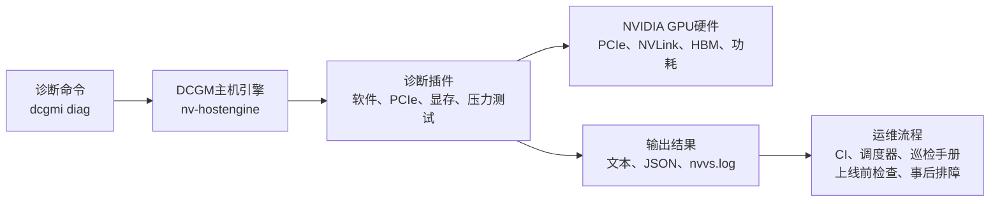

## 基本简介

`DCGM Diagnostics`是`NVIDIA Data Center GPU Manager`中的主动式`GPU`诊断与验证工具，官方文档注明它源自`NVIDIA Validation Suite`（即`NVVS`）。当前推荐入口是`dcgmi diag`，独立运行的`NVVS`已不再作为主推方式持续维护。

它不是单纯读取`GPU`温度、功耗和利用率的监控命令，而是通过`DCGM`、`NVML`、`CUDA`和一组诊断插件，对`GPU`、驱动、运行时、`PCIe`、`NVLink`、显存、计算单元以及功耗与温度的稳定性进行主动测试。测试结果可以输出为终端文本、`JSON`和日志，便于接入巡检脚本、集群调度器或故障处理流程。

需要先明确它的边界：`DCGM Diagnostics`不是持续采集型监控系统，也不是完整硬件维修诊断或`RMA`判定流程。官方文档明确说明，它不负责主动修复问题，也不能替代现场硬件诊断工具。更合理的定位是：在`GPU`节点投入生产前、作业失败后、硬件更换后或维护窗口中，主动验证节点是否具备稳定运行`AI`训练、推理和`HPC`任务的条件。

> `DCGM Diagnostics`的官方介绍地址：https://docs.nvidia.com/datacenter/dcgm/latest/user-guide/dcgm-diagnostics.html



## 主要解决的问题

在`AI`算力集群中，很多`GPU`问题并不会在空闲状态下暴露。例如驱动和`CUDA`库版本不匹配、`PCIe`链路降速、`NVLink`通信异常、显存错误、功耗上不去、温度过高降频、`NCCL`集合通信异常等，只有在作业开始后才会表现为训练速度下降、任务失败、`XID`错误或节点重启。

`DCGM Diagnostics`主要解决以下问题：

- **上线前验证**：在新节点、新`GPU`或驱动升级后，验证软件栈、设备访问、显存和互联链路是否满足基本运行条件。
- **作业失败后排障**：在训练任务或推理服务失败后，快速判断问题更偏向软件部署、硬件链路、显存、功耗、温度还是通信层。
- **性能和稳定性确认**：通过矩阵计算、显存带宽、功耗和压力测试，发现单纯读取指标不容易暴露的降频、性能不达标和稳定性问题。
- **集群自动化巡检**：通过`JSON`输出、退出码、日志和命令行参数，把诊断结果接入节点准入、维护巡检或调度器健康检查流程。

## 显著优点

| 优点 | 说明 |
|:---:|---|
| <span style={{whiteSpace: 'nowrap'}}><strong>官方工具链</strong></span> | 基于`NVIDIA`官方`DCGM`能力，能直接访问`NVML`、`CUDA`和`GPU`健康字段。 |
| <span style={{whiteSpace: 'nowrap'}}><strong>主动诊断</strong></span> | 不只是查看指标，而是运行计算、传输、显存和功耗测试，用结果验证硬件和软件栈。 |
| <span style={{whiteSpace: 'nowrap'}}><strong>测试层级清晰</strong></span> | `-r 1`到`-r 4`覆盖从快速检查到长时间深度测试的不同场景，高层级会包含低层级检查。 |
| <span style={{whiteSpace: 'nowrap'}}><strong>插件化能力</strong></span> | `software`、`pcie`、`memory`、`diagnostic`、`targeted_power`、`targeted_stress`、`memtest`、`pulse`等插件覆盖多个故障域。 |
| <span style={{whiteSpace: 'nowrap'}}><strong>可配置</strong></span> | 可通过`-p`覆盖单项参数，也可通过`YAML`配置文件按`GPU SKU`设置阈值和是否允许运行某个测试。 |
| <span style={{whiteSpace: 'nowrap'}}><strong>易于自动化</strong></span> | 支持`JSON`输出、重复执行、提前失败、超时、日志和错误码处理，适合纳入集群运维流程。 |

## 常见问题及检测方式

`DCGM Diagnostics`的核心价值在于主动制造受控负载，再结合硬件计数器和运行时返回值，依据阈值判断问题。下面按常见故障域整理它的检测方式。

| 常见问题 | 相关测试 | 检测方式 |
|:---:|---|---|
| <span style={{whiteSpace: 'nowrap'}}><strong>软件部署异常</strong></span> | `software` / `Deployment` | 检查`NVML`、`CUDA Runtime`、`CUDA Main Library`是否可加载，检查`nouveau`、设备节点、权限、`cgroups`、待退役页和行重映射状态。 |
| <span style={{whiteSpace: 'nowrap'}}><strong>`PCIe`链路问题</strong></span> | `pcie` | 执行主机到设备、设备到主机、`GPU`间`P2P`带宽和时延测试，并结合`PCIe`重放计数、最小代际、最小链路宽度和阈值判断链路质量。 |
| <span style={{whiteSpace: 'nowrap'}}><strong>`NVLink`互联异常</strong></span> | `pcie` / `nvbandwidth` | 在支持的拓扑上运行`GPU`间通信带宽测试，观察`P2P`路径、带宽、时延和链路相关错误。 |
| <span style={{whiteSpace: 'nowrap'}}><strong>显存读写错误</strong></span> | `memory` / `memtest` | 分配大比例显存，写入并回读固定数据模式；`memtest`进一步执行地址线、移动反转、随机数、位衰减等模式测试。 |
| <span style={{whiteSpace: 'nowrap'}}><strong>计算单元异常</strong></span> | `diagnostic` | 运行矩阵乘法和显存遍历类负载，检查计算正确性、温度、不可纠正显存错误、`XID`错误和性能是否达标。 |
| <span style={{whiteSpace: 'nowrap'}}><strong>温度或功耗不稳定</strong></span> | `targeted_power` / `targeted_stress` | 持续施加计算压力，使功耗或吞吐接近目标值，并监控温度、时钟、`PCIe`重放、单比特错误和`XID`。 |
| <span style={{whiteSpace: 'nowrap'}}><strong>显存带宽不足</strong></span> | `memory_bandwidth` | 使用类似`STREAM TRIAD`的带宽测试，比较实测带宽和配置阈值。 |
| <span style={{whiteSpace: 'nowrap'}}><strong>`NCCL`通信问题</strong></span> | `nccl_tests` | 调用`NCCL Tests`二进制，检查集合通信测试的退出码和输出结果。 |
| <span style={{whiteSpace: 'nowrap'}}><strong>电源瞬态问题</strong></span> | `pulse` | 通过短促高强度负载制造电流波动，验证系统电源是否能承受突发功耗变化。 |

## 测试层级

`dcgmi diag -r`既可以接收数字层级，也可以接收具体测试名称。数字层级适合标准化巡检，测试名称适合定向排障。

| 层级 | 定位 | 典型用途 |
|---|---|---|
| `-r 1` | 快速检查 | 节点上线前、作业启动前或故障后的初步筛查。 |
| `-r 2` | 中等耗时检查 | 作业失败后的更完整检查，适合每天或按需运行。 |
| `-r 3` | 长时间硬件诊断 | 新节点集成、硬件更换后、难复现故障的维护窗口排查。 |
| `-r 4` | 扩展深度诊断 | 包含更长时间、更高压力的测试，例如`memtest`和`pulse`，应安排在维护窗口。 |

实践中，可以把`-r 1`作为准入前置检查，把`-r 2`用于日常巡检或失败后自动排查，把`-r 3`和`-r 4`放在维护窗口中运行。原因是高层级测试会主动占用`GPU`资源，可能影响线上工作负载。

## 工具安装

> 参考官网文档：https://docs.nvidia.com/datacenter/dcgm/latest/user-guide/getting-started.html

`DCGM Diagnostics`随`DCGM`一起安装。安装前需要先确认主机已安装`NVIDIA Datacenter Driver`的受支持版本，并按官方文档配置对应发行版的软件源。官方安装说明要求选择与`CUDA`用户态主版本匹配的`datacenter-gpu-manager-4-cudaX`包，例如`cuda12`环境安装`datacenter-gpu-manager-4-cuda12`。如果节点上已经安装旧版`datacenter-gpu-manager`或`datacenter-gpu-manager-config`包，官方步骤会先删除旧包再安装新版`datacenter-gpu-manager-4-cudaX`包。

官方文档还列出了一些容易被忽略的前置条件：

- 主机建议至少有`16GB`内存，`CPU`核心数不少于节点上的`GPU`数量。
- `NVSwitch`系统需要额外安装并运行对应组件：`Hopper`及更早架构通常涉及`Fabric Manager`和`NSCQ`，`Blackwell`及更新架构涉及`NVSDM`。
- 官方安装示例默认安装推荐依赖；这些推荐依赖用于补齐开源`DCGM`本体之外的部分功能。
- `Maxwell`、`Pascal`和`Volta`架构`GPU`在使用`R580`驱动或`CUDA 13`用户态环境时，官方文档建议安装`CUDA 12`对应的`DCGM`包，而不是`CUDA 13`对应的包。

以`Ubuntu`或`Debian`为例：

```bash
CUDA_VERSION=$(nvidia-smi -q | sed -E -n 's/CUDA Version[ :]+([0-9]+)[.].*/\1/p')

sudo systemctl list-unit-files nvidia-dcgm.service > /dev/null && \
  sudo systemctl stop nvidia-dcgm

sudo dpkg --list datacenter-gpu-manager > /dev/null 2>&1 && \
  sudo apt purge --yes datacenter-gpu-manager
sudo dpkg --list datacenter-gpu-manager-config > /dev/null 2>&1 && \
  sudo apt purge --yes datacenter-gpu-manager-config

sudo apt-get update
sudo apt-get install --yes --install-recommends datacenter-gpu-manager-4-cuda${CUDA_VERSION}
sudo systemctl --now enable nvidia-dcgm
dcgmi discovery -l
```

常见发行版的安装命令如下，前提都是软件源已经按官方文档配置完成：

| 发行版 | 安装命令 |
|---|---|
| `Ubuntu` / `Debian` | `sudo apt-get install --yes --install-recommends datacenter-gpu-manager-4-cuda${CUDA_VERSION}` |
| `RHEL` / `CentOS` / `Rocky Linux` | `sudo dnf install --assumeyes --setopt=install_weak_deps=True datacenter-gpu-manager-4-cuda${CUDA_VERSION}` |
| `SLES` / `OpenSUSE` | `sudo zypper install --no-confirm --recommends datacenter-gpu-manager-4-cuda${CUDA_VERSION}` |
| `Amazon Linux 2023` | `sudo dnf install --assumeyes --setopt=install_weak_deps=True datacenter-gpu-manager-4-cuda${CUDA_VERSION}` |
| `Azure Linux 3.0` | `sudo tdnf install --assumeyes --setopt=install_weak_deps=True datacenter-gpu-manager-4-cuda${CUDA_VERSION}` |

安装后建议启动`nvidia-dcgm`服务，它会运行`nv-hostengine`，`dcgmi diag`通过该服务访问`DCGM`能力。`dcgmi discovery -l`可以用于确认`DCGM`是否识别到`GPU`或`Switch`实体。**官方文档建议以`root`权限运行诊断，尤其是涉及压力、功耗、显存和设备访问的测试。**

如果需要使用`DCGM`的多节点诊断能力，官方文档还提供了可选包`datacenter-gpu-manager-4-multinode-cuda${CUDA_VERSION}`。该插件仅支持`CUDA 12`或更高版本，并且要求所有参与多节点诊断的主机安装相同版本的插件包；单节点`dcgmi diag`日常诊断不需要安装这个可选包。

## 使用示例

### 快速检查当前节点

```bash
sudo dcgmi diag -r 1
```

适合在节点上线、驱动升级或作业失败后先跑一遍。如果失败，优先查看失败插件名称、错误码和`/var/log/nvidia-dcgm/nvvs.log`。

### 输出`JSON`便于脚本解析

```bash
sudo dcgmi diag -r 2 -j
```

`-j`会把结果输出成`JSON`，适合被调度器、巡检系统或`CI`脚本解析。脚本中建议同时记录命令退出码和日志路径。

### 只运行指定测试

```bash
sudo dcgmi diag -r pcie,memory
```

当问题已经聚焦到某个故障域时，直接指定测试名称比跑完整层级更节省时间。多个测试名称可以用逗号分隔。

### 调整单个测试参数

```bash
sudo dcgmi diag -r targeted_power -p "targeted_power.target_power=300.0"
```

`-p`用于临时覆盖插件参数，格式通常是`测试名.参数名=值`。示例中的`300.0`只是演示值，生产环境应按具体`GPU`型号、散热条件和机房功耗策略设置。

### 重复运行并尽早失败

```bash
sudo dcgmi diag -r 3 --iterations 3 --fail-early --check-interval 5
```

`--iterations`适合排查间歇性问题。`--fail-early`会在长时间测试过程中周期性检查故障条件，`--check-interval`用于设置检查间隔。

### 使用自定义配置文件

```bash
sudo dcgmi diag -r 2 -c ./dcgm-diag.yaml
```

当同一集群中存在不同`GPU SKU`、不同散热条件或不同功耗策略时，建议使用配置文件统一管理阈值，而不是在命令行中堆叠大量`-p`参数。

### 多节点诊断

`DCGM`还有一个单独的多节点诊断功能，命令入口是`dcgmi mndiag`，不是`dcgmi diag`。它的目标是在`head node`上协调多个节点同步执行压力测试，验证跨节点互联、显存和计算能力。根据官方文档，当前多节点诊断支持的测试只有`mnubergemm`，支持版本为`DCGM 4.3.0`及以后，当前支持产品为`GB200 NVL`和`GB300 NVL`。

多节点诊断的前置条件更严格，至少要满足以下要求：

- 所有参与节点都安装并配置`OpenMPI`。
- `head node`到所有参与节点都要有无密码`SSH`访问，而且`head node`上的私钥需要以未加密形式存放在磁盘上。
- 所有参与节点必须使用相同的`NVIDIA Driver`版本。
- 如果是多节点`NVLink`系统，还要先正确配置`IMEX Channels`，否则`mnubergemm`可能因为`NCCL`初始化失败而报错。

官方把多节点诊断的常用参数整理得很清楚：

| 参数 | 作用 |
|---|---|
| `--hostList` | 必填，列出要参与诊断的主机，格式可以是`host_name:port`或`host_name:socket_address`。 |
| `--hostEngineAddress` | 指定`head node`的`hostengine`地址，默认是`localhost`。 |
| `-r` / `--run` | 指定要运行的测试名，当前只有`mnubergemm`，也是默认值。 |
| `-p` / `--parameters` | 传入测试参数，例如`mnubergemm.time_to_run=600`。多个参数用分号分隔。 |
| `-j` / `--json` | 以`JSON`格式输出结果。 |

几个简要示例：

```bash
dcgmi mndiag --hostList "node1;node2;node3"
```

```bash
dcgmi mndiag --hostEngineAddress 192.168.1.100 --hostList "node1:5000;node2;node3:unix:///tmp/dcgm.sock"
```

```bash
dcgmi mndiag --hostList "node1;node2" -p "mnubergemm.time_to_run=600" -j
```

这类多节点诊断适合用在大规模`GPU`集群联调、跨节点互联验证、整体压力测试和上线前验收，不适合和线上业务混跑。

## 配置方式

### 常用命令行参数

| 参数 | 作用 |
|---|---|
| `-r` | 指定测试层级或测试名称，例如`1`、`3`、`pcie,memory`。 |
| `-g` | 指定`DCGM`中的`GPU`组。 |
| `-i` | 指定实体，例如具体`GPU`编号。 |
| `-c` | 指定`YAML`配置文件。 |
| `-p` | 覆盖某个插件参数。 |
| `-j` | 输出`JSON`结果。 |
| `--host` | 连接远端`nv-hostengine`。 |
| `--iterations` | 重复执行诊断。 |
| `--timeout` | 设置超时时间。 |
| `--ignoreErrorCodes` | 忽略已知或预期的错误码，适合受控测试环境。 |

### 配置文件示例

官方配置格式使用`spec: dcgm-diag-v1`，可以按`GPU SKU`定义各插件的阈值和开关。下面是结构示例，阈值不能直接照搬到生产环境，必须结合具体`GPU`型号、驱动版本、机箱散热和历史基线确认。

```yaml
version: "@CMAKE_PROJECT_VERSION@"
spec: dcgm-diag-v1
skus:
  - name: H100 80GB PCIe
    id: 2331
    memory:
      is_allowed: true
      l1_is_allowed: true
    diagnostic:
      is_allowed: true
      test_duration: 60.0
      temperature_max: 90.0
    pcie:
      is_allowed: true
      h2d_d2h_single_pinned:
        min_pci_generation: 3.0
        min_pci_width: 16.0
```

配置文件中常见的思路是：

- 使用`is_allowed`控制某个插件是否允许在指定`SKU`上运行。
- 使用`temperature_max`、`max_pcie_replays`、`min_pci_generation`、`min_pci_width`等参数表达机房和硬件基线。
- 对`targeted_power`、`targeted_stress`等压力测试单独设定目标功耗、目标性能和持续时间。
- 对`NCCL`相关测试，提前确认`NCCL Tests`二进制路径和集群通信环境。

### 环境变量与日志

| 配置项 | 作用 |
|---|---|
| `NVVS_BIN_PATH` | 指定`nvvs`二进制所在目录。 |
| `NVVS_PLUGIN_DIR` | 指定诊断插件目录。 |
| `NVVS_HANGDETECT_DISABLE` | 禁用挂起检测。 |
| `NVVS_HANGDETECT_EXPIRY_SEC` | 设置挂起检测超时时间。 |
| `DCGM_NCCL_TESTS_BIN_PATH` | 指定`NCCL Tests`二进制路径。 |
| `/var/log/nvidia-dcgm/nvvs.log` | 默认诊断日志路径。 |

## 相似工具比较

| 工具 | 定位 | 适合场景 | 短板 |
|---|---|---|---|
| `nvidia-smi` | `GPU`状态查询和管理命令 | 快速查看驱动、显存、温度、功耗、进程、`ECC`等信息。 | 主要是点查和管理，不会主动运行完整压力和正确性测试。 |
| `dcgm-exporter` | `Prometheus`指标导出器 | 持续监控`GPU`利用率、温度、功耗、显存、错误计数和性能指标。 | 更偏被动采集，不能单独证明节点在压力下稳定可用。 |
| `DCGM Diagnostics` | 主动诊断和节点验证 | 上线前准入、作业失败后排查、维护窗口深度测试。 | 非连续监控，会占用`GPU`资源，**高层级测试不适合和生产负载并行**。 |

### 监控场景下的优点

`DCGM Diagnostics`在监控体系中的价值不是替代`dcgm-exporter`，而是补齐“指标异常之后怎么验证”和“上线前怎么证明节点可用”这两个环节。常规监控可以告诉我们温度高、功耗低、`XID`出现或利用率异常，但不一定能证明根因；诊断工具可以进一步施加受控负载，把软件、链路、显存、计算、功耗和通信问题分域暴露出来。

它特别适合做三类自动化：

- **准入检查**：节点加入`Kubernetes`、`Slurm`或其他调度系统前，先运行`-r 1`或指定测试。
- **告警后动作**：当`dcgm-exporter`发现`XID`、`ECC`、温度或链路异常后，自动触发定向诊断。
- **维护巡检**：在维护窗口运行`-r 3`或`-r 4`，验证更深层的稳定性问题。

### 监控场景下的缺点

它不适合承担持续监控职责，原因包括：

- 诊断测试是主动负载，会占用`GPU`、显存、`PCIe`和功耗预算。
- 长时间压力测试可能干扰线上训练或推理任务。
- 阈值需要结合实际硬件基线调优，不能把官方示例阈值无差别套到所有机型。
- 某些插件和参数与`GPU`架构、`SKU`、驱动和部署方式相关，需要以当前版本官方文档和本机`dcgmi diag --help`为准。
- 官方明确说明它不是完整硬件诊断、自动修复或`RMA`替代流程。

因此，推荐的组合是：`dcgm-exporter`负责持续采集和告警；`nvidia-smi`负责临时人工点查；`DCGM Diagnostics`负责上线前验证、告警后定向排查和维护窗口深度诊断。

## 常见问题

### `DCGM Diagnostics`是免费工具还是收费工具？

`DCGM Diagnostics`本身不需要单独购买工具许可证，也不需要额外的商业授权密钥。它随`DCGM`一起分发，`NVIDIA`官方页面将`DCGM`描述为可独立使用、也可集成到集群管理、资源调度和监控产品中的工具套件；`NVIDIA/DCGM`源码仓库也标明项目源码采用`Apache-2.0`许可。

需要注意的是，这并不意味着”所有相关能力都不受任何商业条款约束”。实际生产使用仍受`NVIDIA Driver`、`GPU`硬件支持范围和`NVIDIA`软件许可条款约束；企业级支持、`DGX`服务、云厂商托管服务、硬件维保和商业技术支持属于另外的商业服务范畴。

### 已有任务占用`GPU`时，还能同时运行诊断吗？

不建议在同一张正在承载生产任务的`GPU`上运行完整`DCGM Diagnostics`。原因是`DCGM Diagnostics`并不是纯读取指标的轻量探针，它包含会主动占用`GPU`、显存、`PCIe`、`NVLink`和功耗预算的测试，例如`targeted_power`、`targeted_stress`、`memtest`、`pulse`和`nvbandwidth`。这些测试可能干扰正在运行的训练或推理任务，也可能因为已有业务负载导致诊断结果失真。

官方文档中也能看到相关约束：`DCGM Diagnostics`被定位为工作负载部署前的就绪度评估工具；`nvbandwidth`测试还明确包含运行前检查，如果当前`MCUTIL`超过`10%`，测试会失败。因此，生产环境中更稳妥的做法是把完整诊断放到节点准入、维护窗口、作业失败后隔离排查等场景中执行。

如果同一台主机上只有部分`GPU`被占用，可以使用`-i`指定空闲`GPU`，或者使用`-g`指定`DCGM`中的`GPU`组，只对空闲卡运行诊断。例如：

```bash
sudo dcgmi diag -r 1 -i 2
```

如果目标是在线观察运行中任务的健康状态，应优先使用`dcgm-exporter`、`Prometheus`、`nvidia-smi`等被动监控方式，而不是把完整`dcgmi diag`当作在线健康探针。


## 参考资料

- [NVIDIA DCGM Diagnostics 官方文档](https://docs.nvidia.com/datacenter/dcgm/latest/user-guide/dcgm-diagnostics.html)
- [NVIDIA DCGM Multi-Node Diagnostics 官方文档](https://docs.nvidia.com/datacenter/dcgm/latest/user-guide/dcgm-multinode-diagnostics.html)
- [NVIDIA DCGM Getting Started](https://docs.nvidia.com/datacenter/dcgm/latest/user-guide/getting-started.html)
- [NVIDIA DCGM 产品页面](https://developer.nvidia.com/dcgm)
- [NVIDIA/DCGM GitHub 仓库许可说明](https://github.com/NVIDIA/DCGM)
- [NVIDIA DCGM Exporter 官方文档](https://docs.nvidia.com/datacenter/dcgm/latest/gpu-telemetry/dcgm-exporter.html)
- [NVIDIA System Management Interface 官方文档](https://docs.nvidia.com/deploy/nvidia-smi/index.html)
