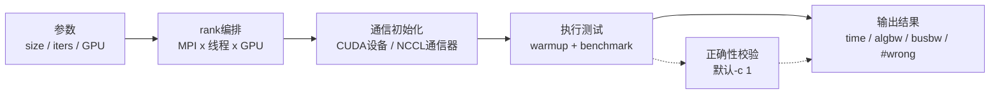

## 基本简介

`NVIDIA NCCL Tests`是`NVIDIA`维护的`NCCL`通信测试工具集，用于检验`NCCL`操作的性能和正确性。

要理解`NCCL Tests`，需要先理解`NCCL`本身。`NCCL`是一个专注于`GPU`间通信的库，提供拓扑感知的集合通信和点对点通信原语，官方文档列出的集合通信包括`AllReduce`、`Broadcast`、`Reduce`、`AllGather`、`ReduceScatter`、`AlltoAll`、`Gather`和`Scatter`。`NCCL`支持单机多`GPU`和跨节点通信，底层可能使用`PCIe`、`NVLink`、`InfiniBand Verbs`或`IP sockets`等互联方式。

在大模型训练、分布式推理和`HPC`负载中，`NCCL`经常承担梯度同步、参数聚合、激活或专家数据交换等通信路径。应用层看到的表现通常只是”训练变慢””启动卡住””某个节点掉队”或”偶发`NCCL`错误”，但根因可能涉及`GPU`拓扑、网卡选择、`IB/RoCE`链路、容器权限、`CUDA/NCCL`版本、进程与`GPU`的绑定关系、集合通信算法选择乃至硬件健康状态等多个层面。`NCCL Tests`的价值就在于剥离真实业务逻辑，只保留可重复的`NCCL`通信操作，让运维和研发能够获得独立于框架的通信性能与正确性证据。

> `NVIDIA NCCL Tests`的官方仓库地址：https://github.com/NVIDIA/nccl-tests

### 解决的问题

`NCCL Tests`主要解决以下问题：

| 问题 | 说明 |
|:---:|---|
| <span style={{whiteSpace: 'nowrap'}}><strong>建立通信基线</strong></span> | 使用统一参数扫描消息大小，得到不同节点、不同`GPU`数量、不同通信操作下的`time`、`algbw`和`busbw`基线。 |
| <span style={{whiteSpace: 'nowrap'}}><strong>验证`NCCL`正确性</strong></span> | 默认执行结果校验，输出`#wrong`，可以发现通信结果与期望值不一致的问题。 |
| <span style={{whiteSpace: 'nowrap'}}><strong>排查通信性能退化</strong></span> | 通过单机、跨机、指定算法、指定网卡、禁用某类传输等方式做对照实验，缩小问题范围。 |
| <span style={{whiteSpace: 'nowrap'}}><strong>验证集群上线质量</strong></span> | 在新节点、扩容节点、驱动升级、`NCCL`升级、交换机变更后快速确认通信路径是否符合预期。 |
| <span style={{whiteSpace: 'nowrap'}}><strong>提供框架无关证据</strong></span> | 不依赖`PyTorch`、`TensorFlow`或业务代码，方便把问题定位在通信栈、系统配置或上层框架之间。 |

### 显著优点

| 优点 | 说明 |
|:---:|---|
| <span style={{whiteSpace: 'nowrap'}}><strong>官方实现</strong></span> | 由`NVIDIA`维护，测试调用真实`NCCL API`，结果更接近`NCCL`通信栈本身的行为。 |
| <span style={{whiteSpace: 'nowrap'}}><strong>操作覆盖广</strong></span> | 当前本地源码生成`all_reduce_perf`、`all_gather_perf`、`broadcast_perf`、`reduce_scatter_perf`、`reduce_perf`、`alltoall_perf`、`alltoallv_perf`、`scatter_perf`、`gather_perf`、`sendrecv_perf`和`hypercube_perf`。 |
| <span style={{whiteSpace: 'nowrap'}}><strong>同时看性能和正确性</strong></span> | 同一轮测试既输出通信耗时与带宽，也可以执行数据校验，避免只看性能而忽略错误结果。 |
| <span style={{whiteSpace: 'nowrap'}}><strong>单机和多机一致</strong></span> | 单机通过`-g`指定每线程`GPU`数，多机通过`MPI`管理进程数；总`rank`数为`MPI`进程数、线程数和每线程`GPU`数的乘积。 |
| <span style={{whiteSpace: 'nowrap'}}><strong>指标可解释</strong></span> | 输出`algbw`和`busbw`，其中`busbw`用于把集合通信结果映射为更接近硬件瓶颈链路的带宽指标。 |
| <span style={{whiteSpace: 'nowrap'}}><strong>适合自动化</strong></span> | 支持固定消息范围、循环运行、`JSON`输出、每迭代统计、超时、最小带宽阈值和分组并行测试。 |

## 工作原理

`NCCL Tests`不是一个后台监控组件，也不是硬件诊断工具。其工作方式是启动一组`rank`，为每个`rank`绑定一个`CUDA`设备，初始化`NCCL communicator`，在不同消息大小上执行指定通信操作，并用`CUDA event`和同步逻辑计算耗时。启用数据校验时，它还会准备确定性输入和期望输出，再比较实际通信结果。



### `rank`模型

`NCCL Tests`可以在多个`MPI`进程、多个线程和每线程多个`GPU`上运行。`README`明确说明，进程数由`MPI`管理，不作为测试二进制的命令行参数传入。总`rank`数计算如下：

```text
total_ranks = number_of_processes * number_of_threads * number_of_GPUs_per_thread
```

常见推荐用法是多节点运行时采用“每个`MPI`进程绑定一个`GPU`”，也就是`mpirun -np TOTAL_GPUS ... -g 1`。这种方式更接近`PyTorch DDP`、`Megatron-LM`等训练框架的常见部署模型，也更容易处理`CPU/GPU/NUMA/NIC`亲和性。

### 测试二进制

当前本地源码的`src/Makefile`中，`BIN_FILES_LIST`定义了以下测试二进制：

| 二进制 | 测试操作 | 常见用途 |
|---|---|---|
| `all_reduce_perf` | `AllReduce` | 梯度同步、训练扩展性基线，最常用。 |
| `all_gather_perf` | `AllGather` | 参数、序列、张量并行中的全量聚合路径。 |
| `reduce_scatter_perf` | `ReduceScatter` | `ZeRO`、张量并行、分片梯度同步路径。 |
| `broadcast_perf` | `Broadcast` | 参数广播、初始化同步。 |
| `reduce_perf` | `Reduce` | 多`rank`到根`rank`聚合。 |
| `alltoall_perf` | `AlltoAll` | 专家并行、`MoE`、重分布通信。 |
| `alltoallv_perf` | `AlltoAllv` | 不均衡`all-to-all`通信，适合模拟不规则专家路由。 |
| `scatter_perf` | `Scatter` | 根`rank`向其他`rank`分发不同片段。 |
| `gather_perf` | `Gather` | 多`rank`向根`rank`汇聚不同片段。 |
| `sendrecv_perf` | `SendRecv` | 邻居交换、点对点链路排查。 |
| `hypercube_perf` | `Hypercube` | 使用`send/recv`构造的超立方交换模式。 |

### 输出指标

默认输出会分别展示`out-of-place`和`in-place`两组结果。需要注意的是，部分测试如`alltoall`、`alltoallv`和`sendrecv`在源码中对`in-place`结果不报告正确性错误，输出会显示`N/A`，这不是没有执行测试，而是该路径没有按相同方式报告`#wrong`。

| 指标 | 单位 | 含义 |
|---|---|---|
| `size` | `B` | 本行测试的消息大小，小消息主要看延迟，大消息主要看带宽。 |
| `count` | 元素数 | 按数据类型换算后的元素数量，需要结合`type`共同决定真实字节数。 |
| `type` | <span style={{whiteSpace: 'nowrap'}}>字符串</span> | `float`、`half`、`bfloat16`等数据类型，支持范围取决于编译和运行时`NCCL/CUDA`版本。 |
| `redop` | 字符串 | `sum`、`prod`、`max`、`min`、`avg`、`mulsum`等规约操作，只对规约类通信有实际意义。 |
| `root` | `rank` | 根`rank`，对`broadcast`、`reduce`、`gather`、`scatter`等操作有意义。 |
| `time` | `us` | 平均每次操作耗时，默认来自`CUDA event`计时，使用`-C 1`时改为`CPU`时间。 |
| `algbw` | `GB/s` | 算法带宽，常见公式为数据规模除以耗时，适合估算同类操作耗时。 |
| `busbw` | `GB/s` | 链路等效带宽，经集合通信模式修正后更贴近硬件瓶颈链路的实际利用率，适合与`NVLink`、`PCIe`或网络瓶颈能力对比。 |
| `#wrong` | 个数 | 正确性校验发现的错误元素数，非`0`表示通信结果不符合期望。 |

`NCCL Tests`的性能文档强调，小消息的`time`主要反映固定开销或延迟；大消息的耗时则更接近”固定开销 + 数据规模 / 带宽”的模型，因此大消息更适合评估带宽。`algbw`是按操作数据规模和耗时计算的算法带宽，而`busbw`会根据集合通信模式乘以修正系数，使结果更贴近硬件通信瓶颈。

常见操作的`busbw`修正系数如下：

| 操作 | `busbw`修正方式 |
|---|---|
| `AllReduce` | `algbw * 2 * (n - 1) / n` |
| `ReduceScatter` | `algbw * (n - 1) / n` |
| `AllGather` | `algbw * (n - 1) / n` |
| `AlltoAll` | `algbw * (n - 1) / n` |
| `Broadcast` | `algbw` |
| `Reduce` | `algbw` |

其中`n`是参与本次`NCCL communicator`的`rank`数量。对`AllReduce`而言，`busbw`通常比`algbw`高，因为每个元素需要规约并分发，通信量修正系数是`2 * (n - 1) / n`。对`Broadcast`和`Reduce`而言，根`rank`通常是瓶颈，因此`busbw`等于`algbw`。

## 能够检测的常见问题

严格来说，`NCCL Tests`直接检测的是“通信操作是否成功、结果是否正确、耗时和带宽是否符合基线”。它不会像`DCGM Diagnostics`那样直接读取硬件健康字段，也不会自动告诉你根因是交换机、网卡、`PCIe`、驱动还是容器权限。但它非常适合作为通信栈的主动探针，通过可重复的对照测试把问题范围缩小。

### 问题概览

| 问题类型 | 典型表现 | `NCCL Tests`检测方式 | 后续定位手段 |
|---|---|---|---|
| 数据正确性问题 | `#wrong`非`0`，尾部`Out of bounds values`为`FAILED`。 | 默认`-c 1`生成期望结果并比较实际结果。 | 查看`NCCL`日志、驱动日志、`XID`、硬件健康状态。 |
| 通信性能退化 | `busbw`明显低于历史基线或同型号节点。 | 固定参数重复扫描消息大小，或用`NCCL_TESTS_MIN_BW`设置自动失败阈值。 | 检查`NVLink/PCIe/IB/RoCE`、亲和性、`NCCL_ALGO`、`NCCL_PROTO`。 |
| 多节点网络问题 | 单机正常，多机慢、报错或卡住。 | 对比单机`-g 8`与多机`mpirun -np ... -g 1`结果。 | 用`NCCL_DEBUG=INFO`、`NCCL_DEBUG_SUBSYS=NET`、`ibstat`、`ib_write_bw`等排查。 |
| 拓扑或链路异常 | 某些节点`busbw`明显偏低，跨`GPU`组差异大。 | 使用`NCCL_TESTS_SPLIT`拆分组，分别测节点内和节点间通信。 | 查看`nvidia-smi topo -m`、`NCCL_TOPO_DUMP_FILE`、`DCGM`拓扑检查。 |
| 初始化或异步错误 | `ncclCommInitRank`失败，首个集合通信失败，运行中异步错误。 | 源码中封装`NCCLCHECK`，运行期间查询`ncclCommGetAsyncError`，必要时`ncclCommAbort`。 | 开启`NCCL_DEBUG=WARN/INFO`，检查`MPI`启动和网络可达性。 |
| 超时或挂起 | 测试长时间无输出。 | 使用`-T SECONDS`为测试同步阶段设置超时，超时后中止通信器。 | 结合`NCCL RAS`、`NCCL_DEBUG_FILE`和节点日志分析。 |
| 迭代抖动和掉队 | 平均带宽尚可，但训练不稳定或尾延迟高。 | 使用`-I 1`输出`i_min`、`i_max`、`i_p99`和`i_cv%`，再用`tools/analyze_perf_json.py`分析。 | 检查进程绑核、`NUMA`、网卡亲和性、后台任务和功耗限制。 |
| <span style={{whiteSpace: 'nowrap'}}>`GPU`数量或绑定错误</span> | 请求`GPU`数量超过实际设备，或`rank`落到错误设备。 | 启动时打印每个`rank`的主机名、`PID`、`CUDA`设备号和`PCI BDF`。 | 修正`mpirun`、调度器、`CUDA_VISIBLE_DEVICES`、`NCCL_TESTS_DEVICE`。 |
| 显存不足 | 大消息测试失败或被自动降低`maxBytes`。 | 源码会根据可用显存保留空间，并在必要时降低`maxBytes`；`-M 1`可输出显存使用。 | 降低`-e`、关闭校验`-c 0`、排空业务进程。 |
| 不规则通信失衡 | `MoE`类负载中某些`rank`通信量过大。 | `alltoallv_perf`支持距离加权模式和矩阵文件模式。 | 使用`-a 3`看最慢`rank`时间，开启`NCCL_TESTS_ALLTOALLV_PRINT_SUMMARY`。 |

### 正确性校验

默认参数`-c 1`会进行一次正确性校验。源码中`BenchTime`方法先执行性能测试，再按`datacheck`参数指定的次数循环执行数据初始化、单次通信和结果比较。输入数据和期望结果由`verifiable`目录中的校验逻辑生成，结果比较会统计错误元素数。

校验相关输出包括：

| 输出 | 含义 |
|---|---|
| `#wrong` | 当前消息大小、当前操作的错误元素数。 |
| `Out of bounds values : 0 OK` | 汇总校验没有发现错误。 |
| `Out of bounds values : 非0 FAILED` | 至少有校验失败。 |
| 进程退出码非`0` | 源码在错误数非`0`或最小带宽阈值失败时返回非成功状态。 |

正确性校验很有价值，但要注意两个限制。第一，它会额外分配`expected`缓冲区，显存压力比纯性能测试更大。第二，大规模、多`GPU`、多数据类型全量扫描时会明显变慢。做性能压测可以临时使用`-c 0`关闭校验，但上线验收或疑似数据错误时不建议关闭。

### 性能退化和基线失败

性能退化通常不是看单次绝对值，而是看同一批硬件、同一软件版本、同一参数下的相对变化。建议基线至少固定以下维度：

| 维度 | 建议固定内容 |
|---|---|
| 硬件 | `GPU`型号、`GPU`数量、`NVLink/PCIe`拓扑、`NIC`型号、交换机和链路速率。 |
| 软件 | 驱动版本、`CUDA`版本、`NCCL`头文件和运行库版本、`MPI`版本。 |
| 启动方式 | 每节点进程数、每进程`GPU`数、进程绑核、`CUDA_VISIBLE_DEVICES`。 |
| 测试参数 | 二进制、`-b`、`-e`、`-f`或`-i`、`-n`、`-w`、`-c`、`-a`。 |
| 环境变量 | 所有显式设置的`NCCL_*`和`NCCL_TESTS_*`变量。 |

源码支持`NCCL_TESTS_MIN_BW`作为最小平均`busbw`阈值。尾部输出`Avg bus bandwidth`时，如果平均`busbw`低于该阈值的`90%`，会在输出中标记`FAILED`并以非零退出码退出。这个设计适合自动化巡检，但阈值必须来自同环境历史基线，不能直接照搬其他集群的数值。

### 网络、拓扑和亲和性问题

`NCCL Tests`本身不会直接输出“错误网卡”或“拓扑错误”，但它能让这些问题以性能或失败形态暴露出来。常见方法是构造对照组：

| 对照方式 | 目标 |
|---|---|
| <span style={{whiteSpace: 'nowrap'}}>单节点`-g 8`对比多节点`mpirun -np ... -g 1`</span> | 区分节点内和节点间问题。 |
| 设置`NCCL_TESTS_SPLIT="MOD 8"` | 在每节点`8 GPU`场景下拆成`8`组，每组跨节点通信，突出节点间网络瓶颈。 |
| 设置`NCCL_TESTS_SPLIT="DIV 8"` | 每节点形成一组，主要观察节点内通信。 |
| 指定`NCCL_SOCKET_IFNAME` | 验证`NCCL`是否选择了预期`IP`网卡。 |
| 设置`NCCL_IB_DISABLE=1` | 临时禁用`IB/RoCE`，迫使回退`IP sockets`，用于判断`IB/RoCE`路径是否异常。 |
| 设置`NCCL_TOPO_DUMP_FILE` | 保存`NCCL`检测到的拓扑`XML`，用于与硬件拓扑做比对。 |

`NCCL`官方文档提醒，环境变量分为系统配置和调试类参数。调试类参数不应长期保留在生产脚本中，因为它们可能导致性能次优、崩溃或挂起。因此，诸如`NCCL_IB_DISABLE`、`NCCL_ALGO`、`NCCL_PROTO`这类变量更适合用于短期对照实验，定位完成后应恢复默认或只保留确有依据的系统配置。

### 抖动和尾延迟

平均带宽无法解释所有训练问题。某些场景中，平均`busbw`接近基线，但训练仍然周期性变慢，常见原因是某些进程、节点或链路出现尾延迟。当前源码支持`-I 1`收集每迭代`CUDA event`计时，输出`i_min`、`i_max`、`i_p99`和`i_cv%`；配合`-J result.json`还会写入原始迭代数据。仓库中的`tools/analyze_perf_json.py`可以读取这些数据，输出尖峰、掉队进程和节点聚合分析。

`-I 1`和`-G`的`CUDA Graph`模式不兼容，源码会自动禁用每迭代计时。`-K COUNT`可以在汇总统计时跳过前几个迭代，适合剔除刚启动时的预热波动；但原始`JSON`数据仍然完整保留。

### `AlltoAllv`不均衡通信

`alltoallv_perf`用于不规则`all-to-all`模式，适合模拟`MoE`专家路由、动态负载分发等场景。当前源码支持两种模式：

| 模式 | 配置 | 说明 |
|---|---|---|
| 距离加权生成模式 | 默认模式，`NCCL_TESTS_ALLTOALLV_SPREAD`控制不均衡程度。 | `0.0`表示均匀分布，`1.0`表示完全距离加权。 |
| 矩阵文件模式 | 设置`NCCL_TESTS_ALLTOALLV_MATRIX_FILE`。 | 文件为方阵，单元格表示从源`rank`到目标`rank`的字节数。 |

矩阵文件模式有两个重要约束。第一，`-b`和`-e`必须相等，因为消息大小来自矩阵而不是扫描参数。第二，`-e`至少要覆盖所有`rank`中最大的发送或接收总字节数，否则测试缓冲区不足。对于不均衡负载，源码注释建议使用`-a 3`报告跨`rank`最大耗时，避免默认平均值被空闲或轻载`rank`稀释。

## 安装和构建

### 前置依赖

| 依赖 | 是否必需 | 说明 |
|---|---|---|
| `CUDA Toolkit` | 必需 | 需要`nvcc`、`CUDA`头文件和运行库。默认路径为`/usr/local/cuda`。 |
| `NCCL` | 必需 | 需要`NCCL`头文件和库。默认从系统路径查找，也可设置`NCCL_HOME`。 |
| `C++`编译器 | 必需 | 当前`common.mk`中，`CUDA 13`及以上默认使用`C++17`，较低版本默认使用`C++14`。 |
| `MPI` | 多机必需 | 多进程、多节点测试需要编译时设置`MPI=1`和`MPI_HOME`。 |
| `Linux`工具链 | 常见必需 | `make`、`gcc/g++`、`ldconfig`等基础工具。 |

如果只测试单进程单节点，可以不启用`MPI`。如果需要多节点或每`GPU`一个`MPI`进程，应编译`MPI`版本。

### 基础构建

```bash
cd /Users/john/Workspace/github/NVIDIA/nccl-tests
make -j CUDA_HOME=/usr/local/cuda NCCL_HOME=/usr
```

如果`CUDA`或`NCCL`安装在非默认路径，需要显式指定：

```bash
make -j CUDA_HOME=/path/to/cuda NCCL_HOME=/path/to/nccl
```

构建完成后，二进制默认位于`build/`目录，例如：

```bash
ls build/*_perf
```

### 编译`MPI`版本

```bash
cd /Users/john/Workspace/github/NVIDIA/nccl-tests
make -j MPI=1 MPI_HOME=/path/to/mpi CUDA_HOME=/path/to/cuda NCCL_HOME=/path/to/nccl
```

为了同时保留非`MPI`和`MPI`版本，可以使用`NAME_SUFFIX`：

```bash
make -j MPI=1 NAME_SUFFIX=_mpi MPI_HOME=/path/to/mpi CUDA_HOME=/path/to/cuda NCCL_HOME=/path/to/nccl
```

这样会生成类似`build/all_reduce_perf_mpi`的二进制。

### 减少编译目标架构

当前源码会根据`CUDA`版本设置一组默认`NVCC_GENCODE`。如果只面向固定型号`GPU`，可以显式设置`NVCC_GENCODE`减少编译时间和二进制体积。例如只为`Ampere`的`sm_80`构建：

```bash
make -j \
  CUDA_HOME=/usr/local/cuda \
  NCCL_HOME=/usr \
  NVCC_GENCODE="-gencode=arch=compute_80,code=sm_80"
```

### 运行前检查

建议在运行前确认以下信息：

```bash
nvidia-smi
nvcc --version
ldconfig -p | grep nccl
mpirun --version
```

多节点运行还需要确认：

| 检查项 | 目的 |
|---|---|
| `SSH`或调度器启动方式 | 确认`MPI`可以在所有节点拉起进程。 |
| `NCCL`库路径 | 确保所有节点加载同一版本`libnccl.so`。 |
| `CUDA_VISIBLE_DEVICES` | 确认进程看到的`GPU`序号符合预期。 |
| 网卡和防火墙 | 确认节点间`IP/IB/RoCE`可达。 |
| 容器权限 | 确认容器具备访问`GPU`、共享内存和网络设备的权限。 |

## 使用和配置

### 常用参数

| 参数 | 默认值 | 说明 |
|---|---|---|
| `-t,--nthreads` | `1` | 每进程线程数。 |
| `-g,--ngpus` | `1` | 每线程使用的`GPU`数。 |
| `-b,--minbytes` | `32M` | 起始消息大小。`K/M/G`按二进制单位解析（即`1K = 1024`，`1M = 1048576`）。 |
| `-e,--maxbytes` | `32M` | 最大消息大小。 |
| `-i,--stepbytes` | `1M` | 固定步长。 |
| `-f,--stepfactor` | 禁用 | 倍增步长，例如`-f 2`。 |
| `-n,--iters` | `20` | 每个消息大小的计时迭代次数。 |
| `-w,--warmup_iters` | `1` | 不计时预热迭代次数。 |
| `-m,--agg_iters` | `1` | 每次外层迭代中聚合执行的操作次数。 |
| `-N,--run_cycles` | `1` | 完整扫描循环次数，`0`表示无限循环。 |

### 操作参数

| 参数 | 默认值 | 说明 |
|---|---|---|
| `-o,--op` | `sum` | 规约操作，支持范围随`NCCL`版本变化，常见值为`sum/prod/min/max/avg/mulsum/all`。 |
| `-d,--datatype` | `float` | 数据类型，常见值包括`int8`、`uint8`、`int32`、`uint32`、`int64`、`uint64`、`half`、`float`、`double`、`bfloat16`和`fp8`类型。 |
| `-r,--root` | `0` | 根`rank`，对`broadcast`、`reduce`、`gather`和`scatter`有意义。 |
| `-c,--check` | `1` | 正确性校验次数，`0`表示关闭校验。 |
| `-p,--parallel_init` | `0` | 是否由多线程并发初始化`NCCL communicator`。 |
| `-z,--blocking` | `0` | 集合通信阻塞模式，支持`0/1/2/3`。 |
| `-u,--unalign` | `0` | 让发送和接收缓冲区按元素偏移，用于测试非对齐场景。 |

### 输出和诊断参数

| 参数 | 默认值 | 说明 |
|---|---|---|
| `-J,--output_file` | 空 | 写入`JSON`文件，当前源码按后缀识别，仅支持`json`。 |
| `-I,--per_iter_timing` | `0` | 输出每迭代统计列。 |
| `-K,--per_iter_skip` | `0` | 汇总每迭代统计时跳过前若干迭代。 |
| `-S,--report_timestamps` | `0` | 在性能行追加时间戳。 |
| `-T,--timeout` | 禁用 | 为测试同步阶段设置超时时间。 |
| `-M,--memory` | `0` | 输出初始化、用户缓冲区和集合通信的显存使用。 |
| `-C,--report_cputime` | `0` | 使用`CPU`时间而不是`CUDA event`时间。 |
| `-a,--average` | `1` | `MPI`场景下汇总耗时，`0`为`Rank0`，`1`为平均，`2`为最小，`3`为最大。 |

### 高级参数

| 参数 | 条件 | 说明 |
|---|---|---|
| `-G,--cudagraph` | 需要支持的`CUDA/NCCL`版本 | 捕获迭代为`CUDA Graph`并重复回放。与`-I 1`不兼容。 |
| `-R,--local_register` | `NCCL >= 2.19`相关功能 | 对发送和接收缓冲区启用本地或对称注册，`2`表示对称注册。 |
| `-D,--device_implementation` | 需要`NCCL >= 2.28`，且要求`-R 2` | 使用设备侧实现。当前源码说明并非所有集合通信都支持，主要是`all_reduce`和`alltoall`。 |
| `-V,--device_cta_count` | 配合`-D`使用 | 设置设备侧实现的`CTA`数量，源码要求大于`0`且小于`128`。 |
| `-x,--cta_policy` | 需要支持的`NCCL`版本 | 设置`NCCL communicator`的`CTA policy`。 |

### `NCCL Tests`环境变量

| 环境变量 | 作用 |
|---|---|
| `NCCL_TESTS_DEVICE` | 指定起始`CUDA`设备号。未设置时，源码根据本地`rank`自动分配连续设备。 |
| `NCCL_TESTS_MIN_BW` | 设置平均`busbw`基线阈值。低于阈值`90%`时标记失败。 |
| `NCCL_TESTS_SPLIT` | 按`AND/OR/MOD/DIV`或`&/|/%//`表达式把`rank`拆成多个通信组。 |
| `NCCL_TESTS_SPLIT_MASK` | 等价于`NCCL_TESTS_SPLIT="&VALUE"`。 |
| `NCCL_TESTS_ALLTOALLV_SPREAD` | 控制`alltoallv`默认生成模式的不均衡程度，范围为`0.0`到`1.0`。 |
| `NCCL_TESTS_ALLTOALLV_MATRIX_FILE` | 指定`alltoallv`矩阵文件，进入显式流量矩阵模式。 |
| `NCCL_TESTS_ALLTOALLV_MATRIX_SCALE` | 对矩阵文件中的流量值做倍率缩放。 |
| `NCCL_TESTS_ALLTOALLV_PRINT_SUMMARY` | 输出`alltoallv`每`rank`发送、接收和带宽摘要。 |

### 常用`NCCL`环境变量

这些变量属于`NCCL`库本身，不是`NCCL Tests`独有。建议只在排查或有明确系统配置依据时设置。

| 环境变量 | 作用 | 使用建议 |
|---|---|---|
| `NCCL_DEBUG` | 控制日志级别，常见值为`VERSION`、`WARN`、`INFO`、`TRACE`。 | 日常排查使用`WARN`或`INFO`，`TRACE`日志量很大。 |
| `NCCL_DEBUG_SUBSYS` | 过滤`INFO`日志子系统。 | 网络问题常用`NET`，拓扑问题常用`INIT,GRAPH`。 |
| `NCCL_DEBUG_FILE` | 将`NCCL`日志写入文件。 | 多进程建议包含`%h`和`%p`，避免日志互相覆盖。 |
| `NCCL_SOCKET_IFNAME` | 指定`NCCL`使用的`IP`网卡前缀或精确名称。 | 多网卡环境建议显式验证。 |
| `NCCL_IB_DISABLE` | 禁用`IB/RoCE`传输，回退到`IP sockets`。 | 只适合短期对照实验。 |
| `NCCL_IB_HCA` | 筛选`IB/RoCE`设备。 | 用于验证特定`HCA`或排除异常网卡。 |
| `NCCL_TOPO_DUMP_FILE` | 将`NCCL`检测到的拓扑输出为`XML`。 | 用于比对`GPU/NIC/NVLink/PCIe`拓扑。 |
| `NCCL_ALGO` | 限制或排除通信算法。 | 用于算法对照，不建议长期硬编码。 |
| `NCCL_PROTO` | 限制或排除通信协议。 | 用于协议对照，不建议长期硬编码。 |

## 使用示例

### 单节点`8 GPU`测试`AllReduce`

```bash
cd /Users/john/Workspace/github/NVIDIA/nccl-tests
./build/all_reduce_perf -b 8 -e 128M -f 2 -g 8
```

这个命令在单进程中使用`8`个`GPU`，从`8B`扫到`128MiB`，每次消息大小乘以`2`。它适合快速观察单机`NVLink`或`PCIe`通信基线。

### 多节点每`GPU`一个`MPI`进程

```bash
mpirun -np 64 -N 8 \
  ./build/all_reduce_perf_mpi -b 8 -e 8G -f 2 -g 1
```

这个命令适用于`8`个节点、每节点`8 GPU`、总共`64 GPU`的场景。`-N 8`是`mpirun`的每节点进程数参数，测试二进制自身仍然使用`-g 1`，表示每个进程只管理一个`GPU`。

### 关闭校验做纯性能扫描

```bash
./build/all_reduce_perf -b 1M -e 16G -f 2 -g 8 -n 100 -w 10 -c 0
```

`-c 0`会关闭正确性校验，减少`expected`缓冲区和校验开销。这个模式适合大消息纯性能压测，但不能证明通信结果正确。

### 输出每迭代统计和`JSON`

```bash
./build/all_reduce_perf \
  -b 8M -e 1G -f 2 -g 8 \
  -n 200 -w 20 \
  -I 1 -K 10 \
  -J allreduce_iter.json

python3 tools/analyze_perf_json.py allreduce_iter.json --all
```

`-I 1`会输出尾延迟和抖动统计；`-K 10`表示汇总时跳过前`10`个迭代；`-J`保留原始结构化结果，便于后续自动分析。

### 节点内与节点间拆分对照

在每节点`8 GPU`、每`GPU`一个`MPI`进程的场景下，测试跨节点网络路径：

```bash
NCCL_TESTS_SPLIT="MOD 8" \
mpirun -np 64 -N 8 ./build/all_reduce_perf_mpi -b 8M -e 1G -f 2 -g 1
```

测试节点内通信路径：

```bash
NCCL_TESTS_SPLIT="DIV 8" \
mpirun -np 64 -N 8 ./build/all_reduce_perf_mpi -b 8M -e 1G -f 2 -g 1
```

这种拆分方式很适合判断问题主要发生在节点内`NVLink/PCIe`，还是节点间`IB/RoCE/IP`网络。

### 带日志的网络排查

```bash
NCCL_DEBUG=INFO \
NCCL_DEBUG_SUBSYS=INIT,NET,GRAPH \
NCCL_DEBUG_FILE=/tmp/nccl.%h.%p.log \
NCCL_SOCKET_IFNAME='=ib0' \
mpirun -np 16 -N 8 ./build/all_reduce_perf_mpi -b 8M -e 1G -f 2 -g 1 -T 120
```

这个示例将`NCCL`日志写到每个主机和进程独立的文件中，并显式指定`IP`网卡。`NCCL_SOCKET_IFNAME`的值前面带一个等号时表示精确匹配接口名；如果只想匹配前缀，可以写成`NCCL_SOCKET_IFNAME=ib`。

### `AlltoAllv`矩阵模式

准备流量矩阵：

```text
0       1048576 2097152 3145728
1048576 0       1048576 2097152
2097152 1048576 0       1048576
3145728 2097152 1048576 0
```

运行测试：

```bash
NCCL_TESTS_ALLTOALLV_MATRIX_FILE=traffic.txt \
NCCL_TESTS_ALLTOALLV_PRINT_SUMMARY=1 \
mpirun -np 4 ./build/alltoallv_perf_mpi -b 8M -e 8M -g 1 -a 3
```

这里`-b`和`-e`保持一致，`-a 3`使用跨`rank`最大耗时，更适合观察不均衡通信中的慢`rank`。

## 结果解读建议

### 不同消息大小看不同指标

| 消息范围 | 重点指标 | 常见解释 |
|---|---|---|
| `B`到`KB`级 | `time`、`i_p99`、`i_cv%` | 更容易受启动开销、调度、`CPU`亲和性和协议选择影响。 |
| `MB`级 | `algbw`、`busbw`、曲线斜率 | 观察链路利用率是否爬升到稳定区间。 |
| `GB`级 | `busbw`、稳定性、显存压力 | 适合压测带宽上限和显存分配边界。 |

### 不要孤立看`busbw`

`busbw`的价值是跨不同`rank`数量和集合通信操作更容易比较硬件瓶颈，但它仍然依赖测试参数和通信模式。至少要同时保留：

- `NCCL Tests`命令行参数。
- `NCCL`、`CUDA`、驱动和`MPI`版本。
- 输出开头的`rank`、主机名、`GPU`设备号和`PCI BDF`。
- 所有`NCCL_*`和`NCCL_TESTS_*`环境变量。
- 同环境历史基线和同型号健康节点结果。

### 常见判断路径

| 现象 | 更可能的方向 |
|---|---|
| 单机慢，多机也慢 | 节点内`NVLink/PCIe`、`GPU`功耗/温度、驱动或`NCCL`版本。 |
| 单机正常，多机慢 | 网络接口选择、`IB/RoCE`、交换机、路由、`GDR`路径。 |
| 平均正常，`i_max`很高 | 进程或节点掉队、后台任务、亲和性、链路拥塞。 |
| 只有某些消息大小慢 | `NCCL`算法或协议阈值、`NCCL_ALGO`、`NCCL_PROTO`、分片策略。 |
| `#wrong`非`0` | 通信正确性或硬件稳定性问题，应优先停止性能结论。 |
| 初始化失败 | `NCCL`版本、网络可达性、`MPI`启动、容器权限、共享内存。 |

## 与类似工具对比

| 工具 | 定位与优势 | 适用场景与边界 |
|---|---|---|
| `NCCL Tests` | 测试`NCCL`操作性能和正确性，直接调用`NCCL API`，覆盖训练常用集合通信并输出`busbw`。 | 适合`GPU`训练通信基线、`NCCL`升级验证和跨节点通信排查；不直接做硬件健康诊断，根因需要结合其他工具。 |
| `NVIDIA HPC Benchmarks`中的`nccl_tests.sh` | 在`HPC`基准套件中包装运行`NCCL Tests`，提供多节点、多`GPU`运行脚本和亲和性参数。 | 适合集群验收和标准化`HPC`基准作业；本质仍是调用`NCCL Tests`，灵活性取决于包装脚本。 |
| `DCGM Diagnostics` | 检查部署、软件、硬件、`PCIe/NVLink`、显存、压力和集成问题，支持`JSON`输出，也包含`nccl_tests`插件。 | 适合节点健康检查、故障后诊断和调度系统集成；通信微基准测试灵活性不如直接运行`NCCL Tests`。 |
| `NVBandwidth` | 测量`NVIDIA GPU`上的各种`memcpy`链路带宽，更贴近原始`GPU`内存、`NVLink`和`PCIe`拷贝能力。 | 适合判断底层链路带宽是否健康；不测试`NCCL`集合通信语义和规约正确性。 |
| `OSU Micro-Benchmarks` | 覆盖`MPI`、`OpenSHMEM`、`UPC`、`UPC++`和`NCCL`等微基准，便于比较不同通信栈。 | 适合网络、`MPI`和多通信模型横向评估；`busbw`解释和训练实践贴合度不如`NCCL Tests`直接。 |
| `Intel MPI Benchmarks` | 测试符合`MPI-1/2/3`标准的基础通信操作，并包含`GPU`相关扩展。 | 适合`MPI`作业性能和`CPU/GPU MPI`通信验证；不是`NCCL`专项工具，不能替代`NCCL`通信基线。 |
| `RCCL Tests` | `AMD ROCm/RCCL`生态中的类似测试，面向`RCCL`，用法与`NCCL Tests`相近。 | 适合`AMD GPU`集群中的`RCCL`通信验证；原独立`ROCm/rccl-tests`仓库已标注迁移或弃用，需以当前`ROCm`仓库为准。 |

选型上，可以按以下原则组合使用：

- 先用`DCGM Diagnostics`确认节点基础健康，包括驱动、`CUDA/NVML`访问、`PCIe/NVLink`、显存和压力测试。
- 再用`NVBandwidth`确认底层`GPU`链路和拷贝能力是否接近预期。
- 然后用`NCCL Tests`确认真实`NCCL`集合通信性能和正确性。
- 如果问题跨越`MPI`启动、`CPU`网络或非`NCCL`通信栈，再补充`OSU Micro-Benchmarks`或`Intel MPI Benchmarks`。


## 参考资料

- [`NVIDIA/nccl-tests`官方仓库](https://github.com/NVIDIA/nccl-tests)
- [`NCCL Tests README`](https://raw.githubusercontent.com/NVIDIA/nccl-tests/master/README.md)
- [`NCCL Tests Performance`说明](https://raw.githubusercontent.com/NVIDIA/nccl-tests/master/doc/PERFORMANCE.md)
- [`NVIDIA NCCL`官方概览](https://docs.nvidia.com/deeplearning/nccl/user-guide/docs/overview.html)
- [`NVIDIA NCCL`环境变量文档](https://docs.nvidia.com/deeplearning/nccl/user-guide/docs/env.html)
- [`NVIDIA NCCL`故障排查文档](https://docs.nvidia.com/deeplearning/nccl/user-guide/docs/troubleshooting.html)
- [`NVIDIA HPC Benchmarks`微基准文档](https://docs.nvidia.com/nvidia-hpc-benchmarks/Microbenchmarks.html)
- [`NVIDIA DCGM Diagnostics`文档](https://docs.nvidia.com/datacenter/dcgm/latest/user-guide/dcgm-diagnostics.html)
- [`NVIDIA NVBandwidth`仓库](https://github.com/NVIDIA/nvbandwidth)
- [`OSU Micro-Benchmarks`文档](https://mvapich.cse.ohio-state.edu/benchmarks/)
- [`Intel MPI Benchmarks`仓库](https://github.com/intel/mpi-benchmarks)
- [`ROCm RCCL Tests`仓库说明](https://github.com/ROCm/rccl-tests)
