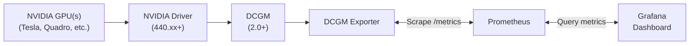

## 基本简介

`DCGM-Exporter`是一个专为`GPU`监控设计的强大工具，它基于`DCGM (Data Center GPU Manager) API`，能够收集`NVIDIA GPU`的详细指标并以`Prometheus`格式暴露。它是`NVIDIA GPU Operator`的一部分，但也可以独立部署使用。

作为目前最全面、最易于集成的`GPU监控解决方案`，`DCGM-Exporter`特别适合在`Kubernetes`环境中部署，为`AI训练`和`高性能计算`提供可靠的监控支持。

> **重要说明：** `DCGM-Exporter`仅适用于`NVIDIA`品牌的`GPU硬件`，如`Tesla`、`Quadro`、`GeForce`等系列。它不支持其他厂商的`GPU`产品，如`AMD`的`Radeon`系列、`Intel`的`Xe`系列、`华为`的`昇腾`系列或`寒武纪`的`MLU`系列等。如果您的环境中使用了非`NVIDIA`的`GPU`，需要采用相应厂商提供的监控解决方案。

## 主要特点

- **全面的指标收集**：提供超过`40`种`GPU`相关指标，包括利用率、内存、温度、功耗等
- **低开销**：相比直接调用`nvidia-smi`，`DCGM-Exporter`的资源消耗更低
- **高可靠性**：由`NVIDIA`官方维护，确保与各代`GPU`的兼容性
- **云原生友好**：提供容器化部署方案，易于在`Kubernetes`环境中集成
- **可扩展性**：支持从单个节点到大型集群的监控

## 基本架构

`DCGM-Exporter`的基本架构如下：




## 监控指标

`DCGM-Exporter`的指标由采集配置决定。默认配置来自上游仓库的[`etc/default-counters.csv`](https://github.com/NVIDIA/dcgm-exporter/blob/main/etc/default-counters.csv)；也可以按上游说明通过自定义`CSV`或`YAML`文件调整采集字段。本节先通过概览表打平列出当前上游默认配置、上游配置模板或当前`DCGM`字段文档中可查的指标，再在“指标详情”中逐项说明指标含义、`label`和示例；需要改配置才采集的字段会在采集说明或指标描述中标注。

> 说明：`label`会随`dcgm-exporter`版本和部署方式变化。当前上游渲染器对`GPU`实体会输出`gpu`、`UUID`、`pci_bus_id`、`device`、`modelName`、`hostname`等基础标签；`MIG`、`Kubernetes`、`HPC Job Mapping`、自定义`label`字段会追加额外标签。旧版本或历史样例中可能看到`Hostname`大写标签，当前上游源码使用`hostname`。

### 指标概览

本文只打平展示当前上游默认配置、上游配置模板或当前`DCGM`字段文档中可查的指标。标记为`可选`的字段需要通过自定义`CSV`或`YAML`采集配置启用；标记为`已废弃`的字段不建议新建监控面板继续使用。

| 指标名称 | 类型 | 单位/值 | 说明 | 含义 |
|---|---|---|---|---|
| `DCGM_FI_DEV_SM_CLOCK` | `gauge` | `MHz` | 默认 | `SM`时钟频率 |
| `DCGM_FI_DEV_MEM_CLOCK` | `gauge` | `MHz` | 默认 | 显存时钟频率 |
| `DCGM_FI_DEV_MEMORY_TEMP` | `gauge` | `C` | 默认 | 显存温度 |
| `DCGM_FI_DEV_GPU_TEMP` | `gauge` | `C` | 默认 | `GPU`核心温度 |
| `DCGM_FI_DEV_POWER_USAGE` | `gauge` | `W` | 默认 | `GPU`实时功耗 |
| `DCGM_FI_DEV_TOTAL_ENERGY_CONSUMPTION` | `counter` | `mJ` | 默认 | 设备启动以来累计能耗 |
| `DCGM_FI_DEV_PCIE_REPLAY_COUNTER` | `counter` | 计数 | 默认 | `PCIe`重试次数 |
| `DCGM_FI_DEV_GPU_UTIL` | `gauge` | `%` | 默认 | `GPU`利用率 |
| `DCGM_FI_DEV_MEM_COPY_UTIL` | `gauge` | `%` | 默认 | 显存拷贝/内存子系统利用率 |
| `DCGM_FI_DEV_ENC_UTIL` | `gauge` | `%` | 默认 | `NVENC`编码器利用率 |
| `DCGM_FI_DEV_DEC_UTIL` | `gauge` | `%` | 默认 | `NVDEC`解码器利用率 |
| `DCGM_FI_DEV_XID_ERRORS` | `gauge` | 错误编号 | 默认 | 最近一次`XID`错误编号 |
| `DCGM_FI_DEV_FB_FREE` | `gauge` | `MiB` | 默认 | 空闲帧缓冲显存 |
| `DCGM_FI_DEV_FB_USED` | `gauge` | `MiB` | 默认 | 已使用帧缓冲显存 |
| `DCGM_FI_DEV_FB_RESERVED` | `gauge` | `MiB` | 默认 | 保留帧缓冲显存 |
| `DCGM_FI_DEV_NVLINK_BANDWIDTH_TOTAL` | `gauge` | 计数器值 | 默认 | `NVLink`所有链路带宽计数器总和 |
| `DCGM_FI_DEV_VGPU_LICENSE_STATUS` | `gauge` | 状态码 | 默认 | `vGPU`许可状态 |
| `DCGM_FI_DEV_UNCORRECTABLE_REMAPPED_ROWS` | `counter` | 计数 | 默认 | 不可纠正错误导致的重映射行数 |
| `DCGM_FI_DEV_CORRECTABLE_REMAPPED_ROWS` | `counter` | 计数 | 默认 | 可纠正错误导致的重映射行数 |
| `DCGM_FI_DEV_ROW_REMAP_FAILURE` | `gauge` | 状态 | 默认 | 行重映射是否失败 |
| `DCGM_FI_PROF_GR_ENGINE_ACTIVE` | `gauge` | 比例 | 默认 | 图形/通用引擎活跃比例 |
| `DCGM_FI_PROF_PIPE_TENSOR_ACTIVE` | `gauge` | 比例 | 默认 | `Tensor/HMMA`管线活跃比例 |
| `DCGM_FI_PROF_DRAM_ACTIVE` | `gauge` | 比例 | 默认 | 显存接口活跃比例 |
| `DCGM_FI_PROF_PCIE_TX_BYTES` | `gauge` | `bytes/s` | 默认 | `PCIe`发送速率 |
| `DCGM_FI_PROF_PCIE_RX_BYTES` | `gauge` | `bytes/s` | 默认 | `PCIe`接收速率 |
| `DCGM_FI_DEV_FB_TOTAL` | `gauge` | `MiB` | 可选 | 帧缓冲显存总量 |
| `DCGM_FI_DEV_BOARD_POWER_LIMIT_REQUESTED_WATTS` | `gauge` | `W` | 可选 | 请求设置的板卡功耗上限 |
| `DCGM_FI_DEV_BOARD_POWER_LIMIT_MIN_WATTS` | `gauge` | `W` | 可选 | 板卡允许的最小功耗上限 |
| `DCGM_FI_DEV_BOARD_POWER_LIMIT_MAX_WATTS` | `gauge` | `W` | 可选 | 板卡允许的最大功耗上限 |
| `DCGM_FI_DEV_BOARD_POWER_LIMIT_DEFAULT_WATTS` | `gauge` | `W` | 可选 | 默认板卡功耗上限 |
| `DCGM_FI_DEV_BOARD_POWER_LIMIT_ENFORCED_WATTS` | `gauge` | `W` | 可选 | 当前生效的板卡功耗上限 |
| `DCGM_FI_DEV_ECC_MODE` | `gauge` | 状态码 | 可选 | `ECC`模式状态 |
| `DCGM_FI_DEV_ECC_SBE_VOL_TOTAL` | `counter` | 计数 | 可选 | 单比特易失`ECC`错误总数 |
| `DCGM_FI_DEV_ECC_DBE_VOL_TOTAL` | `counter` | 计数 | 可选 | 双比特易失`ECC`错误总数 |
| `DCGM_FI_DEV_ECC_SBE_AGG_TOTAL` | `counter` | 计数 | 可选 | 单比特持久`ECC`错误总数 |
| `DCGM_FI_DEV_ECC_DBE_AGG_TOTAL` | `counter` | 计数 | 可选 | 双比特持久`ECC`错误总数 |
| `DCGM_FI_DEV_RETIRED_SBE` | `counter` | 计数 | 可选 | 单比特错误导致的退役页数 |
| `DCGM_FI_DEV_RETIRED_DBE` | `counter` | 计数 | 可选 | 双比特错误导致的退役页数 |
| `DCGM_FI_DEV_RETIRED_PENDING` | `counter` | 计数 | 可选 | 等待退役的页面数 |
| `DCGM_FI_DEV_NVLINK_CRC_FLIT_ERROR_COUNT_TOTAL` | `counter` | 计数 | 可选 | `NVLink flow-control CRC`错误总数 |
| `DCGM_FI_DEV_NVLINK_CRC_DATA_ERROR_COUNT_TOTAL` | `counter` | 计数 | 可选 | `NVLink data CRC`错误总数 |
| `DCGM_FI_DEV_NVLINK_ECC_ERROR_TOTAL` | `counter` | 计数 | 可选 | `NVLink ECC`错误总数 |
| `DCGM_FI_DEV_PCIE_TX_THROUGHPUT` | `counter` | `KB`计数 | 已废弃 | `PCIe TX`累计传输量，官方字段文档已建议改用`DCGM_FI_PROF_PCIE_TX_BYTES` |
| `DCGM_FI_DEV_PCIE_RX_THROUGHPUT` | `counter` | `KB`计数 | <span style={{whiteSpace: 'nowrap'}}>已废弃</span> | `PCIe RX`累计接收量，官方字段文档已建议改用`DCGM_FI_PROF_PCIE_RX_BYTES` |


### 原始内容示例

下面是某次历史环境中的原始抓取片段，仅用于观察`label`形态；实际输出会随`dcgm-exporter`版本、`DCGM`版本、采集配置、`MIG`和`Kubernetes`映射开关变化。
```text
# HELP DCGM_FI_DEV_SM_CLOCK SM clock frequency (in MHz).
# TYPE DCGM_FI_DEV_SM_CLOCK gauge
DCGM_FI_DEV_SM_CLOCK{gpu="0",UUID="GPU-1f027ee8-6e1e-2b8c-0108-3d370e5f0418",device="nvidia0",modelName="NVIDIA A800-SXM4-80GB",GPU_I_PROFILE="2g.20gb",GPU_I_ID="3",Hostname="msxf-hpc-64-35-ai",DCGM_FI_DRIVER_VERSION="535.129.03",DCGM_FI_PROCESS_NAME="/usr/bin/dcgm-exporter"} 1410
DCGM_FI_DEV_SM_CLOCK{gpu="0",UUID="GPU-1f027ee8-6e1e-2b8c-0108-3d370e5f0418",device="nvidia0",modelName="NVIDIA A800-SXM4-80GB",GPU_I_PROFILE="2g.20gb",GPU_I_ID="5",Hostname="msxf-hpc-64-35-ai",DCGM_FI_DRIVER_VERSION="535.129.03",DCGM_FI_PROCESS_NAME="/usr/bin/dcgm-exporter"} 1410
DCGM_FI_DEV_SM_CLOCK{gpu="0",UUID="GPU-1f027ee8-6e1e-2b8c-0108-3d370e5f0418",device="nvidia0",modelName="NVIDIA A800-SXM4-80GB",GPU_I_PROFILE="2g.20gb",GPU_I_ID="6",Hostname="msxf-hpc-64-35-ai",DCGM_FI_DRIVER_VERSION="535.129.03",DCGM_FI_PROCESS_NAME="/usr/bin/dcgm-exporter"} 1410
DCGM_FI_DEV_SM_CLOCK{gpu="1",UUID="GPU-9e5b8fec-61bf-5124-a0a9-079af1b65cc6",device="nvidia1",modelName="NVIDIA A800-SXM4-80GB",Hostname="msxf-hpc-64-35-ai",DCGM_FI_DRIVER_VERSION="535.129.03",DCGM_FI_PROCESS_NAME="/usr/bin/dcgm-exporter"} 210
DCGM_FI_DEV_SM_CLOCK{gpu="2",UUID="GPU-5022ce43-b44a-987b-71c3-dee05378a618",device="nvidia2",modelName="NVIDIA A800-SXM4-80GB",Hostname="msxf-hpc-64-35-ai",DCGM_FI_DRIVER_VERSION="535.129.03",DCGM_FI_PROCESS_NAME="/usr/bin/dcgm-exporter"} 210
DCGM_FI_DEV_SM_CLOCK{gpu="3",UUID="GPU-f22db14d-1597-8eb1-78dc-d93765918c73",device="nvidia3",modelName="NVIDIA A800-SXM4-80GB",Hostname="msxf-hpc-64-35-ai",DCGM_FI_DRIVER_VERSION="535.129.03",DCGM_FI_PROCESS_NAME="/usr/bin/dcgm-exporter"} 210
DCGM_FI_DEV_SM_CLOCK{gpu="4",UUID="GPU-a878a9f3-cf6d-b94c-38ba-892ed140c7ee",device="nvidia4",modelName="NVIDIA A800-SXM4-80GB",Hostname="msxf-hpc-64-35-ai",DCGM_FI_DRIVER_VERSION="535.129.03",DCGM_FI_PROCESS_NAME="/usr/bin/dcgm-exporter"} 210
DCGM_FI_DEV_SM_CLOCK{gpu="5",UUID="GPU-a1dd6923-de62-e22b-c882-4d6f7e1ec5ce",device="nvidia5",modelName="NVIDIA A800-SXM4-80GB",Hostname="msxf-hpc-64-35-ai",DCGM_FI_DRIVER_VERSION="535.129.03",DCGM_FI_PROCESS_NAME="/usr/bin/dcgm-exporter"} 210
DCGM_FI_DEV_SM_CLOCK{gpu="6",UUID="GPU-c07eb90d-74b0-d3b4-e6ce-f18687564243",device="nvidia6",modelName="NVIDIA A800-SXM4-80GB",Hostname="msxf-hpc-64-35-ai",DCGM_FI_DRIVER_VERSION="535.129.03",DCGM_FI_PROCESS_NAME="/usr/bin/dcgm-exporter"} 210
DCGM_FI_DEV_SM_CLOCK{gpu="7",UUID="GPU-4e75c9ab-0ed7-8a57-75f5-23761b9f053f",device="nvidia7",modelName="NVIDIA A800-SXM4-80GB",Hostname="msxf-hpc-64-35-ai",DCGM_FI_DRIVER_VERSION="535.129.03",DCGM_FI_PROCESS_NAME="/usr/bin/dcgm-exporter"} 210
# HELP DCGM_FI_DEV_MEM_CLOCK Memory clock frequency (in MHz).
# TYPE DCGM_FI_DEV_MEM_CLOCK gauge
DCGM_FI_DEV_MEM_CLOCK{gpu="0",UUID="GPU-1f027ee8-6e1e-2b8c-0108-3d370e5f0418",device="nvidia0",modelName="NVIDIA A800-SXM4-80GB",GPU_I_PROFILE="2g.20gb",GPU_I_ID="3",Hostname="msxf-hpc-64-35-ai",DCGM_FI_DRIVER_VERSION="535.129.03",DCGM_FI_PROCESS_NAME="/usr/bin/dcgm-exporter"} 1593
DCGM_FI_DEV_MEM_CLOCK{gpu="0",UUID="GPU-1f027ee8-6e1e-2b8c-0108-3d370e5f0418",device="nvidia0",modelName="NVIDIA A800-SXM4-80GB",GPU_I_PROFILE="2g.20gb",GPU_I_ID="5",Hostname="msxf-hpc-64-35-ai",DCGM_FI_DRIVER_VERSION="535.129.03",DCGM_FI_PROCESS_NAME="/usr/bin/dcgm-exporter"} 1593
DCGM_FI_DEV_MEM_CLOCK{gpu="0",UUID="GPU-1f027ee8-6e1e-2b8c-0108-3d370e5f0418",device="nvidia0",modelName="NVIDIA A800-SXM4-80GB",GPU_I_PROFILE="2g.20gb",GPU_I_ID="6",Hostname="msxf-hpc-64-35-ai",DCGM_FI_DRIVER_VERSION="535.129.03",DCGM_FI_PROCESS_NAME="/usr/bin/dcgm-exporter"} 1593
DCGM_FI_DEV_MEM_CLOCK{gpu="1",UUID="GPU-9e5b8fec-61bf-5124-a0a9-079af1b65cc6",device="nvidia1",modelName="NVIDIA A800-SXM4-80GB",Hostname="msxf-hpc-64-35-ai",DCGM_FI_DRIVER_VERSION="535.129.03",DCGM_FI_PROCESS_NAME="/usr/bin/dcgm-exporter"} 1593
DCGM_FI_DEV_MEM_CLOCK{gpu="2",UUID="GPU-5022ce43-b44a-987b-71c3-dee05378a618",device="nvidia2",modelName="NVIDIA A800-SXM4-80GB",Hostname="msxf-hpc-64-35-ai",DCGM_FI_DRIVER_VERSION="535.129.03",DCGM_FI_PROCESS_NAME="/usr/bin/dcgm-exporter"} 1593
DCGM_FI_DEV_MEM_CLOCK{gpu="3",UUID="GPU-f22db14d-1597-8eb1-78dc-d93765918c73",device="nvidia3",modelName="NVIDIA A800-SXM4-80GB",Hostname="msxf-hpc-64-35-ai",DCGM_FI_DRIVER_VERSION="535.129.03",DCGM_FI_PROCESS_NAME="/usr/bin/dcgm-exporter"} 1593
DCGM_FI_DEV_MEM_CLOCK{gpu="4",UUID="GPU-a878a9f3-cf6d-b94c-38ba-892ed140c7ee",device="nvidia4",modelName="NVIDIA A800-SXM4-80GB",Hostname="msxf-hpc-64-35-ai",DCGM_FI_DRIVER_VERSION="535.129.03",DCGM_FI_PROCESS_NAME="/usr/bin/dcgm-exporter"} 1593
DCGM_FI_DEV_MEM_CLOCK{gpu="5",UUID="GPU-a1dd6923-de62-e22b-c882-4d6f7e1ec5ce",device="nvidia5",modelName="NVIDIA A800-SXM4-80GB",Hostname="msxf-hpc-64-35-ai",DCGM_FI_DRIVER_VERSION="535.129.03",DCGM_FI_PROCESS_NAME="/usr/bin/dcgm-exporter"} 1593
DCGM_FI_DEV_MEM_CLOCK{gpu="6",UUID="GPU-c07eb90d-74b0-d3b4-e6ce-f18687564243",device="nvidia6",modelName="NVIDIA A800-SXM4-80GB",Hostname="msxf-hpc-64-35-ai",DCGM_FI_DRIVER_VERSION="535.129.03",DCGM_FI_PROCESS_NAME="/usr/bin/dcgm-exporter"} 1593
DCGM_FI_DEV_MEM_CLOCK{gpu="7",UUID="GPU-4e75c9ab-0ed7-8a57-75f5-23761b9f053f",device="nvidia7",modelName="NVIDIA A800-SXM4-80GB",Hostname="msxf-hpc-64-35-ai",DCGM_FI_DRIVER_VERSION="535.129.03",DCGM_FI_PROCESS_NAME="/usr/bin/dcgm-exporter"} 1593
# HELP DCGM_FI_DEV_MEMORY_TEMP Memory temperature (in C).
# TYPE DCGM_FI_DEV_MEMORY_TEMP gauge
DCGM_FI_DEV_MEMORY_TEMP{gpu="0",UUID="GPU-1f027ee8-6e1e-2b8c-0108-3d370e5f0418",device="nvidia0",modelName="NVIDIA A800-SXM4-80GB",GPU_I_PROFILE="2g.20gb",GPU_I_ID="3",Hostname="msxf-hpc-64-35-ai",DCGM_FI_DRIVER_VERSION="535.129.03",DCGM_FI_PROCESS_NAME="/usr/bin/dcgm-exporter"} 29
DCGM_FI_DEV_MEMORY_TEMP{gpu="0",UUID="GPU-1f027ee8-6e1e-2b8c-0108-3d370e5f0418",device="nvidia0",modelName="NVIDIA A800-SXM4-80GB",GPU_I_PROFILE="2g.20gb",GPU_I_ID="5",Hostname="msxf-hpc-64-35-ai",DCGM_FI_DRIVER_VERSION="535.129.03",DCGM_FI_PROCESS_NAME="/usr/bin/dcgm-exporter"} 29
DCGM_FI_DEV_MEMORY_TEMP{gpu="0",UUID="GPU-1f027ee8-6e1e-2b8c-0108-3d370e5f0418",device="nvidia0",modelName="NVIDIA A800-SXM4-80GB",GPU_I_PROFILE="2g.20gb",GPU_I_ID="6",Hostname="msxf-hpc-64-35-ai",DCGM_FI_DRIVER_VERSION="535.129.03",DCGM_FI_PROCESS_NAME="/usr/bin/dcgm-exporter"} 29
DCGM_FI_DEV_MEMORY_TEMP{gpu="1",UUID="GPU-9e5b8fec-61bf-5124-a0a9-079af1b65cc6",device="nvidia1",modelName="NVIDIA A800-SXM4-80GB",Hostname="msxf-hpc-64-35-ai",DCGM_FI_DRIVER_VERSION="535.129.03",DCGM_FI_PROCESS_NAME="/usr/bin/dcgm-exporter"} 25
DCGM_FI_DEV_MEMORY_TEMP{gpu="2",UUID="GPU-5022ce43-b44a-987b-71c3-dee05378a618",device="nvidia2",modelName="NVIDIA A800-SXM4-80GB",Hostname="msxf-hpc-64-35-ai",DCGM_FI_DRIVER_VERSION="535.129.03",DCGM_FI_PROCESS_NAME="/usr/bin/dcgm-exporter"} 25
DCGM_FI_DEV_MEMORY_TEMP{gpu="3",UUID="GPU-f22db14d-1597-8eb1-78dc-d93765918c73",device="nvidia3",modelName="NVIDIA A800-SXM4-80GB",Hostname="msxf-hpc-64-35-ai",DCGM_FI_DRIVER_VERSION="535.129.03",DCGM_FI_PROCESS_NAME="/usr/bin/dcgm-exporter"} 28
DCGM_FI_DEV_MEMORY_TEMP{gpu="4",UUID="GPU-a878a9f3-cf6d-b94c-38ba-892ed140c7ee",device="nvidia4",modelName="NVIDIA A800-SXM4-80GB",Hostname="msxf-hpc-64-35-ai",DCGM_FI_DRIVER_VERSION="535.129.03",DCGM_FI_PROCESS_NAME="/usr/bin/dcgm-exporter"} 30
DCGM_FI_DEV_MEMORY_TEMP{gpu="5",UUID="GPU-a1dd6923-de62-e22b-c882-4d6f7e1ec5ce",device="nvidia5",modelName="NVIDIA A800-SXM4-80GB",Hostname="msxf-hpc-64-35-ai",DCGM_FI_DRIVER_VERSION="535.129.03",DCGM_FI_PROCESS_NAME="/usr/bin/dcgm-exporter"} 25
DCGM_FI_DEV_MEMORY_TEMP{gpu="6",UUID="GPU-c07eb90d-74b0-d3b4-e6ce-f18687564243",device="nvidia6",modelName="NVIDIA A800-SXM4-80GB",Hostname="msxf-hpc-64-35-ai",DCGM_FI_DRIVER_VERSION="535.129.03",DCGM_FI_PROCESS_NAME="/usr/bin/dcgm-exporter"} 26
DCGM_FI_DEV_MEMORY_TEMP{gpu="7",UUID="GPU-4e75c9ab-0ed7-8a57-75f5-23761b9f053f",device="nvidia7",modelName="NVIDIA A800-SXM4-80GB",Hostname="msxf-hpc-64-35-ai",DCGM_FI_DRIVER_VERSION="535.129.03",DCGM_FI_PROCESS_NAME="/usr/bin/dcgm-exporter"} 28
# HELP DCGM_FI_DEV_GPU_TEMP GPU temperature (in C).
# TYPE DCGM_FI_DEV_GPU_TEMP gauge
DCGM_FI_DEV_GPU_TEMP{gpu="0",UUID="GPU-1f027ee8-6e1e-2b8c-0108-3d370e5f0418",device="nvidia0",modelName="NVIDIA A800-SXM4-80GB",GPU_I_PROFILE="2g.20gb",GPU_I_ID="3",Hostname="msxf-hpc-64-35-ai",DCGM_FI_DRIVER_VERSION="535.129.03",DCGM_FI_PROCESS_NAME="/usr/bin/dcgm-exporter"} 33
DCGM_FI_DEV_GPU_TEMP{gpu="0",UUID="GPU-1f027ee8-6e1e-2b8c-0108-3d370e5f0418",device="nvidia0",modelName="NVIDIA A800-SXM4-80GB",GPU_I_PROFILE="2g.20gb",GPU_I_ID="5",Hostname="msxf-hpc-64-35-ai",DCGM_FI_DRIVER_VERSION="535.129.03",DCGM_FI_PROCESS_NAME="/usr/bin/dcgm-exporter"} 33
DCGM_FI_DEV_GPU_TEMP{gpu="0",UUID="GPU-1f027ee8-6e1e-2b8c-0108-3d370e5f0418",device="nvidia0",modelName="NVIDIA A800-SXM4-80GB",GPU_I_PROFILE="2g.20gb",GPU_I_ID="6",Hostname="msxf-hpc-64-35-ai",DCGM_FI_DRIVER_VERSION="535.129.03",DCGM_FI_PROCESS_NAME="/usr/bin/dcgm-exporter"} 33
DCGM_FI_DEV_GPU_TEMP{gpu="1",UUID="GPU-9e5b8fec-61bf-5124-a0a9-079af1b65cc6",device="nvidia1",modelName="NVIDIA A800-SXM4-80GB",Hostname="msxf-hpc-64-35-ai",DCGM_FI_DRIVER_VERSION="535.129.03",DCGM_FI_PROCESS_NAME="/usr/bin/dcgm-exporter"} 27
DCGM_FI_DEV_GPU_TEMP{gpu="2",UUID="GPU-5022ce43-b44a-987b-71c3-dee05378a618",device="nvidia2",modelName="NVIDIA A800-SXM4-80GB",Hostname="msxf-hpc-64-35-ai",DCGM_FI_DRIVER_VERSION="535.129.03",DCGM_FI_PROCESS_NAME="/usr/bin/dcgm-exporter"} 26
DCGM_FI_DEV_GPU_TEMP{gpu="3",UUID="GPU-f22db14d-1597-8eb1-78dc-d93765918c73",device="nvidia3",modelName="NVIDIA A800-SXM4-80GB",Hostname="msxf-hpc-64-35-ai",DCGM_FI_DRIVER_VERSION="535.129.03",DCGM_FI_PROCESS_NAME="/usr/bin/dcgm-exporter"} 31
DCGM_FI_DEV_GPU_TEMP{gpu="4",UUID="GPU-a878a9f3-cf6d-b94c-38ba-892ed140c7ee",device="nvidia4",modelName="NVIDIA A800-SXM4-80GB",Hostname="msxf-hpc-64-35-ai",DCGM_FI_DRIVER_VERSION="535.129.03",DCGM_FI_PROCESS_NAME="/usr/bin/dcgm-exporter"} 31
DCGM_FI_DEV_GPU_TEMP{gpu="5",UUID="GPU-a1dd6923-de62-e22b-c882-4d6f7e1ec5ce",device="nvidia5",modelName="NVIDIA A800-SXM4-80GB",Hostname="msxf-hpc-64-35-ai",DCGM_FI_DRIVER_VERSION="535.129.03",DCGM_FI_PROCESS_NAME="/usr/bin/dcgm-exporter"} 26
DCGM_FI_DEV_GPU_TEMP{gpu="6",UUID="GPU-c07eb90d-74b0-d3b4-e6ce-f18687564243",device="nvidia6",modelName="NVIDIA A800-SXM4-80GB",Hostname="msxf-hpc-64-35-ai",DCGM_FI_DRIVER_VERSION="535.129.03",DCGM_FI_PROCESS_NAME="/usr/bin/dcgm-exporter"} 26
DCGM_FI_DEV_GPU_TEMP{gpu="7",UUID="GPU-4e75c9ab-0ed7-8a57-75f5-23761b9f053f",device="nvidia7",modelName="NVIDIA A800-SXM4-80GB",Hostname="msxf-hpc-64-35-ai",DCGM_FI_DRIVER_VERSION="535.129.03",DCGM_FI_PROCESS_NAME="/usr/bin/dcgm-exporter"} 29
# HELP DCGM_FI_DEV_POWER_USAGE Power draw (in W).
# TYPE DCGM_FI_DEV_POWER_USAGE gauge
DCGM_FI_DEV_POWER_USAGE{gpu="0",UUID="GPU-1f027ee8-6e1e-2b8c-0108-3d370e5f0418",device="nvidia0",modelName="NVIDIA A800-SXM4-80GB",GPU_I_PROFILE="2g.20gb",GPU_I_ID="3",Hostname="msxf-hpc-64-35-ai",DCGM_FI_DRIVER_VERSION="535.129.03",DCGM_FI_PROCESS_NAME="/usr/bin/dcgm-exporter"} 78.174000
DCGM_FI_DEV_POWER_USAGE{gpu="0",UUID="GPU-1f027ee8-6e1e-2b8c-0108-3d370e5f0418",device="nvidia0",modelName="NVIDIA A800-SXM4-80GB",GPU_I_PROFILE="2g.20gb",GPU_I_ID="5",Hostname="msxf-hpc-64-35-ai",DCGM_FI_DRIVER_VERSION="535.129.03",DCGM_FI_PROCESS_NAME="/usr/bin/dcgm-exporter"} 78.174000
DCGM_FI_DEV_POWER_USAGE{gpu="0",UUID="GPU-1f027ee8-6e1e-2b8c-0108-3d370e5f0418",device="nvidia0",modelName="NVIDIA A800-SXM4-80GB",GPU_I_PROFILE="2g.20gb",GPU_I_ID="6",Hostname="msxf-hpc-64-35-ai",DCGM_FI_DRIVER_VERSION="535.129.03",DCGM_FI_PROCESS_NAME="/usr/bin/dcgm-exporter"} 78.446000
DCGM_FI_DEV_POWER_USAGE{gpu="1",UUID="GPU-9e5b8fec-61bf-5124-a0a9-079af1b65cc6",device="nvidia1",modelName="NVIDIA A800-SXM4-80GB",Hostname="msxf-hpc-64-35-ai",DCGM_FI_DRIVER_VERSION="535.129.03",DCGM_FI_PROCESS_NAME="/usr/bin/dcgm-exporter"} 55.942000
DCGM_FI_DEV_POWER_USAGE{gpu="2",UUID="GPU-5022ce43-b44a-987b-71c3-dee05378a618",device="nvidia2",modelName="NVIDIA A800-SXM4-80GB",Hostname="msxf-hpc-64-35-ai",DCGM_FI_DRIVER_VERSION="535.129.03",DCGM_FI_PROCESS_NAME="/usr/bin/dcgm-exporter"} 53.752000
DCGM_FI_DEV_POWER_USAGE{gpu="3",UUID="GPU-f22db14d-1597-8eb1-78dc-d93765918c73",device="nvidia3",modelName="NVIDIA A800-SXM4-80GB",Hostname="msxf-hpc-64-35-ai",DCGM_FI_DRIVER_VERSION="535.129.03",DCGM_FI_PROCESS_NAME="/usr/bin/dcgm-exporter"} 56.990000
DCGM_FI_DEV_POWER_USAGE{gpu="4",UUID="GPU-a878a9f3-cf6d-b94c-38ba-892ed140c7ee",device="nvidia4",modelName="NVIDIA A800-SXM4-80GB",Hostname="msxf-hpc-64-35-ai",DCGM_FI_DRIVER_VERSION="535.129.03",DCGM_FI_PROCESS_NAME="/usr/bin/dcgm-exporter"} 58.643000
DCGM_FI_DEV_POWER_USAGE{gpu="5",UUID="GPU-a1dd6923-de62-e22b-c882-4d6f7e1ec5ce",device="nvidia5",modelName="NVIDIA A800-SXM4-80GB",Hostname="msxf-hpc-64-35-ai",DCGM_FI_DRIVER_VERSION="535.129.03",DCGM_FI_PROCESS_NAME="/usr/bin/dcgm-exporter"} 54.581000
DCGM_FI_DEV_POWER_USAGE{gpu="6",UUID="GPU-c07eb90d-74b0-d3b4-e6ce-f18687564243",device="nvidia6",modelName="NVIDIA A800-SXM4-80GB",Hostname="msxf-hpc-64-35-ai",DCGM_FI_DRIVER_VERSION="535.129.03",DCGM_FI_PROCESS_NAME="/usr/bin/dcgm-exporter"} 57.145000
DCGM_FI_DEV_POWER_USAGE{gpu="7",UUID="GPU-4e75c9ab-0ed7-8a57-75f5-23761b9f053f",device="nvidia7",modelName="NVIDIA A800-SXM4-80GB",Hostname="msxf-hpc-64-35-ai",DCGM_FI_DRIVER_VERSION="535.129.03",DCGM_FI_PROCESS_NAME="/usr/bin/dcgm-exporter"} 55.011000
# HELP DCGM_FI_DEV_TOTAL_ENERGY_CONSUMPTION Total energy consumption since boot (in mJ).
# TYPE DCGM_FI_DEV_TOTAL_ENERGY_CONSUMPTION counter
DCGM_FI_DEV_TOTAL_ENERGY_CONSUMPTION{gpu="0",UUID="GPU-1f027ee8-6e1e-2b8c-0108-3d370e5f0418",device="nvidia0",modelName="NVIDIA A800-SXM4-80GB",GPU_I_PROFILE="2g.20gb",GPU_I_ID="3",Hostname="msxf-hpc-64-35-ai",DCGM_FI_DRIVER_VERSION="535.129.03",DCGM_FI_PROCESS_NAME="/usr/bin/dcgm-exporter"} 257858316
DCGM_FI_DEV_TOTAL_ENERGY_CONSUMPTION{gpu="0",UUID="GPU-1f027ee8-6e1e-2b8c-0108-3d370e5f0418",device="nvidia0",modelName="NVIDIA A800-SXM4-80GB",GPU_I_PROFILE="2g.20gb",GPU_I_ID="5",Hostname="msxf-hpc-64-35-ai",DCGM_FI_DRIVER_VERSION="535.129.03",DCGM_FI_PROCESS_NAME="/usr/bin/dcgm-exporter"} 257858316
DCGM_FI_DEV_TOTAL_ENERGY_CONSUMPTION{gpu="0",UUID="GPU-1f027ee8-6e1e-2b8c-0108-3d370e5f0418",device="nvidia0",modelName="NVIDIA A800-SXM4-80GB",GPU_I_PROFILE="2g.20gb",GPU_I_ID="6",Hostname="msxf-hpc-64-35-ai",DCGM_FI_DRIVER_VERSION="535.129.03",DCGM_FI_PROCESS_NAME="/usr/bin/dcgm-exporter"} 257858316
DCGM_FI_DEV_TOTAL_ENERGY_CONSUMPTION{gpu="1",UUID="GPU-9e5b8fec-61bf-5124-a0a9-079af1b65cc6",device="nvidia1",modelName="NVIDIA A800-SXM4-80GB",Hostname="msxf-hpc-64-35-ai",DCGM_FI_DRIVER_VERSION="535.129.03",DCGM_FI_PROCESS_NAME="/usr/bin/dcgm-exporter"} 187554325
DCGM_FI_DEV_TOTAL_ENERGY_CONSUMPTION{gpu="2",UUID="GPU-5022ce43-b44a-987b-71c3-dee05378a618",device="nvidia2",modelName="NVIDIA A800-SXM4-80GB",Hostname="msxf-hpc-64-35-ai",DCGM_FI_DRIVER_VERSION="535.129.03",DCGM_FI_PROCESS_NAME="/usr/bin/dcgm-exporter"} 179711977
DCGM_FI_DEV_TOTAL_ENERGY_CONSUMPTION{gpu="3",UUID="GPU-f22db14d-1597-8eb1-78dc-d93765918c73",device="nvidia3",modelName="NVIDIA A800-SXM4-80GB",Hostname="msxf-hpc-64-35-ai",DCGM_FI_DRIVER_VERSION="535.129.03",DCGM_FI_PROCESS_NAME="/usr/bin/dcgm-exporter"} 190722266
DCGM_FI_DEV_TOTAL_ENERGY_CONSUMPTION{gpu="4",UUID="GPU-a878a9f3-cf6d-b94c-38ba-892ed140c7ee",device="nvidia4",modelName="NVIDIA A800-SXM4-80GB",Hostname="msxf-hpc-64-35-ai",DCGM_FI_DRIVER_VERSION="535.129.03",DCGM_FI_PROCESS_NAME="/usr/bin/dcgm-exporter"} 196329125
DCGM_FI_DEV_TOTAL_ENERGY_CONSUMPTION{gpu="5",UUID="GPU-a1dd6923-de62-e22b-c882-4d6f7e1ec5ce",device="nvidia5",modelName="NVIDIA A800-SXM4-80GB",Hostname="msxf-hpc-64-35-ai",DCGM_FI_DRIVER_VERSION="535.129.03",DCGM_FI_PROCESS_NAME="/usr/bin/dcgm-exporter"} 182536958
DCGM_FI_DEV_TOTAL_ENERGY_CONSUMPTION{gpu="6",UUID="GPU-c07eb90d-74b0-d3b4-e6ce-f18687564243",device="nvidia6",modelName="NVIDIA A800-SXM4-80GB",Hostname="msxf-hpc-64-35-ai",DCGM_FI_DRIVER_VERSION="535.129.03",DCGM_FI_PROCESS_NAME="/usr/bin/dcgm-exporter"} 191045467
DCGM_FI_DEV_TOTAL_ENERGY_CONSUMPTION{gpu="7",UUID="GPU-4e75c9ab-0ed7-8a57-75f5-23761b9f053f",device="nvidia7",modelName="NVIDIA A800-SXM4-80GB",Hostname="msxf-hpc-64-35-ai",DCGM_FI_DRIVER_VERSION="535.129.03",DCGM_FI_PROCESS_NAME="/usr/bin/dcgm-exporter"} 183986286
# HELP DCGM_FI_DEV_PCIE_REPLAY_COUNTER Total number of PCIe retries.
# TYPE DCGM_FI_DEV_PCIE_REPLAY_COUNTER counter
DCGM_FI_DEV_PCIE_REPLAY_COUNTER{gpu="0",UUID="GPU-1f027ee8-6e1e-2b8c-0108-3d370e5f0418",device="nvidia0",modelName="NVIDIA A800-SXM4-80GB",GPU_I_PROFILE="2g.20gb",GPU_I_ID="3",Hostname="msxf-hpc-64-35-ai",DCGM_FI_DRIVER_VERSION="535.129.03",DCGM_FI_PROCESS_NAME="/usr/bin/dcgm-exporter"} 0
DCGM_FI_DEV_PCIE_REPLAY_COUNTER{gpu="0",UUID="GPU-1f027ee8-6e1e-2b8c-0108-3d370e5f0418",device="nvidia0",modelName="NVIDIA A800-SXM4-80GB",GPU_I_PROFILE="2g.20gb",GPU_I_ID="5",Hostname="msxf-hpc-64-35-ai",DCGM_FI_DRIVER_VERSION="535.129.03",DCGM_FI_PROCESS_NAME="/usr/bin/dcgm-exporter"} 0
DCGM_FI_DEV_PCIE_REPLAY_COUNTER{gpu="0",UUID="GPU-1f027ee8-6e1e-2b8c-0108-3d370e5f0418",device="nvidia0",modelName="NVIDIA A800-SXM4-80GB",GPU_I_PROFILE="2g.20gb",GPU_I_ID="6",Hostname="msxf-hpc-64-35-ai",DCGM_FI_DRIVER_VERSION="535.129.03",DCGM_FI_PROCESS_NAME="/usr/bin/dcgm-exporter"} 0
DCGM_FI_DEV_PCIE_REPLAY_COUNTER{gpu="1",UUID="GPU-9e5b8fec-61bf-5124-a0a9-079af1b65cc6",device="nvidia1",modelName="NVIDIA A800-SXM4-80GB",Hostname="msxf-hpc-64-35-ai",DCGM_FI_DRIVER_VERSION="535.129.03",DCGM_FI_PROCESS_NAME="/usr/bin/dcgm-exporter"} 0
DCGM_FI_DEV_PCIE_REPLAY_COUNTER{gpu="2",UUID="GPU-5022ce43-b44a-987b-71c3-dee05378a618",device="nvidia2",modelName="NVIDIA A800-SXM4-80GB",Hostname="msxf-hpc-64-35-ai",DCGM_FI_DRIVER_VERSION="535.129.03",DCGM_FI_PROCESS_NAME="/usr/bin/dcgm-exporter"} 0
DCGM_FI_DEV_PCIE_REPLAY_COUNTER{gpu="3",UUID="GPU-f22db14d-1597-8eb1-78dc-d93765918c73",device="nvidia3",modelName="NVIDIA A800-SXM4-80GB",Hostname="msxf-hpc-64-35-ai",DCGM_FI_DRIVER_VERSION="535.129.03",DCGM_FI_PROCESS_NAME="/usr/bin/dcgm-exporter"} 0
DCGM_FI_DEV_PCIE_REPLAY_COUNTER{gpu="4",UUID="GPU-a878a9f3-cf6d-b94c-38ba-892ed140c7ee",device="nvidia4",modelName="NVIDIA A800-SXM4-80GB",Hostname="msxf-hpc-64-35-ai",DCGM_FI_DRIVER_VERSION="535.129.03",DCGM_FI_PROCESS_NAME="/usr/bin/dcgm-exporter"} 0
DCGM_FI_DEV_PCIE_REPLAY_COUNTER{gpu="5",UUID="GPU-a1dd6923-de62-e22b-c882-4d6f7e1ec5ce",device="nvidia5",modelName="NVIDIA A800-SXM4-80GB",Hostname="msxf-hpc-64-35-ai",DCGM_FI_DRIVER_VERSION="535.129.03",DCGM_FI_PROCESS_NAME="/usr/bin/dcgm-exporter"} 0
DCGM_FI_DEV_PCIE_REPLAY_COUNTER{gpu="6",UUID="GPU-c07eb90d-74b0-d3b4-e6ce-f18687564243",device="nvidia6",modelName="NVIDIA A800-SXM4-80GB",Hostname="msxf-hpc-64-35-ai",DCGM_FI_DRIVER_VERSION="535.129.03",DCGM_FI_PROCESS_NAME="/usr/bin/dcgm-exporter"} 0
DCGM_FI_DEV_PCIE_REPLAY_COUNTER{gpu="7",UUID="GPU-4e75c9ab-0ed7-8a57-75f5-23761b9f053f",device="nvidia7",modelName="NVIDIA A800-SXM4-80GB",Hostname="msxf-hpc-64-35-ai",DCGM_FI_DRIVER_VERSION="535.129.03",DCGM_FI_PROCESS_NAME="/usr/bin/dcgm-exporter"} 0
# HELP DCGM_FI_DEV_GPU_UTIL GPU utilization (in %).
# TYPE DCGM_FI_DEV_GPU_UTIL gauge
DCGM_FI_DEV_GPU_UTIL{gpu="1",UUID="GPU-9e5b8fec-61bf-5124-a0a9-079af1b65cc6",device="nvidia1",modelName="NVIDIA A800-SXM4-80GB",Hostname="msxf-hpc-64-35-ai",DCGM_FI_DRIVER_VERSION="535.129.03",DCGM_FI_PROCESS_NAME="/usr/bin/dcgm-exporter"} 0
DCGM_FI_DEV_GPU_UTIL{gpu="2",UUID="GPU-5022ce43-b44a-987b-71c3-dee05378a618",device="nvidia2",modelName="NVIDIA A800-SXM4-80GB",Hostname="msxf-hpc-64-35-ai",DCGM_FI_DRIVER_VERSION="535.129.03",DCGM_FI_PROCESS_NAME="/usr/bin/dcgm-exporter"} 0
DCGM_FI_DEV_GPU_UTIL{gpu="3",UUID="GPU-f22db14d-1597-8eb1-78dc-d93765918c73",device="nvidia3",modelName="NVIDIA A800-SXM4-80GB",Hostname="msxf-hpc-64-35-ai",DCGM_FI_DRIVER_VERSION="535.129.03",DCGM_FI_PROCESS_NAME="/usr/bin/dcgm-exporter"} 0
DCGM_FI_DEV_GPU_UTIL{gpu="4",UUID="GPU-a878a9f3-cf6d-b94c-38ba-892ed140c7ee",device="nvidia4",modelName="NVIDIA A800-SXM4-80GB",Hostname="msxf-hpc-64-35-ai",DCGM_FI_DRIVER_VERSION="535.129.03",DCGM_FI_PROCESS_NAME="/usr/bin/dcgm-exporter"} 0
DCGM_FI_DEV_GPU_UTIL{gpu="5",UUID="GPU-a1dd6923-de62-e22b-c882-4d6f7e1ec5ce",device="nvidia5",modelName="NVIDIA A800-SXM4-80GB",Hostname="msxf-hpc-64-35-ai",DCGM_FI_DRIVER_VERSION="535.129.03",DCGM_FI_PROCESS_NAME="/usr/bin/dcgm-exporter"} 0
DCGM_FI_DEV_GPU_UTIL{gpu="6",UUID="GPU-c07eb90d-74b0-d3b4-e6ce-f18687564243",device="nvidia6",modelName="NVIDIA A800-SXM4-80GB",Hostname="msxf-hpc-64-35-ai",DCGM_FI_DRIVER_VERSION="535.129.03",DCGM_FI_PROCESS_NAME="/usr/bin/dcgm-exporter"} 0
DCGM_FI_DEV_GPU_UTIL{gpu="7",UUID="GPU-4e75c9ab-0ed7-8a57-75f5-23761b9f053f",device="nvidia7",modelName="NVIDIA A800-SXM4-80GB",Hostname="msxf-hpc-64-35-ai",DCGM_FI_DRIVER_VERSION="535.129.03",DCGM_FI_PROCESS_NAME="/usr/bin/dcgm-exporter"} 0
# HELP DCGM_FI_DEV_MEM_COPY_UTIL Memory utilization (in %).
# TYPE DCGM_FI_DEV_MEM_COPY_UTIL gauge
DCGM_FI_DEV_MEM_COPY_UTIL{gpu="1",UUID="GPU-9e5b8fec-61bf-5124-a0a9-079af1b65cc6",device="nvidia1",modelName="NVIDIA A800-SXM4-80GB",Hostname="msxf-hpc-64-35-ai",DCGM_FI_DRIVER_VERSION="535.129.03",DCGM_FI_PROCESS_NAME="/usr/bin/dcgm-exporter"} 0
DCGM_FI_DEV_MEM_COPY_UTIL{gpu="2",UUID="GPU-5022ce43-b44a-987b-71c3-dee05378a618",device="nvidia2",modelName="NVIDIA A800-SXM4-80GB",Hostname="msxf-hpc-64-35-ai",DCGM_FI_DRIVER_VERSION="535.129.03",DCGM_FI_PROCESS_NAME="/usr/bin/dcgm-exporter"} 0
DCGM_FI_DEV_MEM_COPY_UTIL{gpu="3",UUID="GPU-f22db14d-1597-8eb1-78dc-d93765918c73",device="nvidia3",modelName="NVIDIA A800-SXM4-80GB",Hostname="msxf-hpc-64-35-ai",DCGM_FI_DRIVER_VERSION="535.129.03",DCGM_FI_PROCESS_NAME="/usr/bin/dcgm-exporter"} 0
DCGM_FI_DEV_MEM_COPY_UTIL{gpu="4",UUID="GPU-a878a9f3-cf6d-b94c-38ba-892ed140c7ee",device="nvidia4",modelName="NVIDIA A800-SXM4-80GB",Hostname="msxf-hpc-64-35-ai",DCGM_FI_DRIVER_VERSION="535.129.03",DCGM_FI_PROCESS_NAME="/usr/bin/dcgm-exporter"} 0
DCGM_FI_DEV_MEM_COPY_UTIL{gpu="5",UUID="GPU-a1dd6923-de62-e22b-c882-4d6f7e1ec5ce",device="nvidia5",modelName="NVIDIA A800-SXM4-80GB",Hostname="msxf-hpc-64-35-ai",DCGM_FI_DRIVER_VERSION="535.129.03",DCGM_FI_PROCESS_NAME="/usr/bin/dcgm-exporter"} 0
DCGM_FI_DEV_MEM_COPY_UTIL{gpu="6",UUID="GPU-c07eb90d-74b0-d3b4-e6ce-f18687564243",device="nvidia6",modelName="NVIDIA A800-SXM4-80GB",Hostname="msxf-hpc-64-35-ai",DCGM_FI_DRIVER_VERSION="535.129.03",DCGM_FI_PROCESS_NAME="/usr/bin/dcgm-exporter"} 0
DCGM_FI_DEV_MEM_COPY_UTIL{gpu="7",UUID="GPU-4e75c9ab-0ed7-8a57-75f5-23761b9f053f",device="nvidia7",modelName="NVIDIA A800-SXM4-80GB",Hostname="msxf-hpc-64-35-ai",DCGM_FI_DRIVER_VERSION="535.129.03",DCGM_FI_PROCESS_NAME="/usr/bin/dcgm-exporter"} 0
# HELP DCGM_FI_DEV_ACCOUNTING_DATA Process Accounting Stats
# TYPE DCGM_FI_DEV_ACCOUNTING_DATA gauge
DCGM_FI_DEV_ACCOUNTING_DATA{gpu="0",UUID="GPU-1f027ee8-6e1e-2b8c-0108-3d370e5f0418",device="nvidia0",modelName="NVIDIA A800-SXM4-80GB",GPU_I_PROFILE="2g.20gb",GPU_I_ID="3",Hostname="msxf-hpc-64-35-ai",DCGM_FI_DRIVER_VERSION="535.129.03",DCGM_FI_PROCESS_NAME="/usr/bin/dcgm-exporter"} 0
DCGM_FI_DEV_ACCOUNTING_DATA{gpu="0",UUID="GPU-1f027ee8-6e1e-2b8c-0108-3d370e5f0418",device="nvidia0",modelName="NVIDIA A800-SXM4-80GB",GPU_I_PROFILE="2g.20gb",GPU_I_ID="5",Hostname="msxf-hpc-64-35-ai",DCGM_FI_DRIVER_VERSION="535.129.03",DCGM_FI_PROCESS_NAME="/usr/bin/dcgm-exporter"} 0
DCGM_FI_DEV_ACCOUNTING_DATA{gpu="0",UUID="GPU-1f027ee8-6e1e-2b8c-0108-3d370e5f0418",device="nvidia0",modelName="NVIDIA A800-SXM4-80GB",GPU_I_PROFILE="2g.20gb",GPU_I_ID="6",Hostname="msxf-hpc-64-35-ai",DCGM_FI_DRIVER_VERSION="535.129.03",DCGM_FI_PROCESS_NAME="/usr/bin/dcgm-exporter"} 0
DCGM_FI_DEV_ACCOUNTING_DATA{gpu="1",UUID="GPU-9e5b8fec-61bf-5124-a0a9-079af1b65cc6",device="nvidia1",modelName="NVIDIA A800-SXM4-80GB",Hostname="msxf-hpc-64-35-ai",DCGM_FI_DRIVER_VERSION="535.129.03",DCGM_FI_PROCESS_NAME="/usr/bin/dcgm-exporter"} 0
DCGM_FI_DEV_ACCOUNTING_DATA{gpu="2",UUID="GPU-5022ce43-b44a-987b-71c3-dee05378a618",device="nvidia2",modelName="NVIDIA A800-SXM4-80GB",Hostname="msxf-hpc-64-35-ai",DCGM_FI_DRIVER_VERSION="535.129.03",DCGM_FI_PROCESS_NAME="/usr/bin/dcgm-exporter"} 0
DCGM_FI_DEV_ACCOUNTING_DATA{gpu="3",UUID="GPU-f22db14d-1597-8eb1-78dc-d93765918c73",device="nvidia3",modelName="NVIDIA A800-SXM4-80GB",Hostname="msxf-hpc-64-35-ai",DCGM_FI_DRIVER_VERSION="535.129.03",DCGM_FI_PROCESS_NAME="/usr/bin/dcgm-exporter"} 0
DCGM_FI_DEV_ACCOUNTING_DATA{gpu="4",UUID="GPU-a878a9f3-cf6d-b94c-38ba-892ed140c7ee",device="nvidia4",modelName="NVIDIA A800-SXM4-80GB",Hostname="msxf-hpc-64-35-ai",DCGM_FI_DRIVER_VERSION="535.129.03",DCGM_FI_PROCESS_NAME="/usr/bin/dcgm-exporter"} 0
DCGM_FI_DEV_ACCOUNTING_DATA{gpu="5",UUID="GPU-a1dd6923-de62-e22b-c882-4d6f7e1ec5ce",device="nvidia5",modelName="NVIDIA A800-SXM4-80GB",Hostname="msxf-hpc-64-35-ai",DCGM_FI_DRIVER_VERSION="535.129.03",DCGM_FI_PROCESS_NAME="/usr/bin/dcgm-exporter"} 0
DCGM_FI_DEV_ACCOUNTING_DATA{gpu="6",UUID="GPU-c07eb90d-74b0-d3b4-e6ce-f18687564243",device="nvidia6",modelName="NVIDIA A800-SXM4-80GB",Hostname="msxf-hpc-64-35-ai",DCGM_FI_DRIVER_VERSION="535.129.03",DCGM_FI_PROCESS_NAME="/usr/bin/dcgm-exporter"} 0
DCGM_FI_DEV_ACCOUNTING_DATA{gpu="7",UUID="GPU-4e75c9ab-0ed7-8a57-75f5-23761b9f053f",device="nvidia7",modelName="NVIDIA A800-SXM4-80GB",Hostname="msxf-hpc-64-35-ai",DCGM_FI_DRIVER_VERSION="535.129.03",DCGM_FI_PROCESS_NAME="/usr/bin/dcgm-exporter"} 0
# HELP DCGM_FI_DEV_ENC_UTIL Encoder utilization (in %).
# TYPE DCGM_FI_DEV_ENC_UTIL gauge
DCGM_FI_DEV_ENC_UTIL{gpu="1",UUID="GPU-9e5b8fec-61bf-5124-a0a9-079af1b65cc6",device="nvidia1",modelName="NVIDIA A800-SXM4-80GB",Hostname="msxf-hpc-64-35-ai",DCGM_FI_DRIVER_VERSION="535.129.03",DCGM_FI_PROCESS_NAME="/usr/bin/dcgm-exporter"} 0
DCGM_FI_DEV_ENC_UTIL{gpu="2",UUID="GPU-5022ce43-b44a-987b-71c3-dee05378a618",device="nvidia2",modelName="NVIDIA A800-SXM4-80GB",Hostname="msxf-hpc-64-35-ai",DCGM_FI_DRIVER_VERSION="535.129.03",DCGM_FI_PROCESS_NAME="/usr/bin/dcgm-exporter"} 0
DCGM_FI_DEV_ENC_UTIL{gpu="3",UUID="GPU-f22db14d-1597-8eb1-78dc-d93765918c73",device="nvidia3",modelName="NVIDIA A800-SXM4-80GB",Hostname="msxf-hpc-64-35-ai",DCGM_FI_DRIVER_VERSION="535.129.03",DCGM_FI_PROCESS_NAME="/usr/bin/dcgm-exporter"} 0
DCGM_FI_DEV_ENC_UTIL{gpu="4",UUID="GPU-a878a9f3-cf6d-b94c-38ba-892ed140c7ee",device="nvidia4",modelName="NVIDIA A800-SXM4-80GB",Hostname="msxf-hpc-64-35-ai",DCGM_FI_DRIVER_VERSION="535.129.03",DCGM_FI_PROCESS_NAME="/usr/bin/dcgm-exporter"} 0
DCGM_FI_DEV_ENC_UTIL{gpu="5",UUID="GPU-a1dd6923-de62-e22b-c882-4d6f7e1ec5ce",device="nvidia5",modelName="NVIDIA A800-SXM4-80GB",Hostname="msxf-hpc-64-35-ai",DCGM_FI_DRIVER_VERSION="535.129.03",DCGM_FI_PROCESS_NAME="/usr/bin/dcgm-exporter"} 0
DCGM_FI_DEV_ENC_UTIL{gpu="6",UUID="GPU-c07eb90d-74b0-d3b4-e6ce-f18687564243",device="nvidia6",modelName="NVIDIA A800-SXM4-80GB",Hostname="msxf-hpc-64-35-ai",DCGM_FI_DRIVER_VERSION="535.129.03",DCGM_FI_PROCESS_NAME="/usr/bin/dcgm-exporter"} 0
DCGM_FI_DEV_ENC_UTIL{gpu="7",UUID="GPU-4e75c9ab-0ed7-8a57-75f5-23761b9f053f",device="nvidia7",modelName="NVIDIA A800-SXM4-80GB",Hostname="msxf-hpc-64-35-ai",DCGM_FI_DRIVER_VERSION="535.129.03",DCGM_FI_PROCESS_NAME="/usr/bin/dcgm-exporter"} 0
# HELP DCGM_FI_DEV_DEC_UTIL Decoder utilization (in %).
# TYPE DCGM_FI_DEV_DEC_UTIL gauge
DCGM_FI_DEV_DEC_UTIL{gpu="1",UUID="GPU-9e5b8fec-61bf-5124-a0a9-079af1b65cc6",device="nvidia1",modelName="NVIDIA A800-SXM4-80GB",Hostname="msxf-hpc-64-35-ai",DCGM_FI_DRIVER_VERSION="535.129.03",DCGM_FI_PROCESS_NAME="/usr/bin/dcgm-exporter"} 0
DCGM_FI_DEV_DEC_UTIL{gpu="2",UUID="GPU-5022ce43-b44a-987b-71c3-dee05378a618",device="nvidia2",modelName="NVIDIA A800-SXM4-80GB",Hostname="msxf-hpc-64-35-ai",DCGM_FI_DRIVER_VERSION="535.129.03",DCGM_FI_PROCESS_NAME="/usr/bin/dcgm-exporter"} 0
DCGM_FI_DEV_DEC_UTIL{gpu="3",UUID="GPU-f22db14d-1597-8eb1-78dc-d93765918c73",device="nvidia3",modelName="NVIDIA A800-SXM4-80GB",Hostname="msxf-hpc-64-35-ai",DCGM_FI_DRIVER_VERSION="535.129.03",DCGM_FI_PROCESS_NAME="/usr/bin/dcgm-exporter"} 0
DCGM_FI_DEV_DEC_UTIL{gpu="4",UUID="GPU-a878a9f3-cf6d-b94c-38ba-892ed140c7ee",device="nvidia4",modelName="NVIDIA A800-SXM4-80GB",Hostname="msxf-hpc-64-35-ai",DCGM_FI_DRIVER_VERSION="535.129.03",DCGM_FI_PROCESS_NAME="/usr/bin/dcgm-exporter"} 0
DCGM_FI_DEV_DEC_UTIL{gpu="5",UUID="GPU-a1dd6923-de62-e22b-c882-4d6f7e1ec5ce",device="nvidia5",modelName="NVIDIA A800-SXM4-80GB",Hostname="msxf-hpc-64-35-ai",DCGM_FI_DRIVER_VERSION="535.129.03",DCGM_FI_PROCESS_NAME="/usr/bin/dcgm-exporter"} 0
DCGM_FI_DEV_DEC_UTIL{gpu="6",UUID="GPU-c07eb90d-74b0-d3b4-e6ce-f18687564243",device="nvidia6",modelName="NVIDIA A800-SXM4-80GB",Hostname="msxf-hpc-64-35-ai",DCGM_FI_DRIVER_VERSION="535.129.03",DCGM_FI_PROCESS_NAME="/usr/bin/dcgm-exporter"} 0
DCGM_FI_DEV_DEC_UTIL{gpu="7",UUID="GPU-4e75c9ab-0ed7-8a57-75f5-23761b9f053f",device="nvidia7",modelName="NVIDIA A800-SXM4-80GB",Hostname="msxf-hpc-64-35-ai",DCGM_FI_DRIVER_VERSION="535.129.03",DCGM_FI_PROCESS_NAME="/usr/bin/dcgm-exporter"} 0
# HELP DCGM_FI_DEV_XID_ERRORS Value of the last XID error encountered.
# TYPE DCGM_FI_DEV_XID_ERRORS gauge
DCGM_FI_DEV_XID_ERRORS{gpu="0",UUID="GPU-1f027ee8-6e1e-2b8c-0108-3d370e5f0418",device="nvidia0",modelName="NVIDIA A800-SXM4-80GB",GPU_I_PROFILE="2g.20gb",GPU_I_ID="3",Hostname="msxf-hpc-64-35-ai",DCGM_FI_DRIVER_VERSION="535.129.03",DCGM_FI_PROCESS_NAME="/usr/bin/dcgm-exporter"} 0
DCGM_FI_DEV_XID_ERRORS{gpu="0",UUID="GPU-1f027ee8-6e1e-2b8c-0108-3d370e5f0418",device="nvidia0",modelName="NVIDIA A800-SXM4-80GB",GPU_I_PROFILE="2g.20gb",GPU_I_ID="5",Hostname="msxf-hpc-64-35-ai",DCGM_FI_DRIVER_VERSION="535.129.03",DCGM_FI_PROCESS_NAME="/usr/bin/dcgm-exporter"} 0
DCGM_FI_DEV_XID_ERRORS{gpu="0",UUID="GPU-1f027ee8-6e1e-2b8c-0108-3d370e5f0418",device="nvidia0",modelName="NVIDIA A800-SXM4-80GB",GPU_I_PROFILE="2g.20gb",GPU_I_ID="6",Hostname="msxf-hpc-64-35-ai",DCGM_FI_DRIVER_VERSION="535.129.03",DCGM_FI_PROCESS_NAME="/usr/bin/dcgm-exporter"} 0
DCGM_FI_DEV_XID_ERRORS{gpu="1",UUID="GPU-9e5b8fec-61bf-5124-a0a9-079af1b65cc6",device="nvidia1",modelName="NVIDIA A800-SXM4-80GB",Hostname="msxf-hpc-64-35-ai",DCGM_FI_DRIVER_VERSION="535.129.03",DCGM_FI_PROCESS_NAME="/usr/bin/dcgm-exporter"} 0
DCGM_FI_DEV_XID_ERRORS{gpu="2",UUID="GPU-5022ce43-b44a-987b-71c3-dee05378a618",device="nvidia2",modelName="NVIDIA A800-SXM4-80GB",Hostname="msxf-hpc-64-35-ai",DCGM_FI_DRIVER_VERSION="535.129.03",DCGM_FI_PROCESS_NAME="/usr/bin/dcgm-exporter"} 0
DCGM_FI_DEV_XID_ERRORS{gpu="3",UUID="GPU-f22db14d-1597-8eb1-78dc-d93765918c73",device="nvidia3",modelName="NVIDIA A800-SXM4-80GB",Hostname="msxf-hpc-64-35-ai",DCGM_FI_DRIVER_VERSION="535.129.03",DCGM_FI_PROCESS_NAME="/usr/bin/dcgm-exporter"} 0
DCGM_FI_DEV_XID_ERRORS{gpu="4",UUID="GPU-a878a9f3-cf6d-b94c-38ba-892ed140c7ee",device="nvidia4",modelName="NVIDIA A800-SXM4-80GB",Hostname="msxf-hpc-64-35-ai",DCGM_FI_DRIVER_VERSION="535.129.03",DCGM_FI_PROCESS_NAME="/usr/bin/dcgm-exporter"} 0
DCGM_FI_DEV_XID_ERRORS{gpu="5",UUID="GPU-a1dd6923-de62-e22b-c882-4d6f7e1ec5ce",device="nvidia5",modelName="NVIDIA A800-SXM4-80GB",Hostname="msxf-hpc-64-35-ai",DCGM_FI_DRIVER_VERSION="535.129.03",DCGM_FI_PROCESS_NAME="/usr/bin/dcgm-exporter"} 0
DCGM_FI_DEV_XID_ERRORS{gpu="6",UUID="GPU-c07eb90d-74b0-d3b4-e6ce-f18687564243",device="nvidia6",modelName="NVIDIA A800-SXM4-80GB",Hostname="msxf-hpc-64-35-ai",DCGM_FI_DRIVER_VERSION="535.129.03",DCGM_FI_PROCESS_NAME="/usr/bin/dcgm-exporter"} 0
DCGM_FI_DEV_XID_ERRORS{gpu="7",UUID="GPU-4e75c9ab-0ed7-8a57-75f5-23761b9f053f",device="nvidia7",modelName="NVIDIA A800-SXM4-80GB",Hostname="msxf-hpc-64-35-ai",DCGM_FI_DRIVER_VERSION="535.129.03",DCGM_FI_PROCESS_NAME="/usr/bin/dcgm-exporter"} 0
# HELP DCGM_FI_DEV_FB_FREE Framebuffer memory free (in MiB).
# TYPE DCGM_FI_DEV_FB_FREE gauge
DCGM_FI_DEV_FB_FREE{gpu="0",UUID="GPU-1f027ee8-6e1e-2b8c-0108-3d370e5f0418",device="nvidia0",modelName="NVIDIA A800-SXM4-80GB",GPU_I_PROFILE="2g.20gb",GPU_I_ID="3",Hostname="msxf-hpc-64-35-ai",DCGM_FI_DRIVER_VERSION="535.129.03",DCGM_FI_PROCESS_NAME="/usr/bin/dcgm-exporter"} 19957
DCGM_FI_DEV_FB_FREE{gpu="0",UUID="GPU-1f027ee8-6e1e-2b8c-0108-3d370e5f0418",device="nvidia0",modelName="NVIDIA A800-SXM4-80GB",GPU_I_PROFILE="2g.20gb",GPU_I_ID="5",Hostname="msxf-hpc-64-35-ai",DCGM_FI_DRIVER_VERSION="535.129.03",DCGM_FI_PROCESS_NAME="/usr/bin/dcgm-exporter"} 19957
DCGM_FI_DEV_FB_FREE{gpu="0",UUID="GPU-1f027ee8-6e1e-2b8c-0108-3d370e5f0418",device="nvidia0",modelName="NVIDIA A800-SXM4-80GB",GPU_I_PROFILE="2g.20gb",GPU_I_ID="6",Hostname="msxf-hpc-64-35-ai",DCGM_FI_DRIVER_VERSION="535.129.03",DCGM_FI_PROCESS_NAME="/usr/bin/dcgm-exporter"} 19957
DCGM_FI_DEV_FB_FREE{gpu="1",UUID="GPU-9e5b8fec-61bf-5124-a0a9-079af1b65cc6",device="nvidia1",modelName="NVIDIA A800-SXM4-80GB",Hostname="msxf-hpc-64-35-ai",DCGM_FI_DRIVER_VERSION="535.129.03",DCGM_FI_PROCESS_NAME="/usr/bin/dcgm-exporter"} 81226
DCGM_FI_DEV_FB_FREE{gpu="2",UUID="GPU-5022ce43-b44a-987b-71c3-dee05378a618",device="nvidia2",modelName="NVIDIA A800-SXM4-80GB",Hostname="msxf-hpc-64-35-ai",DCGM_FI_DRIVER_VERSION="535.129.03",DCGM_FI_PROCESS_NAME="/usr/bin/dcgm-exporter"} 81226
DCGM_FI_DEV_FB_FREE{gpu="3",UUID="GPU-f22db14d-1597-8eb1-78dc-d93765918c73",device="nvidia3",modelName="NVIDIA A800-SXM4-80GB",Hostname="msxf-hpc-64-35-ai",DCGM_FI_DRIVER_VERSION="535.129.03",DCGM_FI_PROCESS_NAME="/usr/bin/dcgm-exporter"} 81226
DCGM_FI_DEV_FB_FREE{gpu="4",UUID="GPU-a878a9f3-cf6d-b94c-38ba-892ed140c7ee",device="nvidia4",modelName="NVIDIA A800-SXM4-80GB",Hostname="msxf-hpc-64-35-ai",DCGM_FI_DRIVER_VERSION="535.129.03",DCGM_FI_PROCESS_NAME="/usr/bin/dcgm-exporter"} 81226
DCGM_FI_DEV_FB_FREE{gpu="5",UUID="GPU-a1dd6923-de62-e22b-c882-4d6f7e1ec5ce",device="nvidia5",modelName="NVIDIA A800-SXM4-80GB",Hostname="msxf-hpc-64-35-ai",DCGM_FI_DRIVER_VERSION="535.129.03",DCGM_FI_PROCESS_NAME="/usr/bin/dcgm-exporter"} 81226
DCGM_FI_DEV_FB_FREE{gpu="6",UUID="GPU-c07eb90d-74b0-d3b4-e6ce-f18687564243",device="nvidia6",modelName="NVIDIA A800-SXM4-80GB",Hostname="msxf-hpc-64-35-ai",DCGM_FI_DRIVER_VERSION="535.129.03",DCGM_FI_PROCESS_NAME="/usr/bin/dcgm-exporter"} 81226
DCGM_FI_DEV_FB_FREE{gpu="7",UUID="GPU-4e75c9ab-0ed7-8a57-75f5-23761b9f053f",device="nvidia7",modelName="NVIDIA A800-SXM4-80GB",Hostname="msxf-hpc-64-35-ai",DCGM_FI_DRIVER_VERSION="535.129.03",DCGM_FI_PROCESS_NAME="/usr/bin/dcgm-exporter"} 81226
# HELP DCGM_FI_DEV_FB_USED Framebuffer memory used (in MiB).
# TYPE DCGM_FI_DEV_FB_USED gauge
DCGM_FI_DEV_FB_USED{gpu="0",UUID="GPU-1f027ee8-6e1e-2b8c-0108-3d370e5f0418",device="nvidia0",modelName="NVIDIA A800-SXM4-80GB",GPU_I_PROFILE="2g.20gb",GPU_I_ID="3",Hostname="msxf-hpc-64-35-ai",DCGM_FI_DRIVER_VERSION="535.129.03",DCGM_FI_PROCESS_NAME="/usr/bin/dcgm-exporter"} 10
DCGM_FI_DEV_FB_USED{gpu="0",UUID="GPU-1f027ee8-6e1e-2b8c-0108-3d370e5f0418",device="nvidia0",modelName="NVIDIA A800-SXM4-80GB",GPU_I_PROFILE="2g.20gb",GPU_I_ID="5",Hostname="msxf-hpc-64-35-ai",DCGM_FI_DRIVER_VERSION="535.129.03",DCGM_FI_PROCESS_NAME="/usr/bin/dcgm-exporter"} 10
DCGM_FI_DEV_FB_USED{gpu="0",UUID="GPU-1f027ee8-6e1e-2b8c-0108-3d370e5f0418",device="nvidia0",modelName="NVIDIA A800-SXM4-80GB",GPU_I_PROFILE="2g.20gb",GPU_I_ID="6",Hostname="msxf-hpc-64-35-ai",DCGM_FI_DRIVER_VERSION="535.129.03",DCGM_FI_PROCESS_NAME="/usr/bin/dcgm-exporter"} 10
DCGM_FI_DEV_FB_USED{gpu="1",UUID="GPU-9e5b8fec-61bf-5124-a0a9-079af1b65cc6",device="nvidia1",modelName="NVIDIA A800-SXM4-80GB",Hostname="msxf-hpc-64-35-ai",DCGM_FI_DRIVER_VERSION="535.129.03",DCGM_FI_PROCESS_NAME="/usr/bin/dcgm-exporter"} 2
DCGM_FI_DEV_FB_USED{gpu="2",UUID="GPU-5022ce43-b44a-987b-71c3-dee05378a618",device="nvidia2",modelName="NVIDIA A800-SXM4-80GB",Hostname="msxf-hpc-64-35-ai",DCGM_FI_DRIVER_VERSION="535.129.03",DCGM_FI_PROCESS_NAME="/usr/bin/dcgm-exporter"} 2
DCGM_FI_DEV_FB_USED{gpu="3",UUID="GPU-f22db14d-1597-8eb1-78dc-d93765918c73",device="nvidia3",modelName="NVIDIA A800-SXM4-80GB",Hostname="msxf-hpc-64-35-ai",DCGM_FI_DRIVER_VERSION="535.129.03",DCGM_FI_PROCESS_NAME="/usr/bin/dcgm-exporter"} 2
DCGM_FI_DEV_FB_USED{gpu="4",UUID="GPU-a878a9f3-cf6d-b94c-38ba-892ed140c7ee",device="nvidia4",modelName="NVIDIA A800-SXM4-80GB",Hostname="msxf-hpc-64-35-ai",DCGM_FI_DRIVER_VERSION="535.129.03",DCGM_FI_PROCESS_NAME="/usr/bin/dcgm-exporter"} 2
DCGM_FI_DEV_FB_USED{gpu="5",UUID="GPU-a1dd6923-de62-e22b-c882-4d6f7e1ec5ce",device="nvidia5",modelName="NVIDIA A800-SXM4-80GB",Hostname="msxf-hpc-64-35-ai",DCGM_FI_DRIVER_VERSION="535.129.03",DCGM_FI_PROCESS_NAME="/usr/bin/dcgm-exporter"} 2
DCGM_FI_DEV_FB_USED{gpu="6",UUID="GPU-c07eb90d-74b0-d3b4-e6ce-f18687564243",device="nvidia6",modelName="NVIDIA A800-SXM4-80GB",Hostname="msxf-hpc-64-35-ai",DCGM_FI_DRIVER_VERSION="535.129.03",DCGM_FI_PROCESS_NAME="/usr/bin/dcgm-exporter"} 2
DCGM_FI_DEV_FB_USED{gpu="7",UUID="GPU-4e75c9ab-0ed7-8a57-75f5-23761b9f053f",device="nvidia7",modelName="NVIDIA A800-SXM4-80GB",Hostname="msxf-hpc-64-35-ai",DCGM_FI_DRIVER_VERSION="535.129.03",DCGM_FI_PROCESS_NAME="/usr/bin/dcgm-exporter"} 2
# HELP DCGM_FI_DEV_UNCORRECTABLE_REMAPPED_ROWS Number of remapped rows for uncorrectable errors
# TYPE DCGM_FI_DEV_UNCORRECTABLE_REMAPPED_ROWS counter
DCGM_FI_DEV_UNCORRECTABLE_REMAPPED_ROWS{gpu="1",UUID="GPU-9e5b8fec-61bf-5124-a0a9-079af1b65cc6",device="nvidia1",modelName="NVIDIA A800-SXM4-80GB",Hostname="msxf-hpc-64-35-ai",DCGM_FI_DRIVER_VERSION="535.129.03",DCGM_FI_PROCESS_NAME="/usr/bin/dcgm-exporter"} 0
DCGM_FI_DEV_UNCORRECTABLE_REMAPPED_ROWS{gpu="2",UUID="GPU-5022ce43-b44a-987b-71c3-dee05378a618",device="nvidia2",modelName="NVIDIA A800-SXM4-80GB",Hostname="msxf-hpc-64-35-ai",DCGM_FI_DRIVER_VERSION="535.129.03",DCGM_FI_PROCESS_NAME="/usr/bin/dcgm-exporter"} 0
DCGM_FI_DEV_UNCORRECTABLE_REMAPPED_ROWS{gpu="3",UUID="GPU-f22db14d-1597-8eb1-78dc-d93765918c73",device="nvidia3",modelName="NVIDIA A800-SXM4-80GB",Hostname="msxf-hpc-64-35-ai",DCGM_FI_DRIVER_VERSION="535.129.03",DCGM_FI_PROCESS_NAME="/usr/bin/dcgm-exporter"} 0
DCGM_FI_DEV_UNCORRECTABLE_REMAPPED_ROWS{gpu="4",UUID="GPU-a878a9f3-cf6d-b94c-38ba-892ed140c7ee",device="nvidia4",modelName="NVIDIA A800-SXM4-80GB",Hostname="msxf-hpc-64-35-ai",DCGM_FI_DRIVER_VERSION="535.129.03",DCGM_FI_PROCESS_NAME="/usr/bin/dcgm-exporter"} 0
DCGM_FI_DEV_UNCORRECTABLE_REMAPPED_ROWS{gpu="5",UUID="GPU-a1dd6923-de62-e22b-c882-4d6f7e1ec5ce",device="nvidia5",modelName="NVIDIA A800-SXM4-80GB",Hostname="msxf-hpc-64-35-ai",DCGM_FI_DRIVER_VERSION="535.129.03",DCGM_FI_PROCESS_NAME="/usr/bin/dcgm-exporter"} 0
DCGM_FI_DEV_UNCORRECTABLE_REMAPPED_ROWS{gpu="6",UUID="GPU-c07eb90d-74b0-d3b4-e6ce-f18687564243",device="nvidia6",modelName="NVIDIA A800-SXM4-80GB",Hostname="msxf-hpc-64-35-ai",DCGM_FI_DRIVER_VERSION="535.129.03",DCGM_FI_PROCESS_NAME="/usr/bin/dcgm-exporter"} 0
DCGM_FI_DEV_UNCORRECTABLE_REMAPPED_ROWS{gpu="7",UUID="GPU-4e75c9ab-0ed7-8a57-75f5-23761b9f053f",device="nvidia7",modelName="NVIDIA A800-SXM4-80GB",Hostname="msxf-hpc-64-35-ai",DCGM_FI_DRIVER_VERSION="535.129.03",DCGM_FI_PROCESS_NAME="/usr/bin/dcgm-exporter"} 0
# HELP DCGM_FI_DEV_CORRECTABLE_REMAPPED_ROWS Number of remapped rows for correctable errors
# TYPE DCGM_FI_DEV_CORRECTABLE_REMAPPED_ROWS counter
DCGM_FI_DEV_CORRECTABLE_REMAPPED_ROWS{gpu="1",UUID="GPU-9e5b8fec-61bf-5124-a0a9-079af1b65cc6",device="nvidia1",modelName="NVIDIA A800-SXM4-80GB",Hostname="msxf-hpc-64-35-ai",DCGM_FI_DRIVER_VERSION="535.129.03",DCGM_FI_PROCESS_NAME="/usr/bin/dcgm-exporter"} 0
DCGM_FI_DEV_CORRECTABLE_REMAPPED_ROWS{gpu="2",UUID="GPU-5022ce43-b44a-987b-71c3-dee05378a618",device="nvidia2",modelName="NVIDIA A800-SXM4-80GB",Hostname="msxf-hpc-64-35-ai",DCGM_FI_DRIVER_VERSION="535.129.03",DCGM_FI_PROCESS_NAME="/usr/bin/dcgm-exporter"} 0
DCGM_FI_DEV_CORRECTABLE_REMAPPED_ROWS{gpu="3",UUID="GPU-f22db14d-1597-8eb1-78dc-d93765918c73",device="nvidia3",modelName="NVIDIA A800-SXM4-80GB",Hostname="msxf-hpc-64-35-ai",DCGM_FI_DRIVER_VERSION="535.129.03",DCGM_FI_PROCESS_NAME="/usr/bin/dcgm-exporter"} 0
DCGM_FI_DEV_CORRECTABLE_REMAPPED_ROWS{gpu="4",UUID="GPU-a878a9f3-cf6d-b94c-38ba-892ed140c7ee",device="nvidia4",modelName="NVIDIA A800-SXM4-80GB",Hostname="msxf-hpc-64-35-ai",DCGM_FI_DRIVER_VERSION="535.129.03",DCGM_FI_PROCESS_NAME="/usr/bin/dcgm-exporter"} 0
DCGM_FI_DEV_CORRECTABLE_REMAPPED_ROWS{gpu="5",UUID="GPU-a1dd6923-de62-e22b-c882-4d6f7e1ec5ce",device="nvidia5",modelName="NVIDIA A800-SXM4-80GB",Hostname="msxf-hpc-64-35-ai",DCGM_FI_DRIVER_VERSION="535.129.03",DCGM_FI_PROCESS_NAME="/usr/bin/dcgm-exporter"} 0
DCGM_FI_DEV_CORRECTABLE_REMAPPED_ROWS{gpu="6",UUID="GPU-c07eb90d-74b0-d3b4-e6ce-f18687564243",device="nvidia6",modelName="NVIDIA A800-SXM4-80GB",Hostname="msxf-hpc-64-35-ai",DCGM_FI_DRIVER_VERSION="535.129.03",DCGM_FI_PROCESS_NAME="/usr/bin/dcgm-exporter"} 0
DCGM_FI_DEV_CORRECTABLE_REMAPPED_ROWS{gpu="7",UUID="GPU-4e75c9ab-0ed7-8a57-75f5-23761b9f053f",device="nvidia7",modelName="NVIDIA A800-SXM4-80GB",Hostname="msxf-hpc-64-35-ai",DCGM_FI_DRIVER_VERSION="535.129.03",DCGM_FI_PROCESS_NAME="/usr/bin/dcgm-exporter"} 0
# HELP DCGM_FI_DEV_ROW_REMAP_FAILURE Whether remapping of rows has failed
# TYPE DCGM_FI_DEV_ROW_REMAP_FAILURE gauge
DCGM_FI_DEV_ROW_REMAP_FAILURE{gpu="1",UUID="GPU-9e5b8fec-61bf-5124-a0a9-079af1b65cc6",device="nvidia1",modelName="NVIDIA A800-SXM4-80GB",Hostname="msxf-hpc-64-35-ai",DCGM_FI_DRIVER_VERSION="535.129.03",DCGM_FI_PROCESS_NAME="/usr/bin/dcgm-exporter"} 0
DCGM_FI_DEV_ROW_REMAP_FAILURE{gpu="2",UUID="GPU-5022ce43-b44a-987b-71c3-dee05378a618",device="nvidia2",modelName="NVIDIA A800-SXM4-80GB",Hostname="msxf-hpc-64-35-ai",DCGM_FI_DRIVER_VERSION="535.129.03",DCGM_FI_PROCESS_NAME="/usr/bin/dcgm-exporter"} 0
DCGM_FI_DEV_ROW_REMAP_FAILURE{gpu="3",UUID="GPU-f22db14d-1597-8eb1-78dc-d93765918c73",device="nvidia3",modelName="NVIDIA A800-SXM4-80GB",Hostname="msxf-hpc-64-35-ai",DCGM_FI_DRIVER_VERSION="535.129.03",DCGM_FI_PROCESS_NAME="/usr/bin/dcgm-exporter"} 0
DCGM_FI_DEV_ROW_REMAP_FAILURE{gpu="4",UUID="GPU-a878a9f3-cf6d-b94c-38ba-892ed140c7ee",device="nvidia4",modelName="NVIDIA A800-SXM4-80GB",Hostname="msxf-hpc-64-35-ai",DCGM_FI_DRIVER_VERSION="535.129.03",DCGM_FI_PROCESS_NAME="/usr/bin/dcgm-exporter"} 0
DCGM_FI_DEV_ROW_REMAP_FAILURE{gpu="5",UUID="GPU-a1dd6923-de62-e22b-c882-4d6f7e1ec5ce",device="nvidia5",modelName="NVIDIA A800-SXM4-80GB",Hostname="msxf-hpc-64-35-ai",DCGM_FI_DRIVER_VERSION="535.129.03",DCGM_FI_PROCESS_NAME="/usr/bin/dcgm-exporter"} 0
DCGM_FI_DEV_ROW_REMAP_FAILURE{gpu="6",UUID="GPU-c07eb90d-74b0-d3b4-e6ce-f18687564243",device="nvidia6",modelName="NVIDIA A800-SXM4-80GB",Hostname="msxf-hpc-64-35-ai",DCGM_FI_DRIVER_VERSION="535.129.03",DCGM_FI_PROCESS_NAME="/usr/bin/dcgm-exporter"} 0
DCGM_FI_DEV_ROW_REMAP_FAILURE{gpu="7",UUID="GPU-4e75c9ab-0ed7-8a57-75f5-23761b9f053f",device="nvidia7",modelName="NVIDIA A800-SXM4-80GB",Hostname="msxf-hpc-64-35-ai",DCGM_FI_DRIVER_VERSION="535.129.03",DCGM_FI_PROCESS_NAME="/usr/bin/dcgm-exporter"} 0
# HELP DCGM_FI_DEV_NVLINK_BANDWIDTH_TOTAL Total number of NVLink bandwidth counters for all lanes.
# TYPE DCGM_FI_DEV_NVLINK_BANDWIDTH_TOTAL counter
DCGM_FI_DEV_NVLINK_BANDWIDTH_TOTAL{gpu="0",UUID="GPU-1f027ee8-6e1e-2b8c-0108-3d370e5f0418",device="nvidia0",modelName="NVIDIA A800-SXM4-80GB",GPU_I_PROFILE="2g.20gb",GPU_I_ID="3",Hostname="msxf-hpc-64-35-ai",DCGM_FI_DRIVER_VERSION="535.129.03",DCGM_FI_PROCESS_NAME="/usr/bin/dcgm-exporter"} 0
DCGM_FI_DEV_NVLINK_BANDWIDTH_TOTAL{gpu="0",UUID="GPU-1f027ee8-6e1e-2b8c-0108-3d370e5f0418",device="nvidia0",modelName="NVIDIA A800-SXM4-80GB",GPU_I_PROFILE="2g.20gb",GPU_I_ID="5",Hostname="msxf-hpc-64-35-ai",DCGM_FI_DRIVER_VERSION="535.129.03",DCGM_FI_PROCESS_NAME="/usr/bin/dcgm-exporter"} 0
DCGM_FI_DEV_NVLINK_BANDWIDTH_TOTAL{gpu="0",UUID="GPU-1f027ee8-6e1e-2b8c-0108-3d370e5f0418",device="nvidia0",modelName="NVIDIA A800-SXM4-80GB",GPU_I_PROFILE="2g.20gb",GPU_I_ID="6",Hostname="msxf-hpc-64-35-ai",DCGM_FI_DRIVER_VERSION="535.129.03",DCGM_FI_PROCESS_NAME="/usr/bin/dcgm-exporter"} 0
DCGM_FI_DEV_NVLINK_BANDWIDTH_TOTAL{gpu="1",UUID="GPU-9e5b8fec-61bf-5124-a0a9-079af1b65cc6",device="nvidia1",modelName="NVIDIA A800-SXM4-80GB",Hostname="msxf-hpc-64-35-ai",DCGM_FI_DRIVER_VERSION="535.129.03",DCGM_FI_PROCESS_NAME="/usr/bin/dcgm-exporter"} 0
DCGM_FI_DEV_NVLINK_BANDWIDTH_TOTAL{gpu="2",UUID="GPU-5022ce43-b44a-987b-71c3-dee05378a618",device="nvidia2",modelName="NVIDIA A800-SXM4-80GB",Hostname="msxf-hpc-64-35-ai",DCGM_FI_DRIVER_VERSION="535.129.03",DCGM_FI_PROCESS_NAME="/usr/bin/dcgm-exporter"} 0
DCGM_FI_DEV_NVLINK_BANDWIDTH_TOTAL{gpu="3",UUID="GPU-f22db14d-1597-8eb1-78dc-d93765918c73",device="nvidia3",modelName="NVIDIA A800-SXM4-80GB",Hostname="msxf-hpc-64-35-ai",DCGM_FI_DRIVER_VERSION="535.129.03",DCGM_FI_PROCESS_NAME="/usr/bin/dcgm-exporter"} 0
DCGM_FI_DEV_NVLINK_BANDWIDTH_TOTAL{gpu="4",UUID="GPU-a878a9f3-cf6d-b94c-38ba-892ed140c7ee",device="nvidia4",modelName="NVIDIA A800-SXM4-80GB",Hostname="msxf-hpc-64-35-ai",DCGM_FI_DRIVER_VERSION="535.129.03",DCGM_FI_PROCESS_NAME="/usr/bin/dcgm-exporter"} 0
DCGM_FI_DEV_NVLINK_BANDWIDTH_TOTAL{gpu="5",UUID="GPU-a1dd6923-de62-e22b-c882-4d6f7e1ec5ce",device="nvidia5",modelName="NVIDIA A800-SXM4-80GB",Hostname="msxf-hpc-64-35-ai",DCGM_FI_DRIVER_VERSION="535.129.03",DCGM_FI_PROCESS_NAME="/usr/bin/dcgm-exporter"} 0
DCGM_FI_DEV_NVLINK_BANDWIDTH_TOTAL{gpu="6",UUID="GPU-c07eb90d-74b0-d3b4-e6ce-f18687564243",device="nvidia6",modelName="NVIDIA A800-SXM4-80GB",Hostname="msxf-hpc-64-35-ai",DCGM_FI_DRIVER_VERSION="535.129.03",DCGM_FI_PROCESS_NAME="/usr/bin/dcgm-exporter"} 0
DCGM_FI_DEV_NVLINK_BANDWIDTH_TOTAL{gpu="7",UUID="GPU-4e75c9ab-0ed7-8a57-75f5-23761b9f053f",device="nvidia7",modelName="NVIDIA A800-SXM4-80GB",Hostname="msxf-hpc-64-35-ai",DCGM_FI_DRIVER_VERSION="535.129.03",DCGM_FI_PROCESS_NAME="/usr/bin/dcgm-exporter"} 0
# HELP DCGM_FI_DEV_VGPU_PER_PROCESS_UTILIZATION vGPU Per Process Utilization
# TYPE DCGM_FI_DEV_VGPU_PER_PROCESS_UTILIZATION gauge
DCGM_FI_DEV_VGPU_PER_PROCESS_UTILIZATION{gpu="0",UUID="GPU-1f027ee8-6e1e-2b8c-0108-3d370e5f0418",device="nvidia0",modelName="NVIDIA A800-SXM4-80GB",GPU_I_PROFILE="2g.20gb",GPU_I_ID="3",Hostname="msxf-hpc-64-35-ai",DCGM_FI_DRIVER_VERSION="535.129.03",DCGM_FI_PROCESS_NAME="/usr/bin/dcgm-exporter"} ERROR - FAILED TO CONVERT TO STRING
DCGM_FI_DEV_VGPU_PER_PROCESS_UTILIZATION{gpu="0",UUID="GPU-1f027ee8-6e1e-2b8c-0108-3d370e5f0418",device="nvidia0",modelName="NVIDIA A800-SXM4-80GB",GPU_I_PROFILE="2g.20gb",GPU_I_ID="5",Hostname="msxf-hpc-64-35-ai",DCGM_FI_DRIVER_VERSION="535.129.03",DCGM_FI_PROCESS_NAME="/usr/bin/dcgm-exporter"} ERROR - FAILED TO CONVERT TO STRING
DCGM_FI_DEV_VGPU_PER_PROCESS_UTILIZATION{gpu="0",UUID="GPU-1f027ee8-6e1e-2b8c-0108-3d370e5f0418",device="nvidia0",modelName="NVIDIA A800-SXM4-80GB",GPU_I_PROFILE="2g.20gb",GPU_I_ID="6",Hostname="msxf-hpc-64-35-ai",DCGM_FI_DRIVER_VERSION="535.129.03",DCGM_FI_PROCESS_NAME="/usr/bin/dcgm-exporter"} ERROR - FAILED TO CONVERT TO STRING
DCGM_FI_DEV_VGPU_PER_PROCESS_UTILIZATION{gpu="1",UUID="GPU-9e5b8fec-61bf-5124-a0a9-079af1b65cc6",device="nvidia1",modelName="NVIDIA A800-SXM4-80GB",Hostname="msxf-hpc-64-35-ai",DCGM_FI_DRIVER_VERSION="535.129.03",DCGM_FI_PROCESS_NAME="/usr/bin/dcgm-exporter"} ERROR - FAILED TO CONVERT TO STRING
DCGM_FI_DEV_VGPU_PER_PROCESS_UTILIZATION{gpu="2",UUID="GPU-5022ce43-b44a-987b-71c3-dee05378a618",device="nvidia2",modelName="NVIDIA A800-SXM4-80GB",Hostname="msxf-hpc-64-35-ai",DCGM_FI_DRIVER_VERSION="535.129.03",DCGM_FI_PROCESS_NAME="/usr/bin/dcgm-exporter"} ERROR - FAILED TO CONVERT TO STRING
DCGM_FI_DEV_VGPU_PER_PROCESS_UTILIZATION{gpu="3",UUID="GPU-f22db14d-1597-8eb1-78dc-d93765918c73",device="nvidia3",modelName="NVIDIA A800-SXM4-80GB",Hostname="msxf-hpc-64-35-ai",DCGM_FI_DRIVER_VERSION="535.129.03",DCGM_FI_PROCESS_NAME="/usr/bin/dcgm-exporter"} ERROR - FAILED TO CONVERT TO STRING
DCGM_FI_DEV_VGPU_PER_PROCESS_UTILIZATION{gpu="4",UUID="GPU-a878a9f3-cf6d-b94c-38ba-892ed140c7ee",device="nvidia4",modelName="NVIDIA A800-SXM4-80GB",Hostname="msxf-hpc-64-35-ai",DCGM_FI_DRIVER_VERSION="535.129.03",DCGM_FI_PROCESS_NAME="/usr/bin/dcgm-exporter"} ERROR - FAILED TO CONVERT TO STRING
DCGM_FI_DEV_VGPU_PER_PROCESS_UTILIZATION{gpu="5",UUID="GPU-a1dd6923-de62-e22b-c882-4d6f7e1ec5ce",device="nvidia5",modelName="NVIDIA A800-SXM4-80GB",Hostname="msxf-hpc-64-35-ai",DCGM_FI_DRIVER_VERSION="535.129.03",DCGM_FI_PROCESS_NAME="/usr/bin/dcgm-exporter"} ERROR - FAILED TO CONVERT TO STRING
DCGM_FI_DEV_VGPU_PER_PROCESS_UTILIZATION{gpu="6",UUID="GPU-c07eb90d-74b0-d3b4-e6ce-f18687564243",device="nvidia6",modelName="NVIDIA A800-SXM4-80GB",Hostname="msxf-hpc-64-35-ai",DCGM_FI_DRIVER_VERSION="535.129.03",DCGM_FI_PROCESS_NAME="/usr/bin/dcgm-exporter"} ERROR - FAILED TO CONVERT TO STRING
DCGM_FI_DEV_VGPU_PER_PROCESS_UTILIZATION{gpu="7",UUID="GPU-4e75c9ab-0ed7-8a57-75f5-23761b9f053f",device="nvidia7",modelName="NVIDIA A800-SXM4-80GB",Hostname="msxf-hpc-64-35-ai",DCGM_FI_DRIVER_VERSION="535.129.03",DCGM_FI_PROCESS_NAME="/usr/bin/dcgm-exporter"} ERROR - FAILED TO CONVERT TO STRING
# HELP DCGM_FI_DEV_VGPU_LICENSE_STATUS vGPU License status
# TYPE DCGM_FI_DEV_VGPU_LICENSE_STATUS gauge
DCGM_FI_DEV_VGPU_LICENSE_STATUS{gpu="0",UUID="GPU-1f027ee8-6e1e-2b8c-0108-3d370e5f0418",device="nvidia0",modelName="NVIDIA A800-SXM4-80GB",GPU_I_PROFILE="2g.20gb",GPU_I_ID="3",Hostname="msxf-hpc-64-35-ai",DCGM_FI_DRIVER_VERSION="535.129.03",DCGM_FI_PROCESS_NAME="/usr/bin/dcgm-exporter"} 0
DCGM_FI_DEV_VGPU_LICENSE_STATUS{gpu="0",UUID="GPU-1f027ee8-6e1e-2b8c-0108-3d370e5f0418",device="nvidia0",modelName="NVIDIA A800-SXM4-80GB",GPU_I_PROFILE="2g.20gb",GPU_I_ID="5",Hostname="msxf-hpc-64-35-ai",DCGM_FI_DRIVER_VERSION="535.129.03",DCGM_FI_PROCESS_NAME="/usr/bin/dcgm-exporter"} 0
DCGM_FI_DEV_VGPU_LICENSE_STATUS{gpu="0",UUID="GPU-1f027ee8-6e1e-2b8c-0108-3d370e5f0418",device="nvidia0",modelName="NVIDIA A800-SXM4-80GB",GPU_I_PROFILE="2g.20gb",GPU_I_ID="6",Hostname="msxf-hpc-64-35-ai",DCGM_FI_DRIVER_VERSION="535.129.03",DCGM_FI_PROCESS_NAME="/usr/bin/dcgm-exporter"} 0
DCGM_FI_DEV_VGPU_LICENSE_STATUS{gpu="1",UUID="GPU-9e5b8fec-61bf-5124-a0a9-079af1b65cc6",device="nvidia1",modelName="NVIDIA A800-SXM4-80GB",Hostname="msxf-hpc-64-35-ai",DCGM_FI_DRIVER_VERSION="535.129.03",DCGM_FI_PROCESS_NAME="/usr/bin/dcgm-exporter"} 0
DCGM_FI_DEV_VGPU_LICENSE_STATUS{gpu="2",UUID="GPU-5022ce43-b44a-987b-71c3-dee05378a618",device="nvidia2",modelName="NVIDIA A800-SXM4-80GB",Hostname="msxf-hpc-64-35-ai",DCGM_FI_DRIVER_VERSION="535.129.03",DCGM_FI_PROCESS_NAME="/usr/bin/dcgm-exporter"} 0
DCGM_FI_DEV_VGPU_LICENSE_STATUS{gpu="3",UUID="GPU-f22db14d-1597-8eb1-78dc-d93765918c73",device="nvidia3",modelName="NVIDIA A800-SXM4-80GB",Hostname="msxf-hpc-64-35-ai",DCGM_FI_DRIVER_VERSION="535.129.03",DCGM_FI_PROCESS_NAME="/usr/bin/dcgm-exporter"} 0
DCGM_FI_DEV_VGPU_LICENSE_STATUS{gpu="4",UUID="GPU-a878a9f3-cf6d-b94c-38ba-892ed140c7ee",device="nvidia4",modelName="NVIDIA A800-SXM4-80GB",Hostname="msxf-hpc-64-35-ai",DCGM_FI_DRIVER_VERSION="535.129.03",DCGM_FI_PROCESS_NAME="/usr/bin/dcgm-exporter"} 0
DCGM_FI_DEV_VGPU_LICENSE_STATUS{gpu="5",UUID="GPU-a1dd6923-de62-e22b-c882-4d6f7e1ec5ce",device="nvidia5",modelName="NVIDIA A800-SXM4-80GB",Hostname="msxf-hpc-64-35-ai",DCGM_FI_DRIVER_VERSION="535.129.03",DCGM_FI_PROCESS_NAME="/usr/bin/dcgm-exporter"} 0
DCGM_FI_DEV_VGPU_LICENSE_STATUS{gpu="6",UUID="GPU-c07eb90d-74b0-d3b4-e6ce-f18687564243",device="nvidia6",modelName="NVIDIA A800-SXM4-80GB",Hostname="msxf-hpc-64-35-ai",DCGM_FI_DRIVER_VERSION="535.129.03",DCGM_FI_PROCESS_NAME="/usr/bin/dcgm-exporter"} 0
DCGM_FI_DEV_VGPU_LICENSE_STATUS{gpu="7",UUID="GPU-4e75c9ab-0ed7-8a57-75f5-23761b9f053f",device="nvidia7",modelName="NVIDIA A800-SXM4-80GB",Hostname="msxf-hpc-64-35-ai",DCGM_FI_DRIVER_VERSION="535.129.03",DCGM_FI_PROCESS_NAME="/usr/bin/dcgm-exporter"} 0
# HELP DCGM_FI_PROF_GR_ENGINE_ACTIVE Ratio of time the graphics engine is active (in %).
# TYPE DCGM_FI_PROF_GR_ENGINE_ACTIVE gauge
DCGM_FI_PROF_GR_ENGINE_ACTIVE{gpu="0",UUID="GPU-1f027ee8-6e1e-2b8c-0108-3d370e5f0418",device="nvidia0",modelName="NVIDIA A800-SXM4-80GB",GPU_I_PROFILE="2g.20gb",GPU_I_ID="3",Hostname="msxf-hpc-64-35-ai",DCGM_FI_DRIVER_VERSION="535.129.03",DCGM_FI_PROCESS_NAME="/usr/bin/dcgm-exporter"} 0.000000
DCGM_FI_PROF_GR_ENGINE_ACTIVE{gpu="0",UUID="GPU-1f027ee8-6e1e-2b8c-0108-3d370e5f0418",device="nvidia0",modelName="NVIDIA A800-SXM4-80GB",GPU_I_PROFILE="2g.20gb",GPU_I_ID="5",Hostname="msxf-hpc-64-35-ai",DCGM_FI_DRIVER_VERSION="535.129.03",DCGM_FI_PROCESS_NAME="/usr/bin/dcgm-exporter"} 0.000000
DCGM_FI_PROF_GR_ENGINE_ACTIVE{gpu="0",UUID="GPU-1f027ee8-6e1e-2b8c-0108-3d370e5f0418",device="nvidia0",modelName="NVIDIA A800-SXM4-80GB",GPU_I_PROFILE="2g.20gb",GPU_I_ID="6",Hostname="msxf-hpc-64-35-ai",DCGM_FI_DRIVER_VERSION="535.129.03",DCGM_FI_PROCESS_NAME="/usr/bin/dcgm-exporter"} 0.000000
DCGM_FI_PROF_GR_ENGINE_ACTIVE{gpu="1",UUID="GPU-9e5b8fec-61bf-5124-a0a9-079af1b65cc6",device="nvidia1",modelName="NVIDIA A800-SXM4-80GB",Hostname="msxf-hpc-64-35-ai",DCGM_FI_DRIVER_VERSION="535.129.03",DCGM_FI_PROCESS_NAME="/usr/bin/dcgm-exporter"} 0.000000
DCGM_FI_PROF_GR_ENGINE_ACTIVE{gpu="2",UUID="GPU-5022ce43-b44a-987b-71c3-dee05378a618",device="nvidia2",modelName="NVIDIA A800-SXM4-80GB",Hostname="msxf-hpc-64-35-ai",DCGM_FI_DRIVER_VERSION="535.129.03",DCGM_FI_PROCESS_NAME="/usr/bin/dcgm-exporter"} 0.000000
DCGM_FI_PROF_GR_ENGINE_ACTIVE{gpu="3",UUID="GPU-f22db14d-1597-8eb1-78dc-d93765918c73",device="nvidia3",modelName="NVIDIA A800-SXM4-80GB",Hostname="msxf-hpc-64-35-ai",DCGM_FI_DRIVER_VERSION="535.129.03",DCGM_FI_PROCESS_NAME="/usr/bin/dcgm-exporter"} 0.000000
DCGM_FI_PROF_GR_ENGINE_ACTIVE{gpu="4",UUID="GPU-a878a9f3-cf6d-b94c-38ba-892ed140c7ee",device="nvidia4",modelName="NVIDIA A800-SXM4-80GB",Hostname="msxf-hpc-64-35-ai",DCGM_FI_DRIVER_VERSION="535.129.03",DCGM_FI_PROCESS_NAME="/usr/bin/dcgm-exporter"} 0.000000
DCGM_FI_PROF_GR_ENGINE_ACTIVE{gpu="5",UUID="GPU-a1dd6923-de62-e22b-c882-4d6f7e1ec5ce",device="nvidia5",modelName="NVIDIA A800-SXM4-80GB",Hostname="msxf-hpc-64-35-ai",DCGM_FI_DRIVER_VERSION="535.129.03",DCGM_FI_PROCESS_NAME="/usr/bin/dcgm-exporter"} 0.000000
DCGM_FI_PROF_GR_ENGINE_ACTIVE{gpu="6",UUID="GPU-c07eb90d-74b0-d3b4-e6ce-f18687564243",device="nvidia6",modelName="NVIDIA A800-SXM4-80GB",Hostname="msxf-hpc-64-35-ai",DCGM_FI_DRIVER_VERSION="535.129.03",DCGM_FI_PROCESS_NAME="/usr/bin/dcgm-exporter"} 0.000000
DCGM_FI_PROF_GR_ENGINE_ACTIVE{gpu="7",UUID="GPU-4e75c9ab-0ed7-8a57-75f5-23761b9f053f",device="nvidia7",modelName="NVIDIA A800-SXM4-80GB",Hostname="msxf-hpc-64-35-ai",DCGM_FI_DRIVER_VERSION="535.129.03",DCGM_FI_PROCESS_NAME="/usr/bin/dcgm-exporter"} 0.000000
# HELP DCGM_FI_PROF_PIPE_TENSOR_ACTIVE Ratio of cycles the tensor (HMMA) pipe is active (in %).
# TYPE DCGM_FI_PROF_PIPE_TENSOR_ACTIVE gauge
DCGM_FI_PROF_PIPE_TENSOR_ACTIVE{gpu="0",UUID="GPU-1f027ee8-6e1e-2b8c-0108-3d370e5f0418",device="nvidia0",modelName="NVIDIA A800-SXM4-80GB",GPU_I_PROFILE="2g.20gb",GPU_I_ID="3",Hostname="msxf-hpc-64-35-ai",DCGM_FI_DRIVER_VERSION="535.129.03",DCGM_FI_PROCESS_NAME="/usr/bin/dcgm-exporter"} 0.000000
DCGM_FI_PROF_PIPE_TENSOR_ACTIVE{gpu="0",UUID="GPU-1f027ee8-6e1e-2b8c-0108-3d370e5f0418",device="nvidia0",modelName="NVIDIA A800-SXM4-80GB",GPU_I_PROFILE="2g.20gb",GPU_I_ID="5",Hostname="msxf-hpc-64-35-ai",DCGM_FI_DRIVER_VERSION="535.129.03",DCGM_FI_PROCESS_NAME="/usr/bin/dcgm-exporter"} 0.000000
DCGM_FI_PROF_PIPE_TENSOR_ACTIVE{gpu="0",UUID="GPU-1f027ee8-6e1e-2b8c-0108-3d370e5f0418",device="nvidia0",modelName="NVIDIA A800-SXM4-80GB",GPU_I_PROFILE="2g.20gb",GPU_I_ID="6",Hostname="msxf-hpc-64-35-ai",DCGM_FI_DRIVER_VERSION="535.129.03",DCGM_FI_PROCESS_NAME="/usr/bin/dcgm-exporter"} 0.000000
DCGM_FI_PROF_PIPE_TENSOR_ACTIVE{gpu="1",UUID="GPU-9e5b8fec-61bf-5124-a0a9-079af1b65cc6",device="nvidia1",modelName="NVIDIA A800-SXM4-80GB",Hostname="msxf-hpc-64-35-ai",DCGM_FI_DRIVER_VERSION="535.129.03",DCGM_FI_PROCESS_NAME="/usr/bin/dcgm-exporter"} 0.000000
DCGM_FI_PROF_PIPE_TENSOR_ACTIVE{gpu="2",UUID="GPU-5022ce43-b44a-987b-71c3-dee05378a618",device="nvidia2",modelName="NVIDIA A800-SXM4-80GB",Hostname="msxf-hpc-64-35-ai",DCGM_FI_DRIVER_VERSION="535.129.03",DCGM_FI_PROCESS_NAME="/usr/bin/dcgm-exporter"} 0.000000
DCGM_FI_PROF_PIPE_TENSOR_ACTIVE{gpu="3",UUID="GPU-f22db14d-1597-8eb1-78dc-d93765918c73",device="nvidia3",modelName="NVIDIA A800-SXM4-80GB",Hostname="msxf-hpc-64-35-ai",DCGM_FI_DRIVER_VERSION="535.129.03",DCGM_FI_PROCESS_NAME="/usr/bin/dcgm-exporter"} 0.000000
DCGM_FI_PROF_PIPE_TENSOR_ACTIVE{gpu="4",UUID="GPU-a878a9f3-cf6d-b94c-38ba-892ed140c7ee",device="nvidia4",modelName="NVIDIA A800-SXM4-80GB",Hostname="msxf-hpc-64-35-ai",DCGM_FI_DRIVER_VERSION="535.129.03",DCGM_FI_PROCESS_NAME="/usr/bin/dcgm-exporter"} 0.000000
DCGM_FI_PROF_PIPE_TENSOR_ACTIVE{gpu="5",UUID="GPU-a1dd6923-de62-e22b-c882-4d6f7e1ec5ce",device="nvidia5",modelName="NVIDIA A800-SXM4-80GB",Hostname="msxf-hpc-64-35-ai",DCGM_FI_DRIVER_VERSION="535.129.03",DCGM_FI_PROCESS_NAME="/usr/bin/dcgm-exporter"} 0.000000
DCGM_FI_PROF_PIPE_TENSOR_ACTIVE{gpu="6",UUID="GPU-c07eb90d-74b0-d3b4-e6ce-f18687564243",device="nvidia6",modelName="NVIDIA A800-SXM4-80GB",Hostname="msxf-hpc-64-35-ai",DCGM_FI_DRIVER_VERSION="535.129.03",DCGM_FI_PROCESS_NAME="/usr/bin/dcgm-exporter"} 0.000000
DCGM_FI_PROF_PIPE_TENSOR_ACTIVE{gpu="7",UUID="GPU-4e75c9ab-0ed7-8a57-75f5-23761b9f053f",device="nvidia7",modelName="NVIDIA A800-SXM4-80GB",Hostname="msxf-hpc-64-35-ai",DCGM_FI_DRIVER_VERSION="535.129.03",DCGM_FI_PROCESS_NAME="/usr/bin/dcgm-exporter"} 0.000000
# HELP DCGM_FI_PROF_DRAM_ACTIVE Ratio of cycles the device memory interface is active sending or receiving data (in %).
# TYPE DCGM_FI_PROF_DRAM_ACTIVE gauge
DCGM_FI_PROF_DRAM_ACTIVE{gpu="0",UUID="GPU-1f027ee8-6e1e-2b8c-0108-3d370e5f0418",device="nvidia0",modelName="NVIDIA A800-SXM4-80GB",GPU_I_PROFILE="2g.20gb",GPU_I_ID="3",Hostname="msxf-hpc-64-35-ai",DCGM_FI_DRIVER_VERSION="535.129.03",DCGM_FI_PROCESS_NAME="/usr/bin/dcgm-exporter"} 0.000000
DCGM_FI_PROF_DRAM_ACTIVE{gpu="0",UUID="GPU-1f027ee8-6e1e-2b8c-0108-3d370e5f0418",device="nvidia0",modelName="NVIDIA A800-SXM4-80GB",GPU_I_PROFILE="2g.20gb",GPU_I_ID="5",Hostname="msxf-hpc-64-35-ai",DCGM_FI_DRIVER_VERSION="535.129.03",DCGM_FI_PROCESS_NAME="/usr/bin/dcgm-exporter"} 0.000000
DCGM_FI_PROF_DRAM_ACTIVE{gpu="0",UUID="GPU-1f027ee8-6e1e-2b8c-0108-3d370e5f0418",device="nvidia0",modelName="NVIDIA A800-SXM4-80GB",GPU_I_PROFILE="2g.20gb",GPU_I_ID="6",Hostname="msxf-hpc-64-35-ai",DCGM_FI_DRIVER_VERSION="535.129.03",DCGM_FI_PROCESS_NAME="/usr/bin/dcgm-exporter"} 0.000000
DCGM_FI_PROF_DRAM_ACTIVE{gpu="1",UUID="GPU-9e5b8fec-61bf-5124-a0a9-079af1b65cc6",device="nvidia1",modelName="NVIDIA A800-SXM4-80GB",Hostname="msxf-hpc-64-35-ai",DCGM_FI_DRIVER_VERSION="535.129.03",DCGM_FI_PROCESS_NAME="/usr/bin/dcgm-exporter"} 0.000000
DCGM_FI_PROF_DRAM_ACTIVE{gpu="2",UUID="GPU-5022ce43-b44a-987b-71c3-dee05378a618",device="nvidia2",modelName="NVIDIA A800-SXM4-80GB",Hostname="msxf-hpc-64-35-ai",DCGM_FI_DRIVER_VERSION="535.129.03",DCGM_FI_PROCESS_NAME="/usr/bin/dcgm-exporter"} 0.000000
DCGM_FI_PROF_DRAM_ACTIVE{gpu="3",UUID="GPU-f22db14d-1597-8eb1-78dc-d93765918c73",device="nvidia3",modelName="NVIDIA A800-SXM4-80GB",Hostname="msxf-hpc-64-35-ai",DCGM_FI_DRIVER_VERSION="535.129.03",DCGM_FI_PROCESS_NAME="/usr/bin/dcgm-exporter"} 0.000000
DCGM_FI_PROF_DRAM_ACTIVE{gpu="4",UUID="GPU-a878a9f3-cf6d-b94c-38ba-892ed140c7ee",device="nvidia4",modelName="NVIDIA A800-SXM4-80GB",Hostname="msxf-hpc-64-35-ai",DCGM_FI_DRIVER_VERSION="535.129.03",DCGM_FI_PROCESS_NAME="/usr/bin/dcgm-exporter"} 0.000000
DCGM_FI_PROF_DRAM_ACTIVE{gpu="5",UUID="GPU-a1dd6923-de62-e22b-c882-4d6f7e1ec5ce",device="nvidia5",modelName="NVIDIA A800-SXM4-80GB",Hostname="msxf-hpc-64-35-ai",DCGM_FI_DRIVER_VERSION="535.129.03",DCGM_FI_PROCESS_NAME="/usr/bin/dcgm-exporter"} 0.000000
DCGM_FI_PROF_DRAM_ACTIVE{gpu="6",UUID="GPU-c07eb90d-74b0-d3b4-e6ce-f18687564243",device="nvidia6",modelName="NVIDIA A800-SXM4-80GB",Hostname="msxf-hpc-64-35-ai",DCGM_FI_DRIVER_VERSION="535.129.03",DCGM_FI_PROCESS_NAME="/usr/bin/dcgm-exporter"} 0.000000
DCGM_FI_PROF_DRAM_ACTIVE{gpu="7",UUID="GPU-4e75c9ab-0ed7-8a57-75f5-23761b9f053f",device="nvidia7",modelName="NVIDIA A800-SXM4-80GB",Hostname="msxf-hpc-64-35-ai",DCGM_FI_DRIVER_VERSION="535.129.03",DCGM_FI_PROCESS_NAME="/usr/bin/dcgm-exporter"} 0.000000
# HELP DCGM_FI_PROF_PCIE_TX_BYTES The rate of data transmitted over the PCIe bus - including both protocol headers and data payloads - in bytes per second.
# TYPE DCGM_FI_PROF_PCIE_TX_BYTES gauge
DCGM_FI_PROF_PCIE_TX_BYTES{gpu="1",UUID="GPU-9e5b8fec-61bf-5124-a0a9-079af1b65cc6",device="nvidia1",modelName="NVIDIA A800-SXM4-80GB",Hostname="msxf-hpc-64-35-ai",DCGM_FI_DRIVER_VERSION="535.129.03",DCGM_FI_PROCESS_NAME="/usr/bin/dcgm-exporter"} 143341
DCGM_FI_PROF_PCIE_TX_BYTES{gpu="2",UUID="GPU-5022ce43-b44a-987b-71c3-dee05378a618",device="nvidia2",modelName="NVIDIA A800-SXM4-80GB",Hostname="msxf-hpc-64-35-ai",DCGM_FI_DRIVER_VERSION="535.129.03",DCGM_FI_PROCESS_NAME="/usr/bin/dcgm-exporter"} 135469
DCGM_FI_PROF_PCIE_TX_BYTES{gpu="3",UUID="GPU-f22db14d-1597-8eb1-78dc-d93765918c73",device="nvidia3",modelName="NVIDIA A800-SXM4-80GB",Hostname="msxf-hpc-64-35-ai",DCGM_FI_DRIVER_VERSION="535.129.03",DCGM_FI_PROCESS_NAME="/usr/bin/dcgm-exporter"} 172128
DCGM_FI_PROF_PCIE_TX_BYTES{gpu="4",UUID="GPU-a878a9f3-cf6d-b94c-38ba-892ed140c7ee",device="nvidia4",modelName="NVIDIA A800-SXM4-80GB",Hostname="msxf-hpc-64-35-ai",DCGM_FI_DRIVER_VERSION="535.129.03",DCGM_FI_PROCESS_NAME="/usr/bin/dcgm-exporter"} 137399
DCGM_FI_PROF_PCIE_TX_BYTES{gpu="5",UUID="GPU-a1dd6923-de62-e22b-c882-4d6f7e1ec5ce",device="nvidia5",modelName="NVIDIA A800-SXM4-80GB",Hostname="msxf-hpc-64-35-ai",DCGM_FI_DRIVER_VERSION="535.129.03",DCGM_FI_PROCESS_NAME="/usr/bin/dcgm-exporter"} 154056
DCGM_FI_PROF_PCIE_TX_BYTES{gpu="6",UUID="GPU-c07eb90d-74b0-d3b4-e6ce-f18687564243",device="nvidia6",modelName="NVIDIA A800-SXM4-80GB",Hostname="msxf-hpc-64-35-ai",DCGM_FI_DRIVER_VERSION="535.129.03",DCGM_FI_PROCESS_NAME="/usr/bin/dcgm-exporter"} 141257
DCGM_FI_PROF_PCIE_TX_BYTES{gpu="7",UUID="GPU-4e75c9ab-0ed7-8a57-75f5-23761b9f053f",device="nvidia7",modelName="NVIDIA A800-SXM4-80GB",Hostname="msxf-hpc-64-35-ai",DCGM_FI_DRIVER_VERSION="535.129.03",DCGM_FI_PROCESS_NAME="/usr/bin/dcgm-exporter"} 145473
# HELP DCGM_FI_PROF_PCIE_RX_BYTES The rate of data received over the PCIe bus - including both protocol headers and data payloads - in bytes per second.
# TYPE DCGM_FI_PROF_PCIE_RX_BYTES gauge
DCGM_FI_PROF_PCIE_RX_BYTES{gpu="1",UUID="GPU-9e5b8fec-61bf-5124-a0a9-079af1b65cc6",device="nvidia1",modelName="NVIDIA A800-SXM4-80GB",Hostname="msxf-hpc-64-35-ai",DCGM_FI_DRIVER_VERSION="535.129.03",DCGM_FI_PROCESS_NAME="/usr/bin/dcgm-exporter"} 211846
DCGM_FI_PROF_PCIE_RX_BYTES{gpu="2",UUID="GPU-5022ce43-b44a-987b-71c3-dee05378a618",device="nvidia2",modelName="NVIDIA A800-SXM4-80GB",Hostname="msxf-hpc-64-35-ai",DCGM_FI_DRIVER_VERSION="535.129.03",DCGM_FI_PROCESS_NAME="/usr/bin/dcgm-exporter"} 207094
DCGM_FI_PROF_PCIE_RX_BYTES{gpu="3",UUID="GPU-f22db14d-1597-8eb1-78dc-d93765918c73",device="nvidia3",modelName="NVIDIA A800-SXM4-80GB",Hostname="msxf-hpc-64-35-ai",DCGM_FI_DRIVER_VERSION="535.129.03",DCGM_FI_PROCESS_NAME="/usr/bin/dcgm-exporter"} 232474
DCGM_FI_PROF_PCIE_RX_BYTES{gpu="4",UUID="GPU-a878a9f3-cf6d-b94c-38ba-892ed140c7ee",device="nvidia4",modelName="NVIDIA A800-SXM4-80GB",Hostname="msxf-hpc-64-35-ai",DCGM_FI_DRIVER_VERSION="535.129.03",DCGM_FI_PROCESS_NAME="/usr/bin/dcgm-exporter"} 209486
DCGM_FI_PROF_PCIE_RX_BYTES{gpu="5",UUID="GPU-a1dd6923-de62-e22b-c882-4d6f7e1ec5ce",device="nvidia5",modelName="NVIDIA A800-SXM4-80GB",Hostname="msxf-hpc-64-35-ai",DCGM_FI_DRIVER_VERSION="535.129.03",DCGM_FI_PROCESS_NAME="/usr/bin/dcgm-exporter"} 216347
DCGM_FI_PROF_PCIE_RX_BYTES{gpu="6",UUID="GPU-c07eb90d-74b0-d3b4-e6ce-f18687564243",device="nvidia6",modelName="NVIDIA A800-SXM4-80GB",Hostname="msxf-hpc-64-35-ai",DCGM_FI_DRIVER_VERSION="535.129.03",DCGM_FI_PROCESS_NAME="/usr/bin/dcgm-exporter"} 210443
DCGM_FI_PROF_PCIE_RX_BYTES{gpu="7",UUID="GPU-4e75c9ab-0ed7-8a57-75f5-23761b9f053f",device="nvidia7",modelName="NVIDIA A800-SXM4-80GB",Hostname="msxf-hpc-64-35-ai",DCGM_FI_DRIVER_VERSION="535.129.03",DCGM_FI_PROCESS_NAME="/usr/bin/dcgm-exporter"} 213124
```


## 指标详情

### `DCGM_FI_DEV_SM_CLOCK`

`SM`时钟频率，类型为`gauge`，单位为`MHz`。

| Label | 示例值 | 含义 |
|---|---|---|
| `gpu` | `0` | `DCGM-Exporter`输出的`GPU`索引，用于标识同一节点上的第几张卡。 |
| `UUID` | `GPU-aaaaaaaa-bbbb-cccc-dddd-eeeeeeeeeeee` | `GPU`设备`UUID`，适合跨重启或跨节点关联同一物理卡。 |
| `pci_bus_id` | `00000000:65:00.0` | `GPU`的`PCI`总线地址，用于和`nvidia-smi`或主机硬件拓扑对应。 |
| `device` | `nvidia0` | 主机上的`NVIDIA`设备名，通常对应`/dev/nvidia0`。 |
| `modelName` | `NVIDIA A100-SXM4-80GB` | `GPU`型号名称。 |
| `hostname` | `gpu-node-01` | 运行`dcgm-exporter`的节点主机名；启用`--no-hostname`时可被省略。 |
| `DCGM_FI_DRIVER_VERSION` | `535.129.03` | 当采集配置启用该`label`字段时，表示`NVIDIA`驱动版本。 |
| `GPU_I_PROFILE` | `1g.10gb` | 仅在`MIG`实例维度出现，表示`MIG`实例规格。 |
| `GPU_I_ID` | `3` | 仅在`MIG`实例维度出现，表示`MIG`实例`ID`。 |
| `container` | `trainer` | `Kubernetes`映射或运行时容器标签启用时出现，表示使用该`GPU`的容器名称。 |
| `namespace` | `default` | `Kubernetes`映射启用时出现，表示`Pod`所在命名空间。 |
| `pod` | `cuda-vectoradd` | `Kubernetes`映射启用时出现，表示使用该`GPU`的`Pod`名称。 |
| `pod_uid` | `9f8b7c6d-1234-5678-90ab-cdef12345678` | 启用`--kubernetes-enable-pod-uid`时出现，表示`Pod`的`UID`。 |
| `pod_label_app` | `training` | 启用`--kubernetes-enable-pod-labels`时可能出现；实际 label 名称由`pod_label_`加原始`Pod`标签键清洗后组成。 |
| `hpc_job` | `123456` | `HPC Job Mapping`启用时出现，表示映射到该`GPU`或`MIG`实例的作业`ID`。 |

```prometheus
# HELP DCGM_FI_DEV_SM_CLOCK SM clock frequency (in MHz).
# TYPE DCGM_FI_DEV_SM_CLOCK gauge
DCGM_FI_DEV_SM_CLOCK{gpu="0",UUID="GPU-aaaaaaaa-bbbb-cccc-dddd-eeeeeeeeeeee",pci_bus_id="00000000:65:00.0",device="nvidia0",modelName="NVIDIA A100-SXM4-80GB",hostname="gpu-node-01",DCGM_FI_DRIVER_VERSION="535.129.03"} 1410
```

### `DCGM_FI_DEV_MEM_CLOCK`

显存时钟频率，类型为`gauge`，单位为`MHz`。

| Label | 示例值 | 含义 |
|---|---|---|
| `gpu` | `0` | `DCGM-Exporter`输出的`GPU`索引，用于标识同一节点上的第几张卡。 |
| `UUID` | `GPU-aaaaaaaa-bbbb-cccc-dddd-eeeeeeeeeeee` | `GPU`设备`UUID`，适合跨重启或跨节点关联同一物理卡。 |
| `pci_bus_id` | `00000000:65:00.0` | `GPU`的`PCI`总线地址，用于和`nvidia-smi`或主机硬件拓扑对应。 |
| `device` | `nvidia0` | 主机上的`NVIDIA`设备名，通常对应`/dev/nvidia0`。 |
| `modelName` | `NVIDIA A100-SXM4-80GB` | `GPU`型号名称。 |
| `hostname` | `gpu-node-01` | 运行`dcgm-exporter`的节点主机名；启用`--no-hostname`时可被省略。 |
| `DCGM_FI_DRIVER_VERSION` | `535.129.03` | 当采集配置启用该`label`字段时，表示`NVIDIA`驱动版本。 |
| `GPU_I_PROFILE` | `1g.10gb` | 仅在`MIG`实例维度出现，表示`MIG`实例规格。 |
| `GPU_I_ID` | `3` | 仅在`MIG`实例维度出现，表示`MIG`实例`ID`。 |
| `container` | `trainer` | `Kubernetes`映射或运行时容器标签启用时出现，表示使用该`GPU`的容器名称。 |
| `namespace` | `default` | `Kubernetes`映射启用时出现，表示`Pod`所在命名空间。 |
| `pod` | `cuda-vectoradd` | `Kubernetes`映射启用时出现，表示使用该`GPU`的`Pod`名称。 |
| `pod_uid` | `9f8b7c6d-1234-5678-90ab-cdef12345678` | 启用`--kubernetes-enable-pod-uid`时出现，表示`Pod`的`UID`。 |
| `pod_label_app` | `training` | 启用`--kubernetes-enable-pod-labels`时可能出现；实际 label 名称由`pod_label_`加原始`Pod`标签键清洗后组成。 |
| `hpc_job` | `123456` | `HPC Job Mapping`启用时出现，表示映射到该`GPU`或`MIG`实例的作业`ID`。 |

```prometheus
# HELP DCGM_FI_DEV_MEM_CLOCK Memory clock frequency (in MHz).
# TYPE DCGM_FI_DEV_MEM_CLOCK gauge
DCGM_FI_DEV_MEM_CLOCK{gpu="0",UUID="GPU-aaaaaaaa-bbbb-cccc-dddd-eeeeeeeeeeee",pci_bus_id="00000000:65:00.0",device="nvidia0",modelName="NVIDIA A100-SXM4-80GB",hostname="gpu-node-01",DCGM_FI_DRIVER_VERSION="535.129.03"} 1593
```

### `DCGM_FI_DEV_MEMORY_TEMP`

显存温度，类型为`gauge`，单位为`C`。上游默认`HELP`文案使用`Memory temperature (in C).`。

| Label | 示例值 | 含义 |
|---|---|---|
| `gpu` | `0` | `DCGM-Exporter`输出的`GPU`索引，用于标识同一节点上的第几张卡。 |
| `UUID` | `GPU-aaaaaaaa-bbbb-cccc-dddd-eeeeeeeeeeee` | `GPU`设备`UUID`，适合跨重启或跨节点关联同一物理卡。 |
| `pci_bus_id` | `00000000:65:00.0` | `GPU`的`PCI`总线地址，用于和`nvidia-smi`或主机硬件拓扑对应。 |
| `device` | `nvidia0` | 主机上的`NVIDIA`设备名，通常对应`/dev/nvidia0`。 |
| `modelName` | `NVIDIA A100-SXM4-80GB` | `GPU`型号名称。 |
| `hostname` | `gpu-node-01` | 运行`dcgm-exporter`的节点主机名；启用`--no-hostname`时可被省略。 |
| `DCGM_FI_DRIVER_VERSION` | `535.129.03` | 当采集配置启用该`label`字段时，表示`NVIDIA`驱动版本。 |
| `GPU_I_PROFILE` | `1g.10gb` | 仅在`MIG`实例维度出现，表示`MIG`实例规格。 |
| `GPU_I_ID` | `3` | 仅在`MIG`实例维度出现，表示`MIG`实例`ID`。 |
| `container` | `trainer` | `Kubernetes`映射或运行时容器标签启用时出现，表示使用该`GPU`的容器名称。 |
| `namespace` | `default` | `Kubernetes`映射启用时出现，表示`Pod`所在命名空间。 |
| `pod` | `cuda-vectoradd` | `Kubernetes`映射启用时出现，表示使用该`GPU`的`Pod`名称。 |
| `pod_uid` | `9f8b7c6d-1234-5678-90ab-cdef12345678` | 启用`--kubernetes-enable-pod-uid`时出现，表示`Pod`的`UID`。 |
| `pod_label_app` | `training` | 启用`--kubernetes-enable-pod-labels`时可能出现；实际 label 名称由`pod_label_`加原始`Pod`标签键清洗后组成。 |
| `hpc_job` | `123456` | `HPC Job Mapping`启用时出现，表示映射到该`GPU`或`MIG`实例的作业`ID`。 |

```prometheus
# HELP DCGM_FI_DEV_MEMORY_TEMP Memory temperature (in C).
# TYPE DCGM_FI_DEV_MEMORY_TEMP gauge
DCGM_FI_DEV_MEMORY_TEMP{gpu="0",UUID="GPU-aaaaaaaa-bbbb-cccc-dddd-eeeeeeeeeeee",pci_bus_id="00000000:65:00.0",device="nvidia0",modelName="NVIDIA A100-SXM4-80GB",hostname="gpu-node-01",DCGM_FI_DRIVER_VERSION="535.129.03"} 32
```

### `DCGM_FI_DEV_GPU_TEMP`

`GPU`核心温度，类型为`gauge`，单位为`C`。

| Label | 示例值 | 含义 |
|---|---|---|
| `gpu` | `0` | `DCGM-Exporter`输出的`GPU`索引，用于标识同一节点上的第几张卡。 |
| `UUID` | `GPU-aaaaaaaa-bbbb-cccc-dddd-eeeeeeeeeeee` | `GPU`设备`UUID`，适合跨重启或跨节点关联同一物理卡。 |
| `pci_bus_id` | `00000000:65:00.0` | `GPU`的`PCI`总线地址，用于和`nvidia-smi`或主机硬件拓扑对应。 |
| `device` | `nvidia0` | 主机上的`NVIDIA`设备名，通常对应`/dev/nvidia0`。 |
| `modelName` | `NVIDIA A100-SXM4-80GB` | `GPU`型号名称。 |
| `hostname` | `gpu-node-01` | 运行`dcgm-exporter`的节点主机名；启用`--no-hostname`时可被省略。 |
| `DCGM_FI_DRIVER_VERSION` | `535.129.03` | 当采集配置启用该`label`字段时，表示`NVIDIA`驱动版本。 |
| `GPU_I_PROFILE` | `1g.10gb` | 仅在`MIG`实例维度出现，表示`MIG`实例规格。 |
| `GPU_I_ID` | `3` | 仅在`MIG`实例维度出现，表示`MIG`实例`ID`。 |
| `container` | `trainer` | `Kubernetes`映射或运行时容器标签启用时出现，表示使用该`GPU`的容器名称。 |
| `namespace` | `default` | `Kubernetes`映射启用时出现，表示`Pod`所在命名空间。 |
| `pod` | `cuda-vectoradd` | `Kubernetes`映射启用时出现，表示使用该`GPU`的`Pod`名称。 |
| `pod_uid` | `9f8b7c6d-1234-5678-90ab-cdef12345678` | 启用`--kubernetes-enable-pod-uid`时出现，表示`Pod`的`UID`。 |
| `pod_label_app` | `training` | 启用`--kubernetes-enable-pod-labels`时可能出现；实际 label 名称由`pod_label_`加原始`Pod`标签键清洗后组成。 |
| `hpc_job` | `123456` | `HPC Job Mapping`启用时出现，表示映射到该`GPU`或`MIG`实例的作业`ID`。 |

```prometheus
# HELP DCGM_FI_DEV_GPU_TEMP GPU temperature (in C).
# TYPE DCGM_FI_DEV_GPU_TEMP gauge
DCGM_FI_DEV_GPU_TEMP{gpu="0",UUID="GPU-aaaaaaaa-bbbb-cccc-dddd-eeeeeeeeeeee",pci_bus_id="00000000:65:00.0",device="nvidia0",modelName="NVIDIA A100-SXM4-80GB",hostname="gpu-node-01",DCGM_FI_DRIVER_VERSION="535.129.03"} 34
```

### `DCGM_FI_DEV_POWER_USAGE`

`GPU`实时功耗，类型为`gauge`，单位为`W`。

| Label | 示例值 | 含义 |
|---|---|---|
| `gpu` | `0` | `DCGM-Exporter`输出的`GPU`索引，用于标识同一节点上的第几张卡。 |
| `UUID` | `GPU-aaaaaaaa-bbbb-cccc-dddd-eeeeeeeeeeee` | `GPU`设备`UUID`，适合跨重启或跨节点关联同一物理卡。 |
| `pci_bus_id` | `00000000:65:00.0` | `GPU`的`PCI`总线地址，用于和`nvidia-smi`或主机硬件拓扑对应。 |
| `device` | `nvidia0` | 主机上的`NVIDIA`设备名，通常对应`/dev/nvidia0`。 |
| `modelName` | `NVIDIA A100-SXM4-80GB` | `GPU`型号名称。 |
| `hostname` | `gpu-node-01` | 运行`dcgm-exporter`的节点主机名；启用`--no-hostname`时可被省略。 |
| `DCGM_FI_DRIVER_VERSION` | `535.129.03` | 当采集配置启用该`label`字段时，表示`NVIDIA`驱动版本。 |
| `GPU_I_PROFILE` | `1g.10gb` | 仅在`MIG`实例维度出现，表示`MIG`实例规格。 |
| `GPU_I_ID` | `3` | 仅在`MIG`实例维度出现，表示`MIG`实例`ID`。 |
| `container` | `trainer` | `Kubernetes`映射或运行时容器标签启用时出现，表示使用该`GPU`的容器名称。 |
| `namespace` | `default` | `Kubernetes`映射启用时出现，表示`Pod`所在命名空间。 |
| `pod` | `cuda-vectoradd` | `Kubernetes`映射启用时出现，表示使用该`GPU`的`Pod`名称。 |
| `pod_uid` | `9f8b7c6d-1234-5678-90ab-cdef12345678` | 启用`--kubernetes-enable-pod-uid`时出现，表示`Pod`的`UID`。 |
| `pod_label_app` | `training` | 启用`--kubernetes-enable-pod-labels`时可能出现；实际 label 名称由`pod_label_`加原始`Pod`标签键清洗后组成。 |
| `hpc_job` | `123456` | `HPC Job Mapping`启用时出现，表示映射到该`GPU`或`MIG`实例的作业`ID`。 |

```prometheus
# HELP DCGM_FI_DEV_POWER_USAGE Power draw (in W).
# TYPE DCGM_FI_DEV_POWER_USAGE gauge
DCGM_FI_DEV_POWER_USAGE{gpu="0",UUID="GPU-aaaaaaaa-bbbb-cccc-dddd-eeeeeeeeeeee",pci_bus_id="00000000:65:00.0",device="nvidia0",modelName="NVIDIA A100-SXM4-80GB",hostname="gpu-node-01",DCGM_FI_DRIVER_VERSION="535.129.03"} 78.174
```

### `DCGM_FI_DEV_TOTAL_ENERGY_CONSUMPTION`

设备启动以来累计能耗，类型为`counter`，单位为`mJ`。

| Label | 示例值 | 含义 |
|---|---|---|
| `gpu` | `0` | `DCGM-Exporter`输出的`GPU`索引，用于标识同一节点上的第几张卡。 |
| `UUID` | `GPU-aaaaaaaa-bbbb-cccc-dddd-eeeeeeeeeeee` | `GPU`设备`UUID`，适合跨重启或跨节点关联同一物理卡。 |
| `pci_bus_id` | `00000000:65:00.0` | `GPU`的`PCI`总线地址，用于和`nvidia-smi`或主机硬件拓扑对应。 |
| `device` | `nvidia0` | 主机上的`NVIDIA`设备名，通常对应`/dev/nvidia0`。 |
| `modelName` | `NVIDIA A100-SXM4-80GB` | `GPU`型号名称。 |
| `hostname` | `gpu-node-01` | 运行`dcgm-exporter`的节点主机名；启用`--no-hostname`时可被省略。 |
| `DCGM_FI_DRIVER_VERSION` | `535.129.03` | 当采集配置启用该`label`字段时，表示`NVIDIA`驱动版本。 |
| `GPU_I_PROFILE` | `1g.10gb` | 仅在`MIG`实例维度出现，表示`MIG`实例规格。 |
| `GPU_I_ID` | `3` | 仅在`MIG`实例维度出现，表示`MIG`实例`ID`。 |
| `container` | `trainer` | `Kubernetes`映射或运行时容器标签启用时出现，表示使用该`GPU`的容器名称。 |
| `namespace` | `default` | `Kubernetes`映射启用时出现，表示`Pod`所在命名空间。 |
| `pod` | `cuda-vectoradd` | `Kubernetes`映射启用时出现，表示使用该`GPU`的`Pod`名称。 |
| `pod_uid` | `9f8b7c6d-1234-5678-90ab-cdef12345678` | 启用`--kubernetes-enable-pod-uid`时出现，表示`Pod`的`UID`。 |
| `pod_label_app` | `training` | 启用`--kubernetes-enable-pod-labels`时可能出现；实际 label 名称由`pod_label_`加原始`Pod`标签键清洗后组成。 |
| `hpc_job` | `123456` | `HPC Job Mapping`启用时出现，表示映射到该`GPU`或`MIG`实例的作业`ID`。 |

```prometheus
# HELP DCGM_FI_DEV_TOTAL_ENERGY_CONSUMPTION Total energy consumption since boot (in mJ).
# TYPE DCGM_FI_DEV_TOTAL_ENERGY_CONSUMPTION counter
DCGM_FI_DEV_TOTAL_ENERGY_CONSUMPTION{gpu="0",UUID="GPU-aaaaaaaa-bbbb-cccc-dddd-eeeeeeeeeeee",pci_bus_id="00000000:65:00.0",device="nvidia0",modelName="NVIDIA A100-SXM4-80GB",hostname="gpu-node-01",DCGM_FI_DRIVER_VERSION="535.129.03"} 257858316
```

### `DCGM_FI_DEV_PCIE_REPLAY_COUNTER`

`PCIe`重放/重试次数，类型为`counter`，单位为计数。

| Label | 示例值 | 含义 |
|---|---|---|
| `gpu` | `0` | `DCGM-Exporter`输出的`GPU`索引，用于标识同一节点上的第几张卡。 |
| `UUID` | `GPU-aaaaaaaa-bbbb-cccc-dddd-eeeeeeeeeeee` | `GPU`设备`UUID`，适合跨重启或跨节点关联同一物理卡。 |
| `pci_bus_id` | `00000000:65:00.0` | `GPU`的`PCI`总线地址，用于和`nvidia-smi`或主机硬件拓扑对应。 |
| `device` | `nvidia0` | 主机上的`NVIDIA`设备名，通常对应`/dev/nvidia0`。 |
| `modelName` | `NVIDIA A100-SXM4-80GB` | `GPU`型号名称。 |
| `hostname` | `gpu-node-01` | 运行`dcgm-exporter`的节点主机名；启用`--no-hostname`时可被省略。 |
| `DCGM_FI_DRIVER_VERSION` | `535.129.03` | 当采集配置启用该`label`字段时，表示`NVIDIA`驱动版本。 |
| `GPU_I_PROFILE` | `1g.10gb` | 仅在`MIG`实例维度出现，表示`MIG`实例规格。 |
| `GPU_I_ID` | `3` | 仅在`MIG`实例维度出现，表示`MIG`实例`ID`。 |
| `container` | `trainer` | `Kubernetes`映射或运行时容器标签启用时出现，表示使用该`GPU`的容器名称。 |
| `namespace` | `default` | `Kubernetes`映射启用时出现，表示`Pod`所在命名空间。 |
| `pod` | `cuda-vectoradd` | `Kubernetes`映射启用时出现，表示使用该`GPU`的`Pod`名称。 |
| `pod_uid` | `9f8b7c6d-1234-5678-90ab-cdef12345678` | 启用`--kubernetes-enable-pod-uid`时出现，表示`Pod`的`UID`。 |
| `pod_label_app` | `training` | 启用`--kubernetes-enable-pod-labels`时可能出现；实际 label 名称由`pod_label_`加原始`Pod`标签键清洗后组成。 |
| `hpc_job` | `123456` | `HPC Job Mapping`启用时出现，表示映射到该`GPU`或`MIG`实例的作业`ID`。 |

```prometheus
# HELP DCGM_FI_DEV_PCIE_REPLAY_COUNTER Total number of PCIe retries.
# TYPE DCGM_FI_DEV_PCIE_REPLAY_COUNTER counter
DCGM_FI_DEV_PCIE_REPLAY_COUNTER{gpu="0",UUID="GPU-aaaaaaaa-bbbb-cccc-dddd-eeeeeeeeeeee",pci_bus_id="00000000:65:00.0",device="nvidia0",modelName="NVIDIA A100-SXM4-80GB",hostname="gpu-node-01",DCGM_FI_DRIVER_VERSION="535.129.03"} 0
```

### `DCGM_FI_DEV_GPU_UTIL`

`GPU`利用率，类型为`gauge`，单位为`%`。官方默认配置备注该采样周期会因产品而异。

| Label | 示例值 | 含义 |
|---|---|---|
| `gpu` | `0` | `DCGM-Exporter`输出的`GPU`索引，用于标识同一节点上的第几张卡。 |
| `UUID` | `GPU-aaaaaaaa-bbbb-cccc-dddd-eeeeeeeeeeee` | `GPU`设备`UUID`，适合跨重启或跨节点关联同一物理卡。 |
| `pci_bus_id` | `00000000:65:00.0` | `GPU`的`PCI`总线地址，用于和`nvidia-smi`或主机硬件拓扑对应。 |
| `device` | `nvidia0` | 主机上的`NVIDIA`设备名，通常对应`/dev/nvidia0`。 |
| `modelName` | `NVIDIA A100-SXM4-80GB` | `GPU`型号名称。 |
| `hostname` | `gpu-node-01` | 运行`dcgm-exporter`的节点主机名；启用`--no-hostname`时可被省略。 |
| `DCGM_FI_DRIVER_VERSION` | `535.129.03` | 当采集配置启用该`label`字段时，表示`NVIDIA`驱动版本。 |
| `GPU_I_PROFILE` | `1g.10gb` | 仅在`MIG`实例维度出现，表示`MIG`实例规格。 |
| `GPU_I_ID` | `3` | 仅在`MIG`实例维度出现，表示`MIG`实例`ID`。 |
| `container` | `trainer` | `Kubernetes`映射或运行时容器标签启用时出现，表示使用该`GPU`的容器名称。 |
| `namespace` | `default` | `Kubernetes`映射启用时出现，表示`Pod`所在命名空间。 |
| `pod` | `cuda-vectoradd` | `Kubernetes`映射启用时出现，表示使用该`GPU`的`Pod`名称。 |
| `pod_uid` | `9f8b7c6d-1234-5678-90ab-cdef12345678` | 启用`--kubernetes-enable-pod-uid`时出现，表示`Pod`的`UID`。 |
| `pod_label_app` | `training` | 启用`--kubernetes-enable-pod-labels`时可能出现；实际 label 名称由`pod_label_`加原始`Pod`标签键清洗后组成。 |
| `hpc_job` | `123456` | `HPC Job Mapping`启用时出现，表示映射到该`GPU`或`MIG`实例的作业`ID`。 |

```prometheus
# HELP DCGM_FI_DEV_GPU_UTIL GPU utilization (in %).
# TYPE DCGM_FI_DEV_GPU_UTIL gauge
DCGM_FI_DEV_GPU_UTIL{gpu="0",UUID="GPU-aaaaaaaa-bbbb-cccc-dddd-eeeeeeeeeeee",pci_bus_id="00000000:65:00.0",device="nvidia0",modelName="NVIDIA A100-SXM4-80GB",hostname="gpu-node-01",DCGM_FI_DRIVER_VERSION="535.129.03"} 91
```

### `DCGM_FI_DEV_MEM_COPY_UTIL`

显存拷贝/内存子系统利用率，类型为`gauge`，单位为`%`。上游默认`HELP`文案为`Memory utilization (in %).`。

| Label | 示例值 | 含义 |
|---|---|---|
| `gpu` | `0` | `DCGM-Exporter`输出的`GPU`索引，用于标识同一节点上的第几张卡。 |
| `UUID` | `GPU-aaaaaaaa-bbbb-cccc-dddd-eeeeeeeeeeee` | `GPU`设备`UUID`，适合跨重启或跨节点关联同一物理卡。 |
| `pci_bus_id` | `00000000:65:00.0` | `GPU`的`PCI`总线地址，用于和`nvidia-smi`或主机硬件拓扑对应。 |
| `device` | `nvidia0` | 主机上的`NVIDIA`设备名，通常对应`/dev/nvidia0`。 |
| `modelName` | `NVIDIA A100-SXM4-80GB` | `GPU`型号名称。 |
| `hostname` | `gpu-node-01` | 运行`dcgm-exporter`的节点主机名；启用`--no-hostname`时可被省略。 |
| `DCGM_FI_DRIVER_VERSION` | `535.129.03` | 当采集配置启用该`label`字段时，表示`NVIDIA`驱动版本。 |
| `GPU_I_PROFILE` | `1g.10gb` | 仅在`MIG`实例维度出现，表示`MIG`实例规格。 |
| `GPU_I_ID` | `3` | 仅在`MIG`实例维度出现，表示`MIG`实例`ID`。 |
| `container` | `trainer` | `Kubernetes`映射或运行时容器标签启用时出现，表示使用该`GPU`的容器名称。 |
| `namespace` | `default` | `Kubernetes`映射启用时出现，表示`Pod`所在命名空间。 |
| `pod` | `cuda-vectoradd` | `Kubernetes`映射启用时出现，表示使用该`GPU`的`Pod`名称。 |
| `pod_uid` | `9f8b7c6d-1234-5678-90ab-cdef12345678` | 启用`--kubernetes-enable-pod-uid`时出现，表示`Pod`的`UID`。 |
| `pod_label_app` | `training` | 启用`--kubernetes-enable-pod-labels`时可能出现；实际 label 名称由`pod_label_`加原始`Pod`标签键清洗后组成。 |
| `hpc_job` | `123456` | `HPC Job Mapping`启用时出现，表示映射到该`GPU`或`MIG`实例的作业`ID`。 |

```prometheus
# HELP DCGM_FI_DEV_MEM_COPY_UTIL Memory utilization (in %).
# TYPE DCGM_FI_DEV_MEM_COPY_UTIL gauge
DCGM_FI_DEV_MEM_COPY_UTIL{gpu="0",UUID="GPU-aaaaaaaa-bbbb-cccc-dddd-eeeeeeeeeeee",pci_bus_id="00000000:65:00.0",device="nvidia0",modelName="NVIDIA A100-SXM4-80GB",hostname="gpu-node-01",DCGM_FI_DRIVER_VERSION="535.129.03"} 36
```

### `DCGM_FI_DEV_ENC_UTIL`

`NVENC`编码器利用率，类型为`gauge`，单位为`%`。

| Label | 示例值 | 含义 |
|---|---|---|
| `gpu` | `0` | `DCGM-Exporter`输出的`GPU`索引，用于标识同一节点上的第几张卡。 |
| `UUID` | `GPU-aaaaaaaa-bbbb-cccc-dddd-eeeeeeeeeeee` | `GPU`设备`UUID`，适合跨重启或跨节点关联同一物理卡。 |
| `pci_bus_id` | `00000000:65:00.0` | `GPU`的`PCI`总线地址，用于和`nvidia-smi`或主机硬件拓扑对应。 |
| `device` | `nvidia0` | 主机上的`NVIDIA`设备名，通常对应`/dev/nvidia0`。 |
| `modelName` | `NVIDIA A100-SXM4-80GB` | `GPU`型号名称。 |
| `hostname` | `gpu-node-01` | 运行`dcgm-exporter`的节点主机名；启用`--no-hostname`时可被省略。 |
| `DCGM_FI_DRIVER_VERSION` | `535.129.03` | 当采集配置启用该`label`字段时，表示`NVIDIA`驱动版本。 |
| `GPU_I_PROFILE` | `1g.10gb` | 仅在`MIG`实例维度出现，表示`MIG`实例规格。 |
| `GPU_I_ID` | `3` | 仅在`MIG`实例维度出现，表示`MIG`实例`ID`。 |
| `container` | `trainer` | `Kubernetes`映射或运行时容器标签启用时出现，表示使用该`GPU`的容器名称。 |
| `namespace` | `default` | `Kubernetes`映射启用时出现，表示`Pod`所在命名空间。 |
| `pod` | `cuda-vectoradd` | `Kubernetes`映射启用时出现，表示使用该`GPU`的`Pod`名称。 |
| `pod_uid` | `9f8b7c6d-1234-5678-90ab-cdef12345678` | 启用`--kubernetes-enable-pod-uid`时出现，表示`Pod`的`UID`。 |
| `pod_label_app` | `training` | 启用`--kubernetes-enable-pod-labels`时可能出现；实际 label 名称由`pod_label_`加原始`Pod`标签键清洗后组成。 |
| `hpc_job` | `123456` | `HPC Job Mapping`启用时出现，表示映射到该`GPU`或`MIG`实例的作业`ID`。 |

```prometheus
# HELP DCGM_FI_DEV_ENC_UTIL Encoder utilization (in %).
# TYPE DCGM_FI_DEV_ENC_UTIL gauge
DCGM_FI_DEV_ENC_UTIL{gpu="0",UUID="GPU-aaaaaaaa-bbbb-cccc-dddd-eeeeeeeeeeee",pci_bus_id="00000000:65:00.0",device="nvidia0",modelName="NVIDIA A100-SXM4-80GB",hostname="gpu-node-01",DCGM_FI_DRIVER_VERSION="535.129.03"} 0
```

### `DCGM_FI_DEV_DEC_UTIL`

`NVDEC`解码器利用率，类型为`gauge`，单位为`%`。

| Label | 示例值 | 含义 |
|---|---|---|
| `gpu` | `0` | `DCGM-Exporter`输出的`GPU`索引，用于标识同一节点上的第几张卡。 |
| `UUID` | `GPU-aaaaaaaa-bbbb-cccc-dddd-eeeeeeeeeeee` | `GPU`设备`UUID`，适合跨重启或跨节点关联同一物理卡。 |
| `pci_bus_id` | `00000000:65:00.0` | `GPU`的`PCI`总线地址，用于和`nvidia-smi`或主机硬件拓扑对应。 |
| `device` | `nvidia0` | 主机上的`NVIDIA`设备名，通常对应`/dev/nvidia0`。 |
| `modelName` | `NVIDIA A100-SXM4-80GB` | `GPU`型号名称。 |
| `hostname` | `gpu-node-01` | 运行`dcgm-exporter`的节点主机名；启用`--no-hostname`时可被省略。 |
| `DCGM_FI_DRIVER_VERSION` | `535.129.03` | 当采集配置启用该`label`字段时，表示`NVIDIA`驱动版本。 |
| `GPU_I_PROFILE` | `1g.10gb` | 仅在`MIG`实例维度出现，表示`MIG`实例规格。 |
| `GPU_I_ID` | `3` | 仅在`MIG`实例维度出现，表示`MIG`实例`ID`。 |
| `container` | `trainer` | `Kubernetes`映射或运行时容器标签启用时出现，表示使用该`GPU`的容器名称。 |
| `namespace` | `default` | `Kubernetes`映射启用时出现，表示`Pod`所在命名空间。 |
| `pod` | `cuda-vectoradd` | `Kubernetes`映射启用时出现，表示使用该`GPU`的`Pod`名称。 |
| `pod_uid` | `9f8b7c6d-1234-5678-90ab-cdef12345678` | 启用`--kubernetes-enable-pod-uid`时出现，表示`Pod`的`UID`。 |
| `pod_label_app` | `training` | 启用`--kubernetes-enable-pod-labels`时可能出现；实际 label 名称由`pod_label_`加原始`Pod`标签键清洗后组成。 |
| `hpc_job` | `123456` | `HPC Job Mapping`启用时出现，表示映射到该`GPU`或`MIG`实例的作业`ID`。 |

```prometheus
# HELP DCGM_FI_DEV_DEC_UTIL Decoder utilization (in %).
# TYPE DCGM_FI_DEV_DEC_UTIL gauge
DCGM_FI_DEV_DEC_UTIL{gpu="0",UUID="GPU-aaaaaaaa-bbbb-cccc-dddd-eeeeeeeeeeee",pci_bus_id="00000000:65:00.0",device="nvidia0",modelName="NVIDIA A100-SXM4-80GB",hostname="gpu-node-01",DCGM_FI_DRIVER_VERSION="535.129.03"} 0
```

### `DCGM_FI_DEV_XID_ERRORS`

最近一次`XID`错误编号，类型为`gauge`。值为`0`通常表示当前没有记录到错误；非零值应结合`NVIDIA`驱动日志和`XID`编号说明排查。

| Label | 示例值 | 含义 |
|---|---|---|
| `gpu` | `0` | `DCGM-Exporter`输出的`GPU`索引，用于标识同一节点上的第几张卡。 |
| `UUID` | `GPU-aaaaaaaa-bbbb-cccc-dddd-eeeeeeeeeeee` | `GPU`设备`UUID`，适合跨重启或跨节点关联同一物理卡。 |
| `pci_bus_id` | `00000000:65:00.0` | `GPU`的`PCI`总线地址，用于和`nvidia-smi`或主机硬件拓扑对应。 |
| `device` | `nvidia0` | 主机上的`NVIDIA`设备名，通常对应`/dev/nvidia0`。 |
| `modelName` | `NVIDIA A100-SXM4-80GB` | `GPU`型号名称。 |
| `hostname` | `gpu-node-01` | 运行`dcgm-exporter`的节点主机名；启用`--no-hostname`时可被省略。 |
| `DCGM_FI_DRIVER_VERSION` | `535.129.03` | 当采集配置启用该`label`字段时，表示`NVIDIA`驱动版本。 |
| `GPU_I_PROFILE` | `1g.10gb` | 仅在`MIG`实例维度出现，表示`MIG`实例规格。 |
| `GPU_I_ID` | `3` | 仅在`MIG`实例维度出现，表示`MIG`实例`ID`。 |
| `container` | `trainer` | `Kubernetes`映射或运行时容器标签启用时出现，表示使用该`GPU`的容器名称。 |
| `namespace` | `default` | `Kubernetes`映射启用时出现，表示`Pod`所在命名空间。 |
| `pod` | `cuda-vectoradd` | `Kubernetes`映射启用时出现，表示使用该`GPU`的`Pod`名称。 |
| `pod_uid` | `9f8b7c6d-1234-5678-90ab-cdef12345678` | 启用`--kubernetes-enable-pod-uid`时出现，表示`Pod`的`UID`。 |
| `pod_label_app` | `training` | 启用`--kubernetes-enable-pod-labels`时可能出现；实际 label 名称由`pod_label_`加原始`Pod`标签键清洗后组成。 |
| `hpc_job` | `123456` | `HPC Job Mapping`启用时出现，表示映射到该`GPU`或`MIG`实例的作业`ID`。 |

```prometheus
# HELP DCGM_FI_DEV_XID_ERRORS Value of the last XID error encountered.
# TYPE DCGM_FI_DEV_XID_ERRORS gauge
DCGM_FI_DEV_XID_ERRORS{gpu="0",UUID="GPU-aaaaaaaa-bbbb-cccc-dddd-eeeeeeeeeeee",pci_bus_id="00000000:65:00.0",device="nvidia0",modelName="NVIDIA A100-SXM4-80GB",hostname="gpu-node-01",DCGM_FI_DRIVER_VERSION="535.129.03"} 0
```

### `DCGM_FI_DEV_FB_FREE`

空闲帧缓冲显存，类型为`gauge`，单位为`MiB`。

| Label | 示例值 | 含义 |
|---|---|---|
| `gpu` | `0` | `DCGM-Exporter`输出的`GPU`索引，用于标识同一节点上的第几张卡。 |
| `UUID` | `GPU-aaaaaaaa-bbbb-cccc-dddd-eeeeeeeeeeee` | `GPU`设备`UUID`，适合跨重启或跨节点关联同一物理卡。 |
| `pci_bus_id` | `00000000:65:00.0` | `GPU`的`PCI`总线地址，用于和`nvidia-smi`或主机硬件拓扑对应。 |
| `device` | `nvidia0` | 主机上的`NVIDIA`设备名，通常对应`/dev/nvidia0`。 |
| `modelName` | `NVIDIA A100-SXM4-80GB` | `GPU`型号名称。 |
| `hostname` | `gpu-node-01` | 运行`dcgm-exporter`的节点主机名；启用`--no-hostname`时可被省略。 |
| `DCGM_FI_DRIVER_VERSION` | `535.129.03` | 当采集配置启用该`label`字段时，表示`NVIDIA`驱动版本。 |
| `GPU_I_PROFILE` | `1g.10gb` | 仅在`MIG`实例维度出现，表示`MIG`实例规格。 |
| `GPU_I_ID` | `3` | 仅在`MIG`实例维度出现，表示`MIG`实例`ID`。 |
| `container` | `trainer` | `Kubernetes`映射或运行时容器标签启用时出现，表示使用该`GPU`的容器名称。 |
| `namespace` | `default` | `Kubernetes`映射启用时出现，表示`Pod`所在命名空间。 |
| `pod` | `cuda-vectoradd` | `Kubernetes`映射启用时出现，表示使用该`GPU`的`Pod`名称。 |
| `pod_uid` | `9f8b7c6d-1234-5678-90ab-cdef12345678` | 启用`--kubernetes-enable-pod-uid`时出现，表示`Pod`的`UID`。 |
| `pod_label_app` | `training` | 启用`--kubernetes-enable-pod-labels`时可能出现；实际 label 名称由`pod_label_`加原始`Pod`标签键清洗后组成。 |
| `hpc_job` | `123456` | `HPC Job Mapping`启用时出现，表示映射到该`GPU`或`MIG`实例的作业`ID`。 |

```prometheus
# HELP DCGM_FI_DEV_FB_FREE Framebuffer memory free (in MiB).
# TYPE DCGM_FI_DEV_FB_FREE gauge
DCGM_FI_DEV_FB_FREE{gpu="0",UUID="GPU-aaaaaaaa-bbbb-cccc-dddd-eeeeeeeeeeee",pci_bus_id="00000000:65:00.0",device="nvidia0",modelName="NVIDIA A100-SXM4-80GB",hostname="gpu-node-01",DCGM_FI_DRIVER_VERSION="535.129.03"} 79732
```

### `DCGM_FI_DEV_FB_USED`

已使用帧缓冲显存，类型为`gauge`，单位为`MiB`。

| Label | 示例值 | 含义 |
|---|---|---|
| `gpu` | `0` | `DCGM-Exporter`输出的`GPU`索引，用于标识同一节点上的第几张卡。 |
| `UUID` | `GPU-aaaaaaaa-bbbb-cccc-dddd-eeeeeeeeeeee` | `GPU`设备`UUID`，适合跨重启或跨节点关联同一物理卡。 |
| `pci_bus_id` | `00000000:65:00.0` | `GPU`的`PCI`总线地址，用于和`nvidia-smi`或主机硬件拓扑对应。 |
| `device` | `nvidia0` | 主机上的`NVIDIA`设备名，通常对应`/dev/nvidia0`。 |
| `modelName` | `NVIDIA A100-SXM4-80GB` | `GPU`型号名称。 |
| `hostname` | `gpu-node-01` | 运行`dcgm-exporter`的节点主机名；启用`--no-hostname`时可被省略。 |
| `DCGM_FI_DRIVER_VERSION` | `535.129.03` | 当采集配置启用该`label`字段时，表示`NVIDIA`驱动版本。 |
| `GPU_I_PROFILE` | `1g.10gb` | 仅在`MIG`实例维度出现，表示`MIG`实例规格。 |
| `GPU_I_ID` | `3` | 仅在`MIG`实例维度出现，表示`MIG`实例`ID`。 |
| `container` | `trainer` | `Kubernetes`映射或运行时容器标签启用时出现，表示使用该`GPU`的容器名称。 |
| `namespace` | `default` | `Kubernetes`映射启用时出现，表示`Pod`所在命名空间。 |
| `pod` | `cuda-vectoradd` | `Kubernetes`映射启用时出现，表示使用该`GPU`的`Pod`名称。 |
| `pod_uid` | `9f8b7c6d-1234-5678-90ab-cdef12345678` | 启用`--kubernetes-enable-pod-uid`时出现，表示`Pod`的`UID`。 |
| `pod_label_app` | `training` | 启用`--kubernetes-enable-pod-labels`时可能出现；实际 label 名称由`pod_label_`加原始`Pod`标签键清洗后组成。 |
| `hpc_job` | `123456` | `HPC Job Mapping`启用时出现，表示映射到该`GPU`或`MIG`实例的作业`ID`。 |

```prometheus
# HELP DCGM_FI_DEV_FB_USED Framebuffer memory used (in MiB).
# TYPE DCGM_FI_DEV_FB_USED gauge
DCGM_FI_DEV_FB_USED{gpu="0",UUID="GPU-aaaaaaaa-bbbb-cccc-dddd-eeeeeeeeeeee",pci_bus_id="00000000:65:00.0",device="nvidia0",modelName="NVIDIA A100-SXM4-80GB",hostname="gpu-node-01",DCGM_FI_DRIVER_VERSION="535.129.03"} 1024
```

### `DCGM_FI_DEV_FB_RESERVED`

保留的帧缓冲显存，类型为`gauge`，单位为`MiB`。该字段在当前上游默认配置中启用，可与`FB_FREE`、`FB_USED`一起估算可见显存总量。

| Label | 示例值 | 含义 |
|---|---|---|
| `gpu` | `0` | `DCGM-Exporter`输出的`GPU`索引，用于标识同一节点上的第几张卡。 |
| `UUID` | `GPU-aaaaaaaa-bbbb-cccc-dddd-eeeeeeeeeeee` | `GPU`设备`UUID`，适合跨重启或跨节点关联同一物理卡。 |
| `pci_bus_id` | `00000000:65:00.0` | `GPU`的`PCI`总线地址，用于和`nvidia-smi`或主机硬件拓扑对应。 |
| `device` | `nvidia0` | 主机上的`NVIDIA`设备名，通常对应`/dev/nvidia0`。 |
| `modelName` | `NVIDIA A100-SXM4-80GB` | `GPU`型号名称。 |
| `hostname` | `gpu-node-01` | 运行`dcgm-exporter`的节点主机名；启用`--no-hostname`时可被省略。 |
| `DCGM_FI_DRIVER_VERSION` | `535.129.03` | 当采集配置启用该`label`字段时，表示`NVIDIA`驱动版本。 |
| `GPU_I_PROFILE` | `1g.10gb` | 仅在`MIG`实例维度出现，表示`MIG`实例规格。 |
| `GPU_I_ID` | `3` | 仅在`MIG`实例维度出现，表示`MIG`实例`ID`。 |
| `container` | `trainer` | `Kubernetes`映射或运行时容器标签启用时出现，表示使用该`GPU`的容器名称。 |
| `namespace` | `default` | `Kubernetes`映射启用时出现，表示`Pod`所在命名空间。 |
| `pod` | `cuda-vectoradd` | `Kubernetes`映射启用时出现，表示使用该`GPU`的`Pod`名称。 |
| `pod_uid` | `9f8b7c6d-1234-5678-90ab-cdef12345678` | 启用`--kubernetes-enable-pod-uid`时出现，表示`Pod`的`UID`。 |
| `pod_label_app` | `training` | 启用`--kubernetes-enable-pod-labels`时可能出现；实际 label 名称由`pod_label_`加原始`Pod`标签键清洗后组成。 |
| `hpc_job` | `123456` | `HPC Job Mapping`启用时出现，表示映射到该`GPU`或`MIG`实例的作业`ID`。 |

```prometheus
# HELP DCGM_FI_DEV_FB_RESERVED Framebuffer memory reserved (in MiB).
# TYPE DCGM_FI_DEV_FB_RESERVED gauge
DCGM_FI_DEV_FB_RESERVED{gpu="0",UUID="GPU-aaaaaaaa-bbbb-cccc-dddd-eeeeeeeeeeee",pci_bus_id="00000000:65:00.0",device="nvidia0",modelName="NVIDIA A100-SXM4-80GB",hostname="gpu-node-01",DCGM_FI_DRIVER_VERSION="535.129.03"} 372
```

### `DCGM_FI_DEV_NVLINK_BANDWIDTH_TOTAL`

`NVLink`所有链路带宽计数器总和，当前上游默认配置中类型为`gauge`。该值是`DCGM`字段上报的计数器聚合值，不等同于经过单位换算后的实时`GB/s`吞吐。

| Label | 示例值 | 含义 |
|---|---|---|
| `gpu` | `0` | `DCGM-Exporter`输出的`GPU`索引，用于标识同一节点上的第几张卡。 |
| `UUID` | `GPU-aaaaaaaa-bbbb-cccc-dddd-eeeeeeeeeeee` | `GPU`设备`UUID`，适合跨重启或跨节点关联同一物理卡。 |
| `pci_bus_id` | `00000000:65:00.0` | `GPU`的`PCI`总线地址，用于和`nvidia-smi`或主机硬件拓扑对应。 |
| `device` | `nvidia0` | 主机上的`NVIDIA`设备名，通常对应`/dev/nvidia0`。 |
| `modelName` | `NVIDIA A100-SXM4-80GB` | `GPU`型号名称。 |
| `hostname` | `gpu-node-01` | 运行`dcgm-exporter`的节点主机名；启用`--no-hostname`时可被省略。 |
| `DCGM_FI_DRIVER_VERSION` | `535.129.03` | 当采集配置启用该`label`字段时，表示`NVIDIA`驱动版本。 |
| `GPU_I_PROFILE` | `1g.10gb` | 仅在`MIG`实例维度出现，表示`MIG`实例规格。 |
| `GPU_I_ID` | `3` | 仅在`MIG`实例维度出现，表示`MIG`实例`ID`。 |
| `container` | `trainer` | `Kubernetes`映射或运行时容器标签启用时出现，表示使用该`GPU`的容器名称。 |
| `namespace` | `default` | `Kubernetes`映射启用时出现，表示`Pod`所在命名空间。 |
| `pod` | `cuda-vectoradd` | `Kubernetes`映射启用时出现，表示使用该`GPU`的`Pod`名称。 |
| `pod_uid` | `9f8b7c6d-1234-5678-90ab-cdef12345678` | 启用`--kubernetes-enable-pod-uid`时出现，表示`Pod`的`UID`。 |
| `pod_label_app` | `training` | 启用`--kubernetes-enable-pod-labels`时可能出现；实际 label 名称由`pod_label_`加原始`Pod`标签键清洗后组成。 |
| `hpc_job` | `123456` | `HPC Job Mapping`启用时出现，表示映射到该`GPU`或`MIG`实例的作业`ID`。 |

```prometheus
# HELP DCGM_FI_DEV_NVLINK_BANDWIDTH_TOTAL Total number of NVLink bandwidth counters for all lanes.
# TYPE DCGM_FI_DEV_NVLINK_BANDWIDTH_TOTAL gauge
DCGM_FI_DEV_NVLINK_BANDWIDTH_TOTAL{gpu="0",UUID="GPU-aaaaaaaa-bbbb-cccc-dddd-eeeeeeeeeeee",pci_bus_id="00000000:65:00.0",device="nvidia0",modelName="NVIDIA A100-SXM4-80GB",hostname="gpu-node-01",DCGM_FI_DRIVER_VERSION="535.129.03"} 0
```

### `DCGM_FI_DEV_VGPU_LICENSE_STATUS`

`vGPU`许可状态，类型为`gauge`。该字段主要用于`vGPU`场景；非`vGPU`环境中该值通常没有监控意义。

| Label | 示例值 | 含义 |
|---|---|---|
| `gpu` | `0` | `DCGM-Exporter`输出的`GPU`索引，用于标识同一节点上的第几张卡。 |
| `UUID` | `GPU-aaaaaaaa-bbbb-cccc-dddd-eeeeeeeeeeee` | `GPU`设备`UUID`，适合跨重启或跨节点关联同一物理卡。 |
| `pci_bus_id` | `00000000:65:00.0` | `GPU`的`PCI`总线地址，用于和`nvidia-smi`或主机硬件拓扑对应。 |
| `device` | `nvidia0` | 主机上的`NVIDIA`设备名，通常对应`/dev/nvidia0`。 |
| `modelName` | `NVIDIA A100-SXM4-80GB` | `GPU`型号名称。 |
| `hostname` | `gpu-node-01` | 运行`dcgm-exporter`的节点主机名；启用`--no-hostname`时可被省略。 |
| `DCGM_FI_DRIVER_VERSION` | `535.129.03` | 当采集配置启用该`label`字段时，表示`NVIDIA`驱动版本。 |
| `GPU_I_PROFILE` | `1g.10gb` | 仅在`MIG`实例维度出现，表示`MIG`实例规格。 |
| `GPU_I_ID` | `3` | 仅在`MIG`实例维度出现，表示`MIG`实例`ID`。 |
| `container` | `trainer` | `Kubernetes`映射或运行时容器标签启用时出现，表示使用该`GPU`的容器名称。 |
| `namespace` | `default` | `Kubernetes`映射启用时出现，表示`Pod`所在命名空间。 |
| `pod` | `cuda-vectoradd` | `Kubernetes`映射启用时出现，表示使用该`GPU`的`Pod`名称。 |
| `pod_uid` | `9f8b7c6d-1234-5678-90ab-cdef12345678` | 启用`--kubernetes-enable-pod-uid`时出现，表示`Pod`的`UID`。 |
| `pod_label_app` | `training` | 启用`--kubernetes-enable-pod-labels`时可能出现；实际 label 名称由`pod_label_`加原始`Pod`标签键清洗后组成。 |
| `hpc_job` | `123456` | `HPC Job Mapping`启用时出现，表示映射到该`GPU`或`MIG`实例的作业`ID`。 |

```prometheus
# HELP DCGM_FI_DEV_VGPU_LICENSE_STATUS vGPU License status
# TYPE DCGM_FI_DEV_VGPU_LICENSE_STATUS gauge
DCGM_FI_DEV_VGPU_LICENSE_STATUS{gpu="0",UUID="GPU-aaaaaaaa-bbbb-cccc-dddd-eeeeeeeeeeee",pci_bus_id="00000000:65:00.0",device="nvidia0",modelName="NVIDIA A100-SXM4-80GB",hostname="gpu-node-01",DCGM_FI_DRIVER_VERSION="535.129.03"} 0
```

### `DCGM_FI_DEV_UNCORRECTABLE_REMAPPED_ROWS`

因不可纠正错误而重映射的内存行数量，类型为`counter`，单位为计数。

| Label | 示例值 | 含义 |
|---|---|---|
| `gpu` | `0` | `DCGM-Exporter`输出的`GPU`索引，用于标识同一节点上的第几张卡。 |
| `UUID` | `GPU-aaaaaaaa-bbbb-cccc-dddd-eeeeeeeeeeee` | `GPU`设备`UUID`，适合跨重启或跨节点关联同一物理卡。 |
| `pci_bus_id` | `00000000:65:00.0` | `GPU`的`PCI`总线地址，用于和`nvidia-smi`或主机硬件拓扑对应。 |
| `device` | `nvidia0` | 主机上的`NVIDIA`设备名，通常对应`/dev/nvidia0`。 |
| `modelName` | `NVIDIA A100-SXM4-80GB` | `GPU`型号名称。 |
| `hostname` | `gpu-node-01` | 运行`dcgm-exporter`的节点主机名；启用`--no-hostname`时可被省略。 |
| `DCGM_FI_DRIVER_VERSION` | `535.129.03` | 当采集配置启用该`label`字段时，表示`NVIDIA`驱动版本。 |
| `GPU_I_PROFILE` | `1g.10gb` | 仅在`MIG`实例维度出现，表示`MIG`实例规格。 |
| `GPU_I_ID` | `3` | 仅在`MIG`实例维度出现，表示`MIG`实例`ID`。 |
| `container` | `trainer` | `Kubernetes`映射或运行时容器标签启用时出现，表示使用该`GPU`的容器名称。 |
| `namespace` | `default` | `Kubernetes`映射启用时出现，表示`Pod`所在命名空间。 |
| `pod` | `cuda-vectoradd` | `Kubernetes`映射启用时出现，表示使用该`GPU`的`Pod`名称。 |
| `pod_uid` | `9f8b7c6d-1234-5678-90ab-cdef12345678` | 启用`--kubernetes-enable-pod-uid`时出现，表示`Pod`的`UID`。 |
| `pod_label_app` | `training` | 启用`--kubernetes-enable-pod-labels`时可能出现；实际 label 名称由`pod_label_`加原始`Pod`标签键清洗后组成。 |
| `hpc_job` | `123456` | `HPC Job Mapping`启用时出现，表示映射到该`GPU`或`MIG`实例的作业`ID`。 |

```prometheus
# HELP DCGM_FI_DEV_UNCORRECTABLE_REMAPPED_ROWS Number of remapped rows for uncorrectable errors
# TYPE DCGM_FI_DEV_UNCORRECTABLE_REMAPPED_ROWS counter
DCGM_FI_DEV_UNCORRECTABLE_REMAPPED_ROWS{gpu="0",UUID="GPU-aaaaaaaa-bbbb-cccc-dddd-eeeeeeeeeeee",pci_bus_id="00000000:65:00.0",device="nvidia0",modelName="NVIDIA A100-SXM4-80GB",hostname="gpu-node-01",DCGM_FI_DRIVER_VERSION="535.129.03"} 0
```

### `DCGM_FI_DEV_CORRECTABLE_REMAPPED_ROWS`

因可纠正错误而重映射的内存行数量，类型为`counter`，单位为计数。

| Label | 示例值 | 含义 |
|---|---|---|
| `gpu` | `0` | `DCGM-Exporter`输出的`GPU`索引，用于标识同一节点上的第几张卡。 |
| `UUID` | `GPU-aaaaaaaa-bbbb-cccc-dddd-eeeeeeeeeeee` | `GPU`设备`UUID`，适合跨重启或跨节点关联同一物理卡。 |
| `pci_bus_id` | `00000000:65:00.0` | `GPU`的`PCI`总线地址，用于和`nvidia-smi`或主机硬件拓扑对应。 |
| `device` | `nvidia0` | 主机上的`NVIDIA`设备名，通常对应`/dev/nvidia0`。 |
| `modelName` | `NVIDIA A100-SXM4-80GB` | `GPU`型号名称。 |
| `hostname` | `gpu-node-01` | 运行`dcgm-exporter`的节点主机名；启用`--no-hostname`时可被省略。 |
| `DCGM_FI_DRIVER_VERSION` | `535.129.03` | 当采集配置启用该`label`字段时，表示`NVIDIA`驱动版本。 |
| `GPU_I_PROFILE` | `1g.10gb` | 仅在`MIG`实例维度出现，表示`MIG`实例规格。 |
| `GPU_I_ID` | `3` | 仅在`MIG`实例维度出现，表示`MIG`实例`ID`。 |
| `container` | `trainer` | `Kubernetes`映射或运行时容器标签启用时出现，表示使用该`GPU`的容器名称。 |
| `namespace` | `default` | `Kubernetes`映射启用时出现，表示`Pod`所在命名空间。 |
| `pod` | `cuda-vectoradd` | `Kubernetes`映射启用时出现，表示使用该`GPU`的`Pod`名称。 |
| `pod_uid` | `9f8b7c6d-1234-5678-90ab-cdef12345678` | 启用`--kubernetes-enable-pod-uid`时出现，表示`Pod`的`UID`。 |
| `pod_label_app` | `training` | 启用`--kubernetes-enable-pod-labels`时可能出现；实际 label 名称由`pod_label_`加原始`Pod`标签键清洗后组成。 |
| `hpc_job` | `123456` | `HPC Job Mapping`启用时出现，表示映射到该`GPU`或`MIG`实例的作业`ID`。 |

```prometheus
# HELP DCGM_FI_DEV_CORRECTABLE_REMAPPED_ROWS Number of remapped rows for correctable errors
# TYPE DCGM_FI_DEV_CORRECTABLE_REMAPPED_ROWS counter
DCGM_FI_DEV_CORRECTABLE_REMAPPED_ROWS{gpu="0",UUID="GPU-aaaaaaaa-bbbb-cccc-dddd-eeeeeeeeeeee",pci_bus_id="00000000:65:00.0",device="nvidia0",modelName="NVIDIA A100-SXM4-80GB",hostname="gpu-node-01",DCGM_FI_DRIVER_VERSION="535.129.03"} 0
```

### `DCGM_FI_DEV_ROW_REMAP_FAILURE`

内存行重映射是否失败，类型为`gauge`。通常可按布尔型状态理解：`0`表示未观察到失败，非`0`表示存在失败状态。

| Label | 示例值 | 含义 |
|---|---|---|
| `gpu` | `0` | `DCGM-Exporter`输出的`GPU`索引，用于标识同一节点上的第几张卡。 |
| `UUID` | `GPU-aaaaaaaa-bbbb-cccc-dddd-eeeeeeeeeeee` | `GPU`设备`UUID`，适合跨重启或跨节点关联同一物理卡。 |
| `pci_bus_id` | `00000000:65:00.0` | `GPU`的`PCI`总线地址，用于和`nvidia-smi`或主机硬件拓扑对应。 |
| `device` | `nvidia0` | 主机上的`NVIDIA`设备名，通常对应`/dev/nvidia0`。 |
| `modelName` | `NVIDIA A100-SXM4-80GB` | `GPU`型号名称。 |
| `hostname` | `gpu-node-01` | 运行`dcgm-exporter`的节点主机名；启用`--no-hostname`时可被省略。 |
| `DCGM_FI_DRIVER_VERSION` | `535.129.03` | 当采集配置启用该`label`字段时，表示`NVIDIA`驱动版本。 |
| `GPU_I_PROFILE` | `1g.10gb` | 仅在`MIG`实例维度出现，表示`MIG`实例规格。 |
| `GPU_I_ID` | `3` | 仅在`MIG`实例维度出现，表示`MIG`实例`ID`。 |
| `container` | `trainer` | `Kubernetes`映射或运行时容器标签启用时出现，表示使用该`GPU`的容器名称。 |
| `namespace` | `default` | `Kubernetes`映射启用时出现，表示`Pod`所在命名空间。 |
| `pod` | `cuda-vectoradd` | `Kubernetes`映射启用时出现，表示使用该`GPU`的`Pod`名称。 |
| `pod_uid` | `9f8b7c6d-1234-5678-90ab-cdef12345678` | 启用`--kubernetes-enable-pod-uid`时出现，表示`Pod`的`UID`。 |
| `pod_label_app` | `training` | 启用`--kubernetes-enable-pod-labels`时可能出现；实际 label 名称由`pod_label_`加原始`Pod`标签键清洗后组成。 |
| `hpc_job` | `123456` | `HPC Job Mapping`启用时出现，表示映射到该`GPU`或`MIG`实例的作业`ID`。 |

```prometheus
# HELP DCGM_FI_DEV_ROW_REMAP_FAILURE Whether remapping of rows has failed
# TYPE DCGM_FI_DEV_ROW_REMAP_FAILURE gauge
DCGM_FI_DEV_ROW_REMAP_FAILURE{gpu="0",UUID="GPU-aaaaaaaa-bbbb-cccc-dddd-eeeeeeeeeeee",pci_bus_id="00000000:65:00.0",device="nvidia0",modelName="NVIDIA A100-SXM4-80GB",hostname="gpu-node-01",DCGM_FI_DRIVER_VERSION="535.129.03"} 0
```

### `DCGM_FI_PROF_GR_ENGINE_ACTIVE`

图形/通用引擎活跃时间比例，类型为`gauge`。该指标属于`Datacenter Profiling (DCP)`指标；上游说明中，`Ampere`及更早的数据中心`GPU`依赖`datacenter-gpu-manager-4-proprietary`包支持。

| Label | 示例值 | 含义 |
|---|---|---|
| `gpu` | `0` | `DCGM-Exporter`输出的`GPU`索引，用于标识同一节点上的第几张卡。 |
| `UUID` | `GPU-aaaaaaaa-bbbb-cccc-dddd-eeeeeeeeeeee` | `GPU`设备`UUID`，适合跨重启或跨节点关联同一物理卡。 |
| `pci_bus_id` | `00000000:65:00.0` | `GPU`的`PCI`总线地址，用于和`nvidia-smi`或主机硬件拓扑对应。 |
| `device` | `nvidia0` | 主机上的`NVIDIA`设备名，通常对应`/dev/nvidia0`。 |
| `modelName` | `NVIDIA A100-SXM4-80GB` | `GPU`型号名称。 |
| `hostname` | `gpu-node-01` | 运行`dcgm-exporter`的节点主机名；启用`--no-hostname`时可被省略。 |
| `DCGM_FI_DRIVER_VERSION` | `535.129.03` | 当采集配置启用该`label`字段时，表示`NVIDIA`驱动版本。 |
| `GPU_I_PROFILE` | `1g.10gb` | 仅在`MIG`实例维度出现，表示`MIG`实例规格。 |
| `GPU_I_ID` | `3` | 仅在`MIG`实例维度出现，表示`MIG`实例`ID`。 |
| `container` | `trainer` | `Kubernetes`映射或运行时容器标签启用时出现，表示使用该`GPU`的容器名称。 |
| `namespace` | `default` | `Kubernetes`映射启用时出现，表示`Pod`所在命名空间。 |
| `pod` | `cuda-vectoradd` | `Kubernetes`映射启用时出现，表示使用该`GPU`的`Pod`名称。 |
| `pod_uid` | `9f8b7c6d-1234-5678-90ab-cdef12345678` | 启用`--kubernetes-enable-pod-uid`时出现，表示`Pod`的`UID`。 |
| `pod_label_app` | `training` | 启用`--kubernetes-enable-pod-labels`时可能出现；实际 label 名称由`pod_label_`加原始`Pod`标签键清洗后组成。 |
| `hpc_job` | `123456` | `HPC Job Mapping`启用时出现，表示映射到该`GPU`或`MIG`实例的作业`ID`。 |

```prometheus
# HELP DCGM_FI_PROF_GR_ENGINE_ACTIVE Ratio of time the graphics engine is active.
# TYPE DCGM_FI_PROF_GR_ENGINE_ACTIVE gauge
DCGM_FI_PROF_GR_ENGINE_ACTIVE{gpu="0",UUID="GPU-aaaaaaaa-bbbb-cccc-dddd-eeeeeeeeeeee",pci_bus_id="00000000:65:00.0",device="nvidia0",modelName="NVIDIA A100-SXM4-80GB",hostname="gpu-node-01",DCGM_FI_DRIVER_VERSION="535.129.03"} 0.42
```

### `DCGM_FI_PROF_PIPE_TENSOR_ACTIVE`

`Tensor/HMMA`管线活跃周期比例，类型为`gauge`。这是当前默认配置中的`Tensor`相关指标；历史写法`DCGM_FI_DEV_TENSOR_ACTIVE`在当前上游默认配置和当前字段文档中无可查资料。

| Label | 示例值 | 含义 |
|---|---|---|
| `gpu` | `0` | `DCGM-Exporter`输出的`GPU`索引，用于标识同一节点上的第几张卡。 |
| `UUID` | `GPU-aaaaaaaa-bbbb-cccc-dddd-eeeeeeeeeeee` | `GPU`设备`UUID`，适合跨重启或跨节点关联同一物理卡。 |
| `pci_bus_id` | `00000000:65:00.0` | `GPU`的`PCI`总线地址，用于和`nvidia-smi`或主机硬件拓扑对应。 |
| `device` | `nvidia0` | 主机上的`NVIDIA`设备名，通常对应`/dev/nvidia0`。 |
| `modelName` | `NVIDIA A100-SXM4-80GB` | `GPU`型号名称。 |
| `hostname` | `gpu-node-01` | 运行`dcgm-exporter`的节点主机名；启用`--no-hostname`时可被省略。 |
| `DCGM_FI_DRIVER_VERSION` | `535.129.03` | 当采集配置启用该`label`字段时，表示`NVIDIA`驱动版本。 |
| `GPU_I_PROFILE` | `1g.10gb` | 仅在`MIG`实例维度出现，表示`MIG`实例规格。 |
| `GPU_I_ID` | `3` | 仅在`MIG`实例维度出现，表示`MIG`实例`ID`。 |
| `container` | `trainer` | `Kubernetes`映射或运行时容器标签启用时出现，表示使用该`GPU`的容器名称。 |
| `namespace` | `default` | `Kubernetes`映射启用时出现，表示`Pod`所在命名空间。 |
| `pod` | `cuda-vectoradd` | `Kubernetes`映射启用时出现，表示使用该`GPU`的`Pod`名称。 |
| `pod_uid` | `9f8b7c6d-1234-5678-90ab-cdef12345678` | 启用`--kubernetes-enable-pod-uid`时出现，表示`Pod`的`UID`。 |
| `pod_label_app` | `training` | 启用`--kubernetes-enable-pod-labels`时可能出现；实际 label 名称由`pod_label_`加原始`Pod`标签键清洗后组成。 |
| `hpc_job` | `123456` | `HPC Job Mapping`启用时出现，表示映射到该`GPU`或`MIG`实例的作业`ID`。 |

```prometheus
# HELP DCGM_FI_PROF_PIPE_TENSOR_ACTIVE Ratio of cycles the tensor (HMMA) pipe is active.
# TYPE DCGM_FI_PROF_PIPE_TENSOR_ACTIVE gauge
DCGM_FI_PROF_PIPE_TENSOR_ACTIVE{gpu="0",UUID="GPU-aaaaaaaa-bbbb-cccc-dddd-eeeeeeeeeeee",pci_bus_id="00000000:65:00.0",device="nvidia0",modelName="NVIDIA A100-SXM4-80GB",hostname="gpu-node-01",DCGM_FI_DRIVER_VERSION="535.129.03"} 0.18
```

### `DCGM_FI_PROF_DRAM_ACTIVE`

设备显存接口发送或接收数据的活跃周期比例，类型为`gauge`。

| Label | 示例值 | 含义 |
|---|---|---|
| `gpu` | `0` | `DCGM-Exporter`输出的`GPU`索引，用于标识同一节点上的第几张卡。 |
| `UUID` | `GPU-aaaaaaaa-bbbb-cccc-dddd-eeeeeeeeeeee` | `GPU`设备`UUID`，适合跨重启或跨节点关联同一物理卡。 |
| `pci_bus_id` | `00000000:65:00.0` | `GPU`的`PCI`总线地址，用于和`nvidia-smi`或主机硬件拓扑对应。 |
| `device` | `nvidia0` | 主机上的`NVIDIA`设备名，通常对应`/dev/nvidia0`。 |
| `modelName` | `NVIDIA A100-SXM4-80GB` | `GPU`型号名称。 |
| `hostname` | `gpu-node-01` | 运行`dcgm-exporter`的节点主机名；启用`--no-hostname`时可被省略。 |
| `DCGM_FI_DRIVER_VERSION` | `535.129.03` | 当采集配置启用该`label`字段时，表示`NVIDIA`驱动版本。 |
| `GPU_I_PROFILE` | `1g.10gb` | 仅在`MIG`实例维度出现，表示`MIG`实例规格。 |
| `GPU_I_ID` | `3` | 仅在`MIG`实例维度出现，表示`MIG`实例`ID`。 |
| `container` | `trainer` | `Kubernetes`映射或运行时容器标签启用时出现，表示使用该`GPU`的容器名称。 |
| `namespace` | `default` | `Kubernetes`映射启用时出现，表示`Pod`所在命名空间。 |
| `pod` | `cuda-vectoradd` | `Kubernetes`映射启用时出现，表示使用该`GPU`的`Pod`名称。 |
| `pod_uid` | `9f8b7c6d-1234-5678-90ab-cdef12345678` | 启用`--kubernetes-enable-pod-uid`时出现，表示`Pod`的`UID`。 |
| `pod_label_app` | `training` | 启用`--kubernetes-enable-pod-labels`时可能出现；实际 label 名称由`pod_label_`加原始`Pod`标签键清洗后组成。 |
| `hpc_job` | `123456` | `HPC Job Mapping`启用时出现，表示映射到该`GPU`或`MIG`实例的作业`ID`。 |

```prometheus
# HELP DCGM_FI_PROF_DRAM_ACTIVE Ratio of cycles the device memory interface is active sending or receiving data.
# TYPE DCGM_FI_PROF_DRAM_ACTIVE gauge
DCGM_FI_PROF_DRAM_ACTIVE{gpu="0",UUID="GPU-aaaaaaaa-bbbb-cccc-dddd-eeeeeeeeeeee",pci_bus_id="00000000:65:00.0",device="nvidia0",modelName="NVIDIA A100-SXM4-80GB",hostname="gpu-node-01",DCGM_FI_DRIVER_VERSION="535.129.03"} 0.27
```

### `DCGM_FI_PROF_PCIE_TX_BYTES`

`PCIe`发送速率，类型为`gauge`，单位为`bytes/s`。当前上游默认配置推荐使用该字段替代已废弃的`DCGM_FI_DEV_PCIE_TX_THROUGHPUT`。

| Label | 示例值 | 含义 |
|---|---|---|
| `gpu` | `0` | `DCGM-Exporter`输出的`GPU`索引，用于标识同一节点上的第几张卡。 |
| `UUID` | `GPU-aaaaaaaa-bbbb-cccc-dddd-eeeeeeeeeeee` | `GPU`设备`UUID`，适合跨重启或跨节点关联同一物理卡。 |
| `pci_bus_id` | `00000000:65:00.0` | `GPU`的`PCI`总线地址，用于和`nvidia-smi`或主机硬件拓扑对应。 |
| `device` | `nvidia0` | 主机上的`NVIDIA`设备名，通常对应`/dev/nvidia0`。 |
| `modelName` | `NVIDIA A100-SXM4-80GB` | `GPU`型号名称。 |
| `hostname` | `gpu-node-01` | 运行`dcgm-exporter`的节点主机名；启用`--no-hostname`时可被省略。 |
| `DCGM_FI_DRIVER_VERSION` | `535.129.03` | 当采集配置启用该`label`字段时，表示`NVIDIA`驱动版本。 |
| `GPU_I_PROFILE` | `1g.10gb` | 仅在`MIG`实例维度出现，表示`MIG`实例规格。 |
| `GPU_I_ID` | `3` | 仅在`MIG`实例维度出现，表示`MIG`实例`ID`。 |
| `container` | `trainer` | `Kubernetes`映射或运行时容器标签启用时出现，表示使用该`GPU`的容器名称。 |
| `namespace` | `default` | `Kubernetes`映射启用时出现，表示`Pod`所在命名空间。 |
| `pod` | `cuda-vectoradd` | `Kubernetes`映射启用时出现，表示使用该`GPU`的`Pod`名称。 |
| `pod_uid` | `9f8b7c6d-1234-5678-90ab-cdef12345678` | 启用`--kubernetes-enable-pod-uid`时出现，表示`Pod`的`UID`。 |
| `pod_label_app` | `training` | 启用`--kubernetes-enable-pod-labels`时可能出现；实际 label 名称由`pod_label_`加原始`Pod`标签键清洗后组成。 |
| `hpc_job` | `123456` | `HPC Job Mapping`启用时出现，表示映射到该`GPU`或`MIG`实例的作业`ID`。 |

```prometheus
# HELP DCGM_FI_PROF_PCIE_TX_BYTES The rate of data transmitted over the PCIe bus - including both protocol headers and data payloads - in bytes per second.
# TYPE DCGM_FI_PROF_PCIE_TX_BYTES gauge
DCGM_FI_PROF_PCIE_TX_BYTES{gpu="0",UUID="GPU-aaaaaaaa-bbbb-cccc-dddd-eeeeeeeeeeee",pci_bus_id="00000000:65:00.0",device="nvidia0",modelName="NVIDIA A100-SXM4-80GB",hostname="gpu-node-01",DCGM_FI_DRIVER_VERSION="535.129.03"} 143341
```

### `DCGM_FI_PROF_PCIE_RX_BYTES`

`PCIe`接收速率，类型为`gauge`，单位为`bytes/s`。当前上游默认配置推荐使用该字段替代已废弃的`DCGM_FI_DEV_PCIE_RX_THROUGHPUT`。

| Label | 示例值 | 含义 |
|---|---|---|
| `gpu` | `0` | `DCGM-Exporter`输出的`GPU`索引，用于标识同一节点上的第几张卡。 |
| `UUID` | `GPU-aaaaaaaa-bbbb-cccc-dddd-eeeeeeeeeeee` | `GPU`设备`UUID`，适合跨重启或跨节点关联同一物理卡。 |
| `pci_bus_id` | `00000000:65:00.0` | `GPU`的`PCI`总线地址，用于和`nvidia-smi`或主机硬件拓扑对应。 |
| `device` | `nvidia0` | 主机上的`NVIDIA`设备名，通常对应`/dev/nvidia0`。 |
| `modelName` | `NVIDIA A100-SXM4-80GB` | `GPU`型号名称。 |
| `hostname` | `gpu-node-01` | 运行`dcgm-exporter`的节点主机名；启用`--no-hostname`时可被省略。 |
| `DCGM_FI_DRIVER_VERSION` | `535.129.03` | 当采集配置启用该`label`字段时，表示`NVIDIA`驱动版本。 |
| `GPU_I_PROFILE` | `1g.10gb` | 仅在`MIG`实例维度出现，表示`MIG`实例规格。 |
| `GPU_I_ID` | `3` | 仅在`MIG`实例维度出现，表示`MIG`实例`ID`。 |
| `container` | `trainer` | `Kubernetes`映射或运行时容器标签启用时出现，表示使用该`GPU`的容器名称。 |
| `namespace` | `default` | `Kubernetes`映射启用时出现，表示`Pod`所在命名空间。 |
| `pod` | `cuda-vectoradd` | `Kubernetes`映射启用时出现，表示使用该`GPU`的`Pod`名称。 |
| `pod_uid` | `9f8b7c6d-1234-5678-90ab-cdef12345678` | 启用`--kubernetes-enable-pod-uid`时出现，表示`Pod`的`UID`。 |
| `pod_label_app` | `training` | 启用`--kubernetes-enable-pod-labels`时可能出现；实际 label 名称由`pod_label_`加原始`Pod`标签键清洗后组成。 |
| `hpc_job` | `123456` | `HPC Job Mapping`启用时出现，表示映射到该`GPU`或`MIG`实例的作业`ID`。 |

```prometheus
# HELP DCGM_FI_PROF_PCIE_RX_BYTES The rate of data received over the PCIe bus - including both protocol headers and data payloads - in bytes per second.
# TYPE DCGM_FI_PROF_PCIE_RX_BYTES gauge
DCGM_FI_PROF_PCIE_RX_BYTES{gpu="0",UUID="GPU-aaaaaaaa-bbbb-cccc-dddd-eeeeeeeeeeee",pci_bus_id="00000000:65:00.0",device="nvidia0",modelName="NVIDIA A100-SXM4-80GB",hostname="gpu-node-01",DCGM_FI_DRIVER_VERSION="535.129.03"} 211846
```

### `DCGM_FI_DEV_FB_TOTAL`

帧缓冲显存总量，类型为`gauge`，单位为`MiB`。该字段在当前上游默认`default-counters.csv`中未启用；如需直接使用总量字段，需要在自定义采集配置中加入该字段。

| Label | 示例值 | 含义 |
|---|---|---|
| `gpu` | `0` | `DCGM-Exporter`输出的`GPU`索引，用于标识同一节点上的第几张卡。 |
| `UUID` | `GPU-aaaaaaaa-bbbb-cccc-dddd-eeeeeeeeeeee` | `GPU`设备`UUID`，适合跨重启或跨节点关联同一物理卡。 |
| `pci_bus_id` | `00000000:65:00.0` | `GPU`的`PCI`总线地址，用于和`nvidia-smi`或主机硬件拓扑对应。 |
| `device` | `nvidia0` | 主机上的`NVIDIA`设备名，通常对应`/dev/nvidia0`。 |
| `modelName` | `NVIDIA A100-SXM4-80GB` | `GPU`型号名称。 |
| `hostname` | `gpu-node-01` | 运行`dcgm-exporter`的节点主机名；启用`--no-hostname`时可被省略。 |
| `DCGM_FI_DRIVER_VERSION` | `535.129.03` | 当采集配置启用该`label`字段时，表示`NVIDIA`驱动版本。 |
| `GPU_I_PROFILE` | `1g.10gb` | 仅在`MIG`实例维度出现，表示`MIG`实例规格。 |
| `GPU_I_ID` | `3` | 仅在`MIG`实例维度出现，表示`MIG`实例`ID`。 |
| `container` | `trainer` | `Kubernetes`映射或运行时容器标签启用时出现，表示使用该`GPU`的容器名称。 |
| `namespace` | `default` | `Kubernetes`映射启用时出现，表示`Pod`所在命名空间。 |
| `pod` | `cuda-vectoradd` | `Kubernetes`映射启用时出现，表示使用该`GPU`的`Pod`名称。 |
| `pod_uid` | `9f8b7c6d-1234-5678-90ab-cdef12345678` | 启用`--kubernetes-enable-pod-uid`时出现，表示`Pod`的`UID`。 |
| `pod_label_app` | `training` | 启用`--kubernetes-enable-pod-labels`时可能出现；实际 label 名称由`pod_label_`加原始`Pod`标签键清洗后组成。 |
| `hpc_job` | `123456` | `HPC Job Mapping`启用时出现，表示映射到该`GPU`或`MIG`实例的作业`ID`。 |

```prometheus
# HELP DCGM_FI_DEV_FB_TOTAL Framebuffer memory total (in MiB).
# TYPE DCGM_FI_DEV_FB_TOTAL gauge
DCGM_FI_DEV_FB_TOTAL{gpu="0",UUID="GPU-aaaaaaaa-bbbb-cccc-dddd-eeeeeeeeeeee",pci_bus_id="00000000:65:00.0",device="nvidia0",modelName="NVIDIA A100-SXM4-80GB",hostname="gpu-node-01",DCGM_FI_DRIVER_VERSION="535.129.03"} 81920
```

### `DCGM_FI_DEV_BOARD_POWER_LIMIT_REQUESTED_WATTS`

请求设置的板卡功耗上限，类型为`gauge`，单位为`W`。该字段为可选字段，需要在自定义采集配置中启用。

| Label | 示例值 | 含义 |
|---|---|---|
| `gpu` | `0` | `DCGM-Exporter`输出的`GPU`索引，用于标识同一节点上的第几张卡。 |
| `UUID` | `GPU-aaaaaaaa-bbbb-cccc-dddd-eeeeeeeeeeee` | `GPU`设备`UUID`，适合跨重启或跨节点关联同一物理卡。 |
| `pci_bus_id` | `00000000:65:00.0` | `GPU`的`PCI`总线地址，用于和`nvidia-smi`或主机硬件拓扑对应。 |
| `device` | `nvidia0` | 主机上的`NVIDIA`设备名，通常对应`/dev/nvidia0`。 |
| `modelName` | `NVIDIA A100-SXM4-80GB` | `GPU`型号名称。 |
| `hostname` | `gpu-node-01` | 运行`dcgm-exporter`的节点主机名；启用`--no-hostname`时可被省略。 |
| `DCGM_FI_DRIVER_VERSION` | `535.129.03` | 当采集配置启用该`label`字段时，表示`NVIDIA`驱动版本。 |
| `GPU_I_PROFILE` | `1g.10gb` | 仅在`MIG`实例维度出现，表示`MIG`实例规格。 |
| `GPU_I_ID` | `3` | 仅在`MIG`实例维度出现，表示`MIG`实例`ID`。 |
| `container` | `trainer` | `Kubernetes`映射或运行时容器标签启用时出现，表示使用该`GPU`的容器名称。 |
| `namespace` | `default` | `Kubernetes`映射启用时出现，表示`Pod`所在命名空间。 |
| `pod` | `cuda-vectoradd` | `Kubernetes`映射启用时出现，表示使用该`GPU`的`Pod`名称。 |
| `pod_uid` | `9f8b7c6d-1234-5678-90ab-cdef12345678` | 启用`--kubernetes-enable-pod-uid`时出现，表示`Pod`的`UID`。 |
| `pod_label_app` | `training` | 启用`--kubernetes-enable-pod-labels`时可能出现；实际 label 名称由`pod_label_`加原始`Pod`标签键清洗后组成。 |
| `hpc_job` | `123456` | `HPC Job Mapping`启用时出现，表示映射到该`GPU`或`MIG`实例的作业`ID`。 |

```prometheus
# HELP DCGM_FI_DEV_BOARD_POWER_LIMIT_REQUESTED_WATTS Requested board power limit (in W).
# TYPE DCGM_FI_DEV_BOARD_POWER_LIMIT_REQUESTED_WATTS gauge
DCGM_FI_DEV_BOARD_POWER_LIMIT_REQUESTED_WATTS{gpu="0",UUID="GPU-aaaaaaaa-bbbb-cccc-dddd-eeeeeeeeeeee",pci_bus_id="00000000:65:00.0",device="nvidia0",modelName="NVIDIA A100-SXM4-80GB",hostname="gpu-node-01",DCGM_FI_DRIVER_VERSION="535.129.03"} 400
```

### `DCGM_FI_DEV_BOARD_POWER_LIMIT_MIN_WATTS`

板卡允许的最小功耗上限，类型为`gauge`，单位为`W`。该字段为可选字段，需要在自定义采集配置中启用。

| Label | 示例值 | 含义 |
|---|---|---|
| `gpu` | `0` | `DCGM-Exporter`输出的`GPU`索引，用于标识同一节点上的第几张卡。 |
| `UUID` | `GPU-aaaaaaaa-bbbb-cccc-dddd-eeeeeeeeeeee` | `GPU`设备`UUID`，适合跨重启或跨节点关联同一物理卡。 |
| `pci_bus_id` | `00000000:65:00.0` | `GPU`的`PCI`总线地址，用于和`nvidia-smi`或主机硬件拓扑对应。 |
| `device` | `nvidia0` | 主机上的`NVIDIA`设备名，通常对应`/dev/nvidia0`。 |
| `modelName` | `NVIDIA A100-SXM4-80GB` | `GPU`型号名称。 |
| `hostname` | `gpu-node-01` | 运行`dcgm-exporter`的节点主机名；启用`--no-hostname`时可被省略。 |
| `DCGM_FI_DRIVER_VERSION` | `535.129.03` | 当采集配置启用该`label`字段时，表示`NVIDIA`驱动版本。 |
| `GPU_I_PROFILE` | `1g.10gb` | 仅在`MIG`实例维度出现，表示`MIG`实例规格。 |
| `GPU_I_ID` | `3` | 仅在`MIG`实例维度出现，表示`MIG`实例`ID`。 |
| `container` | `trainer` | `Kubernetes`映射或运行时容器标签启用时出现，表示使用该`GPU`的容器名称。 |
| `namespace` | `default` | `Kubernetes`映射启用时出现，表示`Pod`所在命名空间。 |
| `pod` | `cuda-vectoradd` | `Kubernetes`映射启用时出现，表示使用该`GPU`的`Pod`名称。 |
| `pod_uid` | `9f8b7c6d-1234-5678-90ab-cdef12345678` | 启用`--kubernetes-enable-pod-uid`时出现，表示`Pod`的`UID`。 |
| `pod_label_app` | `training` | 启用`--kubernetes-enable-pod-labels`时可能出现；实际 label 名称由`pod_label_`加原始`Pod`标签键清洗后组成。 |
| `hpc_job` | `123456` | `HPC Job Mapping`启用时出现，表示映射到该`GPU`或`MIG`实例的作业`ID`。 |

```prometheus
# HELP DCGM_FI_DEV_BOARD_POWER_LIMIT_MIN_WATTS Minimum board power limit (in W).
# TYPE DCGM_FI_DEV_BOARD_POWER_LIMIT_MIN_WATTS gauge
DCGM_FI_DEV_BOARD_POWER_LIMIT_MIN_WATTS{gpu="0",UUID="GPU-aaaaaaaa-bbbb-cccc-dddd-eeeeeeeeeeee",pci_bus_id="00000000:65:00.0",device="nvidia0",modelName="NVIDIA A100-SXM4-80GB",hostname="gpu-node-01",DCGM_FI_DRIVER_VERSION="535.129.03"} 100
```

### `DCGM_FI_DEV_BOARD_POWER_LIMIT_MAX_WATTS`

板卡允许的最大功耗上限，类型为`gauge`，单位为`W`。该字段为可选字段，需要在自定义采集配置中启用。

| Label | 示例值 | 含义 |
|---|---|---|
| `gpu` | `0` | `DCGM-Exporter`输出的`GPU`索引，用于标识同一节点上的第几张卡。 |
| `UUID` | `GPU-aaaaaaaa-bbbb-cccc-dddd-eeeeeeeeeeee` | `GPU`设备`UUID`，适合跨重启或跨节点关联同一物理卡。 |
| `pci_bus_id` | `00000000:65:00.0` | `GPU`的`PCI`总线地址，用于和`nvidia-smi`或主机硬件拓扑对应。 |
| `device` | `nvidia0` | 主机上的`NVIDIA`设备名，通常对应`/dev/nvidia0`。 |
| `modelName` | `NVIDIA A100-SXM4-80GB` | `GPU`型号名称。 |
| `hostname` | `gpu-node-01` | 运行`dcgm-exporter`的节点主机名；启用`--no-hostname`时可被省略。 |
| `DCGM_FI_DRIVER_VERSION` | `535.129.03` | 当采集配置启用该`label`字段时，表示`NVIDIA`驱动版本。 |
| `GPU_I_PROFILE` | `1g.10gb` | 仅在`MIG`实例维度出现，表示`MIG`实例规格。 |
| `GPU_I_ID` | `3` | 仅在`MIG`实例维度出现，表示`MIG`实例`ID`。 |
| `container` | `trainer` | `Kubernetes`映射或运行时容器标签启用时出现，表示使用该`GPU`的容器名称。 |
| `namespace` | `default` | `Kubernetes`映射启用时出现，表示`Pod`所在命名空间。 |
| `pod` | `cuda-vectoradd` | `Kubernetes`映射启用时出现，表示使用该`GPU`的`Pod`名称。 |
| `pod_uid` | `9f8b7c6d-1234-5678-90ab-cdef12345678` | 启用`--kubernetes-enable-pod-uid`时出现，表示`Pod`的`UID`。 |
| `pod_label_app` | `training` | 启用`--kubernetes-enable-pod-labels`时可能出现；实际 label 名称由`pod_label_`加原始`Pod`标签键清洗后组成。 |
| `hpc_job` | `123456` | `HPC Job Mapping`启用时出现，表示映射到该`GPU`或`MIG`实例的作业`ID`。 |

```prometheus
# HELP DCGM_FI_DEV_BOARD_POWER_LIMIT_MAX_WATTS Maximum board power limit (in W).
# TYPE DCGM_FI_DEV_BOARD_POWER_LIMIT_MAX_WATTS gauge
DCGM_FI_DEV_BOARD_POWER_LIMIT_MAX_WATTS{gpu="0",UUID="GPU-aaaaaaaa-bbbb-cccc-dddd-eeeeeeeeeeee",pci_bus_id="00000000:65:00.0",device="nvidia0",modelName="NVIDIA A100-SXM4-80GB",hostname="gpu-node-01",DCGM_FI_DRIVER_VERSION="535.129.03"} 500
```

### `DCGM_FI_DEV_BOARD_POWER_LIMIT_DEFAULT_WATTS`

默认板卡功耗上限，类型为`gauge`，单位为`W`。该字段为可选字段，需要在自定义采集配置中启用。

| Label | 示例值 | 含义 |
|---|---|---|
| `gpu` | `0` | `DCGM-Exporter`输出的`GPU`索引，用于标识同一节点上的第几张卡。 |
| `UUID` | `GPU-aaaaaaaa-bbbb-cccc-dddd-eeeeeeeeeeee` | `GPU`设备`UUID`，适合跨重启或跨节点关联同一物理卡。 |
| `pci_bus_id` | `00000000:65:00.0` | `GPU`的`PCI`总线地址，用于和`nvidia-smi`或主机硬件拓扑对应。 |
| `device` | `nvidia0` | 主机上的`NVIDIA`设备名，通常对应`/dev/nvidia0`。 |
| `modelName` | `NVIDIA A100-SXM4-80GB` | `GPU`型号名称。 |
| `hostname` | `gpu-node-01` | 运行`dcgm-exporter`的节点主机名；启用`--no-hostname`时可被省略。 |
| `DCGM_FI_DRIVER_VERSION` | `535.129.03` | 当采集配置启用该`label`字段时，表示`NVIDIA`驱动版本。 |
| `GPU_I_PROFILE` | `1g.10gb` | 仅在`MIG`实例维度出现，表示`MIG`实例规格。 |
| `GPU_I_ID` | `3` | 仅在`MIG`实例维度出现，表示`MIG`实例`ID`。 |
| `container` | `trainer` | `Kubernetes`映射或运行时容器标签启用时出现，表示使用该`GPU`的容器名称。 |
| `namespace` | `default` | `Kubernetes`映射启用时出现，表示`Pod`所在命名空间。 |
| `pod` | `cuda-vectoradd` | `Kubernetes`映射启用时出现，表示使用该`GPU`的`Pod`名称。 |
| `pod_uid` | `9f8b7c6d-1234-5678-90ab-cdef12345678` | 启用`--kubernetes-enable-pod-uid`时出现，表示`Pod`的`UID`。 |
| `pod_label_app` | `training` | 启用`--kubernetes-enable-pod-labels`时可能出现；实际 label 名称由`pod_label_`加原始`Pod`标签键清洗后组成。 |
| `hpc_job` | `123456` | `HPC Job Mapping`启用时出现，表示映射到该`GPU`或`MIG`实例的作业`ID`。 |

```prometheus
# HELP DCGM_FI_DEV_BOARD_POWER_LIMIT_DEFAULT_WATTS Default board power limit (in W).
# TYPE DCGM_FI_DEV_BOARD_POWER_LIMIT_DEFAULT_WATTS gauge
DCGM_FI_DEV_BOARD_POWER_LIMIT_DEFAULT_WATTS{gpu="0",UUID="GPU-aaaaaaaa-bbbb-cccc-dddd-eeeeeeeeeeee",pci_bus_id="00000000:65:00.0",device="nvidia0",modelName="NVIDIA A100-SXM4-80GB",hostname="gpu-node-01",DCGM_FI_DRIVER_VERSION="535.129.03"} 400
```

### `DCGM_FI_DEV_BOARD_POWER_LIMIT_ENFORCED_WATTS`

当前生效的板卡功耗上限，类型为`gauge`，单位为`W`。该字段为可选字段，需要在自定义采集配置中启用。

| Label | 示例值 | 含义 |
|---|---|---|
| `gpu` | `0` | `DCGM-Exporter`输出的`GPU`索引，用于标识同一节点上的第几张卡。 |
| `UUID` | `GPU-aaaaaaaa-bbbb-cccc-dddd-eeeeeeeeeeee` | `GPU`设备`UUID`，适合跨重启或跨节点关联同一物理卡。 |
| `pci_bus_id` | `00000000:65:00.0` | `GPU`的`PCI`总线地址，用于和`nvidia-smi`或主机硬件拓扑对应。 |
| `device` | `nvidia0` | 主机上的`NVIDIA`设备名，通常对应`/dev/nvidia0`。 |
| `modelName` | `NVIDIA A100-SXM4-80GB` | `GPU`型号名称。 |
| `hostname` | `gpu-node-01` | 运行`dcgm-exporter`的节点主机名；启用`--no-hostname`时可被省略。 |
| `DCGM_FI_DRIVER_VERSION` | `535.129.03` | 当采集配置启用该`label`字段时，表示`NVIDIA`驱动版本。 |
| `GPU_I_PROFILE` | `1g.10gb` | 仅在`MIG`实例维度出现，表示`MIG`实例规格。 |
| `GPU_I_ID` | `3` | 仅在`MIG`实例维度出现，表示`MIG`实例`ID`。 |
| `container` | `trainer` | `Kubernetes`映射或运行时容器标签启用时出现，表示使用该`GPU`的容器名称。 |
| `namespace` | `default` | `Kubernetes`映射启用时出现，表示`Pod`所在命名空间。 |
| `pod` | `cuda-vectoradd` | `Kubernetes`映射启用时出现，表示使用该`GPU`的`Pod`名称。 |
| `pod_uid` | `9f8b7c6d-1234-5678-90ab-cdef12345678` | 启用`--kubernetes-enable-pod-uid`时出现，表示`Pod`的`UID`。 |
| `pod_label_app` | `training` | 启用`--kubernetes-enable-pod-labels`时可能出现；实际 label 名称由`pod_label_`加原始`Pod`标签键清洗后组成。 |
| `hpc_job` | `123456` | `HPC Job Mapping`启用时出现，表示映射到该`GPU`或`MIG`实例的作业`ID`。 |

```prometheus
# HELP DCGM_FI_DEV_BOARD_POWER_LIMIT_ENFORCED_WATTS Enforced board power limit (in W).
# TYPE DCGM_FI_DEV_BOARD_POWER_LIMIT_ENFORCED_WATTS gauge
DCGM_FI_DEV_BOARD_POWER_LIMIT_ENFORCED_WATTS{gpu="0",UUID="GPU-aaaaaaaa-bbbb-cccc-dddd-eeeeeeeeeeee",pci_bus_id="00000000:65:00.0",device="nvidia0",modelName="NVIDIA A100-SXM4-80GB",hostname="gpu-node-01",DCGM_FI_DRIVER_VERSION="535.129.03"} 400
```

### `DCGM_FI_DEV_ECC_MODE`

`ECC`模式状态，类型为`gauge`，值为状态码。该字段为可选字段，需要在自定义采集配置中启用；具体状态值含义以对应`DCGM`版本字段文档为准。

| Label | 示例值 | 含义 |
|---|---|---|
| `gpu` | `0` | `DCGM-Exporter`输出的`GPU`索引，用于标识同一节点上的第几张卡。 |
| `UUID` | `GPU-aaaaaaaa-bbbb-cccc-dddd-eeeeeeeeeeee` | `GPU`设备`UUID`，适合跨重启或跨节点关联同一物理卡。 |
| `pci_bus_id` | `00000000:65:00.0` | `GPU`的`PCI`总线地址，用于和`nvidia-smi`或主机硬件拓扑对应。 |
| `device` | `nvidia0` | 主机上的`NVIDIA`设备名，通常对应`/dev/nvidia0`。 |
| `modelName` | `NVIDIA A100-SXM4-80GB` | `GPU`型号名称。 |
| `hostname` | `gpu-node-01` | 运行`dcgm-exporter`的节点主机名；启用`--no-hostname`时可被省略。 |
| `DCGM_FI_DRIVER_VERSION` | `535.129.03` | 当采集配置启用该`label`字段时，表示`NVIDIA`驱动版本。 |
| `GPU_I_PROFILE` | `1g.10gb` | 仅在`MIG`实例维度出现，表示`MIG`实例规格。 |
| `GPU_I_ID` | `3` | 仅在`MIG`实例维度出现，表示`MIG`实例`ID`。 |
| `container` | `trainer` | `Kubernetes`映射或运行时容器标签启用时出现，表示使用该`GPU`的容器名称。 |
| `namespace` | `default` | `Kubernetes`映射启用时出现，表示`Pod`所在命名空间。 |
| `pod` | `cuda-vectoradd` | `Kubernetes`映射启用时出现，表示使用该`GPU`的`Pod`名称。 |
| `pod_uid` | `9f8b7c6d-1234-5678-90ab-cdef12345678` | 启用`--kubernetes-enable-pod-uid`时出现，表示`Pod`的`UID`。 |
| `pod_label_app` | `training` | 启用`--kubernetes-enable-pod-labels`时可能出现；实际 label 名称由`pod_label_`加原始`Pod`标签键清洗后组成。 |
| `hpc_job` | `123456` | `HPC Job Mapping`启用时出现，表示映射到该`GPU`或`MIG`实例的作业`ID`。 |

```prometheus
# HELP DCGM_FI_DEV_ECC_MODE ECC mode status.
# TYPE DCGM_FI_DEV_ECC_MODE gauge
DCGM_FI_DEV_ECC_MODE{gpu="0",UUID="GPU-aaaaaaaa-bbbb-cccc-dddd-eeeeeeeeeeee",pci_bus_id="00000000:65:00.0",device="nvidia0",modelName="NVIDIA A100-SXM4-80GB",hostname="gpu-node-01",DCGM_FI_DRIVER_VERSION="535.129.03"} 1
```

### `DCGM_FI_DEV_ECC_SBE_VOL_TOTAL`

单比特易失`ECC`错误总数，类型为`counter`，单位为计数。上游默认配置中该字段为注释项，需要显式启用。

| Label | 示例值 | 含义 |
|---|---|---|
| `gpu` | `0` | `DCGM-Exporter`输出的`GPU`索引，用于标识同一节点上的第几张卡。 |
| `UUID` | `GPU-aaaaaaaa-bbbb-cccc-dddd-eeeeeeeeeeee` | `GPU`设备`UUID`，适合跨重启或跨节点关联同一物理卡。 |
| `pci_bus_id` | `00000000:65:00.0` | `GPU`的`PCI`总线地址，用于和`nvidia-smi`或主机硬件拓扑对应。 |
| `device` | `nvidia0` | 主机上的`NVIDIA`设备名，通常对应`/dev/nvidia0`。 |
| `modelName` | `NVIDIA A100-SXM4-80GB` | `GPU`型号名称。 |
| `hostname` | `gpu-node-01` | 运行`dcgm-exporter`的节点主机名；启用`--no-hostname`时可被省略。 |
| `DCGM_FI_DRIVER_VERSION` | `535.129.03` | 当采集配置启用该`label`字段时，表示`NVIDIA`驱动版本。 |
| `GPU_I_PROFILE` | `1g.10gb` | 仅在`MIG`实例维度出现，表示`MIG`实例规格。 |
| `GPU_I_ID` | `3` | 仅在`MIG`实例维度出现，表示`MIG`实例`ID`。 |
| `container` | `trainer` | `Kubernetes`映射或运行时容器标签启用时出现，表示使用该`GPU`的容器名称。 |
| `namespace` | `default` | `Kubernetes`映射启用时出现，表示`Pod`所在命名空间。 |
| `pod` | `cuda-vectoradd` | `Kubernetes`映射启用时出现，表示使用该`GPU`的`Pod`名称。 |
| `pod_uid` | `9f8b7c6d-1234-5678-90ab-cdef12345678` | 启用`--kubernetes-enable-pod-uid`时出现，表示`Pod`的`UID`。 |
| `pod_label_app` | `training` | 启用`--kubernetes-enable-pod-labels`时可能出现；实际 label 名称由`pod_label_`加原始`Pod`标签键清洗后组成。 |
| `hpc_job` | `123456` | `HPC Job Mapping`启用时出现，表示映射到该`GPU`或`MIG`实例的作业`ID`。 |

```prometheus
# HELP DCGM_FI_DEV_ECC_SBE_VOL_TOTAL Total number of single-bit volatile ECC errors.
# TYPE DCGM_FI_DEV_ECC_SBE_VOL_TOTAL counter
DCGM_FI_DEV_ECC_SBE_VOL_TOTAL{gpu="0",UUID="GPU-aaaaaaaa-bbbb-cccc-dddd-eeeeeeeeeeee",pci_bus_id="00000000:65:00.0",device="nvidia0",modelName="NVIDIA A100-SXM4-80GB",hostname="gpu-node-01",DCGM_FI_DRIVER_VERSION="535.129.03"} 0
```

### `DCGM_FI_DEV_ECC_DBE_VOL_TOTAL`

双比特易失`ECC`错误总数，类型为`counter`，单位为计数。上游默认配置中该字段为注释项，需要显式启用。

| Label | 示例值 | 含义 |
|---|---|---|
| `gpu` | `0` | `DCGM-Exporter`输出的`GPU`索引，用于标识同一节点上的第几张卡。 |
| `UUID` | `GPU-aaaaaaaa-bbbb-cccc-dddd-eeeeeeeeeeee` | `GPU`设备`UUID`，适合跨重启或跨节点关联同一物理卡。 |
| `pci_bus_id` | `00000000:65:00.0` | `GPU`的`PCI`总线地址，用于和`nvidia-smi`或主机硬件拓扑对应。 |
| `device` | `nvidia0` | 主机上的`NVIDIA`设备名，通常对应`/dev/nvidia0`。 |
| `modelName` | `NVIDIA A100-SXM4-80GB` | `GPU`型号名称。 |
| `hostname` | `gpu-node-01` | 运行`dcgm-exporter`的节点主机名；启用`--no-hostname`时可被省略。 |
| `DCGM_FI_DRIVER_VERSION` | `535.129.03` | 当采集配置启用该`label`字段时，表示`NVIDIA`驱动版本。 |
| `GPU_I_PROFILE` | `1g.10gb` | 仅在`MIG`实例维度出现，表示`MIG`实例规格。 |
| `GPU_I_ID` | `3` | 仅在`MIG`实例维度出现，表示`MIG`实例`ID`。 |
| `container` | `trainer` | `Kubernetes`映射或运行时容器标签启用时出现，表示使用该`GPU`的容器名称。 |
| `namespace` | `default` | `Kubernetes`映射启用时出现，表示`Pod`所在命名空间。 |
| `pod` | `cuda-vectoradd` | `Kubernetes`映射启用时出现，表示使用该`GPU`的`Pod`名称。 |
| `pod_uid` | `9f8b7c6d-1234-5678-90ab-cdef12345678` | 启用`--kubernetes-enable-pod-uid`时出现，表示`Pod`的`UID`。 |
| `pod_label_app` | `training` | 启用`--kubernetes-enable-pod-labels`时可能出现；实际 label 名称由`pod_label_`加原始`Pod`标签键清洗后组成。 |
| `hpc_job` | `123456` | `HPC Job Mapping`启用时出现，表示映射到该`GPU`或`MIG`实例的作业`ID`。 |

```prometheus
# HELP DCGM_FI_DEV_ECC_DBE_VOL_TOTAL Total number of double-bit volatile ECC errors.
# TYPE DCGM_FI_DEV_ECC_DBE_VOL_TOTAL counter
DCGM_FI_DEV_ECC_DBE_VOL_TOTAL{gpu="0",UUID="GPU-aaaaaaaa-bbbb-cccc-dddd-eeeeeeeeeeee",pci_bus_id="00000000:65:00.0",device="nvidia0",modelName="NVIDIA A100-SXM4-80GB",hostname="gpu-node-01",DCGM_FI_DRIVER_VERSION="535.129.03"} 0
```

### `DCGM_FI_DEV_ECC_SBE_AGG_TOTAL`

单比特持久`ECC`错误总数，类型为`counter`，单位为计数。上游默认配置中该字段为注释项，需要显式启用。

| Label | 示例值 | 含义 |
|---|---|---|
| `gpu` | `0` | `DCGM-Exporter`输出的`GPU`索引，用于标识同一节点上的第几张卡。 |
| `UUID` | `GPU-aaaaaaaa-bbbb-cccc-dddd-eeeeeeeeeeee` | `GPU`设备`UUID`，适合跨重启或跨节点关联同一物理卡。 |
| `pci_bus_id` | `00000000:65:00.0` | `GPU`的`PCI`总线地址，用于和`nvidia-smi`或主机硬件拓扑对应。 |
| `device` | `nvidia0` | 主机上的`NVIDIA`设备名，通常对应`/dev/nvidia0`。 |
| `modelName` | `NVIDIA A100-SXM4-80GB` | `GPU`型号名称。 |
| `hostname` | `gpu-node-01` | 运行`dcgm-exporter`的节点主机名；启用`--no-hostname`时可被省略。 |
| `DCGM_FI_DRIVER_VERSION` | `535.129.03` | 当采集配置启用该`label`字段时，表示`NVIDIA`驱动版本。 |
| `GPU_I_PROFILE` | `1g.10gb` | 仅在`MIG`实例维度出现，表示`MIG`实例规格。 |
| `GPU_I_ID` | `3` | 仅在`MIG`实例维度出现，表示`MIG`实例`ID`。 |
| `container` | `trainer` | `Kubernetes`映射或运行时容器标签启用时出现，表示使用该`GPU`的容器名称。 |
| `namespace` | `default` | `Kubernetes`映射启用时出现，表示`Pod`所在命名空间。 |
| `pod` | `cuda-vectoradd` | `Kubernetes`映射启用时出现，表示使用该`GPU`的`Pod`名称。 |
| `pod_uid` | `9f8b7c6d-1234-5678-90ab-cdef12345678` | 启用`--kubernetes-enable-pod-uid`时出现，表示`Pod`的`UID`。 |
| `pod_label_app` | `training` | 启用`--kubernetes-enable-pod-labels`时可能出现；实际 label 名称由`pod_label_`加原始`Pod`标签键清洗后组成。 |
| `hpc_job` | `123456` | `HPC Job Mapping`启用时出现，表示映射到该`GPU`或`MIG`实例的作业`ID`。 |

```prometheus
# HELP DCGM_FI_DEV_ECC_SBE_AGG_TOTAL Total number of single-bit persistent ECC errors.
# TYPE DCGM_FI_DEV_ECC_SBE_AGG_TOTAL counter
DCGM_FI_DEV_ECC_SBE_AGG_TOTAL{gpu="0",UUID="GPU-aaaaaaaa-bbbb-cccc-dddd-eeeeeeeeeeee",pci_bus_id="00000000:65:00.0",device="nvidia0",modelName="NVIDIA A100-SXM4-80GB",hostname="gpu-node-01",DCGM_FI_DRIVER_VERSION="535.129.03"} 0
```

### `DCGM_FI_DEV_ECC_DBE_AGG_TOTAL`

双比特持久`ECC`错误总数，类型为`counter`，单位为计数。上游默认配置中该字段为注释项，需要显式启用。

| Label | 示例值 | 含义 |
|---|---|---|
| `gpu` | `0` | `DCGM-Exporter`输出的`GPU`索引，用于标识同一节点上的第几张卡。 |
| `UUID` | `GPU-aaaaaaaa-bbbb-cccc-dddd-eeeeeeeeeeee` | `GPU`设备`UUID`，适合跨重启或跨节点关联同一物理卡。 |
| `pci_bus_id` | `00000000:65:00.0` | `GPU`的`PCI`总线地址，用于和`nvidia-smi`或主机硬件拓扑对应。 |
| `device` | `nvidia0` | 主机上的`NVIDIA`设备名，通常对应`/dev/nvidia0`。 |
| `modelName` | `NVIDIA A100-SXM4-80GB` | `GPU`型号名称。 |
| `hostname` | `gpu-node-01` | 运行`dcgm-exporter`的节点主机名；启用`--no-hostname`时可被省略。 |
| `DCGM_FI_DRIVER_VERSION` | `535.129.03` | 当采集配置启用该`label`字段时，表示`NVIDIA`驱动版本。 |
| `GPU_I_PROFILE` | `1g.10gb` | 仅在`MIG`实例维度出现，表示`MIG`实例规格。 |
| `GPU_I_ID` | `3` | 仅在`MIG`实例维度出现，表示`MIG`实例`ID`。 |
| `container` | `trainer` | `Kubernetes`映射或运行时容器标签启用时出现，表示使用该`GPU`的容器名称。 |
| `namespace` | `default` | `Kubernetes`映射启用时出现，表示`Pod`所在命名空间。 |
| `pod` | `cuda-vectoradd` | `Kubernetes`映射启用时出现，表示使用该`GPU`的`Pod`名称。 |
| `pod_uid` | `9f8b7c6d-1234-5678-90ab-cdef12345678` | 启用`--kubernetes-enable-pod-uid`时出现，表示`Pod`的`UID`。 |
| `pod_label_app` | `training` | 启用`--kubernetes-enable-pod-labels`时可能出现；实际 label 名称由`pod_label_`加原始`Pod`标签键清洗后组成。 |
| `hpc_job` | `123456` | `HPC Job Mapping`启用时出现，表示映射到该`GPU`或`MIG`实例的作业`ID`。 |

```prometheus
# HELP DCGM_FI_DEV_ECC_DBE_AGG_TOTAL Total number of double-bit persistent ECC errors.
# TYPE DCGM_FI_DEV_ECC_DBE_AGG_TOTAL counter
DCGM_FI_DEV_ECC_DBE_AGG_TOTAL{gpu="0",UUID="GPU-aaaaaaaa-bbbb-cccc-dddd-eeeeeeeeeeee",pci_bus_id="00000000:65:00.0",device="nvidia0",modelName="NVIDIA A100-SXM4-80GB",hostname="gpu-node-01",DCGM_FI_DRIVER_VERSION="535.129.03"} 0
```

### `DCGM_FI_DEV_RETIRED_SBE`

因单比特错误退役的页面总数，类型为`counter`，单位为计数。上游默认配置中该字段为注释项，需要显式启用。

| Label | 示例值 | 含义 |
|---|---|---|
| `gpu` | `0` | `DCGM-Exporter`输出的`GPU`索引，用于标识同一节点上的第几张卡。 |
| `UUID` | `GPU-aaaaaaaa-bbbb-cccc-dddd-eeeeeeeeeeee` | `GPU`设备`UUID`，适合跨重启或跨节点关联同一物理卡。 |
| `pci_bus_id` | `00000000:65:00.0` | `GPU`的`PCI`总线地址，用于和`nvidia-smi`或主机硬件拓扑对应。 |
| `device` | `nvidia0` | 主机上的`NVIDIA`设备名，通常对应`/dev/nvidia0`。 |
| `modelName` | `NVIDIA A100-SXM4-80GB` | `GPU`型号名称。 |
| `hostname` | `gpu-node-01` | 运行`dcgm-exporter`的节点主机名；启用`--no-hostname`时可被省略。 |
| `DCGM_FI_DRIVER_VERSION` | `535.129.03` | 当采集配置启用该`label`字段时，表示`NVIDIA`驱动版本。 |
| `GPU_I_PROFILE` | `1g.10gb` | 仅在`MIG`实例维度出现，表示`MIG`实例规格。 |
| `GPU_I_ID` | `3` | 仅在`MIG`实例维度出现，表示`MIG`实例`ID`。 |
| `container` | `trainer` | `Kubernetes`映射或运行时容器标签启用时出现，表示使用该`GPU`的容器名称。 |
| `namespace` | `default` | `Kubernetes`映射启用时出现，表示`Pod`所在命名空间。 |
| `pod` | `cuda-vectoradd` | `Kubernetes`映射启用时出现，表示使用该`GPU`的`Pod`名称。 |
| `pod_uid` | `9f8b7c6d-1234-5678-90ab-cdef12345678` | 启用`--kubernetes-enable-pod-uid`时出现，表示`Pod`的`UID`。 |
| `pod_label_app` | `training` | 启用`--kubernetes-enable-pod-labels`时可能出现；实际 label 名称由`pod_label_`加原始`Pod`标签键清洗后组成。 |
| `hpc_job` | `123456` | `HPC Job Mapping`启用时出现，表示映射到该`GPU`或`MIG`实例的作业`ID`。 |

```prometheus
# HELP DCGM_FI_DEV_RETIRED_SBE Total number of retired pages due to single-bit errors.
# TYPE DCGM_FI_DEV_RETIRED_SBE counter
DCGM_FI_DEV_RETIRED_SBE{gpu="0",UUID="GPU-aaaaaaaa-bbbb-cccc-dddd-eeeeeeeeeeee",pci_bus_id="00000000:65:00.0",device="nvidia0",modelName="NVIDIA A100-SXM4-80GB",hostname="gpu-node-01",DCGM_FI_DRIVER_VERSION="535.129.03"} 0
```

### `DCGM_FI_DEV_RETIRED_DBE`

因双比特错误退役的页面总数，类型为`counter`，单位为计数。上游默认配置中该字段为注释项，需要显式启用。

| Label | 示例值 | 含义 |
|---|---|---|
| `gpu` | `0` | `DCGM-Exporter`输出的`GPU`索引，用于标识同一节点上的第几张卡。 |
| `UUID` | `GPU-aaaaaaaa-bbbb-cccc-dddd-eeeeeeeeeeee` | `GPU`设备`UUID`，适合跨重启或跨节点关联同一物理卡。 |
| `pci_bus_id` | `00000000:65:00.0` | `GPU`的`PCI`总线地址，用于和`nvidia-smi`或主机硬件拓扑对应。 |
| `device` | `nvidia0` | 主机上的`NVIDIA`设备名，通常对应`/dev/nvidia0`。 |
| `modelName` | `NVIDIA A100-SXM4-80GB` | `GPU`型号名称。 |
| `hostname` | `gpu-node-01` | 运行`dcgm-exporter`的节点主机名；启用`--no-hostname`时可被省略。 |
| `DCGM_FI_DRIVER_VERSION` | `535.129.03` | 当采集配置启用该`label`字段时，表示`NVIDIA`驱动版本。 |
| `GPU_I_PROFILE` | `1g.10gb` | 仅在`MIG`实例维度出现，表示`MIG`实例规格。 |
| `GPU_I_ID` | `3` | 仅在`MIG`实例维度出现，表示`MIG`实例`ID`。 |
| `container` | `trainer` | `Kubernetes`映射或运行时容器标签启用时出现，表示使用该`GPU`的容器名称。 |
| `namespace` | `default` | `Kubernetes`映射启用时出现，表示`Pod`所在命名空间。 |
| `pod` | `cuda-vectoradd` | `Kubernetes`映射启用时出现，表示使用该`GPU`的`Pod`名称。 |
| `pod_uid` | `9f8b7c6d-1234-5678-90ab-cdef12345678` | 启用`--kubernetes-enable-pod-uid`时出现，表示`Pod`的`UID`。 |
| `pod_label_app` | `training` | 启用`--kubernetes-enable-pod-labels`时可能出现；实际 label 名称由`pod_label_`加原始`Pod`标签键清洗后组成。 |
| `hpc_job` | `123456` | `HPC Job Mapping`启用时出现，表示映射到该`GPU`或`MIG`实例的作业`ID`。 |

```prometheus
# HELP DCGM_FI_DEV_RETIRED_DBE Total number of retired pages due to double-bit errors.
# TYPE DCGM_FI_DEV_RETIRED_DBE counter
DCGM_FI_DEV_RETIRED_DBE{gpu="0",UUID="GPU-aaaaaaaa-bbbb-cccc-dddd-eeeeeeeeeeee",pci_bus_id="00000000:65:00.0",device="nvidia0",modelName="NVIDIA A100-SXM4-80GB",hostname="gpu-node-01",DCGM_FI_DRIVER_VERSION="535.129.03"} 0
```

### `DCGM_FI_DEV_RETIRED_PENDING`

等待退役的页面数量，类型为`counter`，单位为计数。上游默认配置中该字段为注释项，需要显式启用。

| Label | 示例值 | 含义 |
|---|---|---|
| `gpu` | `0` | `DCGM-Exporter`输出的`GPU`索引，用于标识同一节点上的第几张卡。 |
| `UUID` | `GPU-aaaaaaaa-bbbb-cccc-dddd-eeeeeeeeeeee` | `GPU`设备`UUID`，适合跨重启或跨节点关联同一物理卡。 |
| `pci_bus_id` | `00000000:65:00.0` | `GPU`的`PCI`总线地址，用于和`nvidia-smi`或主机硬件拓扑对应。 |
| `device` | `nvidia0` | 主机上的`NVIDIA`设备名，通常对应`/dev/nvidia0`。 |
| `modelName` | `NVIDIA A100-SXM4-80GB` | `GPU`型号名称。 |
| `hostname` | `gpu-node-01` | 运行`dcgm-exporter`的节点主机名；启用`--no-hostname`时可被省略。 |
| `DCGM_FI_DRIVER_VERSION` | `535.129.03` | 当采集配置启用该`label`字段时，表示`NVIDIA`驱动版本。 |
| `GPU_I_PROFILE` | `1g.10gb` | 仅在`MIG`实例维度出现，表示`MIG`实例规格。 |
| `GPU_I_ID` | `3` | 仅在`MIG`实例维度出现，表示`MIG`实例`ID`。 |
| `container` | `trainer` | `Kubernetes`映射或运行时容器标签启用时出现，表示使用该`GPU`的容器名称。 |
| `namespace` | `default` | `Kubernetes`映射启用时出现，表示`Pod`所在命名空间。 |
| `pod` | `cuda-vectoradd` | `Kubernetes`映射启用时出现，表示使用该`GPU`的`Pod`名称。 |
| `pod_uid` | `9f8b7c6d-1234-5678-90ab-cdef12345678` | 启用`--kubernetes-enable-pod-uid`时出现，表示`Pod`的`UID`。 |
| `pod_label_app` | `training` | 启用`--kubernetes-enable-pod-labels`时可能出现；实际 label 名称由`pod_label_`加原始`Pod`标签键清洗后组成。 |
| `hpc_job` | `123456` | `HPC Job Mapping`启用时出现，表示映射到该`GPU`或`MIG`实例的作业`ID`。 |

```prometheus
# HELP DCGM_FI_DEV_RETIRED_PENDING Total number of pages pending retirement.
# TYPE DCGM_FI_DEV_RETIRED_PENDING counter
DCGM_FI_DEV_RETIRED_PENDING{gpu="0",UUID="GPU-aaaaaaaa-bbbb-cccc-dddd-eeeeeeeeeeee",pci_bus_id="00000000:65:00.0",device="nvidia0",modelName="NVIDIA A100-SXM4-80GB",hostname="gpu-node-01",DCGM_FI_DRIVER_VERSION="535.129.03"} 0
```

### `DCGM_FI_DEV_NVLINK_CRC_FLIT_ERROR_COUNT_TOTAL`

`NVLink` flow-control CRC错误总数，类型为`counter`，单位为计数。上游默认配置中该字段为注释项，需要显式启用。

| Label | 示例值 | 含义 |
|---|---|---|
| `gpu` | `0` | `DCGM-Exporter`输出的`GPU`索引，用于标识同一节点上的第几张卡。 |
| `UUID` | `GPU-aaaaaaaa-bbbb-cccc-dddd-eeeeeeeeeeee` | `GPU`设备`UUID`，适合跨重启或跨节点关联同一物理卡。 |
| `pci_bus_id` | `00000000:65:00.0` | `GPU`的`PCI`总线地址，用于和`nvidia-smi`或主机硬件拓扑对应。 |
| `device` | `nvidia0` | 主机上的`NVIDIA`设备名，通常对应`/dev/nvidia0`。 |
| `modelName` | `NVIDIA A100-SXM4-80GB` | `GPU`型号名称。 |
| `hostname` | `gpu-node-01` | 运行`dcgm-exporter`的节点主机名；启用`--no-hostname`时可被省略。 |
| `DCGM_FI_DRIVER_VERSION` | `535.129.03` | 当采集配置启用该`label`字段时，表示`NVIDIA`驱动版本。 |
| `GPU_I_PROFILE` | `1g.10gb` | 仅在`MIG`实例维度出现，表示`MIG`实例规格。 |
| `GPU_I_ID` | `3` | 仅在`MIG`实例维度出现，表示`MIG`实例`ID`。 |
| `container` | `trainer` | `Kubernetes`映射或运行时容器标签启用时出现，表示使用该`GPU`的容器名称。 |
| `namespace` | `default` | `Kubernetes`映射启用时出现，表示`Pod`所在命名空间。 |
| `pod` | `cuda-vectoradd` | `Kubernetes`映射启用时出现，表示使用该`GPU`的`Pod`名称。 |
| `pod_uid` | `9f8b7c6d-1234-5678-90ab-cdef12345678` | 启用`--kubernetes-enable-pod-uid`时出现，表示`Pod`的`UID`。 |
| `pod_label_app` | `training` | 启用`--kubernetes-enable-pod-labels`时可能出现；实际 label 名称由`pod_label_`加原始`Pod`标签键清洗后组成。 |
| `hpc_job` | `123456` | `HPC Job Mapping`启用时出现，表示映射到该`GPU`或`MIG`实例的作业`ID`。 |

```prometheus
# HELP DCGM_FI_DEV_NVLINK_CRC_FLIT_ERROR_COUNT_TOTAL Total number of NVLink flow-control CRC errors.
# TYPE DCGM_FI_DEV_NVLINK_CRC_FLIT_ERROR_COUNT_TOTAL counter
DCGM_FI_DEV_NVLINK_CRC_FLIT_ERROR_COUNT_TOTAL{gpu="0",UUID="GPU-aaaaaaaa-bbbb-cccc-dddd-eeeeeeeeeeee",pci_bus_id="00000000:65:00.0",device="nvidia0",modelName="NVIDIA A100-SXM4-80GB",hostname="gpu-node-01",DCGM_FI_DRIVER_VERSION="535.129.03"} 0
```

### `DCGM_FI_DEV_NVLINK_CRC_DATA_ERROR_COUNT_TOTAL`

`NVLink` data CRC错误总数，类型为`counter`，单位为计数。上游默认配置中该字段为注释项，需要显式启用。

| Label | 示例值 | 含义 |
|---|---|---|
| `gpu` | `0` | `DCGM-Exporter`输出的`GPU`索引，用于标识同一节点上的第几张卡。 |
| `UUID` | `GPU-aaaaaaaa-bbbb-cccc-dddd-eeeeeeeeeeee` | `GPU`设备`UUID`，适合跨重启或跨节点关联同一物理卡。 |
| `pci_bus_id` | `00000000:65:00.0` | `GPU`的`PCI`总线地址，用于和`nvidia-smi`或主机硬件拓扑对应。 |
| `device` | `nvidia0` | 主机上的`NVIDIA`设备名，通常对应`/dev/nvidia0`。 |
| `modelName` | `NVIDIA A100-SXM4-80GB` | `GPU`型号名称。 |
| `hostname` | `gpu-node-01` | 运行`dcgm-exporter`的节点主机名；启用`--no-hostname`时可被省略。 |
| `DCGM_FI_DRIVER_VERSION` | `535.129.03` | 当采集配置启用该`label`字段时，表示`NVIDIA`驱动版本。 |
| `GPU_I_PROFILE` | `1g.10gb` | 仅在`MIG`实例维度出现，表示`MIG`实例规格。 |
| `GPU_I_ID` | `3` | 仅在`MIG`实例维度出现，表示`MIG`实例`ID`。 |
| `container` | `trainer` | `Kubernetes`映射或运行时容器标签启用时出现，表示使用该`GPU`的容器名称。 |
| `namespace` | `default` | `Kubernetes`映射启用时出现，表示`Pod`所在命名空间。 |
| `pod` | `cuda-vectoradd` | `Kubernetes`映射启用时出现，表示使用该`GPU`的`Pod`名称。 |
| `pod_uid` | `9f8b7c6d-1234-5678-90ab-cdef12345678` | 启用`--kubernetes-enable-pod-uid`时出现，表示`Pod`的`UID`。 |
| `pod_label_app` | `training` | 启用`--kubernetes-enable-pod-labels`时可能出现；实际 label 名称由`pod_label_`加原始`Pod`标签键清洗后组成。 |
| `hpc_job` | `123456` | `HPC Job Mapping`启用时出现，表示映射到该`GPU`或`MIG`实例的作业`ID`。 |

```prometheus
# HELP DCGM_FI_DEV_NVLINK_CRC_DATA_ERROR_COUNT_TOTAL Total number of NVLink data CRC errors.
# TYPE DCGM_FI_DEV_NVLINK_CRC_DATA_ERROR_COUNT_TOTAL counter
DCGM_FI_DEV_NVLINK_CRC_DATA_ERROR_COUNT_TOTAL{gpu="0",UUID="GPU-aaaaaaaa-bbbb-cccc-dddd-eeeeeeeeeeee",pci_bus_id="00000000:65:00.0",device="nvidia0",modelName="NVIDIA A100-SXM4-80GB",hostname="gpu-node-01",DCGM_FI_DRIVER_VERSION="535.129.03"} 0
```

### `DCGM_FI_DEV_NVLINK_ECC_ERROR_TOTAL`

`NVLink ECC`错误总数，类型为`counter`，单位为计数。该字段为可选字段，需要在自定义采集配置中启用。

| Label | 示例值 | 含义 |
|---|---|---|
| `gpu` | `0` | `DCGM-Exporter`输出的`GPU`索引，用于标识同一节点上的第几张卡。 |
| `UUID` | `GPU-aaaaaaaa-bbbb-cccc-dddd-eeeeeeeeeeee` | `GPU`设备`UUID`，适合跨重启或跨节点关联同一物理卡。 |
| `pci_bus_id` | `00000000:65:00.0` | `GPU`的`PCI`总线地址，用于和`nvidia-smi`或主机硬件拓扑对应。 |
| `device` | `nvidia0` | 主机上的`NVIDIA`设备名，通常对应`/dev/nvidia0`。 |
| `modelName` | `NVIDIA A100-SXM4-80GB` | `GPU`型号名称。 |
| `hostname` | `gpu-node-01` | 运行`dcgm-exporter`的节点主机名；启用`--no-hostname`时可被省略。 |
| `DCGM_FI_DRIVER_VERSION` | `535.129.03` | 当采集配置启用该`label`字段时，表示`NVIDIA`驱动版本。 |
| `GPU_I_PROFILE` | `1g.10gb` | 仅在`MIG`实例维度出现，表示`MIG`实例规格。 |
| `GPU_I_ID` | `3` | 仅在`MIG`实例维度出现，表示`MIG`实例`ID`。 |
| `container` | `trainer` | `Kubernetes`映射或运行时容器标签启用时出现，表示使用该`GPU`的容器名称。 |
| `namespace` | `default` | `Kubernetes`映射启用时出现，表示`Pod`所在命名空间。 |
| `pod` | `cuda-vectoradd` | `Kubernetes`映射启用时出现，表示使用该`GPU`的`Pod`名称。 |
| `pod_uid` | `9f8b7c6d-1234-5678-90ab-cdef12345678` | 启用`--kubernetes-enable-pod-uid`时出现，表示`Pod`的`UID`。 |
| `pod_label_app` | `training` | 启用`--kubernetes-enable-pod-labels`时可能出现；实际 label 名称由`pod_label_`加原始`Pod`标签键清洗后组成。 |
| `hpc_job` | `123456` | `HPC Job Mapping`启用时出现，表示映射到该`GPU`或`MIG`实例的作业`ID`。 |

```prometheus
# HELP DCGM_FI_DEV_NVLINK_ECC_ERROR_TOTAL Total number of NVLink ECC errors.
# TYPE DCGM_FI_DEV_NVLINK_ECC_ERROR_TOTAL counter
DCGM_FI_DEV_NVLINK_ECC_ERROR_TOTAL{gpu="0",UUID="GPU-aaaaaaaa-bbbb-cccc-dddd-eeeeeeeeeeee",pci_bus_id="00000000:65:00.0",device="nvidia0",modelName="NVIDIA A100-SXM4-80GB",hostname="gpu-node-01",DCGM_FI_DRIVER_VERSION="535.129.03"} 0
```

### `DCGM_FI_DEV_PCIE_TX_THROUGHPUT`

`PCIe TX`累计传输量，类型为`counter`，单位为`KB`计数。该字段在当前`DCGM`字段文档中已标记为`Deprecated`，新配置建议使用`DCGM_FI_PROF_PCIE_TX_BYTES`。

| Label | 示例值 | 含义 |
|---|---|---|
| `gpu` | `0` | `DCGM-Exporter`输出的`GPU`索引，用于标识同一节点上的第几张卡。 |
| `UUID` | `GPU-aaaaaaaa-bbbb-cccc-dddd-eeeeeeeeeeee` | `GPU`设备`UUID`，适合跨重启或跨节点关联同一物理卡。 |
| `pci_bus_id` | `00000000:65:00.0` | `GPU`的`PCI`总线地址，用于和`nvidia-smi`或主机硬件拓扑对应。 |
| `device` | `nvidia0` | 主机上的`NVIDIA`设备名，通常对应`/dev/nvidia0`。 |
| `modelName` | `NVIDIA A100-SXM4-80GB` | `GPU`型号名称。 |
| `hostname` | `gpu-node-01` | 运行`dcgm-exporter`的节点主机名；启用`--no-hostname`时可被省略。 |
| `DCGM_FI_DRIVER_VERSION` | `535.129.03` | 当采集配置启用该`label`字段时，表示`NVIDIA`驱动版本。 |
| `GPU_I_PROFILE` | `1g.10gb` | 仅在`MIG`实例维度出现，表示`MIG`实例规格。 |
| `GPU_I_ID` | `3` | 仅在`MIG`实例维度出现，表示`MIG`实例`ID`。 |
| `container` | `trainer` | `Kubernetes`映射或运行时容器标签启用时出现，表示使用该`GPU`的容器名称。 |
| `namespace` | `default` | `Kubernetes`映射启用时出现，表示`Pod`所在命名空间。 |
| `pod` | `cuda-vectoradd` | `Kubernetes`映射启用时出现，表示使用该`GPU`的`Pod`名称。 |
| `pod_uid` | `9f8b7c6d-1234-5678-90ab-cdef12345678` | 启用`--kubernetes-enable-pod-uid`时出现，表示`Pod`的`UID`。 |
| `pod_label_app` | `training` | 启用`--kubernetes-enable-pod-labels`时可能出现；实际 label 名称由`pod_label_`加原始`Pod`标签键清洗后组成。 |
| `hpc_job` | `123456` | `HPC Job Mapping`启用时出现，表示映射到该`GPU`或`MIG`实例的作业`ID`。 |

```prometheus
# HELP DCGM_FI_DEV_PCIE_TX_THROUGHPUT Total number of bytes transmitted through PCIe TX (in KB) via NVML.
# TYPE DCGM_FI_DEV_PCIE_TX_THROUGHPUT counter
DCGM_FI_DEV_PCIE_TX_THROUGHPUT{gpu="0",UUID="GPU-aaaaaaaa-bbbb-cccc-dddd-eeeeeeeeeeee",pci_bus_id="00000000:65:00.0",device="nvidia0",modelName="NVIDIA A100-SXM4-80GB",hostname="gpu-node-01",DCGM_FI_DRIVER_VERSION="535.129.03"} 123456
```

### `DCGM_FI_DEV_PCIE_RX_THROUGHPUT`

`PCIe RX`累计接收量，类型为`counter`，单位为`KB`计数。该字段在当前`DCGM`字段文档中已标记为`Deprecated`，新配置建议使用`DCGM_FI_PROF_PCIE_RX_BYTES`。

| Label | 示例值 | 含义 |
|---|---|---|
| `gpu` | `0` | `DCGM-Exporter`输出的`GPU`索引，用于标识同一节点上的第几张卡。 |
| `UUID` | `GPU-aaaaaaaa-bbbb-cccc-dddd-eeeeeeeeeeee` | `GPU`设备`UUID`，适合跨重启或跨节点关联同一物理卡。 |
| `pci_bus_id` | `00000000:65:00.0` | `GPU`的`PCI`总线地址，用于和`nvidia-smi`或主机硬件拓扑对应。 |
| `device` | `nvidia0` | 主机上的`NVIDIA`设备名，通常对应`/dev/nvidia0`。 |
| `modelName` | `NVIDIA A100-SXM4-80GB` | `GPU`型号名称。 |
| `hostname` | `gpu-node-01` | 运行`dcgm-exporter`的节点主机名；启用`--no-hostname`时可被省略。 |
| `DCGM_FI_DRIVER_VERSION` | `535.129.03` | 当采集配置启用该`label`字段时，表示`NVIDIA`驱动版本。 |
| `GPU_I_PROFILE` | `1g.10gb` | 仅在`MIG`实例维度出现，表示`MIG`实例规格。 |
| `GPU_I_ID` | `3` | 仅在`MIG`实例维度出现，表示`MIG`实例`ID`。 |
| `container` | `trainer` | `Kubernetes`映射或运行时容器标签启用时出现，表示使用该`GPU`的容器名称。 |
| `namespace` | `default` | `Kubernetes`映射启用时出现，表示`Pod`所在命名空间。 |
| `pod` | `cuda-vectoradd` | `Kubernetes`映射启用时出现，表示使用该`GPU`的`Pod`名称。 |
| `pod_uid` | `9f8b7c6d-1234-5678-90ab-cdef12345678` | 启用`--kubernetes-enable-pod-uid`时出现，表示`Pod`的`UID`。 |
| `pod_label_app` | `training` | 启用`--kubernetes-enable-pod-labels`时可能出现；实际 label 名称由`pod_label_`加原始`Pod`标签键清洗后组成。 |
| `hpc_job` | `123456` | `HPC Job Mapping`启用时出现，表示映射到该`GPU`或`MIG`实例的作业`ID`。 |

```prometheus
# HELP DCGM_FI_DEV_PCIE_RX_THROUGHPUT Total number of bytes received through PCIe RX (in KB) via NVML.
# TYPE DCGM_FI_DEV_PCIE_RX_THROUGHPUT counter
DCGM_FI_DEV_PCIE_RX_THROUGHPUT{gpu="0",UUID="GPU-aaaaaaaa-bbbb-cccc-dddd-eeeeeeeeeeee",pci_bus_id="00000000:65:00.0",device="nvidia0",modelName="NVIDIA A100-SXM4-80GB",hostname="gpu-node-01",DCGM_FI_DRIVER_VERSION="535.129.03"} 654321
```

## 安装部署

### 前提条件

- `NVIDIA`驱动 (`450.80.02`或更高版本)
- `NVIDIA DCGM` (`2.0.13`或更高版本)
- `Kubernetes`集群 (如果在`Kubernetes`环境中部署)
- `Prometheus`服务器

### 在`Kubernetes`中部署

使用`Helm`安装`DCGM-Exporter`：

```bash
# 添加NVIDIA Helm仓库
helm repo add nvidia https://helm.ngc.nvidia.com/nvidia
helm repo update

# 安装DCGM-Exporter
helm install --generate-name nvidia/dcgm-exporter
```

或者使用`YAML`清单文件部署：

```bash
# 克隆DCGM-Exporter仓库
git clone https://github.com/NVIDIA/dcgm-exporter.git
cd dcgm-exporter

# 部署DCGM-Exporter
kubectl apply -f deployment/kubernetes/dcgm-exporter-daemonset.yaml
```

### 在非Kubernetes环境中部署

使用`Docker`运行`DCGM-Exporter`：

```bash
docker run -d --gpus all --rm -p 9400:9400 nvcr.io/nvidia/k8s/dcgm-exporter:2.4.6-2.6.10-ubuntu20.04
```


## Prometheus配置示例

### Prometheus服务发现配置

以下是在`Kubernetes`环境中配置`Prometheus`抓取`DCGM-Exporter`指标的示例：

```yaml
scrape_configs:
  - job_name: 'dcgm-exporter'
    kubernetes_sd_configs:
      - role: endpoints
        namespaces:
          names:
            - default  # 替换为DCGM-Exporter所在的命名空间
    relabel_configs:
      - source_labels: [__meta_kubernetes_service_name]
        action: keep
        regex: dcgm-exporter
      - source_labels: [__meta_kubernetes_endpoint_port_name]
        action: keep
        regex: metrics
```

### 告警规则配置

以下是一些常用的`GPU`监控告警规则示例。`ECC`告警依赖可选`ECC`字段，使用前需要在采集配置中启用对应字段。

```yaml
groups:
- name: gpu-alerts
  rules:
  - alert: GPUHighUtilization
    expr: DCGM_FI_DEV_GPU_UTIL > 95
    for: 10m
    labels:
      severity: warning
    annotations:
      summary: "GPU利用率过高"
      description: "GPU {{ $labels.gpu }} 的利用率已经超过95%持续10分钟以上。"

  - alert: GPUHighTemperature
    expr: DCGM_FI_DEV_GPU_TEMP > 85
    for: 5m
    labels:
      severity: warning
    annotations:
      summary: "GPU温度过高"
      description: "GPU {{ $labels.gpu }} 的温度已经超过85°C持续5分钟以上。"

  - alert: GPUMemoryNearlyFull
    expr: DCGM_FI_DEV_FB_FREE / (DCGM_FI_DEV_FB_FREE + DCGM_FI_DEV_FB_USED + DCGM_FI_DEV_FB_RESERVED) * 100 < 5
    for: 5m
    labels:
      severity: warning
    annotations:
      summary: "GPU显存接近耗尽"
      description: "GPU {{ $labels.gpu }} 的可用显存低于5%持续5分钟以上。"

  - alert: GPUXidErrors
    expr: DCGM_FI_DEV_XID_ERRORS > 0
    labels:
      severity: critical
    annotations:
      summary: "GPU检测到XID错误"
      description: "GPU {{ $labels.gpu }} 当前报告了非零XID错误值，这可能表示驱动程序崩溃或硬件问题。"

  - alert: GPUECCErrors
    expr: increase(DCGM_FI_DEV_ECC_DBE_VOL_TOTAL[1h]) > 0 or increase(DCGM_FI_DEV_ECC_DBE_AGG_TOTAL[1h]) > 0
    labels:
      severity: critical
    annotations:
      summary: "GPU检测到不可纠正的ECC错误"
      description: "GPU {{ $labels.gpu }} 在过去1小时内检测到不可纠正的ECC错误，这可能表示硬件问题。"
```

## 总结

`NVIDIA DCGM-Exporter`是目前最全面、最易于集成的`NVIDIA GPU监控解决方案`，特别适合在`Kubernetes`环境中部署。它提供了丰富的监控指标，可以帮助运维人员和开发人员全面了解`GPU`的使用情况、性能状态和健康状况。

通过将`DCGM-Exporter`与`Prometheus`和`Grafana`结合使用，可以构建一个强大的`GPU监控系统`，实现以下目标：

- 实时监控`GPU`资源使用情况
- 及时发现潜在的`GPU`硬件问题
- 优化`GPU`资源分配和调度
- 分析`GPU`性能瓶颈
- 预测`GPU`资源需求趋势

需要再次强调的是，`DCGM-Exporter`仅适用于`NVIDIA`的`GPU硬件`。如果您的环境中使用了来自不同厂商的`GPU`，则需要为每种类型的`GPU`部署相应的监控解决方案，并将它们的指标统一集成到您的监控平台中。

对于大规模`AI训练`和`推理集群`，完善的`GPU监控系统`是保障系统稳定运行和资源高效利用的关键组成部分。
