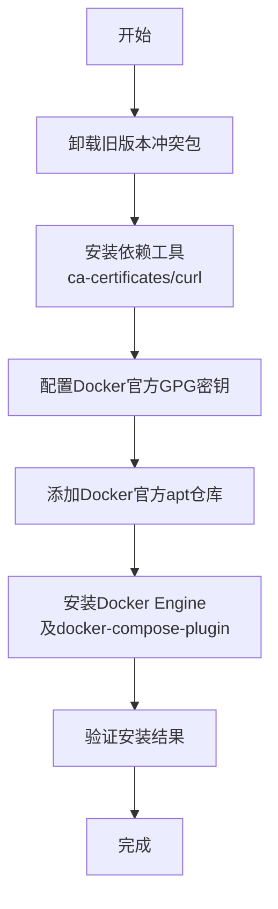

## 问题背景

在`Ubuntu`系统中，通过`apt`安装`docker.io`是最常见的操作之一。然而，`docker.io`是由`Ubuntu`社区维护的非官方版本，版本更新较慢且功能存在一定限制。其中最典型的问题就是执行`docker compose`命令时提示命令不存在：

```bash
$ docker compose
docker: 'compose' is not a docker command.
See 'docker --help'
```

出现上述问题的根本原因在于，`docker.io`社区版本缺少`docker-compose-plugin`插件。从`Docker Compose V2`开始，`docker compose`作为`Docker CLI`的子命令（`plugin`）提供，而非独立的二进制文件，因此必须安装官方版本的`Docker Engine`才能使用。

下表对比了两种安装来源的差异：

| 包名 | 来源 | `docker compose`支持 | 说明 |
| --- | --- | --- | --- |
| `docker.io` | Ubuntu社区 | 不支持 | 版本较旧，缺少plugin机制 |
| `docker-ce` | Docker官方 | 支持 | 需配置官方apt仓库 |

本文介绍如何通过`Docker`官方`apt`仓库在`Ubuntu`系统上安装完整的`Docker Engine`，使其支持`docker compose`命令。

## 系统要求

安装官方`Docker Engine`需满足以下系统版本要求：

| Ubuntu版本 | 支持架构 |
| --- | --- |
| Ubuntu 26.04 (Resolute LTS) | amd64、armhf、arm64、s390x |
| Ubuntu 25.10 (Questing) | amd64、armhf、arm64、s390x |
| Ubuntu 24.04 (Noble LTS) | amd64、armhf、arm64、s390x |
| Ubuntu 22.04 (Jammy LTS) | amd64、armhf、arm64、s390x |

> 注意：在`Linux Mint`等`Ubuntu`衍生发行版上安装不在官方支持范围内，可能无法正常运行。

## 安装流程概览

整个安装流程分为以下几个步骤：



## 卸载旧版本

在安装官方`Docker Engine`之前，需要先卸载可能与之冲突的旧包。这些包通常来自`Ubuntu`社区仓库，包括：`docker.io`、`docker-compose`、`docker-compose-v2`、`docker-doc`、`podman-docker`。

执行以下命令卸载所有冲突包：

```bash
sudo apt remove $(dpkg --get-selections docker.io docker-compose docker-compose-v2 docker-doc podman-docker containerd runc | cut -f1)
```

> 注意：`/var/lib/docker/`目录下存储的镜像、容器、卷和网络数据不会被自动删除。如需全新安装，可在完成卸载后手动清理该目录。

## 配置官方 apt 仓库

通过`Docker`官方`apt`仓库安装是推荐的安装方式，后续版本升级也更加便捷。

**第一步**：安装必要依赖工具并添加`Docker`官方`GPG`密钥：

```bash
# 更新apt并安装必要依赖
sudo apt update
sudo apt install ca-certificates curl

# 创建密钥存储目录并下载 GPG 密钥
sudo install -m 0755 -d /etc/apt/keyrings
sudo curl -fsSL https://download.docker.com/linux/ubuntu/gpg -o /etc/apt/keyrings/docker.asc
sudo chmod a+r /etc/apt/keyrings/docker.asc
```

**第二步**：添加`Docker`官方`apt`源：

```bash
sudo tee /etc/apt/sources.list.d/docker.sources <<EOF
Types: deb
URIs: https://download.docker.com/linux/ubuntu
Suites: $(. /etc/os-release && echo "${UBUNTU_CODENAME:-$VERSION_CODENAME}")
Components: stable
Architectures: $(dpkg --print-architecture)
Signed-By: /etc/apt/keyrings/docker.asc
EOF

sudo apt update
```

## 安装 Docker Engine

执行以下命令安装`Docker Engine`及相关插件，其中`docker-compose-plugin`是支持`docker compose`命令的关键组件：

```bash
sudo apt install docker-ce docker-ce-cli containerd.io docker-buildx-plugin docker-compose-plugin
```

各安装包的作用说明如下：

| 包名 | 说明 |
| --- | --- |
| `docker-ce` | Docker Engine社区版核心服务 |
| `docker-ce-cli` | Docker命令行工具 |
| `containerd.io` | 容器运行时（由Docker官方维护） |
| `docker-buildx-plugin` | 多平台镜像构建插件 |
| `docker-compose-plugin` | `docker compose`子命令插件 |

## 验证安装

### 验证服务状态

安装完成后，检查`Docker`服务是否正常运行：

```bash
sudo systemctl status docker
```

如果服务未启动，执行以下命令手动启动并设置开机自启：

```bash
sudo systemctl start docker
sudo systemctl enable docker
```

### 验证基本功能

运行`hello-world`镜像，验证`Docker Engine`安装是否成功：

```bash
sudo docker run hello-world
```

如果输出中包含`Hello from Docker!`字样，说明`Docker Engine`安装并运行正常。

### 验证 docker compose 命令

执行以下命令验证`docker compose`子命令是否可用：

```bash
docker compose version
```

预期输出类似如下内容：

```
Docker Compose version v2.x.x
```

至此，`docker compose`命令已可正常使用。

## 配置非 root 用户权限（可选）

默认情况下，运行`docker`命令需要`sudo`权限。如果希望普通用户也能直接运行`docker`命令，需要将该用户添加到`docker`用户组：

```bash
# 创建docker用户组（通常已存在，可跳过）
sudo groupadd docker

# 将当前用户加入docker用户组
sudo gpasswd -a $USER docker

# 使用户组变更立即生效（或重新登录）
newgrp docker
```

操作完成后，无需`sudo`即可执行`docker`和`docker compose`命令：

```bash
docker compose version
```

> 安全提示：将用户加入`docker`用户组相当于赋予该用户等同于`root`的主机访问权限（可通过挂载卷等方式访问宿主机文件系统），请谨慎操作，仅在受信任的开发环境中使用。

## 卸载 Docker Engine

如需完整卸载`Docker Engine`，按以下步骤操作：

**第一步**：卸载`Docker Engine`相关包：

```bash
sudo apt purge docker-ce docker-ce-cli containerd.io docker-buildx-plugin docker-compose-plugin docker-ce-rootless-extras
```

**第二步**：删除遗留的镜像、容器和卷数据：

```bash
sudo rm -rf /var/lib/docker
sudo rm -rf /var/lib/containerd
```

**第三步**：删除`apt`仓库配置文件和密钥：

```bash
sudo rm /etc/apt/sources.list.d/docker.sources
sudo rm /etc/apt/keyrings/docker.asc
```

> 注意：用户自定义的配置文件需要手动删除，上述命令不会自动处理。

## 总结

`Ubuntu`系统默认`apt`仓库中的`docker.io`是社区维护版本，缺少`docker-compose-plugin`，无法使用`docker compose`子命令。通过配置`Docker`官方`apt`仓库并安装`docker-compose-plugin`插件，可以彻底解决这一问题。官方版`Docker Engine`功能完整、版本更新及时，同时能获得官方的安全修复支持，推荐在所有环境中优先通过官方渠道安装。
