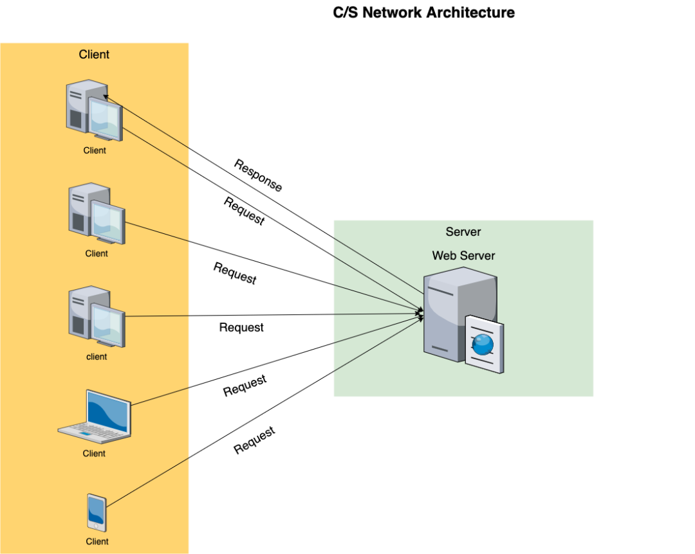
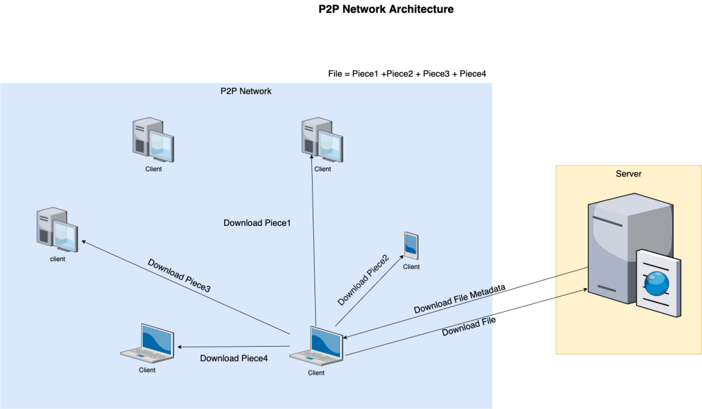
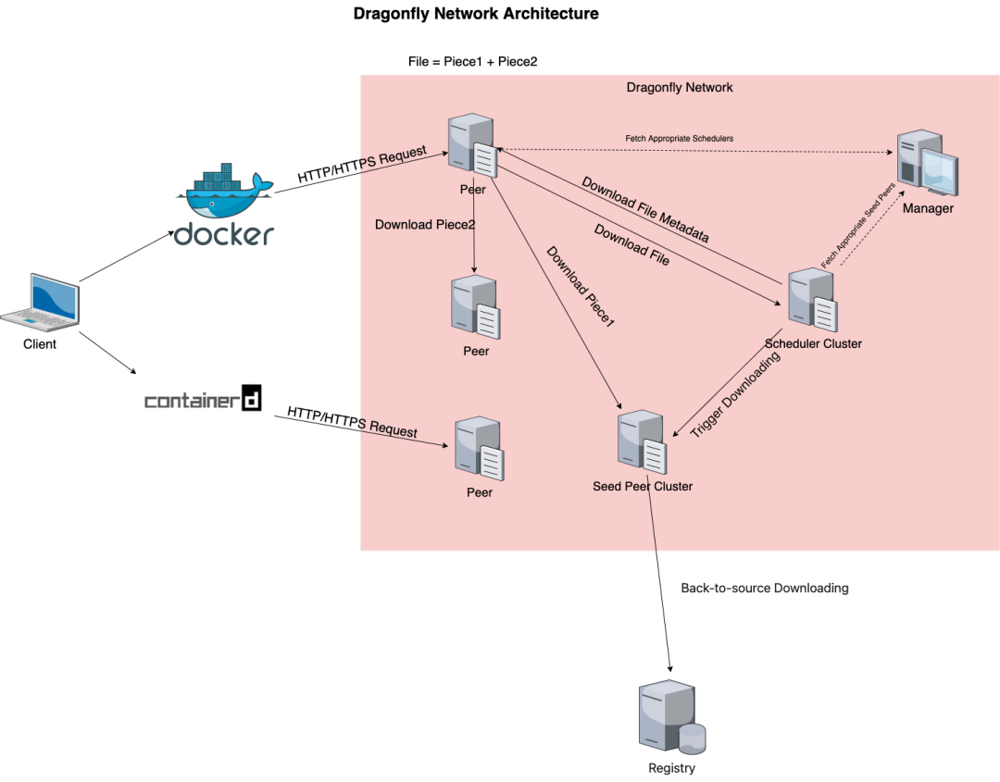
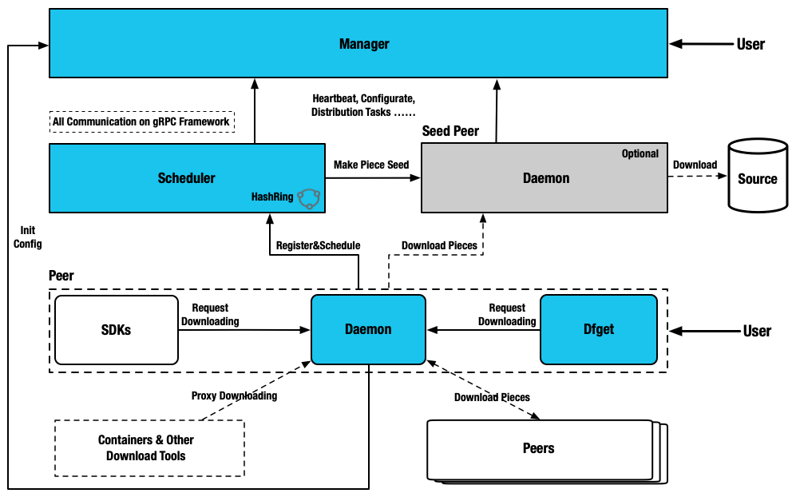
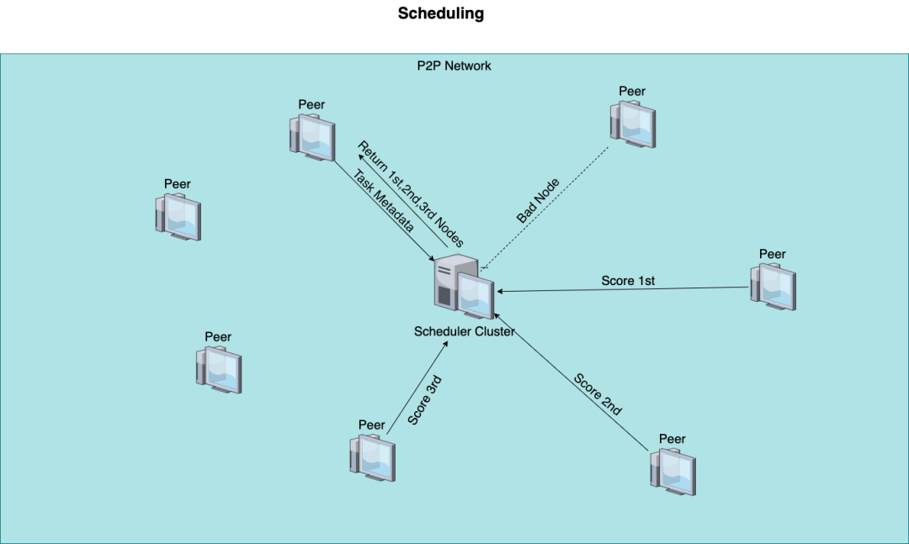
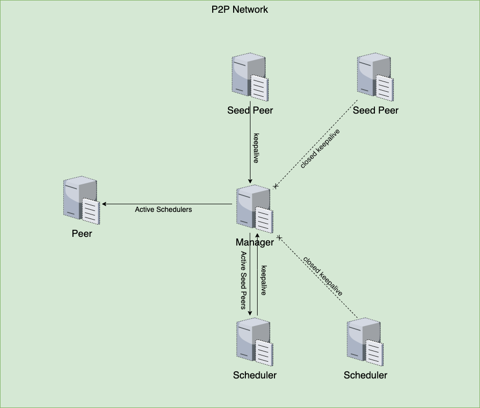

> 上世纪末期，基于`C/S`模式的思想，人们发展了`HTTP`、`FTP`等应用层协议。然而`C/S`模式的弊端很明显：服务器的负载过大，下载速率过慢。基于上述背景，有人结合`P2P`网络与负载均衡的思想，提出`P2P`下载模式。

**背景**
------

### **网络下载**

提起网络下载领域，你应该首先会想到基于`TCP/IP`协议簇的`C/S`模式。这种模式希望每一个客户机都与服务器建立`TCP`连接，服务器轮询监听`TCP`连接并依次响应，如下图：  

 
 
 上世纪末期，基于`C/S`模式的思想，人们发展了`HTTP`、`FTP`等应用层协议。然而`C/S`模式的弊端很明显：服务器的负载过大，下载速率过慢。随着互联网规模的增大以及客户对于下载数据大小，下载速率等需求的上升，这些弊端被不断放大。

### **P2P 下载原理**

基于上述背景，有人结合`P2P`网络与负载均衡的思想，提出`P2P`下载模式。这种模式不再把所有的下载压力丢给服务器，服务器只负责传递文件元数据，真正的文件下载连接建立在客户机与客户机之间。同时一个文件可以被分片为多个块，同一个文件中不同的块可以在不同的客户机之上下载，使得下载文件在`P2P`网络中动态流通，大幅提升了下载效率，如下图：  

 
 
 去中心化的`P2P`下载基于`DHT`技术，它采用分布式全网方式来进行信息的存储和检索。所有信息均以哈希表条目形式加以存储，这些条目被分散地存储在各个节点上，从而以全网方式构成一张巨大的分布式哈希表。在此基础上做到对单服务器的去中心化，哈希表负责对负载的分摊，将全网负载均摊到多个机器之上。

  

**`Dragonfly`简介及架构概述**

**`Dragonfly`是一款基于 P2P 的智能镜像和文件分发工具**。它旨在提高大规模文件传输的效率和速率，最大限度地利用网络带宽。在应用分发、缓存分发、日志分发和镜像分发等领域被大规模使用。

### **原理**

`Dragonfly`结合`C/S`架构与`P2P`架构的优点。它提供面向客户的`C/S`架构下载模式。同时它也提供面向服务器集群的`P2P`回源模式，与传统`P2P`不同的是，对等网络建立在`Scheduler`内部，目标是最大化`P2P`内部下载效率，如下图：  

### **架构简介**

`Dragonfly`面向镜像分发和文件分发，结合`P2P`网络和服务器集群的思想，向用户提供稳定的、高效的下载服务。`Dragonfly`希望在服务器内部构建`P2P`网络，将服务器的不同主机节点分为 **Manager、Scheduler、Seed Peer 以及 Peer** 四个角色，分别提供不同的功能。

  

其中`Manager`提供总体配置功能，拉取其他角色的配置并相互通信。`Scheduler`提供下载调度功能，其调度结果直接影响下载速率。`Seed Peer`负责回源下载，从外部网络中拉取所需的镜像或文件。`Peer`作为`C/S`架构中的服务器，通过多种协议向客户提供下载功能。架构图如下：

 
 
 其中，`Seed Peer`支持使用多种协议从外部网络中回源下载，同时也支持当作集群当中一个`Peer`使用。`Peer`提供基于多种协议的下载服务，也提供为镜像仓库或其他下载任务的代理服务。

**组件详解**

### **`Manager`**

`Manager`在多`P2P`集群部署的时候扮演管理者的角色，提供前端控制台方便用户进行可视化操作`P2P`集群。其主要提供动态配置管理、维护集群稳定性以及维护多套`P2P`集群的关联关系等功能。对于维护集群整体稳定性`Manager`和各个服务保持`Keepalive`保证能够在实例异常情况下将异常实例进行剔除。动态配置管理可以在`Manager`上面操作各个组件的控制单元，比如控制`Peer`和`Seed Peer`的负载数，`Scheduler`调度`Parent`的个数等。`Manager`也可以维护多套`P2P`集群关联关系，一个`Scheduler Cluster`、一个`Seed Peer Cluster`和若干个`Peer`组成一个完整的`P2P`集群，当然不同`P2P`集群可以是网络隔离的。正常情况下采用一个机房一套`P2P`集群，统一由一个`Manager`管理多个`P2P`集群。

### **`Scheduler`**

`Scheduler`主要工作就是为当前下载节点寻找最优父节点并触发`Seed Peer`进行回源下载。在适当时候让`Peer`进行回源下载。`Scheduler`在启动时，先向`Manager`注册，注册成功后初始化动态配置客户端，并从`Manager`拉取动态配置，接下来启动`Scheduler`自身所需的服务。  

`Scheduler`的核心就是选取一组最优`Parent`节点供当前下载`Peer`进行下载。`Scheduler`面向`Task`，一次`Task`就是一次完整的下载任务，在`Scheduler`中存储`Task`信息和相应`P2P`下载网络的`DAG`。调度过程是首先过滤异常`Parent`节点，根据多维度进行过滤，比如判断该`Peer`是否是`BadNode`，判断逻辑为假设每个节点的响应时长都遵循正态分布，若一个节点目前的响应时长处于 6σ 范围之外，那么认为该节点是`BadNode`，剔除该节点。再根据历史下载特征值对剩余待定`Parent`节点进行打分，返回一组分数最高的`Parent`提供给当前`Peer`进行下载。  

### **`Seed Peer`和`Peer`**

`Seed Peer`和`Peer`有很多相似之处。他们都是基于`Dfdaemon`，不同的是`Seed Peer`采用`Seed Peer`模式，支持主动触发回源下载。`Peer`采用`Peer`模式，作为`C/S`架构中的服务器向用户提供下载功能，支持被`Scheduler`被动触发回源下载。这表明`Peer`和`Seed Peer`的关系不是固定的，一个`Peer`可以通过回源使自己成为`Seed Peer`，`Seed Peer`也可以改动运行状态变为`Peer`，`Scheduler`会动态地对相应`DAG`进行改动。另外`Seed Peer`和`Peer`都需要参与调度下载过程当中，`Scheduler`可能会选取`Seed Peer`或者`Peer`作为父节点向其他`Peer`提供下载功能。

### **Dfstore 和 Dfcache**

`Dfcache`是`dragonfly`的缓存客户端，它与`dfdaemon`通信并对`P2P`网络中的文件进行操作，其中`P2P`网络充当缓存系统。可以在`Scheduler`中存储相应`Task`和`DAG`。  

`Dfstore`是`dragonfly`存储客户端. 其可以依赖不同类型的对象存储服务作为`Backend`，提供稳定的存储方案，现在支持`S3`和`OSS`。`Dfstore`依赖`Backend`对象存储服务结合`P2P`本身的加速特点。可做到快写快读，并且能够节省回源以及跨机房流量，减少源站压力。

**优势**

### **稳定性**

`Dragonfly`会自动隔离异常节点来提高下载稳定性，`Dragonfly`中各个组件通过`Keepalive`与`Manager`进行联系，`Manager`能够保证返回给`Peer`的`Scheduler`地址和返回给`Scheduler`的`Seed Peer`地址都是可用的。不可用的`Scheduler`和`Seed Peer`不会被`Manager`推给需要进行下载任务的`Peer`或`Scheduler`，从而达到隔离异常节点的目的，这也是实例维度的异常隔离，如下图：  

 
 
 另外`Dragonfly`在调度时以`Task`为单位，也确保了整个调度过程的稳定性。在收到一个新的`Task`调度请求之后，`Scheduler`触发`Seed Peer`进行回源下载；在收到一个已有`Task`的调度请求之后，`Scheduler`调度最优`Parent Peer`集合返回给`Peer`。这个逻辑确保了无论`Task`是否下载过，`Dragonfly`都可以对其进行处理。此外在`Scheduler`调度过程中，对响应时长过慢的`Peer`，认为目前是异常节点，将不会作为`Parent Peer`被返还。这也是`Task`维度的异常隔离。

### **高效性**

`Dragonfly`采用`P2P`进行服务端内部的回源，`P2P`下载本身即分摊负载，将每个服务端节点的负载降到最低，有以下几个细节保证了`Dragonfly`下载的高效性：

* `Scheduler`通过为每个可能的`Parent`打分，返回给`Peer`目前局部最优的`Parent`集合，`Peer`基于此集合做下载。  
    
*   下载过程基于`Task`，每个`Task`将待下载文件分为多个`Piece`，`Peer`拿到了最优的`Parent`之后，向此集合广播每个`Piece`的下载请求，集合中的`Parent`收到该请求后返回给`Peer`对应`Piece`的元信息，`Peer`将第一个收到的`Piece`元信息所对应的`Parent Peer`作为该`Piece`的实际下载源。该做法考虑到`Scheduler`返回可用`Parent`到触发下载这段时间内可能的变化，同时对不同的`Piece`，允许`Peer`向不同的下载源获取数据。
* `Dfdaemon`分为`Seed Peer`模式和`Peer`模式，允许`Seed Peer`和`Peer`进行切换，可以根据实际需求改变作为`Seed Peer`和`Peer`的机器数目，动态调整更适应实际情况。

### **简单易用**

`Dragonfly`提供`Helm Charts`、`Docker Compose`、`Docker Image`以及二进制的多种部署方式。用户可以**快速一键部署进行一次简单`POC`**，并且也可以**基于`Helm Charts`进行大规模生产部署**。当然`Dragonfly`各个服务都有完善的`Metrics`也提供现成的`Granafa`模版，方便用户观察`P2P`的流量走势。

  

`Dragonfly`作为`CNCF`在镜像加速领域标准解决方案，结合`Dragonfly`子项目`Nydus`进行按需加载可以**最大限度提升镜像下载速度**，未来我们也会继续努力建设镜像加速领域的生态链。感谢所有参与到社区建设的同学，希望有更多对镜像加速领域或`P2P`感兴趣的同学加入（文末扫描二维码或搜索钉钉群号：44701621进群交流）到我们的社区当中。

  
## 参考链接

- https://github.com/dragonflyoss/dragonfly
- https://zhuanlan.zhihu.com/p/630101983
- https://developer.aliyun.com/article/1008039?utm_content=m_1000357296
