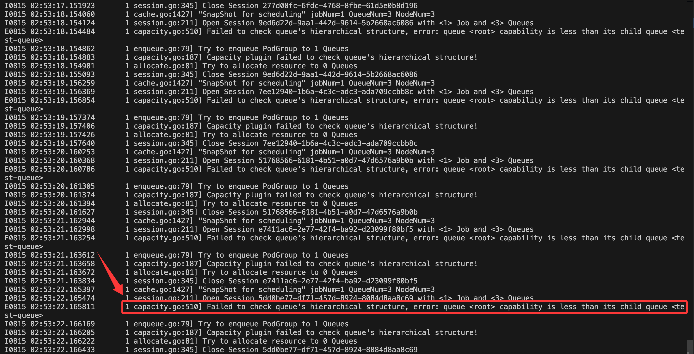
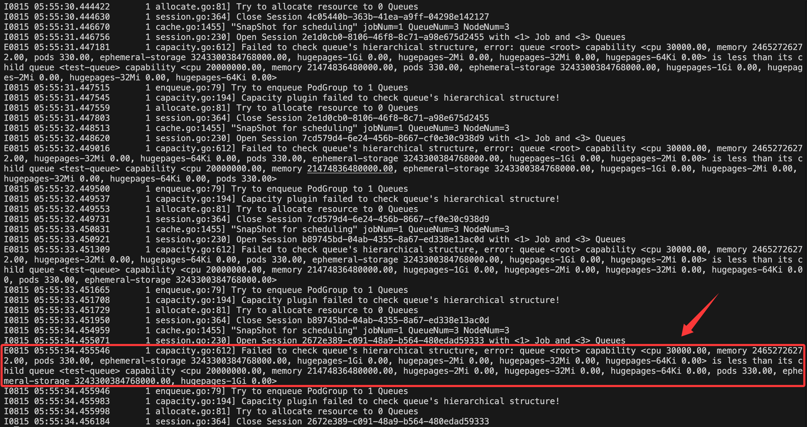

## 1. 背景

### 1.1 版本信息

| 关键组件 | 版本 |
| ---- | ---- |
| `kubernetes` | `1.27.5` |
| `volcano` | `1.12.1` |

### 1.2 问题描述


`Volcano Job`一致处于`Pending`状态，`Pod`没有创建出来。查看对应`PodGroup`的状态，也是处于`Pending`状态，且存在报错信息：
```yaml
status:
  conditions:
  - lastTransitionTime: "2025-07-30T07:56:43Z"
    message: '1/0 tasks in gang unschedulable: pod group is not ready, 1 minAvailable'
    reason: NotEnoughResources
    status: "True"
    transitionID: 6d79218e-2cd8-4728-a430-4d4e2bf0fb4a
    type: Unschedulable
  phase: Pending
```
看起来是资源不足（`NotEnoughResources`），但是不确定是哪种资源不足。但是，从查看节点的状态来看，节点资源是足够的，包括 CPU、内存、GPU卡数也是满足任务请求的资源要求。

通过查看`Volcano Scheduler Pod`的日志信息，发现存在报错信息，相关的报错信息类似于：
```text
E0815 02:53:22.165811 1 capacity.go:510] Failed to check queue's hierarchical structure, error; queue <rot> capability is less than its child queue <test-queue>
```

或者
```text
E0815 05:55:34.455546 1 capacity.go:612] Failed to check queue's hierarchical structure, error: queue <root> capability <cpu 30000.00, memory 24652726272.00, pods 330.00, ephemeral-storage 3243300384768000.00, hugepages-1Gi 0.00, hugepages-2Mi 0.00, hugepages-32Mi 0.00, hugepages-64Ki 0.00> is less than its child queue <test-queue> capability <cpu 20000000.00, memory 21474836480000.00, hugepages-2Mi 0.00, hugepages-32Mi 0.00, hugepages-64Ki 0.00, pods 330.00, ephemeral-storage 3243300384768000.00, hugepages-1Gi 0.00>
```


该问题在`1.8.2`的`volcano`版本中（目前笔者旧版本集群使用的`volcano`版本），将会导致调度器组件直接`panic crash`。而在新版本如`1.12.1`以后，调度器不会`panic crash`，但是调度器仍然不能系统性工作，并且会在日志中不断打印错误日志。


## 2. 问题排查


### 2.1 源码实现逻辑梳理

通过错误日志所指向的源码文件，去理解源码的实现逻辑，关键代码在这里：https://github.com/volcano-sh/volcano/blob/f7acc998d1b23f045b3e3f53cdccff1695bbff37/pkg/scheduler/plugins/capacity/capacity.go#L659

针对`capacity`插件的实现逻辑分析，发现在启用`capacity`插件后，当层级队列中配置的队列`capacity`、`deserved`或`guarantee`资源配额大于父队列的资源配额时，会导致`volcano`调度器系统性无法正常工作。由于是触发系统性的故障，因此即便其他队列的资源配额配置正确，调度器也无法为其他队列分配资源。

以下是针对该插件的一些关键逻辑：

1. `volcano`调度器对每次任务（`volcano job`）的创建、修改都会调用`capability`插件进行处理。
2. `capacity`插件会递归检查所有队列下的子级队列的`capability`、`deserved`和`guarantee`资源配额是否大于父队列的资源配额（任一资源）。如果发现有队列的资源配额大于父队列的资源配额，则会返回错误信息，并停止调度。
3. `volcano`资源队列默认的`root`队列资源配额是集群的所有资源的总和（`nodes allocatable`）：https://github.com/volcano-sh/volcano/blob/f7acc998d1b23f045b3e3f53cdccff1695bbff37/pkg/scheduler/plugins/capacity/capacity.go#L503

### 2.2 为何子级队列配额会大于父级队列配额？

大致可分为以下几种情况：

1. **队列配额设置不合理**：子级配额资源配额的总量大于父级队列配额资源。在资源队列创建时，`volcano`没有对子级队列的资源配额做严格的、同步的资源检查，导致异常的子级队列被创建到了集群中。
2. **集群节点异常导致队列可用资源变少**：由于`volcano`的`root`队列默认是使用的集群的总资源大小（`nodes allocatable`，每次`session open`时重新计算），当集群的节点异常、节点被移除时，实际上`root`队列的可用资源会变少，导致子级队列的可用资源配额可能会大于父级队列的可用资源配额：https://github.com/volcano-sh/volcano/blob/36e949025f1abff74f2f18b080c6f91bde84db0a/pkg/scheduler/framework/session.go#L206


## 3. 解决方案

同样的，这种使用开源组件的问题，通常不是我们第一个遇到，应该也会有其他的使用者遇到类似问题。因此检索了`volcano`社区的`issue`和`pr`，果然发现一个`pr`解决的问题和我们遇到的问题很类似：https://github.com/volcano-sh/volcano/pull/4354

这个`pr`提供的解决方案是这样的：

1. 首先再了解下背景，`volcano`默认会创建一个`root`的队列，该队列的资源配额（`capability`）是集群的总资源大小（`nodes allocatable`），且不可修改（即便修改了，保存后依然会被`volcano`调度器设置为集群节点的资源总和）。
2. 该`pr`是允许使用者自定义`root`队列的配额（`capability`）大小，当自定义后，`volcano`调度器将不会自动覆盖该`root`队列的配额值。
3. 使用者可以将`root`队列的配额设置成一个很大的值，这样就不会触发`capacity`插件的资源配额检查异常了。

其他一些额外的注意事项：

1. 在创建资源队列时，需要做严格的子父级资源配额检查，确保子级队列的资源配额不会大于父级队列的资源配额。在产品功能上，尽可能通过接口或者程序的方式来实现队列创建，而不是直接通过`yaml`文件来创建。

## 4. 测试内容

以下是用于测试该问题的部署内容，主要使用CPU和内存进行测试。

### 4.1 调度器配置

需要在`volcano`调度器的配置文件中，增加`capacity`插件，并配置使用`hierarchy`功能：
```yaml
- name: capacity
  enableHierarchy: true
```

完整配置如下：

```yaml title="volcano-scheduler-configmap.yaml"
apiVersion: v1
data:
  volcano-scheduler.conf: |
    actions: "enqueue, allocate, backfill"
    tiers:
    - plugins:
      - name: priority
      - name: gang
        enablePreemptable: false
      - name: conformance
    - plugins:
      - name: capacity
        enableHierarchy: true
      - name: overcommit
      - name: drf
        enablePreemptable: false
      - name: predicates
      - name: proportion
      - name: nodeorder
      - name: binpack
kind: ConfigMap
metadata:
  name: volcano-scheduler-configmap
  namespace: volcano-system
```

**注意事项**：

1. 在`volcano`默认的调度器配置，`overcommit`插件是默认启用的，该插件允许集群的资源能够超额分配，默认超额比例（`overcommitRatio`）是`1.2`，例如`10`核CPU资源的集群，那么`overcommit`插件会允许调度器调度`12`核CPU的任务。

2. `overcommit`插件还有一个隐藏功能，当队列的`capability`资源不够调度时，`overcommit`插件会阻止任务创建对应的`Pod`，以减少Pending的`Pod`数量。否则，即便队列资源不够，也会创建`Pod`，导致`Pending`的`Pod`数量不断增加。

### 4.2 队列配置

修改`root`队列的配置，配置如下：
```yaml title="root.yaml"
apiVersion: scheduling.volcano.sh/v1beta1
kind: Queue
metadata:
  name: root
spec:
  capability:
    cpu: 10000000
    memory: 10000000Gi
```
该`root`队列的资源配额是是远超于集群的总资源大小，这样保证了`capacity`插件不会因为资源配额检查失败而停止调度。

创建一个`test-queue`队列，配置如下：
```yaml title="test-queue.yaml"
apiVersion: scheduling.volcano.sh/v1beta1
kind: Queue
metadata:
  name: test-queue
spec:
  capability:
    cpu: 200
    memory: 200Gi
  guarantee:
    resource:
      cpu: 200
      memory: 200Gi
```


### 4.3 Job 配置

创建一个`test-job`，配置如下：
```yaml title="test-job.yaml"
apiVersion: batch.volcano.sh/v1alpha1
kind: Job
metadata:
  name: test-job
spec:
  minAvailable: 2
  schedulerName: volcano
  queue: test-queue
  policies:
  - action: CompleteJob
    event: TaskCompleted
  tasks:
  - replicas: 1
    name: master
    template:
      spec:
        restartPolicy: Never
        containers:
        - image: alpine:latest
          imagePullPolicy: IfNotPresent
          name: master
          command: ["sh", "-c", "echo master"]
          resources:
            requests:
              cpu: 100m
              memory: 100Mi
  - replicas: 1
    name: worker
    template:
      spec:
        restartPolicy: Never
        containers:
        - image: alpine:latest
          imagePullPolicy: IfNotPresent
          name: worker
          command: ["sh", "-c", "echo worker"]
          resources:
            requests:
              cpu: 100m
              memory: 100Mi
```

## 参考资料

- https://github.com/volcano-sh/volcano/pull/4354
