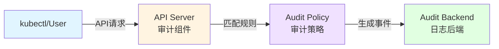

## 背景与用途

### 什么是Kubernetes审计日志

`Kubernetes`审计日志（`Audit Log`）是一种安全机制，用于记录集群中所有对`API Server`的请求操作。每个请求都会生成一个审计事件，包含请求的详细信息，如操作者、操作时间、操作对象、操作结果等。

### 为什么需要审计日志

在生产环境中，我们经常会遇到以下问题：

- **资源被莫名删除**：`Deployment`、`Service`等资源突然消失，不知道是谁删除的
- **配置被意外修改**：关键配置被修改导致服务异常，需要追溯修改记录
- **安全合规要求**：企业安全审计要求记录所有操作日志
- **故障排查需要**：需要回溯某个时间点的操作历史

审计日志可以帮助我们：

- 追踪所有API操作的完整记录
- 识别异常或恶意操作
- 满足安全合规要求
- 辅助故障排查和问题定位
- 分析集群使用情况和性能瓶颈

### 审计日志的工作原理

当用户或系统组件通过`kubectl`、API调用或控制器对`Kubernetes API Server`发起请求时，`API Server`会根据配置的审计策略生成审计事件，并将这些事件发送到配置的后端存储。



## 如何开启审计日志

### 创建审计策略文件

首先需要创建一个审计策略文件，定义哪些事件需要被记录以及记录的详细程度。

创建文件 `/etc/kubernetes/audit-policy.yaml`：

```yaml
apiVersion: audit.k8s.io/v1
kind: Policy
# 不记录请求体
omitStages:
  - "RequestReceived"
rules:
  # 记录所有删除操作的详细信息
  - level: RequestResponse
    verbs: ["delete", "deletecollection"]
    resources:
      - group: ""
        resources: ["pods", "services", "configmaps", "secrets"]
      - group: "apps"
        resources: ["deployments", "statefulsets", "daemonsets"]
      - group: "batch"
        resources: ["jobs", "cronjobs"]
  
  # 记录所有创建、更新、打补丁操作的元数据
  - level: Metadata
    verbs: ["create", "update", "patch"]
    resources:
      - group: ""
        resources: ["pods", "services", "configmaps", "secrets"]
      - group: "apps"
        resources: ["deployments", "statefulsets", "daemonsets"]
      - group: "batch"
        resources: ["jobs", "cronjobs"]
  
  # 记录所有认证失败的请求
  - level: Metadata
    omitStages:
      - "RequestReceived"
    users: ["system:anonymous"]
  
  # 不记录只读操作（get, list, watch）
  - level: None
    verbs: ["get", "list", "watch"]
  
  # 不记录系统组件的心跳请求
  - level: None
    users:
      - "system:kube-proxy"
      - "system:kube-scheduler"
      - "system:kube-controller-manager"
    verbs: ["get", "update"]
    namespaces: ["kube-system"]
    resources:
      - group: ""
        resources: ["endpoints", "services"]
  
  # 不记录某些系统资源的操作
  - level: None
    resources:
      - group: ""
        resources: ["events"]
  
  # 默认记录其他所有请求的元数据
  - level: Metadata
    omitStages:
      - "RequestReceived"
```

#### 审计级别说明

- **None**：不记录该事件
- **Metadata**：记录请求的元数据（用户、时间戳、资源、操作等），但不记录请求体和响应体
- **Request**：记录元数据和请求体，但不记录响应体
- **RequestResponse**：记录元数据、请求体和响应体（最详细，但会产生大量日志）

### 配置kube-apiserver

需要修改`kube-apiserver`的启动参数来启用审计日志。


```bash
# 审计相关参数
--audit-policy-file=/etc/kubernetes/audit-policy.yaml
--audit-log-path=/var/log/kubernetes/audit.log
--audit-log-maxage=30
--audit-log-maxbackup=10
--audit-log-maxsize=100
```

参数说明：

- `--audit-policy-file`：审计策略文件本地路径
- `--audit-log-path`：审计日志文件本地路径
- `--audit-log-maxage`：日志文件保留天数
- `--audit-log-maxbackup`：保留的日志文件数量
- `--audit-log-maxsize`：单个日志文件最大大小（`MB`）


### 验证审计日志是否开启

检查`kube-apiserver`是否正常运行：

```bash
# 查看kube-apiserver Pod状态
kubectl get pod -n kube-system | grep kube-apiserver

# 查看kube-apiserver日志
kubectl logs -n kube-system kube-apiserver-<node-name>
```

执行一个测试操作：

```bash
# 创建一个测试Pod
kubectl run test-pod --image=nginx

# 删除测试Pod
kubectl delete pod test-pod
```

## 到哪里查看审计日志

### 日志文件位置

如果使用文件后端，审计日志默认存储在配置的路径中（如 `/var/log/kubernetes/audit.log`）。

:::tip
审计日志文件存储在运行`kube-apiserver`的**宿主机**节点上，需要登录到该节点查看。如果是高可用集群，每个`kube-apiserver`节点都有各自的审计日志文件。
:::

#### 在kube-apiserver节点上查看

```bash
# 查看最新的审计日志
tail -f /var/log/kubernetes/audit.log

# 查看最近100条日志
tail -n 100 /var/log/kubernetes/audit.log

# 搜索特定资源的删除操作
grep '"verb":"delete"' /var/log/kubernetes/audit.log | grep '"resource":"deployments"'

# 搜索特定用户的操作
grep '"username":"admin"' /var/log/kubernetes/audit.log
```

### 使用jq工具格式化查看

审计日志是`JSON`格式，可以使用`jq`工具进行格式化和过滤：

```bash
# 格式化查看最新的审计事件
tail -n 1 /var/log/kubernetes/audit.log | jq .

# 查看所有删除操作
cat /var/log/kubernetes/audit.log | jq 'select(.verb=="delete")'

# 查看特定命名空间的操作
cat /var/log/kubernetes/audit.log | jq 'select(.objectRef.namespace=="default")'

# 查看特定时间范围的操作
cat /var/log/kubernetes/audit.log | jq 'select(.requestReceivedTimestamp >= "2024-11-10T00:00:00Z")'

# 统计各类操作的数量
cat /var/log/kubernetes/audit.log | jq -r '.verb' | sort | uniq -c | sort -rn
```


## 审计日志的内容格式

### 审计事件结构

每个审计事件都是一个`JSON`对象，包含以下主要字段：

```json
{
  "kind": "Event",
  "apiVersion": "audit.k8s.io/v1",
  "level": "Metadata",
  "auditID": "a1b2c3d4-e5f6-7890-abcd-ef1234567890",
  "stage": "ResponseComplete",
  "requestURI": "/api/v1/namespaces/default/pods/test-pod",
  "verb": "delete",
  "user": {
    "username": "kubernetes-admin",
    "uid": "aws-iam-authenticator:123456789012:AIDAI...",
    "groups": [
      "system:masters",
      "system:authenticated"
    ]
  },
  "sourceIPs": [
    "192.168.1.100"
  ],
  "userAgent": "kubectl/v1.28.0 (linux/amd64) kubernetes/1234567",
  "objectRef": {
    "resource": "pods",
    "namespace": "default",
    "name": "test-pod",
    "apiVersion": "v1"
  },
  "responseStatus": {
    "metadata": {},
    "code": 200
  },
  "requestReceivedTimestamp": "2024-11-10T08:30:15.123456Z",
  "stageTimestamp": "2024-11-10T08:30:15.234567Z",
  "annotations": {
    "authorization.k8s.io/decision": "allow",
    "authorization.k8s.io/reason": "RBAC: allowed by ClusterRoleBinding \"cluster-admin\" of ClusterRole \"cluster-admin\" to Group \"system:masters\""
  }
}
```

### 关键字段说明

| 字段 | 说明 | 示例值 |
|------|------|--------|
| `level` | 审计级别 | `Metadata`, `Request`, `RequestResponse` |
| `auditID` | 审计事件唯一标识 | `a1b2c3d4-e5f6-7890-abcd-ef1234567890` |
| `stage` | 请求处理阶段 | `RequestReceived`, `ResponseStarted`, `ResponseComplete`, `Panic` |
| `requestURI` | 请求的`URI` | `/api/v1/namespaces/default/pods/test-pod` |
| `verb` | 操作动词 | `get`, `list`, `create`, `update`, `patch`, `delete` |
| `user.username` | 操作用户 | `kubernetes-admin`, `system:serviceaccount:default:my-sa` |
| `user.groups` | 用户所属组 | `["system:masters", "system:authenticated"]` |
| `sourceIPs` | 请求来源IP | `["192.168.1.100"]` |
| `userAgent` | 客户端标识 | `kubectl/v1.28.0 (linux/amd64)` |
| `objectRef.resource` | 操作的资源类型 | `pods`, `deployments`, `services` |
| `objectRef.namespace` | 资源所在命名空间 | `default`, `kube-system` |
| `objectRef.name` | 资源名称 | `test-pod`, `nginx-deployment` |
| `responseStatus.code` | HTTP响应码 | `200`, `201`, `404`, `403` |
| `requestReceivedTimestamp` | 请求接收时间 | `2024-11-10T08:30:15.123456Z` |
| `stageTimestamp` | 当前阶段时间 | `2024-11-10T08:30:15.234567Z` |

### 常见操作动词

| 动词 | 说明 | 示例场景 |
|------|------|----------|
| `get` | 获取单个资源 | `kubectl get pod my-pod` |
| `list` | 列出资源列表 | `kubectl get pods` |
| `watch` | 监听资源变化 | `kubectl get pods --watch` |
| `create` | 创建资源 | `kubectl create -f deployment.yaml` |
| `update` | 更新资源（完整替换） | `kubectl replace -f deployment.yaml` |
| `patch` | 部分更新资源 | `kubectl patch deployment nginx -p '{"spec":{"replicas":3}}'` |
| `delete` | 删除资源 | `kubectl delete pod my-pod` |
| `deletecollection` | 批量删除资源 | `kubectl delete pods --all` |

### 请求处理阶段

| 阶段 | 说明 |
|------|------|
| `RequestReceived` | `API Server`接收到请求 |
| `ResponseStarted` | 开始发送响应头（仅用于长时间运行的请求，如`watch`） |
| `ResponseComplete` | 响应体发送完成 |
| `Panic` | 请求处理过程中发生`panic` |

### 实际案例分析

#### 案例1：Deployment被删除

```json
{
  "kind": "Event",
  "apiVersion": "audit.k8s.io/v1",
  "level": "RequestResponse",
  "auditID": "abc123-def456-ghi789",
  "stage": "ResponseComplete",
  "requestURI": "/apis/apps/v1/namespaces/production/deployments/web-app",
  "verb": "delete",
  "user": {
    "username": "john.doe@example.com",
    "groups": ["developers", "system:authenticated"]
  },
  "sourceIPs": ["10.0.1.50"],
  "userAgent": "kubectl/v1.28.0 (darwin/amd64)",
  "objectRef": {
    "resource": "deployments",
    "namespace": "production",
    "name": "web-app",
    "apiGroup": "apps",
    "apiVersion": "v1"
  },
  "responseStatus": {
    "code": 200
  },
  "requestReceivedTimestamp": "2024-11-10T08:30:15.123456Z",
  "stageTimestamp": "2024-11-10T08:30:15.234567Z"
}
```

**分析结果**：
- 用户 `john.doe@example.com` 在 `2024-11-10 08:30:15` 从IP `10.0.1.50` 使用 `kubectl` 删除了 `production` 命名空间下的 `web-app` `Deployment`
- 操作成功（响应码`200`）

#### 案例2：未授权的删除尝试

```json
{
  "kind": "Event",
  "apiVersion": "audit.k8s.io/v1",
  "level": "Metadata",
  "auditID": "xyz789-abc123-def456",
  "stage": "ResponseComplete",
  "requestURI": "/api/v1/namespaces/kube-system/secrets/important-secret",
  "verb": "delete",
  "user": {
    "username": "system:serviceaccount:default:test-sa",
    "groups": ["system:serviceaccounts", "system:authenticated"]
  },
  "sourceIPs": ["10.0.2.100"],
  "objectRef": {
    "resource": "secrets",
    "namespace": "kube-system",
    "name": "important-secret",
    "apiVersion": "v1"
  },
  "responseStatus": {
    "code": 403,
    "message": "secrets \"important-secret\" is forbidden: User \"system:serviceaccount:default:test-sa\" cannot delete resource \"secrets\" in API group \"\" in the namespace \"kube-system\""
  },
  "requestReceivedTimestamp": "2024-11-10T09:15:30.123456Z",
  "stageTimestamp": "2024-11-10T09:15:30.145678Z"
}
```

**分析结果**：
- `ServiceAccount` `test-sa` 尝试删除 `kube-system` 命名空间下的 `Secret`
- 操作被拒绝（响应码`403`），因为该 `ServiceAccount` 没有删除权限
- 这可能是一次安全事件，需要进一步调查

## 常见问题排查

### 审计日志未生成

**检查清单**：

1. 确认`kube-apiserver`配置正确：
```bash
kubectl get pod -n kube-system kube-apiserver-<node> -o yaml | grep audit
```

2. 检查审计策略文件是否存在且格式正确：
```bash
cat /etc/kubernetes/audit-policy.yaml
```

3. 查看 `kube-apiserver` 日志：
```bash
kubectl logs -n kube-system kube-apiserver-<node> | grep -i audit
```

4. 确认日志目录权限：
```bash
ls -ld /var/log/kubernetes
```

### 日志文件过大

如果日志增长过快：

1. 调整审计策略，减少记录的事件
2. 降低审计级别（从`RequestResponse`改为`Metadata`）
3. 增加日志轮转频率
4. 过滤更多的系统噪音

### API Server性能下降

如果开启审计后 `API Server` 性能下降：

1. 检查是否使用了`RequestResponse`级别记录大量操作
2. 考虑使用`webhook`后端异步处理
3. 优化审计策略，减少不必要的记录
4. 增加 `API Server` 资源配额


## 参考资料

- https://kubernetes.io/zh-cn/docs/tasks/debug/debug-cluster/audit/
