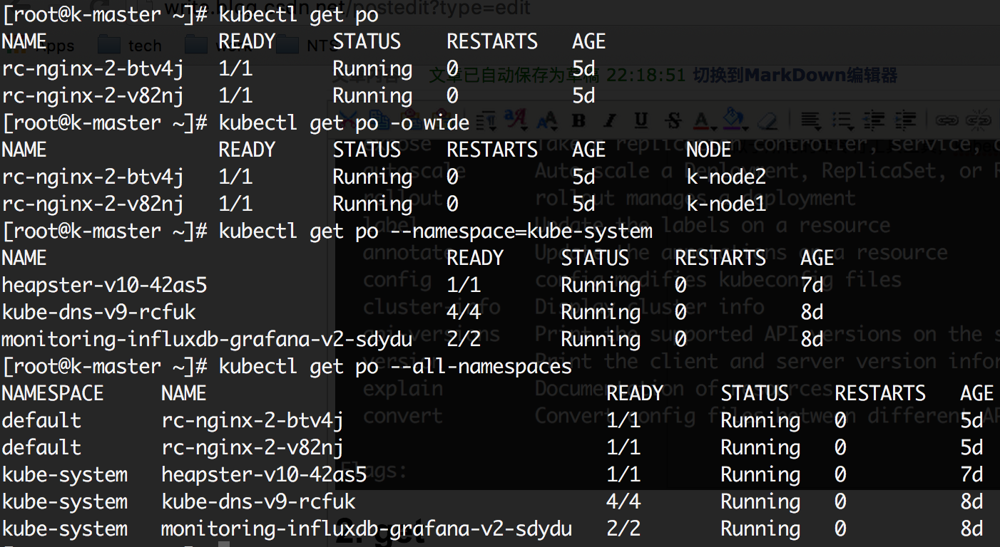
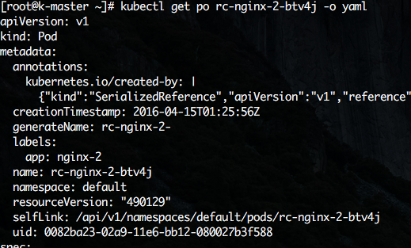
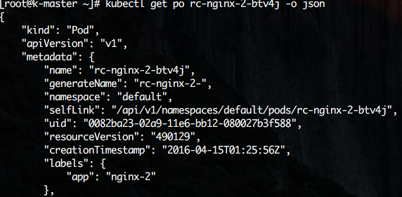

`kubernetes`通过`kube-apiserver`作为整个集群管理的入口。`apiserver`是整个集群的主管理节点，用户通过`apiserver`配置和组织集群，同时集群中各个节点同`etcd`存储的交互也是通过`apiserver`进行交互。`apiserver`实现了一套`RESTfull`的接口，用户可以直接使用`API`同`apiserver`交互。另外官方还提供了一个客户端`kubectl`随工具集打包，用于可直接通过`kubectl`以命令行的方式同集群交互。

:::tip
本文只介绍平时工作中常用到的`kubectl`命令，更详细的命令介绍可以参考官方文档：[http://docs.kubernetes.org.cn/683.html](http://docs.kubernetes.org.cn/683.html)
:::

## help

`kubectl`的命令行参数比较多，若有什么不清楚地，都可以通过帮助提示来了解。如下图所示，`kubectl`使用方式为：

```bash
kubectl[flags]
kubectl[commond]
```

另外所有的命令选项都可以通过执行 `--help ` 获得**特定命令**的帮助信息。 


## get

`get`命令用于获取集群的一个或一些`resource`信息。使用`--help`查看详细信息。`kubectl`的帮助信息、示例相当详细，而且简单易懂。建议大家习惯使用帮助信息。`kubectl`可以列出集群所有`resource`的详细。`resource`包括集群节点、运行的`pod、deployment、service`等。

```bash
kubectl get [(-o|--output=)json|yaml|wide|go-template=...|go-template-file=...|jsonpath=...|jsonpath-file=...] (TYPE [NAME | -l label] | TYPE/NAME ...) [flags] [flags]
```

**获取`pod`信息：**

可以直接使用 `kubectl get po` 获取当前运行的所有`pods`的信息，或使用 `kubectl get po -o wide` 获取`pod`运行在哪个节点上的信息。注意：集群中可以创建多个`namespace`，未显示的指定`namespace`的情况下，所有操作都是针对`default namespace`。如下图所示列出了`default` 和`kube-system`的`pods`：



**获取`namespace`信息：**

```bash
kubectl get namespace
```

**获取其他`resource`：**

类似可以使用`kubectl get rc、kubectl get svc、kubectl get nodes`等获取其他`resource`信息。

**获取一些更具体的信息：**

可以通过使用选项`-o`。如：  
1）`kubectl get po -o yaml`以`yaml`格式输出`pod`的详细信息。



2）`kubectl get po -o json`以`json`格式输出`pod`的详细信息。



3）另外还可以使用 `-o=custom-columns=` 定义直接获取指定内容的值。如前面使用`json`和`yaml`格式的输出中，`metadata.labels.app`的值可以使用如下命令获取。 

```bash
kubectl get po rc-nginx-2-btv4j -o=custom-columns=LABELS:.metadata.labels.app
```

其中`LABELS`为显示的列标题，`.metadata.labels.app`为查询的域名

4）其他资源也可以使用类似的方式。

## describe

`describe`类似于`get`，同样用于获取`resource`的相关信息。不同的是，`get`获得的是更详细的`resource`个性的详细信息，`describe`获得的是`resource`集群相关的信息。`describe`命令同`get`类似，但是`describe`不支持`-o`选项，对于同一类型`resource`，`describe`输出的信息格式，内容域相同。 注意：如果发现是查询某个`resource`的信息，使用`get`命令能够获取更加详尽的信息。但是如果想要查询某个`resource`的状态，如某个`pod`并不是在`running`状态，这时需要获取更详尽的状态信息时，就应该使用`describe`命令。 

```bash
kubectl describe po rc-nginx-2-btv4j
```

## create

`kubectl`命令用于根据文件或输入创建集群`resource`。如果已经定义了相应`resource`的`yaml`或`json`文件，直接 `kubectl create -f filename ` 即可创建文件内定义的`resource`。也可以直接只用子命令 `[namespace/secret/configmap/serviceaccount]` 等直接创建相应的`resource`。从追踪和维护的角度出发，建议使用`json`或`yaml`的方式定义资源。   
如，前面`get`中获取的两个`nginx pod`的`replication controller`文件内容如下。文件名为：`rc-nginx.yaml`

```yaml
apiVersion: v1
kind: ReplicationController
metadata:
  name: rc-nginx-2
spec:
  replicas: 2
  template:
    metadata:
      labels:
        app: nginx-2
    spec:
      containers:
      - name: nginx-2
        image: xingwangc.docker.rg/nginx
        ports:
        - containerPort: 80
```

直接使用`create`则可以基于`rc-nginx.yaml`文件创建出`ReplicationController(rc)`，`rc`会创建两个副本：

```bash
kubectl create -f rc-nginx.yaml
```

创建后，使用 `kubectl get rc` 可以看到一个名为`rc-nginx-2`的`ReplicationController`将被创建，同时 `kubectl get po` 的结果中会多出两个前缀为 `rc-nginx-2-` 的`pod`。

## replace

`replace`命令用于对已有资源进行更新、替换。如前面`create`中创建的`nginx`，当我们需要更新`resource`的一些属性的时候，如果修改副本数量，增加、修改`label`，更改`image`版本，修改端口等。都可以直接修改原`yaml`文件，然后执行`replace`命令。

**注意：名字不能被更更新**。另外，如果是更新`label`，原有标签的`pod`将会与更新`label`后的`rc`断开联系，有新`label`的`rc`将会创建指定副本数的新的`pod`，但是默认并不会删除原来的`pod`。所以此时如果使用`get po`将会发现`pod`数翻倍，进一步`check`会发现原来的`pod`已经不会被新`rc`控制，此处只介绍命令不详谈此问题，好奇者可自行实验。

```bash
kubectl replace -f rc-nginx.yaml 
```

## patch

如果一个容器已经在运行，这时需要对一些容器属性进行修改，又不想删除容器，或不方便通过`replace`的方式进行更新。`kubernetes`还提供了一种在容器运行时，直接对容器进行修改的方式，就是`patch`命令。如前面创建`pod`的`label`是`app=nginx-2`，如果在运行过程中，需要把其`label`改为`app=nginx-3`，这`patch`命令如下：

```bash
kubectl patch pod rc-nginx-2-kpiqt -p '{"metadata":{"labels":{"app":"nginx-3"}}}' 
```

此外，`patch`命令还可以用于对`deployment`进行平滑重启，比如通过`patch`修改`deployment`中一些无关紧要的属性，那么`deployment`对应的`pods`会执行平滑重启：

```bash
kubectl patch deployment your-deployment -p "{\"spec\":{\"template\":{\"metadata\":{\"labels\":{\"date\":\"$(date +%s)\"}}}}}"
```

## edit

`edit`提供了另一种更新`resource`源的操作，通过`edit`能够灵活的在一个`common`的`resource`基础上，发展出更过的`significant resource`。例如，使用`edit`直接更新前面创建的`pod`的命令为：

```bash
kubectl edit po rc-nginx-btv4j 
```

上面命令的效果等效于：

```bash
kubectl get po rc-nginx-btv4j -o yaml >> /tmp/nginx-tmp.yaml 
vim /tmp/nginx-tmp.yaml 
/*do some changes here */ 
kubectl replace -f /tmp/nginx-tmp.yaml 
```

## delete

根据`resource`名或`label`删除`resource`。

```bash
kubectl delete -f rc-nginx.yaml 
kubectl delete po rc-nginx-btv4j 
kubectl delete po -lapp=nginx-2
```

## apply

`apply`命令提供了比`patch`，`edit`等更严格的更新`resource`的方式。通过`apply`，用户可以将`resource`的`configuration`使用`source control`的方式维护在版本库中。每次有更新时，将配置文件`push`到`server`，然后使用`kubectl apply`将更新应用到`resource`。`kubernetes`会在引用更新前将当前配置文件中的配置同已经应用的配置做比较，并只更新更改的部分，而不会主动更改任何用户未指定的部分。 

`apply`命令的使用方式同`replace`相同，不同的是，`apply`不会删除原有`resource`，然后创建新的。`apply`直接在原有`resource`的基础上进行更新。同时`kubectl apply`还会`resource`中添加一条注释，标记当前的`apply`。类似于`git`操作。

## logs

`logs`命令用于显示`pod`运行中，容器内程序输出到标准输出的内容。跟`docker`的`logs`命令类似。如果要获得`tail -f`的方式，也可以使用`-f`选项。

```bash
kubectl logs rc-nginx-2-kpiqt 
```

## exec

`exec`命令同样类似于`docker`的`exec`命令，为在一个已经运行的容器中执行一条`shell`命令，如果一个`pod`容器中，有多个容器，需要使用`-c`选项指定容器。

## rolling-update

`rolling-update`是一个非常重要的命令，对于已经部署并且正在运行的业务，`rolling-update`提供了不中断业务的更新方式。`rolling-update`每次起一个新的`pod`，等新`pod`完全起来后删除一个旧的`pod`，然后再起一个新的`pod`替换旧的`pod`，直到替换掉所有的`pod`。`rolling-update`需要确保新的版本有不同的`name`、`version`和`label`，否则会报错。

```bash
kubectl rolling-update rc-nginx-2 -f rc-nginx.yaml 
```

如果在升级过程中，发现有问题还可以中途停止`update`，并回滚到前面版本。

```bash
kubectl rolling-update rc-nginx-2 --rollback 
```

`rolling-update`还有很多其他选项提供丰富的功能，如`--update-period`指定间隔周期，使用时可以使用`-h`查看`help`信息。

## scale

`scale`用于程序在负载加重或缩小时副本进行扩容或缩小，如前面创建的`nginx`有两个副本，可以轻松的使用`scale`命令对副本数进行扩展或缩小。

例如，扩展副本数到`4`：

```bash
kubectl scale rc rc-nginx-3 --replicas=4 
```

重新缩减副本数到`2`：

```bash
kubectl scale rc rc-nginx-3 --replicas=2 
```

## autoscale

`scale`虽然能够很方便的对副本数进行扩展或缩小，但是仍然需要人工介入，不能实时自动的根据系统负载对副本数进行扩/缩。`autoscale`命令提供了自动根据`pod`负载对其副本进行扩缩的功能。`autoscale`命令会给一个`rc`指定一个副本数的范围，在实际运行中根据`pod`中运行的程序的负载自动在指定的范围内对`pod`进行扩容或缩容。如前面创建的`nginx`，可以用如下命令指定副本范围在`1~4`：

```bash
kubectl autoscale rc rc-nginx-3 --min=1 --max=4 
```

## attach

`attach`命令类似于`docker`的`attach`命令，可以直接查看容器中以`daemon`形式运行的进程的输出，效果类似于`logs -f`，退出查看使用`ctrl-c`。如果一个`pod`中有多个容器，要查看具体的某个容器的的输出，需要在`pod`名后使用`-c containers name`指定运行的容器。如下示例的命令为查看`kube-system namespace`中的`kube-dns-v9-rcfuk pod`中的`skydns`容器的输出。 

```bash
kubectl attach kube-dns-v9-rcfuk -c skydns —namespace=kube-system 
```

## config

查看集群信息

```bash
kubectl config view
```


切换当前操作集群

```bash
kubectl config user-context 集群名称
```


## port-forward

`port-forward`通过端口转发映射本地端口到指定的应用端口。在需要调试部署的`pod`、`svc`等资源是否提供正常访问时使用。

命令格式：

```bash
kubectl port-forward <pod_name> <forward_port> --namespace <namespace> --address <IP默认：127.0.0.1>
```

示例：

1. 我在`k8s`集群中部署了`prometheus`的`node-exporter`服务，用于收集系统的信息`node-exporter`的`svc`采用的是`ClusterIP`模式，端口不能直接对外访问，但是我现在想通过`nodeip`：`port`的方式在浏览器测试`node-exporter`资源是否正常，用`port-forward`实现，其实这种方法访问方式就类似使用`NodePort`的访问模式。

    ```bash
    [root@localhost ~] kubectl get svc -n monitoring
    NAME                    TYPE        CLUSTER-IP       EXTERNAL-IP   PORT(S)                      AGE
    grafana                 NodePort    192.168.87.255   <none>        3000:30712/TCP               2d3h
    kube-state-metrics      ClusterIP   None             <none>        8443/TCP,9443/TCP            2d3h
    node-exporter           ClusterIP   None             <none>        9100/TCP                     2d3h
    ```

2. 将本地端口`9800`映射到`svc`的`9100`端口，如果不指定`address`则默认为`127.0.0.1`的地址。

    ```bash
    [root@localhost manifests] kubectl -n monitoring port-forward svc/node-exporter 9800:9100 --address 10.0.8.101
    Forwarding from 10.0.8.101:9800 -> 9100
    Handling connection for 9800
    ```

3. 在浏览器输入`nodeip:本地9800端口`进行访问。

    

4. 访问`pod`。

    ```bash
    [root@localhost ] kubectl get pod 
    NAME                          READY   STATUS    RESTARTS   AGE
    temp-chart-6d4cf56db6-rnbwb   1/1     Running   0          29m
    temp-chart-6d4cf56db6-rsxhr   1/1     Running   0          29m
    [root@localhost ] 
    [root@localhost ] kubectl port-forward temp-chart-6d4cf56db6-rsxhr 8090:80 --address 10.0.8.101
    Forwarding from 10.0.8.101:8090 -> 80
    Handling connection for 8090
    ```


  
   
 

  

  

  

  

