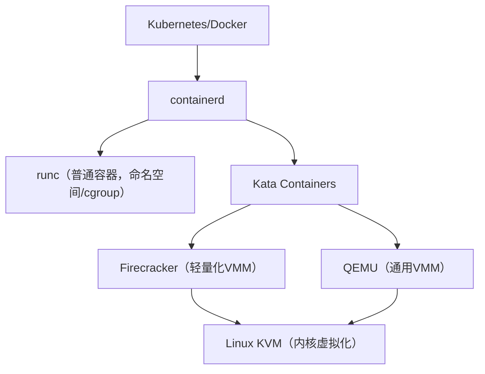

## 前言

在`Kubernetes`集群中，不同的应用场景对容器的隔离性和安全性要求不同。传统的容器技术基于`Linux`命名空间和`cgroup`实现隔离，虽然轻量高效，但在某些场景下隔离性不够强。`RuntimeClass`是`Kubernetes`提供的一种机制，允许用户为不同的`Pod`选择不同的容器运行时，从而在性能、安全性和隔离性之间做出权衡。

## RuntimeClass是什么？

`RuntimeClass`是`Kubernetes`从`v1.12`版本开始引入的`API`对象（在`v1.14`进入`Beta`阶段，在`v1.20`正式`GA`），它允许集群管理员定义不同的容器运行时配置，并让用户在创建`Pod`时选择使用哪种运行时。

简单来说，`RuntimeClass`提供了一种机制，让你可以在同一个`Kubernetes`集群中混合使用不同的容器运行时，比如：
- 普通工作负载使用轻量级的`runc`运行时
- 安全敏感的工作负载使用基于虚拟化的`Kata Containers`
- 需要极致启动速度的负载使用`Firecracker`

### RuntimeClass解决了什么问题？

在`RuntimeClass`出现之前，一个`Kubernetes`集群中所有的`Pod`都使用相同的容器运行时。但在实际生产环境中，不同的应用对隔离性和性能的需求差异很大：

#### 痛点案例1：多租户环境的安全隔离

**场景**：某公司提供`SaaS`服务，多个客户的应用运行在同一个`Kubernetes`集群中。

**问题**：
- 普通容器共享宿主机内核，存在潜在的内核漏洞风险
- 恶意租户可能利用容器逃逸攻击其他租户的应用
- 部分租户要求更强的隔离保证（如金融、医疗行业）

**解决方案**：
- 普通租户使用`runc`运行时，成本低、性能好
- 敏感租户使用`Kata Containers`，每个容器运行在独立的轻量级虚拟机中
- 通过`RuntimeClass`让`Kubernetes`根据租户类型自动选择运行时

#### 痛点案例2：特权容器的风险控制

**场景**：某些应用需要运行特权容器（如监控、存储插件），但这些容器可能包含漏洞。

**问题**：
- 特权容器能够访问宿主机的所有资源，风险极高
- 一旦被攻破，攻击者可以控制整个节点
- 无法在不影响其他工作负载的情况下提升特权容器的隔离性

**解决方案**：
- 特权容器使用`Kata Containers`或`gVisor`等安全运行时
- 即使容器被攻破，攻击者也只能控制虚拟机，无法直接访问宿主机
- 其他普通容器继续使用高性能的`runc`运行时

#### 痛点案例3：无服务器(Serverless)场景的冷启动优化

**场景**：基于`Kubernetes`构建的`Serverless`平台，需要快速启动大量短生命周期的容器。

**问题**：
- 传统虚拟机启动慢（几秒到几十秒）
- `runc`启动快但隔离性不够
- 无法同时满足快速启动和强隔离的需求

**解决方案**：
- 使用`Firecracker`这种专为`Serverless`优化的轻量级`VMM`
- 启动时间可以达到`125ms`以内
- 通过`RuntimeClass`让函数容器自动使用`Firecracker`运行时

## 容器运行时技术栈详解

在深入了解`RuntimeClass`之前，我们需要理解容器运行时生态系统中各个组件的作用和关系。

### 技术栈架构关系



### 各组件详解

#### containerd

`containerd`是一个行业标准的容器运行时，负责管理容器的完整生命周期：
- **职责**：镜像传输和存储、容器执行和监控、底层存储和网络
- **定位**：高层运行时（`High-Level Runtime`），提供`gRPC API`
- **历史**：最初是`Docker`的一部分，后来被捐赠给`CNCF`成为独立项目
- **标准**：实现了`CRI`（`Container Runtime Interface`）接口，是`Kubernetes`官方推荐的容器运行时
- **特点**：
  - 轻量级、高性能、可嵌入
  - 支持多种底层运行时（`runc`、`Kata`、`gVisor`等）
  - 被`Docker`、`Kubernetes`等广泛使用

#### runc

`runc`是一个轻量级的容器运行时，实现了`OCI`（`Open Container Initiative`）规范：
- **职责**：创建和运行容器，配置命名空间、`cgroup`、`rootfs`等
- **定位**：低层运行时（`Low-Level Runtime`），只负责容器启动和管理
- **隔离机制**：基于`Linux`内核特性
  - `Namespace`：进程、网络、文件系统、用户等隔离
  - `cgroup`：资源限制和统计
  - `capabilities`：权限控制
- **特点**：
  - 极其轻量，几乎没有性能损耗
  - 启动速度快（毫秒级）
  - 资源开销小
  - 但隔离性相对较弱，共享内核

#### Kata Containers

`Kata Containers`是一个开源项目，结合了虚拟机的安全性和容器的速度：
- **核心理念**：每个容器或`Pod`运行在独立的轻量级虚拟机中
- **安全优势**：
  - 完全独立的内核，隔离性强
  - 即使容器逃逸，也只能控制虚拟机，无法影响宿主机
  - 支持不同内核版本，可以运行特殊内核模块
- **性能优化**：
  - 专为容器场景优化的轻量级虚拟机
  - 内存占用和启动时间介于传统虚拟机和容器之间
  - 使用精简的`Guest OS`和内核
- **架构**：兼容`OCI`规范，可以作为`containerd`的底层运行时
- **使用场景**：多租户环境、不可信工作负载、合规要求高的场景

#### Firecracker

`Firecracker`是`AWS`开源的微虚拟机监控器（`microVM`）：
- **设计目标**：为`Serverless`和容器工作负载提供安全和高速的虚拟化
- **核心特点**：
  - **极速启动**：可以在`125ms`内启动`microVM`
  - **低内存开销**：每个`microVM`仅需`<5MB`内存
  - **高密度**：单台宿主机可运行数千个`microVM`
  - **强隔离**：基于`KVM`，每个`microVM`拥有独立内核
- **技术实现**：
  - 用`Rust`语言编写，安全性高
  - 极简的设备模型，只提供必要的设备（网络、块设备、串口、键盘）
  - 不支持`PCI`、`USB`等传统虚拟机特性
- **使用场景**：
  - `AWS Lambda`使用`Firecracker`运行函数
  - 适合`Serverless`、`FaaS`平台
  - 需要快速启动和强隔离的场景

#### QEMU

`QEMU`是一个通用的开源虚拟机监控器（`Virtual Machine Monitor`）：
- **职责**：提供完整的硬件虚拟化，模拟`CPU`、内存、设备等
- **特点**：
  - **功能全面**：支持各种设备、架构、操作系统
  - **灵活性高**：可以运行任意操作系统
  - **性能较低**：相比`Firecracker`更重量级
  - **启动较慢**：通常需要几秒钟
- **使用场景**：
  - 需要完整虚拟机功能的场景
  - 运行传统应用
  - `Kata Containers`的默认`VMM`选项之一

#### Linux KVM

`KVM`（`Kernel-based Virtual Machine`）是`Linux`内核的虚拟化模块：
- **定位**：硬件虚拟化的基础设施，内核模块
- **工作原理**：
  - 将`Linux`内核转变为虚拟机监控器
  - 利用`CPU`的硬件虚拟化扩展（`Intel VT-x`、`AMD-V`）
  - 提供`/dev/kvm`设备节点供用户空间程序使用
- **关系**：
  - `QEMU`、`Firecracker`等`VMM`都基于`KVM`提供的能力
  - `KVM`负责`CPU`和内存虚拟化
  - `VMM`负责设备模拟和管理
- **性能**：接近原生性能，虚拟化损耗很小（通常`<5%`）

### 技术栈总结

| 组件 | 层级 | 隔离方式 | 启动时间 | 内存开销 | 典型场景 |
|------|------|----------|----------|----------|----------|
| `runc` | 容器运行时 | 命名空间/`cgroup` | 毫秒级 | 极小 | 通用工作负载 |
| `Kata Containers` | 安全容器 | 轻量级虚拟机 | 百毫秒-秒级 | 中等 | 多租户、安全敏感 |
| `Firecracker` | 微虚拟机 | 轻量级虚拟机 | `125ms` | `<5MB` | `Serverless`、`FaaS` |
| `QEMU` | 虚拟机监控器 | 完整虚拟机 | 秒级 | 较大 | 传统虚拟化 |
| `KVM` | 内核模块 | 硬件虚拟化 | N/A | N/A | 虚拟化基础 |

## RuntimeClass使用示例

### 环境依赖

在使用`RuntimeClass`之前，需要确保满足以下依赖：

#### Kubernetes版本要求
- `v1.12`：`Alpha`版本，需要开启`Feature Gate`
- `v1.14`：`Beta`版本，默认开启
- `v1.20+`：`GA`稳定版本，推荐使用

#### 节点运行时配置
节点上需要安装和配置对应的容器运行时：

**使用runc（默认）**：
```bash
# 安装containerd
apt-get install containerd

# 默认配置即可，无需额外设置
```

**使用Kata Containers**：
```bash
# 安装Kata Containers
bash -c "$(curl -fsSL https://raw.githubusercontent.com/kata-containers/kata-containers/main/utils/kata-manager.sh) install-packages"

# 配置containerd使用Kata
cat >> /etc/containerd/config.toml <<EOF
[plugins."io.containerd.grpc.v1.cri".containerd.runtimes.kata]
  runtime_type = "io.containerd.kata.v2"
EOF

systemctl restart containerd
```

**使用Firecracker**：
```bash
# 安装Firecracker（需要KVM支持）
wget https://github.com/firecracker-microvm/firecracker/releases/download/v1.4.0/firecracker-v1.4.0-x86_64.tgz
tar -xf firecracker-v1.4.0-x86_64.tgz
cp release-v1.4.0-x86_64/firecracker-v1.4.0-x86_64 /usr/local/bin/firecracker

# 配置Kata使用Firecracker作为VMM
cat > /etc/kata-containers/configuration.toml <<EOF
[hypervisor.firecracker]
path = "/usr/local/bin/firecracker"
kernel = "/usr/share/kata-containers/vmlinux.container"
image = "/usr/share/kata-containers/kata-containers.img"
EOF
```

#### 内核依赖
- **runc**：任何现代`Linux`内核（`3.10+`），支持命名空间和`cgroup`
- **Kata Containers/Firecracker**：需要`KVM`支持
  - 内核版本：`4.14+`（推荐`5.10+`）
  - 需要开启`KVM`模块：`modprobe kvm kvm_intel`（`Intel CPU`）或`modprobe kvm kvm_amd`（`AMD CPU`）
  - 检查硬件虚拟化支持：`egrep -c '(vmx|svm)' /proc/cpuinfo`（输出`>0`表示支持）

### 示例1：创建和使用RuntimeClass

#### 步骤1：创建RuntimeClass对象

```yaml
# runtimeclass-runc.yaml - 默认运行时
apiVersion: node.k8s.io/v1
kind: RuntimeClass
metadata:
  name: runc  # RuntimeClass的名称
handler: runc  # containerd中配置的runtime handler名称
```

```yaml
# runtimeclass-kata.yaml - Kata Containers运行时
apiVersion: node.k8s.io/v1
kind: RuntimeClass
metadata:
  name: kata
handler: kata
scheduling:
  nodeSelector:
    # 只调度到支持Kata的节点
    kata-containers: "true"
overhead:
  # 定义运行时的资源开销
  podFixed:
    memory: "160Mi"
    cpu: "250m"
```

```yaml
# runtimeclass-firecracker.yaml - Firecracker运行时
apiVersion: node.k8s.io/v1
kind: RuntimeClass
metadata:
  name: firecracker
handler: kata-fc  # Kata使用Firecracker的handler
scheduling:
  nodeSelector:
    firecracker-enabled: "true"
overhead:
  podFixed:
    memory: "130Mi"
    cpu: "150m"
```

应用这些配置：

```bash
kubectl apply -f runtimeclass-runc.yaml
kubectl apply -f runtimeclass-kata.yaml
kubectl apply -f runtimeclass-firecracker.yaml

# 查看已创建的RuntimeClass
kubectl get runtimeclass
```

#### 步骤2：在Pod中使用RuntimeClass

**使用默认runc运行时的Pod**：

```yaml
apiVersion: v1
kind: Pod
metadata:
  name: nginx-runc
spec:
  runtimeClassName: runc  # 指定使用runc运行时
  containers:
  - name: nginx
    image: nginx:1.25
    resources:
      requests:
        memory: "64Mi"
        cpu: "100m"
      limits:
        memory: "128Mi"
        cpu: "200m"
```

**使用Kata Containers的Pod（安全敏感）**：

```yaml
apiVersion: v1
kind: Pod
metadata:
  name: sensitive-app
  labels:
    security: high
spec:
  runtimeClassName: kata  # 使用Kata运行时，提供虚拟机级别的隔离
  containers:
  - name: app
    image: myregistry/sensitive-app:v1.0
    securityContext:
      runAsNonRoot: true
      runAsUser: 1000
    resources:
      requests:
        # 注意：这里定义的是应用需要的资源
        # RuntimeClass中定义的overhead会自动加上
        memory: "256Mi"
        cpu: "500m"
      limits:
        memory: "512Mi"
        cpu: "1000m"
```

**使用Firecracker的Serverless函数**：

```yaml
apiVersion: v1
kind: Pod
metadata:
  name: serverless-function
spec:
  runtimeClassName: firecracker  # 快速启动的microVM
  restartPolicy: Never
  containers:
  - name: function
    image: myregistry/function:v1.0
    command: ["/app/handler"]
    resources:
      requests:
        memory: "128Mi"
        cpu: "200m"
      limits:
        memory: "256Mi"
        cpu: "500m"
```

### 示例2：为不同应用选择运行时

在实际场景中，你可能需要为不同类型的工作负载选择不同的运行时：

```yaml
# deployment-web-runc.yaml - Web前端使用runc
apiVersion: apps/v1
kind: Deployment
metadata:
  name: web-frontend
spec:
  replicas: 3
  selector:
    matchLabels:
      app: web
  template:
    metadata:
      labels:
        app: web
    spec:
      runtimeClassName: runc  # 性能要求高，安全要求一般
      containers:
      - name: nginx
        image: nginx:1.25
        ports:
        - containerPort: 80
        resources:
          requests:
            memory: "128Mi"
            cpu: "100m"
```

```yaml
# deployment-api-kata.yaml - API服务使用Kata
apiVersion: apps/v1
kind: Deployment
metadata:
  name: api-backend
spec:
  replicas: 2
  selector:
    matchLabels:
      app: api
  template:
    metadata:
      labels:
        app: api
        security: high
    spec:
      runtimeClassName: kata  # 处理敏感数据，需要更强隔离
      containers:
      - name: api
        image: myregistry/api-server:v2.0
        ports:
        - containerPort: 8080
        env:
        - name: DATABASE_URL
          valueFrom:
            secretKeyRef:
              name: db-credentials
              key: url
        resources:
          requests:
            memory: "512Mi"
            cpu: "500m"
```


## RuntimeClass的工作原理

### 调度流程

当创建一个指定了`RuntimeClass`的`Pod`时，`Kubernetes`会执行以下步骤：

1. **准入控制**：`RuntimeClass Admission Controller`验证`RuntimeClass`是否存在
2. **资源开销注入**：如果`RuntimeClass`定义了`overhead`，会将其加到`Pod`的资源请求中
3. **节点选择器应用**：如果`RuntimeClass`定义了`nodeSelector`，会将其合并到`Pod`的`nodeSelector`中
4. **调度决策**：`Scheduler`根据更新后的资源请求和节点选择器进行调度
5. **容器创建**：`kubelet`调用`CRI`接口，指定对应的`runtime handler`
6. **运行时执行**：`containerd`根据`handler`调用对应的底层运行时（`runc`/`kata`等）

### 资源计算

当使用`RuntimeClass`时，`Pod`的实际资源需求 = 容器资源需求 + 运行时开销：

```
Total Resources = Container Requests + RuntimeClass Overhead
```

例如：
```yaml
spec:
  runtimeClassName: kata
  containers:
  - name: app
    resources:
      requests:
        memory: "256Mi"  # 应用需求
        cpu: "500m"

# RuntimeClass定义
overhead:
  podFixed:
    memory: "160Mi"     # Kata运行时开销
    cpu: "250m"

# 实际调度时使用的资源
# memory: 256Mi + 160Mi = 416Mi
# cpu: 500m + 250m = 750m
```

这确保了节点有足够的资源运行虚拟机和容器。

## 最佳实践

### 合理选择运行时

- **通用工作负载**：使用`runc`，性能最好
- **多租户场景**：使用`Kata Containers`，隔离性强
- **Serverless/FaaS**：使用`Firecracker`，启动快
- **特权容器**：使用安全运行时（`Kata`/`gVisor`）

### 正确配置资源开销

不同运行时的资源开销差异很大，需要根据实际测试配置`overhead`：

```yaml
# runc - 几乎无开销
overhead:
  podFixed:
    memory: "0Mi"
    cpu: "0m"

# Kata Containers - 中等开销
overhead:
  podFixed:
    memory: "160Mi"  # 虚拟机内存开销
    cpu: "250m"      # 虚拟化CPU开销

# Firecracker - 较小开销
overhead:
  podFixed:
    memory: "130Mi"
    cpu: "150m"
```

### 使用节点选择器

不是所有节点都支持所有运行时，使用`nodeSelector`确保`Pod`调度到正确的节点：

```yaml
apiVersion: node.k8s.io/v1
kind: RuntimeClass
metadata:
  name: kata
handler: kata
scheduling:
  nodeSelector:
    kata-enabled: "true"
    kvm-support: "true"
  tolerations:
  - key: "kata-only"
    operator: "Exists"
    effect: "NoSchedule"
```

### 监控和告警

不同运行时的性能特征不同，需要针对性监控：

```yaml
# Prometheus监控规则示例
- alert: KataContainerHighOverhead
  expr: |
    (container_memory_working_set_bytes{pod=~".*kata.*"} 
    / on(pod) group_left() 
    kube_pod_container_resource_requests{resource="memory"}) > 1.5
  for: 5m
  annotations:
    summary: "Kata Container内存开销过高"
```

### 渐进式迁移

从`runc`迁移到其他运行时时，建议采用金丝雀发布：

```yaml
# 第一步：少量Pod使用新运行时
apiVersion: apps/v1
kind: Deployment
metadata:
  name: app-canary
spec:
  replicas: 1
  template:
    spec:
      runtimeClassName: kata

---
# 第二步：大部分仍使用runc
apiVersion: apps/v1
kind: Deployment
metadata:
  name: app-stable
spec:
  replicas: 9
  template:
    spec:
      runtimeClassName: runc
```

观察`Canary`部署的性能和稳定性后，再逐步扩大新运行时的使用范围。

## 常见问题

### RuntimeClass可以动态修改吗？

**答**：不可以。`RuntimeClass`是在`Pod`创建时确定的，之后无法更改。如果需要切换运行时，必须删除并重建`Pod`。

### RuntimeClass如何验证Pod使用了哪个RuntimeClass？
**答**：可以通过以下命令查看：

```bash
# 查看Pod的RuntimeClassName字段
kubectl get pod <pod-name> -o jsonpath='{.spec.runtimeClassName}'

# 查看Pod详情
kubectl describe pod <pod-name> | grep "Runtime Class"

# 在节点上查看实际使用的运行时
crictl pods | grep <pod-name>
crictl inspect <container-id> | grep runtime
```

### RuntimeClass会影响镜像拉取吗？

**答**：不会。镜像拉取由`containerd`统一处理，与底层运行时无关。只有在容器启动时才会使用指定的运行时。

### 同一个Pod的不同容器可以使用不同的RuntimeClass吗？

**答**：不可以。`RuntimeClass`是`Pod`级别的配置，同一个`Pod`内的所有容器共享相同的运行时。

### 使用Kata Containers后性能会下降多少？

**答**：性能影响取决于工作负载类型：
- **CPU密集型**：性能损失约`5-10%`
- **IO密集型**：性能损失约`10-20%`
- **网络密集型**：性能损失约`15-25%`
- **内存占用**：增加约`130-200MB`（虚拟机开销）

建议在实际环境中进行压力测试，根据结果决定是否值得为了安全性付出这些性能代价。

## 总结

`RuntimeClass`为`Kubernetes`提供了灵活的运行时选择能力，让我们能够在同一集群中根据不同工作负载的需求选择最合适的容器运行时。通过合理使用`RuntimeClass`，可以在性能、安全性和成本之间找到最佳平衡点。

关键要点：
- `RuntimeClass`从`v1.20`开始`GA`，生产环境可以放心使用
- 不同运行时适用于不同场景：`runc`适合通用场景，`Kata`适合安全敏感场景，`Firecracker`适合`Serverless`
- 使用时需要注意资源开销、节点选择器、内核依赖等配置
- 建议通过准入控制器实现自动化运行时选择

## 参考资料

- [Kubernetes官方文档 - Runtime Class](https://kubernetes.io/docs/concepts/containers/runtime-class/)
- [Kata Containers官网](https://katacontainers.io/)
- [Firecracker GitHub](https://github.com/firecracker-microvm/firecracker)
- [containerd官方文档](https://containerd.io/)
- [OCI Runtime Specification](https://github.com/opencontainers/runtime-spec)
- [CRI接口规范](https://github.com/kubernetes/cri-api)
