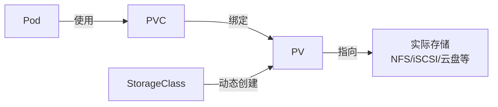
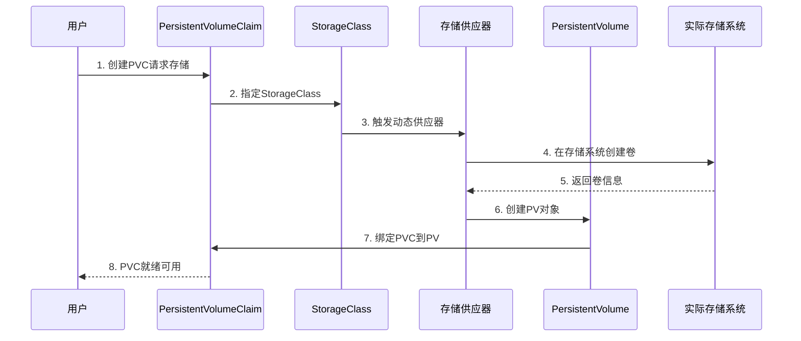

## 前言

在`Kubernetes`集群中，容器的存储默认是临时的，当`Pod`重启或删除时，容器内的数据会丢失。对于数据库、日志系统、文件存储等需要持久化数据的应用场景，我们需要使用`Kubernetes`提供的持久化存储机制。`PersistentVolumeClaim`（`PVC`）是`Kubernetes`存储架构中的核心抽象，它将存储的使用者（`Pod`）和存储的提供者（`PersistentVolume`）解耦，使得应用开发者无需关心底层存储的具体实现细节。

## PVC是什么？

`PersistentVolumeClaim`（`PVC`）是用户对存储资源的请求声明。它类似于`Pod`对计算资源（`CPU`、内存）的请求，但`PVC`请求的是存储资源。通过`PVC`，用户可以声明所需的存储大小、访问模式等需求，而无需关心存储的具体实现。

### Kubernetes存储架构

`Kubernetes`的存储系统由三个核心概念组成：



| 概念 | 说明 |
|------|------|
| **`PV (PersistentVolume)`** | 集群中的一块存储资源，由管理员手动创建或通过`StorageClass`动态创建。`PV`是集群级别的资源，独立于`Pod`的生命周期。 |
| **`PVC (PersistentVolumeClaim)`** | 用户对存储资源的申请。`PVC`会自动绑定到满足条件的`PV`上。 |
| **`StorageClass`** | 定义了存储的类别和动态供应的参数，允许用户在创建`PVC`时自动创建对应的`PV`。 |

### PVC解决了什么问题？

在传统容器部署中，直接使用`volume`挂载存储存在以下问题：

#### 痛点案例1：存储配置与应用耦合

**场景**：某团队开发了一个微服务应用，需要在开发、测试、生产环境分别部署。

**问题**：
- 不同环境使用不同的存储后端（开发用本地存储，测试用`NFS`，生产用云存储）
- 每个环境都需要修改`Pod`配置中的`volume`定义
- 应用开发者需要了解每个环境的存储细节
- 迁移环境时需要大量修改配置文件

**解决方案**：
- 使用`PVC`抽象存储需求，应用只声明需要`10Gi`存储和读写模式
- 不同环境的集群管理员配置各自的`StorageClass`
- 应用配置在各环境保持一致，存储后端由`PVC`自动适配

#### 痛点案例2：存储资源的复用和管理

**场景**：运维团队需要管理大量的存储资源，多个应用共享存储系统。

**问题**：
- 手动为每个应用分配存储空间，管理复杂
- 存储空间难以复用，删除应用后存储资源闲置
- 缺乏统一的存储配额和权限管理
- 存储扩容需要修改每个使用存储的`Pod`配置

**解决方案**：
- 使用`PV`池管理存储资源，支持动态分配和回收
- 通过`PVC`的生命周期管理实现存储的自动回收或保留
- 使用`StorageClass`实现存储配额、性能等级的分类管理
- 支持`PVC`扩容，无需修改`Pod`配置

#### 痛点案例3：有状态应用的部署

**场景**：部署`MySQL`数据库集群，每个实例需要独立的持久化存储。

**问题**：
- 每个数据库实例需要独立且持久的数据目录
- `Pod`重启后必须绑定到原来的存储，避免数据丢失
- 数据库扩容时需要自动创建新的存储卷
- 删除数据库实例时需要保留数据以便恢复

**解决方案**：
- 使用`StatefulSet`配合`volumeClaimTemplates`自动为每个副本创建`PVC`
- `PVC`与`Pod`名称绑定，保证重启后存储的一致性
- `StorageClass`的`reclaimPolicy`设置为`Retain`保留数据
- 支持数据库集群的弹性伸缩

## PVC基础使用

### 访问模式

`PVC`支持以下访问模式（`AccessModes`）：

| 访问模式 | 缩写 | 说明 |
|----------|------|------|
| `ReadWriteOnce` | `RWO` | 卷可以被单个节点以读写方式挂载。最常见，适用于大多数块存储。 |
| `ReadOnlyMany` | `ROX` | 卷可以被多个节点以只读方式挂载。适用于共享配置文件、静态资源等场景。 |
| `ReadWriteMany` | `RWX` | 卷可以被多个节点以读写方式挂载。需要存储系统支持，如`NFS`、`CephFS`等。 |
| `ReadWriteOncePod` | `RWOP` | 卷只能被单个`Pod`以读写方式挂载（`Kubernetes 1.22+`特性）。 |

### 简单的Pod使用PVC示例

以下是创建`PVC`并在`Pod`中使用的基本示例：

#### 1. 创建PersistentVolume

首先创建一个`PV`（在使用动态供应前，通常需要管理员预先创建）：

```yaml
apiVersion: v1
kind: PersistentVolume
metadata:
  name: pv-local-storage
spec:
  capacity:
    storage: 10Gi
  accessModes:
    - ReadWriteOnce
  persistentVolumeReclaimPolicy: Retain
  storageClassName: local-storage
  hostPath:
    path: /data/k8s-storage
    type: DirectoryOrCreate
```

#### 2. 创建PersistentVolumeClaim

用户创建`PVC`申请存储：

```yaml
apiVersion: v1
kind: PersistentVolumeClaim
metadata:
  name: pvc-app-data
  namespace: default
spec:
  accessModes:
    - ReadWriteOnce
  resources:
    requests:
      storage: 5Gi
  storageClassName: local-storage
```

说明：
- `accessModes`：必须与可用`PV`的访问模式匹配
- `resources.requests.storage`：请求的存储空间大小
- `storageClassName`：指定存储类，如果不指定则使用默认`StorageClass`

#### 3. 在Pod中使用PVC

创建`Pod`并挂载`PVC`：

```yaml
apiVersion: v1
kind: Pod
metadata:
  name: app-with-storage
  namespace: default
spec:
  containers:
  - name: app
    image: nginx:latest
    volumeMounts:
    - name: data-volume
      mountPath: /usr/share/nginx/html
  volumes:
  - name: data-volume
    persistentVolumeClaim:
      claimName: pvc-app-data
```

#### 4. 验证存储挂载

```bash
# 查看PVC状态
kubectl get pvc pvc-app-data

# 输出示例
# NAME           STATUS   VOLUME              CAPACITY   ACCESS MODES   STORAGECLASS    AGE
# pvc-app-data   Bound    pv-local-storage    10Gi       RWO            local-storage   2m

# 进入Pod验证挂载
kubectl exec -it app-with-storage -- df -h /usr/share/nginx/html
```

## 网络存储协议与使用

`Kubernetes`支持多种网络存储协议，可以将远程存储挂载到`Pod`中。以下介绍常见的网络存储协议及其使用方式。

### NFS协议

`NFS`（`Network File System`）是最常用的网络文件系统协议，支持`ReadWriteMany`访问模式，允许多个`Pod`同时读写。

#### NFS服务端配置

假设你已经有一个`NFS`服务器`nfs.team.local`，导出目录为`/hpc`。如果需要搭建`NFS`服务器，可以参考以下步骤：

```bash
# 在NFS服务器上安装nfs-server（Ubuntu/Debian）
apt-get update
apt-get install -y nfs-kernel-server

# 创建共享目录
mkdir -p /data/nfs-share
chmod 777 /data/nfs-share

# 配置NFS导出
cat >> /etc/exports <<EOF
/data/nfs-share *(rw,sync,no_subtree_check,no_root_squash)
EOF

# 重启NFS服务
exportfs -ra
systemctl restart nfs-kernel-server
```

#### 直接使用NFS卷

最简单的方式是直接在`Pod`中定义`NFS`卷：

```yaml
apiVersion: v1
kind: Pod
metadata:
  name: nfs-pod-direct
spec:
  containers:
  - name: app
    image: nginx:latest
    volumeMounts:
    - name: nfs-volume
      mountPath: /data/hpc
  volumes:
  - name: nfs-volume
    nfs:
      server: nfs.team.local
      path: /hpc
      readOnly: false
```

#### 通过PV/PVC使用NFS

推荐的方式是通过`PV`和`PVC`使用`NFS`存储：

**1. 创建NFS PersistentVolume：**

:::note 提示
类似的`mount`命令为：
```bash
sudo mount -t nfs -o rw,relatime,vers=3,rsize=1048576,wsize=1048576,hard,nolock,proto=tcp nfs.team.local:/hpc /data/hpc
```
:::

```yaml
apiVersion: v1
kind: PersistentVolume
metadata:
  name: pv-nfs-hpc
spec:
  capacity:
    storage: 100Gi
  accessModes:
    - ReadWriteMany
  persistentVolumeReclaimPolicy: Retain
  storageClassName: nfs-storage
  mountOptions:
    - vers=3
    - rsize=1048576
    - wsize=1048576
    - hard
    - nolock
    - proto=tcp
  nfs:
    server: nfs.team.local
    path: /hpc
```

说明：
- `mountOptions`：对应命令`mount -o`的参数
  - `vers=3`：使用`NFSv3`协议
  - `rsize=1048576`：读缓冲区大小为`1MB`
  - `wsize=1048576`：写缓冲区大小为`1MB`
  - `hard`：硬挂载，网络中断时会重试
  - `nolock`：不使用`NFS`文件锁
  - `proto=tcp`：使用`TCP`协议

**2. 创建PVC：**

```yaml
apiVersion: v1
kind: PersistentVolumeClaim
metadata:
  name: pvc-nfs-hpc
  namespace: default
spec:
  accessModes:
    - ReadWriteMany
  resources:
    requests:
      storage: 50Gi
  storageClassName: nfs-storage
```

**3. 在Deployment中使用：**

```yaml
apiVersion: apps/v1
kind: Deployment
metadata:
  name: web-app-with-nfs
  namespace: default
spec:
  replicas: 3
  selector:
    matchLabels:
      app: web-app
  template:
    metadata:
      labels:
        app: web-app
    spec:
      containers:
      - name: nginx
        image: nginx:latest
        ports:
        - containerPort: 80
        volumeMounts:
        - name: shared-data
          mountPath: /usr/share/nginx/html
      volumes:
      - name: shared-data
        persistentVolumeClaim:
          claimName: pvc-nfs-hpc
```

由于`NFS`支持`ReadWriteMany`，这个`Deployment`的`3`个副本可以同时读写同一个存储卷。

### CIFS/SMB协议

`CIFS`（`Common Internet File System`）也称为`SMB`（`Server Message Block`），主要用于`Windows`文件共享，也可以在`Linux`系统中使用。

#### 使用CIFS卷示例

```yaml
apiVersion: v1
kind: PersistentVolume
metadata:
  name: pv-cifs-share
spec:
  capacity:
    storage: 50Gi
  accessModes:
    - ReadWriteMany
  persistentVolumeReclaimPolicy: Retain
  storageClassName: cifs-storage
  mountOptions:
    - vers=3.0
    - dir_mode=0777
    - file_mode=0777
  csi:
    driver: smb.csi.k8s.io
    volumeHandle: smb-server.example.com/share
    volumeAttributes:
      source: "//smb-server.example.com/share"
    nodeStageSecretRef:
      name: cifs-secret
      namespace: default
---
apiVersion: v1
kind: Secret
metadata:
  name: cifs-secret
  namespace: default
type: Opaque
stringData:
  username: "myuser"
  password: "mypassword"
```

注意：从`Kubernetes 1.26`开始，内置的`CIFS`卷插件已被废弃，推荐使用`CSI`驱动（如`csi-driver-smb`）。

### iSCSI协议

`iSCSI`（`Internet Small Computer System Interface`）是基于`TCP/IP`的块存储协议，将`SCSI`命令封装在`IP`包中传输。

#### iSCSI存储示例

```yaml
apiVersion: v1
kind: PersistentVolume
metadata:
  name: pv-iscsi-storage
spec:
  capacity:
    storage: 20Gi
  accessModes:
    - ReadWriteOnce
  persistentVolumeReclaimPolicy: Retain
  storageClassName: iscsi-storage
  iscsi:
    targetPortal: 192.168.1.100:3260
    iqn: iqn.2021-01.com.example:storage.target01
    lun: 0
    fsType: ext4
    readOnly: false
```

说明：
- `targetPortal`：`iSCSI Target`的`IP`地址和端口
- `iqn`：`iSCSI`限定名称，标识存储目标
- `lun`：逻辑单元号
- `fsType`：文件系统类型

注意：使用`iSCSI`前，需要在`Kubernetes`节点上安装`iscsi-initiator-utils`：

```bash
# CentOS/RHEL
yum install -y iscsi-initiator-utils

# Ubuntu/Debian  
apt-get install -y open-iscsi
```

### 网络存储协议对比

| 协议 | 类型 | 访问模式 | 性能 | 适用场景 |
|------|------|----------|------|----------|
| **`NFS`** | 文件系统 | `RWX` | 中等 | 共享文件存储、日志收集、静态资源 |
| **`CIFS/SMB`** | 文件系统 | `RWX` | 中等 | `Windows`环境、办公文件共享 |
| **`iSCSI`** | 块存储 | `RWO` | 高 | 数据库、高性能应用 |
| **`Ceph RBD`** | 块存储 | `RWO` | 高 | 云原生存储、大规模集群 |
| **`CephFS`** | 文件系统 | `RWX` | 中高 | 分布式文件存储 |

## StorageClass动态存储供应

`StorageClass`提供了一种描述存储类别的方式，允许管理员定义不同类型的存储服务。使用`StorageClass`可以实现存储的动态供应，当用户创建`PVC`时自动创建对应的`PV`。

### StorageClass工作原理



### NFS动态存储供应

`NFS`本身不支持动态供应，需要使用外部供应器（如`nfs-subdir-external-provisioner`）。

#### 1. 部署NFS Provisioner

```yaml
apiVersion: v1
kind: ServiceAccount
metadata:
  name: nfs-client-provisioner
  namespace: kube-system
---
apiVersion: rbac.authorization.k8s.io/v1
kind: ClusterRole
metadata:
  name: nfs-client-provisioner-runner
rules:
  - apiGroups: [""]
    resources: ["persistentvolumes"]
    verbs: ["get", "list", "watch", "create", "delete"]
  - apiGroups: [""]
    resources: ["persistentvolumeclaims"]
    verbs: ["get", "list", "watch", "update"]
  - apiGroups: ["storage.k8s.io"]
    resources: ["storageclasses"]
    verbs: ["get", "list", "watch"]
  - apiGroups: [""]
    resources: ["events"]
    verbs: ["create", "update", "patch"]
---
apiVersion: rbac.authorization.k8s.io/v1
kind: ClusterRoleBinding
metadata:
  name: run-nfs-client-provisioner
subjects:
  - kind: ServiceAccount
    name: nfs-client-provisioner
    namespace: kube-system
roleRef:
  kind: ClusterRole
  name: nfs-client-provisioner-runner
  apiGroup: rbac.authorization.k8s.io
---
apiVersion: apps/v1
kind: Deployment
metadata:
  name: nfs-client-provisioner
  namespace: kube-system
spec:
  replicas: 1
  strategy:
    type: Recreate
  selector:
    matchLabels:
      app: nfs-client-provisioner
  template:
    metadata:
      labels:
        app: nfs-client-provisioner
    spec:
      serviceAccountName: nfs-client-provisioner
      containers:
      - name: nfs-client-provisioner
        image: registry.k8s.io/sig-storage/nfs-subdir-external-provisioner:v4.0.2
        volumeMounts:
        - name: nfs-client-root
          mountPath: /persistentvolumes
        env:
        - name: PROVISIONER_NAME
          value: k8s-sigs.io/nfs-subdir-external-provisioner
        - name: NFS_SERVER
          value: nfs.team.local
        - name: NFS_PATH
          value: /hpc
      volumes:
      - name: nfs-client-root
        nfs:
          server: nfs.team.local
          path: /hpc
```

#### 2. 创建StorageClass

```yaml
apiVersion: storage.k8s.io/v1
kind: StorageClass
metadata:
  name: nfs-client
  annotations:
    storageclass.kubernetes.io/is-default-class: "true"
provisioner: k8s-sigs.io/nfs-subdir-external-provisioner
parameters:
  archiveOnDelete: "true"
  pathPattern: "${.PVC.namespace}-${.PVC.name}"
mountOptions:
  - vers=3
  - rsize=1048576
  - wsize=1048576
  - hard
  - nolock
  - proto=tcp
reclaimPolicy: Delete
volumeBindingMode: Immediate
```

说明：
- `provisioner`：供应器名称，必须与`Deployment`中的`PROVISIONER_NAME`一致
- `parameters.archiveOnDelete`：删除`PVC`时是否归档数据
- `parameters.pathPattern`：子目录命名模式
- `reclaimPolicy`：回收策略，`Delete`或`Retain`
- `volumeBindingMode`：绑定模式，`Immediate`（立即绑定）或`WaitForFirstConsumer`（等待首次使用）

#### 3. 使用动态供应创建PVC

```yaml
apiVersion: v1
kind: PersistentVolumeClaim
metadata:
  name: pvc-nfs-dynamic
  namespace: default
spec:
  accessModes:
    - ReadWriteMany
  resources:
    requests:
      storage: 10Gi
  storageClassName: nfs-client
```

此时无需手动创建`PV`，`nfs-client-provisioner`会自动创建。

### 云存储动态供应

云服务商通常提供了`CSI`驱动支持动态供应，以阿里云为例：

```yaml
apiVersion: storage.k8s.io/v1
kind: StorageClass
metadata:
  name: alicloud-disk-ssd
provisioner: diskplugin.csi.alibabacloud.com
parameters:
  type: cloud_ssd
  regionId: cn-hangzhou
  zoneId: cn-hangzhou-b
  fsType: ext4
reclaimPolicy: Delete
allowVolumeExpansion: true
volumeBindingMode: WaitForFirstConsumer
```

### StorageClass参数详解

| 参数 | 说明 | 可选值 |
|------|------|--------|
| **provisioner** | 存储供应器 | 内置或外部供应器名称 |
| **parameters** | 供应器特定参数 | 依供应器而定 |
| **reclaimPolicy** | 回收策略 | `Delete`（删除）、`Retain`（保留） |
| **allowVolumeExpansion** | 是否允许扩容 | `true`、`false` |
| **volumeBindingMode** | 绑定模式 | `Immediate`、`WaitForFirstConsumer` |
| **mountOptions** | 挂载选项 | 文件系统挂载参数 |

## Deployment使用PVC

`Deployment`适用于无状态应用，所有副本共享同一个`PVC`（需要存储支持`ReadWriteMany`）或每个副本使用独立的`PVC`（`ReadWriteOnce`）。

### 场景1：共享存储（ReadWriteMany）

多个副本共享同一份数据，适合静态资源服务器、日志收集等场景：

```yaml
apiVersion: v1
kind: PersistentVolumeClaim
metadata:
  name: shared-pvc
  namespace: default
spec:
  accessModes:
    - ReadWriteMany
  resources:
    requests:
      storage: 20Gi
  storageClassName: nfs-client
---
apiVersion: apps/v1
kind: Deployment
metadata:
  name: web-server
  namespace: default
spec:
  replicas: 3
  selector:
    matchLabels:
      app: web-server
  template:
    metadata:
      labels:
        app: web-server
    spec:
      containers:
      - name: nginx
        image: nginx:1.25
        ports:
        - containerPort: 80
        volumeMounts:
        - name: html-data
          mountPath: /usr/share/nginx/html
      volumes:
      - name: html-data
        persistentVolumeClaim:
          claimName: shared-pvc
```

### 场景2：独立存储（ReadWriteOnce）

每个副本需要独立存储，但使用`Deployment`管理。需要为每个副本创建独立的`PVC`：

```yaml
# 需要手动创建多个PVC
apiVersion: v1
kind: PersistentVolumeClaim
metadata:
  name: app-pvc-0
  namespace: default
spec:
  accessModes:
    - ReadWriteOnce
  resources:
    requests:
      storage: 10Gi
  storageClassName: local-storage
---
apiVersion: v1
kind: PersistentVolumeClaim
metadata:
  name: app-pvc-1
  namespace: default
spec:
  accessModes:
    - ReadWriteOnce
  resources:
    requests:
      storage: 10Gi
  storageClassName: local-storage
---
# 使用不同的Deployment分别挂载
apiVersion: apps/v1
kind: Deployment
metadata:
  name: app-instance-0
  namespace: default
spec:
  replicas: 1
  selector:
    matchLabels:
      app: myapp
      instance: "0"
  template:
    metadata:
      labels:
        app: myapp
        instance: "0"
    spec:
      containers:
      - name: app
        image: myapp:latest
        volumeMounts:
        - name: data
          mountPath: /data
      volumes:
      - name: data
        persistentVolumeClaim:
          claimName: app-pvc-0
```

注意：对于需要独立存储的有状态应用，推荐使用`StatefulSet`而不是`Deployment`。

## StatefulSet使用PVC

`StatefulSet`专为有状态应用设计，提供了`volumeClaimTemplates`特性，可以为每个副本自动创建独立的`PVC`。

### StatefulSet的存储特性

- **稳定的存储标识**：每个`Pod`的`PVC`名称固定为`<volumeClaimTemplate名称>-<StatefulSet名称>-<序号>`
- **顺序创建和删除**：`Pod`和`PVC`按序号顺序创建
- **持久化保留**：删除`StatefulSet`时默认不会删除`PVC`，数据得以保留
- **扩缩容支持**：扩容时自动创建新的`PVC`，缩容时保留`PVC`供后续恢复使用

### MySQL集群示例

以下是一个使用`StatefulSet`部署`MySQL`集群的完整示例：

```yaml
apiVersion: v1
kind: Service
metadata:
  name: mysql
  namespace: default
  labels:
    app: mysql
spec:
  ports:
  - port: 3306
    name: mysql
  clusterIP: None
  selector:
    app: mysql
---
apiVersion: apps/v1
kind: StatefulSet
metadata:
  name: mysql
  namespace: default
spec:
  serviceName: mysql
  replicas: 3
  selector:
    matchLabels:
      app: mysql
  template:
    metadata:
      labels:
        app: mysql
    spec:
      containers:
      - name: mysql
        image: mysql:8.0
        ports:
        - containerPort: 3306
          name: mysql
        env:
        - name: MYSQL_ROOT_PASSWORD
          value: "MySecurePassword123"
        - name: MYSQL_DATABASE
          value: "myapp"
        volumeMounts:
        - name: mysql-data
          mountPath: /var/lib/mysql
          subPath: mysql
        - name: mysql-conf
          mountPath: /etc/mysql/conf.d
      volumes:
      - name: mysql-conf
        configMap:
          name: mysql-config
  volumeClaimTemplates:
  - metadata:
      name: mysql-data
    spec:
      accessModes:
        - ReadWriteOnce
      resources:
        requests:
          storage: 50Gi
      storageClassName: nfs-client
---
apiVersion: v1
kind: ConfigMap
metadata:
  name: mysql-config
  namespace: default
data:
  my.cnf: |
    [mysqld]
    default-storage-engine=INNODB
    character-set-server=utf8mb4
    max_connections=1000
    innodb_buffer_pool_size=1G
```

部署后会创建3个`Pod`和3个`PVC`：
- `Pod`：`mysql-0`、`mysql-1`、`mysql-2`
- `PVC`：`mysql-data-mysql-0`、`mysql-data-mysql-1`、`mysql-data-mysql-2`

每个`MySQL`实例都有独立的持久化存储，即使`Pod`重启也能保留数据。

### Redis集群示例

```yaml
apiVersion: v1
kind: ConfigMap
metadata:
  name: redis-config
  namespace: default
data:
  redis.conf: |
    port 6379
    cluster-enabled yes
    cluster-config-file /data/nodes.conf
    cluster-node-timeout 5000
    appendonly yes
    dir /data
---
apiVersion: v1
kind: Service
metadata:
  name: redis-cluster
  namespace: default
spec:
  ports:
  - port: 6379
    targetPort: 6379
    name: client
  - port: 16379
    targetPort: 16379
    name: gossip
  clusterIP: None
  selector:
    app: redis-cluster
---
apiVersion: apps/v1
kind: StatefulSet
metadata:
  name: redis-cluster
  namespace: default
spec:
  serviceName: redis-cluster
  replicas: 6
  selector:
    matchLabels:
      app: redis-cluster
  template:
    metadata:
      labels:
        app: redis-cluster
    spec:
      containers:
      - name: redis
        image: redis:7.0-alpine
        ports:
        - containerPort: 6379
          name: client
        - containerPort: 16379
          name: gossip
        command:
        - redis-server
        args:
        - /conf/redis.conf
        volumeMounts:
        - name: redis-data
          mountPath: /data
        - name: redis-conf
          mountPath: /conf
      volumes:
      - name: redis-conf
        configMap:
          name: redis-config
  volumeClaimTemplates:
  - metadata:
      name: redis-data
    spec:
      accessModes:
        - ReadWriteOnce
      resources:
        requests:
          storage: 20Gi
      storageClassName: nfs-client
```

### PostgreSQL集群示例

```yaml
apiVersion: v1
kind: Service
metadata:
  name: postgres
  namespace: default
spec:
  ports:
  - port: 5432
    name: postgres
  clusterIP: None
  selector:
    app: postgres
---
apiVersion: apps/v1
kind: StatefulSet
metadata:
  name: postgres
  namespace: default
spec:
  serviceName: postgres
  replicas: 3
  selector:
    matchLabels:
      app: postgres
  template:
    metadata:
      labels:
        app: postgres
    spec:
      containers:
      - name: postgres
        image: postgres:15-alpine
        ports:
        - containerPort: 5432
          name: postgres
        env:
        - name: POSTGRES_PASSWORD
          value: "SecurePassword456"
        - name: POSTGRES_DB
          value: "myapp"
        - name: PGDATA
          value: /var/lib/postgresql/data/pgdata
        volumeMounts:
        - name: postgres-data
          mountPath: /var/lib/postgresql/data
        resources:
          requests:
            cpu: 500m
            memory: 1Gi
          limits:
            cpu: 1000m
            memory: 2Gi
  volumeClaimTemplates:
  - metadata:
      name: postgres-data
    spec:
      accessModes:
        - ReadWriteOnce
      resources:
        requests:
          storage: 100Gi
      storageClassName: nfs-client
```

## 存储最佳实践

### 1. 选择合适的访问模式

- **RWO（ReadWriteOnce）**：适用于数据库、块存储，单节点读写
- **ROX（ReadOnlyMany）**：适用于配置文件、静态资源的分发
- **RWX（ReadWriteMany）**：适用于共享文件系统、多节点协作

### 2. 合理设置回收策略

- **Retain（保留）**：用于重要数据，删除`PVC`后`PV`和数据保留，需要手动清理
- **Delete（删除）**：用于临时数据或可重建的数据，删除`PVC`时自动清理`PV`和底层存储

### 3. 使用StorageClass分类管理

为不同性能要求的应用创建不同的`StorageClass`：

```yaml
# 高性能SSD存储
apiVersion: storage.k8s.io/v1
kind: StorageClass
metadata:
  name: fast-ssd
provisioner: kubernetes.io/aws-ebs
parameters:
  type: io2
  iopsPerGB: "50"
reclaimPolicy: Delete
---
# 标准HDD存储
apiVersion: storage.k8s.io/v1
kind: StorageClass
metadata:
  name: standard-hdd
provisioner: kubernetes.io/aws-ebs
parameters:
  type: sc1
reclaimPolicy: Delete
```

### 4. 启用存储扩容

在`StorageClass`中启用卷扩容：

```yaml
apiVersion: storage.k8s.io/v1
kind: StorageClass
metadata:
  name: expandable-storage
provisioner: kubernetes.io/aws-ebs
allowVolumeExpansion: true
```

扩容`PVC`：

```bash
# 编辑PVC增加storage大小
kubectl edit pvc my-pvc

# 或使用patch命令
kubectl patch pvc my-pvc -p '{"spec":{"resources":{"requests":{"storage":"100Gi"}}}}'
```

### 5. 使用volumeBindingMode优化调度

对于拓扑感知的存储（如本地存储、云盘），使用`WaitForFirstConsumer`模式：

```yaml
apiVersion: storage.k8s.io/v1
kind: StorageClass
metadata:
  name: local-storage
provisioner: kubernetes.io/no-provisioner
volumeBindingMode: WaitForFirstConsumer
```

这样可以确保`PV`在`Pod`调度到节点后再绑定，避免`Pod`因存储位置不匹配而无法调度。

### 6. 监控存储使用情况

```bash
# 查看PVC使用情况
kubectl get pvc -A

# 查看PV列表
kubectl get pv

# 查看StorageClass
kubectl get storageclass

# 查看Pod的存储挂载
kubectl describe pod <pod-name>
```

### 7. 数据备份策略

对于重要数据，建议：
- 使用`VolumeSnapshot`进行定期快照
- 将数据同步到对象存储（如`S3`）
- 使用专业备份工具（如`Velero`）

## 常见问题排查

### 1. PVC一直处于Pending状态

**原因**：
- 没有匹配的`PV`可用
- `StorageClass`不存在或配置错误
- 存储配额已满

**排查方法**：

```bash
# 查看PVC详情
kubectl describe pvc <pvc-name>

# 查看事件
kubectl get events --sort-by='.lastTimestamp'

# 检查StorageClass
kubectl get storageclass
```

### 2. Pod无法挂载PVC

**原因**：
- 节点缺少必要的存储客户端（如`nfs-common`、`open-iscsi`）
- 存储服务器网络不通
- 权限配置错误

**排查方法**：

```bash
# 查看Pod事件
kubectl describe pod <pod-name>

# 在节点上测试挂载
mount -t nfs nfs.team.local:/hpc /mnt/test

# 查看kubelet日志
journalctl -u kubelet -f
```

### 3. 存储性能问题

**优化建议**：
- 调整`NFS`的`rsize`、`wsize`参数
- 使用`SSD`替代`HDD`
- 启用缓存机制
- 考虑使用分布式存储系统

### 4. 删除Namespace时PVC无法删除

**原因**：`PVC`可能被保护或存在`Finalizer`

**解决方法**：

```bash
# 查看PVC的finalizers
kubectl get pvc <pvc-name> -o yaml | grep finalizers -A 5

# 移除finalizers
kubectl patch pvc <pvc-name> -p '{"metadata":{"finalizers":null}}'
```

## 总结

`PersistentVolumeClaim`（`PVC`）是`Kubernetes`存储架构的核心抽象，通过将存储的使用和供应解耦，极大地简化了应用的存储管理。本文详细介绍了：

1. **PVC基础概念**：`PV`、`PVC`、`StorageClass`三者的关系和作用
2. **网络存储协议**：`NFS`、`CIFS`、`iSCSI`等协议的使用方法和配置示例
3. **动态存储供应**：通过`StorageClass`实现存储的自动创建和管理
4. **实际应用场景**：`Deployment`和`StatefulSet`中使用`PVC`的完整示例
5. **最佳实践**：存储选型、配置优化、监控和故障排查

通过合理使用`PVC`和`StorageClass`，可以实现灵活、可靠、高效的持久化存储方案，满足各类有状态应用的需求。无论是数据库、缓存、文件系统还是日志存储，`Kubernetes`的存储系统都能提供良好的支持。
