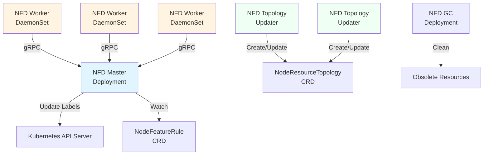

## 前言

在`Kubernetes`集群中，节点的硬件配置往往是异构的。不同节点可能配备不同型号的`CPU`、`GPU`、网卡或其他专用硬件。传统的`Kubernetes`调度主要基于`CPU`和内存资源，无法感知节点的硬件特性。`Node Feature Discovery`（`NFD`）正是为了解决这个问题而生，它能够自动发现节点的硬件特性和系统配置，并将这些信息转换为节点标签，从而实现更加智能的调度决策。

## Node Feature Discovery是什么？

`Node Feature Discovery`（简称`NFD`）是一个`Kubernetes`插件，用于检测节点的硬件特性和系统配置。它会自动发现诸如`CPU`指令集、内核版本、`PCI`设备、`USB`设备等信息，并将这些特性作为标签添加到对应的节点上。

### 核心特点

- **自动化特性发现**：无需手动配置，自动检测节点的硬件和系统特性
- **灵活的标签管理**：支持预定义的特性标签和自定义标签规则
- **可扩展性**：支持通过插件扩展新的特性检测能力
- **多种输出方式**：支持节点标签、注解、扩展资源和污点等多种形式
- **规则引擎**：通过`NodeFeatureRule`自定义资源实现灵活的标签规则

### Node Feature Discovery解决了什么问题？

#### 痛点案例1：异构GPU集群的调度困境

**场景**：某AI训练平台的`Kubernetes`集群中混合部署了`NVIDIA A100`、`V100`和`T4`等不同型号的`GPU`节点。

**问题**：
- 不同的训练任务对`GPU`型号有特定要求（如大模型训练需要`A100`的大显存）
- 默认的`Device Plugin`只能识别`GPU`数量，无法区分型号
- 用户需要手动为每个节点打标签，维护成本高且容易出错
- 节点扩缩容时容易遗漏标签配置，导致调度失败

**解决方案**：
- 使用`NFD`自动检测`GPU`型号并添加对应的节点标签
- 训练任务通过`nodeSelector`或`nodeAffinity`指定所需的`GPU`型号
- 新增节点时无需手动配置，`NFD`自动完成特性发现和标签添加

#### 痛点案例2：CPU特性敏感的高性能计算

**场景**：金融机构的量化交易系统需要使用特定的`CPU`指令集（如`AVX512`）来加速计算。

**问题**：
- 集群中部分旧节点不支持`AVX512`指令集
- 应用运行在不支持的节点上会崩溃或性能严重下降
- 管理员难以准确识别哪些节点支持特定的`CPU`特性
- 节点硬件升级后需要手动更新标签

**解决方案**：
- `NFD`自动检测`CPU`的`CPUID`特性，包括`AVX512`等指令集
- 为支持的节点自动添加`feature.node.kubernetes.io/cpu-cpuid.AVX512F=true`标签
- 应用通过节点选择器确保运行在支持所需指令集的节点上
- 硬件变更时标签自动更新，无需人工干预

#### 痛点案例3：网络设备感知的边缘计算

**场景**：物联网边缘计算平台需要根据节点的网络设备类型部署不同的网关服务。

**问题**：
- 边缘节点配备不同的网络接口（`5G`模组、`LoRa`、工业以太网等）
- 网关服务需要运行在配备特定网络设备的节点上
- 节点数量多且地理分布广，手动管理标签几乎不可能
- 设备故障或更换后难以及时更新配置

**解决方案**：
- `NFD`检测`PCI`和`USB`网络设备，识别设备类型和厂商
- 通过`NodeFeatureRule`定义规则，为不同设备类型添加语义化标签
- 网关服务通过标签选择器自动部署到正确的节点
- 设备变更时`NFD`实时更新标签，确保调度准确性

## NFD核心架构

`NFD`采用分布式架构，主要包含四个核心组件。

### 架构组件



#### NFD-Master

`nfd-master`是一个`Deployment`，负责与`Kubernetes API Server`通信：

- **职责**：
  - 接收来自`nfd-worker`的特性发现请求
  - 根据`NodeFeatureRule`规则处理特性数据
  - 更新节点对象的标签、注解、扩展资源和污点
  - 监听`NodeFeatureRule`自定义资源的变更
  
- **高可用**：虽然是`Deployment`，但通常配置为单副本，因为标签更新操作是幂等的

- **工作模式**：
  - 接收`Worker`上报的特性信息
  - 应用`NodeFeatureRule`规则进行标签转换
  - 批量更新节点对象减少`API Server`压力

#### NFD-Worker

`nfd-worker`以`DaemonSet`形式部署，在每个节点上运行一个实例：

- **职责**：
  - 检测节点的硬件特性和系统配置
  - 通过`gRPC`将检测结果发送给`nfd-master`
  - 定期重新扫描特性变化（默认`60`秒）
  
- **特性来源**：
  - `CPU`：`CPUID`特性、拓扑信息、电源管理状态等
  - `Kernel`：内核版本、配置选项、加载的模块等
  - `Memory`：`NUMA`信息、内存类型等
  - `Network`：网络设备信息
  - `PCI`：`PCI`设备（包括`GPU`、网卡等）
  - `Storage`：存储设备信息
  - `System`：系统信息（`DMI`、操作系统等）
  - `USB`：`USB`设备
  - `Custom`：基于规则的自定义特性
  - `Local`：通过文件定义的本地特性

- **扩展机制**：
  - 支持外部插件扩展特性检测能力
  - 可以通过配置文件定制特性源

#### NFD-Topology-Updater

`nfd-topology-updater`也是以`DaemonSet`形式部署，用于硬件拓扑感知：

- **职责**：
  - 检测节点的硬件拓扑信息（`NUMA`节点、`CPU`核心分布等）
  - 跟踪已分配的资源和可分配资源
  - 创建和更新`NodeResourceTopology`自定义资源
  
- **使用场景**：
  - `NUMA`感知调度
  - 拓扑感知的资源分配
  - 高性能计算场景的细粒度资源管理

#### NFD-GC

`nfd-gc`（`Garbage Collector`）负责清理过时的资源：

- **职责**：
  - 清理已删除节点对应的`NodeFeature`对象
  - 清理过期的`NodeResourceTopology`对象
  - 防止资源泄漏
  
- **部署形式**：单副本`Deployment`

### 特性发现源

`NFD`通过多个特性源来检测节点的不同方面：

| 特性源 | 检测内容 | 标签示例 |
|--------|---------|----------|
| `cpu` | `CPU`指令集、拓扑、电源管理 | `feature.node.kubernetes.io/cpu-cpuid.AVX512F` |
| `kernel` | 内核版本、配置、加载的模块 | `feature.node.kubernetes.io/kernel-version.major=5` |
| `memory` | `NUMA`信息、内存类型 | `feature.node.kubernetes.io/memory-numa=true` |
| `network` | 网络设备、`SRIOV`支持 | `feature.node.kubernetes.io/network-sriov.capable=true` |
| `pci` | `PCI`设备（`GPU`、网卡等） | `feature.node.kubernetes.io/pci-10de.present=true` |
| `storage` | 存储设备、`NVMe`支持 | `feature.node.kubernetes.io/storage-nonrotationaldisk=true` |
| `system` | 系统信息、固件版本 | `feature.node.kubernetes.io/system-os_release.ID=ubuntu` |
| `usb` | `USB`设备 | `feature.node.kubernetes.io/usb-fe_1a6e_089a.present=true` |
| `custom` | 自定义规则生成的特性 | 用户定义 |
| `local` | 从文件读取的特性 | 用户定义 |

## 如何使用Node Feature Discovery

### 安装部署

#### 使用Kustomize部署（推荐）

这是最简单的部署方式：

```bash
kubectl apply -k "https://github.com/kubernetes-sigs/node-feature-discovery/deployment/overlays/default?ref=v0.17.3"
```

这个命令会创建：
- `node-feature-discovery`命名空间
- 必需的`RBAC`规则（`ServiceAccount`、`Role`、`ClusterRole`等）
- `nfd-master` `Deployment`
- `nfd-worker` `DaemonSet`
- `nfd-gc` `Deployment`
- `NodeFeatureRule`、`NodeFeature`、`NodeFeatureGroup`等`CRD`

#### 使用Helm部署

如果需要自定义配置，可以使用`Helm`：

```bash
# 添加 Helm 仓库
helm repo add nfd https://kubernetes-sigs.github.io/node-feature-discovery/charts
helm repo update

# 安装 NFD
helm install nfd nfd/node-feature-discovery \
  --namespace node-feature-discovery \
  --create-namespace
```

#### 部署Topology Updater（可选）

如果需要拓扑感知调度功能：

```bash
kubectl apply -k "https://github.com/kubernetes-sigs/node-feature-discovery/deployment/overlays/topologyupdater?ref=v0.17.3"
```

### 验证安装

检查`NFD`组件是否正常运行：

```bash
kubectl -n node-feature-discovery get all
```

预期输出：

```text
NAME                              READY   STATUS    RESTARTS   AGE
pod/nfd-gc-565fc85d9b-94jpj       1/1     Running   0          1m
pod/nfd-master-6796d89d7b-qccrq   1/1     Running   0          1m
pod/nfd-worker-nwdp6              1/1     Running   0          1m
pod/nfd-worker-p8s2l              1/1     Running   0          1m

NAME                         READY   UP-TO-DATE   AVAILABLE   AGE
deployment.apps/nfd-gc       1/1     1            1           1m
deployment.apps/nfd-master   1/1     1            1           1m

NAME                         DESIRED   CURRENT   READY   AGE
daemonset.apps/nfd-worker    2         2         2       1m
```

### 查看节点标签

`NFD`会自动为节点添加特性标签，查看某个节点的标签：

```bash
kubectl get node <node-name> -o json | jq '.metadata.labels' | grep feature.node.kubernetes.io
```

常见的标签包括：

```yaml
feature.node.kubernetes.io/cpu-cpuid.ADX: "true"
feature.node.kubernetes.io/cpu-cpuid.AESNI: "true"
feature.node.kubernetes.io/cpu-cpuid.AVX: "true"
feature.node.kubernetes.io/cpu-cpuid.AVX2: "true"
feature.node.kubernetes.io/kernel-version.full: "5.15.0-91-generic"
feature.node.kubernetes.io/kernel-version.major: "5"
feature.node.kubernetes.io/kernel-version.minor: "15"
feature.node.kubernetes.io/pci-10de.present: "true"  # NVIDIA GPU
feature.node.kubernetes.io/system-os_release.ID: "ubuntu"
```

### 配置管理

#### Master配置

通过`ConfigMap`配置`nfd-master`：

```yaml
apiVersion: v1
kind: ConfigMap
metadata:
  name: nfd-master-conf
  namespace: node-feature-discovery
data:
  nfd-master.conf: |
    enableTaints: false
    extraLabelNs:
      - custom.vendor.io
    labelWhiteList:
      - ".*"
    noPublish: false
    resyncPeriod: "1h"
```

配置项说明：

- `enableTaints`：是否允许创建污点，默认为`false`
- `extraLabelNs`：允许的额外标签命名空间
- `labelWhiteList`：标签白名单，支持正则表达式
- `noPublish`：不发布标签到节点（调试用）
- `resyncPeriod`：重新同步`NodeFeatureRule`的周期

#### Worker配置

通过`ConfigMap`配置`nfd-worker`：

```yaml
apiVersion: v1
kind: ConfigMap
metadata:
  name: nfd-worker-conf
  namespace node-feature-discovery
data:
  nfd-worker.conf: |
    core:
      sleepInterval: 60s
      labelSources:
        - cpu
        - kernel
        - pci
        - usb
        - custom
        - local
      featureSources:
        - cpu
        - kernel
        - pci
        - usb
        - custom
        - local
    sources:
      cpu:
        cpuid:
          attributeBlacklist:
            - "BMI1"
            - "BMI2"
            - "CLMUL"
      pci:
        deviceClassWhitelist:
          - "0200"  # Network controller
          - "03"    # Display controller
          - "12"    # Processing accelerators
```

配置项说明：

- `core.sleepInterval`：特性扫描间隔
- `core.labelSources`：启用的标签源
- `core.featureSources`：启用的特性源
- `sources.<source>`：各个特性源的具体配置

### 使用节点标签调度Pod

一旦节点被打上标签，就可以在`Pod`中使用这些标签进行调度：

#### 使用nodeSelector

最简单的方式是使用`nodeSelector`：

```yaml
apiVersion: v1
kind: Pod
metadata:
  name: avx512-pod
spec:
  nodeSelector:
    feature.node.kubernetes.io/cpu-cpuid.AVX512F: "true"
  containers:
  - name: app
    image: myapp:latest
```

#### 使用nodeAffinity

更灵活的方式是使用`nodeAffinity`：

```yaml
apiVersion: v1
kind: Pod
metadata:
  name: gpu-pod
spec:
  affinity:
    nodeAffinity:
      requiredDuringSchedulingIgnoredDuringExecution:
        nodeSelectorTerms:
        - matchExpressions:
          - key: feature.node.kubernetes.io/pci-10de.present
            operator: In
            values:
            - "true"
          - key: feature.node.kubernetes.io/kernel-version.major
            operator: Gt
            values:
            - "5"
  containers:
  - name: gpu-app
    image: gpu-workload:latest
```

## NodeFeatureRule使用

`NodeFeatureRule`是`NFD`最强大的功能之一，允许用户定义自定义的标签规则。通过`NodeFeatureRule`，可以将底层的硬件特性转换为高层次的语义化标签，实现灵活的节点分类和管理。

由于`NodeFeatureRule`内容较多且复杂，我们将其详细配置和使用方法单独整理成了专门的文章，详见：

👉 **[NodeFeatureRule配置使用](./6100-NodeFeatureRule配置使用.md)**

该文章详细介绍了：
- `NodeFeatureRule`的工作原理和流程
- 所有核心字段的详细说明和使用方法
- 完整的可用特性类型列表（`CPU`、内核、内存、网络、`PCI`、存储等）
- 丰富的实战示例（`GPU`检测、`CPU`分级、网络设备识别等）
- 最佳实践和故障排查技巧

下面是一个简单的`NodeFeatureRule`使用示例：

```yaml
apiVersion: nfd.k8s-sigs.io/v1alpha1
kind: NodeFeatureRule
metadata:
  name: gpu-detection-example
spec:
  rules:
    - name: "nvidia gpu detection"
      labels:
        "nvidia.com/gpu": "true"
        "gpu.present": "true"
      matchFeatures:
        - feature: pci.device
          matchExpressions:
            vendor: {op: In, value: ["10de"]}  # NVIDIA
            class: {op: In, value: ["0300", "0302"]}  # Display controller
```

## 典型应用场景

`NFD`配合`NodeFeatureRule`可以应用于多种场景。以下列举几个常见的使用场景，更多详细的配置示例请参考 **[NodeFeatureRule配置使用](./6100-NodeFeatureRule配置使用.md)**。

### 异构GPU集群管理

在混合部署不同型号`GPU`的集群中，可以使用`NFD`自动识别`GPU`型号，并通过`NodeFeatureRule`为不同型号的`GPU`节点添加语义化标签。应用可以通过标签选择器将任务调度到合适的节点上。

**适用场景**：
- `AI`训练平台需要区分训练卡和推理卡
- 大模型训练需要指定高显存的`GPU`
- 成本优化，将不同优先级的任务分配到不同档次的`GPU`

### 高性能计算节点分级

根据`CPU`的指令集支持情况（如`AVX512`、`AVX2`等）对节点进行性能分级，为不同计算密集度的任务分配合适的计算资源。

**适用场景**：
- 科学计算需要`AVX512`加速
- 金融量化交易对`CPU`性能有严格要求
- 成本敏感的任务可以运行在低配节点上

### 存储设备感知

自动识别节点的存储设备类型（`NVMe SSD`、`SATA SSD`、`HDD`），为数据库等`I/O`密集型应用选择高性能存储节点。

**适用场景**：
- 数据库需要高`IOPS`的`NVMe`存储
- 日志收集可以使用低成本的`HDD`
- 缓存服务需要低延迟的`SSD`

### 网络设备类型识别

在边缘计算场景中，根据节点配备的网络设备类型（`5G`模组、`LoRa`、工业以太网等）部署相应的网关服务。

**适用场景**：
- 物联网边缘网关需要特定的网络接口
- 工业现场需要识别工业以太网设备
- 移动边缘计算需要识别`5G`模组

### 安全合规节点标识

识别节点的安全特性（如`Intel SGX`、`SELinux`配置等），确保敏感工作负载运行在符合安全要求的节点上。

**适用场景**：
- 金融行业的合规要求
- 医疗数据处理的安全隔离
- 多租户环境的安全分级


## 参考资料

- [Node Feature Discovery GitHub](https://github.com/kubernetes-sigs/node-feature-discovery)
- [NFD官方文档](https://kubernetes-sigs.github.io/node-feature-discovery/)
