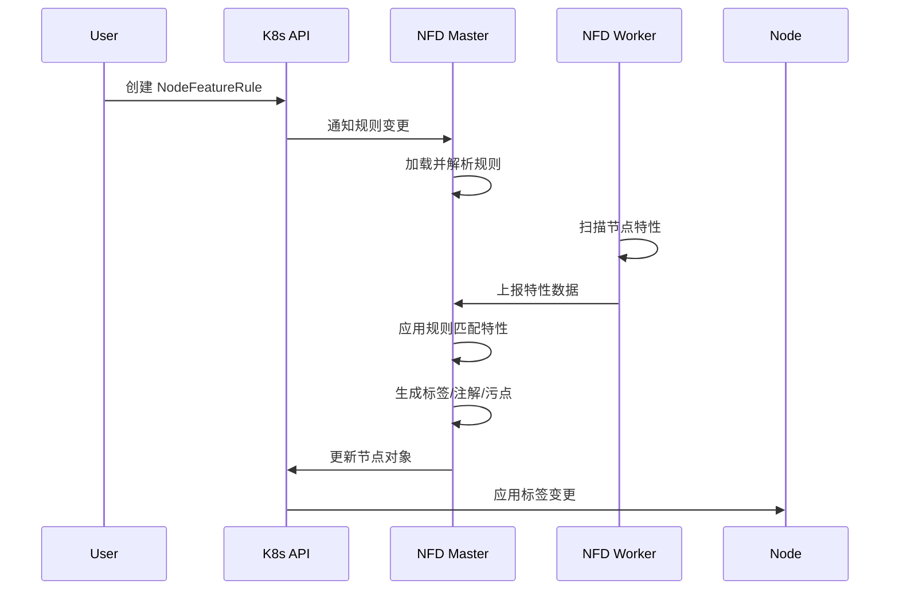

## 前言

`NodeFeatureRule`是`Node Feature Discovery`（`NFD`）最强大的功能之一，它提供了一个灵活的规则引擎，允许用户基于节点的硬件特性和系统配置定义自定义的标签规则。通过`NodeFeatureRule`，可以将底层的硬件特性转换为高层次的语义化标签，从而简化应用的调度配置。本文将深入介绍`NodeFeatureRule`的配置和使用方法。

## NodeFeatureRule工作原理

`NodeFeatureRule`是一个自定义资源（`CRD`），用于定义基于节点特性的标签规则。`nfd-master`会监听`NodeFeatureRule`对象的变化，并根据规则处理`nfd-worker`上报的特性数据。

### 工作流程



工作步骤：

1. 用户创建`NodeFeatureRule`对象
2. `nfd-master`监听到新的规则
3. `nfd-worker`定期扫描并上报节点特性
4. `nfd-master`根据规则匹配特性
5. 如果匹配成功，应用规则定义的标签、注解、扩展资源或污点
6. 更新节点对象

## 基本结构

`NodeFeatureRule`的完整结构：

```yaml
apiVersion: nfd.k8s-sigs.io/v1alpha1
kind: NodeFeatureRule
metadata:
  name: my-sample-rule
spec:
  rules:
    - name: "rule description"
      # 输出配置
      labels:
        "label-key": "label-value"
      labelsTemplate: |
        {{ range .feature }}...{{ end }}
      annotations:
        "annotation-key": "annotation-value"
      extendedResources:
        "resource-name": "resource-quantity"
      taints:
        - key: "taint-key"
          value: "taint-value"
          effect: NoSchedule
      vars:
        "var-name": "var-value"
      varsTemplate: |
        {{ range .feature }}...{{ end }}
      
      # 匹配条件
      matchFeatures:
        - feature: <feature-name>
          matchExpressions:
            <attribute>: {op: <operator>, value: [<values>]}
          matchName:
            op: <operator>
            value: [<values>]
      
      # 或条件
      matchAny:
        - matchFeatures:
            - feature: <feature-name>
              matchExpressions:
                <attribute>: {op: <operator>, value: [<values>]}
```

## 核心字段详解

### name字段

规则的名称，用于标识和调试：

```yaml
- name: "GPU vendor detection"
```

**最佳实践**：
- 使用描述性的名称
- 名称应该清晰说明规则的用途
- 避免使用特殊字符

### labels字段

定义要创建的节点标签，支持静态值和动态值：

```yaml
labels:
  # 静态标签
  "vendor.io/gpu": "true"
  "hardware.type": "accelerated"
  
  # 动态标签，使用 @ 引用特性值
  "vendor.io/gpu-model": "@pci.device.device"
  "kernel.version": "@kernel.version.full"
```

**动态值语法**：
- 格式：`@<feature-name>.<attribute-name>`
- 示例：`@cpu.model.vendor_id`、`@kernel.version.major`

**限制**：
- 标签键最长`63`字符
- 标签值最长`63`字符
- 必须符合`Kubernetes`标签命名规范

### labelsTemplate字段

使用`Go template`语法动态生成多个标签：

```yaml
labelsTemplate: |
  {{ range .pci.device }}
  pci-{{ .vendor }}-{{ .device }}.present=true
  {{ end }}
```

**常用模板函数**：

| 函数 | 说明 | 示例 |
|------|------|------|
| `range` | 遍历集合 | `{{ range .feature }}...{{ end }}` |
| `if` | 条件判断 | `{{ if .attribute }}...{{ end }}` |
| `len` | 获取长度 | `{{ .feature \| len }}` |
| `first` | 获取第一个元素 | `{{ .feature \| first }}` |
| `trim` | 去除空白 | `{{ .value \| trim }}` |
| `substr` | 截取子串 | `{{ .value \| substr 0 10 }}` |

**模板数据结构**：

```yaml
# Flag特性（只有名称）
.<feature-name>:
  - Name: <flag-name>

# Attribute特性（名称+值）
.<feature-name>:
  - Name: <attribute-name>
    Value: <attribute-value>

# Instance特性（多个属性）
.<feature-name>:
  - <attribute-1>: <value-1>
    <attribute-2>: <value-2>
```

**示例**：

```yaml
labelsTemplate: |
  {{ range .cpu.cpuid }}cpu-{{ .Name }}=true
  {{ end }}
  cpu-count={{ .cpu.topology | len }}
```

### annotations字段

定义要创建的节点注解：

```yaml
annotations:
  "vendor.io/gpu-driver-version": "@pci.device.driver"
  "hardware.info/detailed-spec": "Custom hardware configuration"
```

**用途**：
- 存储详细的硬件信息
- 记录检测时间戳
- 保存不适合用作标签的长文本

### extendedResources字段

定义扩展资源，可以被`Pod`请求：

```yaml
extendedResources:
  # 静态数量
  vendor.io/fpga: "4"
  
  # 动态数量，引用特性值
  vendor.io/gpu-memory: "@pci.device.memory"
```

**使用场景**：
- 自定义硬件资源（`FPGA`、专用加速器等）
- 基于硬件特性计算的资源配额
- 需要被`Kubernetes`调度器感知的资源

### taints字段

定义节点污点，用于隔离特殊节点：

```yaml
taints:
  - key: "nvidia.com/gpu"
    value: "true"
    effect: NoSchedule
  - key: "special-hardware"
    value: "fpga"
    effect: NoExecute
```

**Effect类型**：
- `NoSchedule`：新`Pod`不会调度到该节点
- `PreferNoSchedule`：尽量避免调度新`Pod`
- `NoExecute`：驱逐已有`Pod`（除非有容忍）

**启用污点功能**：

```yaml
# nfd-master ConfigMap
apiVersion: v1
kind: ConfigMap
metadata:
  name: nfd-master-conf
  namespace: node-feature-discovery
data:
  nfd-master.conf: |
    enableTaints: true
```

**注意事项**：
- 使用污点前确保`nfd-worker`能容忍该污点
- 否则`nfd-worker Pod`会被驱逐

### vars字段

定义变量，用于规则间传递信息：

```yaml
- name: "detect gpu"
  vars:
    gpu_present: "true"
    gpu_vendor: "nvidia"
  matchFeatures:
    - feature: pci.device
      matchExpressions:
        vendor: {op: In, value: ["10de"]}

- name: "use gpu variable"
  labels:
    "workload.suitable": "gpu-computing"
  matchFeatures:
    - feature: rule.matched
      matchExpressions:
        gpu_present: {op: IsTrue}
```

**用途**：
- 在规则间传递检测结果
- 构建复杂的规则层次
- 避免重复匹配逻辑

### varsTemplate字段

使用模板动态生成多个变量：

```yaml
varsTemplate: |
  {{ range .pci.device }}
  device-{{ .vendor }}-{{ .device }}=found
  {{ end }}
```

### matchFeatures字段

定义匹配条件，所有条件必须满足（逻辑`AND`）：

```yaml
matchFeatures:
  - feature: kernel.loadedmodule
    matchExpressions:
      dummy: {op: Exists}
  - feature: kernel.config
    matchExpressions:
      X86: {op: In, value: ["y"]}
  - feature: cpu.cpuid
    matchExpressions:
      AVX512F: {op: Exists}
```

**结构说明**：
- 每个`feature`项是一个特性匹配器
- 多个特性匹配器之间是`AND`关系
- 同一特性匹配器内的多个表达式也是`AND`关系

**matchExpressions语法**：

```yaml
matchExpressions:
  <attribute-name>: {op: <operator>, value: [<values>]}
```

**matchName语法**（匹配特性名称）：

```yaml
matchName:
  op: <operator>
  value: [<values>]
```

### matchAny字段

定义或条件，只需满足一个（逻辑`OR`）：

```yaml
matchAny:
  - matchFeatures:
      - feature: cpu.cpuid
        matchExpressions:
          AVX512F: {op: Exists}
  - matchFeatures:
      - feature: cpu.cpuid
        matchExpressions:
          AVX2: {op: Exists}
```

**逻辑关系**：
- `matchAny`列表中的每个元素是`OR`关系
- 每个元素内的`matchFeatures`仍然是`AND`关系

## 匹配操作符

`NodeFeatureRule`支持丰富的匹配操作符：

| 操作符 | 说明 | 值类型 | 示例 |
|-------|------|--------|------|
| `In` | 值在列表中 | 字符串列表 | `{op: In, value: ["8086", "10de"]}` |
| `NotIn` | 值不在列表中 | 字符串列表 | `{op: NotIn, value: ["bad-value"]}` |
| `InRegexp` | 值匹配正则表达式 | 正则列表 | `{op: InRegexp, value: ["^node-.*"]}` |
| `Exists` | 属性存在 | 无需值 | `{op: Exists}` |
| `DoesNotExist` | 属性不存在 | 无需值 | `{op: DoesNotExist}` |
| `Gt` | 大于 | 单个数值 | `{op: Gt, value: ["100"]}` |
| `Ge` | 大于等于 | 单个数值 | `{op: Ge, value: ["100"]}` |
| `Lt` | 小于 | 单个数值 | `{op: Lt, value: ["100"]}` |
| `Le` | 小于等于 | 单个数值 | `{op: Le, value: ["100"]}` |
| `GtLt` | 在范围内（开区间） | 两个数值 | `{op: GtLt, value: ["10", "100"]}` |
| `GeLe` | 在范围内（闭区间） | 两个数值 | `{op: GeLe, value: ["10", "100"]}` |
| `IsTrue` | 值为`true` | 无需值 | `{op: IsTrue}` |
| `IsFalse` | 值为`false` | 无需值 | `{op: IsFalse}` |

**操作符使用示例**：

```yaml
# 字符串匹配
vendor: {op: In, value: ["8086", "10de"]}
vendor: {op: InRegexp, value: ["^(8086|10de)$"]}

# 存在性检查
AVX512F: {op: Exists}
deprecated_feature: {op: DoesNotExist}

# 数值比较
major: {op: Gt, value: ["5"]}
cores: {op: GtLt, value: ["8", "64"]}

# 布尔值
enabled: {op: IsTrue}
disabled: {op: IsFalse}
```

**类型转换**：
- 数值比较操作符（`Gt`、`Lt`等）会尝试将字符串转换为整数
- 如果值包含`type: version`，则按版本号比较

```yaml
# 版本号比较
matchExpressions:
  major: {op: Gt, value: ["5"], type: version}
```

## 可用的特性类型

`NFD`提供了丰富的特性用于匹配。以下是所有可用特性的详细列表：

### CPU相关特性

#### cpu.cpuid

`CPU`指令集特性（`Flag`类型）

**常见特性**：

| 特性名称 | 说明 |
|---------|------|
| `AVX` | `Advanced Vector Extensions` |
| `AVX2` | `AVX 2.0` |
| `AVX512F` | `AVX-512`基础指令集 |
| `AVX512DQ` | `AVX-512`双字和四字指令 |
| `AVX512CD` | `AVX-512`冲突检测指令 |
| `AVX512BW` | `AVX-512`字节和字指令 |
| `AVX512VL` | `AVX-512`向量长度扩展 |
| `AVX10_VERSION` | `AVX10`版本号（`Attribute`类型） |
| `AESNI` | `AES`加密指令集 |
| `SSE` | `Streaming SIMD Extensions` |
| `SSE2` | `SSE 2.0` |
| `SSE3` | `SSE 3.0` |
| `SSE4` | `SSE 4.0` |
| `SSE42` | `SSE 4.2` |
| `SSSE3` | `Supplemental SSE3` |

**示例**：

```yaml
matchFeatures:
  - feature: cpu.cpuid
    matchExpressions:
      AVX512F: {op: Exists}
      AVX512DQ: {op: Exists}
```

#### cpu.model

`CPU`型号信息（`Attribute`类型）

| 属性名称 | 类型 | 说明 |
|---------|------|------|
| `family` | `int` | `CPU`家族 |
| `vendor_id` | `string` | 供应商`ID`（如`GenuineIntel`） |
| `id` | `int` | `CPU`型号`ID` |
| `hypervisor` | `string` | 虚拟化信息（仅`s390x`） |

**示例**：

```yaml
matchFeatures:
  - feature: cpu.model
    matchExpressions:
      family: {op: Gt, value: ["6"]}
      vendor_id: {op: In, value: ["GenuineIntel"]}
```

#### cpu.topology

`CPU`拓扑信息（`Attribute`类型）

| 属性名称 | 类型 | 说明 |
|---------|------|------|
| `hardware_multithreading` | `bool` | 是否启用超线程 |
| `socket_count` | `int` | `CPU`插槽数量 |

**示例**：

```yaml
matchFeatures:
  - feature: cpu.topology
    matchExpressions:
      hardware_multithreading: {op: IsTrue}
      socket_count: {op: Gt, value: ["1"]}
```

#### cpu.cstate

`Intel`电源管理状态（`Attribute`类型）

| 属性名称 | 类型 | 说明 |
|---------|------|------|
| `enabled` | `bool` | `C-state`是否启用 |

#### cpu.pstate

`Intel P-state`驱动状态（`Attribute`类型）

| 属性名称 | 类型 | 说明 |
|---------|------|------|
| `status` | `string` | `active`或`passive` |
| `turbo` | `bool` | 睿频是否启用 |
| `scaling` | `string` | `powersave`或`performance` |

#### cpu.rdt

`Intel RDT`资源管理技术（`Attribute`类型）

| 属性名称 | 类型 | 说明 |
|---------|------|------|
| `RDTMON` | `flag` | 监控技术 |
| `RDTCMT` | `flag` | 缓存监控 |
| `RDTMBM` | `flag` | 内存带宽监控 |
| `RDTL3CA` | `flag` | `L3`缓存分配 |
| `RDTl2CA` | `flag` | `L2`缓存分配 |
| `RDTMBA` | `flag` | 内存带宽分配 |
| `RDTL3CA_NUM_CLOSID` | `int` | `L3 CA CLOSID`数量 |

#### cpu.security

安全和可信执行环境（`Attribute`类型）

| 属性名称 | 类型 | 说明 |
|---------|------|------|
| `sgx.enabled` | `bool` | `Intel SGX`是否启用 |
| `sgx.epc` | `int` | `SGX`加密页缓存大小（字节） |
| `se.enabled` | `bool` | `IBM`安全执行是否启用 |
| `tdx.enabled` | `bool` | `Intel TDX`是否启用 |
| `tdx.total_keys` | `int` | `TDX`密钥总数 |
| `tdx.protected` | `bool` | 是否在`TDX`虚拟机中运行 |
| `sev.enabled` | `bool` | `AMD SEV`是否启用 |
| `sev.es.enabled` | `bool` | `AMD SEV-ES`是否启用 |
| `sev.snp.enabled` | `bool` | `AMD SEV-SNP`是否启用 |
| `sev.asids` | `int` | `SEV ASID`数量 |
| `sev.encrypted_state_ids` | `int` | 加密状态`ID`数量 |

**示例**：

```yaml
matchFeatures:
  - feature: cpu.security
    matchExpressions:
      sgx.enabled: {op: IsTrue}
      sgx.epc: {op: Gt, value: ["1073741824"]}  # > 1GB
```

#### cpu.sst

`Intel SST`（`Speed Select Technology`）（`Attribute`类型）

| 属性名称 | 类型 | 说明 |
|---------|------|------|
| `bf.enabled` | `bool` | 基准频率优化是否启用 |

#### cpu.coprocessor

`CPU`协处理器（`Attribute`类型）

| 属性名称 | 类型 | 说明 |
|---------|------|------|
| `nx_gzip` | `bool` | `Nest`加速器`GZIP`支持 |

### 内核相关特性

#### kernel.config

内核配置选项（`Attribute`类型）

**示例**：

```yaml
matchFeatures:
  - feature: kernel.config
    matchExpressions:
      X86: {op: In, value: ["y"]}
      SECURITY_SELINUX: {op: In, value: ["y"]}
      NUMA: {op: Exists}
```

#### kernel.loadedmodule

已加载的内核模块（`Flag`类型）

**示例**：

```yaml
matchFeatures:
  - feature: kernel.loadedmodule
    matchExpressions:
      veth: {op: Exists}
      br_netfilter: {op: Exists}
```

#### kernel.enabledmodule

已加载或内建的模块（`Flag`类型）

#### kernel.selinux

`SELinux`状态（`Attribute`类型）

| 属性名称 | 类型 | 说明 |
|---------|------|------|
| `enabled` | `bool` | `SELinux`是否处于强制模式 |

#### kernel.version

内核版本信息（`Attribute`类型）

| 属性名称 | 类型 | 说明 |
|---------|------|------|
| `full` | `string` | 完整版本号 |
| `major` | `int` | 主版本号 |
| `minor` | `int` | 次版本号 |
| `revision` | `int` | 修订号 |

**示例**：

```yaml
matchFeatures:
  - feature: kernel.version
    matchExpressions:
      major: {op: Ge, value: ["5"]}
      minor: {op: Ge, value: ["10"]}
```

### 内存相关特性

#### memory.numa

`NUMA`节点信息（`Attribute`类型）

| 属性名称 | 类型 | 说明 |
|---------|------|------|
| `is_numa` | `bool` | 是否为`NUMA`架构 |
| `node_count` | `int` | `NUMA`节点数量 |

**示例**：

```yaml
matchFeatures:
  - feature: memory.numa
    matchExpressions:
      is_numa: {op: IsTrue}
      node_count: {op: Gt, value: ["1"]}
```

#### memory.nv

`NVDIMM`设备（`Instance`类型）

| 属性名称 | 类型 | 说明 |
|---------|------|------|
| `devtype` | `string` | 设备类型 |
| `mode` | `string` | 工作模式 |

#### memory.swap

交换分区（`Attribute`类型）

| 属性名称 | 类型 | 说明 |
|---------|------|------|
| `enabled` | `bool` | 是否配置了交换分区 |

#### memory.hugepages

大页支持（`Attribute`类型）

| 属性名称 | 类型 | 说明 |
|---------|------|------|
| `enabled` | `bool` | 是否配置了大页 |
| `hugepages-<size>` | `string` | 特定大小的大页数量 |

**示例**：

```yaml
matchFeatures:
  - feature: memory.hugepages
    matchExpressions:
      enabled: {op: IsTrue}
      hugepages-1Gi: {op: Gt, value: ["0"]}
```

### 网络相关特性

#### network.device

物理网络接口（`Instance`类型）

| 属性名称 | 类型 | 说明 |
|---------|------|------|
| `name` | `string` | 接口名称 |
| `operstate` | `string` | 操作状态（`up`/`down`） |
| `speed` | `string` | 速率（`Mbps`） |
| `sriov_numvfs` | `string` | 已创建的`VF`数量 |
| `sriov_totalvfs` | `string` | 最大`VF`数量 |
| `mtu` | `string` | `MTU`大小 |

**示例**：

```yaml
matchFeatures:
  - feature: network.device
    matchExpressions:
      sriov_totalvfs: {op: Gt, value: ["0"]}
      speed: {op: Ge, value: ["10000"]}  # >= 10Gbps
```

#### network.virtual

虚拟网络接口（`Instance`类型）

| 属性名称 | 类型 | 说明 |
|---------|------|------|
| `name` | `string` | 接口名称 |
| `operstate` | `string` | 操作状态 |
| `speed` | `string` | 速率 |
| `mtu` | `string` | `MTU`大小 |

### PCI设备特性

#### pci.device

`PCI`设备（`Instance`类型）

| 属性名称 | 类型 | 说明 |
|---------|------|------|
| `class` | `string` | 设备类别（如`0300`为显卡） |
| `vendor` | `string` | 供应商`ID`（如`10de`为`NVIDIA`） |
| `device` | `string` | 设备`ID` |
| `subsystem_vendor` | `string` | 子系统供应商`ID` |
| `subsystem_device` | `string` | 子系统设备`ID` |
| `sriov_totalvfs` | `string` | 最大`VF`数量 |
| `iommu_group/type` | `string` | `IOMMU`组类型 |
| `iommu/intel-iommu/version` | `string` | `Intel IOMMU`版本 |

**常见设备类别**：

| 类别代码 | 说明 |
|---------|------|
| `0200` | 网络控制器 |
| `0300` | 显示控制器（`GPU`） |
| `0302` | `3D`控制器 |
| `0108` | `NVMe`控制器 |
| `1200` | 处理加速器（`FPGA`等） |

**常见供应商ID**：

| 供应商ID | 厂商 |
|---------|------|
| `10de` | `NVIDIA` |
| `1002` | `AMD` |
| `8086` | `Intel` |
| `15b3` | `Mellanox` |
| `10ee` | `Xilinx` |

**示例**：

```yaml
# 检测NVIDIA GPU
matchFeatures:
  - feature: pci.device
    matchExpressions:
      vendor: {op: In, value: ["10de"]}
      class: {op: In, value: ["0300", "0302"]}

# 检测NVMe设备
matchFeatures:
  - feature: pci.device
    matchExpressions:
      class: {op: In, value: ["0108"]}
```

### 存储相关特性

#### storage.block

块存储设备（`Instance`类型）

| 属性名称 | 类型 | 说明 |
|---------|------|------|
| `name` | `string` | 设备名称 |
| `dax` | `string` | 是否支持直接访问 |
| `rotational` | `string` | 是否为机械硬盘 |
| `nr_zones` | `string` | 分区数量 |
| `zoned` | `string` | 是否为分区设备 |

**示例**：

```yaml
# 检测SSD
matchFeatures:
  - feature: storage.block
    matchExpressions:
      rotational: {op: In, value: ["0"]}
```

### USB设备特性

#### usb.device

`USB`设备（`Instance`类型）

| 属性名称 | 类型 | 说明 |
|---------|------|------|
| `class` | `string` | 设备类别 |
| `vendor` | `string` | 供应商`ID` |
| `device` | `string` | 设备`ID` |
| `serial` | `string` | 序列号 |

**示例**：

```yaml
matchFeatures:
  - feature: usb.device
    matchExpressions:
      vendor: {op: In, value: ["2c7c"]}  # Quectel
      class: {op: In, value: ["02"]}     # CDC设备
```

### 系统相关特性

#### system.osrelease

操作系统信息（`Attribute`类型）

来自`/etc/os-release`的所有字段都可用，常见的有：

| 属性名称 | 类型 | 说明 |
|---------|------|------|
| `ID` | `string` | 系统`ID`（如`ubuntu`） |
| `VERSION_ID` | `string` | 版本号 |
| `NAME` | `string` | 系统名称 |
| `PRETTY_NAME` | `string` | 友好名称 |

**示例**：

```yaml
matchFeatures:
  - feature: system.osrelease
    matchExpressions:
      ID: {op: In, value: ["ubuntu", "debian"]}
      VERSION_ID: {op: InRegexp, value: ["^(20|22)\\."]}
```

#### system.dmiid

`DMI`（`Desktop Management Interface`）信息（`Attribute`类型）

| 属性名称 | 类型 | 说明 |
|---------|------|------|
| `sys_vendor` | `string` | 系统供应商 |
| `product_name` | `string` | 产品名称 |

**示例**：

```yaml
matchFeatures:
  - feature: system.dmiid
    matchExpressions:
      sys_vendor: {op: In, value: ["Dell Inc.", "HP"]}
```

#### system.name

系统名称（`Attribute`类型）

| 属性名称 | 类型 | 说明 |
|---------|------|------|
| `nodename` | `string` | `Kubernetes`节点名称 |

### Local特性

#### local.label

本地标签（`Attribute`类型）

来自本地特性文件（`/etc/kubernetes/node-feature-discovery/features.d/`）的标签。

#### local.feature

本地特性（`Attribute`类型）

来自本地特性文件的特性（使用`#+no-label`标记的）。

### Rule特性

#### rule.matched

前序规则匹配结果（`Attribute`类型）

用于引用前面规则定义的标签和变量：

```yaml
- name: "first rule"
  vars:
    has_gpu: "true"
  matchFeatures:
    - feature: pci.device
      matchExpressions:
        vendor: {op: In, value: ["10de"]}

- name: "second rule"
  labels:
    "gpu-node": "true"
  matchFeatures:
    - feature: rule.matched
      matchExpressions:
        has_gpu: {op: IsTrue}
```

## 实战示例

### 示例1：GPU型号精确检测

根据`PCI`设备`ID`精确识别`GPU`型号：

```yaml
apiVersion: nfd.k8s-sigs.io/v1alpha1
kind: NodeFeatureRule
metadata:
  name: nvidia-gpu-models
spec:
  rules:
    - name: "nvidia a100 40gb"
      labels:
        "nvidia.com/gpu.product": "A100-SXM4-40GB"
        "nvidia.com/gpu.memory": "40gb"
        "nvidia.com/gpu.architecture": "ampere"
      matchFeatures:
        - feature: pci.device
          matchExpressions:
            vendor: {op: In, value: ["10de"]}
            device: {op: In, value: ["20b0"]}

    - name: "nvidia a100 80gb"
      labels:
        "nvidia.com/gpu.product": "A100-SXM4-80GB"
        "nvidia.com/gpu.memory": "80gb"
        "nvidia.com/gpu.architecture": "ampere"
      matchFeatures:
        - feature: pci.device
          matchExpressions:
            vendor: {op: In, value: ["10de"]}
            device: {op: In, value: ["20b2"]}

    - name: "nvidia v100"
      labels:
        "nvidia.com/gpu.product": "V100-SXM2-16GB"
        "nvidia.com/gpu.memory": "16gb"
        "nvidia.com/gpu.architecture": "volta"
      matchFeatures:
        - feature: pci.device
          matchExpressions:
            vendor: {op: In, value: ["10de"]}
            device: {op: In, value: ["1db4", "1db5", "1db6"]}

    - name: "nvidia t4"
      labels:
        "nvidia.com/gpu.product": "Tesla-T4"
        "nvidia.com/gpu.memory": "16gb"
        "nvidia.com/gpu.architecture": "turing"
      matchFeatures:
        - feature: pci.device
          matchExpressions:
            vendor: {op: In, value: ["10de"]}
            device: {op: In, value: ["1eb8"]}
```

### 示例2：CPU性能分级

根据`CPU`特性对节点进行性能分级：

```yaml
apiVersion: nfd.k8s-sigs.io/v1alpha1
kind: NodeFeatureRule
metadata:
  name: cpu-performance-classification
spec:
  rules:
    - name: "tier-1 flagship cpu"
      labels:
        "cpu.performance.tier": "1"
        "cpu.performance.class": "flagship"
        "workload.suitable": "hpc,ai-training,database"
      matchFeatures:
        - feature: cpu.cpuid
          matchExpressions:
            AVX512F: {op: Exists}
            AVX512DQ: {op: Exists}
            AVX512CD: {op: Exists}
            AVX512BW: {op: Exists}
            AVX512VL: {op: Exists}
        - feature: cpu.topology
          matchExpressions:
            hardware_multithreading: {op: IsTrue}
        - feature: cpu.model
          matchExpressions:
            family: {op: Ge, value: ["6"]}

    - name: "tier-2 performance cpu"
      labels:
        "cpu.performance.tier": "2"
        "cpu.performance.class": "performance"
        "workload.suitable": "general-compute,web-server"
      matchFeatures:
        - feature: cpu.cpuid
          matchExpressions:
            AVX2: {op: Exists}
            AVX512F: {op: DoesNotExist}
        - feature: cpu.topology
          matchExpressions:
            hardware_multithreading: {op: IsTrue}

    - name: "tier-3 standard cpu"
      labels:
        "cpu.performance.tier": "3"
        "cpu.performance.class": "standard"
        "workload.suitable": "batch-job,cache"
      matchFeatures:
        - feature: cpu.cpuid
          matchExpressions:
            AVX: {op: Exists}
            AVX2: {op: DoesNotExist}

    - name: "tier-4 basic cpu"
      labels:
        "cpu.performance.tier": "4"
        "cpu.performance.class": "basic"
        "workload.suitable": "logging,monitoring"
      matchFeatures:
        - feature: cpu.cpuid
          matchExpressions:
            SSE42: {op: Exists}
            AVX: {op: DoesNotExist}
```

### 示例3：高速网络设备检测

检测并分类高速网络设备：

```yaml
apiVersion: nfd.k8s-sigs.io/v1alpha1
kind: NodeFeatureRule
metadata:
  name: high-speed-network-detection
spec:
  rules:
    - name: "mellanox 100gbe"
      labels:
        "network.type": "high-speed"
        "network.speed": "100gbe"
        "network.vendor": "mellanox"
        "network.sriov": "true"
      matchFeatures:
        - feature: pci.device
          matchExpressions:
            vendor: {op: In, value: ["15b3"]}  # Mellanox
            class: {op: In, value: ["0200"]}
        - feature: network.device
          matchExpressions:
            sriov_totalvfs: {op: Gt, value: ["0"]}
            speed: {op: Ge, value: ["100000"]}

    - name: "intel 25gbe"
      labels:
        "network.type": "high-speed"
        "network.speed": "25gbe"
        "network.vendor": "intel"
      matchFeatures:
        - feature: pci.device
          matchExpressions:
            vendor: {op: In, value: ["8086"]}
            class: {op: In, value: ["0200"]}
        - feature: network.device
          matchExpressions:
            speed: {op: GeLe, value: ["25000", "100000"]}

    - name: "standard 10gbe"
      labels:
        "network.type": "standard"
        "network.speed": "10gbe"
      matchFeatures:
        - feature: network.device
          matchExpressions:
            speed: {op: GeLe, value: ["10000", "25000"]}

    - name: "basic 1gbe"
      labels:
        "network.type": "basic"
        "network.speed": "1gbe"
      matchFeatures:
        - feature: network.device
          matchExpressions:
            speed: {op: Lt, value: ["10000"]}
```

### 示例4：存储类型分类

根据存储设备特性进行分类：

```yaml
apiVersion: nfd.k8s-sigs.io/v1alpha1
kind: NodeFeatureRule
metadata:
  name: storage-classification
spec:
  rules:
    - name: "nvme ssd"
      labels:
        "storage.type": "nvme-ssd"
        "storage.performance": "ultra"
        "storage.tier": "1"
      annotations:
        "storage.description": "NVMe SSD with high IOPS"
      matchFeatures:
        - feature: pci.device
          matchExpressions:
            class: {op: In, value: ["0108"]}  # NVMe controller
        - feature: storage.block
          matchExpressions:
            rotational: {op: In, value: ["0"]}

    - name: "sata ssd"
      labels:
        "storage.type": "sata-ssd"
        "storage.performance": "high"
        "storage.tier": "2"
      matchFeatures:
        - feature: storage.block
          matchExpressions:
            rotational: {op: In, value: ["0"]}
        - feature: pci.device
          matchExpressions:
            class: {op: NotIn, value: ["0108"]}

    - name: "hdd"
      labels:
        "storage.type": "hdd"
        "storage.performance": "standard"
        "storage.tier": "3"
      matchFeatures:
        - feature: storage.block
          matchExpressions:
            rotational: {op: In, value: ["1"]}
```

### 示例5：内核版本和模块检测

检测内核版本和关键模块：

```yaml
apiVersion: nfd.k8s-sigs.io/v1alpha1
kind: NodeFeatureRule
metadata:
  name: kernel-features-detection
spec:
  rules:
    - name: "modern kernel"
      labels:
        "kernel.version.class": "modern"
        "kernel.support.level": "full"
      matchFeatures:
        - feature: kernel.version
          matchExpressions:
            major: {op: Ge, value: ["5"]}
            minor: {op: Ge, value: ["10"]}

    - name: "rdma support"
      labels:
        "kernel.feature.rdma": "true"
        "network.rdma.enabled": "true"
      matchFeatures:
        - feature: kernel.loadedmodule
          matchExpressions:
            rdma_cm: {op: Exists}
            ib_core: {op: Exists}
            mlx5_core: {op: Exists}

    - name: "ceph rbd support"
      labels:
        "storage.ceph.rbd": "true"
      matchFeatures:
        - feature: kernel.loadedmodule
          matchExpressions:
            rbd: {op: Exists}
            libceph: {op: Exists}

    - name: "ovs support"
      labels:
        "network.ovs.enabled": "true"
      matchFeatures:
        - feature: kernel.loadedmodule
          matchExpressions:
            openvswitch: {op: Exists}
```

### 示例6：安全合规检测

检测安全特性和合规性：

```yaml
apiVersion: nfd.k8s-sigs.io/v1alpha1
kind: NodeFeatureRule
metadata:
  name: security-compliance-check
spec:
  rules:
    - name: "pci-dss compliant"
      labels:
        "compliance.pci-dss": "true"
        "security.level": "high"
      taints:
        - key: "security.high"
          value: "true"
          effect: NoSchedule
      matchFeatures:
        - feature: kernel.version
          matchExpressions:
            major: {op: Ge, value: ["5"]}
        - feature: kernel.config
          matchExpressions:
            AUDIT: {op: In, value: ["y"]}
            SECURITY_SELINUX: {op: In, value: ["y"]}
        - feature: kernel.selinux
          matchExpressions:
            enabled: {op: IsTrue}

    - name: "intel sgx capable"
      labels:
        "security.intel-sgx": "true"
        "tee.available": "true"
      annotations:
        "security.sgx.epc-size": "@cpu.security.sgx.epc"
      matchFeatures:
        - feature: cpu.security
          matchExpressions:
            sgx.enabled: {op: IsTrue}
            sgx.epc: {op: Gt, value: ["0"]}

    - name: "amd sev capable"
      labels:
        "security.amd-sev": "true"
        "vm-encryption.available": "true"
      matchFeatures:
        - feature: cpu.security
          matchExpressions:
            sev.enabled: {op: IsTrue}
```

### 示例7：使用模板动态生成标签

利用模板功能批量生成标签：

```yaml
apiVersion: nfd.k8s-sigs.io/v1alpha1
kind: NodeFeatureRule
metadata:
  name: dynamic-pci-labels
spec:
  rules:
    - name: "enumerate all pci devices"
      labelsTemplate: |
        {{ range .pci.device }}
        pci.device.{{ .vendor }}-{{ .device }}.present=true
        {{ end }}
      matchFeatures:
        - feature: pci.device
          matchExpressions:
            vendor: {op: Exists}

    - name: "count gpu devices"
      labelsTemplate: |
        gpu.count={{ len .pci.device }}
        {{ $first := index .pci.device 0 }}
        gpu.primary.vendor={{ $first.vendor }}
        gpu.primary.device={{ $first.device }}
      matchFeatures:
        - feature: pci.device
          matchExpressions:
            vendor: {op: In, value: ["10de", "1002"]}  # NVIDIA or AMD
            class: {op: In, value: ["0300", "0302"]}

    - name: "network interfaces summary"
      labelsTemplate: |
        {{ $total := 0 }}
        {{ $highspeed := 0 }}
        {{ range .network.device }}
        {{ $speed := .speed | int }}
        {{ $total = add $total 1 }}
        {{ if ge $speed 10000 }}
        {{ $highspeed = add $highspeed 1 }}
        {{ end }}
        {{ end }}
        network.interfaces.total={{ $total }}
        network.interfaces.highspeed={{ $highspeed }}
      matchFeatures:
        - feature: network.device
          matchExpressions:
            name: {op: Exists}
```

### 示例8：复杂规则组合和变量传递

使用变量构建复杂的规则层次：

```yaml
apiVersion: nfd.k8s-sigs.io/v1alpha1
kind: NodeFeatureRule
metadata:
  name: advanced-node-classification
spec:
  rules:
    # 第一步：检测基础硬件
    - name: "detect-gpu"
      vars:
        has_nvidia_gpu: "true"
      matchFeatures:
        - feature: pci.device
          matchExpressions:
            vendor: {op: In, value: ["10de"]}
            class: {op: In, value: ["0300", "0302"]}

    - name: "detect-high-end-cpu"
      vars:
        has_avx512: "true"
        cpu_tier: "high"
      matchFeatures:
        - feature: cpu.cpuid
          matchExpressions:
            AVX512F: {op: Exists}
        - feature: cpu.topology
          matchExpressions:
            socket_count: {op: Ge, value: ["2"]}

    - name: "detect-fast-network"
      vars:
        has_fast_network: "true"
      matchFeatures:
        - feature: network.device
          matchExpressions:
            speed: {op: Ge, value: ["25000"]}
            sriov_totalvfs: {op: Gt, value: ["0"]}

    # 第二步：基于变量组合生成高层标签
    - name: "ai-training-node"
      labels:
        "node.workload.type": "ai-training"
        "node.tier": "premium"
      taints:
        - key: "workload.ai-training"
          value: "true"
          effect: NoSchedule
      matchFeatures:
        - feature: rule.matched
          matchExpressions:
            has_nvidia_gpu: {op: IsTrue}
            has_avx512: {op: IsTrue}
            has_fast_network: {op: IsTrue}

    - name: "ai-inference-node"
      labels:
        "node.workload.type": "ai-inference"
        "node.tier": "standard"
      matchFeatures:
        - feature: rule.matched
          matchExpressions:
            has_nvidia_gpu: {op: IsTrue}
            has_avx512: {op: DoesNotExist}

    - name: "hpc-compute-node"
      labels:
        "node.workload.type": "hpc-compute"
        "node.tier": "premium"
      matchFeatures:
        - feature: rule.matched
          matchExpressions:
            has_avx512: {op: IsTrue}
            has_fast_network: {op: IsTrue}
            has_nvidia_gpu: {op: DoesNotExist}

    - name: "general-purpose-node"
      labels:
        "node.workload.type": "general-purpose"
        "node.tier": "standard"
      matchFeatures:
        - feature: rule.matched
          matchExpressions:
            has_nvidia_gpu: {op: DoesNotExist}
            has_avx512: {op: DoesNotExist}
```

## 参考资料

- [Node Feature Discovery官方文档](https://kubernetes-sigs.github.io/node-feature-discovery/)
