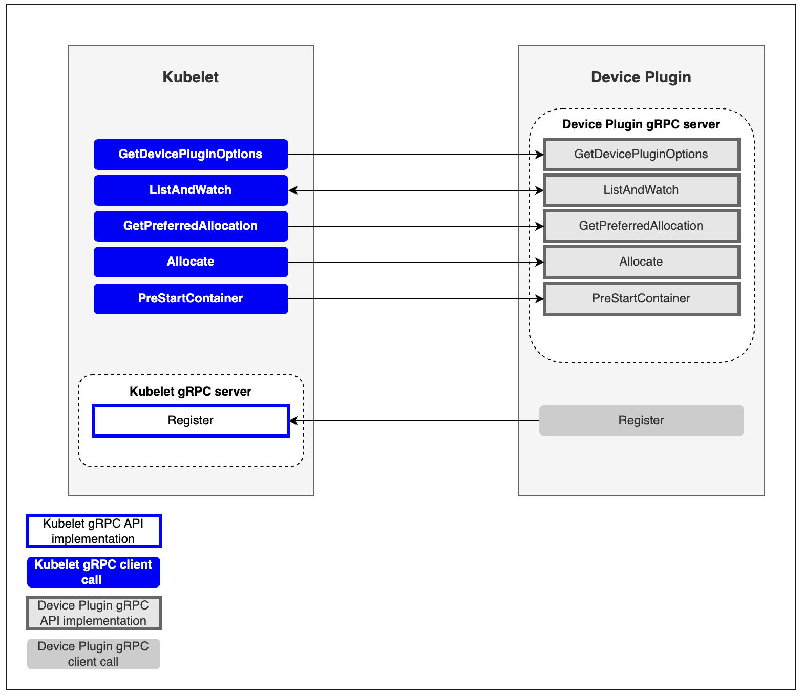
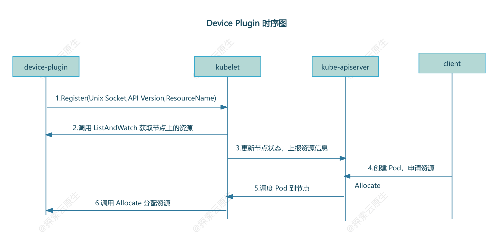

本文主要分析`kubernetes`中的`device-plugin`机制工作原理，并通过实现一个简单的`device-plugin`来加深理解。


## 1. 背景

默认情况下，`kubernetes`中的`Pod`只能申请`CPU`和`Memory`这两种资源，就像下面这样：
```yaml
resources:
  requests:
    memory: "1024Mi"
    cpu: "100m"
  limits:
    memory: "2048Mi"
    cpu: "200m"
```

随着`AI`热度越来越高，更多的业务`Pod`需要申请`GPU`资源，需要`kubernetes`能感知到节点上的`GPU`资源，就像原生的`CPU`和`Memory`资源一样使用。

实际上在早期，`K8s`也提供了一种名为`alpha.kubernetes.io/nvidia-gpu`的资源来支持`NVIDIA GPU`，不过后面也发现了很多问题，每增加一种资源都要修改`kubernetes`核心代码，`kubernetes`社区压力山大。于是在 1.8 版本引入了`device plugin`机制，通过插件形式来接入其他资源，设备厂家只需要开发对应的`device-plugin`就可以将资源接入到`kubernetes`了。

> ps：类似的还有引入`CSI`让存储插件从`Kubernetes`内部（`in-tree`）代码库中分离出来，改为独立的、可插拔的外部组件（`out-of-tree`），还有`CRI`、`CNI`等等，这里的`Device Plugin`也能算作其中的一种。

`Device Plugin`有两层含义，下文中根据语义自行区分：

*   首先它可以代表`kubernetes`中的`Device Plugin`框架
*   其次也可以代表厂家的具体实现，比如`NVIDIA/kubernetes-device-plugin`，就是用于接入`NVIDIA GPU`资源的`Device Plugin`实现

## 2. 原理

`Device Plugin`的工作原理其实不复杂，可以分为`插件注册`和`kubelet 调用插件`两部分。

*   插件注册：`DevicePlugin`启动时会想节点上的`Kubelet`发起注册，这样`Kubelet`就可以感知到该插件的存在了
*   kubelet 调用插件：注册完成后，当有`Pod`申请对于资源时，`Kubelet`就会调用该插件 API 实现具体功能

如 kubernetes 官网上的图所示：



### Kubelet 部分

为了提供该功能，`Kubelet`新增了一个`Registration gRPC service`:
```protobuf
service Registration {
	rpc Register(RegisterRequest) returns (Empty) {}
}
```

`Device Plugin`可以调用该接口向`Kubelet`进行注册，注册接口需要提供三个参数：

*   **`Device Plugin`对应的`unix socket`名字**：后续`Kubelet`根据名称找到对应的`unix socket`，并向插件发起调用
    
*   **`Device Plugin`调`API version`**：用于区分不同版本的插件
    
*   **`Device Plugin`提供的`ResourceName`**：遇到不能处理的资源申请时(`CPU`和`Memory`之外的资源)，`Kubelet`就会根据申请的资源名称来匹配对应的插件
    
    * `ResourceName`需要按照`vendor-domain/resourcetype`格式，例如`nvidia.com/gpu`。

### Device Plugin 部分

要进行设备管理，`Device Plugin`插件需要实现以下接口：

* `GetDevicePluginOptions`：这个接口用于获取设备插件的信息，可以在其返回的响应中指定一些设备插件的配置选项，可以看做是插件的元数据
    
*   **`ListAndWatch`**：该接口用于列出可用的设备并持续监视这些设备的状态变化。
    
* `GetPreferredAllocation`：将分配偏好信息提供给`Device Plugin`,以便`Device Plugin`在分配时可以做出更好的选择
    

*   **`Allocate`**：该接口用于向`Device Plugin`请求分配指定数量的设备资源。
* `PreStartContainer`： 该接口在容器启动之前调用，用于配置容器使用的设备资源。

> 只有`ListAndWatch`和`Allocate`两个接口是必须的，其他都是可以选的。

### 工作流程

一般所有的`Device Plugin`实现最终都会以`Pod`形式运行在`kubernetes`集群中，又因为需要管理所有节点，因此都会以`DaemonSet`方式部署。

`Device Plugin`启动之后第一步就是向`Kubelet`注册，让`Kubelet`知道有一个新的设备接入了。

为了能够调用`Kubelet`的`Register`接口，`Device Plugin`Pod 会将宿主机上的`kubelet.sock`文件(`unix socket`)挂载到容器中，通过`kubelet.sock`文件发起调用以实现注册。

集群部署后，`Kubelet`就会启动，开始执行`Registration gRPC`服务。

*   1）`Kubelet`启动`Registration gRPC`服务（`kubelet.sock`），提供`Register`接口
    
*   2）`Device Plugin`启动后，通过`kubelet.sock`调用`Register`接口，向`Kubelet`进行注册，注册信息包括`Device Plugin`的`unix socket`，`API Version`，`ResourceName`
    
*   3）注册成功后，`Kubelet`通过`Device Plugin`的`unix socket`调用`ListAndWatch`，获取当前节点上的资源
    
*   4）`Kubelet`向`api-server`更新节点状态来记录上一步中发现的资源
    
    *   此时`kubelet get node -oyaml`就能查看到`Node`对象的`Capacity`中多了对应的资源
    
    5）用户创建`Pod`并申请该资源，调度完成后，对应节点上的`Kubelet`调用`Device Plugin`的`Allocate`接口进行资源分配
    

大致如下：



## 3. 实现

> 源码：[https://github.com/lixd/i-device-plugin](https://github.com/lixd/i-device-plugin)

`Device Plugin`实现大致分为三部分：

*   1）启动时向`Kubelet`发起注册
    *   注意监控`kubelet`的重启，一般是使用`fsnotify`类似的库监控`kubelet.sock`的重新创建事件。如果`kubelet.sock`重新创建了，则认为`kubelet`是重启了，那么需要重新注册
*   2）`gRPC Server`：主要是实现`ListAndWatch`和`Allocate`两个方法

### 实现 gRPC Server

简单起见，这里只实现了`ListAndWatch`和`Allocate`这两个必须的方法。


#### ListAndWatch

这是一个`gRPC`的`Stream`方法，建立长连接，可以持续向`Kubelet`发送设备的信息。
```go
// ListAndWatch returns a stream of List of Devices
// Whenever a Device state change or a Device disappears, ListAndWatch
// returns the new list
func (c *GopherDevicePlugin) ListAndWatch(_ *pluginapi.Empty, srv pluginapi.DevicePlugin_ListAndWatchServer) error {
	devs := c.dm.Devices()
	klog.Infof("find devices:%s", String(devs))
	err := srv.Send(&pluginapi.ListAndWatchResponse{Devices: devs})
	if err != nil {
		return errors.WithMessage(err, "send device failed")
	}
	klog.Infoln("waiting for device update")
	for range c.dm.notify {
		devs = c.dm.Devices()
		klog.Infof("device update,new device list:%s", String(devs))
		_ = srv.Send(&pluginapi.ListAndWatchResponse{Devices: devs})
	}
	return nil
}
```

发现设备的部分代码如下：
```go
func (d *DeviceMonitor) List() error {
	err := filepath.Walk(d.path, func(path string, info fs.FileInfo, err error) error {
		if info.IsDir() {
			klog.Infof("%s is dir,skip", path)
			return nil
		}
		d.devices[info.Name()] = &pluginapi.Device{
			ID:     info.Name(),
			Health: pluginapi.Healthy,
		}
		return nil
	})
	return errors.WithMessagef(err, "walk [%s] failed", d.path)
}
```

很简单，就是遍历查看`/etc/gophers`目录下的所有文件，每个文件都会当做一个设备。

然后再启动一个`Goroutine`监控设备的变化,即`/etc/gophers`目录下文件有变化时通过 chan 发送通知,将最新的设备信息发送给`Kubelet`。
```go
func (d *DeviceMonitor) Watch() error {
	klog.Infoln("watching devices")
	w, err := fsnotify.NewWatcher()
	if err != nil {
		return errors.WithMessage(err, "new watcher failed")
	}
	defer w.Close()
	errChan := make(chan error)
	go func() {
		defer func() {
			if r := recover(); r != nil {
				errChan <- fmt.Errorf("device watcher panic:%v", r)
			}
		}()
		for {
			select {
			case event, ok := <-w.Events:
				if !ok {
					continue
				}
				klog.Infof("fsnotify device event: %s %s", event.Name, event.Op.String())
				if event.Op == fsnotify.Create {
					dev := path.Base(event.Name)
					d.devices[dev] = &pluginapi.Device{
						ID:     dev,
						Health: pluginapi.Healthy,
					}
					d.notify <- struct{}{}
					klog.Infof("find new device [%s]", dev)
				} else if event.Op&fsnotify.Remove == fsnotify.Remove {
					dev := path.Base(event.Name)
					delete(d.devices, dev)
					d.notify <- struct{}{}
					klog.Infof("device [%s] removed", dev)
				}
			case err, ok := <-w.Errors:
				if !ok {
					continue
				}
				klog.Errorf("fsnotify watch device failed:%v", err)
			}
		}
	}()
	err = w.Add(d.path)
	if err != nil {
		return fmt.Errorf("watch device error:%v", err)
	}
	return <-errChan
}
```

#### Allocate

`Allocate`则是需要告知`kubelet`怎么将设备分配给容器，这里实现比较简单，就是在对应容器中增加一个环境变量，`Gopher=$deviceId`
```go
// Allocate is called during container creation so that the Device
// Plugin can run device specific operations and instruct Kubelet
// of the steps to make the Device available in the container
func (c *GopherDevicePlugin) Allocate(_ context.Context, reqs *pluginapi.AllocateRequest) (*pluginapi.AllocateResponse, error) {
	ret := &pluginapi.AllocateResponse{}
	for _, req := range reqs.ContainerRequests {
		klog.Infof("[Allocate] received request: %v", strings.Join(req.DevicesIDs, ","))
		resp := pluginapi.ContainerAllocateResponse{
			Envs: map[string]string{
				"Gopher": strings.Join(req.DevicesIDs, ","),
			},
		}
		ret.ContainerResponses = append(ret.ContainerResponses, &resp)
	}
	return ret, nil
}
```

简单看一下`NVIDIA`的`device plugin`是怎么实现`Allocate`的。
```go
// Allocate which return list of devices.
func (plugin *NvidiaDevicePlugin) Allocate(ctx context.Context, reqs *pluginapi.AllocateRequest) (*pluginapi.AllocateResponse, error) {
	responses := pluginapi.AllocateResponse{}
	for _, req := range reqs.ContainerRequests {
		if err := plugin.rm.ValidateRequest(req.DevicesIDs); err != nil {
			return nil, fmt.Errorf("invalid allocation request for %q: %w", plugin.rm.Resource(), err)
		}
		response, err := plugin.getAllocateResponse(req.DevicesIDs)
		if err != nil {
			return nil, fmt.Errorf("failed to get allocate response: %v", err)
		}
		responses.ContainerResponses = append(responses.ContainerResponses, response)
	}
	return &responses, nil
}
```

核心其实是这个方法：
```go
// updateResponseForDeviceListEnvvar sets the environment variable for the requested devices.
func (plugin *NvidiaDevicePlugin) updateResponseForDeviceListEnvvar(response *pluginapi.ContainerAllocateResponse, deviceIDs ...string) {
	response.Envs[plugin.deviceListEnvvar] = strings.Join(deviceIDs, ",")
}
```

给容器添加了一个环境变量，`value`为设备 id，具体`deviceID`提供了两种测量，可能是编号或者`uuid`。
```go
const (
	DeviceIDStrategyUUID  = "uuid"
	DeviceIDStrategyIndex = "index"
)
```

`key`是一个变量`plugin.deviceListEnvvar`，初始化如下:
```go
plugin := NvidiaDevicePlugin{
  deviceListEnvvar:     "NVIDIA_VISIBLE_DEVICES",
  socket:               pluginPath + ".sock",
  // ...
}
```

也就是说`NVIDIA`的`device plugin`实现`Allocate`主要就是给容器增加了环境变量，例如：
```ini
NVIDIA_VISIBLE_DEVICES=GPU-03f69c50-207a-2038-9b45-23cac89cb67d
```

或者
```ini
NVIDIA_VISIBLE_DEVICES=1,2
```

`GPU Operator`会使用`NVIDIA Container Toolit Installer`安装`NVIDIA Container Toolit`。

这个`NVIDIA Container Toolit`的作用就是添加对`GPU`的支持，也包括了识别`NVIDIA_VISIBLE_DEVICES`这个环境变量，然后将对应设备挂载到容器里。

除此之外还会把设备挂载到容器里：
```go
func (plugin *NvidiaDevicePlugin) apiDeviceSpecs(devRoot string, ids []string) []*pluginapi.DeviceSpec {
	optional := map[string]bool{
		"/dev/nvidiactl":        true,
		"/dev/nvidia-uvm":       true,
		"/dev/nvidia-uvm-tools": true,
		"/dev/nvidia-modeset":   true,
	}
	paths := plugin.rm.GetDevicePaths(ids)
	var specs []*pluginapi.DeviceSpec
	for _, p := range paths {
		if optional[p] {
			if _, err := os.Stat(p); err != nil {
				continue
			}
		}
		spec := &pluginapi.DeviceSpec{
			ContainerPath: p,
			HostPath:      filepath.Join(devRoot, p),
			Permissions:   "rw",
		}
		specs = append(specs, spec)
	}
	return specs
}
```

核心为：
```go
spec := &pluginapi.DeviceSpec{
  ContainerPath: p,
  HostPath:      filepath.Join(devRoot, p),
  Permissions:   "rw",
}
```

这里指定了设备在宿主机上的`Path`和挂载到容器之后的`Path`，后续就可以根据这些信息进行设备挂载了。

实际上`device plugin`提供了多种方法来完成设备分配，实现时只需要根据具体情况选择其中一种即可：

*   Env
*   Mounts
*   Devices
*   Annotations
*   CDIDevices

比如`nvidia device plugin`在实现时就同时使用了`Env`和`Devices`方式。

又比如 [ix-device-plugin](https://github.com/Deep-Spark/ix-device-plugin/blob/master/pkg/dpm/plugin.go#L144-L156) 就是用的`Devices`方式,直接指定分配给容器的设备在宿主机的位置，以及要挂载到容器中的位置：
```go
func (p *iluvatarDevicePlugin) allocateDevicesByDeviceID(hostminor uint, num int) *pluginapi.DeviceSpec {
	var device pluginapi.DeviceSpec
	hostPathPrefix := "/dev/"
	containerPathPrefix := "/dev/"
	// Expose the device node for iluvatar pod.
	device.HostPath = hostPathPrefix + deviceName + strconv.Itoa(int(hostminor))
	device.ContainerPath = containerPathPrefix + deviceName + strconv.Itoa(num)
	device.Permissions = "rw"
	return &device
}
```

#### 其他方法

另外几个方法非强制的，因此只做一个空实现。
```go
// GetDevicePluginOptions returns options to be communicated with Device
// Manager
func (c *GopherDevicePlugin) GetDevicePluginOptions(_ context.Context, _ *pluginapi.Empty) (*pluginapi.DevicePluginOptions, error) {
	return &pluginapi.DevicePluginOptions{PreStartRequired: true}, nil
}
// GetPreferredAllocation returns a preferred set of devices to allocate
// from a list of available ones. The resulting preferred allocation is not
// guaranteed to be the allocation ultimately performed by the
// devicemanager. It is only designed to help the devicemanager make a more
// informed allocation decision when possible.
func (c *GopherDevicePlugin) GetPreferredAllocation(_ context.Context, _ *pluginapi.PreferredAllocationRequest) (*pluginapi.PreferredAllocationResponse, error) {
	return &pluginapi.PreferredAllocationResponse{}, nil
}
// PreStartContainer is called, if indicated by Device Plugin during registeration phase,
// before each container start. Device plugin can run device specific operations
// such as reseting the device before making devices available to the container
func (c *GopherDevicePlugin) PreStartContainer(_ context.Context, _ *pluginapi.PreStartContainerRequest) (*pluginapi.PreStartContainerResponse, error) {
	return &pluginapi.PreStartContainerResponse{}, nil
}
```

### 向 Kubelet 进行注册

注册也是很简单，调用`deviceplugin`提供的`RegisterRequest`方法即可。
```go
// Register registers the device plugin for the given resourceName with Kubelet.
func (c *GopherDevicePlugin) Register() error {
	conn, err := connect(pluginapi.KubeletSocket, common.ConnectTimeout)
	if err != nil {
		return errors.WithMessagef(err, "connect to %s failed", pluginapi.KubeletSocket)
	}
	defer conn.Close()
	client := pluginapi.NewRegistrationClient(conn)
	reqt := &pluginapi.RegisterRequest{
		Version:      pluginapi.Version,
		Endpoint:     path.Base(common.DeviceSocket),
		ResourceName: common.ResourceName,
	}
	_, err = client.Register(context.Background(), reqt)
	if err != nil {
		return errors.WithMessage(err, "register to kubelet failed")
	}
	return nil
}
```

### 监控 kubelet.sock 状态

使用`fsnotify`库监控`kubelet.sock`文件状态，通过`kubelet.sock`文件的变化来判断`kubelet`是否重启，当`kubelet`重启后`device plugin`也需要重启，然后注册到新的`kubelet.sock`。
```go
// WatchKubelet restart device plugin when kubelet restarted
func WatchKubelet(stop chan<- struct{}) error {
	watcher, err := fsnotify.NewWatcher()
	if err != nil {
		return errors.WithMessage(err, "Unable to create fsnotify watcher")
	}
	defer watcher.Close()
	go func() {
		// Start listening for events.
		for {
			select {
			case event, ok := <-watcher.Events:
				if !ok {
					continue
				}
				klog.Infof("fsnotify events: %s %v", event.Name, event.Op.String())
				if event.Name == pluginapi.KubeletSocket && event.Op == fsnotify.Create {
					klog.Warning("inotify: kubelet.sock created, restarting.")
					stop <- struct{}{}
				}
			case err, ok := <-watcher.Errors:
				if !ok {
					continue
				}
				klog.Errorf("fsnotify failed restarting,detail:%v", err)
			}
		}
	}()
	// watch kubelet.sock
	err = watcher.Add(pluginapi.KubeletSocket)
	if err != nil {
		return errors.WithMessagef(err, "Unable to add path %s to watcher", pluginapi.KubeletSocket)
	}
	return nil
}
```

#### 为什么需要重新注册

因为`Kubelet`中使用一个 map 来存储注册的插件，因此每次`Kubelet`重启都会丢失，所以我们在实现`device plugin`时就要监控`Kubelet`重启状态并重新注册。

[Kubelet Register 方法](https://github.com/kubernetes/kubernetes/blob/master/pkg/kubelet/cm/devicemanager/plugin/v1beta1/server.go#L143-L165) 实现如下：
```go
// /pkg/kubelet/cm/devicemanager/plugin/v1beta1/server.go#L143-L165
func (s *server) Register(ctx context.Context, r *api.RegisterRequest) (*api.Empty, error) {
	klog.InfoS("Got registration request from device plugin with resource", "resourceName", r.ResourceName)
	metrics.DevicePluginRegistrationCount.WithLabelValues(r.ResourceName).Inc()
	if !s.isVersionCompatibleWithPlugin(r.Version) {
		err := fmt.Errorf(errUnsupportedVersion, r.Version, api.SupportedVersions)
		klog.InfoS("Bad registration request from device plugin with resource", "resourceName", r.ResourceName, "err", err)
		return &api.Empty{}, err
	}
	if !v1helper.IsExtendedResourceName(core.ResourceName(r.ResourceName)) {
		err := fmt.Errorf(errInvalidResourceName, r.ResourceName)
		klog.InfoS("Bad registration request from device plugin", "err", err)
		return &api.Empty{}, err
	}
	if err := s.connectClient(r.ResourceName, filepath.Join(s.socketDir, r.Endpoint)); err != nil {
		klog.InfoS("Error connecting to device plugin client", "err", err)
		return &api.Empty{}, err
	}
	return &api.Empty{}, nil
}
```

核心在`connectClient`方法：
```go
// /pkg/kubelet/cm/devicemanager/plugin/v1beta1/server.go#L143-L165
func (s *server) connectClient(name string, socketPath string) error {
	c := NewPluginClient(name, socketPath, s.chandler)
	s.registerClient(name, c)
	if err := c.Connect(); err != nil {
		s.deregisterClient(name)
		klog.ErrorS(err, "Failed to connect to new client", "resource", name)
		return err
	}
	go func() {
		s.runClient(name, c)
	}()
	return nil
}
```

怎么保存这个`client`呢?
```go
func (s *server) registerClient(name string, c Client) {
	s.mutex.Lock()
	defer s.mutex.Unlock()
	s.clients[name] = c
	klog.V(2).InfoS("Registered client", "name", name)
}
```

定义如下：
```go
// /pkg/kubelet/cm/devicemanager/plugin/v1beta1/server.go#L143-L165
type server struct {
	socketName string
	socketDir  string
	mutex      sync.Mutex
	wg         sync.WaitGroup
	grpc       *grpc.Server
	rhandler   RegistrationHandler
	chandler   ClientHandler
	clients    map[string]Client // 使用 map 存储，并为持久化
}
```

### main.go

`main`方法分为三个部分：

*   1）启动`gRPC`服务
*   2）向`Kubelet`进行注册
*   3）监控`kubelet.sock`状态
```go
func main() {
	klog.Infof("device plugin starting")
	dp := device_plugin.NewGopherDevicePlugin()
	go dp.Run()
	// register when device plugin start
	if err := dp.Register(); err != nil {
		klog.Fatalf("register to kubelet failed: %v", err)
	}
	// watch kubelet.sock,when kubelet restart,exit device plugin,then will restart by DaemonSet
	stop := make(chan struct{})
	err := utils.WatchKubelet(stop)
	if err != nil {
		klog.Fatalf("start to kubelet failed: %v", err)
	}
	<-stop
	klog.Infof("kubelet restart,exiting")
}
```

## 4. 测试


### 部署

首先是部署`i-device-plugin`，一般使用`DaemonSet`方式部署，完整 yaml 如下：
```yaml
apiVersion: apps/v1
kind: DaemonSet
metadata:
  name: i-device-plugin
  namespace: kube-system
  labels:
    app: i-device-plugin
spec:
  selector:
    matchLabels:
      app: i-device-plugin
  template:
    metadata:
      labels:
        app: i-device-plugin
    spec:
      containers:
        - name: i-device-plugin
          image: docker.io/lixd96/i-device-plugin:latest
          imagePullPolicy: IfNotPresent
          resources:
            limits:
              cpu: "1"
              memory: "512Mi"
            requests:
              cpu: "0.1"
              memory: "128Mi"
          volumeMounts:
            - name: device-plugin
              mountPath: /var/lib/kubelet/device-plugins
            - name: gophers
              mountPath: /etc/gophers
      volumes:
        - name: device-plugin
          hostPath:
            path: /var/lib/kubelet/device-plugins
        - name: gophers
          hostPath:
            path: /etc/gophers
```

以`hostPath`方式将用到的两个目录挂载到`Pod`里：

*  `/var/lib/kubelet/device-plugins`：请求`kubelet.sock`发起调用，同时将`device-plugin`gRPC 服务的 sock 文件写入该目录供`kubelet`调用
*  `/etc/gophers`：在该 Demo 中，把`/etc/gophers`目录下的文件作为设备，因此需要将其挂载到 Pod 里。

确保`i-device-plugin`已经启动。
```bash
[root@test ~]# kubectl -n kube-system get po
i-device-plugin-vnw6z            1/1     Running   0          17s
```

### 初始化

在该 Demo 中，把`/etc/gophers`目录下的文件作为设备，因此我们只需要到`/etc/gophers`目录下创建文件，模拟有新的设备接入即可。
```bash
mkdir /etc/gophers
touch /etc/gophers/g1
```

查看`device plugin`日志
```bash
[root@test ~]# kubectl -n kube-system logs -f i-device-plugin-vnw6z
I0719 13:52:24.674737       1 main.go:10] device plugin starting
I0719 13:52:24.675440       1 device_monitor.go:33] /etc/gophers is dir,skip
I0719 13:52:24.675679       1 device_monitor.go:49] watching devices
I0719 13:52:24.682141       1 api.go:22] find devices []
I0719 13:52:24.682315       1 api.go:29] waiting for device update
I0719 13:53:09.369381       1 device_monitor.go:70] fsnotify device event: /etc/gophers/g1 CREATE
I0719 13:53:09.370394       1 device_monitor.go:79] find new device [g1]
I0719 13:53:09.370445       1 device_monitor.go:70] fsnotify device event: /etc/gophers/g1 CHMOD
I0719 13:53:09.370659       1 api.go:32] device update,new device list [g1]
```

可以看到，已经感知到新增的设备了。

不出意外的话可以在`node`上看到新资源了
```bash
[root@test gophers]# k get node n1 -oyaml|grep  capacity -A 7
  capacity:
    cpu: "4"
    ephemeral-storage: 20960236Ki
    hugepages-1Gi: "0"
    hugepages-2Mi: "0"
    lixueduan.com/gopher: "1"
    memory: 8154984Ki
    pods: "110"
```

果然，`node capacity`中新增了`lixueduan.com/gopher: "1"`。

### 创建测试 Pod

接下来创建一个 Pod 申请该资源试试
```yaml
apiVersion: v1
kind: Pod
metadata:
  name: gopher-pod
spec:
  containers:
  - name: gopher-container
    image: busybox
    command: ["sh", "-c", "echo Hello, Kubernetes! && sleep 3600"]
    resources:
      requests:
        lixueduan.com/gopher: "1"
      limits:
        lixueduan.com/gopher: "1"
```

Pod 启动成功
```bash
[root@test ~]# kubectl get po
NAME         READY   STATUS    RESTARTS   AGE
gopher-pod   1/1     Running   0          27s
```

之前分配设备是添加`Gopher=xxx`这个环境变量，现在看下是否正常分配
```bash
[root@test ~]# kubectl exec -it gopher-pod -- env|grep Gopher
Gopher=g1
```

ok,环境变量存在，可以看到分配给该`Pod`的设备是`g1`。

### 新增设备

使用同样的`yaml`改下名称再创建一个 Pod
```bash
[root@test ~]# k get po
NAME          READY   STATUS    RESTARTS   AGE
gopher-pod    1/1     Running   0          3m9s
gopher-pod2   0/1     Pending   0          2s
```

因为只有一个`gopher`资源，因此第二个`Pod`pending`了。
```bash
Events:
  Type     Reason            Age   From               Message
  ----     ------            ----  ----               -------
  Warning  FailedScheduling  7s    default-scheduler  0/1 nodes are available: 1 Insufficient lixueduan.com/gopher. preemption: 0/1 nodes are available: 1 No preemption victims found for incoming pod..
```

在创建一个设备
```bash
touch /etc/gophers/g2
```

device plugin 立马感知到了设备变化,相关日志如下：
```bash
I0719 14:01:00.308599       1 device_monitor.go:70] fsnotify device event: /etc/gophers/g2 CREATE
I0719 14:01:00.308986       1 device_monitor.go:79] find new device [g2]
I0719 14:01:00.309017       1 device_monitor.go:70] fsnotify device event: /etc/gophers/g2 CHMOD
I0719 14:01:00.309141       1 api.go:32] device update,new device list [g2,g1]
```

`node`上的资源数量也更新为 2
```bash
[root@argo-1 ~]# k get node argo-1 -oyaml|grep  capacity -A 7
  capacity:
    cpu: "4"
    ephemeral-storage: 20960236Ki
    hugepages-1Gi: "0"
    hugepages-2Mi: "0"
    lixueduan.com/gopher: "2"
    memory: 8154984Ki
    pods: "110"
```

然后 pod2 也可以正常启动了
```bash
[root@test ~]# kubectl get po
NAME          READY   STATUS    RESTARTS   AGE
gopher-pod    1/1     Running   0          4m31s
gopher-pod2   1/1     Running   0          84s
```

### 删除设备

然后删除 g2 设备
```bash
rm -rf /etc/gophers/g2
```

device plugin 也是能正常感知到，相关日志
```bash
I0719 14:03:55.904983       1 device_monitor.go:70] fsnotify device event: /etc/gophers/g2 REMOVE
I0719 14:03:55.905203       1 device_monitor.go:84] device [g2] removed
I0719 14:03:55.905267       1 api.go:32] device update,new device list [g1]
```

查看`Node`上的资源数量更新没有
```bash
[root@test ~]# k get node argo-1 -oyaml|grep  capacity -A 7
  capacity:
    cpu: "4"
    ephemeral-storage: 20960236Ki
    hugepages-1Gi: "0"
    hugepages-2Mi: "0"
    lixueduan.com/gopher: "1"
    memory: 8154984Ki
    pods: "110"
```

对应资源也变成 1 个了，一切正常。

## 5. 小结

本文主要分析了`kubernetes`中的`Device Plugin`机制的工作原理，并实现了一个简单的`i-device-plugin`来进一步加深理解。

`Device Plugin`的工作原理其实不复杂，可以分为`插件注册`和`kubelet 调用插件`两部分：

*   插件注册：`DevicePlugin`启动时会想节点上的`Kubelet`发起注册，这样`Kubelet`就可以感知到该插件的存在了
*   `kubelet`调用插件：注册完成后，当有`Pod`申请对于资源时，`kubelet`就会调用该插件 API 实现具体功能


以下是总结的几个常见问题：

1）**device plugin 是怎么感知节点上的设备的？**

*   一般设备都会在`/dev/`目录下，比如`NVIDIA GPU`就是`/dev/nvidia0`、`/dev/nvidia1`这样，不过具体逻辑还是得硬件厂商自己实现
*   然后`device plugin`会以`DaemonSet`方式部署到所有节点，因此能发现每个节点上的设备

2）**device plugin Allocate 方法怎么实现分配设备给容器的？**

> 需要注意一点：`Allocate`方法并没有真正将设备分配给容器，因为这个时候甚至都还没创建容器，只是在该方法中可以通过 `Env`、`Mounts`、`Devices`、`Annotations`、`CDIDevices` 等不同形式来传递`要将那些设备分配给该容器`这个信息给后续组件。

这些信息传给`Kubelet`，然后`Kubelet`通过`CRI`调用`Runtime`（`Docker/Containerd`等等）真正开始创建容器。

比如`NVIDIA`在`Allocate`中就传递了`NVIDIA_VISIBLE_DEVICES`这个 Env，然后自己实现了`nvidia-container-runtime`，该 runtime 就可以根据该 Env 知道要把哪个 GPU 分配给容器，然后修改容器的 OCI Spec，最终`runC`（或者其他实现）真正创建容器时就会按照这个描述去处理。

又比如 [ix-device-plugin](https://github.com/Deep-Spark/ix-device-plugin/blob/master/pkg/dpm/plugin.go#L144-L156) 就是用的`Devices`方式,直接指定分配给容器的设备在宿主机的位置，以及要挂载到容器中的位置，这样就不需要实现自己的 `container-runtime` 了，`runC`创建容器时也能把对应设备分配给容器。

这样又引出一个小问题，既然(`ix-device-plugin`)这个实现只用`Devices`就能正常运行，那为什么`NVIDIA`实现`Devices`又实现了一个`Env`？

其实这个`Env`的实现是为了兼容非`kubernetes`环境，比如`Docker`环境：

`NVIDIA`可以在启动容器时指定`GPU`
```bash
# --gpus
docker run --gpus device=0 -it tensorflow/tensorflow:latest-gpu bash
# 或者环境变量 NVIDIA_VISIBLE_DEVICES
docker run -e NVIDIA_VISIBLE_DEVICES=0 -it tensorflow/tensorflow:latest-gpu bash
```

而`ix-device-plugin`则不行，就像这样：
```bash
sudo docker run --shm-size="32g" -it -v /usr/src:/usr/src -v /lib/modules:/lib/modules -v /dev:/dev --privileged --cap-add=ALL --pid=host corex:4.0.1
```

可以看到，需要自己使用`-v`将相关文件挂载进容器才能使用，`nvidia-container-runtime` 实则是将这部分进行了封装简化，用户只需要传一个参数即可。

3）**为什么 device plugin 要 Watch Kubelet 状态，当 Kubelet 重启后 device plugin 也要跟着重启。**

这个问题实际上可以翻译为：为什么`Kubelet`重启后，`device plugin`需要重新向`Kubelet`注册？

因为`device plugin`的注册信息`Kubelet`是存在内存中的，使用`Go`中的`Map`结构进行存储。重启后就会丢失，因此各个`device plugin`都需要重新注册。

至于为什么`device plugin`一般也会跟着重启，是因为`device plugin`在启动时会调用因此注册接口，因此感知到`Kubelet`重启了，直接让`device plugin`退出即可，然后`DaemonSet`会重新拉起 Pod，这样启动后自动调用注册接口。

## 6. 参考

- https://www.lixueduan.com/posts/kubernetes/21-device-plugin
- [kubernetes 文档：device-plugins](https://kubernetes.io/zh-cn/docs/concepts/extend-kubernetes/compute-storage-net/device-plugins/)
- [https://github.com/NVIDIA/kubernetes-device-plugin](https://github.com/NVIDIA/kubernetes-device-plugin)
- [Kubernetes开发知识–device-plugin的实现](https://www.myway5.com/index.php/2020/03/24/kubernetes-device-plugin/)
- [Kubelet Register 源码](https://github.com/kubernetes/kubernetes/blob/master/pkg/kubelet/cm/devicemanager/plugin/v1beta1/server.go#L143-L165)


