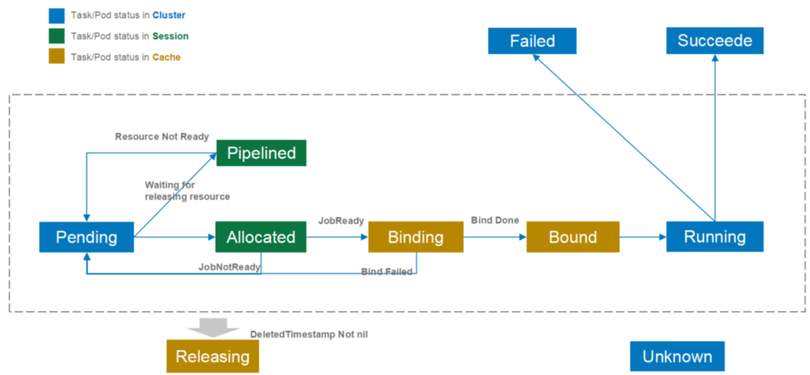

本文详细主要介绍`Volcano`中`Job`对象的关键设计以及使用，顺便介绍相关联的`Task`、`PodGroup`、`Pod`与`Task`之间的关系。关于`Job`的基础介绍，请参考`Volcano`基本介绍章节 [Volcano介绍](../1000-Volcano基本介绍.md)。


`Volcano Job`是`Volcano`调度系统中的核心工作负载对象，用于定义和管理复杂的分布式、批处理和高性能计算任务。与原生`Kubernetes Job`相比，`Volcano Job`提供了更丰富的功能和更灵活的调度策略，特别适合机器学习、大数据分析、科学计算等领域。

## 基本结构

`Volcano Job`的数据结构如下：

```yaml
apiVersion: batch.volcano.sh/v1alpha1
kind: Job
metadata:
  name: distributed-training  # 作业名称
spec:
  minAvailable: 3             # 最小可用Pod数量，作业启动所需的最小资源数量
  minSuccess: 2               # 最小成功Pod数量，任务被认为完成所需的最小成功数量
  schedulerName: volcano      # 指定使用volcano调度器
  priorityClassName: high     # 作业优先级（可选）
  queue: ai-training          # 所属队列
  maxRetry: 5                 # 最大重试次数
  ttlSecondsAfterFinished: 3600  # 作业完成后保留时间（秒）
  plugins:                    # 使用的插件
    ssh: []                   # SSH插件配置
    env: []                   # 环境变量插件配置
    svc: []                   # 服务插件配置
  policies:                   # 策略配置
    - event: PodEvicted       # 触发事件
      action: RestartJob      # 对应动作
  tasks:                      # 任务定义，一个Job可以包含多个任务
    - replicas: 1             # 副本数
      name: ps                # 任务名称
      policies:               # 任务级别策略
        - event: TaskCompleted # 触发事件
          action: CompleteJob # 对应动作
      template:               # Pod模板
        metadata:
          labels:
            role: ps
        spec:
          containers:
            - name: tensorflow
              image: tensorflow/tensorflow:2.4.0-gpu
              resources:
                limits:
                  cpu: 4
                  memory: 8Gi
                  nvidia.com/gpu: 1
    - replicas: 4             # 副本数
      name: worker            # 任务名称
      template:               # Pod模板
        metadata:
          labels:
            role: worker
        spec:
          containers:
            - name: tensorflow
              image: tensorflow/tensorflow:2.4.0-gpu
              resources:
                limits:
                  cpu: 2
                  memory: 4Gi
                  nvidia.com/gpu: 1
```


## Job、PodGroup、Task、Pod关系模型

- `Job` ← 直接管理 → `Task`（定义、创建、管理`Pod`）
- `Job` ← 创建 → `PodGroup`（调度协调）
- `PodGroup` ← 存储 → `Task`元信息（`MinTaskMember`字段）

关系模型如下：
```text
Job (控制器层面)
├── PodGroup (调度层面) - 存储Task的调度元信息
└── Tasks (逻辑分组) - Job直接管理
    └── Pods (实际资源) - 由Task创建
```


以`tensorflow-training`为例：
```text
Job (tensorflow-training)
├── PodGroup (tensorflow-training-abc123def456) [1:1关系]
│   ├── minAvailable: 4
│   ├── minTaskMember: {ps: 2, worker: 3}  ← Task信息存储在这里
│   ├── queue: default
│   └── status: Running
├── Task: ps (replicas: 2) [Job直接管理]
│   ├── Pod: tensorflow-training-ps-0
│   └── Pod: tensorflow-training-ps-1
└── Task: worker (replicas: 3) [Job直接管理]
    ├── Pod: tensorflow-training-worker-0
    ├── Pod: tensorflow-training-worker-1
    └── Pod: tensorflow-training-worker-2
```


## Job、PodGroup、Task状态

### Job状态

`Volcano Job`是一个更高级别的抽象。

`Job`的状态定义如下：

```go
// JobPhase defines the phase of the job.
type JobPhase string

const (
	// Pending is the phase that job is pending in the queue, waiting for scheduling decision
	Pending JobPhase = "Pending"
	// Aborting is the phase that job is aborted, waiting for releasing pods
	Aborting JobPhase = "Aborting"
	// Aborted is the phase that job is aborted by user or error handling
	Aborted JobPhase = "Aborted"
	// Running is the phase that minimal available tasks of Job are running
	Running JobPhase = "Running"
	// Restarting is the phase that the Job is restarted, waiting for pod releasing and recreating
	Restarting JobPhase = "Restarting"
	// Completing is the phase that required tasks of job are completed, job starts to clean up
	Completing JobPhase = "Completing"
	// Completed is the phase that all tasks of Job are completed
	Completed JobPhase = "Completed"
	// Terminating is the phase that the Job is terminated, waiting for releasing pods
	Terminating JobPhase = "Terminating"
	// Terminated is the phase that the job is finished unexpected, e.g. events
	Terminated JobPhase = "Terminated"
	// Failed is the phase that the job is restarted failed reached the maximum number of retries.
	Failed JobPhase = "Failed"
)
```

`Job`有以下几种状态：

| 状态 | 说明 | 描述 |
| --- | --- | --- |
| `Pending` | 等待中 | `Job`正在调度排队中或者已调度但不满足`spec.minMember`要求 |
| `Aborting` | 中止中 | `Job`正在被中止，等待释放`Pod` |
| `Aborted` | 已中止 | `Job`已被中止，所有`Pod`已被释放 |
| `Running` | 运行中 | `Job`中的最小可用任务正在运行 |
| `Restarting` | 重启中 | `Job`正在重启，等待`Pod`释放和重新创建 |
| `Completing` | 完成中 | `Job`的必需任务已完成，开始清理工作 |
| `Completed` | 已完成 | `Job`的所有任务都已完成 |
| `Terminating` | 终止中 | `Job`正在终止，等待释放`Pod` |
| `Terminated` | 已终止 | `Job`意外结束，如由于事件触发 |
| `Failed` | 失败 | `Job`重启失败，达到最大重试次数 |

### PodGroup状态

`PodGroup`是`Volcano`中用于管理`Pod`集合的抽象，`PodGroup`的`ownerReferences`指向`Job`。
每个`Job`生成的`PodGroup`名称是唯一的，是一对一关系，`PodGroup`名称格式为`{JobName}-{JobUID}`。

`PodGroup`的状态定义如下：

```go
// PodGroupPhase is the phase of a pod group at the current time.
type PodGroupPhase string

// These are the valid phase of podGroups.
const (
	// PodGroupPending means the pod group has been accepted by the system, but scheduler can not allocate
	// enough resources to it.
	PodGroupPending PodGroupPhase = "Pending"

	// PodGroupRunning means `spec.minMember` pods of PodGroup has been in running phase.
	PodGroupRunning PodGroupPhase = "Running"

	// PodGroupUnknown means part of `spec.minMember` pods are running but the other part can not
	// be scheduled, e.g. not enough resource; scheduler will wait for related controller to recover it.
	PodGroupUnknown PodGroupPhase = "Unknown"

	// PodGroupInqueue means controllers can start to create pods,
	// is a new state between PodGroupPending and PodGroupRunning
	PodGroupInqueue PodGroupPhase = "Inqueue"

	// PodGroupCompleted means all the pods of PodGroup are completed
	PodGroupCompleted PodGroupPhase = "Completed"
)
```

`PodGroup`有以下几种状态：

| 状态 | 说明 | 描述 |
| --- | --- | --- |
| `Pending` | 等待中 | `PodGroup`刚创建的初始状态，还未被调度器处理，此时不会创建任何`Pod` |
| `Running` | 运行中 | `PodGroup`的`spec.minMember`个`Pod`已处于运行状态 |
| `Unknown` | 未知 | 部分`spec.minMember`的`Pod`正在运行，但其他部分无法调度（如资源不足） |
| `Inqueue` | 入队 | 控制器可以开始创建`Pod`，是`Pending`和`Running`之间的新状态，处于该状态的`PodGroup`可能已经被创建出了部分`Pod` |
| `Completed` | 已完成 | `PodGroup`的所有`Pod`都已完成 |

### Task状态

`Job`直接包含一个或多个`Task`，每个`Task`可以有多个`Pod`副本，`Pod`的`ownerReferences`指向`Job`。
`Task`是`Volcano`中用于管理`Pod`集合的抽象，是一对一关系。



`Task`的状态定义如下：

```go
// TaskStatus defines the status of a task/pod.
type TaskStatus int

const (
	// Pending means the task is pending in the apiserver.
	Pending TaskStatus = 1 << iota

	// Allocated means the scheduler assigns a host to it.
	Allocated

	// Pipelined means the scheduler assigns a host to wait for releasing resource.
	Pipelined

	// Binding means the scheduler send Bind request to apiserver.
	Binding

	// Bound means the task/Pod bounds to a host.
	Bound

	// Running means a task is running on the host.
	Running

	// Releasing means a task/pod is deleted.
	Releasing

	// Succeeded means that all containers in the pod have voluntarily terminated
	// with a container exit code of 0, and the system is not going to restart any of these containers.
	Succeeded

	// Failed means that all containers in the pod have terminated, and at least one container has
	// terminated in a failure (exited with a non-zero exit code or was stopped by the system).
	Failed

	// Unknown means the status of task/pod is unknown to the scheduler.
	Unknown
)
```

`Task`有以下几种状态：

| 状态 | 说明 | 描述 |
| --- | --- | --- |
| `Pending` | 等待中 | `Task`在`apiserver`中等待处理 |
| `Allocated` | 已分配 | 调度器为`Task`分配了主机节点 |
| `Pipelined` | 流水线 | 调度器为`Task`分配了主机，等待释放资源 |
| `Binding` | 绑定中 | 调度器向`apiserver`发送绑定请求 |
| `Bound` | 已绑定 | `Task/Pod`已绑定到主机节点 |
| `Running` | 运行中 | `Task`正在主机上运行 |
| `Releasing` | 释放中 | `Task/Pod`正在被删除，释放资源 |
| `Succeeded` | 成功 | `Pod`中所有容器都以退出码`0`自愿终止，系统不会重启这些容器 |
| `Failed` | 失败 | `Pod`中所有容器都已终止，至少一个容器以非零退出码终止或被系统停止 |
| `Unknown` | 未知 | `Task/Pod`的状态对调度器来说是未知的 |

### 状态转换流程

`Job`和`PodGroup`的状态转换是紧密相关的，它们共同反映了任务在`Volcano`调度系统中的生命周期。以下是一个典型的状态转换流程：

1. **提交阶段**：
   - 用户创建一个`Volcano Job`
   - 系统自动为该`Job`创建一个对应的`PodGroup`
   - `Job`和`PodGroup`初始状态均为`Pending`

2. **入队阶段**：
   - 调度器的`enqueue action`检查`PodGroup`是否满足最小成员数要求
   - 如果满足条件，将`PodGroup`状态更新为`Inqueue`
   - 相应地，`Job`状态也会更新为`Inqueue`

3. **调度阶段**：
   - 调度器的`allocate action`为`Inqueue`状态的`PodGroup`中的`Pod`分配资源
   - 当足够数量的`Pod`被成功调度并运行后，`PodGroup`状态更新为`Running`
   - 相应地，`Job`状态也会更新为`Running`

4. **执行阶段**：
   - `Pod`在分配的节点上执行任务
   - 如果出现资源不足或其他问题，可能触发`preempt`或`reclaim action`
   - 这些`action`可能导致某些`Pod`被抢占或资源被回收

5. **完成阶段**：
   - 当所有`Pod`成功完成任务后，`PodGroup`状态更新为`Completed`
   - 相应地，`Job`状态更新为`Completed`

6. **异常处理**：
   - 如果任务执行过程中出现错误，`Job`可能转为`Failed`、`Aborted`或其他状态
   - 根据配置的生命周期策略，系统可能尝试重启任务（`Restarting`）或直接终止（`Terminating`）

理解这些状态和转换流程对于理解`Volcano`调度器的`Actions`工作原理至关重要，因为每个`Action`都是在特定的状态下对`Job`和`PodGroup`进行操作，以推动它们在生命周期中前进。


## 批量调度

`minAvailable`属性是`Volcano Job`中的核心功能之一，用于实现"批量调度"或"整体调度"机制。这一机制在分布式计算、机器学习等领域特别重要，因为这些应用通常需要多个`Pod`同时启动才能正常工作。

### 工作原理

1. **调度保证**：
   - 当设置`minAvailable=N`时，`Volcano`调度器会确保至少有`N`个`Pod`同时被调度
   - 如果集群资源不足以满足这一要求，所有`Pod`将保持在`Pending`状态，而不是部分调度

2. **PodGroup集成**：
   - `Volcano`会为每个`Job`创建一个`PodGroup`对象
   - `minAvailable`值会设置到`PodGroup`中，用于指导调度决策

3. **资源等待机制**：
   - 当资源不足时，作业将进入等待状态
   - 一旦有足够资源可以满足`minAvailable`要求，作业将被调度

### 应用场景示例

1. **分布式机器学习**：

    ```yaml
    apiVersion: batch.volcano.sh/v1alpha1
    kind: Job
    metadata:
      name: tf-training
    spec:
      minAvailable: 3  # 1个PS + 2个Worker最小要求
      tasks:
        - replicas: 1
          name: ps
        - replicas: 4
          name: worker
    ```

2. **MPI并行计算**：

    ```yaml
    apiVersion: batch.volcano.sh/v1alpha1
    kind: Job
    metadata:
      name: mpi-job
    spec:
      minAvailable: 5  # 1个Launcher + 4个Worker
      tasks:
        - replicas: 1
          name: launcher
        - replicas: 4
          name: worker
    ```

### 与其他属性的配合

- **与minSuccess的区别**：`minAvailable`关注的是**调度启动**时的最小要求，而`minSuccess`关注的是**任务成功**所需的最小成功`Pod`数量。这里的成功是指`Pod`处于`Succeeded`状态（即`Pod`内所有容器都成功终止，退出码为`0`）

- **与policies的结合**：可以配合`PodFailed`策略，当`Pod`失败导致可用`Pod`数量小于`minAvailable`时触发重启或终止操作

## 重试策略

`Volcano Job`提供了灵活的重试机制，允许用户配置在作业失败时的处理方式。这一机制对于提高分布式任务的可靠性和容错能力至关重要。

### 重试控制参数

1. **maxRetry**：
   - 定义作业失败时的最大重试次数
   - 当作业失败次数超过该值时，作业将被标记为最终失败状态
   - 默认值为`3`

2. **policies**：
   - 通过`event`和`action`对定义特定事件发生时的处理方式
   - 可以在作业级别或任务级别配置

### 支持的事件类型(event)

`Volcano`支持以下事件类型来触发重试策略：

| 事件 | 描述 | 备注 |
| :--- | :--- | :--- |
| `PodFailed` | 当`Pod`失败时触发 | 适用于容器崩溃、内存溢出等异常情况 |
| `PodEvicted` | 当`Pod`被驱逐时触发 | 适用于资源抢占、节点维护等情况 |
| `PodPending` | 当`Pod`处于等待状态时触发 | 通常与`timeout`参数配合使用，适用于检测调度卡住的情况 |
| `PodRunning` | 当`Pod`进入运行状态时触发 | 适用于监控`Pod`状态变化，可用于取消其他延迟操作 |
| `JobUnknown` (`Unknown`) | 当作业状态未知时触发 | 适用于处理异常情况，如部分Pod无法调度而其他已运行 |
| `TaskCompleted` | 当任务中所有Pod成功完成时触发 | 适用于一个任务完成后触发作业级别的动作 |
| `TaskFailed` | 当任务意外失败时触发 | 适用于检测任务级别的失败 |
| `OutOfSync` | 当`Pod`或`Job`状态更新时触发 | 系统内部事件，用于处理添加/更新/删除操作 |
| `CommandIssued` | 当用户发出命令时触发 | 系统内部事件，用于响应外部命令 |
| `JobUpdated` | 当`Job`被更新时触发 | 系统内部事件，主要用于扩容/缩容操作 |
| `*` (`AnyEvent`) | 匹配任何事件 | 通配符，可用于捕获所有类型的事件 |

### 支持的动作类型(action)

`Volcano`支持以下动作类型来处理重试：

| 动作 | 描述 | 备注 |
| :--- | :--- | :--- |
| `AbortJob` | 中止作业，但不清理资源 | 作业可以恢复 |
| `RestartJob` | 重启整个作业 | 所有`Pod`将被终止并重新创建 |
| `RestartTask` | 只重启特定任务 | 只能用于任务级别的策略 |
| `RestartPod` | 只重启特定的`Pod` | 提供更精细的重启控制 |
| `TerminateJob` | 终止作业并清理所有资源 | 作业将无法恢复 |
| `CompleteJob` | 将作业标记为完成 | 适用于关键任务完成时结束整个作业 |

### 重试策略配置示例

1. **基本重试配置**：

    ```yaml
    apiVersion: batch.volcano.sh/v1alpha1
    kind: Job
    metadata:
      name: job-retry-example
    spec:
      minAvailable: 3
      maxRetry: 5  # 最多重试五次
      policies:
        - event: PodFailed  # 当Pod失败时
          action: RestartJob  # 重启整个作业
    ```

2. **任务级别重试策略**：

    ```yaml
    apiVersion: batch.volcano.sh/v1alpha1
    kind: Job
    metadata:
      name: task-retry-example
    spec:
      minAvailable: 3
      maxRetry: 3
      tasks:
        - replicas: 1
          name: master
          policies:
            - event: PodFailed  # 当master失败时
              action: RestartJob  # 重启整个作业
        - replicas: 3
          name: worker
          policies:
            - event: PodFailed  # 当worker失败时
              action: RestartTask  # 只重启该任务
    ```

3. **带超时的重试策略**：

    ```yaml
    apiVersion: batch.volcano.sh/v1alpha1
    kind: Job
    metadata:
      name: timeout-retry-example
    spec:
      minAvailable: 3
      policies:
        - event: PodPending  # 当Pod长时间处于等待状态
          action: AbortJob  # 中止作业
          timeout: 1h  # 超过1小时后触发
    ```

### 重试策略最佳实践

1. **区分关键任务和非关键任务**：
   - 对于关键任务（如主节点）的失败，应触发`RestartJob`
   - 对于非关键任务（如工作节点）的失败，可以使用`RestartTask`或`RestartPod`

2. **考虑超时设置**：
   - 对于可能长时间卡住的情况，添加`timeout`参数
   - 超时时间应根据任务的复杂度和资源需求合理设置

3. **限制最大重试次数**：
   - `maxRetry`值不应设置过大，避免资源浪费
   - 对于大型作业，建议设置为`3-5`次

4. **与队列策略的协调**：
   - 考虑队列的`reclaimable`属性对重试策略的影响
   - 如果作业在可回收的队列中，可能需要更强大的重试策略

### 与其他特性的结合

- **与minAvailable的结合**：当`Pod`失败导致可用`Pod`数量小于`minAvailable`时，可以触发重试

- **与minSuccess的结合**：当成功的`Pod`数量无法达到`minSuccess`时，可以触发重试

- **与插件的结合**：重试时会重新应用插件配置，确保环境变量、SSH密钥等正确重新配置

## Job Plugin

`Volcano Job`支持通过`Plugin`机制扩展功能，为分布式应用提供自动化配置和资源管理能力。插件在`Job`的不同生命周期阶段自动注入额外的功能和配置，简化了分布式应用的部署和管理。

### Plugin概述

`Volcano`提供了多种内置插件：

- **基础插件**：`SSH`、`SVC`、`Env`等，提供节点间通信、服务发现和索引功能
- **框架插件**：`TensorFlow`、`PyTorch`、`MPI`、`Ray`等，为特定分布式框架提供自动化配置

### Plugin配置示例

在`Job`的`spec.plugins`字段中配置需要启用的插件：

```yaml
apiVersion: batch.volcano.sh/v1alpha1
kind: Job
metadata:
  name: example-job
spec:
  minAvailable: 3
  schedulerName: volcano
  plugins:
    ssh: []                                # SSH插件：提供无密码登录
    svc: ["--publish-not-ready-addresses=true"]  # SVC插件：提供服务发现
    env: []                                # Env插件：注入索引环境变量
    pytorch: ["--master=master", "--worker=worker"]  # PyTorch插件：配置分布式训练
  tasks:
    - replicas: 1
      name: master
      template:
        # ...
    - replicas: 2
      name: worker
      template:
        # ...
```

### 常用插件介绍

| 插件名 | 功能 | 适用场景 |
|-------|------|---------|
| `ssh` | 自动生成`SSH`密钥，实现`Pod`间无密码登录 | `MPI`、需要`SSH`通信的应用 |
| `svc` | 创建`Service`和`ConfigMap`，提供服务发现 | 所有分布式应用 |
| `env` | 注入`VC_TASK_INDEX`环境变量 | 需要感知`Pod`索引的应用 |
| `tensorflow` | 自动生成`TF_CONFIG`环境变量 | `TensorFlow`分布式训练 |
| `pytorch` | 自动配置`MASTER_ADDR`、`RANK`等环境变量 | `PyTorch`分布式训练 |
| `mpi` | 配置`MPI`主机列表和`SSH` | `MPI`并行计算 |
| `ray` | 自动配置`Ray`集群 | `Ray`分布式计算 |

关于`Plugin`的详细介绍和使用方法，请参考 [Volcano Job Plugin详解]( ./3650-Volcano%20Job%20Plugin详解.md )。


## 任务依赖关系

`Volcano Job`支持在不同任务之间定义依赖关系，这一功能在复杂的工作流程中非常有用，如数据处理管道、模型训练和评估流程等。

### 依赖关系配置

`Volcano Job`使用`dependsOn`字段定义任务之间的依赖关系：

```yaml
tasks:
  - name: task-A
    replicas: 1
    template:
      # ...
  - name: task-B
    replicas: 2
    dependsOn:
      name: ["task-A"]  # task-B依赖于task-A
    template:
      # ...
  - name: task-C
    replicas: 3
    dependsOn:
      name: ["task-A", "task-B"]  # task-C依赖于task-A和task-B
    template:
      # ...
```

### 工作原理

1. **依赖解析**：
   - `Volcano Job`控制器在创建作业时解析任务之间的依赖关系
   - 构建一个有向无环图（DAG）来表示任务执行顺序

2. **执行顺序**：
   - 只有当所有依赖的任务完成后，一个任务才会启动
   - 没有依赖关系的任务可以并行启动

3. **状态传递**：
   - 当一个任务失败时，依赖于它的任务不会启动
   - 这确保了工作流程的完整性

### 应用场景

1. **数据处理管道**：

    ```yaml
    apiVersion: batch.volcano.sh/v1alpha1
    kind: Job
    metadata:
      name: data-pipeline
    spec:
      minAvailable: 1
      tasks:
        - name: data-collection
          replicas: 1
          template:
            # ...
        - name: data-preprocessing
          replicas: 3
          dependsOn:
            name: ["data-collection"]
          template:
            # ...
        - name: model-training
          replicas: 2
          dependsOn:
            name: ["data-preprocessing"]
          template:
            # ...
    ```

2. **复杂的模型训练流程**：

    ```yaml
    apiVersion: batch.volcano.sh/v1alpha1
    kind: Job
    metadata:
      name: ml-workflow
    spec:
      minAvailable: 1
      tasks:
        - name: data-preparation
          replicas: 1
          template:
            # ...
        - name: feature-extraction
          replicas: 2
          dependsOn:
            name: ["data-preparation"]
          template:
            # ...
        - name: model-training
          replicas: 1
          dependsOn:
            name: ["feature-extraction"]
          template:
            # ...
        - name: model-evaluation
          replicas: 1
          dependsOn:
            name: ["model-training"]
          template:
            # ...
        - name: model-deployment
          replicas: 1
          dependsOn:
            name: ["model-evaluation"]
          template:
            # ...
    ```

