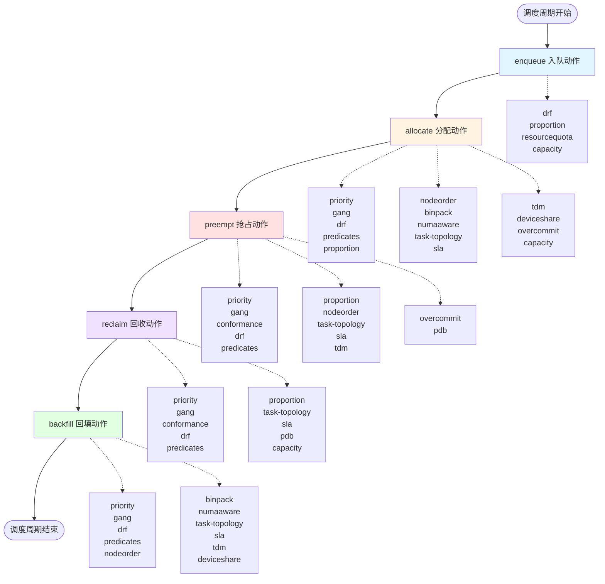

`Volcano`调度器是一个为高性能计算、机器学习和批处理工作负载设计的`Kubernetes`调度器。它的核心功能之一是通过可插拔的`Actions`(动作)和`Plugins`(插件)机制来实现灵活的调度策略。

## Actions与Plugins

这里展示了`Volcano`调度器中各个调度动作(`Action`)与插件(`Plugin`)之间的关系。每个动作会调用相应插件注册的回调函数来实现具体的调度逻辑。

### Actions概览

| 动作 | 说明 | 动作介绍 | 关联插件 |
|------|------|------|-------------|
| `enqueue` | 入队 | 将待调度的作业加入调度队列，检查作业是否满足入队条件（如资源配额、队列容量等） | `drf`, `proportion`, `resourcequota`, `capacity` |
| `allocate` | 分配 | 为作业分配资源，选择合适的节点进行任务调度，这是最核心的调度动作 | `priority`, `gang`, `drf`, `predicates`, `proportion`, `nodeorder`, `binpack`, `numaaware`, `task-topology`, `sla`, `tdm`, `deviceshare`, `overcommit`, `capacity` |
| `preempt` | 抢占 | 当资源不足时，抢占低优先级任务的资源给高优先级任务（同队列内） | `priority`, `gang`, `conformance`, `drf`, `predicates`, `proportion`, `nodeorder`, `task-topology`, `sla`, `tdm`, `overcommit`, `pdb` |
| `reclaim` | 回收 | 回收超出配额队列的资源，重新分配给资源不足的队列（跨队列） | `priority`, `gang`, `conformance`, `drf`, `predicates`, `proportion`, `task-topology`, `sla`, `pdb`, `capacity` |
| `backfill` | 回填 | 利用碎片资源调度小型任务，提高资源利用率 | `priority`, `gang`, `drf`, `predicates`, `nodeorder`, `binpack`, `numaaware`, `task-topology`, `sla`, `tdm`, `deviceshare` |

### Plugins概览

- **核心调度插件**：`priority`、`gang`、`drf`、`predicates` - 几乎参与所有调度动作
- **资源管理插件**：`proportion`、`capacity`、`resourcequota` - 负责资源配额和公平分配
- **节点选择插件**：`nodeorder`、`binpack`、`numaaware`、`task-topology` - 负责节点打分和选择
- **设备管理插件**：`deviceshare` - 负责`GPU`等特殊设备的共享调度
- **特殊场景插件**：`tdm`（时分复用）、`sla`（服务质量）、`overcommit`（超额分配）
- **保护机制插件**：`conformance`、`pdb` - 确保调度符合`Kubernetes`规范和服务可用性

| 插件 | 说明 | 关联动作 | 插件介绍 |
|------|------|----------|----------|
| `priority` | 优先级 | `allocate`, `backfill`, `preempt`, `reclaim` | 根据任务的优先级对其进行排序，确保高优先级任务先被调度 |
| `gang` | 成组调度 | `allocate`, `backfill`, `preempt`, `reclaim` | 实现成组调度，确保任务的所有成员（`Pod`）可以同时运行 |
| `conformance` | 一致性 | `preempt`, `reclaim` | 确保`Volcano`的调度决策符合`Kubernetes`的标准和约定 |
| `drf` | 主导资源公平性 | `allocate`, `backfill`, `enqueue`, `preempt`, `reclaim` | 实现主导资源公平性算法，确保资源在不同队列和任务之间公平分配 |
| `predicates` | 断言 | `allocate`, `backfill`, `preempt`, `reclaim` | 检查节点是否满足运行特定任务的条件，类似于标准`Kubernetes`调度器的断言 |
| `proportion` | 资源比例管理 | `enqueue`, `allocate`, `preempt`, `reclaim` | 根据队列的权重按比例分配资源，确保资源分配符合预定的比例 |
| `nodeorder` | 节点排序 | `allocate`, `backfill`, `preempt` | 为任务选择最适合的节点，基于多种因素对节点进行打分和排序 |
| `binpack` | 装箱调度 | `allocate`, `backfill` | 将任务紧密地打包到尽可能少的节点上，提高资源利用率 |
| `numaaware` | `NUMA`感知 | `allocate`, `backfill` | 优化对`NUMA`（非统一内存访问）架构的支持，提高计算密集型任务的性能 |
| `task-topology` | 任务拓扑 | `allocate`, `backfill`, `preempt`, `reclaim` | 基于任务之间的亲和性和反亲和性配置，计算任务和节点的优先级，优化任务分布 |
| `sla` | 服务级别协议 | `allocate`, `backfill`, `preempt`, `reclaim` | 实现服务级别协议管理，确保任务的调度符合特定的服务质量要求 |
| `tdm` | 时分复用 | `allocate`, `backfill`, `preempt` | 实现时分复用机制，允许不同系统在不同时间段共享同一节点的资源 |
| `deviceshare` | 设备共享 | `allocate`, `backfill` | 支持在同一节点上安全高效地共享`GPU`、`FPGA`等特殊硬件资源 |
| `overcommit` | 超额分配 | `allocate`, `preempt` | 允许节点资源被"超额预定"，提高资源利用率 |
| `pdb` | `PodDisruptionBudget`支持 | `preempt`, `reclaim` | 在调度和驱逐任务时，遵守`Kubernetes`的`PDB`约束，保障服务可用性 |
| `resourcequota` | 资源配额 | `enqueue` | 支持队列或命名空间级别的资源配额限制，防止资源被单一队列/用户占满 |
| `rescheduling` | 重调度 | 无直接关联 | 动态检测资源碎片或节点利用率低下情况，自动触发任务重调度，提升集群整体利用率 |
| `capacity` | 资源配额管理 | `enqueue`, `allocate`, `reclaim` | 根据节点和队列的容量约束进行调度，防止资源超卖 |

## 相关内容

import DocCardList from '@theme/DocCardList';

<DocCardList />

## 参考资料

- https://volcano.sh/zh/docs/actions
- https://volcano.sh/zh/docs/plugins
- https://github.com/volcano-sh/volcano

