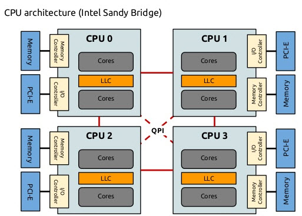

`Plugins`(插件)是`Volcano`调度器的决策模块，它们在不同的调度阶段提供特定的功能。
在上面的配置中，插件被组织成两个层级（`tiers`），每个层级包含多个插件。
层级的概念允许插件按照优先级顺序执行，高层级的插件优先级高于低层级的插件。

**注意事项**：部分插件支持在`Job`的`spec.plugins`中设置插件参数，但是只有在`Volcano`的全局配置中启用了该插件，在`Job`的`spec.plugins`中该插件才能起作用，否则无效。

让我们逐一解释这些插件的作用：


## priority（优先级）

**主要功能**：根据任务的优先级对其进行排序，确保高优先级任务先被调度。

**关联动作**：`allocate`, `backfill`, `preempt`, `reclaim`


**工作原理**：
- 读取任务的`PriorityClass`或优先级注解
- 根据优先级值对任务进行排序
- 高优先级任务在资源分配时会被优先考虑

**使用示例**：
```yaml
apiVersion: scheduling.k8s.io/v1
kind: PriorityClass
metadata:
  name: high-priority
value: 1000000
globalDefault: false
description: "This priority class is used for critical production jobs"
---
apiVersion: batch.volcano.sh/v1alpha1
kind: Job
metadata:
  name: critical-job
spec:
  priorityClassName: high-priority
  # 其他配置...
```

这个配置将使`critical-job`获得高优先级，在资源竞争时优先被调度。

## gang（成组）

**主要功能**：实现成组调度，确保任务的所有成员（`Pod`）可以同时运行。

**关联动作**：`allocate`, `backfill`, `preempt`, `reclaim`

**工作原理**：
- 读取任务的`minAvailable`设置
- 检查是否有足够的资源来运行最小所需的`Pod`数量
- 只有当所有必要的`Pod`都能被调度时，才会进行调度

**使用示例**：
```yaml
apiVersion: batch.volcano.sh/v1alpha1
kind: Job
metadata:
  name: distributed-training
spec:
  minAvailable: 4
  tasks:
    - replicas: 1
      name: ps
      template: # Pod模板...
    - replicas: 3
      name: worker
      template: # Pod模板...
```

这个配置要求至少`4`个`Pod`（`1`个`ps`和`3`个`worker`）同时可用才会开始调度。这对于分布式训练等需要多个组件协同工作的任务非常重要。

## conformance（一致性）

> 官网介绍链接：[https://volcano.sh/en/docs/schduler_introduction/#conformance](https://volcano.sh/en/docs/schduler_introduction/#conformance)

**关联动作**：`preempt`, `reclaim`

**主要功能**：`conformance`插件就像`Kubernetes`的"规则检查员"，确保`Volcano`的调度决策符合`Kubernetes`的标准和约定。

**工作原理**：
- 检查`Pod`的配置是否符合`Kubernetes`的规则（比如不能设置无效的资源请求）
- 验证调度决策不会违反`Kubernetes`的基本原则（比如不会将`Pod`调度到资源不足的节点）
- 确保`Volcano`的行为与标准`Kubernetes`调度器保持一致，避免冲突

**使用示例**：
假设有一个任务请求了以下资源：
```yaml
apiVersion: batch.volcano.sh/v1alpha1
kind: Job
metadata:
  name: example-job
spec:
  tasks:
    - replicas: 2
      name: example-task
      template:
        spec:
          containers:
            - name: main-container
              image: nginx
              resources:
                requests:
                  memory: "2Gi"
                  cpu: "500m"
```

`conformance`插件会执行以下检查：
1. 验证资源请求格式是否正确（如"`500m`" `CPU`是有效格式）
2. 确保`Pod`不会被调度到无法满足`2GB`内存和`0.5CPU`需求的节点上
3. 如果该`Pod`有特殊的调度约束（如污点容忍），确保这些约束被正确处理

如果`Volcano`尝试做出不符合`Kubernetes`规则的调度决策（例如，将`Pod`调度到资源已满的节点），`conformance`插件会阻止这种行为，确保系统稳定性和一致性。

这个插件对用户来说是"无形"的，它在后台默默工作，确保所有调度决策都符合`Kubernetes`的标准，不需要用户进行特殊配置。


**是否可以不使用`conformance`插件？**

从技术上讲，可以不使用`conformance`插件，因为`Volcano`允许用户自定义启用哪些插件。但这样做会带来一些潜在风险：

- **调度不一致性**：没有`conformance`插件，`Volcano`可能会做出与`Kubernetes`标准不兼容的调度决策，导致系统行为不可预测。
- **资源冲突**：可能会出现资源分配冲突，例如`Pod`被调度到不满足其资源需求的节点上。
- **API兼容性问题**：可能会接受一些不符合`Kubernetes` API约定的配置，导致后续操作失败。
- **系统稳定性降低**：`conformance`插件是`Volcano`的核心插件之一，它确保调度系统的基础稳定性。禁用它可能会导致一些难以排查的问题。

**注意事项**：

在`Volcano`的默认配置中，`conformance`通常是作为必要插件启用的。如果你有特殊的调度需求，建议保留`conformance`插件，同时通过配置其他插件来满足你的特定需求，而不是禁用这个基础的一致性保障机制。

## drf（主导资源公平性）

**主要功能**：实现主导资源公平性（`Dominant Resource Fairness`）算法，确保资源在不同队列和任务之间公平分配。

**关联动作**：`allocate`, `backfill`, `enqueue`, `preempt`, `reclaim`


**工作原理**：
- 计算每个任务的主导资源（即任务所需的最多的资源类型）
- 根据主导资源的使用比例对任务进行排序
- 确保所有用户或队列都能获得公平的资源份额

**适用场景**：

- **多租户环境**：多个团队或项目共享同一个集群
- **异构工作负载**：集群中运行不同类型的任务
- **资源紧张环境**：集群资源不足以满足所有队列的需求
- **需要公平调度的场景**：确保每个队列都能获得合理的资源份额


**DRF插件的核心价值**：

1. **解决资源竞争问题**：
   - 在`Kubernetes`集群中，不同队列可能运行不同类型的任务
   - 有些任务可能是CPU密集型（如机器学习训练）
   - 有些任务可能是内存密集型（如大数据处理）
   - 有些任务可能是GPU密集型（如深度学习）
   - 如果不使用DRF，先提交的队列可能会占用过多资源，导致其他队列无法获得足够的资源

2. **确保资源分配公平性**：
   - DRF会计算每个队列的"主导资源"（即该队列最需要的资源类型）
   - 根据主导资源的使用比例对任务进行排序
   - 确保所有队列都能获得其主导资源的公平份额
   - 防止某些队列因为资源竞争而完全无法运行

3. **提高资源利用率**：
   - 通过考虑每个队列的主导资源需求
   - 避免资源分配不均衡导致的资源浪费
   - 确保集群资源得到更高效的利用

**与Kubernetes默认调度器的区别**：

- 默认调度器是"先到先得"的方式
- 不考虑资源分配的公平性
- 只关注单个`Pod`的资源需求
- 不考虑队列级别的资源分配策略

**使用示例**：

假设集群中有两个队列（`A`和`B`）和两种资源（`CPU`和`内存`），总资源为`20`个`CPU`核心和`40GB`内存。

队列`A`中的任务主要需要`CPU`资源：
```yaml
apiVersion: batch.volcano.sh/v1alpha1
kind: Job
metadata:
  name: cpu-intensive-job
  namespace: queue-a
spec:
  tasks:
    - replicas: 2
      name: cpu-task
      template:
        spec:
          containers:
            - name: cpu-container
              image: cpu-workload:latest
              resources:
                requests:
                  cpu: "10"    # 每个Pod请求10个CPU核心
                  memory: "5Gi"  # 每个Pod请求5GB内存
```

队列`B`中的任务主要需要内存资源：
```yaml
apiVersion: batch.volcano.sh/v1alpha1
kind: Job
metadata:
  name: memory-intensive-job
  namespace: queue-b
spec:
  tasks:
    - replicas: 2
      name: memory-task
      template:
        spec:
          containers:
            - name: memory-container
              image: memory-workload:latest
              resources:
                requests:
                  cpu: "2"     # 每个Pod请求2个CPU核心
                  memory: "20Gi" # 每个Pod请求20GB内存
```

**DRF如何工作**：

1. **计算主导资源**：
   - 队列`A`：`CPU`是主导资源（每个`Pod`需要`50%`的集群`CPU`）
   - 队列`B`：`内存`是主导资源（每个`Pod`需要`50%`的集群内存）

2. **不使用DRF的情况**：
   - 如果队列`A`先提交任务：
     - `2`个`Pod`会占用`20`个`CPU`和`10GB`内存
     - 剩余资源：`0`个`CPU` + `30GB`内存
     - 队列`B`完全无法运行（因为`CPU`资源不足）
     - 结果：队列`A`获得`100%`的`CPU`份额，队列`B`获得`0%`的资源份额
   - 如果队列`B`先提交任务：
     - `2`个`Pod`会占用`4`个`CPU`和`40GB`内存
     - 剩余资源：`16`个`CPU` + `0GB`内存
     - 队列`A`只能运行`1`个`Pod`（因为内存限制：`5GB` > 剩余`0GB`）
     - 结果：队列`B`获得`100%`的内存份额，队列`A`只能获得`50%`的`CPU`份额

3. **使用DRF后的效果**：
   - `DRF`会确保公平分配：
     - 队列`A`获得约`50%`的`CPU`份额（`10`个`CPU`）和约`25%`的内存份额（`10GB`）
     - 队列`B`获得约`50%`的`CPU`份额（`10`个`CPU`）和约`75%`的内存份额（`30GB`）
   - 最终结果：
     - 队列`A`可以运行`1`个`Pod`（使用`10`个`CPU`和`5GB`内存）
     - 队列`B`可以运行`1`个`Pod`（使用`2`个`CPU`和`20GB`内存）
     - 两个队列都能获得其主导资源的公平份额

**DRF插件的局限性**：

需要注意的是，仅仅启用`DRF`插件并不能完全解决资源竞争问题。这是因为：

1. **调度时机的影响**：
   - `Volcano`调度器按照调度周期（默认`1`秒）执行
   - 如果队列`A`的任务先提交，在`DRF`插件生效前，这些任务可能已经被调度并运行
   - 当队列`B`的任务提交时，可能已经无法获得足够的资源

2. **已运行任务的影响**：
   - `DRF`插件只能影响当前待调度的任务
   - 对于已经运行的任务，`DRF`插件无法强制重新分配资源
   - 除非这些任务完成或被终止，否则资源分配不会改变

3. **更好的解决方案**：
   - 使用队列（`Queue`）资源限制
   - 使用资源配额（`ResourceQuota`）
   - 使用优先级（`Priority`）机制
   - 这些机制可以在任务提交前就限制资源使用

因此，在实际使用中，通常需要结合其他机制来确保资源分配的公平性。这也说明了为什么`Volcano`提供了多种插件和机制来管理资源分配。 


**是否可以不使用`DRF`插件？**

从技术上讲，可以不使用`DRF`插件，因为`Volcano`允许用户自定义启用哪些插件。
但在以下场景中，`DRF`插件几乎是必不可少的：

- **多队列环境**：当集群中有多个队列竞争资源时
- **异构工作负载**：当不同队列的任务有显著不同的资源需求特点（如`CPU`密集型与内存密集型）
- **资源紧张场景**：当集群资源紧张，需要更公平高效的资源分配时

如果你的集群资源充足，或者只有单一队列，或者所有任务的资源需求特点相似，那么可能不需要`DRF`插件。
但在大多数生产环境中，`DRF`插件提供的公平性保障是非常有价值的。


## predicates（断言）

**主要功能**：检查节点是否满足运行特定任务的条件，类似于标准`Kubernetes`调度器的断言。

**关联动作**：`allocate`, `backfill`, `preempt`, `reclaim`

**工作原理**：
- 检查节点资源是否满足任务需求
- 检查节点是否满足任务的亲和性、反亲和性要求
- 检查节点标签是否符合任务要求

**参数说明**：

| 参数名                      | 类型    | 默认值   | 说明                                 |
|-----------------------------|---------|---------|--------------------------------------|
| `predicates.enableNodeSelectorPredicate` | `bool` | `true`  | 是否启用节点标签断言                 |
| `predicates.enablePodAffinityPredicate`  | `bool` | `false` | 是否启用`Pod`亲和性断言                |
| `predicates.enablePodTolerationPredicate`| `bool` | `true`  | 是否启用污点容忍断言                 |
| `predicates.enableResourcePredicate`     | `bool` | `true`  | 是否启用资源断言                     |
| `predicates.enableNodePortsPredicate`    | `bool` | `true`  | 是否启用端口冲突断言                 |
| `predicates.enableVolumePredicate`       | `bool` | `true`  | 是否启用存储卷断言                   |
| `predicates.resourceThresholds`          | `map`  | `{}`    | 自定义资源阈值（如`cpu`、`memory`等）     |

**参数说明补充**：

- `predicates.resourceThresholds` 用于自定义节点资源的可用阈值，影响调度器在断言节点资源是否满足任务需求时的判定标准。默认情况下，调度器会根据节点的实际可用资源与 `Pod` 的 `requests` 进行对比，判断节点是否有足够资源来承载任务。通过配置该参数，可以为如 `cpu`、`memory` 等资源设置阈值，只有当节点的可用资源大于等于该阈值时，才会被认为可调度。
- 典型用途包括保护节点资源，防止节点被调度到极限，提升集群稳定性。例如：

  ```yaml
  - name: predicates
    arguments:
      predicates.resourceThresholds:
        cpu: 2000m
        memory: 8Gi
  ```
  上述配置表示：只有当节点剩余 `CPU≥2000m`、`内存≥8Gi` 时，才会被断言为"可用节点"。

如不配置该参数，默认 `{}`，即不额外限制，由调度器按实际资源判断。

**参数示例**：
```yaml
- name: predicates
  arguments:
    predicates.enableNodeSelectorPredicate: true
    predicates.enablePodAffinityPredicate: true
    predicates.enablePodTolerationPredicate: true
    predicates.enableResourcePredicate: true
    predicates.enableNodePortsPredicate: true
    predicates.enableVolumePredicate: false
    predicates.resourceThresholds:
      cpu: 2000m
      memory: 8Gi
```


**使用示例**：
```yaml
apiVersion: batch.volcano.sh/v1alpha1
kind: Job
metadata:
  name: gpu-job
spec:
  tasks:
    - replicas: 2
      name: gpu-task
      template:
        spec:
          nodeSelector:
            gpu: "true"
          containers:
            - name: gpu-container
              image: nvidia/cuda:latest
              resources:
                limits:
                  nvidia.com/gpu: 1
```

这个配置要求任务只能运行在标记为`gpu=true`的节点上，并且需要`GPU`资源。`predicates`插件会确保只有满足这些条件的节点才会被选中。

**注意事项**：

- `predicates` 插件并不是 `Volcano` 调度器中的"强制必选"插件，但在绝大多数实际生产场景下，它是非常推荐启用的核心插件之一。

- `predicates` 插件实现了节点资源、亲和性、污点容忍、端口冲突等一系列基础调度断言，类似于 `Kubernetes` 默认调度器的核心功能。如果关闭该插件，调度器将无法正确判断节点是否真正满足任务的各种约束条件，可能导致任务被调度到不合适的节点，带来资源冲突、调度失败或业务异常等问题。

- `Volcano` 支持插件化调度框架，允许用户通过配置 `tiers/plugins` 灵活启用或禁用插件。如果你明确了解自己的业务场景、节点环境和调度需求，也可以选择不启用 `predicates` 插件，但需自行确保不会引入调度安全隐患。
结论：

- 对于大多数生产集群和常规批量计算场景，建议始终启用 `predicates` 插件，以保障调度的正确性与安全性。
只有在非常特殊、可控的实验性场景下，且明确知道后果时，才可以选择不启用该插件。

## proportion（比例）

**主要功能**：根据队列的权重按比例分配资源，确保资源分配符合预定的比例。

**关联动作**：`enqueue`, `allocate`, `preempt`, `reclaim`

**工作原理**：
- 计算每个队列的目标资源份额（根据`weight`权重）
- 监控实际资源使用情况
- 调整资源分配以符合目标比例

**使用示例**：
```yaml
apiVersion: scheduling.volcano.sh/v1beta1
kind: Queue
metadata:
  name: production
spec:
  weight: 6
---
apiVersion: scheduling.volcano.sh/v1beta1
kind: Queue
metadata:
  name: development
spec:
  weight: 3
---
apiVersion: scheduling.volcano.sh/v1beta1
kind: Queue
metadata:
  name: testing
spec:
  weight: 1
```

这个配置定义了三个队列，权重比例为`6:3:1`。`proportion`插件会确保资源分配大致符合这个比例，
即生产队列获得`60%`的资源，开发队列获得`30%`，测试队列获得`10%`。

## nodeorder（节点排序）

**主要功能**：为任务选择最适合的节点，基于多种因素对节点进行打分和排序。

**关联动作**：`allocate`, `backfill`, `preempt`

**工作原理**：
- 考虑节点的资源利用率
- 考虑任务的亲和性和反亲和性要求
- 考虑节点的标签和条件
- 为每个节点计算分数，选择分数最高的节点

**参数说明**：

| 参数名                        | 类型   | 默认值 | 说明                            |
|-------------------------------|--------|--------|---------------------------------|
| `nodeaffinity.weight`           | `int`    | `1`      | 节点亲和性优先级权重            |
| `podaffinity.weight`            | `int`    | `1`      | `Pod` 亲和性优先级权重            |
| `leastrequested.weight`         | `int`    | `1`      | 最少资源使用优先级权重          |
| `balancedresource.weight`       | `int`    | `1`      | 资源均衡优先级权重              |
| `mostrequested.weight`          | `int`    | `1`      | 最大资源使用优先级权重          |
| `tainttoleration.weight`        | `int`    | `1`      | 污点容忍优先级权重              |
| `imagelocality.weight`          | `int`    | `1`      | 镜像本地性优先级权重            |
| `podtopologyspread.weight`      | `int`    | `1`      | `Pod` 拓扑分布优先级权重          |

> **说明：**
> - 所有权重参数的默认值均为 `1`，如未配置则调度器采用默认权重。
> - 权重越大，相关因素在节点排序中的影响越大。
> - 可根据实际业务场景灵活调整权重，实现资源利用、亲和性、分布均衡等多目标优化。


**参数示例**：
```yaml
- name: nodeorder
  arguments:
    nodeaffinity.weight: 1
    podaffinity.weight: 1
    leastrequested.weight: 1
    balancedresource.weight: 1
    mostrequested.weight: 1
    tainttoleration.weight: 1
    imagelocality.weight: 1
    podtopologyspread.weight: 1
```

**使用示例**：

下面是一个典型的 `nodeorder` 插件配置与任务调度示例：

```yaml
# volcano-scheduler.conf 片段
- name: nodeorder
  arguments:
    nodeaffinity.weight: 5
    podaffinity.weight: 10
    leastrequested.weight: 1
    balancedresource.weight: 2
    mostrequested.weight: 1
    tainttoleration.weight: 1
    imagelocality.weight: 1
    podtopologyspread.weight: 1
```

```yaml
# Job 示例
apiVersion: batch.volcano.sh/v1alpha1
kind: Job
metadata:
  name: affinity-job
spec:
  minAvailable: 2
  tasks:
    - replicas: 2
      name: worker
      template:
        spec:
          affinity:
            nodeAffinity:
              requiredDuringSchedulingIgnoredDuringExecution:
                nodeSelectorTerms:
                  - matchExpressions:
                      - key: disktype
                        operator: In
                        values: [ssd]
            podAffinity:
              requiredDuringSchedulingIgnoredDuringExecution:
                - labelSelector:
                    matchLabels:
                      app: myapp
                  topologyKey: kubernetes.io/hostname
          containers:
            - name: main
              image: busybox
              command: ["sleep", "3600"]
```

在上述配置中：
- `nodeorder` 插件通过不同权重综合考虑节点亲和性、`Pod` 亲和性、资源利用率等因素，为每个节点打分。
- 任务通过 `affinity` 字段表达了节点和 `Pod` 亲和性需求。
- 调度器最终会选择分数最高、最符合业务需求的节点进行任务调度。


**注意事项**：

- `nodeorder` 插件并不是 `Volcano` 调度器中的"强制必选"插件，但在实际生产环境中，它也是非常常用且推荐启用的插件之一。

- `nodeorder` 插件负责为所有可用节点打分排序，帮助调度器选择最适合任务的节点。它支持多种打分策略（如资源利用率、亲和性、污点容忍等），极大提升了调度的灵活性和智能性。

- 如果不启用 `nodeorder` 插件，调度器将无法对节点进行综合打分排序，可能只能采用简单的随机或轮询等方式分配任务，容易导致资源利用率低下或调度结果不理想。

- `Volcano` 支持插件化调度框架，允许用户根据实际需求选择启用或禁用 `nodeorder`。只有在极为特殊、对节点选择没有要求的场景下，才可能不启用该插件。

- 对于绝大多数生产集群和批量计算场景，建议始终启用 `nodeorder` 插件，以实现更优的资源利用和调度效果。

- 只有在明确知道后果且业务场景极为特殊时，才可以选择不启用该插件。


## binpack（装箱）

**主要功能**：将任务紧密地打包到尽可能少的节点上，提高资源利用率。

**关联动作**：`allocate`, `backfill`

**工作原理**：
- 优先选择已经有高资源利用率的节点
- 尽量将任务集中在少数节点上
- 减少空闲节点的数量，提高能源效率

**参数说明**：

| 参数名              | 类型   | 默认值 | 说明                              |
|---------------------|--------|--------|-----------------------------------|
| `binpack.weight`      | `int`    | `1`      | `binpack` 策略整体权重（优先级）    |
| `binpack.cpu`         | `int`    | `1`      | `CPU` 资源权重                      |
| `binpack.memory`      | `int`    | `1`      | 内存资源权重                      |
| `binpack.resources`   | `map`    | 无     | 其他自定义资源权重（如`gpu`等），需显式配置 |

> **说明：**
> - 所有权重参数默认值均为 `1`，如未配置则调度器采用默认权重。
> - `binpack.resources` 可用于为 `GPU`、`FPGA` 等自定义资源单独设置权重，未配置时不生效。
> - 权重越大，相关资源在 `binpack` 排序中的影响越大。
> - 可根据实际业务场景灵活调整各项权重，实现资源利用最大化。


**参数示例**：
```yaml
- name: binpack
  arguments:
    binpack.weight: 10
    binpack.cpu: 1
    binpack.memory: 1
    binpack.resources:
      nvidia.com/gpu: 2
```

**使用示例**：
当集群中有多个小型任务需要调度时，`binpack`插件会尽量将它们调度到同一个或少数几个节点上，而不是分散到多个节点。
这样可以保持更多的节点处于空闲状态，可以关闭这些节点以节省能源，或者用于运行大型任务。以`deepseek`为例，一个集群有三个`8`卡节点，每个节点上都已经被占用了一个卡，每个节点只有`7`卡，而`deepseek`需要两个`8`卡节点才能启动，这时候管理视角有`21`卡空余，但是实际却不能调度任何容器。这是需要调度器尽可能优先将一个节点填满，或者可以触发重调度，将三个单卡容器调度到一个节点，以平衡资源状态，使业务可以被调度。


## numaaware（NUMA感知）

**关联动作**：`allocate`, `backfill`

**NUMA简介**：
`NUMA`（`Non-Uniform Memory Access`，非统一内存访问）是一种计算机内存架构，在这种架构中，内存访问时间取决于内存相对于处理器的位置。在`NUMA`系统中，处理器访问其本地内存（同一`NUMA`节点上的内存）比访问非本地内存（其他`NUMA`节点上的内存）要快。这种架构在现代多处理器服务器中非常常见，对于高性能计算工作负载来说至关重要。



**主要功能**：优化对`NUMA`（非统一内存访问）架构的支持，提高计算密集型任务的性能。

**工作原理**：
- 识别节点的`NUMA`拓扑结构
- 尽量将任务的所有资源（`CPU`、内存、设备）分配在同一`NUMA`节点上
- 减少跨`NUMA`节点的内存访问，降低延迟

**使用示例**：
对于高性能计算或AI训练等对内存访问延迟敏感的工作负载，
`numaaware`插件可以确保任务的`CPU`和内存资源分配在同一`NUMA`节点上，避免跨节点访问导致的性能下降。

## task-topology（任务拓扑）

**主要功能**：基于任务之间的亲和性和反亲和性配置，计算任务和节点的优先级，优化任务分布。

**关联动作**：`allocate`, `backfill`, `preempt`, `reclaim`

**工作原理**：
- 分析任务之间的亲和性和反亲和性设置
- 将有亲和性配置的任务优先调度到同一节点
- 将有反亲和性配置的任务调度到不同节点

**使用示例**：
在深度学习计算场景中，任务拓扑对提高计算效率非常重要。以`TensorFlow`分布式训练为例，我们可以定义如下任务拓扑关系：

```yaml
apiVersion: batch.volcano.sh/v1alpha1
kind: Job
metadata:
  name: tensorflow-training
spec:
  minAvailable: 5
  schedulerName: volcano
  plugins:
    ssh: []
    svc: []
  policies:
    - event: PodEvicted
      action: RestartJob
  queue: default
  tasks:
    - replicas: 1
      name: ps
      template:
        spec:
          containers:
            - name: tensorflow
              image: tensorflow/tensorflow:2.4.0
              command: ["python", "/app/train.py", "--job_name=ps", "--task_index=0"]
              ports:
                - containerPort: 2222
                  name: tfjob-port
              resources:
                limits:
                  cpu: 4000m
                  memory: 8Gi
                requests:
                  cpu: 2000m
                  memory: 4Gi
    - replicas: 4
      name: worker
      policies:
        - event: TaskCompleted
          action: CompleteJob
      template:
        spec:
          containers:
            - name: tensorflow
              image: tensorflow/tensorflow:2.4.0-gpu
              command: ["python", "/app/train.py", "--job_name=worker", "--task_index=${VK_TASK_INDEX}"]
              resources:
                limits:
                  cpu: 4000m
                  memory: 8Gi
                  nvidia.com/gpu: 1
                requests:
                  cpu: 2000m
                  memory: 4Gi
                  nvidia.com/gpu: 1
  topologyPolicy:
    affinity:
      - {"taskA": "ps", "taskB": "worker", "weight": 10}  # ps和worker之间的亲和性，权重为10
    antiAffinity:
      - {"taskA": "worker", "taskB": "worker", "weight": 5}  # worker之间的反亲和性，权重为5
```

在这个配置中：

1. **亲和性配置**：
   - `ps`和`worker`任务之间设置了亲和性，权重为`10`
   - 这意味着调度器将尽量将`ps`和`worker`调度到同一节点或者物理上接近的节点
   - 这样可以显著减少参数服务器（`PS`）和工作节点之间的网络延迟，提高训练效率

2. **反亲和性配置**：
   - `worker`之间设置了反亲和性，权重为`5`
   - 这意味着调度器将尽量将不同的`worker`调度到不同的节点
   - 这样可以提高系统的容错性（单个节点失效不会导致所有`worker`都下线），并充分利用集群中的分布式计算能力

3. **权重设置**：
   - 亲和性的权重为`10`
   - 反亲和性的权重为`5`
   - 这意味着在决策过程中，如果出现冲突，调度器会优先考虑`ps`和`worker`的亲和性需求

通过这种配置，`task-topology`插件可以显著提高分布式训练的效率和可靠性。在实际应用中，可以根据具体工作负载的特点和集群的结构来调整亲和性和反亲和性的配置及其权重。

## sla（服务级别协议）

**主要功能**：实现服务级别协议（`Service Level Agreement`）的管理，确保任务的调度符合特定的服务质量要求。

**关联动作**：`allocate`, `backfill`, `preempt`, `reclaim`


**工作原理**：

该插件的核心机制，就是为任务设置一个"调度等待时间阈值"。当某个任务在队列中等待调度的时间超过了这个阈值，调度器就会自动提升该任务的优先级，从而让它更快地被调度执行，避免长期得不到资源导致"饿死"现象。

- 监控任务的等待时间和调度状态
- 根据`sla`策略调整任务的优先级
- 防止任务长时间处于等待状态，避免资源饥饿

**参数说明**：

| 参数名                          | 类型    | 默认值 | 说明                                               |
|---------------------------------|---------|--------|----------------------------------------------------|
| `sla-waiting-time`                | `bool`    | `false`  | 是否启用等待时间提升优先级功能                      |
| `job-waiting-time.优先级名`      | `string`  | 无     | 各优先级任务的等待时间阈值（如 `60s`、`120s`、`300s`）    |
| `job-starvation-timeout`          | `string`  | 无     | 任务饥饿超时时间，超时后强制提升优先级（如 `900s`）   |
| `sla-queue-waiting-time.队列名`  | `string`  | 无     | 针对特定队列的等待时间阈值（可选）                  |
| `sla-job-label-waiting-time.标签名=标签值` | `string` | 无     | 针对带特定 `label` 的 `Job` 的等待时间阈值（可选）     |

> **说明：**
> - `sla-waiting-time` 默认关闭，需显式设置为 `true` 才会生效。
> - 其它参数如未配置则不生效，需根据业务场景显式指定。
> - 时间阈值参数支持 `s`（秒）、`m`（分钟）等单位。


**参数示例**：
```yaml
- name: sla
  arguments:
    sla-waiting-time: true
    job-waiting-time.high-priority: 60s
    job-waiting-time.medium-priority: 120s
    job-waiting-time.low-priority: 300s
    job-starvation-timeout: 900s
    sla-queue-waiting-time.analytics: 180s
    sla-job-label-waiting-time.type=batch: 600s
```

**使用示例**：
下面是一个完整的`sla`插件配置示例，展示了如何为不同类型的任务设置不同的`sla`策略：

```yaml
apiVersion: v1
kind: ConfigMap
metadata:
  name: volcano-scheduler-configmap
  namespace: volcano-system
data:
  volcano-scheduler.conf: |
    actions: "enqueue, allocate, backfill"
    tiers:
    - plugins:
      - name: priority
      - name: gang
      - name: conformance
    - plugins:
      - name: drf
      - name: predicates
      - name: proportion
      - name: nodeorder
      - name: binpack
      - name: sla
        arguments:
          sla-waiting-time: true
          job-waiting-time.high-priority: 60s     # 高优先级任务的等待时间阈值
          job-waiting-time.medium-priority: 120s  # 中优先级任务的等待时间阈值
          job-waiting-time.low-priority: 300s     # 低优先级任务的等待时间阈值
          job-starvation-timeout: 900s            # 任务饥饿超时时间
```

在这个配置中，我们为`sla`插件设置了以下参数：

1. **等待时间策略**：
   - 启用了`sla-waiting-time`功能，允许基于任务等待时间调整优先级
   - 为不同优先级的任务设置了不同的等待时间阈值：
     - 高优先级任务：`60`秒
     - 中优先级任务：`120`秒
     - 低优先级任务：`300`秒

2. **饥饿防止机制**：
   - 设置了`job-starvation-timeout`为`900`秒，即如果任何任务等待超过`15`分钟仍未被调度，将触发饥饿防止机制

现在，让我们看一个具体的任务配置示例，展示如何为任务设置优先级以便于与`sla`插件配合使用：

```yaml
apiVersion: batch.volcano.sh/v1alpha1
kind: Job
metadata:
  name: real-time-analytics
spec:
  schedulerName: volcano
  priorityClassName: high-priority  # 使用高优先级类别
  minAvailable: 3
  queue: default
  tasks:
    - replicas: 3
      name: analytics
      template:
        spec:
          containers:
            - name: analytics-container
              image: analytics:v1.0
              resources:
                requests:
                  cpu: 2000m
                  memory: 4Gi
---
apiVersion: batch.volcano.sh/v1alpha1
kind: Job
metadata:
  name: batch-processing
spec:
  schedulerName: volcano
  priorityClassName: low-priority  # 使用低优先级类别
  minAvailable: 2
  queue: default
  tasks:
    - replicas: 5
      name: batch
      template:
        spec:
          containers:
            - name: batch-container
              image: batch:v1.0
              resources:
                requests:
                  cpu: 1000m
                  memory: 2Gi
```

在这个示例中，我们定义了两个任务：

1. **实时分析任务**：
   - 设置为`high-priority`优先级
   - 根据`sla`插件配置，如果该任务等待超过`60`秒，其优先级将被提升
   - 这确保了实时分析任务能快速获得调度，满足其实时性需求

2. **批处理任务**：
   - 设置为`low-priority`优先级
   - 根据`sla`插件配置，该任务可以等待长达`300`秒才会被提升优先级
   - 这适合于不需要实时响应的批量计算任务

当集群资源紧张时，`sla`插件将确保：

1. 高优先级的实时分析任务优先获得资源
2. 如果低优先级的批处理任务等待时间过长（超过`300`秒），其优先级会被提升，以避免资源饥饿
3. 如果任何任务等待时间超过`900`秒（饥饿超时），将触发特殊的饥饿防止机制，确保其能尽快获得调度

通过这种方式，`sla`插件在保证高优先级任务快速响应的同时，也避免了低优先级任务的资源饥饿问题，实现了集群资源的合理分配和服务质量保证。


## tdm（时分复用）

**主要功能**：实现时分复用（`Time Division Multiplexing`）机制，允许不同系统在不同时间段共享同一节点的资源。

**关联动作**：`allocate`, `backfill`, `preempt`

**工作原理**：
- 将特定节点标记为可撤销节点（`revocable nodes`）
- 在节点的可用时间段内，将可抢占任务调度到这些节点
- 在非可用时间段，将这些任务从节点上驱逐

**参数说明**：


**全局插件参数**：
| 参数名                       | 类型    | 默认值 | 说明                                                                 |
|------------------------------|---------|--------|----------------------------------------------------------------------|
| `tdm-scheduler-name`         | `string`  | `volcano-tdm` | 负责时分复用调度的调度器名称（需与 `schedulerName` 匹配）              |
| `tdm-revocable-node-label`   | `string`  | `volcano.sh/revocable-node` | 标记可撤销节点的标签名，只有带此标签的节点参与时分复用              |
| `tdm-time-ranges`            | `string`  | 无     | 不同时间段的配置，支持 `JSON` 数组格式，定义名称、起止时间、星期、时区等 |
| `tdm-revocable`              | `bool`    | `false`  | 是否为可撤销任务（可在指定时间段被调度到可撤销节点）                |
| `tdm-timezone`               | `string`  | `Asia/Shanghai` | 时区设置，影响时间段的生效范围                                   |

> **说明：**
> - `tdm-scheduler-name` 和 `tdm-revocable-node-label` 一般无需更改，除非有多套调度器或特殊节点标签。
> - `tdm-time-ranges` 必须配置，支持多个时间段（如工作日、非工作日、周末等），每个时间段可指定名称、起止时间、适用星期、时区等。
> - `tdm-revocable` 通常在 `Job/task` 的插件参数中指定，决定该任务是否为可撤销任务。
> - `tdm-timezone` 可选，默认 `Asia/Shanghai`，适用于多时区集群。


**Job插件参数**：

`Volcano` 支持在 `Job` 级别通过 `spec.plugins` 单独配置 `tdm` 插件参数，实现更细粒度的时分复用调度控制。

| Job 层级参数   | 类型      | 说明 |
|----------------|-----------|------|
| `revocable`    | `bool`    | 是否为可收回任务，决定是否参与时分复用调度 |
| `timeRanges`   | `[]string`| 允许任务运行的时间段名称，需与全局 `tdm` 配置的 `time-ranges` 匹配 |
| `timezone`     | `string`  | 可选，指定该 Job 使用的时区，默认继承全局配置 |

**Job插件参数示例**：
```yaml
plugins:
  tdm:
    revocable: true
    timeRanges: ["non-working-hours", "weekend"]
    timezone: "Asia/Shanghai"
```


**Job插件参数与全局参数关系**


- `Job` 层级的 `tdm` 参数不会覆盖全局配置，而是基于全局配置做细粒度补充。
  - 例如 `timeRanges` 必须引用全局 `tdm` 配置中定义的 `time-ranges` 名称，否则无效。
  - `revocable` 仅影响该 `Job` 是否参与可收回任务调度，不会影响全局其它 `Job`。
- 如果 `Job` 层级未配置某参数，则默认继承全局配置（如 `timezone`）。
- `Job` 层级参数仅对当前 `Job` 有效，不会影响全局设置。

> **总结：**
> - `Job.spec.plugins` 是 `Volcano` 支持的原生扩展点。
> - `plugins.tdm` 支持 `revocable`、`timeRanges`、`timezone` 等参数，主要用于细化 `Job` 的时分复用调度行为。
> - `Job` 层级参数不会与全局参数冲突，而是互为补充，`Job` 层级参数优先生效，仅影响该 `Job`。


**使用示例**：
下面是一个完整的`tdm`插件配置示例，展示了如何在混合计算环境中实现资源的时分复用：

```yaml
apiVersion: v1
kind: ConfigMap
metadata:
  name: volcano-scheduler-configmap
  namespace: volcano-system
data:
  volcano-scheduler.conf: |
    actions: "enqueue, allocate, backfill"
    tiers:
    - plugins:
      - name: priority
      - name: gang
      - name: conformance
    - plugins:
      - name: drf
      - name: predicates
      - name: proportion
      - name: nodeorder
      - name: binpack
      - name: tdm
        arguments:
          tdm-scheduler-name: "volcano-tdm"
          tdm-revocable-node-label: "volcano.sh/revocable-node"
          tdm-time-ranges: |
            [
              {
                "name": "working-hours",
                "start": "09:00",
                "end": "18:00",
                "days": ["Monday", "Tuesday", "Wednesday", "Thursday", "Friday"],
                "locations": ["Asia/Shanghai"]
              },
              {
                "name": "non-working-hours",
                "start": "18:00",
                "end": "09:00",
                "days": ["Monday", "Tuesday", "Wednesday", "Thursday", "Friday"],
                "locations": ["Asia/Shanghai"]
              },
              {
                "name": "weekend",
                "days": ["Saturday", "Sunday"],
                "locations": ["Asia/Shanghai"]
              }
            ]
```

在这个配置中，我们为`tdm`插件设置了以下参数：

1. **调度器名称**：
   - `tdm-scheduler-name: "volcano-tdm"`指定了负责时分复用的调度器名称

2. **可收回节点标签**：
   - `tdm-revocable-node-label: "volcano.sh/revocable-node"`指定了标记可收回节点的标签
   - 只有带有这个标签的节点才会参与时分复用

3. **时间段配置**：
   - `tdm-time-ranges`定义了不同的时间段，每个时间段都有自己的名称、开始时间、结束时间、适用的星期和时区
   - 这里定义了三个时间段：工作时间（工作日的`9:00-18:00`）、非工作时间（工作日的`18:00`-次日`9:00`）和周末时间

现在，让我们看一个具体的节点和任务配置示例，展示如何使用`tdm`插件进行时分复用：

```yaml
# 首先，我们需要标记可收回的节点
---
apiVersion: v1
kind: Node
metadata:
  name: worker-node-01
  labels:
    volcano.sh/revocable-node: "true"  # 标记该节点为可收回节点
    node-role.kubernetes.io/worker: ""
spec:
  # ...

# 然后，我们可以创建一个交互式服务任务，它将在工作时间运行
---
apiVersion: batch.volcano.sh/v1alpha1
kind: Job
metadata:
  name: interactive-service
spec:
  schedulerName: volcano
  queue: default
  minAvailable: 1
  tasks:
    - replicas: 3
      name: service
      template:
        metadata:
          labels:
            app: interactive-service
        spec:
          containers:
            - name: service-container
              image: nginx:latest
              resources:
                requests:
                  cpu: 2000m
                  memory: 4Gi
  plugins:
    tdm: 
      revocable: false  # 这个任务不是可收回的，它将在工作时间运行

# 最后，我们创建一个批处理任务，它将在非工作时间运行
---
apiVersion: batch.volcano.sh/v1alpha1
kind: Job
metadata:
  name: batch-processing
spec:
  schedulerName: volcano
  queue: default
  minAvailable: 2
  tasks:
    - replicas: 5
      name: batch
      template:
        metadata:
          labels:
            app: batch-processing
        spec:
          containers:
            - name: batch-container
              image: batch-processor:v1.0
              command: ["python", "/app/process.py"]
              resources:
                requests:
                  cpu: 1000m
                  memory: 2Gi
  plugins:
    tdm: 
      revocable: true  # 这个任务是可收回的，它将在非工作时间运行
      timeRanges: ["non-working-hours", "weekend"]  # 指定这个任务可以运行的时间段
```

在这个示例中，我们实现了以下功能：

1. **节点配置**：
   - 我们将`worker-node-01`标记为可收回节点，这意味着它将参与时分复用

2. **交互式服务任务**：
   - 这个任务不是可收回的（`revocable: false`）
   - 它将在工作时间（工作日的`9:00-18:00`）运行
   - 在这个时间段，它将优先使用集群资源

3. **批处理任务**：
   - 这个任务是可收回的（`revocable: true`）
   - 它被配置为在非工作时间和周末运行（`timeRanges: ["non-working-hours", "weekend"]`）
   - 当工作时间开始时，这个任务将被驱逐，以便交互式服务可以使用这些资源

通过这种配置，`tdm`插件实现了以下效果：

1. **资源利用率提高**：
   - 同一组节点在不同时间段被不同类型的任务使用
   - 在工作时间，资源用于交互式服务，确保用户体验
   - 在非工作时间，资源用于批处理任务，提高计算效率

2. **成本降低**：
   - 不需要为不同类型的工作负载维护独立的集群
   - 减少了闲置资源，降低了硬件和运维成本

3. **灵活的时间管理**：
   - 可以根据实际需求灵活调整时间段定义
   - 支持多个时区，适用于全球分布式集群

这种方式特别适用于以下场景：

1. **企业混合工作负载**：在工作时间运行交互式服务，在非工作时间运行数据分析和批处理任务

2. **云服务提供商**：为不同客户在不同时间段提供资源，最大化资源利用率

3. **混合系统集成**：允许`Kubernetes`和其他系统（如`Hadoop/Yarn`）在不同时间段共享同一组物理资源


## deviceshare（设备共享）

**主要功能**：支持在同一节点上安全高效地共享 `GPU`、`FPGA` 等特殊硬件资源。

**关联动作**：`allocate`, `backfill`

**工作原理**：
- 跟踪节点上的可用设备资源
- 动态分配、隔离和调度设备到不同任务
- 支持设备分片和多任务共享同一物理设备

**应用场景**：AI 训练、推理等需要特殊硬件资源的场景，提升资源利用率。

**注意事项：**
- `deviceshare` 插件本身只负责调度决策，实际的物理设备发现、分配与隔离，必须依赖 `Kubernetes` 的 `Device Plugin` 机制或相关 `Operator`。
- **NVIDIA GPU 场景**：需提前安装 [NVIDIA Device Plugin](https://github.com/NVIDIA/k8s-device-plugin) 或 [GPU Operator](https://github.com/NVIDIA/gpu-operator)。
- **FPGA/其它设备**：需根据硬件类型选择对应的 `Device Plugin/Operator`。
- **显存分片/vGPU**：如需启用 `deviceshare.GPUSharingEnable: true`，还需配合社区（如 `volcano-sh/gpu-share-device-plugin`）或厂商的分片插件。
- 若未安装对应 `Device Plugin`，`deviceshare` 插件无法实现对物理资源的精细调度和隔离。

**参数说明**：


**全局插件参数**：
| 参数名                        | 类型   | 默认值 | 说明                                                         |
|-------------------------------|--------|--------|--------------------------------------------------------------|
| `deviceshare.GPUSharingEnable`  | `bool`   | `false`  | 是否启用 `GPU` 显存分片共享                                    |
| `deviceshare.NodeLockEnable`    | `bool`   | `false`  | 是否启用节点锁定（防止多任务争抢同一设备）                   |
| `deviceshare.GPUNumberEnable`   | `bool`   | `false`  | 是否按 `GPU` 数量调度                                          |
| `deviceshare.VGPUEnable`        | `bool`   | `false`  | 是否启用 `vGPU` 支持                                           |
| `deviceshare.SchedulePolicy`    | `string` | `binpack`| 设备调度策略（如`binpack`、`spread`等）                     |
| `deviceshare.ScheduleWeight`    | `int`    | `10`     | 设备调度打分权重                                             |

> **说明：**
> - 如未配置，所有布尔参数默认 `false`，`SchedulePolicy` 默认 `binpack`，`ScheduleWeight` 默认 `10`。
> - 可按需开启分片、锁定或 `vGPU` 支持，提升设备利用率。


**全局插件参数示例**：
```yaml
- name: deviceshare
  arguments:
    deviceshare.GPUSharingEnable: true
    deviceshare.NodeLockEnable: false
    deviceshare.SchedulePolicy: "binpack"
    deviceshare.ScheduleWeight: 10
```


**Job插件参数**：

`Volcano` 支持在 `Job` 级别通过 `spec.plugins` 单独配置 `deviceshare` 插件参数，实现更细粒度的设备调度控制。

| 参数名                        | 类型      | 说明                                   |
|-------------------------------|-----------|----------------------------------------|
| `GPUSharingEnable`              | `bool`    | 是否启用 `GPU` 显存分片共享              |
| `NodeLockEnable`                | `bool`    | 是否启用节点锁定                       |
| `GPUNumberEnable`               | `bool`    | 是否按 `GPU` 数量调度                    |
| `VGPUEnable`                    | `bool`    | 是否启用 `vGPU` 支持                     |
| `SchedulePolicy`                | `string`  | 设备调度策略（如 `binpack`、`spread` 等）   |
| `ScheduleWeight`                | `int`     | 设备调度打分权重                       |

> **说明：**
> - `Job` 层级参数与全局参数同名时，仅对当前 `Job` 生效，不影响全局其它任务。
> - 未配置参数时，默认继承全局 `deviceshare` 配置。

**Job插件参数示例**：
```yaml
spec:
  plugins:
    deviceshare:
      GPUSharingEnable: true
      SchedulePolicy: "spread"
      ScheduleWeight: 20
```

**Job插件参数与全局参数关系**

- `Job` 层级的 `deviceshare` 参数不会覆盖全局配置，而是基于全局配置做细粒度补充。
- 仅对当前 `Job` 有效，不影响其它 `Job` 和全局调度策略。


**使用示例**：

下方示例展示了如何通过 `deviceshare` 插件实现 `GPU` 显存分片调度：
- 用户只需在 `Job` 的 `plugins` 字段中启用 `deviceshare` 插件，并在容器资源 `limits` 中声明所需的显存分片（如 `4096 MiB`）。
- 调度器会根据 `deviceshare` 配置和底层` Device Plugin` 的资源分片能力，将多个任务合理分配到同一块物理 `GPU` 上，实现资源高效复用。
- 需要注意，只有在集群已正确部署支持显存分片的 `Device Plugin` 时，该功能才能生效。

```yaml
apiVersion: batch.volcano.sh/v1alpha1
kind: Job
metadata:
  name: gpu-share-job
spec:
  minAvailable: 2
  schedulerName: volcano
  plugins:
    deviceshare: []
  tasks:
    - replicas: 2
      name: gpu-task
      template:
        spec:
          containers:
            - name: gpu-container
              image: nvidia/cuda:latest
              resources:
                limits:
                  volcano.sh/gpu-mem: 4096 # 申请4GB显存分片
```

## overcommit（超额分配）

**主要功能**：允许节点资源被"超额预定"。

**关联动作**：`allocate`, `preempt`

**工作原理**：
- 该插件仅在`enqueue`动作生效，`allocate`动作无效。
- `overcommit` 插件通过调度层面对节点资源进行"超额预定"（`Overcommit`），并不是物理硬件超频，而是放大调度器感知的节点可分配资源。
- 支持为节点设置超配策略，通过 `overcommit-factor`、`cpu-overcommit-ratio`、`mem-overcommit-ratio` 等参数，将节点的"可分配资源"虚拟放大。例如节点实际 `100` 核 `CPU`，设置 `cpu-overcommit-ratio: 2.0` 后，调度器视为可分配 `200` 核。
- 在调度决策阶段，允许任务总资源请求超过节点实际物理资源，实现资源的"虚拟扩容"，适合实际资源消耗远低于申请量的场景（如离线批处理、AI 推理等）。
- `Kubernetes` 本身支持资源 `overcommit`，`Volcano` 通过插件机制进一步增强了资源超配的灵活性和粒度。
- 超配策略仅影响调度决策，节点 `kubelet` 仍按物理资源运行容器，若所有任务实际消耗接近申请值，可能导致节点资源耗尽、任务 `OOM` 或性能抖动。
- 建议根据节点实际资源消耗情况合理设置超配比例，平衡资源利用率与稳定性。

**注意事项**：

1. 需谨慎使用，避免资源争抢导致任务 `OOM` 或性能抖动。
2. 在`Volcano`的内部插件实现中，比如`overcommit`、`capacity`、`proportion`等插件针对智算卡（如`GPU/NPU/PPU`等）维度的配额管理支持得不好，其内部实现都是按照资源名称（`ResourceName`）进行配额管理，没有考虑卡维度的资源配额。例如，针对`NVIDIA-H200`和`NVIDIA-GeForce-RTX-4090`的资源名称都是`nvidia.com/gpu`，在`overcommit`插件内部实现中都被当做一种资源进行超配，导致配额计算不准确。

**参数说明**：

**全局插件参数**：

| 参数名                | 类型   | 默认值 | 说明                        |
|---------------------|--------|--------|-----------------------------|
| `overcommit-factor`   | `float`  | `1.2`    | 超额分配因子（全局生效）    |
| `cpu-overcommit-ratio`| `float`  | 无     | `CPU` 资源超配比例，未配置则不超配 |
| `mem-overcommit-ratio`| `float`  | 无     | 内存资源超配比例，未配置则不超配 |

> **说明：**
> - `overcommit-factor` 为全局默认超配因子，若未配置 `cpu-overcommit-ratio` 或 `mem-overcommit-ratio` 时生效。
> - 建议根据节点实际资源消耗情况合理设置，避免因超配导致 `OOM`。


**全局插件参数示例**：
```yaml
- name: overcommit
  arguments:
    overcommit-factor: 1.5
```


**Job插件参数**：

`Volcano` 支持在 `Job` 级别通过 `spec.plugins` 单独配置 `overcommit` 插件参数，实现更细粒度的超配调度控制。

| 参数名                | 类型   | 说明                                  |
|---------------------|--------|---------------------------------------|
| `overcommitFactor`      | `float`  | 当前 `Job` 的超配因子，优先生效于全局配置 |
| `cpuOvercommitRatio`   | `float`  | 当前 `Job` 的 `CPU` 超配比例               |
| `memOvercommitRatio`   | `float`  | 当前 `Job` 的内存超配比例                |

> **说明：**
> - `Job` 层级参数仅对当前 `Job` 生效，不影响全局其它任务。
> - 未配置参数时，默认继承全局 `overcommit` 配置。

**Job插件参数示例**：
```yaml
spec:
  plugins:
    overcommit:
      overcommitFactor: 1.3
      cpuOvercommitRatio: 1.5
      memOvercommitRatio: 1.2
```

**Job插件参数与全局参数关系**

- `Job` 层级的 `overcommit` 参数不会覆盖全局配置，而是基于全局配置做细粒度补充。
- 仅对当前 `Job` 有效，不影响其它 `Job` 和全局调度策略。


**使用示例**：
```yaml
apiVersion: v1
kind: ConfigMap
metadata:
  name: volcano-scheduler-configmap
  namespace: volcano-system
data:
  volcano-scheduler.conf: |
    tiers:
    - plugins:
      - name: overcommit
        arguments:
          cpu-overcommit-ratio: 2.0   # 允许CPU超配2倍
          mem-overcommit-ratio: 1.5   # 允许内存超配1.5倍
```

## pdb（PodDisruptionBudget 支持）

**主要功能**：在调度和驱逐任务时，遵守 `Kubernetes` 的 `PDB` 约束，保障服务可用性。如需保障服务的高可用和安全驱逐，务必在 `scheduler` 全局配置中启用 `pdb` 插件，让调度器在相关操作时主动遵守 `PDB` 约束。

**关联动作**：`preempt`, `reclaim`

**工作原理**：
- 检查 `PDB` 约束，避免一次性驱逐过多 `Pod`
- 保证关键服务的最小可用实例数

**参数说明**：

| 参数名 | 类型 | 说明 |
|--------|------|------|
| 无     | -    | `pdb` 插件无可配置参数，只需启用插件即可 |

> **说明：**
> - `pdb` 插件只需在 `scheduler` 配置文件的 `tiers.plugins` 中启用即可生效。
> - 插件行为完全依赖于集群中已存在的 `PDB` 资源对象。

**使用示例**：
```yaml
actions: "reclaim, preempt, shuffle"
tiers:
- plugins:
  - name: pdb
```


## resourcequota（资源配额）

**关联动作**：`enqueue`


**主要功能**：支持队列或命名空间级别的资源配额限制，防止资源被单一队列/用户占满。

**`Queue` 资源配额与 `resourcequota` 插件的区别**：

| 特性 | `Queue` 资源配额 | `resourcequota` 插件 | 
|------|--------------|-------------------| 
|**作用范围** | 仅限 `Volcano Queue `| 可跨命名空间、跨队列 | 
| **限制粒度** | 队列级别 | 可自定义分组（如项目、部门等） | 
| **资源类型** | 主要限制计算资源 | 支持更多资源类型（如存储、对象数量等） | 
| **灵活性** | 相对固定 | 支持自定义资源组和复杂策略 | 
| **集成性** | `Volcano` 原生机制 | 可与 `Kubernetes ResourceQuota` 对象协同 |

**`Kubernetes` 原生 `ResourceQuota` 与 `Volcano resourcequota` 插件的区别**：

| 特性 | `Kubernetes ResourceQuota` | `Volcano resourcequota` 插件 | 
|------|------------------------|---------------------------| 
| **作用时机** | 资源创建时的准入控制 | 调度决策阶段 | 
| **作用对象** | 命名空间级别的资源总量 | 批量作业调度和资源分配 | 
| **调度感知** | 不参与调度决策 | 直接影响调度决策 | 
| **队列感知** | 不理解 `Volcano` 队列 | 可与 `Volcano` 队列系统协同工作 | 
| **批处理优化** | 不针对批处理场景优化 | 专为批处理工作负载设计 |

**工作原理**：
- 跟踪每个队列/命名空间的资源使用量
- 拒绝超出配额的任务调度请求

**注意事项**：

- `Volcano` 的 `resourcequota` 插件依赖于 `Kubernetes` 原生的 `ResourceQuota` 资源对象，其资源限制只能针对特定命名空间生效，而不能跨命名空间实现资源限制
需要为队列使用的每个命名空间单独配置 `ResourceQuota`。

- 如果一个队列跨多个命名空间，`resourcequota` 插件无法对整个队列实施统一的资源限制

**参数说明**：

当前插件无参数配置。

**使用示例**：
```yaml
apiVersion: v1
kind: ResourceQuota
metadata:
  name: queue-quota
  namespace: default
spec:
  hard:
    requests.cpu: "8"
    requests.memory: 16Gi
    limits.cpu: "16"
    limits.memory: 32Gi
---
apiVersion: batch.volcano.sh/v1alpha1
kind: Job
metadata:
  name: quota-job
  namespace: default
spec:
  schedulerName: volcano
  tasks:
    - replicas: 2
      name: main
      template:
        spec:
          containers:
            - name: main
              image: busybox
              command: ["sleep", "3600"]
```

## rescheduling（重调度）

**主要功能**：动态检测资源碎片或节点利用率低下情况，自动触发任务重调度，提升集群整体利用率。

**关联动作**：无直接关联（主要通过事件处理器工作）

**工作原理**：
- 定期评估节点利用率
- 识别低效分布的任务并触发迁移

**参数说明**：

| 参数名                      | 类型         | 默认值 | 说明                                   |
|-----------------------------|--------------|--------|----------------------------------------|
| `interval`                    | `string`       | `5m`     | 执行重调度的时间间隔（如`5m`）         |
| `metricsPeriod`               | `string`       | `5m`     | 指标收集周期                           |
| `strategies`                  | 数组         | 无     | 重调度策略列表                         |
| `strategies.name`             | `string`       | 无     | 策略名称（见下方支持的策略列表）      |
| `strategies.params`           | `map`          | 无     | 策略参数（不同策略有不同参数）        |
| `queueSelector`               | 数组         | 无     | 选择特定队列中的工作负载进行重调度  |
| `labelSelector`               | `map`          | 无     | 选择带有特定标签的工作负载进行重调度  |

**支持的策略名称及参数**：

1. **`lowNodeUtilization`**：对低节点利用率进行优化，将资源从低利用率节点迁移到高利用率节点

   | 参数名 | 类型 | 默认值 | 说明 |
   |------------|------|----------|---------|
   | `thresholds` | `map[string]int` | `{"cpu": 100, "memory": 100, "pods": 100}` | 低利用率阈值，低于此阈值的节点被视为低利用率节点 |
   | `targetThresholds` | `map[string]int` | `{"cpu": 100, "memory": 100, "pods": 100}` | 目标利用率阈值，高于此阈值的节点被视为高利用率节点 |
   | `thresholdPriorityClassName` | `string` | `"system-cluster-critical"` | 指定了一个`PriorityClass`优先级类名，高于或等于该优先级的工作负载将受到保护，不会被重调度 |
   | `nodeFit` | `bool` | `true` | 是否考虑节点适配性，当为 `true` 时仅重调度到适配的节点 |

   个别参数说明：

    `nodeFit`参数决定了在重调度过程中是否考虑节点与工作负载的适配性。

    工作原理：

    - 当 `nodeFit: true `时（默认值）：
      - 重调度插件在选择目标节点时，会考虑节点的资源情况、亲和性规则、污点容忍等因素
      - 只会将工作负载重调度到满足其所有调度要求的节点上
      - 确保重调度后的工作负载能够在新节点上正常运行
    - 当 `nodeFit: false` 时：
      - 重调度插件只考虑资源平衡，不考虑节点与工作负载的适配性
      - 可能会将工作负载重调度到不完全满足其调度要求的节点上
      - 可能导致工作负载在新节点上无法正常运行或性能下降

2. **`offlineOnly`**：仅选择离线工作负载（带有 `preemptable: true` 注解）进行重调度
   - 当前版本暂无特殊参数

3. **`lowPriorityFirst`**：按优先级排序，低优先级的工作负载先重调度
   - 当前版本暂无特殊参数

4. **`shortLifeTimeFirst`**：按运行时间排序，生命周期短的工作负载先重调度
   - 当前版本暂无特殊参数

5. **`bigObjectFirst`**：选择请求最多主导资源的工作负载先重调度
   - 当前版本暂无特殊参数

6. **`moreReplicasFirst`**：按副本数量排序，副本数量最多的工作负载先重调度
   - 当前版本暂无特殊参数

> **说明：**
> - `interval` 默认 `5` 分钟，可根据集群规模和业务需求调整。
> - `strategies` 需显式配置，支持多种策略组合。
> - 当前版本（`v1.11.2`）中仅实现了 `lowNodeUtilization` 策略，其他策略在后续版本中实现。
> - **不支持** `Job` 级别的 `spec.plugins` 参数配置，只能在全局配置中启用和设置参数。

**参数示例**：
```yaml
- name: rescheduling
  arguments:
    interval: 10m                    # 每10分钟执行一次重调度
    metricsPeriod: 5m               # 使用过5分钟的指标数据
    strategies:                     # 重调度策略列表，按顺序执行
      - name: lowNodeUtilization     # 低节点利用率策略
        params:
          thresholds:                # 低利用率阈值
            cpu: 20                  # CPU利用率低于20%的节点被认为是低利用率
            memory: 20               # 内存利用率低于20%的节点被认为是低利用率
            pods: 20                 # Pod数量利用率低于20%的节点被认为是低利用率
          targetThresholds:          # 目标利用率阈值
            cpu: 50                  # CPU利用率高于50%的节点被认为是高利用率
            memory: 50               # 内存利用率高于50%的节点被认为是高利用率
            pods: 50                 # Pod数量利用率高于50%的节点被认为是高利用率
          nodeFit: true              # 考虑节点适配性
          thresholdPriorityClassName: "system-cluster-critical"  # 保护优先级
      - name: offlineOnly            # 只重调度离线任务
    queueSelector:                  # 只重调度指定队列中的任务
      - default
      - batch
    labelSelector:                  # 只重调度带有指定标签的任务
      app: batch
      type: offline
```

**使用示例**：
```yaml
apiVersion: v1
kind: ConfigMap
metadata:
  name: volcano-scheduler-configmap
  namespace: volcano-system
data:
  volcano-scheduler.conf: |
    actions: "enqueue, allocate, backfill, rescheduling"
    tiers:
    - plugins:
      - name: rescheduling
        arguments:
          rescheduling-interval-seconds: 300 # 每5分钟检测一次重调度
```

## capacity（容量配额）

**主要功能**：根据节点和队列的容量约束进行调度，防止资源超卖。

**关联动作**：`enqueue`, `allocate`, `reclaim`

**工作原理**：
- 跟踪并校验队列/节点的容量限制
- 调度时严格遵守容量约束
- 支持资源借用和回收机制，实现弹性资源管理

**参数说明**：

| 参数名           | 类型   | 默认值 | 说明                       |
|------------------|--------|--------|----------------------------|
| `enabledHierarchy` | `bool`   | `false`  | 是否启用队列层级调度       |

> **说明：**
> - 默认关闭队列层级调度，如需多级队列管理需显式开启。

**参数示例**：
```yaml
- name: capacity
  enabledHierarchy: true
```

**重要注意事项**：

1. **非默认插件**：`capacity`插件**不是**`Volcano`默认启用的插件，必须在调度器配置中显式启用。

2. **与proportion插件互斥**：`capacity`插件和默认的`proportion`插件是互斥的，它们代表两种不同的资源管理策略：
   - `proportion`：基于权重的简单比例分配
   - `capacity`：基于具体资源量的精细化管理和弹性借用/回收

3. **Queue资源配置依赖**：如果不在`Volcano`配置中启用`capacity`插件，`Queue`资源中的以下配置将**无法生效**：
   - `spec.capability`：队列资源上限
   - `spec.guarantee`：队列保障资源
   - `spec.deserved`：队列应得资源

4. **配置替换而非合并**：自定义`Volcano`配置会完全替换默认配置，因此在添加`capacity`插件时，必须保留其他必要的插件（如`priority`、`gang`、`conformance`等）。

**为什么不默认启用capacity插件？**

1. **历史和兼容性考虑**：`proportion`插件是`Volcano`早期就有的功能，而`capacity`插件是后来添加的更高级功能。为了保持向后兼容性，`Volcano`保留了`proportion`作为默认插件。

2. **复杂性和使用场景**：`capacity`插件提供了更复杂的资源管理机制，这些功能在简单场景下可能过于复杂。`proportion`插件的简单权重机制对于大多数基本使用场景已经足够。

3. **层级队列支持**：`capacity`插件支持层级队列管理，这是一个更高级的功能，需要更复杂的配置和管理。对于不需要这种复杂性的用户，默认的`proportion`插件更简单易用。

**推荐配置示例**：

如果需要使用`Queue`的`capacity`配置功能，建议使用以下配置（注意移除`proportion`插件，添加`capacity`插件）：

```yaml
actions: "enqueue, allocate, backfill, reclaim, preempt"
tiers:
- plugins:
  - name: priority
  - name: gang
  - name: conformance
- plugins:
  - name: drf
  - name: predicates
  - name: capacity  # 替换默认的proportion插件
  - name: nodeorder
```


**使用示例**：
```yaml
apiVersion: scheduling.volcano.sh/v1beta1
kind: Queue
metadata:
  name: research
spec:
  weight: 2
  capacity:
    cpu: "32"
    memory: 128Gi
---
apiVersion: batch.volcano.sh/v1alpha1
kind: Job
metadata:
  name: research-job
spec:
  queue: research
  schedulerName: volcano
  tasks:
    - replicas: 4
      name: main
      template:
        spec:
          containers:
            - name: main
              image: busybox
              command: ["sleep", "3600"]
```

## cdp（自定义调度参数）

**主要功能**：允许用户通过 `CRD` 配置自定义调度参数，增强调度灵活性。

**工作原理**：
- 支持通过 `CRD` 动态扩展调度参数
- 满足特殊业务场景的调度需求
- 在不修改调度器代码的情况下实现自定义调度逻辑

**参数说明**：

主要通过 `CRD`（如 `CustomDispatchPolicy`）配置，无调度器插件参数。

**CustomDispatchPolicy配置项详解**：

`CustomDispatchPolicy`是一种自定义资源，用于定义灵活的调度规则，主要包含以下配置项：

1. **基本结构**

    ```yaml
    apiVersion: scheduling.volcano.sh/v1alpha1
    kind: CustomDispatchPolicy
    metadata:
      name: <策略名称>
    spec:
      rules:
        - name: <规则名称>
          match: <匹配条件>
          actions: <执行动作>
    ```

2. **规则配置 (spec.rules)**

    每个`CustomDispatchPolicy`可以包含多条规则，每条规则由以下部分组成：

- **规则名称 (name)**
    
  ```yaml
  name: prefer-cpu  # 规则的唯一标识符
  ```

- **匹配条件 (match)**
   匹配条件决定哪些工作负载会应用此规则，支持以下匹配方式：
   ```yaml
   match:
     # 标签选择器匹配
     labelSelector:
       matchLabels:
         <key>: <value>  # 精确匹配标签
       matchExpressions:  # 表达式匹配
         - key: <label-key>
           operator: In/NotIn/Exists/DoesNotExist
           values: ["value1", "value2"]
           
     # 命名空间匹配
     namespaces:
       - <namespace1>
       - <namespace2>
       
     # 队列匹配
     queues:
       - <queue1>
       - <queue2>
       
     # 任务名称匹配
     jobNames:
       - <job-name1>
       - <job-name2>
   ```

- **执行动作 (actions)**
   当工作负载匹配规则条件时，将执行以下一个或多个动作：
   ```yaml
   actions:
     # 设置节点选择器（替换现有的，基于标签选择）
     - setNodeSelector:
         <key>: <value>
         
     # 添加节点选择器（保留现有的，基于标签选择）
     - addNodeSelector:
         <key>: <value>
         
     # 设置节点亲和性
     - setNodeAffinity:
         requiredDuringSchedulingIgnoredDuringExecution:
           nodeSelectorTerms:
             - matchExpressions:
                 - key: <node-label-key>
                   operator: In
                   values: ["value1", "value2"]
                   
     # 添加节点亲和性
     - addNodeAffinity:
         preferredDuringSchedulingIgnoredDuringExecution:
           - weight: 100
             preference:
               matchExpressions:
                 - key: <node-label-key>
                   operator: In
                   values: ["value1"]
                   
     # 设置污点容忍
     - setTolerations:
         - key: <taint-key>
           operator: Equal/Exists
           value: <taint-value>
           effect: NoSchedule/PreferNoSchedule/NoExecute
           
     # 添加污点容忍
     - addTolerations:
         - key: <taint-key>
           operator: Equal
           value: <taint-value>
           effect: NoSchedule
   ```

3. **注意事项**

   - **规则优先级**：规则按照定义顺序执行，如果多个规则匹配同一工作负载，后面的规则可能会覆盖前面规则的某些设置
   - **动作组合**：可以在一个规则中组合多个动作，它们会按顺序应用
   - **与其他调度机制的交互**：`CustomDispatchPolicy`会与`Volcano`的其他调度机制（如`gang`调度、队列管理等）协同工作
   - **资源限制**：`CustomDispatchPolicy`主要影响工作负载的调度位置，不会改变其资源请求和限制
   - **动态性**：可以在不重启调度器的情况下创建、更新或删除`CustomDispatchPolicy`资源

**使用示例**：
```yaml
apiVersion: scheduling.volcano.sh/v1alpha1  # API版本，指定使用Volcano的自定义调度策略API
kind: CustomDispatchPolicy            # 资源类型，表示这是一个自定义调度策略
metadata:
  name: my-policy                     # 策略名称，在引用此策略时使用
spec:                                 # 策略规范
  rules:                              # 规则列表，可以定义多个规则
    - name: prefer-cpu                # 规则名称，用于标识和描述规则
      match:                          # 匹配条件，用于确定哪些工作负载适用此规则
        labelSelector:                # 标签选择器，基于Pod/Job标签进行匹配
          matchLabels:                # 精确匹配标签
            app: cpu-intensive        # 匹配标签为app=cpu-intensive的工作负载
      actions:                        # 匹配成功后要执行的操作列表
        - setNodeSelector:            # 设置节点选择器操作
            cpu-type: high-performance # 将匹配的工作负载调度到标签为cpu-type=high-performance的节点
---
apiVersion: batch.volcano.sh/v1alpha1
kind: Job
metadata:
  name: cpu-intensive-job
spec:
  schedulerName: volcano
  tasks:
    - replicas: 2
      name: cpu-task
      template:
        metadata:
          labels:
            app: cpu-intensive
        spec:
          containers:
            - name: main
              image: busybox
              command: ["sleep", "3600"]
```

## extender（调度扩展）

**主要功能**：支持与外部调度器集成，允许通过 `HTTP/gRPC` 等方式扩展调度决策。

**工作原理**：
- 与外部调度器通信，获取调度建议
- 支持定制化的调度逻辑扩展
- 在关键调度点调用外部服务，修改或影响调度决策


**外部调度器与Volcano调度器的协作流程**：

`Extender`插件允许`Volcano`调度器在关键决策点与外部自定义调度器进行协作。整个协作流程如下：

1. **会话生命周期事件**：
   - **会话开始时**：`Volcano`调度器通过`onSessionOpenVerb`调用外部调度器，传递当前集群状态信息
   - **会话结束时**：通过`onSessionCloseVerb`通知外部调度器当前调度周期结束

2. **节点筛选阶段**：
   - `Volcano`调度器首先执行内部的`predicates`插件进行初步筛选
   - 然后通过`predicateVerb`调用外部调度器，发送候选节点列表和待调度任务信息
   - 外部调度器返回过滤后的节点列表，可以完全移除不适合的节点

3. **节点排序阶段**：
   - `Volcano`调度器执行内部的`nodeorder`插件进行初步排序
   - 通过`prioritizeVerb`调用外部调度器，发送当前排序结果
   - 外部调度器返回修改后的节点排序分数，影响最终的节点选择

4. **资源抢占与回收阶段**：
   - 当`Volcano`调度器执行`preempt`或`reclaim`动作时，可以通过`preemptableVerb`和`reclaimableVerb`响应地咨询外部调度器
   - 外部调度器可以决定哪些任务可以被抢占或回收，以及它们的优先级

5. **错误处理机制**：
   - 如果外部调度器返回错误或超时，根据`extender.ignorable`设置决定是否忽略错误
   - 当`ignorable=true`时，外部调度器失败不会阻止调度过程，`Volcano`将使用内部插件的结果
   - 当`ignorable=false`时，外部调度器失败将导致整个调度周期失败

**数据交互格式**：

外部调度器与`Volcano`之间的数据交互采用`JSON`格式，主要包含以下类型的数据：

- **节点信息**：包含节点名称、标签、可用资源等
- **任务信息**：包含任务ID、资源请求、优先级等
- **调度结果**：包含节点排序分数、过滤决策等

**实际应用场景**：

1. **特定硬件调度**：外部调度器可以实现复杂的硬件亲和性逻辑，如`GPU`拓扑优化、`NUMA`亲和性等

2. **业务特定策略**：实现基于业务指标的调度决策，如服务响应时间、客户优先级等

3. **机器学习增强调度**：集成机器学习模型来预测工作负载特性并优化调度决策


**参数说明**：

| 参数名                        | 类型     | 说明                       |
|-------------------------------|----------|----------------------------|
| `extender.urlPrefix`            | `string`   | 扩展调度器服务地址         |
| `extender.httpTimeout`          | `string`   | `HTTP`超时时间（如`2s`）     |
| `extender.onSessionOpenVerb`    | `string`   | `OnSessionOpen` 调用名        |
| `extender.onSessionCloseVerb`   | `string`   | `OnSessionClose` 调用名       |
| `extender.predicateVerb`        | `string`   | `Predicate` 调用名            |
| `extender.prioritizeVerb`       | `string`   | `Prioritize` 调用名           |
| `extender.preemptableVerb`      | `string`   | `Preemptable` 调用名          |
| `extender.reclaimableVerb`      | `string`   | `Reclaimable` 调用名          |
| `extender.ignorable`            | `bool`     | 是否忽略扩展器异常          |

**参数示例**：
```yaml
- name: extender
  arguments:
    extender.urlPrefix: "http://localhost:8888"
    extender.ignorable: true
```


**使用示例**：
```yaml
apiVersion: v1
kind: ConfigMap
metadata:
  name: volcano-scheduler-configmap
  namespace: volcano-system
data:
  volcano-scheduler.conf: |
    tiers:
    - plugins:
      - name: extender
        arguments:
          extender-url: "http://my-extender-service/scheduler"
          extender-timeout: 2s
```

## nodegroup（节点分组）

**主要功能**：对节点进行逻辑分组，支持基于节点组的调度策略。

**工作原理**：
- 标记和分组不同类型节点
- 支持按组调度、资源隔离等高级策略


**参数说明**：

| 参数名                | 类型   | 说明                                   |
|-----------------------|--------|----------------------------------------|
| `affinity`              | `map`    | 队列与节点组的亲和性/反亲和性配置，详见下方说明 |

**`affinity` 参数详细说明**：

`affinity` 参数是一个复杂的映射结构，用于定义队列与节点组之间的亲和性和反亲和性关系。它支持以下四种主要的配置选项：

1. **`queueGroupAffinityRequired`**：强制要求队列中的任务必须调度到指定的节点组上
   - 这是一个硬性要求，如果指定的节点组没有足够资源，任务将保持等待状态
   - 格式：`{队列名}: [节点组名1, 节点组名2, ...]`

2. **`queueGroupAffinityPreferred`**：优先考虑将队列中的任务调度到指定的节点组上
   - 这是一个软性偏好，如果指定的节点组没有足够资源，任务仍可以调度到其他节点组
   - 格式：`{队列名}: [节点组名1, 节点组名2, ...]`

3. **`queueGroupAntiAffinityRequired`**：强制要求队列中的任务不能调度到指定的节点组上
   - 这是一个硬性禁止，指定的节点组将被完全排除
   - 格式：`{队列名}: [节点组名1, 节点组名2, ...]`

4. **`queueGroupAntiAffinityPreferred`**：优先避免将队列中的任务调度到指定的节点组上
   - 这是一个软性避免，当其他节点组没有足够资源时，任务仍可以调度到这些节点组
   - 格式：`{队列名}: [节点组名1, 节点组名2, ...]`

**参数示例**：
```yaml
- name: nodegroup
  arguments:
    affinity:
      # 强制要求queueA的任务必须调度到group1节点组
      queueGroupAffinityRequired:
        queueA: [group1]
      # 优先避免将queueB的任务调度到group2节点组
      queueGroupAntiAffinityPreferred:
        queueB: [group2]
      # 优先考虑将queueC的任务调度到group3节点组
      queueGroupAffinityPreferred:
        queueC: [group3]
      # 强制要求queueD的任务不能调度到group4节点组
      queueGroupAntiAffinityRequired:
        queueD: [group4]
```

**常见业务场景示例**：

1. **硬件异构集群管理**：
   - 场景：集群中包含不同类型的节点（如`GPU`节点、高内存节点、普通计算节点）
   - 应用：将节点按硬件类型分组，并将特定工作负载（如`AI`训练任务）调度到相应的节点组
   - 配置示例：使用`queueGroupAffinityRequired`将`AI`训练队列与含有`GPU`的节点组绑定

2. **多租户资源隔离**：
   - 场景：不同部门或团队共享同一个`Kubernetes`集群
   - 应用：将节点分组并分配给不同部门，确保每个部门的工作负载只能运行在其指定的节点上
   - 配置示例：使用`queueGroupAffinityRequired`将每个部门的队列与其专用节点组绑定

3. **生产环境与测试环境隔离**：
   - 场景：同一集群中同时运行生产和测试工作负载
   - 应用：将节点分为生产组和测试组，确保测试工作负载不会影响生产环境
   - 配置示例：使用`queueGroupAntiAffinityRequired`确保生产队列的任务不会调度到测试节点组

4. **成本敏感工作负载优化**：
   - 场景：集群包含不同成本的节点（如标准实例、端到端加密实例、高性能实例）
   - 应用：将非关键任务调度到低成本节点，将高价值任务调度到高性能节点
   - 配置示例：使用`queueGroupAffinityPreferred`将低优先级队列优先调度到低成本节点组

5. **容灾与高可用性设计**：
   - 场景：跨可用区域或机架的集群部署
   - 应用：将节点按可用区分组，并确保关键应用的多个副本分布在不同的可用区
   - 配置示例：使用`queueGroupAffinityPreferred`和`queueGroupAntiAffinityPreferred`的组合来实现跨可用区的平衡分布


**使用示例**：
```yaml
apiVersion: v1
kind: Node
metadata:
  name: node-a
  labels:
    volcano.sh/nodegroup: group1
---
apiVersion: v1
kind: Node
metadata:
  name: node-b
  labels:
    volcano.sh/nodegroup: group2
---
apiVersion: batch.volcano.sh/v1alpha1
kind: Job
metadata:
  name: group-job
spec:
  schedulerName: volcano
  tasks:
    - replicas: 2
      name: main
      template:
        spec:
          nodeSelector:
            volcano.sh/nodegroup: group1
          containers:
            - name: main
              image: busybox
              command: ["sleep", "3600"]
```

## network-topology-aware（网络拓扑感知）

**主要功能**：基于网络拓扑结构进行智能调度，优先将任务调度到网络拓扑相近的节点，减少跨交换机通信开销，提高分布式训练效率。

**关联动作**：`allocate`, `backfill`

**工作原理**：
- 识别集群的网络拓扑层级结构（`HyperNode`）
- 计算节点间的最近公共祖先（`LCA HyperNode`）的层级
- 优先将同一任务的多个`Pod`调度到网络拓扑相近的节点
- 通过降低层级距离来减少网络通信延迟

**核心概念**：

1. **HyperNode（超级节点）**：
   - 代表网络拓扑中的一个层级节点（如机架、交换机、可用区等）
   - 每个`HyperNode`包含多个物理节点或子`HyperNode`
   - 通过层级结构组织整个集群的网络拓扑

2. **LCA HyperNode（最近公共祖先超级节点）**：
   - 两个节点在拓扑树中的最近公共祖先
   - `LCA`层级越低，节点间网络距离越近，通信延迟越小

3. **拓扑层级（Tier）**：
   - 表示`HyperNode`在拓扑树中的深度
   - 层级越低表示越接近叶子节点（物理节点）
   - 层级越高表示越接近根节点（数据中心级别）

**调度策略**：

1. **拓扑亲和性优先**：
   - 如果任务已有`Pod`调度到某个`HyperNode`，新的`Pod`优先调度到同一`HyperNode`
   - 同一`HyperNode`内的节点获得最高分数（`100`分）

2. **最小化`LCA`层级**：
   - 当无法调度到同一`HyperNode`时，选择`LCA`层级最低的节点
   - 计算公式：`score = 100 * (maxTier - LCATier) / (maxTier - minTier)`

3. **任务集中度优先**：
   - 在多个节点得分相同时，优先选择已运行该任务更多`Pod`的`HyperNode`
   - 计算公式：`score = 100 * taskNum / allTaskNum`

**应用场景**：

1. **分布式AI训练**：
   - 大规模分布式训练任务需要频繁的梯度同步
   - 将`worker`节点调度到网络拓扑相近的位置可显著降低通信延迟
   - 特别适合使用`InfiniBand`或`RDMA`网络的高性能计算场景

2. **高性能计算（HPC）**：
   - `MPI`等并行计算框架对网络延迟敏感
   - 拓扑感知调度可以提升计算效率`20-40%`

3. **大数据处理**：
   - `Spark`、`Flink`等分布式计算框架的`shuffle`操作
   - 减少跨机架数据传输，降低网络带宽消耗

**参数说明**：

| 参数名    | 类型  | 默认值 | 说明                           |
|-----------|-------|--------|--------------------------------|
| `weight`  | `int` | `1`    | 网络拓扑感知调度的权重         |

> **说明：**
> - `weight`参数控制网络拓扑感知在节点打分中的影响程度
> - 权重越大，拓扑亲和性在调度决策中的优先级越高
> - 建议根据网络架构和工作负载特点调整权重

**参数示例**：
```yaml
- name: network-topology-aware
  arguments:
    weight: 10
```

**使用示例**：

假设集群有以下网络拓扑结构：
```
DataCenter (Tier 2)
├── Rack1 (Tier 1)
│   ├── Node1
│   └── Node2
└── Rack2 (Tier 1)
    ├── Node3
    └── Node4
```

配置调度器启用网络拓扑感知：
```yaml
apiVersion: v1
kind: ConfigMap
metadata:
  name: volcano-scheduler-configmap
  namespace: volcano-system
data:
  volcano-scheduler.conf: |
    actions: "enqueue, allocate, backfill"
    tiers:
    - plugins:
      - name: priority
      - name: gang
      - name: conformance
    - plugins:
      - name: drf
      - name: predicates
      - name: proportion
      - name: nodeorder
      - name: network-topology-aware
        arguments:
          weight: 10
```

创建分布式训练任务：
```yaml
apiVersion: batch.volcano.sh/v1alpha1
kind: Job
metadata:
  name: distributed-training
spec:
  schedulerName: volcano
  minAvailable: 4
  queue: default
  tasks:
    - replicas: 4
      name: worker
      template:
        spec:
          containers:
            - name: tensorflow
              image: tensorflow/tensorflow:latest-gpu
              resources:
                limits:
                  nvidia.com/gpu: 1
                requests:
                  cpu: 4
                  memory: 8Gi
```

**调度效果**：

当第一个`Pod`被调度到`Node1`（属于`Rack1`）后：
- `Node2`（同属`Rack1`）得分最高，因为`LCA`是`Rack1`（`Tier 1`）
- `Node3`和`Node4`（属于`Rack2`）得分较低，因为`LCA`是`DataCenter`（`Tier 2`）
- 调度器会优先将剩余的`3`个`Pod`调度到`Rack1`内的节点
- 如果`Rack1`资源不足，才会跨机架调度到`Rack2`

**性能提升**：

在典型的分布式训练场景中，启用网络拓扑感知调度可以带来：
- 通信延迟降低：`30-50%`（同机架 vs 跨机架）
- 训练速度提升：`15-25%`（取决于通信密集程度）
- 网络带宽节省：`40-60%`（减少跨交换机流量）

**注意事项**：

1. **拓扑信息配置**：需要正确配置集群的网络拓扑信息，包括节点标签和`HyperNode`层级关系
2. **与其他插件协同**：`network-topology-aware`插件会与`nodeorder`、`binpack`等插件协同工作，最终得分是多个插件得分的加权和
3. **资源平衡**：过度强调拓扑亲和性可能导致某些机架资源利用率过高，需要平衡拓扑亲和性和资源均衡
4. **适用场景**：对于通信不密集的任务（如批处理、数据分析），拓扑感知的收益较小，可以降低权重或不启用

更详细的介绍请参考：[Volcano网络拓扑感知调度](../30000-Volcano高级特性/250-Volcano高级特性.md)

## resource-strategy-fit（资源策略适配）

**主要功能**：提供灵活的资源调度策略，支持`MostAllocated`（最多分配）和`LeastAllocated`（最少分配）两种策略，并支持多种高级资源分配算法（`SRA`、`Proportional`），实现精细化的资源管理和优化。

**关联动作**：`allocate`, `backfill`

**工作原理**：
- 为不同类型的资源配置不同的调度策略和权重
- 支持通过`Pod`注解实现任务级别的策略定制
- 提供`SRA`（智能资源分配）算法优化异构资源调度
- 支持`Proportional`（比例）策略确保资源按比例分配

**参数说明**：

**全局插件参数**：

| 参数名                        | 类型   | 默认值 | 说明                                   |
|-------------------------------|--------|--------|----------------------------------------|
| `resourceStrategyFitWeight`   | `int`  | `10`   | 插件整体权重                           |
| `resources`                   | `map`  | 见下方 | 各资源类型的策略和权重配置             |
| `resources.<资源名>.type`     | `string` | `LeastAllocated` | 调度策略类型                 |
| `resources.<资源名>.weight`   | `int`  | `1`    | 资源权重                               |
| `sra.enable`                  | `bool` | `false` | 是否启用`SRA`算法                      |
| `sra.resources`               | `string` | 无   | `SRA`管理的资源列表（逗号分隔）        |
| `sra.weight`                  | `int`  | `10`   | `SRA`算法权重                          |
| `sra.resourceWeight`          | `map`  | 无     | 各资源规格的权重                       |
| `proportional.enable`         | `bool` | `false` | 是否启用比例策略                       |
| `proportional.resources`      | `string` | 无   | 主资源名称                             |
| `proportional.resourceProportion` | `map` | 无 | 资源比例配置                           |

> **说明：**
> - `resources`参数支持通配符模式（如`nvidia.com/*`），可以匹配多种资源
> - 精确匹配优先于通配符匹配，最长前缀的通配符优先级最高
> - 默认的`resources`配置为`cpu`和`memory`，均使用`LeastAllocated`策略

**参数示例**：

```yaml
- name: resource-strategy-fit
  arguments:
    resourceStrategyFitWeight: 10
    resources:
      # GPU资源使用MostAllocated策略，权重为2
      nvidia.com/gpu:
        type: MostAllocated
        weight: 2
      # CPU资源使用LeastAllocated策略，权重为1
      cpu:
        type: LeastAllocated
        weight: 1
      # 内存资源使用LeastAllocated策略，权重为1
      memory:
        type: LeastAllocated
        weight: 1
      # 通配符匹配所有华为昇腾NPU资源
      npu.huawei.com/*:
        type: MostAllocated
        weight: 2
    # 启用SRA算法
    sra:
      enable: true
      resources: "nvidia.com/gpu"
      weight: 10
      resourceWeight:
        nvidia.com/gpu: 1
    # 启用比例策略
    proportional:
      enable: true
      resources: "nvidia.com/gpu"
      resourceProportion:
        nvidia.com/gpu.cpu: 4      # 每个GPU配4个CPU核心
        nvidia.com/gpu.memory: 8   # 每个GPU配8GB内存
```

**Pod级别注解配置**：

插件支持通过`Pod`注解实现任务级别的策略定制：

```yaml
apiVersion: batch.volcano.sh/v1alpha1
kind: Job
metadata:
  name: custom-strategy-job
spec:
  schedulerName: volcano
  tasks:
    - replicas: 2
      name: worker
      template:
        metadata:
          annotations:
            # 指定调度策略类型
            volcano.sh/resource-strategy-scoring-type: "MostAllocated"
            # 指定各资源的权重（JSON格式）
            volcano.sh/resource-strategy-weight: |
              {
                "nvidia.com/gpu": 3,
                "cpu": 1,
                "memory": 1
              }
        spec:
          containers:
            - name: worker
              image: training:latest
              resources:
                limits:
                  nvidia.com/gpu: 2
                  cpu: 8
                  memory: 32Gi
```


### 调度策略介绍

#### 资源调度策略

**MostAllocated（最多分配/装箱策略）**：
- 优先选择资源使用率高的节点（类似于`binpack`调度）
- 将任务集中调度到少数节点，保持更多节点空闲
- 适合需要节能或为大任务预留资源的场景
- 计算公式：`score = (used + requested) * weight / capacity`

**LeastAllocated（最少分配/分散策略）**：
- 优先选择资源使用率低的节点（类似于`spread`调度）
- 将任务分散到多个节点，实现负载均衡
- 适合需要高可用性和资源均衡的场景
- 计算公式：`score = (capacity - used - requested) * weight / capacity`

#### SRA（Smart Resource Allocation）智能资源分配

`SRA`算法专门针对异构资源（如不同型号的`GPU`）进行优化调度：
- 识别和区分不同规格的资源（如`NVIDIA-H100`、`NVIDIA-A100`等）
- 为每种资源规格设置独立的权重
- 优先将任务调度到最匹配的资源规格上
- 避免资源浪费和性能不匹配

#### Proportional（比例策略）

确保资源按照预定义的比例进行分配：
- 定义主资源和辅助资源的比例关系（如`GPU:CPU = 1:4`）
- 在调度前检查节点是否满足比例要求
- 避免资源配比不合理导致的性能瓶颈


### 使用场景示例

#### 场景1：GPU资源装箱优化

**需求**：集群中有多个`GPU`节点，希望将`GPU`任务集中调度到少数节点，为大规模训练任务预留完整节点。

**配置**：
```yaml
- name: resource-strategy-fit
  arguments:
    resourceStrategyFitWeight: 10
    resources:
      nvidia.com/gpu:
        type: MostAllocated  # GPU使用装箱策略
        weight: 3
      cpu:
        type: LeastAllocated # CPU使用分散策略
        weight: 1
      memory:
        type: LeastAllocated # 内存使用分散策略
        weight: 1
```

**效果**：
- 小型`GPU`任务优先调度到已有`GPU`使用的节点
- 保持更多节点的`GPU`完全空闲
- 为需要多卡的大任务预留资源

#### 场景2：异构GPU集群优化（SRA）

**需求**：集群中有`H100`、`A100`、`V100`等多种`GPU`，希望根据任务需求智能匹配最合适的`GPU`型号。

**配置**：
```yaml
- name: resource-strategy-fit
  arguments:
    resourceStrategyFitWeight: 10
    sra:
      enable: true
      resources: "nvidia.com/gpu"
      weight: 15
      resourceWeight:
        nvidia.com/gpu: 1
```

**效果**：
- `SRA`算法自动识别不同规格的`GPU`
- 根据任务特性匹配最合适的`GPU`型号
- 避免高端`GPU`被低需求任务占用
- 提高异构资源利用率

#### 场景3：资源比例保障（Proportional）

**需求**：确保每个`GPU`任务都能获得足够的`CPU`和内存资源，避免`CPU`或内存成为瓶颈。

**配置**：
```yaml
- name: resource-strategy-fit
  arguments:
    resourceStrategyFitWeight: 10
    proportional:
      enable: true
      resources: "nvidia.com/gpu"
      resourceProportion:
        nvidia.com/gpu.cpu: 8      # 每GPU需要8核CPU
        nvidia.com/gpu.memory: 16  # 每GPU需要16GB内存
```

**效果**：
- 调度器在分配`GPU`前检查`CPU`和内存是否满足比例要求
- 避免`GPU`任务因`CPU`或内存不足而性能下降
- 确保资源配比合理

**完整使用示例**：

```yaml
apiVersion: v1
kind: ConfigMap
metadata:
  name: volcano-scheduler-configmap
  namespace: volcano-system
data:
  volcano-scheduler.conf: |
    actions: "enqueue, allocate, backfill"
    tiers:
    - plugins:
      - name: priority
      - name: gang
      - name: conformance
    - plugins:
      - name: drf
      - name: predicates
      - name: proportion
      - name: nodeorder
      - name: resource-strategy-fit
        arguments:
          resourceStrategyFitWeight: 10
          resources:
            nvidia.com/gpu:
              type: MostAllocated
              weight: 3
            cpu:
              type: LeastAllocated
              weight: 1
            memory:
              type: LeastAllocated
              weight: 1
          sra:
            enable: true
            resources: "nvidia.com/gpu"
            weight: 15
            resourceWeight:
              nvidia.com/gpu: 1
          proportional:
            enable: true
            resources: "nvidia.com/gpu"
            resourceProportion:
              nvidia.com/gpu.cpu: 8
              nvidia.com/gpu.memory: 16
```

**注意事项**：

1. **策略选择**：
   - `MostAllocated`适合需要节能或资源预留的场景
   - `LeastAllocated`适合需要高可用性和负载均衡的场景
   - 可以为不同资源类型配置不同策略

2. **权重设置**：
   - 权重决定了资源在调度决策中的重要性
   - 关键资源（如`GPU`）应设置较高权重
   - 权重总和会被归一化，因此相对值更重要

3. **通配符使用**：
   - 支持`prefix/*`格式的通配符（如`nvidia.com/*`）
   - 不支持单独的`*`或中间位置的通配符
   - 精确匹配优先于通配符匹配

4. **Pod注解优先级**：
   - `Pod`级别的注解配置优先于全局配置
   - 适合需要特殊调度策略的关键任务
   - 注解必须同时配置策略类型和权重

5. **与其他插件协同**：
   - `resource-strategy-fit`会与`nodeorder`、`binpack`等插件协同工作
   - 最终得分是多个插件得分的加权和
   - 需要平衡不同插件的权重以达到最佳效果

6. **性能考虑**：
   - `SRA`和`Proportional`策略会增加调度计算开销
   - 在大规模集群中建议根据实际需求选择性启用
   - 可以通过调整权重来平衡调度精度和性能

## usage（资源使用统计）

**主要功能**：收集和统计任务、队列、节点的资源使用情况，为调度决策和资源优化提供数据基础。该插件是实现资源感知调度的关键组件。

**工作原理**：
- 实时收集各类资源使用数据，包括`CPU`、内存等实际使用情况
- 计算节点的资源利用率并生成节点分数
- 在调度决策中考虑实际资源使用情况，而不仅仅是资源申请量
- 支持设置资源利用率阈值，避免调度到负载过高的节点

**具体作用**：

1. **资源感知调度**：
   - 与传统调度器不同，`usage`插件考虑节点的实际资源使用情况，而非仅仅基于资源申请量
   - 即使两个节点的可分配资源相同，实际负载不同的节点会获得不同的调度优先级

2. **负载平衡**：
   - 优先将新任务调度到资源利用率较低的节点，实现负载均衡分布
   - 防止某些节点资源过度使用导致的性能问题

3. **资源效率优化**：
   - 通过权重调整，可以优化不同资源类型（`CPU`、内存）的利用效率
   - 对于内存密集型工作负载，可以提高内存权重；对于`CPU`密集型工作负载，可以提高`CPU`权重

4. **防止资源耗尽**：
   - 通过设置阈值，避免将任务调度到资源利用率超过特定阈值的节点
   - 保护节点不会因资源过度消耗而导致系统不稳定

**应用场景**：

1. **混合工作负载环境**：当集群中运行着不同类型的应用，如数据处理、Web服务、数据库等，`usage`插件可以确保资源均衡分配

2. **弹性伸缩系统**：在基于负载进行自动伸缩的系统中，`usage`插件提供的资源使用数据是做出伸缩决策的重要依据

3. **高性能计算集群**：在`HPC`环境中，精确的资源分配和负载平衡对于最大化计算效率至关重要

**参数说明**：

| 参数名         | 类型   | 说明                                 |
|----------------|--------|--------------------------------------|
| `usage.weight`   | `int`    | 总资源利用率打分权重                 |
| `cpu.weight`     | `int`    | `CPU` 利用率打分权重                   |
| `memory.weight`  | `int`    | 内存利用率打分权重                   |
| `thresholds`     | `map`    | 各资源类型的利用率阈值（如`cpu/mem`）   |

**参数示例**：
```yaml
- name: usage
  arguments:
    # 总体资源利用率打分权重
    usage.weight: 5
    # CPU利用率打分权重
    cpu.weight: 1
    # 内存利用率打分权重
    memory.weight: 1
    # 资源利用率阈值配置
    thresholds:
      # CPU利用率阈值，超过该值的节点将获得较低的调度优先级
      cpu: 80
      # 内存利用率阈值，超过该值的节点将获得较低的调度优先级
      mem: 80
```

**阈值配置说明**：

`thresholds`参数定义了各类资源的利用率阈值，当节点的实际资源利用率超过这些阈值时，该节点在调度过程中的优先级将会降低。这有助于：

1. 防止资源过度使用导致的系统不稳定
2. 实现更均衡的负载分布
3. 为系统组件和关键任务保留足够的资源缓冲

阈值的设置应根据实际工作负载特点和集群性能要求来确定：

- 对于关键生产环境，建议设置较低的阈值（如 `70-80%`）以确保系统稳定性
- 对于测试环境或资源效率优先的场景，可以设置较高的阈值（如 `85-90%`）

**使用示例**：

下面是一个完整的调度器配置示例，其中启用了`usage`插件并为`CPU`密集型工作负载进行了优化：

```yaml
apiVersion: v1
kind: ConfigMap
metadata:
  name: volcano-scheduler-configmap
  namespace: volcano-system
data:
  volcano-scheduler.conf: |
    actions: "enqueue, allocate, backfill"
    tiers:
    - plugins:
      - name: priority
      - name: gang
      - name: conformance
    - plugins:
      - name: drf
      - name: predicates
      - name: proportion
      - name: nodeorder
      - name: binpack
      - name: usage
        arguments:
          # 提高CPU权重，适合CPU密集型工作负载
          usage.weight: 5
          cpu.weight: 2
          memory.weight: 1
          thresholds:
            cpu: 85
            mem: 80
```

**使用示例**：
```yaml
apiVersion: v1
kind: ConfigMap
metadata:
  name: volcano-scheduler-configmap
  namespace: volcano-system
data:
  volcano-scheduler.conf: |
    tiers:
    - plugins:
      - name: usage
        arguments:
          usage-collect-interval: 60s # 每60秒统计一次资源使用
```

