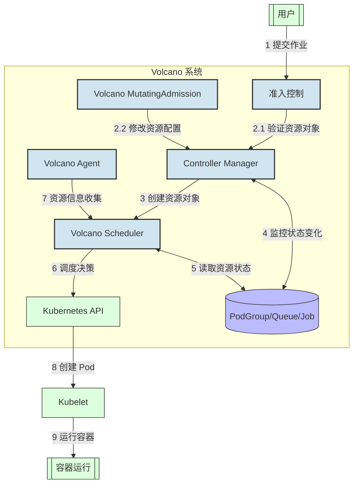
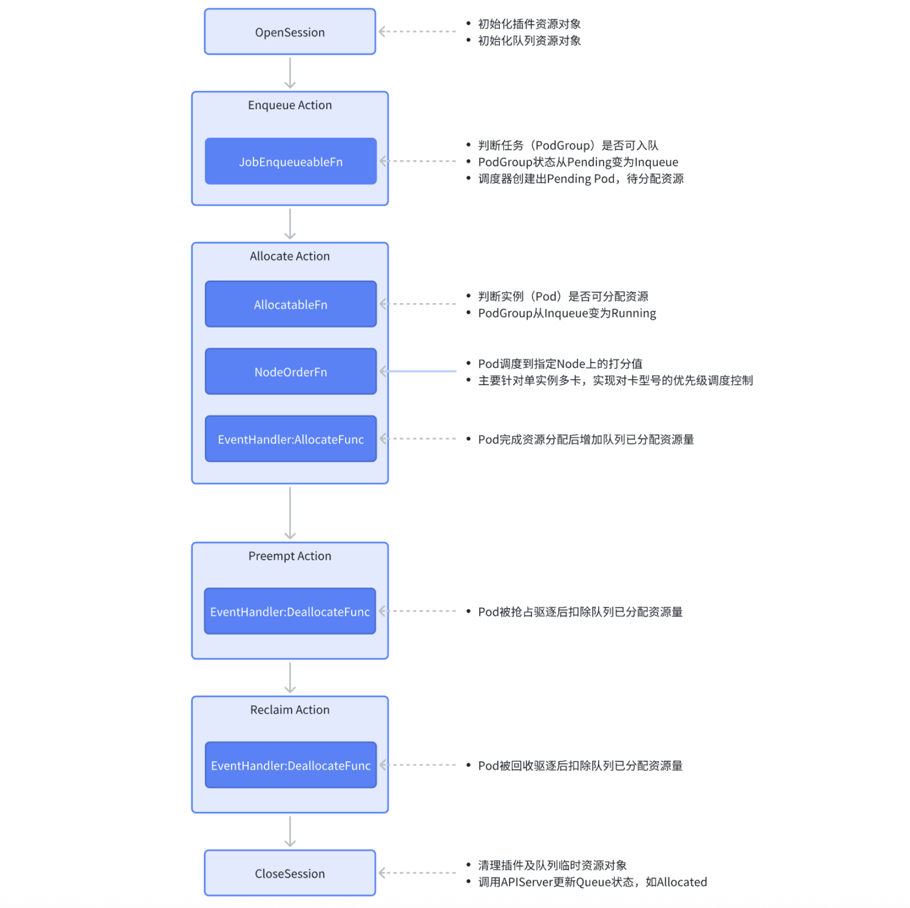

## 背景介绍
### 当前业务场景
- **底座及多卡类型**：底座使用`K8S`，每个集群存在多种智算卡类型（例如`GPU`、`NPU`、`PPU`等）、卡型号（如`NVIDIA-H200`、`Ascend-910B`、`PPU-ZW810E`等）。
- **存在`Share`资源**：每个节点只有一种智算卡型号，但可能存在`Share`卡和整卡并存的情况，例如`GPU`和`MIG`子卡同存在一个节点（如节点上总共有`8`张`NVIDIA-H200`卡，其中有`7`张整卡，`1`张`Share`卡拆分为了`4`张`MIG`子卡：`1`张`3g.71gb`和`3`张`1g.18gb`子卡）。
- **底层工作负载**：离线训练任务使用`Volcano Job`的工作负载实现，在线推理服务使用`K8S`原生的`Deployment`工作负载实现。
- **单实例多卡需求**：由于卡资源较少，为尽可能利用好已有的卡资源，在离线的实例（`Pod`）需要单实例多卡型号部署支持。比如单实例部署时需要支持同时使用`NVIDIA GPU 4090`、`4090D`、`5090`的卡型号部署，哪种卡有资源就部署使用哪种卡。例如同一个离线训练的`Volcano Job`任务，可能部署使用到不同的卡型号（不考虑卡型号之间的性能差异）。
- **底层触发的资源变化**：在线服务需要支持`HPA`（自动伸缩），即在底层自动触发扩缩容，不依赖上层管控触发资源使用。因此智算资源的配额（`Quota`）管控应当能管控到底层由触发的租户资源变化：当租户的配额不够时，不能触发`HPA`扩容；当`HPA`缩容时，应当退还租户的配额量。

### 当前技术实现
- **节点标签规范**：当前智算资源的识别和管理依赖对节点标签的规范化打标，以下是几项重要的标签：
  - **智算卡名称**，标签规则：`厂商域前缀/卡类型.product`
  - **智算卡数量**，标签规则：`厂商域前缀/卡类型.count`
  - **智算卡内存**，标签规则：`厂商域前缀/卡类型.memory`
- 在智算资源的配额管控中，除了上层业务服务层面来实现“软性”的配额管理逻辑实现以外，下层“硬性”的配额控制主要使用`Volcano`的`Volcano Queue`来实现。
  - “软性”配额管控：所有配额的管理由业务服务层来实现，并在发货和扩容时实现粗略的资源校验。目的是：
    - **提升产品交互体验**：由于`K8S`底层资源管理都是异步的，上层`API`可以粗略地检查资源配额，提前反馈错误，便于用户修正操作。
    - **降低对调度器压力**：租户配额不够时，上层可以拦截大量不满足资源配额条件的发货或扩容任务。
  - “硬性”配额管控：真实的配额限制是由底层的基础组件来实现，从调度器层面实现资源的精确配额控制。
- 但`Volcano Queue`针对智算卡的配额管理存在以下痛点：
  - **无法实现卡维度的配额管控**：比如`H200`和`4090`的GPU卡，在`Volcano Queue`的配额管理中（使用`capacity`调度器插件）都是被当做相同的`nvidia.com/gpu`资源名称（`ResourceName`），无法实现精准的卡维度的配额管控。
  - **不支持单实例多卡部署的配额管控**：当任务支持多卡部署时，真实使用哪种卡是由调度器在对实例（`Pod`）调度流程中选择绑定节点的时候决定的，因此业务服务层很难做管控。同时该需求偏定制化，需要独立开发实现。
## 改进方案
### 核心目标
- 实现卡维度的配额管控。
- 实现单实例多卡部署的配额管控。
### 功能设计
#### 调度器背景知识
##### 调度器执行流程介绍
**`Volcano`的任务创建流程**：




**调度器内部工作流程**：


这张图来源`volcano`官网，展示了`volcano`调度器执行的工作流程。调度器中存在`action`和`plugin`两种类型的可插拔资源，`action`用于实现一些关键步骤，如任务入队（`enqueue`）、资源分配（`allocate`）、抢占（`preempt`）、回收（`reclaim`）等；但是`action`的具体实现是依赖`plugin`注册的扩展点函数。`plugin`资源定义了具体的功能特性实现，用于在各个`action`步骤来实现具体的业务逻辑。

`Volcano Scheduler`的工作的大致流程如下：
1. 客户端提交的`Job`被调度器识别到并缓存起来。
2. 周期性开启会话（`Session`），一个调度周期开始。
3. 将没有被调度的`Job`发送到会话的待调度队列中。
4. 遍历所有的待调度`Job`，按照定义的次序依次执行`enqueue`、`allocate`、`preempt`、`reclaim`、`backfill`等动作，为每个`Job`找到一个最合适的节点。将该`Job`绑定到这个节点。`action`中执行的具体算法逻辑取决于注册的`plugin`中各函数的实现。
5. 关闭本次会话。

##### 调度器实现精确的额度管控原理
- **单实例串行执行**：调度器是单实例运行的，所有的集群资源量、资源配额量、已调度和待调度资源量都是在自身内存中计算好后，再串行执行调度、资源更新，不会存在并发调度问题，以保证资源计算和调度的准确性。在`Volcano`调度器中，同时只会存在一个`Session`在执行，`Session`中的所有操作都是串行的，包括其中的`EventHandler`的调用。
- **多副本选主控制**：即便调度器存在多个副本实例（`Pod`），仍然会通过选主方式（通过`etcd`租约）确定只有其中一个实例负责调度逻辑。其他副本会持续监听是否主下线（判断`etcd`租约过期），下线后会重新出现新的主节点接替原有的调度职责。
- **执行逻辑简单**：调度器只负责资源调度，执行逻辑相对简单，因此单实例能够高效支持大量的任务调度。同样，在我们扩展调度器功能时，也不应当执行太复杂的逻辑，尽可能保持逻辑的精炼、算法的高效。

#### 卡维度配额设计
先从使用的角度看看如何来进行卡维度的额度配置。
##### 队列设计
###### 队列卡配额配置示例
```yaml
apiVersion: scheduling.volcano.sh/v1beta1
kind: Queue
metadata:
  name: cr-queue1
  annotations:
    volcano.sh/card.quota: '{"NVIDIA-H200":3,"NVIDIA-H800":2,"NVIDIA-GeForce-RTX-4090":2,"NVIDIA-H800/mps-80g*1/2":2,"NVIDIA-H200/mig-1g.18gb-mixed":3,"NVIDIA-H200/mig-3g.71gb-mixed":1}'
spec:
  weight: 1
  capability:
    cpu: 4
    memory: 4Gi
```
在以上的`cr-queue1`队列中，除了指定了常规的`CPU`和`Memory`的配额外，通过新增的`volcano.sh/card.quota`的注解指定队列的卡型号额度如下：

|卡型号|额度（张）|备注|
|---|---|---|
|`NVIDIA-H200`|`3`|主卡|
|`NVIDIA-H800`|`2`|主卡|
|`NVIDIA-GeForce-RTX-4090`|`2`|主卡|
|`NVIDIA-H800/mps-80g*1/2`|`2`|`MPS`子卡|
|`NVIDIA-H200/mig-1g.18gb-mixed`|`3`|`MIG`子卡|
|`NVIDIA-H200/mig-3g.71gb-mixed`|`1`|`MIG`子卡|

同时需要注意：
- 只有队列配置了具体的卡名称配额才能使用该卡资源，没有配置则无法使用该卡资源。
- 不再使用`guarantee`配置项，底层资源队列不再做资源预留设置，资源的预留依靠上层业务系统划分配额时控制`capability`即可。
- `CPU&Memory`在配置后会按照该配置量进行配额限制，没有配置时默认为`0`，表示没有任何配额，任务使用该队列时将会无法申请`CPU&Memory`资源。

###### 为什么不使用capability、deserved和guarantee配置卡额度
为什么通过新增注解的形式配置卡型号配额，而不是使用队列已有的`capability`、`deserved`和`guarantee`配置方式？
- `Vocalno`原本的资源配额是通过`capability`、`deserved`和`guarantee`配置来实现的，并且这些配置项都是使用节点的资源名称作为键名，配额值作为键值。
- 而我们的卡型号并不是资源名称（拿`NVIDIA-H200`举例，它的资源名称实际为`nvidia.com/gpu`），考虑到如果将卡型号名称作为资源名称注入到这几个配置属性中，可能会引起其他`Volcano`插件（或者后续其他插件）的兼容性问题。因此，我们这里使用了“旁路”的方式，通过注解来配置队列的卡型号配额。
- 其他常规的资源名称，如`CPU`和`Memory`资源配额，仍然只用`Volcano`默认的配置属性来管理。

###### 为什么只配置卡名称，不需要配置nvidia.com/gpu的资源配额
原因如下：
- 原因1：为了简化卡的管理复杂度。如果需要通过注解方式配置卡配额，同时还要配置`capability`、`deserved`或`guarantee`中的对应卡资源名称，配置管理太复杂了。
- 原因2：避免注解方式配置的配额数量与`capability`等配置项中的数量不一致。

在调度器内部进行额度计算的时候，会通过`Pod`注解结合`resources.limits`读取到使用的卡名称对应的数量，和关联队列对应卡名称剩余的额度数量进行比较即可。

###### 使用卡的Pod不限制CPU&Memory资源
`Pod`在使用卡资源时，可以对`CPU`&`Memory`资源的配额不做限制。这是一个偏业务定制化的特性，该特性主要解决业务的痛点背景如下：
- 业务上分为智算卡任务和`CPU`类型任务，两种任务使用不同的节点执行：智算卡节点和`CPU`节点。
- 智算卡任务的资源瓶颈主要在智算卡资源而不是`CPU`/`Memory`，且这两种资源十分空余；但`CPU`任务的瓶颈在`CPU`/`Memory`，`CPU`节点的资源量少，资源使用紧张。
- 因此业务上需要对`CPU`的任务限制`CPU`&`Memory`，但智算卡任务不需要对`CPU`&`Memory`做限制，两种任务类型的配额管理需要区分。

为了使用同一个队列而不是多个队列来实现这一业务需求，我们增加注解特性开关来实现，以减少队列数量提高可运维性。由于该特性开关比较偏全局配置，因此放到插件的配置中来维护，插件的配置示例如下：
```yaml
actions: "enqueue, allocate, backfill"
tiers:
- plugins:
    - name: priority
    - name: gang
      enablePreemptable: false
    - name: conformance
- plugins:
    - name: drf
      enablePreemptable: false
    - name: predicates
    - name: capacity-card
      # Pod在使用卡资源时，可以对CPU&Memory资源的配额不做限制
      arguments:
        cardUnlimitedCpuMemory: true
    - name: nodeorder
    - name: binpack
```

##### 任务示例
在部署任务中增加了以下两项注解内容：
- `volcano.sh/card.request`：（仅针对`Volcano Job`离线任务，可选）当前任务总请求的卡型号资源数量。用于资源预检查提前防止任务进入`Inqueue`状态，避免调度器创建过多`Pending`的`Pod`。如果已经创建出`Pod`，则以`Pod`实际申请的资源为准，例如自动扩缩容(`HPA`)场景，那么调度器会忽略该注解配置，而是使用`Pod`计算出的智算卡数量。

    ```yaml
    metadata:
      annotations:
        # 任务的注解，总共需要多少张卡，则配置多少数值
        volcano.sh/card.request: '{"NVIDIA-H200":2}'
    ```

- `volcano.sh/card.name`：指定任务中具体实例使用的卡型号名称，调度器会使用该注解的卡型号，结合队列的配额进行额度管控。
    ```yaml
    metadata:
      annotations:
        # 具体实例使用的卡型号名称
        volcano.sh/card.name: NVIDIA-H200
    ```

注解名称使用`volcano.sh`作为前缀的目的：
- `Volcano Controller`会将所有`Job/ReplicaSet`等工作负载中`volcano.sh`开头的注解传播到`PodGroup`中，方便调度器使用。这应当是`Volcano`预留的能力，这样我们可以避免去修改`Controller`逻辑，只需要专注`Scheduler`实现即可，也能够避免对`Volcano`调度器已有逻辑源码的侵入。
- 尽可能避免定制化的内容，使得该特性后续能够贡献到社区。

###### 离线训练任务示例

```yaml
apiVersion: batch.volcano.sh/v1alpha1
kind: Job
metadata:
  name: cr-job
  annotations:
    volcano.sh/card.request: '{"NVIDIA-H200":2}'
spec:
  minAvailable: 2
  schedulerName: volcano
  queue: cr-queue1
  policies:
  - action: CompleteJob
    event: TaskCompleted
  tasks:
  - replicas: 1
    name: master
    template:
      metadata:
        annotations:
          volcano.sh/card.name: NVIDIA-H200
      spec:
        affinity:
          nodeAffinity:
            requiredDuringSchedulingIgnoredDuringExecution:
              nodeSelectorTerms:
              - matchExpressions:
                - key: nvidia.com/gpu.product
                  operator: In
                  values:
                  - NVIDIA-H200
        restartPolicy: Never
        resources:
            requests:
                nvidia.com/gpu: 1
...
```

###### 在线推理服务示例

```yaml
apiVersion: apps/v1
kind: Deployment
metadata:
  name: cr-deployment
spec:
  replicas: 2
  selector:
    matchLabels:
      app: nginx
  template:
    metadata:
      labels:
        app: nginx
      annotations:
        volcano.sh/card.name: NVIDIA-H200
        scheduling.volcano.sh/queue-name: "cr-queue1"
    spec:
      affinity:
        nodeAffinity:
          requiredDuringSchedulingIgnoredDuringExecution:
            nodeSelectorTerms:
            - matchExpressions:
              - key: nvidia.com/gpu.product
                operator: In
                values:
                - NVIDIA-H200
      schedulerName: volcano
..
```

#### 单实例多卡配额设计
##### 注解配置
针对单实例多卡部署的使用，只需要将注解中的`volcano.sh/card.request`和`volcano.sh/card.name`键值改为多卡配置即可。

以下是`volcano.sh/card.request`注解配置示例，表示该任务使用`NVIDIA-GeForce-RTX-4090`或者`NVIDIA-GeForce-RTX-4090-D`卡型号，总共需要`2`张：
```yaml
metadata:
  annotations:
    # 任务的注解，总共需要多少张卡，则配置多少数值
    volcano.sh/card.request: '{"NVIDIA-GeForce-RTX-4090|NVIDIA-GeForce-RTX-4090-D":2}'
```

以下是`volcano.sh/card.card`注解配置示例，表示该`Pod`使用`NVIDIA-GeForce-RTX-4090`或者`NVIDIA-GeForce-RTX-4090-D`卡型号：
```yaml
metadata:
  annotations:
    # 具体实例使用的卡型号名称
    volcano.sh/card.card: 'NVIDIA-GeForce-RTX-4090|NVIDIA-GeForce-RTX-4090-D'
```

##### 不同资源类型的多卡组合
不同资源类型的卡组合是指在单实例多卡组合中，每种不同的卡对应的资源类型不同，比如：
- **整卡和`GPU Share`卡组合**，如：`NVIDIA-GeForce-RTX-4090|NVIDIA-H20/mig-1g.24gb-mixed`。
- **不同`GPU Share`卡的组合**，如：`NVIDIA-H20/mig-1g.24gb-mixed|NVIDIA-H20/mig-1g.37gb-mixed`。
- **不同卡类型的组合**，如：`NVIDIA-H200|Ascend-910B`。

例如`NVIDIA-GeForce-RTX-4090|NVIDIA-H20/mig-1g.24gb-mixed`，其中`NVIDIA-GeForce-RTX-4090`卡的资源类型为`nvidia.com/gpu`，`NVIDIA-H20/mig-1g.24gb-mixed`卡的资源类型为`nvidia.com/mig-1g.24gb`。

**调度器不支持这种不同资源类型的多卡组合**，原因如下：
- **由于资源名称不同**，拿`NVIDIA-GeForce-RTX-4090|NVIDIA-H20/mig-1g.24gb-mixed`二选一举例，在部署任务时需要在`resources.requests&limits`中增加两种资源名称：
  - `nvidia.com/gpu: 1`
  - `nvidia.com/mig-1g.24gb: 1`

  调度器虽然能够根据单实例多卡的逻辑将`Pod`调度到合适的节点上，但是由于涉及多种卡资源名称，`NVIDIA GPU DevicePlugin`会为该`Pod`分配两种资源，并不能实现二选一的请求（在调度器中删除`Pod`的`resources`资源配置也不是一个优雅的方式）。并且，不同的智算卡的`DevicePlugin`，其表现行为也可能会不同。

- **如果资源名称相同**，拿`NVIDIA-GeForce-RTX-4090|NVIDIA-GeForce-RTX-4090-D`二选一举例，在部署任务时需要在`resources.requests&limits`中增加一种资源名称：
  - `nvidia.com/gpu: 1`

  调度器能够根据单实例多卡的逻辑将`Pod`调度到合适的节点上，并且只有一种卡资源名称，`NVIDIA GPU DevicePlugin`会为该`Pod`分配一种资源，能够实现二选一的请求。

如果有这种业务场景，解决方案是在上层业务系统中根据每种卡的配额情况将多卡组合自行转换为单卡再执行部署。

##### 任务示例
###### 离线训练任务示例

```yaml
apiVersion: batch.volcano.sh/v1alpha1
kind: Job
metadata:
  name: cr-job
  annotations:
    volcano.sh/card.request: '{"NVIDIA-GeForce-RTX-4090|NVIDIA-GeForce-RTX-4090-D":2}'
spec:
  minAvailable: 2
  schedulerName: volcano
  queue: cr-queue1
  policies:
  - action: CompleteJob
    event: TaskCompleted
  tasks:
  - replicas: 1
    name: master
    template:
      metadata:
        annotations:
          volcano.sh/card.name: NVIDIA-GeForce-RTX-4090|NVIDIA-GeForce-RTX-4090-D
      spec:
        affinity:
          nodeAffinity:
            requiredDuringSchedulingIgnoredDuringExecution:
              nodeSelectorTerms:
              - matchExpressions:
                - key: nvidia.com/gpu.product
                  operator: In
                  values:
                  - H200
        restartPolicy: Never
...
```

###### 在线推理服务示例

```yaml
apiVersion: apps/v1
kind: Deployment
metadata:
  name: cr-deployment
spec:
  replicas: 2
  selector:
    matchLabels:
      app: nginx
  template:
    metadata:
      labels:
        app: nginx
      annotations:
        volcano.sh/card.name: NVIDIA-GeForce-RTX-4090|NVIDIA-GeForce-RTX-4090-D
        scheduling.volcano.sh/queue-name: "cr-queue1"
    spec:
      affinity:
        nodeAffinity:
          requiredDuringSchedulingIgnoredDuringExecution:
            nodeSelectorTerms:
            - matchExpressions:
              - key: nvidia.com/gpu.product
                operator: In
                values:
                - NVIDIA-H200
      schedulerName: volcano
..
```

#### 调度器插件扩展设计
`Volcano`提供了很强大的插件扩展机制，考虑到后续和社区的`Volcano`源码升级融合（或者反哺贡献社区），我们使用了独立的插件来实现卡维度和单实例多卡的额度管控能力。这样可以实现热插拔能力，对`Volcano`调度器源码没有侵入性和影响，可以通过配置的方式即可启用/卸载该插件。
我们的插件名称使用`capacity-card`，插件整体的实现可以参考官方的`capacity`插件。以下为`demo`验证代码的代码结构示例，可以看到，通过独立插件的设计对于`Volcano`社区源码几乎没有侵入性，完全可热插拔。


##### 额度资源对象
在插件的`Quota`管控实现中，需要使用到一些关键的额度资源对象来维护特定类型的资源额度，便于运行时高效计算队列的额度是否足以运行指定任务，如下：
| 资源对象 | 所属对象 | 用途 |
| --- | --- | --- |
|`totalResource` | `Plugin` | 集群总共资源量，包含所有卡资源量。卡资源量来源于所有节点的规范化标签和`node.Status.Allocatable`计算结果。 |
|`totalGuarantee` | `Plugin` | 所有队列预留资源总和，队列的预留资源来源于`guarantee`配置，以及卡配额的`volcano.sh/card.quota`注解配置。该资源对象结合`totalResource`资源对象可以计算出集群的弹性资源量。 |
|`capability` | `Queue` | 队列的资源配额上限，超过该对象中资源申请无法通过调度。队列的资源上限来源于队列的`capability`配置，以及卡配额的`volcano.sh/card.quota`注解配置。 |
|`guarantee` | `Queue` | 队列的资源配额预留，集群为该队列保证的资源量。队列的预留资源来源于队列的`guarantee`配置，以及卡配额的`volcano.sh/card.quota`注解配置。 |
|`request` | `Queue` | 队列中已请求的资源量：队列中所有`Pod`申请量总和（包含`Pending`状态的`Pod`）。 |
|`inqueue` | `Queue` | 队列中排队中的资源量：`PodGroup`处于`Inqueue`状态的资源量。 |
|`allocated` | `Queue` | 队列中已分配的资源量：队列中所有`Bound`、`Binding`、`Running`、`Allocated`状态的`Pod`申请量总和。 |
|`elastic` | `Queue` | 队列中的弹性资源量：已分配的资源量（`allocated`）- 队列中任务最小可运行所需的资源量（比如`Job`中的`minAvailable`配置）。该弹性资源量可被`Pod`调度时使用（可入队，创建出`Pending`状态的`Pod`），但在集群资源紧张时，使用的弹性资源的低优先级任务会被其他高优先级任务抢占。 |

以下为`demo`验证代码片段截图示例：


##### 资源对象初始化
由于`Volcano`是通过`Session`机制间隔触发实现调度，因此每一次`Session`的开启和关闭都会涉及到对以下资源的重新计算和释放：
- **集群总资源量**：前面资源对象表格中的`Plugin`维度的资源计算，资源量来源于集群所有节点资源、队列所有配置。
- **各个队列资源**：前面对象对象表格中的`Queue`维度的资源计算，资源量来源于所有`Pod`的资源量。

由于资源初始化计算需要遍历所有的节点、队列和`Pod`资源，是整合插件实现中资源开销最大的部分，因此该阶段需要尽可能避免过多的内存分配，避免过多的循环计算，提高算法性能。
同时需要注意：
- **部分属性内存获取延迟**：节点列表不能使用`Session`对象中提供的`Nodes`数组，而是需要从`Informer`的`Nodes Lister`中单独获取。虽然`Session`流程中的各个方法是串行执行的，`Informer`也有`WaitSynced`机制，但`Session`中的`Nodes`数组是通过`Informer`事件异步更新的，在`Session`第一次执行的时候，有可能`Session`中的`Nodes`数据还没有同步，造成`Nodes`数据不完整，引起资源初始化数据的不正确。
- **调度器对执行效率敏感**：调度器对效率要求较高，在进行插件开发时，不要对外部服务产生调用依赖。例如，在调度器逻辑中，尽量避免直接去调用`APIServer`，而是尽可能使用`Informer`机制从本地内存获取相关数据。考虑到`Informer`会有数据延迟，在设计功能时需要考虑到数据延迟性对功能的影响。
- **注意卡资源计算单位**：在`Volcano`的资源管理中，除了`CPU`和`Memory`资源，其他都是`Scalar`资源，这些资源的默认单位都是`MilliValue`，即原有的数值乘以`1000`。例如卡资源量是`5`张卡，那么在`Scalar`资源中会显示为`5000`的数值。该数值会在平时开发、查看日志、`Event`时有展示，需要注意自行做转换识别。
- **忽略非智算卡Scalar资源**：`Scalar`可能包括其它设备资源，如`IB`设备的资源，该插件只关注 `CPU`、`Memory`、智算卡资源，对于其它资源不限制。因此在资源初始化和后续计算中忽略非智算卡`Scalar`资源，只计算 `CPU`、`Memory`、智算卡资源。

##### 节点卡型号自动识别
###### 卡型号命名规范
由于是使用智算卡的名称而不是资源名称来实现额度管控，为了保证管控服务分配的卡型号资源名称和调度器从节点识别到的卡型号资源名称一致，需要制定命名规范：
- **节点标签的规范**：每个节点只能存在一种智算卡（但可能同时存在整卡和`Share`的情况），为了方便识别智算卡名称、数量及显存大小，因此制定了具体的节点标签规范，这是我们能够对智算卡进行管理的基础：
  - **智算卡名称**，标签规则：`厂商域前缀/卡类型.product`
  - **智算卡数量**，标签规则：`厂商域前缀/卡类型.count`
  - **智算卡内存**，标签规则：`厂商域前缀/卡类型.memory`
- **GPU Share卡的命名规范**：
  - **MPS**：`%s/mps-%dg*1/%d`，其中：
    - 第一个`%s`为整卡型号名称，例如`NIVIDIA-H20`。
    - 第一个`%d`为整卡的显存大小（单位`Gi`），例如`90`。
    - 第二个`%d`为每张整卡拆分的子卡数量，无论该节点拆分多少张整卡，这里都是一个数值，例如`2`。
    - 最终子卡的名称示例：`NIVIDIA-H20/mps-90g*1/2`
  - **MIG**：`%s/mig-%s-mixed`，其中：
    - 第一个`%s`为整卡型号名称，例如`NIVIDIA-H20`。
    - 第二个`%s`为MIG的规格名称，例如`1g.12gb`。
    - 统一`MIG`的拆分策略为`mixed`，表示每张整卡可以由不同的拆分策略。
    - 最终子卡的名称示例：`NIVIDIA-H20/mig-1g.12gb-mixed`
- **其他Share卡命名规范**：通过标签形式制定，具体规则等未来有需要再确定，预留该扩展空间。

###### 如何识别整卡信息
- 遍历每个节点的节点标签，找到符合智算卡节点标签命名规范的标签内容，标签示例：
    ```yaml
    nvidia.com/gpu.product: NIVIDIA-H20
    nvidia.com/gpu.count: 8
    nvidia.com/gpu.memory: 97871
    ```
- 识别符合`厂商域前缀/卡类型.product`和`厂商域前缀/卡类型.memory`两项命名规范的的标签（例如通过正则匹配），如果存在则可以获得`厂商域前缀`及`卡类型`，例如`nvidia.com`及`gpu`。
- 因此可以获得智算卡名称、智算卡显存，进而可以获得智算卡数量。例如`NIVIDIA-H20`、`97871`、`8`。

###### 如何获取GPU Share子卡信息及资源量
- 前面获取到了节点的整卡信息，我们继续遍历节点的`Status.Allocatable`字段，获取资源信息。
- **`MPS`子卡信息识别**：
  - 由于`MPS`的资源名称是固定的`nvidia.com/gpu.shared`，通过该名称判断`Status.Allocatable`中是否存在`MPS`子卡资源，如果存在，该资源值则是`MPS`子卡的资源量（例如`8`）。
  - 获取节点的`nvidia.com/gpu.replicas`标签内容，该标签内容则是`MPS`的单卡拆分的副本数（例如`2`）。
  - 根据`GPU Share MPS`子卡的命名规范`%s/mps-%dg*1/%d`可以获取到`MPS`子卡的名称，例如`NIVIDIA-H20/mps-90g*1/2`。

- **`MIG`子卡信息识别**：
  - MIG的节点包含了带有`nvidia.com/mig-`前缀的标签和资源名称，并且我们需要统一使用`mixed`子卡拆分策略。
  - 去掉`nvidia.com/mig-`前缀的资源名称（例如`nvidia.com/mig-1g.12gb`）则是`MIG`的规格名称（例如`1g.12gb`），那么该资源值则是`MIG`子卡的资源量（例如`2`）。
  - 根据`GPU Share MIG子卡命名规范%s/mig-%s-mixed`则可以获取到`MIG`的子卡名称，例如`NIVIDIA-H20/mig-1g.12gb-mixed`。

###### 如何识别整卡资源量
- 遍历节点的`Status.Allocatable`字段，在过滤完`MPS`和`MIG`子卡的资源名称后，如果该资源名称还带有厂商域前缀前缀，那么该资源名称则为整卡资源名称。

##### 调度器扩展点设计
`Volcano`调度器提供了丰富的扩展点，以提供了很强大的扩展性。由于扩展点比较多，这里不详细介绍，具体请参考：[`Volcano Session Plugins`方法](./1000-Volcano%20Session%20Plugins方法介绍.md。

本方案使用到的关键扩展点如下：

###### JobEnqueueableFn
该扩展点工作在`enqueue` action中，用于判断作业是否可以进入调度队列。该函数将会把`Pending`状态的`PodGroup`转换为`Inqueue`状态，随后`PodGroup`对应的`Pod`将会创建出来，新建出来的`Pod`处于`Pending`状态。

在该扩展点中，使用以下算法决定任务（`Job`）是否能够入队：
```
队列资源预使用总量(totalToBeUsed) = 任务最小请求资源量(job.MinReqResource) + queue.allocated + queue.inqueue - queue.elastic

队列资源总量(capability) >= 队列资源预使用总量(totalToBeUsed) ? 可入队: 不可入队。
```

###### AllocatableFn
该扩展点工作在`allocate action`中，用于判断队列是否可以为任务分配资源。该函数将会允许`Pending`状态的`Pod`继续进行调度（分配资源），随后`Pod`将会被绑定到符合条件的节点上，`Pod`状态从`Pending`转换到`Running`状态。

在该扩展点中，使用以下算法决定任务的`Pod`是否能够分配资源：
```
队列资源预分配总量(totalToBeAllocated) = 任务总请求资源量(job.request) + queue.allocated

队列资源总量(capability) >= 队列资源预分配总量(totalToBeAllocated) ? 可分配: 不可分配。
```

###### NodeOrderFn
该扩展点工作在`allocate action`中，用于决定`Node`调度的优先级。我们可以使用该扩展点来实现单实例多卡部署的配额管控中的多卡优先级控制，例如，`Pod`请求`NVIDIA-GeForce-RTX-4090|NVIDIA-GeForce-RTX-4090-D`两种卡型号资源，那么我们可以根据配置的顺序来决定调度优先级，其中`NVIDIA-GeForce-RTX-4090`的优先级调度高于`NVIDIA-GeForce-RTX-4090-D`。

该扩展点作为预留功能扩展能力，未来需要支持单实例多卡的优先级控制的时候再增加扩展实现。

###### EventHandler
事件处理器，用于在任务分配和释放过程中执行自定义的回调逻辑。这是插件中对资源分配管理的关键方法。需要注意，`EventHandler`在`Session`整合流程中不是异步触发的，而是串行执行的。

- `AllocateFunc`:

    任务被正式分配到节点时（`Allocate`操作）、进入流水线调度时（`Pipeline`操作）、被驱逐的任务恢复运行时（`Unevict`操作），参数为包含任务和节点信息的事件。

    在该回调中，需要将已完成分配的`Pod`总请求资源量累加到队列的已分配总量（`allocated`）中。如果该实例是单实例多卡部署，那么真实累加的卡型号资源量需要根据实例绑定节点的卡型号类型来确定。

- `DeallocateFunc`:

    任务被抢占驱逐（`Evict`操作）、调度决策被撤销（`UnPipeline`操作）、任务分配被取消（`UnAllocate`操作）时，参数为包含任务和节点信息的事件。

    在该回调中，需要将已取消分配的`Pod`总请求资源量从队列的已分配总量（`allocated`）中减去。如果该实例是单实例多卡部署，那么真实扣减的卡型号资源量需要根据实例绑定节点的卡型号类型来确定。

##### 具体执行流程
以下是该插件的关键执行流程，以及关键操作介绍，整体流程都是串行执行，以避免并发调度问题。



##### Event信息提示
在`Volcano`默认的配额管理插件`capacity`中，一旦出现队列额度问题，只有查看调度器日志信息才能确定`任务/Pod`无法调度的原因，运维效率低下。

为了解决这个问题，在新的插件中，我们需要将调度失败的原因通过`Event`的方式添加到`任务/Pod`上，这样便于快速定位由于额度问题引发的调度问题。
- **针对任务无法调度（`Volcano Job`）**：这个时候通常没有`Pod`被创建出来，我们可以将`Event`创建到`PodGroup`上，描述具体无法调度的原因。由于为`PodGroup`创建`Event`是`Volcano Session`已经封装好的能力（并没有将`Event`创建到`Volcano Job`上），因此我们这里保留`Volcano`原有设计，当遇到`Pod`无法创建时，查看`PodGroup`的`Event`即可。例如：`Queue <cr-queue1> has insufficient <NVIDIA-H200> quota: requested <5000>, total would be <5000>, but capability is <3000>`

- **针对`Pod`处于`Pending`无法调度到节点上**：我们可以将`Event`创建到`Pod`上，描述具体无法调度的原因。该功能需要在插件中自行实现封装。例如：`Queue <cr-queue1> has insufficient <NVIDIA-H200> quota: requested <5000>, total would be <5000>, but capability is <3000>`

### 上层额度管控的关键实现点
#### 额度的资源查询
- **队列状态可用**：在`Volcano`的资源队列中，有当前队列已分配的资源量（`Queue.Status.Allocated`），理论上来讲上层直接使用即可，不用再重新汇总`Pod`数据。
- **历史数据的考虑**：但考虑到存在历史数据，这部分数据并没有真正绑定到资源队列上（绑定队列需要重启业务`Pod`，影响面较大），因此上层额度的资源查询仍然由额度管控服务遍历`Pod`去汇总统计。
- **状态逻辑一致性**：需要注意判断`Pod`的状态需要保持和`Volcano`相同的判断逻辑。

#### 不再使用层级队列
- **平级的队列关系**：为降低运维管控的复杂度，我们的调度器插件不再支持层级队列，资源队列都是平级关系（其父级队列默认为`root`）。并且在使用资源队列时，不再需要对根队列（`root`）做额度配置。
- **统一额度管控入口**：在分配资源队列额度时。我们的调度器插件不会对剩余资源量进行额度校验，比如集群资源在分配完后只有`2`张`H200`的卡剩余资源量，但是底层调度器任然允许继续分配超过`2`张`H200`的卡资源量。这给上层业务管控服务能力提供了更多的扩展空间：
  - 上层的资源管控服务作为额度管控的唯一入口和控制点，超出集群资源总量的额度分配会导致队列之间（租户之间）资源的争抢。
  - 这种设计也为未来的资源超卖提供了可能。
- **调度器稳定性增强**：在集群资源发生变更，如集群机器被挪出、机器出现故障、`GPU Share`拆卡，导致卡资源不充足时，在`Volcano`默认的额度管理（`capacity`插件）中会引发调度器的整体崩溃。在我们自定义的额度插件中不再出现调度器崩溃的问题，但卡资源不够会造成申请使用该卡型号的业务`Pod Pending`，这也符合预期。

### 常见调度问题的快速排查
#### 额度分配的合理性检查
例如：
- **集群资源被超额分配**：本来只有`10`卡资源，实际上分出去了`11`卡。可能是业务系统没有做到合理校验，或者集群资源发生了变更。
- **集群资源产生了异常**：如节点被挪出、节点故障导致集群总资源低于队列已分配额度。
解决方案：
- 提供队列`grafana`可观测面板，实现对集群总资源、在线离线总资源、队列额度资源、已使用量进行可观测，主动发现问题。

#### 使用资源队列的Volcano Job的Pod未创建出来
查询`Pod`对应的`PodGroup`的`Event`信息即可，如果是调度问题，在`Event`中会有详细的`Warning`事件。

#### 使用资源队列的Pod创建出来，但持续处于Pending状态
查询`Pod`的`Event`信息即可，如果是调度问题，在`Event`中会有详细的`Warning`事件。

### 其他注意事项
#### 调度器启动参数
调度器默认配置为：
```bash
- --logtostderr
- --scheduler-conf=/volcano.scheduler/volcano-scheduler.conf
- --enable-healthz=true
- --enable-metrics=true
- --leader-elect=false
- --kube-api-qps=2000
- --kube-api-burst=2000
- --schedule-period=1s
- --node-worker-threads=20
- -v=3
- 2>&1
```
调整为：
- 多节点部署调度器实例，并开启选主配置`leader-elect`
- 调整调度器执行建个为`3s`
```bash
- --logtostderr
- --scheduler-conf=/volcano.scheduler/volcano-scheduler.conf
- --enable-healthz=true
- --enable-metrics=true
- --leader-elect=true
- --kube-api-qps=2000
- --kube-api-burst=2000
- --schedule-period=3s
- --node-worker-threads=20
- -v=3
- 2>&1
```