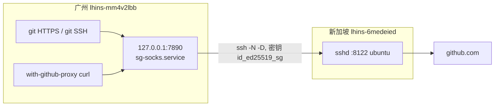

## 背景

广州轻量应用服务器直连 `github.com` 会超时（`curl` 约 `8s` 无响应）。同账号下另有一台新加坡轻量，出网访问 `GitHub` 正常。

目标：让广州机上的 `git` / `curl` / `www` 用户稳定访问 `GitHub`，同时：

- 不把整机出网都绕到新加坡（避免腾讯云元数据、`apt`、云 `API` 被劫持）
- 不开`TUN`
- `SOCKS` 只绑 `127.0.0.1`，安全组不放行 `7890`
- 广州重启后隧道自动恢复

这是 **`SSH` 动态转发（正向 `SOCKS` 代理）**，不是 `nginx` 反向代理，也不是 `Clash / mihomo TUN`。


## 机器一览

| | 广州（国内） | 新加坡 |
|---|---|---|
| 腾讯云轻量 ID | `lhins-mm4v2lbb` | `lhins-6medeied` |
| 地域 | `ap-guangzhou` | `ap-singapore` |
| 主机名 | `VM-0-11-ubuntu` | `VM-0-17-ubuntu` |
| 系统 | `Ubuntu 26.04` | `Ubuntu 24.04` |
| 常用用户 | `ubuntu`（`sudo`）、`www`、`root` | 登录用户 `ubuntu` |
| SSH | 控制台 `OrcaTerm` 即可 | 监听 **`8122`**（`22` 已关掉） |
| 公网 | 不必写进隧道配置 | 当前 **`43.133.55.70`** |

域名 `goframe.org` 走 `Cloudflare` 橙云。橙云只代理 `80/443`，**不能**把 `ssh goframe.org -p 8122` 打到源站。隧道里的 `HostName` 必须写新加坡**源站公网 IP**，或单独做一个灰云子域名。

## 拓扑



广州本机只开 `SOCKS`；真正出网发生在新加坡。未配置代理的进程（`apt`、网站对外访问、腾讯云 `API`）仍直连。

## 哪些流量会走新加坡

| 流量 | 是否走隧道 | 配置位置 |
|---|---|---|
| `git clone/pull` HTTPS：`github.com`、`api.github.com`、`codeload.github.com`、`gist.github.com`、`objects.githubusercontent.com`、`ghcr.io` | 是 | `/etc/gitconfig` |
| `www` 的 `git@github.com` SSH | 是 | `/home/www/.ssh/config` |
| `root` 的 `git@github.com` SSH | 是 | `/root/.ssh/config` 的 `ProxyJump sg` |
| `curl` / `wget` / `pip` | 否，除非显式包一层 | `/usr/local/bin/with-github-proxy` |
| `apt`、腾讯云 API、`169.254.169.254`、国内镜像 | 否 | — |

`curl https://github.com` 不加 `-x` 仍然直连，在广州通常超时。

## 落地配置（广州）

以下文件都在**广州机**上。新加坡侧只需保证 `8122` 对广州开放，以及 `ubuntu` 的 `authorized_keys` 里有广州公钥。

### 1. 隧道密钥

```text
/root/.ssh/id_ed25519_sg
/root/.ssh/id_ed25519_sg.pub
```

无口令，仅给 `sg-socks.service` 用。公钥已写入新加坡 `/home/ubuntu/.ssh/authorized_keys`，注释为 `gz-lighthouse-to-sg`。

重建密钥：

```bash
ssh-keygen -t ed25519 -f /root/.ssh/id_ed25519_sg -N '' -C 'gz-lighthouse-to-sg'
# 把 .pub 追加到新加坡 ubuntu 的 authorized_keys 后：
chmod 700 /home/ubuntu/.ssh
chmod 600 /home/ubuntu/.ssh/authorized_keys
chown -R ubuntu:ubuntu /home/ubuntu/.ssh
```

### 2. SSH 主机别名（新加坡 IP 只改这里）

`/root/.ssh/config`：

```sshconfig
# 新加坡公网 IP 只改下面 Host sg 的 HostName，然后：
# ssh-keygen -R 旧IP -f /root/.ssh/known_hosts
# ssh-keyscan -p 8122 新IP >> /root/.ssh/known_hosts
# systemctl restart sg-socks.service
Host sg
  HostName 43.133.55.70
  User ubuntu
  Port 8122
  IdentityFile /root/.ssh/id_ed25519_sg
  IdentitiesOnly yes
  StrictHostKeyChecking accept-new
  ServerAliveInterval 30
  ServerAliveCountMax 3
  ExitOnForwardFailure yes

Host github.com
  HostName ssh.github.com
  User git
  Port 443
  ProxyJump sg
```

`sg-socks.service` 里写的是别名 `sg`，**不要**把 `IP` 再写进 `unit`。`www` 不读这份文件，换 `IP` 也不用改 `www`。

### 3. systemd 开机隧道

`/etc/systemd/system/sg-socks.service`：

```ini
[Unit]
Description=SOCKS5 proxy via Singapore SSH for GitHub
After=network-online.target
Wants=network-online.target

[Service]
Type=simple
ExecStart=/usr/bin/ssh -N -F /root/.ssh/config -o ExitOnForwardFailure=yes -o ServerAliveInterval=30 -o ServerAliveCountMax=3 -D 127.0.0.1:7890 sg
Restart=always
RestartSec=5

[Install]
WantedBy=multi-user.target
```

```bash
systemctl daemon-reload
systemctl enable --now sg-socks.service
```

要点：

- `-D 127.0.0.1:7890`：只本机可连，不要写成 `0.0.0.0`
- `enable`：广州重启后自动拉起
- `Restart=always`：新加坡短暂不可达时每 `5s` 重试
- 安全组 / 防火墙不要放行 `7890`

### 4. 系统 git HTTPS 代理

所有用户（含 `www`）共用 `/etc/gitconfig`：

```ini
[http "https://github.com"]
    proxy = socks5h://127.0.0.1:7890
[http "https://api.github.com"]
    proxy = socks5h://127.0.0.1:7890
[http "https://codeload.github.com"]
    proxy = socks5h://127.0.0.1:7890
[http "https://gist.github.com"]
    proxy = socks5h://127.0.0.1:7890
[http "https://objects.githubusercontent.com"]
    proxy = socks5h://127.0.0.1:7890
[http "https://ghcr.io"]
    proxy = socks5h://127.0.0.1:7890
```

`socks5h` 的 `h` 表示 DNS 在新加坡侧解析，避免国内污染。

等价命令：

```bash
git config --system http.https://github.com.proxy socks5h://127.0.0.1:7890
# 其余 host 同理
```

### 5. `www` 用户

家目录 `/home/www`，登录 `shell` 为 `bash`。`git` HTTPS 已走系统配置。另外：

`/home/www/.ssh/config`（`GitHub SSH` 走本机 `SOCKS`，不依赖新加坡 `IP`）：

```sshconfig
Host github.com
  HostName ssh.github.com
  User git
  Port 443
  ProxyCommand nc -X 5 -x 127.0.0.1:7890 %h %p
```

机器上已装 `netcat-openbsd`，才有 `-X 5`。

`/usr/local/bin/with-github-proxy`：

```bash
#!/bin/bash
export http_proxy=socks5h://127.0.0.1:7890
export https_proxy=socks5h://127.0.0.1:7890
export ALL_PROXY=socks5h://127.0.0.1:7890
export no_proxy=localhost,127.0.0.1,169.254.169.254,.tencentcloudapi.com,.myqcloud.com,.internal,10.0.0.0/8
exec "$@"
```

`/home/www/.github-proxy.sh`：需要给当前 `shell` 临时开代理时 `source`，**不要**写进默认登录环境，否则会把腾讯云流量一并带走。

`www` 推送 `git@github.com` 还需要自己的 `GitHub` 公钥：

```bash
sudo -iu www
ssh-keygen -t ed25519 -f ~/.ssh/id_ed25519 -C 'www@gz'
cat ~/.ssh/id_ed25519.pub
# 粘到 GitHub SSH keys 后再测：ssh -T git@github.com
```

当前若未放公钥，`ssh -T git@github.com` 会显示 `Permission denied (publickey)`，这只说明认证失败，TCP 已经经新加坡打到 GitHub。

## 日常使用

```bash
# 任意用户，HTTPS
git clone https://github.com/NVIDIA/nvidia-resiliency-ext.git

# curl / pip 等
with-github-proxy curl -I https://github.com
with-github-proxy pip install some-pkg

# 等价
curl -I -x socks5h://127.0.0.1:7890 https://github.com
```

```bash
sudo -iu www
git clone https://github.com/org/repo.git
```

## 自检

```bash
systemctl is-enabled sg-socks.service   # enabled
systemctl is-active sg-socks.service    # active
ss -lnt | grep 7890                     # 127.0.0.1:7890
curl -sI --max-time 12 -x socks5h://127.0.0.1:7890 https://github.com | head
git ls-remote https://github.com/NVIDIA/nvidia-resiliency-ext.git HEAD

# 对照：直连应失败
curl -sI --max-time 8 https://github.com
```

`www`：

```bash
sudo -n -u www -H git ls-remote https://github.com/NVIDIA/nvidia-resiliency-ext.git HEAD
sudo -n -u www -H with-github-proxy curl -sI --max-time 12 https://github.com | head
```

广州到新加坡 `8122` 应通、`22` 不通（已关）：

```bash
nc -zv -w 4 43.133.55.70 8122
```

## 如果新加坡 IP 变了

只改广州 `/root/.ssh/config` 里 `Host sg` 的 `HostName`，然后：

```bash
sudo ssh-keygen -R 旧IP -f /root/.ssh/known_hosts
sudo ssh-keyscan -p 8122 新IP >> /root/.ssh/known_hosts
sudo systemctl restart sg-socks.service
sudo systemctl is-active sg-socks.service
curl -I --max-time 12 -x socks5h://127.0.0.1:7890 https://github.com
```

`Port` / `User` 仍为 `8122` / `ubuntu` 则不用动。`git` 配置、`www` 的 `SOCKS`、`7890` 都不用改。

更省事的做法：`Cloudflare` 给一个**灰云**子域名（例如 `ssh.goframe.org`）指向源站，把 `HostName` 改成该域名，以后只改 `DNS`。

## 新加坡 sshd 注意

- 监听 `8122`（当前 `sshd` 绑 `*:8122`）
- `AllowTcpForwarding` 保持默认即可（注释掉的 `yes`）；不要打开 `GatewayPorts`
- 轻量防火墙 / 安全组放行广州访问 `8122`
- 若加 `AllowUsers`，必须包含 `ubuntu`

不要在新加坡公网再开一套开放 `SOCKS`。隧道出口是 `SSH` 会话本身。

## 刻意没做的事

- 未装 `ClashX` / `mihomo TUN`（无桌面，且容易把 `VPC` / `元数据` 带走）
- 未设全局 `http_proxy`（`/etc/environment` 里现有的 `GOPROXY=https://mirrors.tencent.com/go,direct` 是 `Go` 模块镜像，与本隧道无关）
- 未把 `7890` 暴露到公网
- 未用 `goframe.org:8122` 当 `SSH` 入口

## 文件清单（广州）

| 路径 | 作用 |
|---|---|
| `/root/.ssh/config` | `Host sg`（**新加坡 IP 唯一来源**）、`root` 的 `GitHub ProxyJump` |
| `/root/.ssh/id_ed25519_sg` | 广州 → 新加坡隧道私钥 |
| `/root/.ssh/known_hosts` | 新加坡主机钥 |
| `/etc/systemd/system/sg-socks.service` | 开机 `SOCKS` |
| `/etc/gitconfig` | 全用户 `GitHub HTTPS` 代理 |
| `/usr/local/bin/with-github-proxy` | 给 `curl`/`pip` 临时套代理 |
| `/home/www/.ssh/config` | `www` 的 `GitHub SSH` → 本机 `7890` |
| `/home/www/.github-proxy.sh` | `www` 可选 `source` |
| `/home/www/.bashrc` | 仅注释说明，不自动 `export` 代理 |

新加坡：`/home/ubuntu/.ssh/authorized_keys` 中 `gz-lighthouse-to-sg` 那一行。
