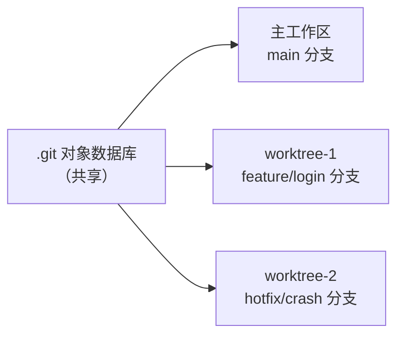
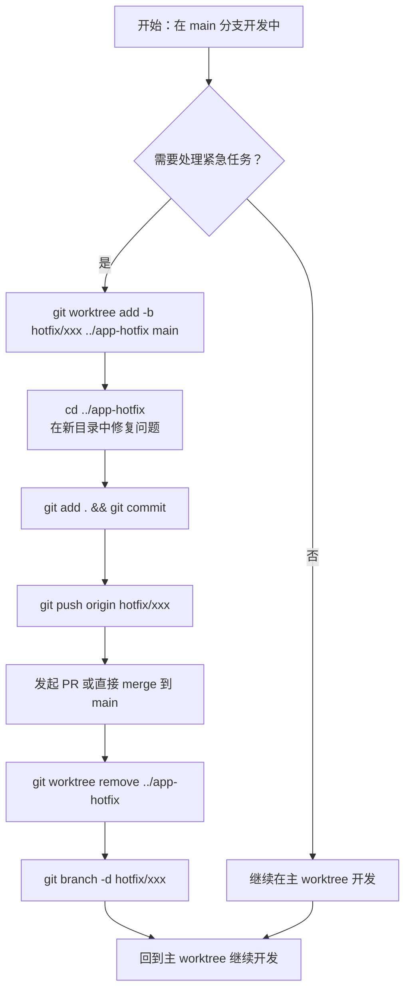

## 什么是Git Worktree

`Git Worktree`是`Git 2.5`（`2015`年发布）引入的一项内置特性，允许在同一个本地仓库中同时检出**多个分支**到**不同的目录**，每个目录拥有独立的工作区（`working tree`）和暂存区（`index`），但共享同一份`.git`对象数据库。

简单来说，一个`git`仓库可以在不同文件系统路径下同时"展开"多个分支的代码，互不干扰，而无需克隆多个副本。



## 解决的问题与核心优势

### 传统方式的痛点

在没有`Git Worktree`之前，如果需要同时处理多个分支，常见的做法有：

1. **频繁切换分支**：`git stash` → 切换 → 工作 → 切换回来 → `git stash pop`，流程繁琐且容易出错。
2. **克隆多个仓库副本**：在不同目录分别`git clone`同一个仓库，但会浪费磁盘空间，且各副本的对象数据库相互独立，Push/Pull 操作无法共享缓存。
3. **中断当前工作**：处理紧急的`hotfix`时，必须先提交或丢弃当前未完成的工作，打断开发节奏。

### Git Worktree 的显著优点

| 优点 | 说明 |
|------|------|
| 多分支并行开发 | 同时在多个目录打开不同分支的代码，互不影响 |
| 零重复磁盘空间 | 所有`worktree`共享同一个`.git`对象库，无数据冗余 |
| 无需`stash` | 切换任务时不必暂存当前修改，各工作区状态完全独立 |
| 快速响应紧急任务 | 可立即在新`worktree`中处理`hotfix`，无须中断当前开发 |
| 原生`git`支持 | 无需安装任何插件，所有`git`子命令均正常工作 |
| 支持编辑器并行打开 | 可在多个编辑器窗口中分别打开不同`worktree`目录 |

## 基本命令速查

| 命令 | 说明 |
|------|------|
| `git worktree add <路径> <分支>` | 创建新的`worktree`并检出指定分支 |
| `git worktree add -b <新分支> <路径>` | 创建新分支并同时创建对应`worktree` |
| `git worktree list` | 列出所有`worktree` |
| `git worktree remove <路径>` | 删除指定`worktree` |
| `git worktree prune` | 清理失效的`worktree`记录 |
| `git worktree move <路径> <新路径>` | 移动`worktree`到新位置 |
| `git worktree lock <路径>` | 锁定`worktree`，防止被自动清理 |
| `git worktree unlock <路径>` | 解锁`worktree` |

## 使用示例

### 创建一个Worktree

假设当前仓库主目录为`/project/my-app`，正在`main`分支上开发，需要同时处理`feature/user-auth`分支。

**基于已有分支创建`worktree`：**

```bash
# 进入主仓库目录
cd /project/my-app

# 创建 worktree，检出已有分支
git worktree add ../my-app-feature feature/user-auth
```

执行后，`/project/my-app-feature`目录将包含`feature/user-auth`分支的完整代码，可以直接开始工作。

**基于当前`HEAD`创建新分支并同时建立`worktree`：**

```bash
# -b 表示创建新分支
git worktree add -b hotfix/payment-bug ../my-app-hotfix main
```

此命令基于`main`分支创建名为`hotfix/payment-bug`的新分支，并将其检出到`../my-app-hotfix`目录。

**查看所有`worktree`：**

```bash
git worktree list
```

输出示例：

```text
/project/my-app          abc1234 [main]
/project/my-app-feature  def5678 [feature/user-auth]
/project/my-app-hotfix   ghi9012 [hotfix/payment-bug]
```

### 在Worktree中提交修改

在新的`worktree`目录中，所有常规`git`操作均正常使用，与普通仓库无异：

```bash
# 进入 worktree 目录
cd ../my-app-hotfix

# 修改代码后正常提交
git add .
git commit -m "fix: 修复支付流程空指针异常"

# 推送到远端
git push origin hotfix/payment-bug
```

:::tip
在某个`worktree`中提交的代码，在其他`worktree`执行`git log`或`git fetch`时同样可见，因为它们共享同一个`.git`对象库。
:::

### 将修改合并回主分支

完成`worktree`中的工作后，合并回目标分支的流程与普通分支合并完全一致。

**方式一：在主`worktree`中执行合并**

```bash
# 回到主工作目录
cd /project/my-app

# 合并 hotfix 分支
git merge hotfix/payment-bug

# 或使用 rebase
git rebase hotfix/payment-bug
```

**方式二：通过`Pull Request`/`Merge Request`合并**

直接在代码托管平台（`GitHub`、`GitLab`等）发起`PR`/`MR`，与普通分支流程完全相同。

### 删除Worktree

任务完成后，应及时删除不再需要的`worktree`，释放磁盘空间和`git`内部记录。

```bash
# 方式一：使用 git 命令删除（推荐）
git worktree remove ../my-app-hotfix

# 方式二：如果 worktree 中有未提交的修改，需要强制删除
git worktree remove --force ../my-app-hotfix
```

:::caution
`git worktree remove`会同时删除目录和`git`内部的`worktree`记录。如果只是手动删除了目录（`rm -rf`），则需要执行`git worktree prune`来清理失效的内部记录。
:::

```bash
# 清理因手动删除目录而残留的 worktree 记录
git worktree prune
```

删除`worktree`后，对应的分支本身不会被删除，仍然可以通过`git branch`查看。若需要同时删除分支：

```bash
git branch -d hotfix/payment-bug
```

## 完整工作流示意




## 注意事项与最佳实践

### 注意事项

**同一分支不能被多个Worktree同时检出**

`Git`不允许同一分支被多个`worktree`同时检出。如果尝试在新的`worktree`中检出一个已经在其他`worktree`中使用的分支，`git`会报错：

```text
fatal: 'feature/user-auth' is already checked out at '/project/my-app-feature'
```

需要先删除占用该分支的`worktree`，或检出到其他分支才能操作。

**Worktree目录的位置建议放在仓库目录外**

推荐将`worktree`目录放在主仓库目录的**同级**或**上级**路径下，而不是放在主仓库目录内部。否则主仓库的`.gitignore`配置可能需要额外处理，也容易造成混淆：

```bash
# 推荐：放在同级目录
git worktree add ../my-app-feature feature/user-auth

# 不推荐：放在主仓库目录内部
git worktree add ./worktrees/feature feature/user-auth
```

**裸仓库（Bare Repository）是管理Worktree的最佳搭档**

对于纯粹以`worktree`为主要工作方式的场景，可以使用裸仓库（`--bare`）作为`.git`数据存储中心，完全通过`worktree`操作代码。这样不会有"主工作区"的概念，所有分支均通过独立`worktree`检出：

```bash
# 克隆为裸仓库（只有 .git 内容，无工作文件）
git clone --bare https://github.com/your/repo.git my-repo.git

# 进入裸仓库目录
cd my-repo.git

# 为每个需要工作的分支创建 worktree
git worktree add ../my-repo-main main
git worktree add ../my-repo-feature feature/user-auth
```

**`.git`文件而非目录**

在`worktree`目录中，`.git`不是一个目录，而是一个指向主仓库`.git/worktrees/<name>`的**文件**：

```
# worktree 目录内的 .git 文件内容示例
gitdir: /project/my-app/.git/worktrees/my-app-feature
```

因此，直接切换`worktree`目录下的分支（`git checkout other-branch`）是不被允许的（因为该分支可能已被其他`worktree`占用），需要使用`git worktree`命令管理。

**注意`git stash`的作用域**

`git stash`的内容存储在`.git`对象库中，因此在任意一个`worktree`中执行`git stash`，其他`worktree`都可以通过`git stash list`看到。这既是特性也可能造成混乱，建议为`stash`添加描述性消息：

```bash
git stash push -m "feature-auth: 未完成的表单验证逻辑"
```

### 最佳实践

**1. 统一命名规范**

建议`worktree`目录名与分支名保持一致，便于识别：

```bash
# 分支名：feature/user-auth
# worktree 目录名：my-app-feature-user-auth
git worktree add ../my-app-feature-user-auth feature/user-auth
```

**2. 及时清理废弃的Worktree**

分支合并或任务完成后，及时执行`git worktree remove`清理，保持工作环境整洁：

```bash
git worktree list              # 查看现有 worktree
git worktree remove <路径>     # 删除指定 worktree
git worktree prune             # 清理失效记录
```

**3. 搭配`tmux`或多终端分屏使用**

将`Git Worktree`与`tmux`分屏结合，可以在一个终端中同时监控多个`worktree`的状态，如运行不同的测试或构建命令，效率更高。

**4. Hotfix 标准流程建议**

```bash
# Step 1: 从 main 创建 hotfix worktree
git worktree add -b hotfix/issue-123 ../app-hotfix main

# Step 2: 修复问题并提交
cd ../app-hotfix
# ... 修改代码 ...
git commit -am "fix: 修复 issue-123"

# Step 3: 推送并发起 PR
git push origin hotfix/issue-123

# Step 4: PR 合并后清理
git worktree remove ../app-hotfix
git branch -d hotfix/issue-123
```

**5. 与`CI/CD`集成**

在`CI/CD`脚本中，可以利用`worktree`在同一个克隆的仓库目录下并行检出多个分支进行构建/测试，避免重复克隆带来的网络和磁盘开销。

## 总结

`Git Worktree`是一个被很多开发者忽视但极为实用的特性。它从根本上改变了多分支并行工作的方式——不再需要`stash`、不再需要克隆多份仓库、不再受"只能检出一个分支"的约束。结合`VS Code`的多窗口或多根工作区能力，`Git Worktree`可以显著提升在多任务并行场景下的开发效率，特别适合以下场景：

- 主线开发与`hotfix`并行处理
- `Code Review`时需要在本地运行对方分支的代码
- 需要对比两个分支的运行行为差异
- 大型项目中多个`feature`分支的同步推进
