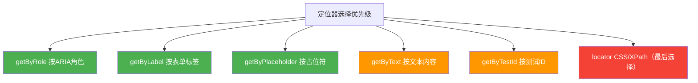
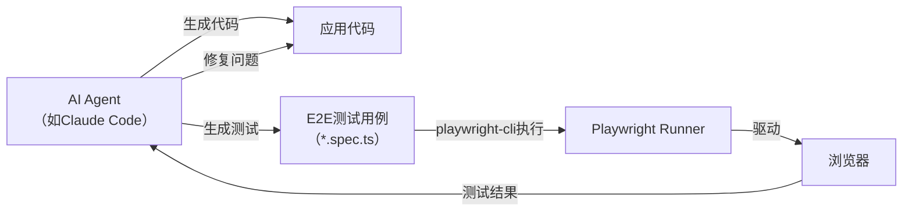

## 什么是Playwright

`Playwright`是由微软开源的一款现代端到端（`E2E`）测试框架，于`2020`年正式发布。它支持使用`TypeScript`、`JavaScript`、`Python`、`.NET`和`Java`编写测试用例，能够驱动`Chromium`、`Firefox`和`WebKit`三大主流浏览器引擎，实现跨浏览器的自动化测试。

在当今`AI`辅助代码开发已经普及的背景下，`AI`生成的项目代码往往需要配套完整的`E2E`测试用例来保障功能的正确性。`playwright-cli`作为`Playwright`的命令行工具，成为了`AI`代码开发工作流中不可或缺的测试利器。

### 解决的核心问题

传统的`E2E`测试框架（如`Selenium`、`Cypress`等）在使用过程中往往面临以下痛点：

- **测试不稳定（Flaky Test）**：由于页面元素的异步加载，测试用例需要手动添加等待逻辑，容易导致测试结果不稳定
- **跨浏览器支持困难**：不同浏览器的驱动配置繁琐，维护成本高
- **调试困难**：测试失败时难以快速定位问题根因
- **并发能力弱**：测试执行速度慢，无法高效利用多核资源

`Playwright`通过以下机制从根本上解决了上述问题：

1. **自动等待（Auto-waiting）机制**：在执行每一个操作（点击、填写等）之前，`Playwright`会自动等待元素进入可操作状态，无需手动添加`sleep`或显式等待
2. **内置浏览器**：自带`Chromium`、`Firefox`、`WebKit`的完整安装包，无需独立配置浏览器驱动
3. **测试隔离（Test Isolation）**：每个测试用例都在独立的`BrowserContext`中运行，相当于一个全新的浏览器配置文件，彻底隔离测试状态
4. **强大的调试工具链**：内置`Playwright Inspector`、`Trace Viewer`、`UI Mode`等工具，大幅提升调试效率

### 主要优点

| 特性 | 说明 |
|------|------|
| **跨浏览器支持** | 同一套测试代码可在`Chromium`、`Firefox`、`WebKit`上运行 |
| **自动等待** | 操作前自动检查元素可见性、可点击性，消除手动等待 |
| **测试隔离** | 每个测试独享`BrowserContext`，测试间互不影响 |
| **并行执行** | 默认并行运行测试，充分利用多核`CPU` |
| **强大的定位器** | 支持语义化定位（角色、文本、标签等），抗DOM结构变化能力强 |
| **内置断言库** | `Web-first`断言自动重试，直到条件满足或超时 |
| **代码生成** | `codegen`命令可录制操作并自动生成测试代码 |
| **Trace Viewer** | 可视化回放测试执行过程，包含`DOM`快照和网络请求 |
| **CI/CD集成** | 内置`GitHub Actions`工作流模板，`CI`集成零配置 |

## 安装与初始化

### 系统要求

- `Node.js`：`20.x`、`22.x` 或 `24.x`（推荐使用最新`LTS`版本）
- 操作系统：`Windows 11+`、`macOS 14+`、`Debian 12/13`、`Ubuntu 22.04/24.04`

### 初始化项目

在新项目或现有项目中安装`Playwright`：

```bash
npm init playwright@latest
```

执行该命令后，交互式提示会询问以下选项：

| 选项 | 说明 | 默认值 |
|------|------|--------|
| 语言 | `TypeScript`或`JavaScript` | `TypeScript` |
| 测试目录 | 测试文件所在目录名 | `tests` |
| `GitHub Actions`工作流 | 是否添加`CI`配置文件 | 是 |
| 安装浏览器 | 是否自动下载所需浏览器 | 是 |

初始化完成后，项目中会自动创建以下文件结构：

```
playwright.config.ts       # 配置文件
package.json
tests/
  example.spec.ts          # 示例测试文件
tests-examples/
  demo-todo-app.spec.ts    # 更完整的示例测试
```

### 在已有项目中添加

```bash
npm install -D @playwright/test
npx playwright install
```

## 编写测试用例

### 第一个测试

`Playwright`的测试文件以`.spec.ts`或`.spec.js`为后缀。下面是一个完整的测试示例：

```typescript
import { test, expect } from '@playwright/test';

test('页面标题验证', async ({ page }) => {
  await page.goto('https://playwright.dev/');

  // 验证页面标题包含 "Playwright"
  await expect(page).toHaveTitle(/Playwright/);
});

test('点击链接并验证跳转', async ({ page }) => {
  await page.goto('https://playwright.dev/');

  // 点击"Get started"链接
  await page.getByRole('link', { name: 'Get started' }).click();

  // 验证跳转到安装页面
  await expect(page.getByRole('heading', { name: 'Installation' })).toBeVisible();
});
```

### 定位器（Locators）

`Playwright`推荐使用语义化定位器，以提高测试的可维护性和抗变化能力。主要定位器类型如下：

| 定位器方法 | 说明 | 示例 |
|-----------|------|------|
| `getByRole()` | 按`ARIA`角色定位（最推荐） | `page.getByRole('button', { name: '提交' })` |
| `getByText()` | 按文本内容定位 | `page.getByText('欢迎登录')` |
| `getByLabel()` | 按表单标签定位 | `page.getByLabel('用户名')` |
| `getByPlaceholder()` | 按占位符文本定位 | `page.getByPlaceholder('请输入邮箱')` |
| `getByTestId()` | 按`data-testid`属性定位 | `page.getByTestId('submit-btn')` |
| `getByAltText()` | 按图片`alt`文本定位 | `page.getByAltText('公司Logo')` |
| `locator()` | `CSS`或`XPath`定位（不推荐首选） | `page.locator('.submit-button')` |

定位器支持链式调用和过滤，能精确定位复杂场景中的元素：

```typescript
// 在"商品列表"中找到"商品2"，并点击其"加入购物车"按钮
await page
  .getByRole('listitem')
  .filter({ hasText: '商品2' })
  .getByRole('button', { name: '加入购物车' })
  .click();
```

### 常用操作（Actions）

```typescript
// 页面导航
await page.goto('https://example.com');

// 点击元素
await page.getByRole('button', { name: '登录' }).click();

// 填写表单
await page.getByLabel('用户名').fill('admin');
await page.getByLabel('密码').fill('password123');

// 选择下拉选项
await page.getByLabel('角色').selectOption('管理员');

// 勾选复选框
await page.getByLabel('记住我').check();

// 键盘操作
await page.getByRole('textbox').press('Enter');

// 文件上传
await page.getByLabel('上传文件').setInputFiles('test-data/report.pdf');

// 悬停
await page.getByRole('menuitem', { name: '更多' }).hover();
```

### 断言（Assertions）

`Playwright`内置`Web-first`断言，会自动重试直到条件满足或超时（默认5秒）：

| 断言方法 | 说明 |
|---------|------|
| `toBeVisible()` | 元素可见 |
| `toBeEnabled()` | 元素可交互（非禁用） |
| `toBeChecked()` | 复选框已勾选 |
| `toHaveText()` | 元素文本匹配 |
| `toContainText()` | 元素文本包含指定内容 |
| `toHaveValue()` | 输入框的值匹配 |
| `toHaveCount()` | 列表元素数量匹配 |
| `toHaveURL()` | 当前页面URL匹配 |
| `toHaveTitle()` | 页面标题匹配 |

```typescript
// Web-first断言示例
await expect(page.getByText('登录成功')).toBeVisible();
await expect(page).toHaveURL('https://example.com/dashboard');
await expect(page.getByRole('list').getByRole('listitem')).toHaveCount(3);

// 软断言：不立即中止测试，收集所有失败后一并报告
await expect.soft(page.getByTestId('status')).toHaveText('成功');
await expect.soft(page.getByTestId('count')).toHaveText('5');
```

### 测试生命周期钩子

```typescript
import { test, expect } from '@playwright/test';

test.describe('用户管理模块', () => {
  test.beforeAll(async ({ browser }) => {
    // 所有测试开始前执行一次（如：初始化测试数据）
  });

  test.afterAll(async () => {
    // 所有测试结束后执行一次（如：清理测试数据）
  });

  test.beforeEach(async ({ page }) => {
    // 每个测试开始前执行（如：登录、导航到目标页面）
    await page.goto('https://example.com/login');
    await page.getByLabel('用户名').fill('admin');
    await page.getByLabel('密码').fill('admin123');
    await page.getByRole('button', { name: '登录' }).click();
  });

  test.afterEach(async ({ page }) => {
    // 每个测试结束后执行（如：截图、清理状态）
  });

  test('创建用户', async ({ page }) => {
    // 测试逻辑
  });

  test('删除用户', async ({ page }) => {
    // 测试逻辑
  });
});
```

### 测试隔离

`Playwright`的测试隔离基于`BrowserContext`机制。每个测试用例都运行在独立的上下文中，拥有独立的`Cookie`、`LocalStorage`、`SessionStorage`等。这意味着测试之间完全独立，前一个测试的状态不会影响后续测试。

```typescript
test('测试A', async ({ page }) => {
  // 这个 page 属于独立的 BrowserContext
  await page.goto('https://example.com');
});

test('测试B', async ({ page }) => {
  // 这个 page 属于另一个完全独立的 BrowserContext
  // 测试A的任何状态（Cookie、登录态等）都不会影响这里
  await page.goto('https://example.com');
});
```

### 实用测试示例：登录功能测试

```typescript
import { test, expect } from '@playwright/test';

test.describe('登录功能', () => {
  test('正确凭据登录成功', async ({ page }) => {
    await page.goto('/login');

    await page.getByLabel('用户名').fill('admin');
    await page.getByLabel('密码').fill('correct-password');
    await page.getByRole('button', { name: '登录' }).click();

    // 验证登录成功后跳转到仪表盘
    await expect(page).toHaveURL('/dashboard');
    await expect(page.getByText('欢迎，admin')).toBeVisible();
  });

  test('错误密码登录失败', async ({ page }) => {
    await page.goto('/login');

    await page.getByLabel('用户名').fill('admin');
    await page.getByLabel('密码').fill('wrong-password');
    await page.getByRole('button', { name: '登录' }).click();

    // 验证显示错误提示
    await expect(page.getByText('用户名或密码错误')).toBeVisible();
    // 验证仍在登录页面
    await expect(page).toHaveURL('/login');
  });

  test('空密码提交表单验证', async ({ page }) => {
    await page.goto('/login');

    await page.getByLabel('用户名').fill('admin');
    // 不填写密码
    await page.getByRole('button', { name: '登录' }).click();

    await expect(page.getByText('密码不能为空')).toBeVisible();
  });
});
```

## 运行测试

### 基本运行命令

```bash
# 运行所有测试（默认无头模式，并行执行）
npx playwright test

# 运行指定测试文件
npx playwright test tests/login.spec.ts

# 运行指定行号的测试
npx playwright test tests/login.spec.ts:25

# 按测试名称过滤运行（支持正则）
npx playwright test --grep "登录"

# 有头模式运行（可以看到浏览器窗口）
npx playwright test --headed

# 指定在特定浏览器上运行
npx playwright test --project=chromium
npx playwright test --project=firefox
npx playwright test --project=webkit
```

### UI模式运行

`UI Mode`是`Playwright`的可视化测试运行界面，提供时间旅行调试、实时步骤预览等功能：

```bash
npx playwright test --ui
```

在`UI Mode`中，可以：
- 按文件、描述块、单个测试筛选运行
- 实时观察每一步的执行情况
- 回溯每个操作前后的页面状态
- 查看网络请求和控制台日志

### 并行与分片

`Playwright`默认在多个`worker`进程中并行运行测试文件。可通过配置或命令行参数控制并行度：

```bash
# 指定worker数量
npx playwright test --workers=4

# 分片执行（适合在CI多机并行）
npx playwright test --shard=1/3  # 第1台机器执行总量的1/3
npx playwright test --shard=2/3  # 第2台机器执行总量的1/3
npx playwright test --shard=3/3  # 第3台机器执行总量的1/3
```

## 调试测试

### 使用Playwright Inspector

```bash
# 以调试模式运行所有测试
npx playwright test --debug

# 调试指定测试文件的指定行
npx playwright test tests/login.spec.ts:25 --debug

# 在特定浏览器上调试
npx playwright test --project=chromium --debug
```

`--debug`模式会：
- 以有头模式启动浏览器
- 打开`Playwright Inspector`调试面板
- 将超时时间设置为0（不超时）
- 允许逐步执行测试操作

在测试代码中插入`page.pause()`可以在特定位置暂停执行，然后从该断点继续调试：

```typescript
test('调试示例', async ({ page }) => {
  await page.goto('/dashboard');
  await page.pause(); // 执行到此处暂停，打开Inspector
  await page.getByRole('button', { name: '新建' }).click();
});
```

### VS Code集成调试

安装`Playwright Test for VSCode`扩展后，可以在`VS Code`中直接运行和调试测试：

- 在行号左侧点击设置断点（红点）
- 右键测试名称选择"Debug Test"
- 实时高亮显示当前执行的步骤和匹配的元素
- 支持在编辑器内实时编辑定位器并在浏览器中即时验证

### 使用浏览器控制台调试

以`PWDEBUG=console`模式运行，可在浏览器开发者工具中使用`playwright`对象进行交互式调试：

```bash
PWDEBUG=console npx playwright test
```

在控制台中可以使用：

```javascript
// 查找元素
playwright.$('button[name="提交"]')

// 查找所有匹配元素
playwright.$$('li')

// 生成元素的定位器
playwright.selector($0)  // $0 是在Elements面板中选中的元素
```

### Trace Viewer

`Trace Viewer`是`Playwright`最强大的调试工具之一，能够完整回放测试的每一步操作，包括：
- 每一步操作前后的DOM快照
- 控制台日志和网络请求
- 操作的执行时间线

```bash
# 运行时启用Trace记录
npx playwright test --trace on

# 查看测试报告（包含Trace）
npx playwright show-report

# 直接打开Trace文件
npx playwright show-trace test-results/trace.zip
```

在`playwright.config.ts`中配置仅在失败时重试记录Trace（推荐`CI`配置）：

```typescript
use: {
  trace: 'on-first-retry',  // 仅在第一次重试时记录
}
```

## 配置详解

### 配置文件结构

`Playwright`的配置文件`playwright.config.ts`是项目的核心配置入口：

```typescript
import { defineConfig, devices } from '@playwright/test';

export default defineConfig({
  // 测试文件所在目录
  testDir: './tests',

  // 是否完全并行运行（文件间和文件内均并行）
  fullyParallel: true,

  // CI环境下禁止 test.only（防止遗漏）
  forbidOnly: !!process.env.CI,

  // 重试次数（CI环境重试2次）
  retries: process.env.CI ? 2 : 0,

  // 并行worker数量
  workers: process.env.CI ? 1 : undefined,

  // 测试报告格式
  reporter: 'html',

  // 全局超时（每个测试最长运行时间）
  timeout: 30000,

  // 全局设置
  use: {
    baseURL: 'http://localhost:3000',
    trace: 'on-first-retry',
    screenshot: 'only-on-failure',
    video: 'on-first-retry',
  },

  // 配置测试项目（浏览器/设备）
  projects: [
    {
      name: 'chromium',
      use: { ...devices['Desktop Chrome'] },
    },
    {
      name: 'firefox',
      use: { ...devices['Desktop Firefox'] },
    },
    {
      name: 'webkit',
      use: { ...devices['Desktop Safari'] },
    },
    // 移动端设备模拟
    {
      name: 'Mobile Chrome',
      use: { ...devices['Pixel 5'] },
    },
  ],

  // 启动本地开发服务器
  webServer: {
    command: 'npm run dev',
    url: 'http://localhost:3000',
    reuseExistingServer: !process.env.CI,
  },
});
```

### 核心配置项说明

| 配置项 | 类型 | 说明 |
|--------|------|------|
| `testDir` | `string` | 测试文件所在目录路径 |
| `testMatch` | `string \| RegExp` | 匹配测试文件的glob模式 |
| `testIgnore` | `string \| RegExp` | 忽略的测试文件模式 |
| `timeout` | `number` | 单个测试的超时时间（毫秒） |
| `retries` | `number` | 测试失败后的最大重试次数 |
| `workers` | `number \| string` | 并行worker进程数，可用百分比如`'50%'` |
| `fullyParallel` | `boolean` | 是否在文件内也并行运行测试 |
| `reporter` | `string \| array` | 测试报告格式 |
| `globalSetup` | `string` | 全局初始化文件路径 |
| `globalTeardown` | `string` | 全局清理文件路径 |
| `outputDir` | `string` | 测试产物（截图、视频等）输出目录 |

### use选项配置

`use`块配置测试运行时的浏览器行为：

| 配置项 | 类型 | 说明 |
|--------|------|------|
| `baseURL` | `string` | 基础URL，使用相对路径时自动拼接 |
| `headless` | `boolean` | 是否以无头模式运行，默认`true` |
| `slowMo` | `number` | 每步操作之间的延迟（毫秒），便于观察 |
| `screenshot` | `string` | 截图时机：`'off'`\|`'on'`\|`'only-on-failure'` |
| `video` | `string` | 录制时机：`'off'`\|`'on'`\|`'on-first-retry'` |
| `trace` | `string` | Trace记录：`'off'`\|`'on'`\|`'on-first-retry'` |
| `viewport` | `object` | 浏览器视口尺寸，如`{ width: 1280, height: 720 }` |
| `locale` | `string` | 浏览器语言，如`'zh-CN'` |
| `timezoneId` | `string` | 时区，如`'Asia/Shanghai'` |
| `storageState` | `string` | 预加载的存储状态文件路径（用于复用登录态） |

### 测试报告配置

`Playwright`内置多种报告格式：

| 报告类型 | 说明 | 适用场景 |
|---------|------|---------|
| `html` | 生成可视化HTML报告，支持过滤和Trace查看 | 本地开发、CI结果存档 |
| `list` | 每个测试输出一行，默认格式 | 本地开发 |
| `dot` | 极简输出，每个测试一个字符 | `CI`环境节省输出 |
| `line` | 单行滚动显示进度 | 大型测试套件 |
| `json` | 输出JSON格式，供工具链消费 | 集成第三方平台 |
| `junit` | 生成JUnit XML，兼容各种CI系统 | Jenkins等CI集成 |
| `github` | 在`GitHub Actions`中生成注解 | `GitHub`工作流 |
| `blob` | 二进制格式，用于合并多机分片结果 | 分布式CI执行 |

同时启用多种报告格式：

```typescript
reporter: [
  ['list'],
  ['html', { outputFolder: 'test-reports', open: 'never' }],
  ['json', { outputFile: 'test-results/results.json' }],
],
```

### 生成和查看测试报告

```bash
# 运行测试并生成HTML报告
npx playwright test --reporter=html

# 查看最新的测试报告
npx playwright show-report

# 查看指定目录的报告
npx playwright show-report my-report
```

## 代码生成（Codegen）

`Playwright`提供`codegen`命令，通过录制浏览器操作自动生成测试代码，极大降低测试编写成本：

```bash
# 打开指定URL并启动代码录制
npx playwright codegen https://example.com

# 录制时指定输出文件
npx playwright codegen --output=tests/recorded.spec.ts https://example.com

# 指定浏览器录制
npx playwright codegen --browser=firefox https://example.com

# 模拟移动设备录制
npx playwright codegen --device="iPhone 13" https://example.com

# 带认证状态录制
npx playwright codegen --load-storage=auth.json https://example.com
```

`codegen`工具会打开浏览器和`Playwright Inspector`两个窗口：
- 在浏览器中进行实际操作
- `Inspector`实时显示生成的测试代码
- 可以选择复制代码或直接保存到文件

## 高级功能

### Page Object Model（页面对象模型）

对于复杂的应用，推荐使用`Page Object Model（POM）`模式封装页面操作，提高代码复用性和可维护性：

```typescript
// pages/LoginPage.ts
import { Page, Locator } from '@playwright/test';

export class LoginPage {
  readonly page: Page;
  readonly usernameInput: Locator;
  readonly passwordInput: Locator;
  readonly loginButton: Locator;
  readonly errorMessage: Locator;

  constructor(page: Page) {
    this.page = page;
    this.usernameInput = page.getByLabel('用户名');
    this.passwordInput = page.getByLabel('密码');
    this.loginButton = page.getByRole('button', { name: '登录' });
    this.errorMessage = page.getByRole('alert');
  }

  async goto() {
    await this.page.goto('/login');
  }

  async login(username: string, password: string) {
    await this.usernameInput.fill(username);
    await this.passwordInput.fill(password);
    await this.loginButton.click();
  }
}
```

```typescript
// tests/login.spec.ts
import { test, expect } from '@playwright/test';
import { LoginPage } from '../pages/LoginPage';

test('使用POM模式测试登录', async ({ page }) => {
  const loginPage = new LoginPage(page);
  await loginPage.goto();
  await loginPage.login('admin', 'password123');

  await expect(page).toHaveURL('/dashboard');
});
```

### Fixtures（夹具）

`Fixture`是`Playwright`的依赖注入机制，允许在测试间共享可复用的设置逻辑：

```typescript
// fixtures.ts
import { test as base } from '@playwright/test';
import { LoginPage } from './pages/LoginPage';

type MyFixtures = {
  loginPage: LoginPage;
  loggedInPage: LoginPage;
};

export const test = base.extend<MyFixtures>({
  loginPage: async ({ page }, use) => {
    const loginPage = new LoginPage(page);
    await loginPage.goto();
    await use(loginPage);
  },

  loggedInPage: async ({ page }, use) => {
    const loginPage = new LoginPage(page);
    await loginPage.goto();
    await loginPage.login('admin', 'password123');
    await use(loginPage);
  },
});

export { expect } from '@playwright/test';
```

```typescript
// tests/dashboard.spec.ts
import { test, expect } from '../fixtures';

test('已登录用户访问仪表盘', async ({ loggedInPage, page }) => {
  await page.goto('/dashboard');
  await expect(page.getByRole('heading', { name: '仪表盘' })).toBeVisible();
});
```

### 认证状态复用

对于需要登录的测试，可以通过保存和复用认证状态避免每个测试都重复登录：

```typescript
// global-setup.ts
import { chromium, FullConfig } from '@playwright/test';

async function globalSetup(config: FullConfig) {
  const browser = await chromium.launch();
  const page = await browser.newPage();

  await page.goto('http://localhost:3000/login');
  await page.getByLabel('用户名').fill('admin');
  await page.getByLabel('密码').fill('password123');
  await page.getByRole('button', { name: '登录' }).click();

  // 保存认证状态（Cookie、LocalStorage等）
  await page.context().storageState({ path: 'auth.json' });
  await browser.close();
}

export default globalSetup;
```

```typescript
// playwright.config.ts
export default defineConfig({
  globalSetup: require.resolve('./global-setup'),
  use: {
    storageState: 'auth.json', // 所有测试复用此认证状态
  },
});
```

### 网络请求拦截与Mock

```typescript
test('Mock API响应测试', async ({ page }) => {
  // 拦截并Mock特定API
  await page.route('**/api/users', async route => {
    await route.fulfill({
      status: 200,
      contentType: 'application/json',
      body: JSON.stringify([
        { id: 1, name: '张三', role: '管理员' },
        { id: 2, name: '李四', role: '普通用户' },
      ]),
    });
  });

  await page.goto('/users');
  await expect(page.getByText('张三')).toBeVisible();
  await expect(page.getByText('李四')).toBeVisible();
});
```

## 最佳实践

### 测试设计原则

**测试面向用户行为，而非实现细节**

测试应该模拟真实用户的操作方式，避免依赖内部实现（如CSS类名、函数名等）。当UI重构时，只要用户可见的功能不变，测试就不应该失败：

```typescript
// ❌ 依赖CSS类名（实现细节）
page.locator('button.btn-primary.submit-action')

// ✅ 依赖用户可见的语义（推荐）
page.getByRole('button', { name: '提交' })
```

**保持测试相互独立**

每个测试用例应该能够独立运行，不依赖其他测试的执行结果或顺序。使用`beforeEach`初始化状态，不要在测试之间共享可变状态。

**优先使用Web-first断言**

```typescript
// ❌ 立即检查，不等待
expect(await page.getByText('成功').isVisible()).toBe(true);

// ✅ 自动等待条件满足（推荐）
await expect(page.getByText('成功')).toBeVisible();
```

### 定位器选择优先级

按照稳定性由高到低排列，优先选择前几种：



### CI/CD集成建议

**`GitHub Actions`工作流示例：**

```yaml
# .github/workflows/playwright.yml
name: Playwright Tests

on:
  push:
    branches: [main, develop]
  pull_request:
    branches: [main]

jobs:
  test:
    runs-on: ubuntu-latest
    steps:
      - uses: actions/checkout@v4

      - uses: actions/setup-node@v4
        with:
          node-version: 22

      - name: Install dependencies
        run: npm ci

      - name: Install Playwright Browsers
        run: npx playwright install --with-deps chromium  # CI上只装需要的浏览器

      - name: Run Playwright tests
        run: npx playwright test

      - name: Upload test report
        uses: actions/upload-artifact@v4
        if: always()
        with:
          name: playwright-report
          path: playwright-report/
          retention-days: 30
```

**`CI`环境推荐配置：**

```typescript
// playwright.config.ts
export default defineConfig({
  retries: process.env.CI ? 2 : 0,
  workers: process.env.CI ? 1 : undefined,
  reporter: process.env.CI ? 'github' : 'list',
  use: {
    trace: 'on-first-retry',
    screenshot: 'only-on-failure',
    video: 'on-first-retry',
  },
});
```

### 代码质量建议

| 建议 | 说明 |
|------|------|
| 使用`TypeScript` | 提供类型检查，IDE补全，早期发现错误 |
| 配置`ESLint` | 使用`@typescript-eslint/no-floating-promises`规则防止遗漏`await` |
| 使用`POM`模式 | 将页面操作封装为类，提高复用性和可维护性 |
| 测试文件命名规范 | 使用`*.spec.ts`后缀，按功能模块组织目录 |
| 避免使用`page.waitForTimeout` | 用`Web-first`断言替代固定等待时间 |
| 不测试第三方服务 | 对外部依赖使用`page.route`进行Mock |
| 保持测试数据独立 | 每个测试创建自己所需的数据，测试后清理 |

### 常见陷阱与解决方案

**问题1：测试偶发失败（Flaky Test）**

```typescript
// ❌ 使用固定等待
await page.waitForTimeout(2000);
await page.click('#submit');

// ✅ 使用Web-first断言等待元素就绪
await page.getByRole('button', { name: '提交' }).click();
// Playwright会自动等待按钮可见且可点击
```

**问题2：多元素匹配报错**

```typescript
// 当页面有多个匹配元素时，精确过滤
const saveButton = page
  .getByRole('dialog', { name: '编辑用户' })
  .getByRole('button', { name: '保存' });
```

**问题3：页面加载未完成就执行操作**

```typescript
// ✅ 等待特定内容出现后再进行操作
await page.goto('/dashboard');
await expect(page.getByRole('heading', { name: '仪表盘' })).toBeVisible();
await page.getByRole('button', { name: '新建' }).click();
```

## 与playwright-cli的关系

在`AI`辅助代码开发工作流（如`Claude Code`、`GitHub Copilot`等）中，`playwright-cli`作为`Playwright`的命令行封装工具，使得`AI Agent`能够直接执行浏览器自动化操作来验证代码功能。

整体工作流如下：



在这种工作流中，`E2E`测试用例作为功能正确性的"验收标准"，`AI`在修改代码后通过运行测试来自动验证改动是否引入了回归问题，形成完整的自动化开发反馈循环。

了解`Playwright`的完整用法，有助于更好地审查`AI`生成的测试用例质量，并在`AI`辅助开发中发挥更大的主动性——例如为`AI`提供清晰的测试场景描述，或直接审阅和修正生成的测试代码。
