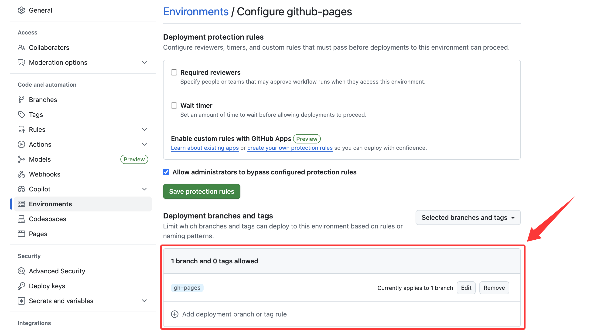

## docusaurus仓库搭建

使用`github`，既然内容都是公开的，那么使用开源项目即可，仓库地址：https://github.com/gqcn/johns-blog

## docusaurus静态页面构建

使用`github`的`action`即可，workflow配置：https://github.com/gqcn/johns-blog/blob/main/.github/workflows/build-and-deploy.yml

同时需要配置`github pages`部署的分支，在`Environments / Configure github-pages`中配置：



## 服务器配置


我没有使用`github pages`，而是使用的是某云的`Linux`服务器，国内访问会快一些。

### SSL证书申请

关闭`nginx`服务，避免`80`端口占用，随后通过以下命令申请`SSL`证书：
```bash
certbot certonly --standalone -d johng.cn --staple-ocsp -m john@johng.cn --agree-tos
certbot certonly --standalone -d www.johng.cn --staple-ocsp -m john@johng.cn --agree-tos
```

这里申请了两个域名的证书，带`www`的和不带`www`的。

### 配置`nginx`

配置文件如下：
```nginx
# johng.cn:80 -> 443
server {
    listen      80;
    server_name johng.cn;
    location / {
        rewrite ^/(.*) https://johng.cn permanent;
    }
}


# www.johng.cn:443
server {
    listen      443;
    server_name www.johng.cn;
    ssl                       on;
    ssl_certificate           /etc/letsencrypt/live/www.johng.cn/fullchain.pem;
    ssl_certificate_key       /etc/letsencrypt/live/www.johng.cn/privkey.pem;
    ssl_protocols             TLSv1 TLSv1.1 TLSv1.2;
    ssl_prefer_server_ciphers on;

    access_log   /var/log/nginx/www.johng.cn.access.log;
    error_log    /var/log/nginx/www.johng.cn.error.log;

    location / {
        rewrite ^/(.*) https://johng.cn/$1 permanent;
    }
}

# johng.cn:443
server {
    listen      443;
    server_name johng.cn;
    ssl                       on;
    ssl_certificate           /etc/letsencrypt/live/johng.cn/fullchain.pem;
    ssl_certificate_key       /etc/letsencrypt/live/johng.cn/privkey.pem;
    ssl_protocols             TLSv1 TLSv1.1 TLSv1.2;
    ssl_prefer_server_ciphers on;

    root  /home/www/johng.cn;
    index index.html index.htm;
    
    access_log /var/log/nginx/johng.cn.access.log;
    error_log  /var/log/nginx/johng.cn.error.log;

    location ~ /\.git {
        deny all;
        return 403;
    }

    location / {
        try_files $uri $uri.html $uri/ =404;
    }

    location ~* \.(jpg|jpeg|png|gif|ico|css|js)$ {
        expires    30d;  
        access_log off;
    }

    gzip on;
    gzip_types text/css application/javascript application/x-javascript text/javascript;
    gzip_min_length 1024;
}
```

### 修改nginx运行用户

修改`nginx`运行用户，默认用户为`www-data`，需要修改为`root`，为避免`nginx`无法访问`/home/www/`路径下的网站文件，会报错`Permission denied`。

```nginx title="/etc/nginx/nginx.conf"
user root;
worker_processes auto;
pid /run/nginx.pid;
error_log /var/log/nginx/error.log;
include /etc/nginx/modules-enabled/*.conf;

# ...
```

### 配置定时任务

配置定时任务，自动从`github`拉取最新代码，并且自动续期`SSL`证书。定时任务配置文件路径`/etc/crontab`。

```ini 
# 定时拉取最新的官网静态页构建结果
*/5 * * * * www cd /home/www/johng.cn && git pull origin gh-pages > ~/github-pull-johng.cn.log

# 每天尝试续期一次，证书续期需要先关闭80端口的WebServer监听
0 3 * * * root service nginx stop 
5 3 * * * root certbot renew --quiet
8 3 * * * root service nginx start
```

如果没有启动`cron`服务的话，需要启动`cron`服务：
```bash
service cron start
```
