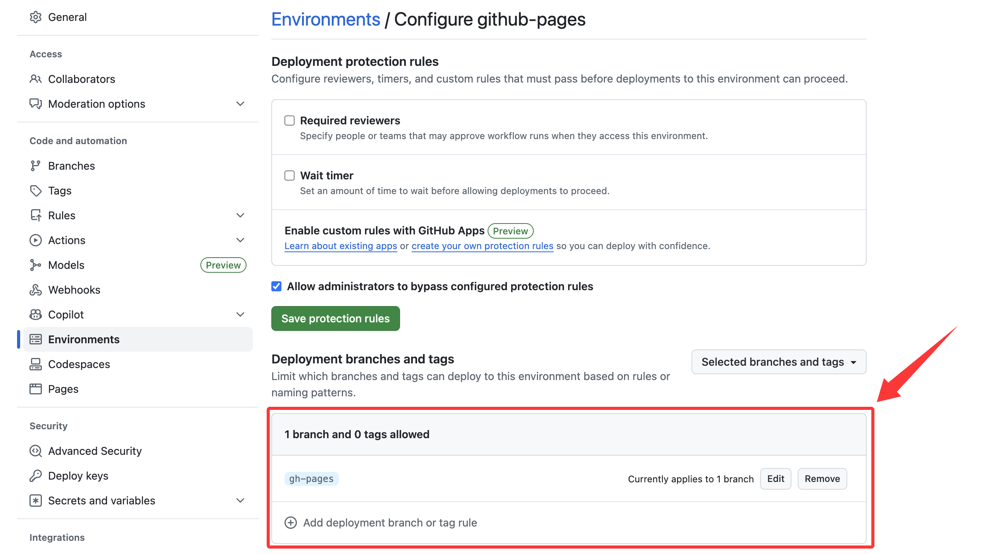

## docusaurus仓库搭建

使用`github`，既然内容都是公开的，那么使用开源项目即可，仓库地址：https://github.com/gqcn/johns-blog

## docusaurus静态页面构建

使用`github`的`action`即可，workflow配置：https://github.com/gqcn/johns-blog/blob/main/.github/workflows/build-and-deploy.yml

`main` 有推送时：`yarn` 安装依赖，`make build` 产出 `./build`，再用 `peaceiris/actions-gh-pages@v4` 发到 `gh-pages`。

同时需要配置`github pages`部署的分支，在`Environments / Configure github-pages`中配置：



线上站点并不直接给访客走 `GitHub Pages`，而是服务器每 `5` 分钟从 `gh-pages` 拉构建结果。`GitHub Pages` 仍作为这份静态产物的托管分支。

## 压缩仓库体积

`Docusaurus` 每次构建都会生成带 `hash` 的 JS/CSS/图片。`peaceiris/actions-gh-pages` **默认在 `gh-pages` 上追加 commit**，旧构建产物全部留在 Git 对象库里。

只把 `main squash` 成 1 条提交，体积几乎不会下降：`gh-pages` 和其它旧分支仍引用那些 blob。压缩前远端大约是：

| 分支 | 提交数 | 说明 |
|---|---|---|
| `main` | 1 | 已 `reinit` |
| `gh-pages` | 约 `669` | 从 `2025-02` 起每次部署追加一条 `deploy: <sha>` |
| 其它残留分支 | 可能仍指向压缩前的 `main` | 例如用完未删的 `Copilot` 分支 |

当时整个 `GitHub` 仓库报表体积约 **1.27 GiB**，主要是 `gh-pages` 里的历史静态文件。

### 每次部署只留 1 条 `gh-pages`

在 `deploy` 步骤打开 `force_orphan: true`。每次发布会把 `gh-pages` **写成一条没有 parent 的 orphan commit**，只包含当前 `./build`：

```yaml title=".github/workflows/build-and-deploy.yml"
      - name: Deploy to github pages
        uses: peaceiris/actions-gh-pages@v4
        with:
          github_token: ${{ secrets.GITHUB_TOKEN }}
          publish_dir: ./build
          force_orphan: true
```

效果：

- 远端 `gh-pages` 永远只有最新 1 条记录，历史 hashed 资源不再进分支
- 已有 clone 无法对这次改写做 `git pull`（非快进 / unrelated histories）
- 新 `git clone --depth 1 --branch gh-pages` 不受影响
- GitHub 报表体积要等他们 GC 不可达对象，**不会立刻变小**；长期不用的旧分支也应删掉，否则对象仍被引用

服务器同步方式见下面的定时任务：必须 `fetch` + `reset --hard`，不能再 `git pull`。

## 服务器配置


我没有使用`github pages`，而是使用的是某云的`Linux`服务器，国内访问会快一些。

### SSL证书申请

关闭`nginx`服务，避免`80`端口占用，随后通过以下命令申请`SSL`证书：
```bash
certbot certonly --standalone -d johng.cn --staple-ocsp -m john@johng.cn --agree-tos
certbot certonly --standalone -d www.johng.cn --staple-ocsp -m john@johng.cn --agree-tos
```

这里申请了两个域名的证书，带`www`的和不带`www`的。

### 配置nginx

配置文件如下：
```nginx
# johng.cn:80 -> 443
server {
    listen      80;
    server_name johng.cn;
    location / {
        rewrite ^/(.*) https://johng.cn permanent;
    }
}


# www.johng.cn:443
server {
    listen      443;
    server_name www.johng.cn;
    ssl                       on;
    ssl_certificate           /etc/letsencrypt/live/www.johng.cn/fullchain.pem;
    ssl_certificate_key       /etc/letsencrypt/live/www.johng.cn/privkey.pem;
    ssl_protocols             TLSv1 TLSv1.1 TLSv1.2;
    ssl_prefer_server_ciphers on;

    access_log   /var/log/nginx/www.johng.cn.access.log;
    error_log    /var/log/nginx/www.johng.cn.error.log;

    location / {
        rewrite ^/(.*) https://johng.cn/$1 permanent;
    }
}

# johng.cn:443
server {
    listen      443;
    server_name johng.cn;
    ssl                       on;
    ssl_certificate           /etc/letsencrypt/live/johng.cn/fullchain.pem;
    ssl_certificate_key       /etc/letsencrypt/live/johng.cn/privkey.pem;
    ssl_protocols             TLSv1 TLSv1.1 TLSv1.2;
    ssl_prefer_server_ciphers on;

    root  /home/www/johng.cn;
    index index.html index.htm;
    
    access_log /var/log/nginx/johng.cn.access.log;
    error_log  /var/log/nginx/johng.cn.error.log;

    location ~ /\.git {
        deny all;
        return 403;
    }

    location / {
        try_files $uri $uri.html $uri/ =404;
    }

    location ~* \.(jpg|jpeg|png|gif|ico|css|js)$ {
        expires    30d;  
        access_log off;
    }

    gzip on;
    gzip_types text/css application/javascript application/x-javascript text/javascript;
    gzip_min_length 1024;
}
```

### 修改nginx运行用户

修改`nginx`运行用户，默认用户为`www-data`，需要修改为`root`，为避免`nginx`无法访问`/home/www/`路径下的网站文件，会报错`Permission denied`。

```nginx title="/etc/nginx/nginx.conf"
user root;
worker_processes auto;
pid /run/nginx.pid;
error_log /var/log/nginx/error.log;
include /etc/nginx/modules-enabled/*.conf;

# ...
```

### 配置定时任务

配置定时任务，自动从`github`同步最新构建结果，并且自动续期`SSL`证书。定时任务配置文件路径`/etc/crontab`。站点目录是 `www` 用户的浅克隆：

```bash
sudo -u www -H git clone --depth 1 --branch gh-pages https://github.com/gqcn/johns-blog.git /home/www/johng.cn
```

`gh-pages` 每次部署都是 orphan，已有仓库不能快进。`+gh-pages:...` 强制更新远端跟踪分支，`reset --hard` 把工作区对齐到最新树，`git clean -fd` 清掉工作区多余文件，`git gc --prune=now` 丢掉本机已不可达的旧对象：

```ini 
# 定时同步最新的官网静态页构建结果。
# gh-pages 每次部署都会 orphan 成 1 条提交，普通 git pull 无法快进，必须 fetch + reset。
*/5 * * * * www (cd /home/www/johng.cn && git fetch --depth=1 origin +gh-pages:refs/remotes/origin/gh-pages && git reset --hard origin/gh-pages && git clean -fd && git gc --prune=now --quiet) > /home/www/github-pull-johng.cn.log 2>&1

# 每天尝试续期一次，证书续期需要先关闭80端口的WebServer监听
0 3 * * * root service nginx stop 
5 3 * * * root certbot renew --quiet
8 3 * * * root service nginx start
```

如果没有启动`cron`服务的话，需要启动`cron`服务：
```bash
service cron start
```
