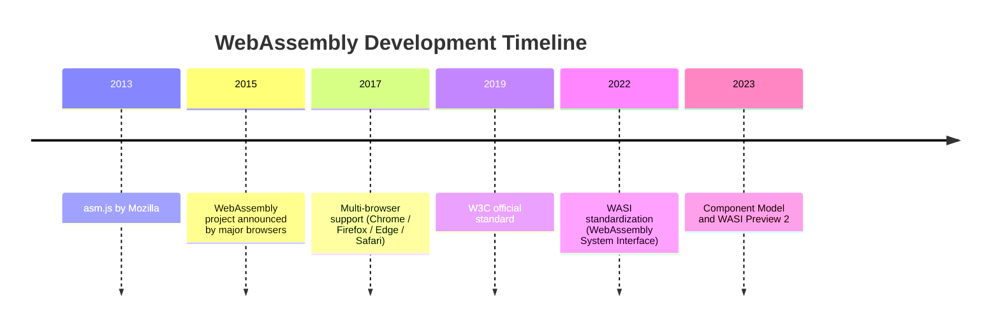

## 什么是WebAssembly

`WebAssembly`（简称`WASM`）是一种基于栈式虚拟机的二进制指令格式，由`W3C`标准化组织于`2019`年正式发布为国际标准。它被设计为高级语言（如`C/C++`、`Rust`、`Go`等）的可移植编译目标，使得这些语言编写的程序能够在浏览器及服务器环境中以接近原生的速度运行。

`WebAssembly`并非一门新的编程语言，而是一种**底层的、平台无关的字节码格式**。开发者仍然使用熟悉的高级语言编写代码，编译器将其编译为`.wasm`二进制文件，浏览器或运行时再将其加载执行。

### WASM的发展背景

在`WebAssembly`出现之前，`Web`平台的计算能力受制于`JavaScript`：

- `JavaScript`是动态类型语言，解释执行的天然限制使其难以胜任计算密集型任务；
- `asm.js`（`2013`年由`Mozilla`提出）是`WebAssembly`的前身，通过静态类型注解子集让`JavaScript`引擎能提前优化，但仍受限于文本格式的解析开销；
- 各大浏览器厂商（`Google`、`Mozilla`、`Microsoft`、`Apple`）于`2015`年联合宣布`WebAssembly`项目，并于`2017`年在各主流浏览器中同步推出支持。




### WASM的核心优势

#### 高性能计算能力

`WebAssembly`的二进制格式紧凑高效，浏览器引擎可对其进行预编译（`AOT`编译），执行速度可接近原生机器码。相比`JavaScript`，`WASM`在以下场景中性能提升显著：

- 图像/视频编解码
- `3D`渲染与游戏引擎
- 密码学运算
- 科学计算与数值模拟

#### 语言多样性

长期以来，浏览器端只能运行`JavaScript`。`WASM`打破了这一限制，使得开发者可以将现有的`C/C++`、`Rust`、`Go`等语言的代码库编译为`WASM`，直接在浏览器中复用已有生态。

#### 安全沙箱执行

`WebAssembly`模块运行在一个严格的内存安全沙箱环境中：

- 线性内存模型：模块只能访问自己分配的线性内存区域，无法直接访问宿主环境的任意内存；
- 控制流完整性：`WASM`的指令集设计保证了控制流的可验证性，防止任意代码跳转；
- 与`JavaScript`共享同源策略：嵌入在浏览器中时，`WASM`遵循与`JavaScript`相同的安全策略。

#### 可移植性

`WebAssembly`的字节码格式与`CPU`架构无关，同一份`.wasm`文件可以在`x86`、`ARM`、`RISC-V`等各种硬件上运行，真正实现了"一次编译，到处运行"。

#### 开放可调试

`WebAssembly`拥有对应的文本格式（`.wat`），可以由人类直接阅读。现代浏览器的开发者工具也逐步增加了对`WASM`调试的支持，包括源码映射（`Source Maps`）等功能。


### WASM的应用场景

| 场景 | 典型案例 |
|---|---|
| `Web`前端计算加速 | 图像滤镜、视频转码、`PDF`渲染 |
| 游戏与`3D`引擎 | `Unity WebGL`导出、`Unreal Engine Web` |
| 跨语言库移植 | `SQLite`、`FFmpeg`、`OpenCV`移植到浏览器 |
| 服务器端沙箱 | `Serverless`函数隔离、插件系统 |
| 边缘计算 | `Cloudflare Workers`、`Fastly Compute` |
| 嵌入式与`IoT` | `MicroPython`、`TinyGo`轻量运行时 |


## Go语言对WASM的支持

### 支持历史

`Go`语言从`1.11`版本（`2018`年）开始正式提供`WebAssembly`支持，此后持续完善：

| Go版本 | 主要改进 |
|---|---|
| `Go 1.11` | 实验性引入`js/wasm`编译目标，支持基本`DOM`操作 |
| `Go 1.12` | 改进`syscall/js`包，增加`Func`类型支持回调 |
| `Go 1.13` | 增加`CopyBytesToGo`/`CopyBytesToJS`提升内存交换效率 |
| `Go 1.21` | 新增`wasip1`编译目标，支持`WASI`标准接口 |
| `Go 1.23` | `go_wasip1_wasm_exec`脚本不再支持`wasmtime` < `14.0.0`版本 |
| `Go 1.24` | - 新增`go:wasmexport`指令，支持从`Go`向`WASM`宿主导出函数；<br/>- `wasip1`支持`-buildmode=c-shared`构建`reactor`（库）模式；<br/>- 扩展`go:wasmimport`/`go:wasmexport`支持的参数与返回值类型（新增`bool`、`string`、`uintptr`及指针类型）；<br/>- `WASM`辅助文件从`misc/wasm`迁移至`lib/wasm`；显著降低小型应用的初始内存占用 |

### 两种编译目标

`Go`目前支持两种`WASM`编译目标，适用于不同场景：

**`GOOS=js GOARCH=wasm`（浏览器/Node.js环境）**

- 面向`JavaScript`宿主环境
- 通过`syscall/js`包与`JavaScript`和`DOM`交互
- 适合开发Web前端功能

**`GOOS=wasip1 GOARCH=wasm`（WASI环境）**

- 面向实现了`WASI Preview 1`接口的运行时（如`Wasmtime`、`Wazero`、`WasmEdge`等）
- 不依赖`JavaScript`，适合服务器端/边缘计算场景
- `Go 1.21`引入

## Go生态中常用的WASM开源组件

在`Go`语言的`WASM`生态中，工具链按职责可分为三类：**编译器**（将`Go`源码编译为`.wasm`）、**运行时**（在`Go`程序内加载和执行`.wasm`）、**辅助库**（提供更高层封装或特定平台集成）。了解这些工具的定位，有助于在不同场景下选择最合适的方案。

### TinyGo（编译器）

`TinyGo`是专为资源受限环境（嵌入式、`WASM`）设计的`Go`编译器，基于`LLVM`后端构建，与标准`Go`编译器并行存在。

**核心收益：**

| 维度 | 标准`Go`编译器 | `TinyGo` |
|---|---|---|
| `Hello World`（压缩前） | ~`2MB` | ~`10KB` |
| `Hello World`（`brotli`压缩后） | ~`500KB` | ~`4KB` |
| 运行时依赖 | 完整`GC`、调度器、反射 | 裁剪版运行时，可选`GC`策略 |
| 编译目标 | `js/wasm`、`wasip1` | `js/wasm`、`wasip1`、嵌入式裸机 |
| 标准库覆盖率 | 完整 | 部分包存在限制 |

**适用场景：**

- 前端`WASM`模块，对首屏加载时间敏感（体积差距一个数量级）；
- 嵌入式设备或`IoT`场景，内存极为有限；
- `CDN`边缘节点函数，需要快速冷启动。

**主要限制：**

- `reflect`包功能不完整，某些依赖反射的第三方库（如`encoding/json`）行为受限；
- `goroutine`的调度模型与标准`Go`存在差异，并发密集的代码需充分测试；
- 不支持`cgo`；
- `go:wasmexport`（`Go 1.24`新特性）目前在`TinyGo`中尚未完整实现。

```bash
# 安装 TinyGo（macOS）
brew install tinygo

# 编译为浏览器 WASM
tinygo build -o main.wasm -target wasm ./main.go

# 编译为 WASI 目标
tinygo build -o main.wasm -target wasip1 ./main.go
```

### Wazero（嵌入式WASM运行时）

`Wazero`是目前`Go`生态中最成熟的嵌入式`WASM`运行时，由`Tetrate`团队维护，**纯`Go`实现，零外部依赖**（不依赖`C`库）。

**核心收益：**

| 维度 | 说明 |
|---|---|
| 零`CGO`依赖 | 无需`C`工具链，`go build`直接静态编译，部署简单 |
| 跨平台 | 支持`Linux`、`macOS`、`Windows`及`arm64`，覆盖主流云和边缘环境 |
| 内存安全沙箱 | 每个`WASM`实例内存完全隔离，模块崩溃不影响宿主进程 |
| 灵活的权限控制 | 文件系统挂载、环境变量、时钟等均需显式配置，默认最小权限 |
| 性能 | 提供解释执行和编译执行（`JIT`/`AOT`）两种引擎，生产环境默认用编译模式 |
| `Host Function` | 可向`WASM`模块注入自定义宿主函数，扩展模块能力而不破坏沙箱边界 |

**适用场景：**

- 在`Go`服务端程序中以插件形式加载第三方`WASM`模块，实现不重启热加载；
- 多租户`Serverless`执行环境，利用沙箱隔离不同用户的代码；
- 构建`WASM`原生`API`网关或`Sidecar`，动态加载过滤器逻辑；
- 在已有`Go`服务中嵌入规则引擎，用`WASM`表达业务规则并热更新。

**与其他运行时对比：**

| 运行时 | 语言 | 嵌入方式 | `CGO`依赖 | 适用场景 |
|---|---|---|---|---|
| `Wazero` | 纯`Go` | `import`库 | 无 | `Go`服务内嵌 |
| `Wasmtime` | `Rust`（含`C`绑定） | `CGO`绑定 | 有 | 命令行/多语言宿主 |
| `WasmEdge` | `C++`（含`Go`绑定） | `CGO`绑定 | 有 | `AI`推理、边缘计算 |
| `Wasmer` | `Rust`（含`Go`绑定） | `CGO`绑定 | 有 | 多语言宿主 |

### 其他常用组件

| 组件 | 职责 | 典型用途 |
|---|---|---|
| [`wasip2`](https://github.com/nicholasgasior/wasip2) | `WASI Preview 2`接口生成 | 生成`Go`侧的`WASI P2`类型绑定 |
| [`wit-bindgen`](https://github.com/bytecodealliance/wit-bindgen) | `WIT`接口定义代码生成 | 从`.wit`文件生成多语言绑定，用于`Component Model` |
| [`wasmtime-go`](https://github.com/bytecodealliance/wasmtime-go) | `Wasmtime`的`Go` `CGO`绑定 | 需要`Wasmtime`特有功能（如`Fuel`限速）时使用 |
| [`go-plugin`（via WASM）](https://github.com/knqyf263/go-plugin) | 基于`WASM`的`Go`插件框架 | 替代`plugin`包，实现跨语言、沙箱安全的插件系统 |

### 选型建议

```text
需要减小 .wasm 体积？
  └─ 是 → 用 TinyGo 编译（注意标准库兼容性）
  └─ 否 → 用标准 Go 编译器（go:wasmexport 等新特性更完整）

需要在 Go 服务内嵌执行 .wasm？
  └─ 无 CGO 限制 → Wazero（推荐首选）
  └─ 需要 Wasmtime 特有功能 → wasmtime-go（CGO）
  └─ 需要 AI 推理加速 → WasmEdge（CGO）

模块间接口定义复杂？
  └─ 使用 WIT + wit-bindgen 生成类型安全绑定
```


## 使用Go开发WASM（浏览器场景）

### 环境准备

确保安装了`Go 1.11`及以上版本，无需额外安装工具链，标准工具链即可编译`WASM`。

```bash
# 验证Go版本
go version
```

### Hello World示例

创建一个简单的`Go`程序：

```go
// main.go
package main

import "fmt"

func main() {
    fmt.Println("Hello, WebAssembly!")
}
```

使用以下命令编译为`WASM`：

```bash
GOOS=js GOARCH=wasm go build -o main.wasm .
```

### 创建HTML页面

`Go`标准库中包含一个必要的`JavaScript`支持文件`wasm_exec.js`，需要将其复制到项目目录：

```bash
cp "$(go env GOROOT)/lib/wasm/wasm_exec.js" .
```

:::caution
`wasm_exec.js`与`Go`编译器版本严格绑定。编译`WASM`的`Go`版本和`wasm_exec.js`所在`Go`版本必须一致，否则会出现运行时错误。
:::

创建`index.html`：

```html
<!DOCTYPE html>
<html>
  <head>
    <meta charset="utf-8" />
    <title>Go WASM Demo</title>
    <script src="wasm_exec.js"></script>
    <script>
      const go = new Go();
      WebAssembly.instantiateStreaming(
        fetch("main.wasm"),
        go.importObject
      ).then((result) => {
        go.run(result.instance);
      });
    </script>
  </head>
  <body></body>
</html>
```

启动一个本地`HTTP`服务器（注意必须通过`HTTP`服务访问，不能直接打开`HTML`文件）：

```bash
# 使用Go自带的文件服务器
go run -mod=mod golang.org/x/tools@latest/cmd/goexec \
  'http.ListenAndServe(":8080", http.FileServer(http.Dir(".")))'

# 或使用Python
python3 -m http.server 8080
```

打开浏览器访问`http://localhost:8080/index.html`，在浏览器控制台中可以看到输出。


### 与JavaScript交互（syscall/js）

`syscall/js`包是Go与`JavaScript`宿主环境交互的核心包，提供了对`JavaScript`值的访问和操作能力。

:::tip
`syscall/js`包被标记为实验性`API`，未纳入`Go`兼容性承诺范围，后续版本可能发生变化。
:::

#### 核心类型

| 类型 | 说明 |
|---|---|
| `js.Value` | 表示一个`JavaScript`值，可以是对象、函数、基本类型等 |
| `js.Func` | 包装一个`Go`函数，使其可以被`JavaScript`调用 |
| `js.Type` | 枚举`JavaScript`值的类型（`TypeObject`、`TypeFunction`等） |

#### 访问全局对象与DOM

```go
package main

import (
    "syscall/js"
)

func main() {
    // 获取 JavaScript global 对象（浏览器中为 window）
    global := js.Global()

    // 访问 document 对象
    document := global.Get("document")

    // 创建一个 <p> 元素并添加文本
    p := document.Call("createElement", "p")
    p.Set("textContent", "Hello from Go WASM!")

    // 添加到 body
    body := document.Get("body")
    body.Call("appendChild", p)

    // 阻塞 main goroutine，防止程序退出
    select {}
}
```

#### 将Go函数暴露给JavaScript

使用`js.FuncOf`可以将`Go`函数注册为`JavaScript`可调用的函数：

```go
package main

import (
    "fmt"
    "syscall/js"
)

// add 是一个加法函数，将被暴露给 JavaScript
func add(this js.Value, args []js.Value) any {
    if len(args) < 2 {
        return js.ValueOf("error: need 2 arguments")
    }
    a := args[0].Int()
    b := args[1].Int()
    return js.ValueOf(a + b)
}

func main() {
    // 将 add 函数注册到 JavaScript 全局对象
    js.Global().Set("goAdd", js.FuncOf(add))

    fmt.Println("Go WASM loaded. Call goAdd(a, b) from JavaScript.")

    // 阻塞，保持程序运行
    select {}
}
```

编译并加载后，在浏览器控制台中可以直接调用：

```javascript
goAdd(3, 5); // 返回 8
```

:::caution
`js.FuncOf`返回的`Func`对象在不再使用时必须调用`Release()`方法释放资源。若`Go`程序始终运行（如上方`select{}`阻塞），则通常无需手动释放；但在回调场景中使用一次性函数时，记得调用`f.Release()`。
:::

#### 处理JavaScript事件回调

```go
package main

import (
    "fmt"
    "syscall/js"
)

func main() {
    document := js.Global().Get("document")

    // 创建一个按钮
    btn := document.Call("createElement", "button")
    btn.Set("textContent", "Click me!")

    // 注册点击事件
    var clickHandler js.Func
    clickHandler = js.FuncOf(func(this js.Value, args []js.Value) any {
        fmt.Println("Button clicked!")
        // 如果是一次性事件，可在这里释放
        // clickHandler.Release()
        return nil
    })
    btn.Call("addEventListener", "click", clickHandler)

    document.Get("body").Call("appendChild", btn)

    // 阻塞主 goroutine
    select {}
}
```

#### Go与JavaScript的类型映射

调用`js.ValueOf(x)`将`Go`值转换为`JavaScript`值时，类型映射规则如下：

| Go类型 | JavaScript类型 |
|---|---|
| `js.Value` | 原值不变 |
| `js.Func` | `function` |
| `nil` | `null` |
| `bool` | `boolean` |
| 整数、浮点数 | `number` |
| `string` | `string` |
| `[]interface{}` | `Array` |
| `map[string]interface{}` | `Object` |

#### 高效的字节切片传输

在`Go`与`JavaScript`之间传递大量二进制数据时，使用`CopyBytesToGo`和`CopyBytesToJS`效率优于逐字节赋值：

```go
// 将 Go []byte 复制到 JavaScript Uint8Array
func sendBytesToJS(data []byte) js.Value {
    jsArray := js.Global().Get("Uint8Array").New(len(data))
    js.CopyBytesToJS(jsArray, data)
    return jsArray
}

// 将 JavaScript Uint8Array 复制到 Go []byte
func receiveBytesFromJS(jsArray js.Value) []byte {
    buf := make([]byte, jsArray.Length())
    js.CopyBytesToGo(buf, jsArray)
    return buf
}
```


## 使用Go开发WASM（WASI场景）

`WASI`（`WebAssembly System Interface`）是一套标准化的系统调用接口，让`WASM`模块能够在非浏览器环境中访问文件系统、网络等操作系统资源。

### 编译WASI目标

```bash
GOOS=wasip1 GOARCH=wasm go build -o main.wasm .
```

### 在不同运行时中执行

**使用Wasmtime：**

```bash
# 安装 Wasmtime
curl https://wasmtime.dev/install.sh -sSf | bash

# 运行（需要挂载目录并设置 PWD）
wasmtime run --env PWD=/ --dir .::/ main.wasm
```

**使用Wazero（纯Go实现的WASM运行时）：**

```bash
# 安装 wazero CLI
go install github.com/tetratelabs/wazero/cmd/wazero@latest

# 运行
wazero run -mount .:/:ro -env PWD=/ main.wasm
```

**使用Node.js（通过WASI模块）：**

```javascript
import { readFile } from 'node:fs/promises';
import { WASI } from 'wasi';
import { argv, env } from 'node:process';

const wasi = new WASI({
  version: 'preview1',
  args: argv,
  env: { ...env, PWD: '/' },
  preopens: { '/': '.' },
});

const wasm = await WebAssembly.compile(
  await readFile(new URL('./main.wasm', import.meta.url))
);
const instance = await WebAssembly.instantiate(wasm, wasi.getImportObject());
wasi.start(instance);
```

### WASI与js/wasm的比较

| 维度 | `js/wasm` | `wasip1` |
|---|---|---|
| 宿主环境 | 浏览器 / `Node.js` | `Wasmtime`、`Wazero`等`WASI`运行时 |
| 与`JavaScript`交互 | 支持（`syscall/js`） | 不支持 |
| 文件系统访问 | 不支持 | 支持（通过`WASI`接口） |
| 使用场景 | `Web`前端 | 服务器端、边缘计算、插件系统 |
| 标准化程度 | 依赖`Go`运行时私有接口 | 遵循`WASI`标准 |

### 使用go:wasmexport导出函数（Go 1.24+）

`Go 1.24`新增了`go:wasmexport`编译指令，允许`Go`程序向`WebAssembly`宿主（`host`）导出函数。与面向`JavaScript`的`js.FuncOf`不同，`go:wasmexport`是底层的、与运行时无关的导出机制，专用于`wasip1`场景。

```go
package main

//go:wasmexport add
func add(a, b int32) int32 {
    return a + b
}

func main() {}
```

结合`-buildmode=c-shared`标志，可将`Go`程序构建为`reactor`（库）模式——模块不会自动执行`main`函数，而是以库的形式被宿主按需调用：

```bash
GOOS=wasip1 GOARCH=wasm go build -buildmode=c-shared -o mylib.wasm .
```

`reactor`模式适合构建可复用的`WASM`插件或工具库，宿主调用`_initialize`初始化模块后，即可直接调用所有导出函数。

:::tip
`Go 1.24`同时扩展了`go:wasmimport`和`go:wasmexport`所支持的参数与返回值类型，在原有的`32/64`位整数、浮点数和`unsafe.Pointer`基础上，新增支持`bool`、`string`、`uintptr`以及指向上述类型的指针类型。
:::


## 优化WASM文件体积

Go编译的`WASM`文件体积通常较大（最小约`2MB`），完整程序常在`10MB`以上，这是由于包含了完整的`Go`运行时（`GC`、调度器等）。

### 使用压缩

通过`gzip`或`brotli`压缩可以大幅减小传输体积：

```bash
# gzip 压缩（约缩小至 1/3）
gzip -9 -k main.wasm

# brotli 压缩（压缩率更高）
brotli -o main.wasm.br main.wasm
```

典型压缩效果对比：

| 格式 | 大小 | 说明 |
|---|---|---|
| 原始`.wasm` | `16MB` | 未压缩 |
| `gzip --best` | `3.4MB` | 标准压缩 |
| `brotli` | `2.4MB` | 最佳压缩率 |

服务端需配置正确响应头：

```
Content-Encoding: gzip
Content-Type: application/wasm
```

### 使用TinyGo

`TinyGo`是面向嵌入式和`WASM`场景的`Go`编译器，通过裁剪运行时、不包含完整`GC`等方式大幅减小输出体积。"Hello World"用`TinyGo`编译后压缩仅约`400B`，而标准`Go`编译器产生的最小体积约`500KB`（压缩后）。

```bash
# 安装 TinyGo
brew install tinygo  # macOS

# 编译
tinygo build -o main.wasm -target wasm ./main.go
```

:::caution
`TinyGo`不完全兼容标准`Go`的所有特性，例如`reflect`包的部分功能、`goroutine`的某些行为、以及部分标准库包存在限制。生产使用前需充分测试。
:::


## 在Node.js中运行和测试

`Go`标准工具链提供了`go_js_wasm_exec`包装器，允许通过`go run`和`go test`直接在`Node.js`中执行`WASM`：

```bash
# 将 Go 工具链中的 wasm 目录加入 PATH
export PATH="$PATH:$(go env GOROOT)/lib/wasm"

# 直接运行
GOOS=js GOARCH=wasm go run .

# 运行测试
GOOS=js GOARCH=wasm go test ./...
```


## 源码示例

### 图片灰度化

下面是一个较完整的示例，演示如何在浏览器中用`Go WASM`处理图像数据：

```go
package main

import (
    "syscall/js"
)

// grayscale 将 RGBA 像素数据转换为灰度
func grayscale(this js.Value, args []js.Value) any {
    // args[0]: Uint8ClampedArray（ImageData.data）
    src := args[0]
    length := src.Length()
    buf := make([]byte, length)
    js.CopyBytesToGo(buf, src)

    for i := 0; i < length; i += 4 {
        r := float64(buf[i])
        g := float64(buf[i+1])
        b := float64(buf[i+2])
        // 标准灰度公式（BT.601）
        gray := byte(0.299*r + 0.587*g + 0.114*b)
        buf[i] = gray
        buf[i+1] = gray
        buf[i+2] = gray
        // alpha 通道不变
    }

    // 将结果写回 JavaScript Uint8ClampedArray
    result := js.Global().Get("Uint8ClampedArray").New(length)
    js.CopyBytesToJS(result, buf)
    return result
}

func main() {
    js.Global().Set("goGrayscale", js.FuncOf(grayscale))
    select {} // 保持运行
}
```

对应的`JavaScript`调用：

```javascript
// 从 Canvas 获取图像数据
const canvas = document.getElementById('myCanvas');
const ctx = canvas.getContext('2d');
const imageData = ctx.getImageData(0, 0, canvas.width, canvas.height);

// 调用 Go 函数处理
const result = goGrayscale(imageData.data);

// 将结果写回 Canvas
const newImageData = new ImageData(result, canvas.width, canvas.height);
ctx.putImageData(newImageData, 0, 0);
```


### Go HTTP服务集成WASM模块

本节演示一个完整的服务端场景：用`Go`开发一个实现计算逻辑的`WASM`模块，以`reactor`（库）模式编译，再由另一个`Go` `HTTP`服务通过`Wazero`加载该模块并对外提供接口。

####  项目结构

```text
project/
├── calc-wasm/
│   ├── go.mod        # WASM module
│   └── main.go
└── server/
    ├── go.mod        # HTTP server
    ├── main.go
    └── calc.wasm     # compiled from calc-wasm
```

#### 开发WASM计算模块（Go 1.24+）

使用`go:wasmexport`指令向宿主导出函数，以`-buildmode=c-shared`编译为`reactor`（库）模式——模块不会自动执行`main`，而是等待宿主按需调用导出函数。

`calc-wasm/main.go`：

```go
package main

//go:wasmexport add
func add(a, b int32) int32 {
	return a + b
}

//go:wasmexport fibonacci
func fibonacci(n int32) int32 {
	if n <= 1 {
		return n
	}
	a, b := int32(0), int32(1)
	for i := int32(2); i <= n; i++ {
		a, b = b, a+b
	}
	return b
}

func main() {}
```

编译为`WASM`：

```bash
cd calc-wasm
GOOS=wasip1 GOARCH=wasm go build -buildmode=c-shared -o ../server/calc.wasm .
```

#### 开发Go HTTP服务（使用Wazero）

服务端使用`Wazero`（纯`Go`实现的`WASM`运行时）加载模块。编译产物通过`//go:embed`嵌入二进制，无需在运行时部署额外文件。

`server/go.mod`：

```
module example.com/server

go 1.24

require (
    github.com/tetratelabs/wazero v1.8.0
)
```

`server/main.go`：

```go
package main

import (
	"context"
	_ "embed"
	"fmt"
	"log"
	"net/http"
	"strconv"

	"github.com/tetratelabs/wazero"
	"github.com/tetratelabs/wazero/api"
	"github.com/tetratelabs/wazero/imports/wasi_snapshot_preview1"
)

//go:embed calc.wasm
var calcWasm []byte

var (
	wasmRuntime  wazero.Runtime
	wasmCompiled wazero.CompiledModule
)

func init() {
	ctx := context.Background()
	wasmRuntime = wazero.NewRuntime(ctx)
	wasi_snapshot_preview1.MustInstantiate(ctx, wasmRuntime)

	var err error
	wasmCompiled, err = wasmRuntime.CompileModule(ctx, calcWasm)
	if err != nil {
		log.Fatalf("compile wasm module: %v", err)
	}
}

// newInstance 为每次调用创建独立的WASM实例，天然并发安全。
func newInstance(ctx context.Context) (api.Module, error) {
	return wasmRuntime.InstantiateModule(ctx, wasmCompiled,
		wazero.NewModuleConfig().WithName(""))
}

func handleAdd(w http.ResponseWriter, r *http.Request) {
	q := r.URL.Query()
	a, _ := strconv.ParseInt(q.Get("a"), 10, 32)
	b, _ := strconv.ParseInt(q.Get("b"), 10, 32)

	mod, err := newInstance(r.Context())
	if err != nil {
		http.Error(w, err.Error(), http.StatusInternalServerError)
		return
	}
	defer mod.Close(r.Context())

	results, err := mod.ExportedFunction("add").Call(
		r.Context(), api.EncodeI32(int32(a)), api.EncodeI32(int32(b)),
	)
	if err != nil {
		http.Error(w, err.Error(), http.StatusInternalServerError)
		return
	}
	fmt.Fprintf(w, "add(%d, %d) = %d\n", a, b, api.DecodeI32(results[0]))
}

func handleFib(w http.ResponseWriter, r *http.Request) {
	q := r.URL.Query()
	n, _ := strconv.ParseInt(q.Get("n"), 10, 32)

	mod, err := newInstance(r.Context())
	if err != nil {
		http.Error(w, err.Error(), http.StatusInternalServerError)
		return
	}
	defer mod.Close(r.Context())

	results, err := mod.ExportedFunction("fibonacci").Call(
		r.Context(), api.EncodeI32(int32(n)),
	)
	if err != nil {
		http.Error(w, err.Error(), http.StatusInternalServerError)
		return
	}
	fmt.Fprintf(w, "fibonacci(%d) = %d\n", n, api.DecodeI32(results[0]))
}

func main() {
	http.HandleFunc("/add", handleAdd)
	http.HandleFunc("/fib", handleFib)
	log.Println("server listening on :8080")
	log.Fatal(http.ListenAndServe(":8080", nil))
}
```

#### 构建与运行

```bash
# 1. 编译WASM模块（需要Go 1.24+）
cd calc-wasm
GOOS=wasip1 GOARCH=wasm go build -buildmode=c-shared -o ../server/calc.wasm .

# 2. 安装依赖并启动HTTP服务
cd ../server
go mod tidy && go run .

# 3. 测试接口
curl "http://localhost:8080/add?a=3&b=5"
# 输出：add(3, 5) = 8

curl "http://localhost:8080/fib?n=10"
# 输出：fibonacci(10) = 55
```

#### 宿主与WASM模块的访问限制

##### 内存完全隔离

`WASM`模块拥有独立的线性内存，宿主`Go`进程**无法直接读写`WASM`内部的变量、`map`、`slice`等**。所有数据必须通过函数调用的参数和返回值来传递。

若需传递字符串或字节数组，惯用做法是`WASM`模块导出内存分配函数，宿主将数据写入`WASM`线性内存后传递偏移量：

```go
// 宿主向WASM线性内存写入数据，再通过偏移量+长度传给导出函数
mem := mod.Memory()
offset, _ := mod.ExportedFunction("alloc").Call(ctx, uint64(len(data)))
mem.Write(uint32(offset[0]), data)
mod.ExportedFunction("process").Call(ctx, offset[0], uint64(len(data)))
```

##### 函数边界的类型限制

`WASM`核心规范仅支持`4`种数值类型跨越函数边界，`Wazero`提供对应的编解码辅助函数：

| `WASM`类型 | `Go`类型 | 编码函数 | 解码函数 |
|---|---|---|---|
| `i32` | `int32`/`uint32` | `api.EncodeI32` | `api.DecodeI32` |
| `i64` | `int64`/`uint64` | `api.EncodeI64` | `api.DecodeI64` |
| `f32` | `float32` | `api.EncodeF32` | `api.DecodeF32` |
| `f64` | `float64` | `api.EncodeF64` | `api.DecodeF64` |

`string`、`[]byte`、结构体等复合类型无法直接作为`WASM`函数参数，必须借助线性内存操作完成传递。

##### 并发安全与实例策略

**单个`WASM`模块实例不是并发安全的**——多个`goroutine`不能同时调用同一实例的函数。上面示例采用**逐请求实例化**策略，每次请求持有独立实例，天然规避了并发竞争，但代价是**每次实例化都需重新初始化`Go`运行时**（约数毫秒量级），高`QPS`下开销可观。

生产环境建议改用**固定大小的实例池**：编译一次`CompiledModule`，预热并维护`N`个模块实例，请求时从池中取出、用完放回，确保同一时刻每个实例只被一个`goroutine`使用：

```go
type modulePool struct {
	pool chan api.Module
}

func newModulePool(ctx context.Context, size int) *modulePool {
	p := &modulePool{pool: make(chan api.Module, size)}
	for range size {
		mod, _ := wasmRuntime.InstantiateModule(ctx, wasmCompiled,
			wazero.NewModuleConfig().WithName(""))
		p.pool <- mod
	}
	return p
}

func (p *modulePool) acquire() api.Module { return <-p.pool }
func (p *modulePool) release(m api.Module) { p.pool <- m }
```

##### 文件系统：默认沙箱隔离

`WASM`模块默认无法访问宿主文件系统，`os.Open`等调用均返回权限错误。若需开放特定目录，通过`ModuleConfig`显式挂载：

```go
modCfg := wazero.NewModuleConfig().
	WithName("").
	WithFS(os.DirFS("/data/allowed")) // 仅允许访问该目录

mod, err := wasmRuntime.InstantiateModule(ctx, wasmCompiled, modCfg)
```

未挂载的路径对`WASM`模块完全不可见，实现严格的文件系统沙箱。

##### 网络访问：默认不可用

标准`WASI Preview 1`不提供网络`socket`接口，`WASM`模块内的`net.Dial`、`http.Get`等调用在运行时均会返回`ENOSYS`错误，模块**无法主动发起出站网络请求**。若确实需要网络能力，有两种方案：

- 升级到支持`WASI Preview 2`（含`wasi:sockets`接口）的运行时版本（`Wazero`正在逐步支持）；
- 由宿主注册自定义`host function`作为网络代理，`WASM`通过调用该函数间接完成网络操作。

##### Trap隔离与错误恢复

`WASM`模块内发生`panic`或非法内存访问时，会产生`WASM Trap`，宿主通过`Call`返回的`error`捕获。逐请求实例化模式**天然具备完整的`Trap`隔离**：任一请求实例崩溃不影响其他请求。

若采用实例池，**发生`Trap`的实例必须丢弃**（不可归还池中），并补充新实例：

```go
mod := pool.acquire()
results, err := mod.ExportedFunction("fibonacci").Call(ctx, ...)
if err != nil {
	mod.Close(ctx) // 关闭已损坏的实例
	go func() {   // 异步补充新实例到池
		newMod, _ := wasmRuntime.InstantiateModule(ctx, wasmCompiled,
			wazero.NewModuleConfig().WithName(""))
		pool.release(newMod)
	}()
	http.Error(w, "internal error", http.StatusInternalServerError)
	return
}
pool.release(mod)
```


## 注意事项与常见问题

### 文件大小

标准`Go`编译器生成的`WASM`文件体积较大（`2MB+`），对网络加载性能有影响。建议：

- 启用服务端`gzip`/`brotli`压缩；
- 对体积敏感的场景考虑`TinyGo`；
- 使用`HTTP/2`或预加载策略减少感知延迟。

### 阻塞与事件循环

在`js/wasm`场景中，`Go`的`main goroutine`必须持续运行（通过`select{}`或`channel`阻塞），否则程序退出后所有注册的回调将失效。

`js.FuncOf`注册的函数在被`JavaScript`调用时，会暂停`JavaScript`事件循环并创建新的`goroutine`来执行。若该函数内部调用了需要事件循环的异步`API`（如`fetch`），会导致死锁——应在新`goroutine`中执行这类操作：

```go
js.Global().Set("goFetch", js.FuncOf(func(this js.Value, args []js.Value) any {
    go func() {
        // 在新 goroutine 中执行 HTTP 请求，避免死锁
        resp, err := http.Get(args[0].String())
        // ... 处理响应
    }()
    return nil
}))
```

### wasm_exec.js版本匹配

`wasm_exec.js`与`Go`编译器版本必须严格匹配。若升级了`Go`版本，需重新从`$(go env GOROOT)/lib/wasm/wasm_exec.js`复制最新版本。

### WASI文件系统路径

使用`wasip1`时，若程序访问文件系统，必须在运行时正确配置目录挂载和`PWD`环境变量，否则`os.Getwd()`等调用会返回异常错误。


## 相关资源

- [Go官方WebAssembly文档](https://go.dev/wiki/WebAssembly)
- [syscall/js包文档](https://pkg.go.dev/syscall/js)
- [WASI标准介绍](https://go.dev/blog/wasi)
- [TinyGo WebAssembly指南](https://tinygo.org/docs/guides/webassembly/)
- [WebAssembly官网](https://webassembly.org/)
- [Wazero - 纯Go实现的WASM运行时](https://github.com/tetratelabs/wazero)
